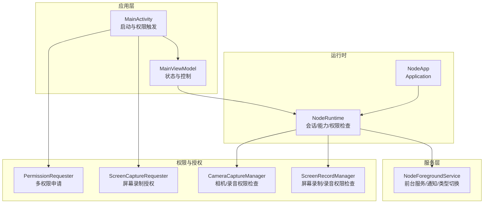
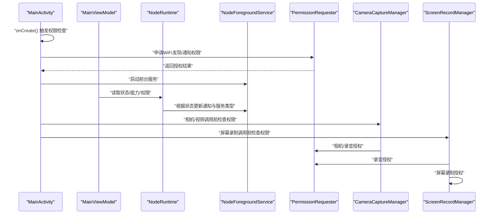
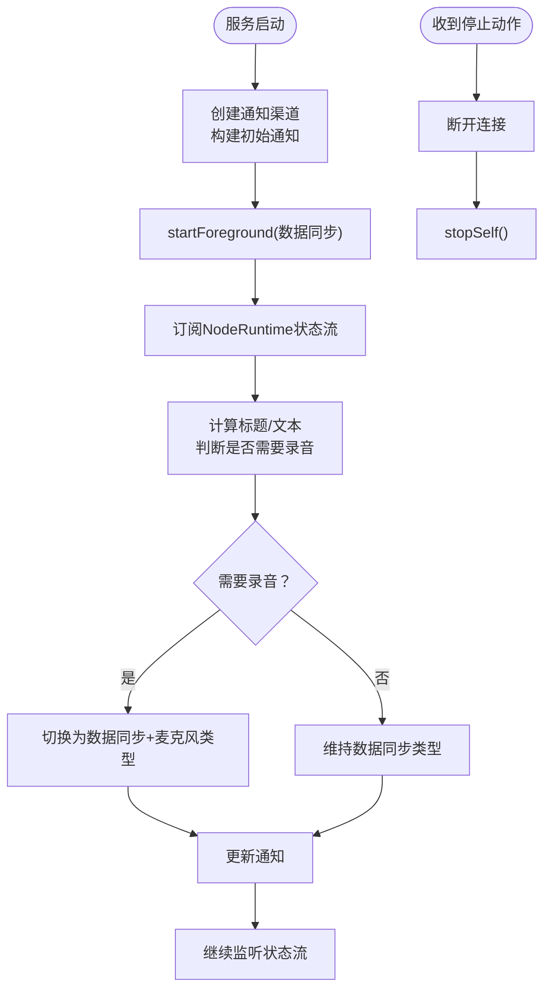
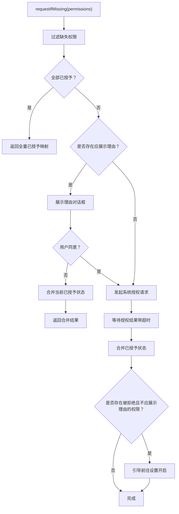
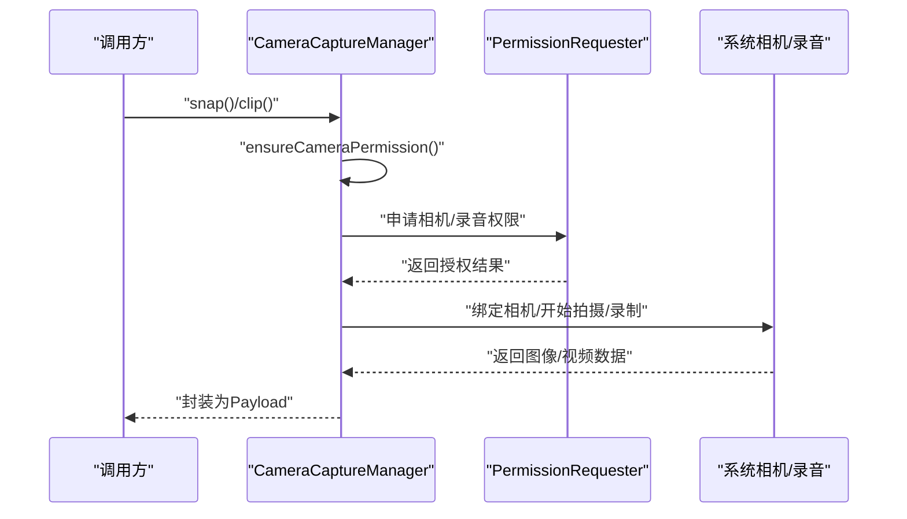
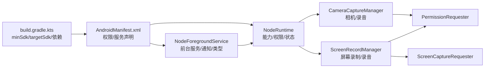

# 权限与服务

<cite>
**本文引用的文件**
- [AndroidManifest.xml](file://apps/android/app/src/main/AndroidManifest.xml)
- [NodeForegroundService.kt](file://apps/android/app/src/main/java/ai/openclaw/android/NodeForegroundService.kt)
- [PermissionRequester.kt](file://apps/android/app/src/main/java/ai/openclaw/android/PermissionRequester.kt)
- [MainActivity.kt](file://apps/android/app/src/main/java/ai/openclaw/android/MainActivity.kt)
- [MainViewModel.kt](file://apps/android/app/src/main/java/ai/openclaw/android/MainViewModel.kt)
- [NodeRuntime.kt](file://apps/android/app/src/main/java/ai/openclaw/android/NodeRuntime.kt)
- [NodeApp.kt](file://apps/android/app/src/main/java/ai/openclaw/android/NodeApp.kt)
- [ScreenCaptureRequester.kt](file://apps/android/app/src/main/java/ai/openclaw/android/ScreenCaptureRequester.kt)
- [CameraCaptureManager.kt](file://apps/android/app/src/main/java/ai/openclaw/android/node/CameraCaptureManager.kt)
- [ScreenRecordManager.kt](file://apps/android/app/src/main/java/ai/openclaw/android/node/ScreenRecordManager.kt)
- [build.gradle.kts](file://apps/android/app/build.gradle.kts)
</cite>

## 目录

1. [简介](#简介)
2. [项目结构](#项目结构)
3. [核心组件](#核心组件)
4. [架构总览](#架构总览)
5. [详细组件分析](#详细组件分析)
6. [依赖关系分析](#依赖关系分析)
7. [性能考量](#性能考量)
8. [故障排查指南](#故障排查指南)
9. [结论](#结论)

## 简介

本文件面向OpenClaw Android应用的“权限与服务”主题，系统性说明应用所需Android权限（WiFi发现、通知、相机、录音等），前台服务的实现与持久连接保持机制，权限申请流程、运行时权限处理与拒绝策略，以及服务生命周期管理、通知管理与后台执行限制的应对方案。内容基于仓库中Android模块的实际源码进行提炼与可视化，帮助开发者快速理解并维护相关功能。

## 项目结构

Android应用位于apps/android/app目录，核心权限与服务相关代码分布如下：

- 清单与权限：AndroidManifest.xml
- 应用入口与运行时：NodeApp.kt、NodeRuntime.kt
- 前台服务：NodeForegroundService.kt
- 权限申请与对话框：PermissionRequester.kt
- 屏幕录制授权：ScreenCaptureRequester.kt
- 节点能力调用与权限检查：CameraCaptureManager.kt、ScreenRecordManager.kt
- 主界面与权限触发：MainActivity.kt、MainViewModel.kt
- 构建配置：build.gradle.kts

图表来源

- [MainActivity.kt](file://apps/android/app/src/main/java/ai/openclaw/android/MainActivity.kt#L25-L131)
- [MainViewModel.kt](file://apps/android/app/src/main/java/ai/openclaw/android/MainViewModel.kt#L13-L175)
- [NodeApp.kt](file://apps/android/app/src/main/java/ai/openclaw/android/NodeApp.kt#L6-L27)
- [NodeRuntime.kt](file://apps/android/app/src/main/java/ai/openclaw/android/NodeRuntime.kt#L61-L1272)
- [NodeForegroundService.kt](file://apps/android/app/src/main/java/ai/openclaw/android/NodeForegroundService.kt#L23-L181)
- [PermissionRequester.kt](file://apps/android/app/src/main/java/ai/openclaw/android/PermissionRequester.kt#L22-L134)
- [ScreenCaptureRequester.kt](file://apps/android/app/src/main/java/ai/openclaw/android/ScreenCaptureRequester.kt#L20-L66)
- [CameraCaptureManager.kt](file://apps/android/app/src/main/java/ai/openclaw/android/node/CameraCaptureManager.kt#L37-L317)
- [ScreenRecordManager.kt](file://apps/android/app/src/main/java/ai/openclaw/android/node/ScreenRecordManager.kt#L16-L200)

章节来源

- [AndroidManifest.xml](file://apps/android/app/src/main/AndroidManifest.xml#L1-L50)
- [build.gradle.kts](file://apps/android/app/build.gradle.kts#L20-L26)

## 核心组件

- 权限清单与前台服务类型
  - 清单声明了网络、位置、通知、相机、录音、WiFi发现等权限，并在服务标签中声明前台服务类型（数据同步、麦克风、媒体投影）。
- 前台服务
  - 启动后创建通知渠道，初始以“数据同步”类型进入前台；当语音唤醒处于“始终”且具备录音权限时，动态切换到“数据同步+麦克风”类型，确保持续运行与录音权限可用。
- 权限申请器
  - 支持一次性申请多个权限，显示理由对话框，超时等待结果，合并已授予与新授予的结果；对被拒绝且不在“应展示理由”的场景，引导用户前往设置开启。
- 运行时权限检查与能力开关
  - NodeRuntime集中管理连接状态、能力列表与权限检查，按权限状态动态启用/禁用能力（如语音唤醒、相机、定位、短信等）。
- 节点能力调用
  - CameraCaptureManager与ScreenRecordManager在执行具体操作前进行权限检查，必要时通过PermissionRequester或ScreenCaptureRequester触发授权流程。

章节来源

- [AndroidManifest.xml](file://apps/android/app/src/main/AndroidManifest.xml#L1-L50)
- [NodeForegroundService.kt](file://apps/android/app/src/main/java/ai/openclaw/android/NodeForegroundService.kt#L23-L181)
- [PermissionRequester.kt](file://apps/android/app/src/main/java/ai/openclaw/android/PermissionRequester.kt#L22-L134)
- [NodeRuntime.kt](file://apps/android/app/src/main/java/ai/openclaw/android/NodeRuntime.kt#L572-L650)
- [CameraCaptureManager.kt](file://apps/android/app/src/main/java/ai/openclaw/android/node/CameraCaptureManager.kt#L51-L73)
- [ScreenRecordManager.kt](file://apps/android/app/src/main/java/ai/openclaw/android/node/ScreenRecordManager.kt#L127-L142)

## 架构总览

下图展示了从主界面到运行时、服务与权限系统的整体交互：

图表来源

- [MainActivity.kt](file://apps/android/app/src/main/java/ai/openclaw/android/MainActivity.kt#L30-L131)
- [MainViewModel.kt](file://apps/android/app/src/main/java/ai/openclaw/android/MainViewModel.kt#L13-L175)
- [NodeRuntime.kt](file://apps/android/app/src/main/java/ai/openclaw/android/NodeRuntime.kt#L305-L390)
- [NodeForegroundService.kt](file://apps/android/app/src/main/java/ai/openclaw/android/NodeForegroundService.kt#L29-L84)
- [PermissionRequester.kt](file://apps/android/app/src/main/java/ai/openclaw/android/PermissionRequester.kt#L33-L85)
- [CameraCaptureManager.kt](file://apps/android/app/src/main/java/ai/openclaw/android/node/CameraCaptureManager.kt#L51-L73)
- [ScreenRecordManager.kt](file://apps/android/app/src/main/java/ai/openclaw/android/node/ScreenRecordManager.kt#L30-L67)

## 详细组件分析

### 权限清单与前台服务类型

- 关键权限
  - 网络与状态：INTERNET、ACCESS_NETWORK_STATE
  - 前台服务：FOREGROUND_SERVICE、FOREGROUND_SERVICE_DATA_SYNC、FOREGROUND_SERVICE_MICROPHONE、FOREGROUND_SERVICE_MEDIA_PROJECTION
  - 通知：POST_NOTIFICATIONS（Android 13+）
  - WiFi发现：NEARBY_WIFI_DEVICES（同时声明neverForLocation）
  - 位置：ACCESS_FINE_LOCATION、ACCESS_COARSE_LOCATION、ACCESS_BACKGROUND_LOCATION
  - 摄像头：CAMERA
  - 录音：RECORD_AUDIO
  - 短信：SEND_SMS
- 前台服务类型
  - 服务声明foregroundServiceType包含dataSync、microphone、mediaProjection，满足后台数据同步、录音与屏幕录制需求。

章节来源

- [AndroidManifest.xml](file://apps/android/app/src/main/AndroidManifest.xml#L1-L50)

### 前台服务实现与通知管理

- 生命周期
  - onCreate：创建通知渠道、构建初始通知并以“数据同步”类型启动前台；订阅NodeRuntime的状态流，动态更新通知标题/文本与服务类型。
  - onStartCommand：接收停止动作，断开连接并自停；默认以“粘性重启”保持服务常驻。
  - onDestroy：取消协程作业，释放资源。
- 通知与服务类型切换
  - 当语音唤醒模式为“始终”且具备录音权限时，将服务类型切换为“数据同步+麦克风”，确保录音可用；否则仅“数据同步”。
  - 通知为常驻、仅提示一次、立即前台行为，点击打开主界面，提供“断开连接”快捷操作。

图表来源

- [NodeForegroundService.kt](file://apps/android/app/src/main/java/ai/openclaw/android/NodeForegroundService.kt#L29-L84)
- [NodeForegroundService.kt](file://apps/android/app/src/main/java/ai/openclaw/android/NodeForegroundService.kt#L138-L153)

章节来源

- [NodeForegroundService.kt](file://apps/android/app/src/main/java/ai/openclaw/android/NodeForegroundService.kt#L23-L181)

### 权限申请流程与拒绝处理策略

- 多权限申请
  - 使用ActivityResultContracts.RequestMultiplePermissions统一发起；支持超时等待与结果合并（若某权限之前已授予，视为已授予）。
- 理由对话框
  - 若存在“应展示理由”的权限（如位置），先弹窗解释用途，再发起系统授权。
- 设置引导
  - 对于被拒绝且不在“应展示理由”的权限，弹出引导对话框，跳转至应用详情页设置，便于用户手动开启。
- 超时与互斥
  - 采用Mutex保证并发安全；超时时间可配置，默认约20秒。

图表来源

- [PermissionRequester.kt](file://apps/android/app/src/main/java/ai/openclaw/android/PermissionRequester.kt#L33-L85)

章节来源

- [PermissionRequester.kt](file://apps/android/app/src/main/java/ai/openclaw/android/PermissionRequester.kt#L22-L134)

### 主界面权限触发与服务启动

- 启动阶段
  - onCreate中按需申请WiFi发现权限（Android 13+使用NEARBY_WIFI_DEVICES，否则使用FINE_LOCATION）与通知权限（Android 13+）。
  - 启动NodeForegroundService，确保连接保持与状态通知。
- 生命周期
  - onStart/onStop分别标记前台状态，影响NodeRuntime中的能力启用与定位策略。

章节来源

- [MainActivity.kt](file://apps/android/app/src/main/java/ai/openclaw/android/MainActivity.kt#L30-L131)

### 运行时权限检查与能力开关

- 统一入口
  - NodeRuntime集中管理所有能力与权限检查，结合状态流动态启用/禁用能力（如语音唤醒、相机、定位、短信、屏幕录制等）。
- 语音唤醒
  - 根据模式（关闭/仅前台/始终）与前台状态、外部音频占用决定是否启动；若无录音权限则停止并提示。
- 能力与命令
  - 根据权限与用户设置生成能力列表与可调用命令，避免在后台不可用或权限不足时发起调用。

章节来源

- [NodeRuntime.kt](file://apps/android/app/src/main/java/ai/openclaw/android/NodeRuntime.kt#L305-L390)
- [NodeRuntime.kt](file://apps/android/app/src/main/java/ai/openclaw/android/NodeRuntime.kt#L475-L487)
- [NodeRuntime.kt](file://apps/android/app/src/main/java/ai/openclaw/android/NodeRuntime.kt#L572-L598)

### 节点能力调用与权限前置检查

- 相机拍照/录像
  - 在snap/clip前检查相机权限；若包含音频则检查录音权限；通过PermissionRequester触发授权。
- 屏幕录制
  - 先通过ScreenCaptureRequester获取屏幕捕获授权，再检查录音权限（如需），随后使用MediaProjection录制屏幕并编码MP4。
- 错误处理
  - 对未授权、超时、失败等情况抛出明确错误码与消息，便于上层提示与日志追踪。

图表来源

- [CameraCaptureManager.kt](file://apps/android/app/src/main/java/ai/openclaw/android/node/CameraCaptureManager.kt#L75-L198)
- [PermissionRequester.kt](file://apps/android/app/src/main/java/ai/openclaw/android/PermissionRequester.kt#L33-L85)

章节来源

- [CameraCaptureManager.kt](file://apps/android/app/src/main/java/ai/openclaw/android/node/CameraCaptureManager.kt#L51-L73)
- [ScreenRecordManager.kt](file://apps/android/app/src/main/java/ai/openclaw/android/node/ScreenRecordManager.kt#L30-L67)

### 屏幕录制授权流程

- 授权前置
  - 通过ScreenCaptureRequester弹出理由对话框，确认后启动系统屏幕捕获意图，等待用户选择目标窗口/屏幕。
- 录制过程
  - 获取MediaProjection后创建VirtualDisplay，使用MediaRecorder录制视频；如需音频则配置AudioSource并编码AAC。
- 权限检查
  - 录制过程中如需音频，再次检查录音权限并通过PermissionRequester触发授权。

章节来源

- [ScreenCaptureRequester.kt](file://apps/android/app/src/main/java/ai/openclaw/android/ScreenCaptureRequester.kt#L38-L51)
- [ScreenRecordManager.kt](file://apps/android/app/src/main/java/ai/openclaw/android/node/ScreenRecordManager.kt#L127-L142)

## 依赖关系分析

- 构建与SDK
  - minSdk 31，targetSdk 36；Compose、CameraX、Kotlin协程等依赖引入。
- 权限与服务耦合
  - NodeForegroundService依赖NodeRuntime状态流驱动通知与服务类型；NodeRuntime依赖系统权限API与设备能力；各节点管理器依赖PermissionRequester与ScreenCaptureRequester进行授权。

图表来源

- [build.gradle.kts](file://apps/android/app/build.gradle.kts#L20-L26)
- [AndroidManifest.xml](file://apps/android/app/src/main/AndroidManifest.xml#L1-L50)
- [NodeForegroundService.kt](file://apps/android/app/src/main/java/ai/openclaw/android/NodeForegroundService.kt#L23-L181)
- [NodeRuntime.kt](file://apps/android/app/src/main/java/ai/openclaw/android/NodeRuntime.kt#L61-L1272)
- [CameraCaptureManager.kt](file://apps/android/app/src/main/java/ai/openclaw/android/node/CameraCaptureManager.kt#L37-L317)
- [ScreenRecordManager.kt](file://apps/android/app/src/main/java/ai/openclaw/android/node/ScreenRecordManager.kt#L16-L200)
- [PermissionRequester.kt](file://apps/android/app/src/main/java/ai/openclaw/android/PermissionRequester.kt#L22-L134)
- [ScreenCaptureRequester.kt](file://apps/android/app/src/main/java/ai/openclaw/android/ScreenCaptureRequester.kt#L20-L66)

章节来源

- [build.gradle.kts](file://apps/android/app/build.gradle.kts#L20-L26)

## 性能考量

- 协程与状态流
  - 使用combine/collect组合状态流，避免频繁重建通知；仅在服务类型变化时重新startForeground，减少系统开销。
- 录制参数
  - 屏幕录制比特率估算与帧率范围约束，避免过高导致CPU/GPU压力过大；图像压缩与最大载荷限制防止传输超限。
- 前台服务类型
  - 按需切换服务类型，仅在需要录音时携带麦克风类型，降低系统与用户感知的功耗与打扰。

章节来源

- [NodeForegroundService.kt](file://apps/android/app/src/main/java/ai/openclaw/android/NodeForegroundService.kt#L138-L153)
- [ScreenRecordManager.kt](file://apps/android/app/src/main/java/ai/openclaw/android/node/ScreenRecordManager.kt#L194-L198)
- [CameraCaptureManager.kt](file://apps/android/app/src/main/java/ai/openclaw/android/node/CameraCaptureManager.kt#L106-L136)

## 故障排查指南

- 无法启动前台服务
  - 检查通知权限（Android 13+）与服务类型声明；确认通知渠道已创建且通知构建成功。
- 录音权限未生效
  - 确认NodeForegroundService已切换为“数据同步+麦克风”类型；检查NodeRuntime中语音唤醒模式与录音权限状态。
- 相机/屏幕录制失败
  - 检查对应权限是否被拒绝且未触发授权；确认ScreenCaptureRequester的授权流程已完成；查看节点管理器异常分支的错误码与消息。
- 权限被永久拒绝
  - 通过PermissionRequester的设置引导对话框跳转至系统设置页面，指导用户手动开启。

章节来源

- [NodeForegroundService.kt](file://apps/android/app/src/main/java/ai/openclaw/android/NodeForegroundService.kt#L138-L153)
- [PermissionRequester.kt](file://apps/android/app/src/main/java/ai/openclaw/android/PermissionRequester.kt#L100-L114)
- [CameraCaptureManager.kt](file://apps/android/app/src/main/java/ai/openclaw/android/node/CameraCaptureManager.kt#L51-L73)
- [ScreenRecordManager.kt](file://apps/android/app/src/main/java/ai/openclaw/android/node/ScreenRecordManager.kt#L30-L67)

## 结论

OpenClaw Android应用通过清晰的权限清单、前台服务与运行时权限检查机制，实现了稳定的后台连接与多媒体能力调用。权限申请采用统一的PermissionRequester与ScreenCaptureRequester，配合NodeRuntime的能力开关与NodeForegroundService的通知与服务类型动态切换，有效平衡用户体验与系统限制。建议在后续版本中持续关注Android平台权限政策变化，完善权限说明与用户引导，提升授权成功率与稳定性。
