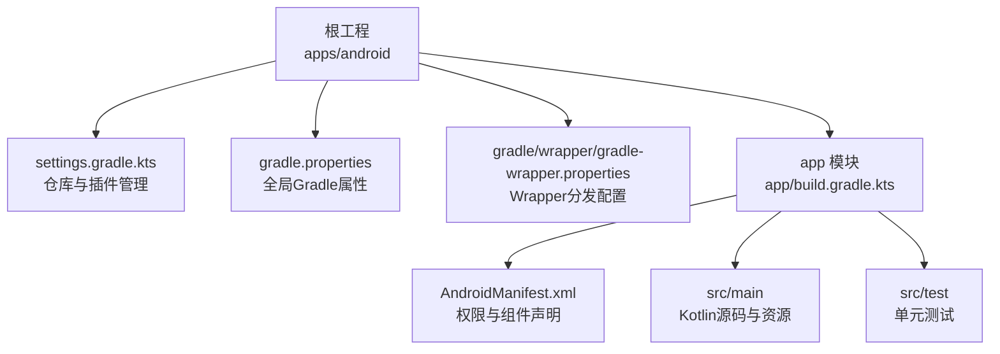
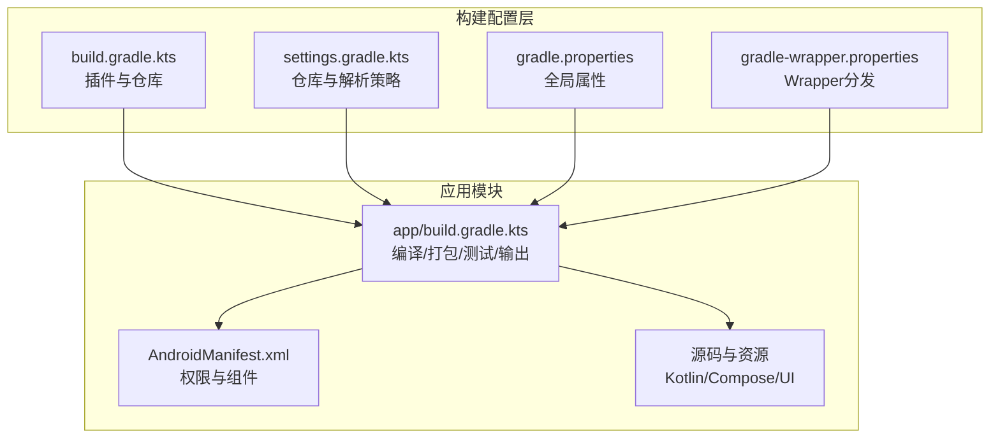
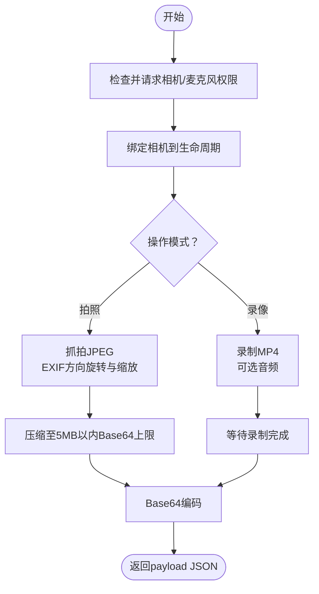
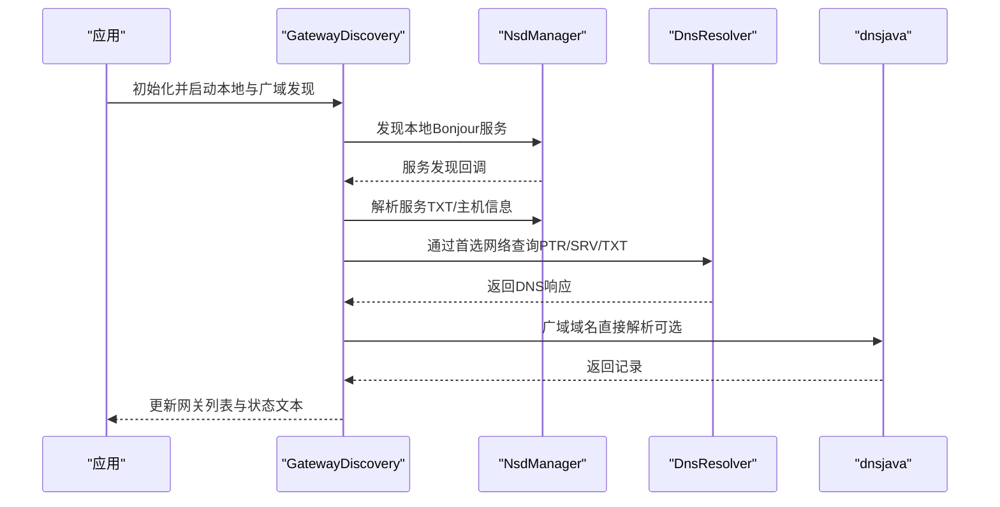

# 构建配置

<cite>
**本文档引用的文件**
- [apps/android/build.gradle.kts](file://apps/android/build.gradle.kts)
- [apps/android/settings.gradle.kts](file://apps/android/settings.gradle.kts)
- [apps/android/gradle.properties](file://apps/android/gradle.properties)
- [apps/android/gradle/wrapper/gradle-wrapper.properties](file://apps/android/gradle/wrapper/gradle-wrapper.properties)
- [apps/android/app/build.gradle.kts](file://apps/android/app/build.gradle.kts)
- [apps/android/app/src/main/AndroidManifest.xml](file://apps/android/app/src/main/AndroidManifest.xml)
- [apps/android/app/src/main/java/ai/openclaw/android/MainActivity.kt](file://apps/android/app/src/main/java/ai/openclaw/android/MainActivity.kt)
- [apps/android/app/src/main/java/ai/openclaw/android/NodeApp.kt](file://apps/android/app/src/main/java/ai/openclaw/android/NodeApp.kt)
- [apps/android/app/src/main/java/ai/openclaw/android/node/CameraCaptureManager.kt](file://apps/android/app/src/main/java/ai/openclaw/android/node/CameraCaptureManager.kt)
- [apps/android/app/src/main/java/ai/openclaw/android/gateway/GatewayDiscovery.kt](file://apps/android/app/src/main/java/ai/openclaw/android/gateway/GatewayDiscovery.kt)
</cite>

## 目录

1. [简介](#简介)
2. [项目结构](#项目结构)
3. [核心组件](#核心组件)
4. [架构总览](#架构总览)
5. [详细组件分析](#详细组件分析)
6. [依赖分析](#依赖分析)
7. [性能考虑](#性能考虑)
8. [故障排查指南](#故障排查指南)
9. [结论](#结论)
10. [附录](#附录)

## 简介

本文件面向OpenClaw Android应用的构建配置，系统性说明Gradle构建体系在本仓库中的组织方式与关键参数，覆盖以下主题：

- Gradle构建系统配置：插件声明、仓库管理、全局属性
- 模块结构与依赖：根工程、settings与app模块、依赖解析策略
- 版本控制与兼容性：compileSdk、targetSdk、minSdk、Java版本、Kotlin版本
- 第三方库集成：Compose、Material、CameraX、OkHttp、Kotlinx等
- 构建命令、调试配置与测试设置
- 构建环境要求、SDK路径配置与常见问题处理

## 项目结构

Android应用位于apps/android目录下，采用单模块结构（仅包含app模块），使用Kotlin DSL的build.gradle.kts进行配置。

图表来源

- [apps/android/settings.gradle.kts](file://apps/android/settings.gradle.kts#L1-L19)
- [apps/android/gradle.properties](file://apps/android/gradle.properties#L1-L5)
- [apps/android/gradle/wrapper/gradle-wrapper.properties](file://apps/android/gradle/wrapper/gradle-wrapper.properties#L1-L8)
- [apps/android/app/build.gradle.kts](file://apps/android/app/build.gradle.kts#L1-L129)
- [apps/android/app/src/main/AndroidManifest.xml](file://apps/android/app/src/main/AndroidManifest.xml#L1-L50)

章节来源

- [apps/android/settings.gradle.kts](file://apps/android/settings.gradle.kts#L1-L19)
- [apps/android/gradle.properties](file://apps/android/gradle.properties#L1-L5)
- [apps/android/gradle/wrapper/gradle-wrapper.properties](file://apps/android/gradle/wrapper/gradle-wrapper.properties#L1-L8)
- [apps/android/app/build.gradle.kts](file://apps/android/app/build.gradle.kts#L1-L129)

## 核心组件

- 插件与工具链
  - 应用级插件：com.android.application、org.jetbrains.kotlin.android、org.jetbrains.kotlin.plugin.compose、org.jetbrains.kotlin.plugin.serialization
  - 版本：Android Gradle Plugin 8.13.2；Kotlin 2.2.21；Compose Kotlin插件2.2.21；Serialization插件2.2.21
- 仓库与解析
  - 插件仓库：google、mavenCentral、gradlePluginPortal
  - 依赖仓库：google、mavenCentral；禁止项目级仓库覆盖策略
- 全局属性
  - JVM内存、警告级别、AndroidX启用、非传递性R类
- Wrapper
  - Gradle 9.2.1 分发包

章节来源

- [apps/android/build.gradle.kts](file://apps/android/build.gradle.kts#L1-L7)
- [apps/android/settings.gradle.kts](file://apps/android/settings.gradle.kts#L1-L19)
- [apps/android/gradle.properties](file://apps/android/gradle.properties#L1-L5)
- [apps/android/gradle/wrapper/gradle-wrapper.properties](file://apps/android/gradle/wrapper/gradle-wrapper.properties#L1-L8)

## 架构总览

Android应用模块的构建配置围绕“单模块、多插件、集中仓库”的模式组织，通过Kotlin DSL统一声明编译选项、打包规则、测试配置与输出命名。

图表来源

- [apps/android/build.gradle.kts](file://apps/android/build.gradle.kts#L1-L7)
- [apps/android/settings.gradle.kts](file://apps/android/settings.gradle.kts#L1-L19)
- [apps/android/gradle.properties](file://apps/android/gradle.properties#L1-L5)
- [apps/android/gradle/wrapper/gradle-wrapper.properties](file://apps/android/gradle/wrapper/gradle-wrapper.properties#L1-L8)
- [apps/android/app/build.gradle.kts](file://apps/android/app/build.gradle.kts#L1-L129)
- [apps/android/app/src/main/AndroidManifest.xml](file://apps/android/app/src/main/AndroidManifest.xml#L1-L50)

## 详细组件分析

### Gradle根配置与仓库管理

- 插件管理：通过pluginManagement集中声明google、mavenCentral、gradlePluginPortal
- 依赖解析：dependencyResolutionManagement将仓库模式设为FAIL_ON_PROJECT_REPOS，确保所有仓库来自统一配置
- 工程名与模块：rootProject.name为OpenClawNodeAndroid，包含app模块

章节来源

- [apps/android/settings.gradle.kts](file://apps/android/settings.gradle.kts#L1-L19)

### Gradle属性与Wrapper

- gradle.properties
  - JVM参数与警告级别
  - 启用AndroidX与非传递性R类
- gradle-wrapper.properties
  - 使用Gradle 9.2.1分发包

章节来源

- [apps/android/gradle.properties](file://apps/android/gradle.properties#L1-L5)
- [apps/android/gradle/wrapper/gradle-wrapper.properties](file://apps/android/gradle/wrapper/gradle-wrapper.properties#L1-L8)

### 应用模块构建脚本（app/build.gradle.kts）

- 命名空间与SDK
  - namespace：ai.openclaw.android
  - compileSdk：36
  - minSdk：31
  - targetSdk：36
- 资源与资产
  - 将共享资源目录加入assets源集
- 默认配置
  - applicationId：ai.openclaw.android
  - versionCode/versionName：按日期编码
- 构建类型
  - release：禁用混淆
- 构建特性
  - Compose与BuildConfig启用
- 编译选项
  - Java 17兼容性
- 打包排除
  - META-INF许可证条目排除
- Lint
  - 禁用特定规则，开启错误即停止
- 测试
  - 单元测试包含Android资源
- 输出重命名
  - 变体输出文件名包含版本号与构建类型
- Kotlin编译器
  - JVM目标17，全部警告视为错误

章节来源

- [apps/android/app/build.gradle.kts](file://apps/android/app/build.gradle.kts#L1-L129)

### Android清单与运行时入口

- 权限与特性
  - 网络、定位、相机、麦克风、短信、通知、近场WiFi设备等
  - 配置网络明文策略以适配受信任内网场景
- 应用入口
  - Application类NodeApp中初始化NodeRuntime，并在DEBUG模式启用StrictMode
  - Activity入口MainActivity负责沉浸式窗口、权限请求、前台服务启动与Compose UI渲染

章节来源

- [apps/android/app/src/main/AndroidManifest.xml](file://apps/android/app/src/main/AndroidManifest.xml#L1-L50)
- [apps/android/app/src/main/java/ai/openclaw/android/NodeApp.kt](file://apps/android/app/src/main/java/ai/openclaw/android/NodeApp.kt#L1-L27)
- [apps/android/app/src/main/java/ai/openclaw/android/MainActivity.kt](file://apps/android/app/src/main/java/ai/openclaw/android/MainActivity.kt#L1-L131)

### 关键流程图：相机拍摄与视频录制

图表来源

- [apps/android/app/src/main/java/ai/openclaw/android/node/CameraCaptureManager.kt](file://apps/android/app/src/main/java/ai/openclaw/android/node/CameraCaptureManager.kt#L75-L198)

### 关键序列图：网关发现与DNS解析

图表来源

- [apps/android/app/src/main/java/ai/openclaw/android/gateway/GatewayDiscovery.kt](file://apps/android/app/src/main/java/ai/openclaw/android/gateway/GatewayDiscovery.kt#L99-L193)

## 依赖分析

- Compose依赖通过BOM统一版本，涵盖UI、预览、Material3、导航等
- 核心运行时：core-ktx、lifecycle-runtime-ktx、activity-compose、webkit
- UI与设计：material组件、navigation-compose
- 协程与序列化：kotlinx-coroutines-android、kotlinx-serialization-json
- 安全与媒体：security-crypto、exifinterface
- 网络：okhttp
- 摄像头：camera-core/camera-camera2/camera-lifecycle/camera-video/camera-view
- DNS：dnsjava
- 测试：junit、kotest、coroutines-test、robolectric、junit-vintage

章节来源

- [apps/android/app/build.gradle.kts](file://apps/android/app/build.gradle.kts#L80-L124)

## 性能考虑

- 构建性能
  - 合理设置JVM内存参数，避免频繁GC
  - 使用Compose BOM统一版本，减少版本冲突导致的重复依赖
  - 关闭release混淆以提升发布速度（当前未启用）
- 运行时性能
  - 相机拍摄前先请求权限，避免主线程阻塞
  - 录制视频时限制最大等待时间，防止资源泄漏
  - 使用EXIF方向旋转与按需缩放，降低传输体积

## 故障排查指南

- 构建失败（仓库或插件）
  - 确认settings中仓库可用且顺序正确
  - 确认gradle-wrapper使用受支持的Gradle版本
- SDK不匹配
  - minSdk 31、targetSdk 36与compileSdk 36需与设备/CI环境一致
- 权限相关崩溃
  - 确保在运行时请求相机、录音、位置、通知等敏感权限
- 明文网络访问
  - 在受信任内网场景允许明文流量，生产环境谨慎开放
- 测试失败
  - 确保单元测试包含Android资源，使用Junit平台运行器

章节来源

- [apps/android/app/src/main/AndroidManifest.xml](file://apps/android/app/src/main/AndroidManifest.xml#L1-L50)
- [apps/android/app/src/main/java/ai/openclaw/android/MainActivity.kt](file://apps/android/app/src/main/java/ai/openclaw/android/MainActivity.kt#L97-L129)
- [apps/android/app/build.gradle.kts](file://apps/android/app/build.gradle.kts#L50-L58)

## 结论

本项目的Android构建配置采用简洁明确的单模块结构，通过Kotlin DSL统一管理插件、仓库与编译参数，配合严格的版本与测试策略，确保在现代Android平台上稳定运行。建议在团队协作中保持Gradle版本与依赖版本的一致性，并持续优化测试覆盖率与构建缓存命中率。

## 附录

### 构建命令与调试

- 常用命令
  - ./gradlew assembleDebug
  - ./gradlew assembleRelease
  - ./gradlew test
  - ./gradlew connectedAndroidTest
- 调试
  - Debug构建启用WebView调试、StrictMode日志
  - 使用Compose预览与工具进行UI调试
  - 通过日志与状态流观察网关发现过程

章节来源

- [apps/android/app/src/main/java/ai/openclaw/android/NodeApp.kt](file://apps/android/app/src/main/java/ai/openclaw/android/NodeApp.kt#L11-L24)
- [apps/android/app/src/main/java/ai/openclaw/android/MainActivity.kt](file://apps/android/app/src/main/java/ai/openclaw/android/MainActivity.kt#L30-L65)

### 版本与兼容性对照

- compileSdk：36
- targetSdk：36
- minSdk：31
- Java语言级别：17
- Kotlin编译目标：JVM_17
- Android Gradle Plugin：8.13.2
- Kotlin：2.2.21
- Gradle Wrapper：9.2.1

章节来源

- [apps/android/app/build.gradle.kts](file://apps/android/app/build.gradle.kts#L10-L42)
- [apps/android/build.gradle.kts](file://apps/android/build.gradle.kts#L1-L7)
- [apps/android/gradle/wrapper/gradle-wrapper.properties](file://apps/android/gradle/wrapper/gradle-wrapper.properties#L1-L8)
