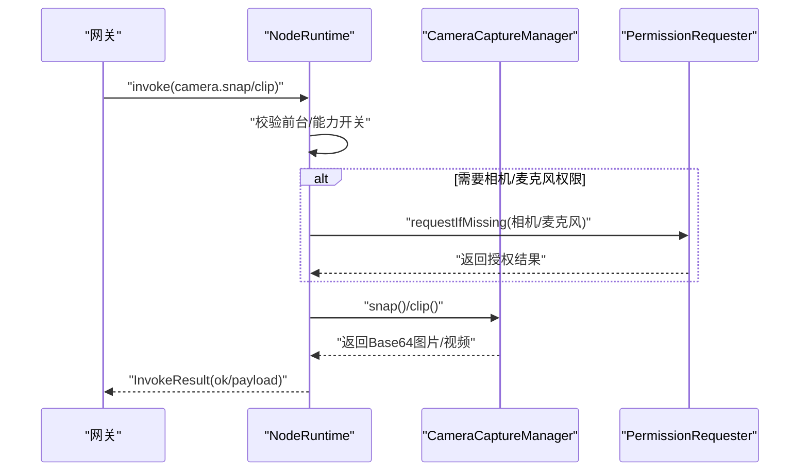
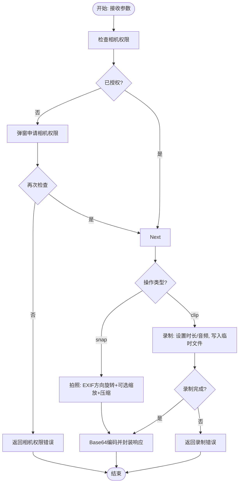
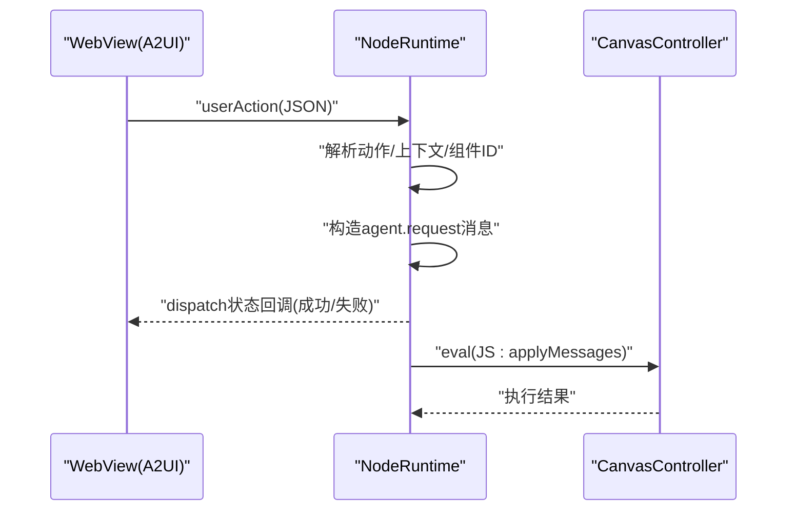
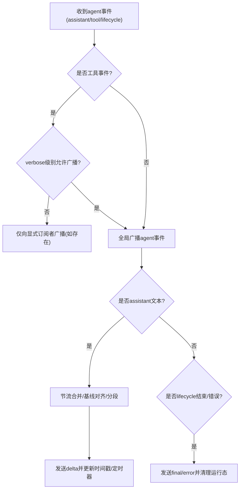
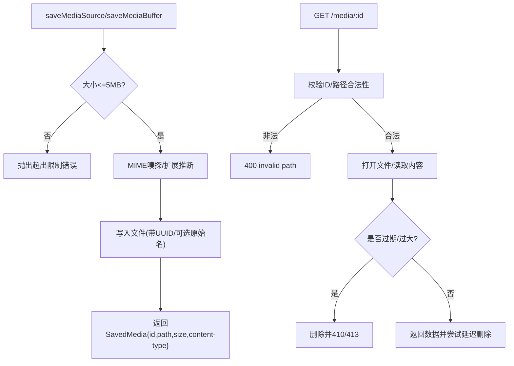
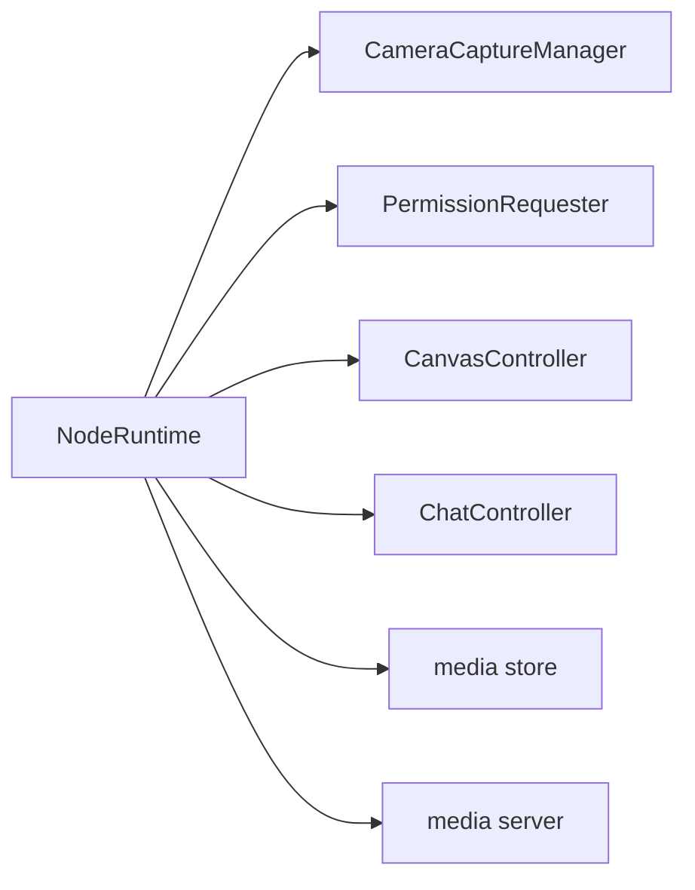

# 核心功能

<cite>
**本文引用的文件**
- [apps/android/app/src/main/java/ai/openclaw/android/node/CameraCaptureManager.kt](file://apps/android/app/src/main/java/ai/openclaw/android/node/CameraCaptureManager.kt)
- [apps/android/app/src/main/java/ai/openclaw/android/PermissionRequester.kt](file://apps/android/app/src/main/java/ai/openclaw/android/PermissionRequester.kt)
- [apps/android/app/src/main/java/ai/openclaw/android/NodeRuntime.kt](file://apps/android/app/src/main/java/ai/openclaw/android/NodeRuntime.kt)
- [apps/shared/OpenClawKit/Sources/OpenClawKit/CanvasCommands.swift](file://apps/shared/OpenClawKit/Sources/OpenClawKit/CanvasCommands.swift)
- [src/gateway/server-chat.ts](file://src/gateway/server-chat.ts)
- [src/media/store.ts](file://src/media/store.ts)
- [src/media/server.ts](file://src/media/server.ts)
</cite>

## 目录

1. [简介](#简介)
2. [项目结构](#项目结构)
3. [核心组件](#核心组件)
4. [架构总览](#架构总览)
5. [详细组件分析](#详细组件分析)
6. [依赖关系分析](#依赖关系分析)
7. [性能考量](#性能考量)
8. [故障排查指南](#故障排查指南)
9. [结论](#结论)
10. [附录：使用示例与最佳实践](#附录使用示例与最佳实践)

## 简介

本文件面向OpenClaw Android应用，系统化梳理并说明以下核心功能的实现与使用：

- 相机能力：camera.snap（拍照）与 camera.clip（录制短视频）的权限处理、图像捕获与视频录制流程
- Canvas可视化与交互：Canvas命令体系、A2UI动作桥接、手势与状态反馈
- 聊天功能：会话管理、消息同步与工具事件广播机制
- 媒体处理、文件存储与缓存策略：本地媒体目录、下载与保存、过期清理
- 平台兼容性与限制：Android权限模型、前台约束、后台限制等

## 项目结构

Android端核心入口为NodeRuntime，负责：

- 注册可调用命令（含Canvas、Camera、Screen、Location、Sms）
- 处理来自网关的invoke请求
- 维护会话状态与UI状态流
- 通过PermissionRequester进行运行时权限申请

```mermaid
graph TB
subgraph "Android 应用"
NR["NodeRuntime<br/>命令分发与状态管理"]
CAM["CameraCaptureManager<br/>相机拍摄/录制"]
PERM["PermissionRequester<br/>权限申请与提示"]
CAN["CanvasController<br/>Canvas控制"]
CHAT["ChatController<br/>聊天控制器"]
end
subgraph "网关/Gateway"
GW["GatewaySession<br/>连接/事件/调用"]
end
NR --> CAM
NR --> PERM
NR --> CAN
NR --> CHAT
NR <- --> GW
```

图表来源

- [apps/android/app/src/main/java/ai/openclaw/android/NodeRuntime.kt](file://apps/android/app/src/main/java/ai/openclaw/android/NodeRuntime.kt#L61-L120)
- [apps/android/app/src/main/java/ai/openclaw/android/node/CameraCaptureManager.kt](file://apps/android/app/src/main/java/ai/openclaw/android/node/CameraCaptureManager.kt#L37-L49)
- [apps/android/app/src/main/java/ai/openclaw/android/PermissionRequester.kt](file://apps/android/app/src/main/java/ai/openclaw/android/PermissionRequester.kt#L22-L32)

章节来源

- [apps/android/app/src/main/java/ai/openclaw/android/NodeRuntime.kt](file://apps/android/app/src/main/java/ai/openclaw/android/NodeRuntime.kt#L61-L120)

## 核心组件

- 相机命令与执行
  - NodeRuntime在前台约束下分发camera.\*命令；camera.snap与camera.clip分别委托给CameraCaptureManager执行
  - 权限检查：相机与麦克风权限缺失时通过PermissionRequester弹窗引导授权
- Canvas命令与A2UI桥接
  - 支持canvas.present/navigate/eval/snapshot等命令；NodeRuntime将A2UI消息解码后注入Canvas
  - Android侧对Canvas状态进行调试展示与HUD反馈
- 聊天与会话
  - NodeRuntime维护聊天状态流与会话键；服务端通过server-chat.ts构建聊天运行态、节流与最终态广播
- 媒体存储与服务
  - 本地媒体目录、下载与保存、过期清理；媒体服务提供单次读取与自动删除

章节来源

- [apps/android/app/src/main/java/ai/openclaw/android/NodeRuntime.kt](file://apps/android/app/src/main/java/ai/openclaw/android/NodeRuntime.kt#L828-L1062)
- [apps/shared/OpenClawKit/Sources/OpenClawKit/CanvasCommands.swift](file://apps/shared/OpenClawKit/Sources/OpenClawKit/CanvasCommands.swift#L3-L9)
- [src/gateway/server-chat.ts](file://src/gateway/server-chat.ts#L108-L143)
- [src/media/store.ts](file://src/media/store.ts#L57-L83)
- [src/media/server.ts](file://src/media/server.ts#L28-L89)

## 架构总览

Android端通过NodeRuntime统一接收网关指令，按命令类型路由到对应子系统；相机与Canvas均需在前台可用且满足权限条件。



图表来源

- [apps/android/app/src/main/java/ai/openclaw/android/NodeRuntime.kt](file://apps/android/app/src/main/java/ai/openclaw/android/NodeRuntime.kt#L828-L1062)
- [apps/android/app/src/main/java/ai/openclaw/android/node/CameraCaptureManager.kt](file://apps/android/app/src/main/java/ai/openclaw/android/node/CameraCaptureManager.kt#L75-L137)
- [apps/android/app/src/main/java/ai/openclaw/android/PermissionRequester.kt](file://apps/android/app/src/main/java/ai/openclaw/android/PermissionRequester.kt#L33-L85)

## 详细组件分析

### 相机功能：camera.snap 与 camera.clip

- 权限处理
  - 相机权限：若未授予，通过PermissionRequester弹窗说明并等待用户确认
  - 录制视频含音频：额外检查麦克风权限，必要时同样弹窗引导
- 拍照（camera.snap）
  - 选择前置/后置摄像头，绑定生命周期
  - 捕获JPEG并读取EXIF方向信息，按方向旋转位图
  - 可选缩放与质量压缩，确保整体负载不超过5MB（Base64膨胀约1.33倍）
  - 返回格式、Base64、宽高
- 录制（camera.clip）
  - 绑定生命周期并创建临时MP4输出
  - 支持设置时长、是否包含音频
  - 录制完成后读取文件字节，转Base64返回，包含时长与音频标记
- 错误处理
  - 相机不可用、权限拒绝、录制超时或失败均抛出带前缀的错误字符串，便于上层识别与提示



图表来源

- [apps/android/app/src/main/java/ai/openclaw/android/node/CameraCaptureManager.kt](file://apps/android/app/src/main/java/ai/openclaw/android/node/CameraCaptureManager.kt#L51-L73)
- [apps/android/app/src/main/java/ai/openclaw/android/node/CameraCaptureManager.kt](file://apps/android/app/src/main/java/ai/openclaw/android/node/CameraCaptureManager.kt#L75-L137)
- [apps/android/app/src/main/java/ai/openclaw/android/node/CameraCaptureManager.kt](file://apps/android/app/src/main/java/ai/openclaw/android/node/CameraCaptureManager.kt#L140-L198)

章节来源

- [apps/android/app/src/main/java/ai/openclaw/android/node/CameraCaptureManager.kt](file://apps/android/app/src/main/java/ai/openclaw/android/node/CameraCaptureManager.kt#L51-L137)
- [apps/android/app/src/main/java/ai/openclaw/android/node/CameraCaptureManager.kt](file://apps/android/app/src/main/java/ai/openclaw/android/node/CameraCaptureManager.kt#L140-L198)
- [apps/android/app/src/main/java/ai/openclaw/android/PermissionRequester.kt](file://apps/android/app/src/main/java/ai/openclaw/android/PermissionRequester.kt#L33-L85)

### Canvas可视化与手势处理

- 命令体系
  - 支持present/hide/navigate/eval/snapshot等命令；NodeRuntime在前台可用时才允许执行
  - Android侧通过CanvasController解析参数并执行导航/脚本/快照
- A2UI动作桥接
  - NodeRuntime从WebView接收A2UI动作，解析为agent.request消息发送至节点
  - 支持Push/PushJSONL两种消息格式，内部进行版本校验与字段校验
  - 通过JS注入将消息应用到Canvas宿主环境
- 手势与状态
  - NodeRuntime提供HUD状态（拍照/录制/成功/错误），并在前台切换时更新Canvas调试状态



图表来源

- [apps/android/app/src/main/java/ai/openclaw/android/NodeRuntime.kt](file://apps/android/app/src/main/java/ai/openclaw/android/NodeRuntime.kt#L652-L722)
- [apps/android/app/src/main/java/ai/openclaw/android/NodeRuntime.kt](file://apps/android/app/src/main/java/ai/openclaw/android/NodeRuntime.kt#L920-L942)
- [apps/shared/OpenClawKit/Sources/OpenClawKit/CanvasCommands.swift](file://apps/shared/OpenClawKit/Sources/OpenClawKit/CanvasCommands.swift#L3-L9)

章节来源

- [apps/android/app/src/main/java/ai/openclaw/android/NodeRuntime.kt](file://apps/android/app/src/main/java/ai/openclaw/android/NodeRuntime.kt#L857-L903)
- [apps/android/app/src/main/java/ai/openclaw/android/NodeRuntime.kt](file://apps/android/app/src/main/java/ai/openclaw/android/NodeRuntime.kt#L1142-L1199)

### 聊天功能：会话管理与消息同步

- 会话键与状态
  - NodeRuntime维护main会话键、聊天消息列表、思考级别、待处理工具调用等状态流
  - 支持加载/刷新会话、切换会话、中止当前运行
- 服务端事件处理
  - server-chat.ts定义聊天运行态（缓冲区、节流定时器、已完成片段等）
  - 对助手文本进行节流合并，支持工具调用检测与分段广播
  - 最终态（完成/错误）清理运行态并通知UI
- 心跳抑制与广播
  - 根据配置决定是否抑制心跳类广播，避免噪声



图表来源

- [src/gateway/server-chat.ts](file://src/gateway/server-chat.ts#L258-L379)
- [src/gateway/server-chat.ts](file://src/gateway/server-chat.ts#L381-L438)
- [src/gateway/server-chat.ts](file://src/gateway/server-chat.ts#L462-L571)

章节来源

- [src/gateway/server-chat.ts](file://src/gateway/server-chat.ts#L108-L143)
- [src/gateway/server-chat.ts](file://src/gateway/server-chat.ts#L258-L379)
- [src/gateway/server-chat.ts](file://src/gateway/server-chat.ts#L381-L438)

### 媒体处理、文件存储与缓存策略

- 存储目录与清理
  - 默认媒体目录位于配置目录下的“media”；启动时确保目录存在
  - 定期清理超过TTL（默认2分钟）的文件；支持手动清理
- 下载与保存
  - 支持HTTP/HTTPS下载，最大5MB；下载过程中进行MIME嗅探与扩展推断
  - 本地路径直接复制，严格限制大小
- 媒体服务
  - 提供GET /media/:id接口，单次读取后尝试删除；对非法路径/过期/过大进行相应状态码处理
  - 后台定时任务清理过期文件



图表来源

- [src/media/store.ts](file://src/media/store.ts#L170-L209)
- [src/media/store.ts](file://src/media/store.ts#L211-L242)
- [src/media/server.ts](file://src/media/server.ts#L35-L83)

章节来源

- [src/media/store.ts](file://src/media/store.ts#L57-L83)
- [src/media/store.ts](file://src/media/store.ts#L170-L209)
- [src/media/server.ts](file://src/media/server.ts#L28-L89)

## 依赖关系分析

- NodeRuntime对各子系统的依赖
  - 相机：CameraCaptureManager、PermissionRequester
  - Canvas：CanvasController、OpenClawCanvasCommand
  - 聊天：ChatController、server-chat.ts运行态
  - 媒体：media store/server
- 前台约束与能力开关
  - NodeRuntime在处理Canvas/Camera/Screen命令前检查isForeground与能力开关，避免后台不可用



图表来源

- [apps/android/app/src/main/java/ai/openclaw/android/NodeRuntime.kt](file://apps/android/app/src/main/java/ai/openclaw/android/NodeRuntime.kt#L61-L120)
- [src/media/store.ts](file://src/media/store.ts#L57-L65)
- [src/media/server.ts](file://src/media/server.ts#L91-L106)

章节来源

- [apps/android/app/src/main/java/ai/openclaw/android/NodeRuntime.kt](file://apps/android/app/src/main/java/ai/openclaw/android/NodeRuntime.kt#L828-L855)

## 性能考量

- 相机
  - Base64膨胀：payload上限5MB，编码前对字节数做上限估算，避免超限
  - 图像压缩采用二分/试错策略，优先保证尺寸与质量平衡
- Canvas
  - A2UI消息批量注入，先检查宿主就绪再导航，减少无效渲染
- 聊天
  - 助手文本节流（150ms窗口）+ 尾部触发，兼顾实时性与吞吐
- 媒体
  - 下载阶段限制最大体积，避免内存压力；单次读取后尽快删除，降低磁盘占用

## 故障排查指南

- 相机/录制失败
  - 检查权限：相机/麦克风是否被拒绝且未在系统设置中开启
  - 前台限制：命令要求应用处于前台
  - 录制超时：录制超时或finalize失败会返回明确错误
- Canvas不可用
  - 确认NodeRuntime处于前台；检查A2UI宿主可达性与版本
- 聊天无响应
  - 检查网关连接状态与会话键；关注节流导致的延迟
- 媒体无法访问
  - 检查ID合法性、是否过期/过大；确认媒体服务端口与网络可达

章节来源

- [apps/android/app/src/main/java/ai/openclaw/android/NodeRuntime.kt](file://apps/android/app/src/main/java/ai/openclaw/android/NodeRuntime.kt#L835-L841)
- [apps/android/app/src/main/java/ai/openclaw/android/node/CameraCaptureManager.kt](file://apps/android/app/src/main/java/ai/openclaw/android/node/CameraCaptureManager.kt#L180-L190)
- [src/media/server.ts](file://src/media/server.ts#L35-L83)

## 结论

OpenClaw Android应用以NodeRuntime为核心，围绕相机、Canvas、聊天与媒体形成闭环：权限与前台约束保障可用性，命令分发与状态管理确保一致性，服务端运行态与节流策略提升体验，本地媒体服务提供高效存取。遵循本文最佳实践与限制说明，可在多设备与复杂场景下稳定运行。

## 附录：使用示例与最佳实践

- 相机
  - 拍照：传入目标相机朝向与最大宽度，建议在前台调用；注意5MB负载限制
  - 录制：传入时长与是否包含音频；录制结束后立即释放资源
- Canvas
  - 使用present/navigate/eval/snapshot命令；A2UI消息使用Push/PushJSONL并确保字段正确
  - 前台时启用调试状态，便于定位问题
- 聊天
  - 切换会话键时保持一致；遇到工具调用导致的消息截断，UI应基于分段显示
- 媒体
  - 上传前检查大小与MIME；下载时留意重定向与协议限制
- 平台兼容性
  - Android权限需动态申请；后台录制/定位受系统限制，建议在前台或开启“始终允许”定位
