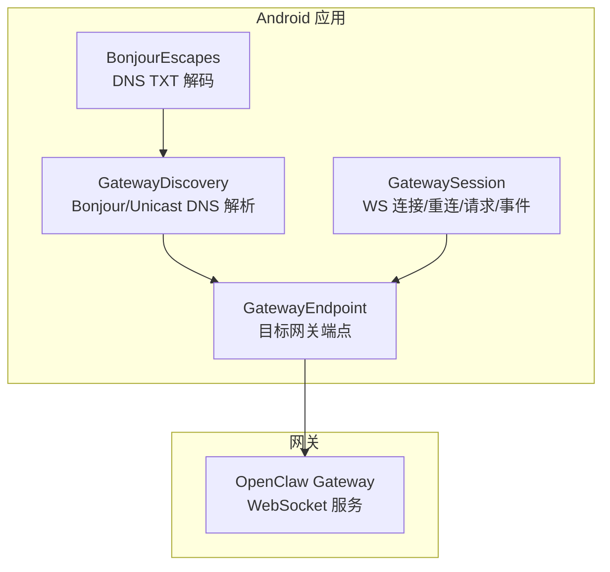
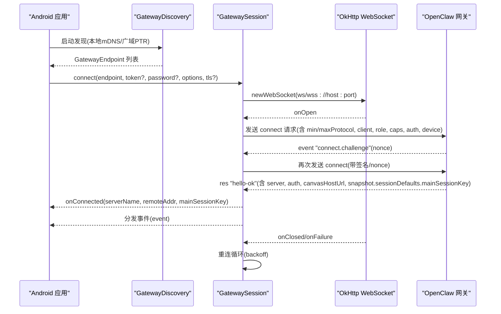
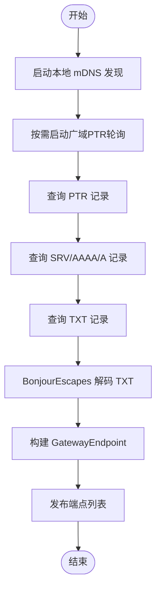
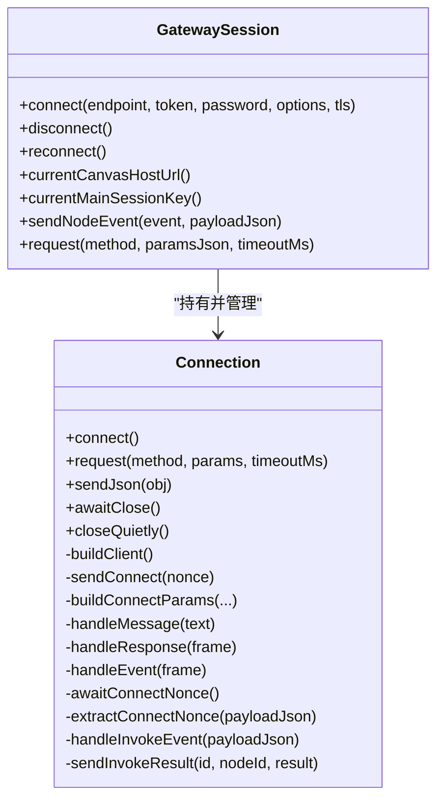
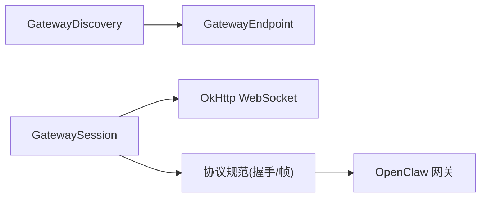

# 通信协议

<cite>
**本文引用的文件**
- [apps/android/app/src/main/java/ai/openclaw/android/gateway/GatewayDiscovery.kt](file://apps/android/app/src/main/java/ai/openclaw/android/gateway/GatewayDiscovery.kt)
- [apps/android/app/src/main/java/ai/openclaw/android/gateway/GatewayEndpoint.kt](file://apps/android/app/src/main/java/ai/openclaw/android/gateway/GatewayEndpoint.kt)
- [apps/android/app/src/main/java/ai/openclaw/android/gateway/BonjourEscapes.kt](file://apps/android/app/src/main/java/ai/openclaw/android/gateway/BonjourEscapes.kt)
- [apps/android/app/src/main/java/ai/openclaw/android/gateway/GatewaySession.kt](file://apps/android/app/src/main/java/ai/openclaw/android/gateway/GatewaySession.kt)
- [apps/android/app/src/main/java/ai/openclaw/android/gateway/GatewayProtocol.kt](file://apps/android/app/src/main/java/ai/openclaw/android/gateway/GatewayProtocol.kt)
- [docs/gateway/protocol.md](file://docs/gateway/protocol.md)
- [docs/gateway/index.md](file://docs/gateway/index.md)
- [docs/concepts/architecture.md](file://docs/concepts/architecture.md)
- [src/gateway/client.ts](file://src/gateway/client.ts)
- [src/infra/bonjour.ts](file://src/infra/bonjour.ts)
- [apps/macos/Tests/OpenClawIPCTests/WebChatMainSessionKeyTests.swift](file://apps/macos/Tests/OpenClawIPCTests/WebChatMainSessionKeyTests.swift)
- [src/gateway/server-methods/sessions.ts](file://src/gateway/server-methods/sessions.ts)
- [src/gateway/server.sessions.gateway-server-sessions-a.e2e.test.ts](file://src/gateway/server.sessions.gateway-server-sessions-a.e2e.test.ts)
- [apps/shared/OpenClawKit/Sources/OpenClawKit/GatewayChannel.swift](file://apps/shared/OpenClawKit/Sources/OpenClawKit/GatewayChannel.swift)
- [apps/macos/Sources/OpenClawMacCLI/WizardCommand.swift](file://apps/macos/Sources/OpenClawMacCLI/WizardCommand.swift)
- [docs/gateway/troubleshooting.md](file://docs/gateway/troubleshooting.md)
</cite>

## 目录

1. [简介](#简介)
2. [项目结构](#项目结构)
3. [核心组件](#核心组件)
4. [架构总览](#架构总览)
5. [详细组件分析](#详细组件分析)
6. [依赖关系分析](#依赖关系分析)
7. [性能考量](#性能考量)
8. [故障排查指南](#故障排查指南)
9. [结论](#结论)
10. [附录](#附录)

## 简介

本文件面向OpenClaw Android应用，系统化阐述其与OpenClaw网关之间的WebSocket通信协议与实现要点。内容覆盖：

- Bonjour服务发现与手动网关配置
- 连接建立流程、握手与认证
- 消息格式、事件类型与数据传输协议
- 会话管理与“main”共享会话键
- 连接状态监控、重连机制与错误处理
- 通信调试方法与常见问题排查

## 项目结构

Android侧关键模块：

- 发现与端点模型：GatewayDiscovery、GatewayEndpoint、BonjourEscapes
- 会话与连接：GatewaySession（含OkHttp WebSocket、请求/响应、事件分发、重连循环）
- 协议常量：GATEWAY_PROTOCOL_VERSION

网关协议参考文档：

- 协议与握手、帧格式、角色与作用域、版本控制、认证与设备配对、TLS固定等

**图示来源**

- [apps/android/app/src/main/java/ai/openclaw/android/gateway/GatewayDiscovery.kt](file://apps/android/app/src/main/java/ai/openclaw/android/gateway/GatewayDiscovery.kt#L47-L193)
- [apps/android/app/src/main/java/ai/openclaw/android/gateway/GatewayEndpoint.kt](file://apps/android/app/src/main/java/ai/openclaw/android/gateway/GatewayEndpoint.kt#L3-L26)
- [apps/android/app/src/main/java/ai/openclaw/android/gateway/BonjourEscapes.kt](file://apps/android/app/src/main/java/ai/openclaw/android/gateway/BonjourEscapes.kt#L3-L35)
- [apps/android/app/src/main/java/ai/openclaw/android/gateway/GatewaySession.kt](file://apps/android/app/src/main/java/ai/openclaw/android/gateway/GatewaySession.kt#L55-L133)

**章节来源**

- [apps/android/app/src/main/java/ai/openclaw/android/gateway/GatewayDiscovery.kt](file://apps/android/app/src/main/java/ai/openclaw/android/gateway/GatewayDiscovery.kt#L47-L193)
- [apps/android/app/src/main/java/ai/openclaw/android/gateway/GatewayEndpoint.kt](file://apps/android/app/src/main/java/ai/openclaw/android/gateway/GatewayEndpoint.kt#L3-L26)
- [apps/android/app/src/main/java/ai/openclaw/android/gateway/BonjourEscapes.kt](file://apps/android/app/src/main/java/ai/openclaw/android/gateway/BonjourEscapes.kt#L3-L35)
- [apps/android/app/src/main/java/ai/openclaw/android/gateway/GatewaySession.kt](file://apps/android/app/src/main/java/ai/openclaw/android/gateway/GatewaySession.kt#L55-L133)

## 核心组件

- 服务发现与端点解析
  - 本地mDNS/DNS-SD发现与广域PTR查询，解析TXT字段（如displayName、gatewayPort、gatewayTls、gatewayTlsSha256等），并生成GatewayEndpoint。
  - 支持loopback与VPN网络优先选择，DNS直连回退。
- 网关端点模型
  - 封装稳定ID、名称、主机、端口、可选TLS参数与Canvas端口等。
- WebSocket会话管理
  - 基于OkHttp WebSocket，实现连接、握手、请求/响应、事件分发、节点调用回调、TLS配置、重连与断开清理。
  - 提供main会话键读取与Canvas Host URL归一化。

**章节来源**

- [apps/android/app/src/main/java/ai/openclaw/android/gateway/GatewayDiscovery.kt](file://apps/android/app/src/main/java/ai/openclaw/android/gateway/GatewayDiscovery.kt#L129-L167)
- [apps/android/app/src/main/java/ai/openclaw/android/gateway/GatewayEndpoint.kt](file://apps/android/app/src/main/java/ai/openclaw/android/gateway/GatewayEndpoint.kt#L3-L26)
- [apps/android/app/src/main/java/ai/openclaw/android/gateway/GatewaySession.kt](file://apps/android/app/src/main/java/ai/openclaw/android/gateway/GatewaySession.kt#L171-L546)

## 架构总览

OpenClaw采用单一长连接的WebSocket控制面，统一承载控制平面与节点能力传输。Android节点通过Bonjour发现网关，建立WS连接，完成握手与认证后进入事件驱动的数据通道。

**图示来源**

- [apps/android/app/src/main/java/ai/openclaw/android/gateway/GatewayDiscovery.kt](file://apps/android/app/src/main/java/ai/openclaw/android/gateway/GatewayDiscovery.kt#L99-L127)
- [apps/android/app/src/main/java/ai/openclaw/android/gateway/GatewaySession.kt](file://apps/android/app/src/main/java/ai/openclaw/android/gateway/GatewaySession.kt#L193-L326)
- [docs/gateway/protocol.md](file://docs/gateway/protocol.md#L22-L90)

**章节来源**

- [docs/concepts/architecture.md](file://docs/concepts/architecture.md#L12-L48)
- [docs/gateway/index.md](file://docs/gateway/index.md#L135-L144)
- [docs/gateway/protocol.md](file://docs/gateway/protocol.md#L17-L90)

## 详细组件分析

### 服务发现与端点解析（Bonjour/Unicast DNS）

- 本地发现：通过NsdManager监听\_mDNS服务，解析SRV/A/AAAA/TXT记录，提取网关端口、TLS开关与指纹、Canvas端口等。
- 广域发现：当环境变量指定域名时，周期性查询PTR/SRV/TXT，合并结果并更新状态文本。
- TXT解码：BonjourEscapes对DNS TXT进行反斜杠转义与UTF-8解码，确保displayName等字段正确。
- 稳定ID：以服务类型+域名+实例名规范化生成，便于去重与状态维护。

**图示来源**

- [apps/android/app/src/main/java/ai/openclaw/android/gateway/GatewayDiscovery.kt](file://apps/android/app/src/main/java/ai/openclaw/android/gateway/GatewayDiscovery.kt#L115-L293)
- [apps/android/app/src/main/java/ai/openclaw/android/gateway/BonjourEscapes.kt](file://apps/android/app/src/main/java/ai/openclaw/android/gateway/BonjourEscapes.kt#L3-L35)

**章节来源**

- [apps/android/app/src/main/java/ai/openclaw/android/gateway/GatewayDiscovery.kt](file://apps/android/app/src/main/java/ai/openclaw/android/gateway/GatewayDiscovery.kt#L99-L193)
- [apps/android/app/src/main/java/ai/openclaw/android/gateway/BonjourEscapes.kt](file://apps/android/app/src/main/java/ai/openclaw/android/gateway/BonjourEscapes.kt#L3-L35)

### 网关端点模型

- 字段：稳定ID、名称、主机、端口、LAN主机、Tailnet DNS、网关/Canvas端口、TLS开关与指纹。
- 手动模式：提供静态host:port构造函数，用于无发现场景。

**章节来源**

- [apps/android/app/src/main/java/ai/openclaw/android/gateway/GatewayEndpoint.kt](file://apps/android/app/src/main/java/ai/openclaw/android/gateway/GatewayEndpoint.kt#L3-L26)

### WebSocket会话与连接管理

- 连接建立：根据TLS参数选择ws/wss，创建OkHttp WebSocket并注册监听。
- 握手与认证：
  - 等待“connect.challenge”事件，提取nonce（非本地回环时超时等待）。
  - 组装connect参数：min/maxProtocol、client、role、scopes、caps、commands、permissions、auth（token或password）、device签名（含nonce）。
  - 发送connect并等待hello-ok，解析server、auth.deviceToken、canvasHostUrl、snapshot.sessionDefaults.mainSessionKey。
  - 成功后持久化设备token（若返回），回调onConnected。
- 请求/响应：基于JSON req/res帧，内部以Map维护id->CompletableDeferred，超时取消。
- 事件分发：区分res/event两类帧；特殊事件如“node.invoke.request”触发本地回调并回传结果。
- 重连机制：runLoop循环，失败指数回退（上限8秒），断开时清理pending与状态。
- 断开与清理：closeQuietly关闭socket，清空pending，回调onDisconnected。

**图示来源**

- [apps/android/app/src/main/java/ai/openclaw/android/gateway/GatewaySession.kt](file://apps/android/app/src/main/java/ai/openclaw/android/gateway/GatewaySession.kt#L55-L133)
- [apps/android/app/src/main/java/ai/openclaw/android/gateway/GatewaySession.kt](file://apps/android/app/src/main/java/ai/openclaw/android/gateway/GatewaySession.kt#L171-L546)

**章节来源**

- [apps/android/app/src/main/java/ai/openclaw/android/gateway/GatewaySession.kt](file://apps/android/app/src/main/java/ai/openclaw/android/gateway/GatewaySession.kt#L193-L326)
- [apps/android/app/src/main/java/ai/openclaw/android/gateway/GatewaySession.kt](file://apps/android/app/src/main/java/ai/openclaw/android/gateway/GatewaySession.kt#L418-L455)
- [apps/android/app/src/main/java/ai/openclaw/android/gateway/GatewaySession.kt](file://apps/android/app/src/main/java/ai/openclaw/android/gateway/GatewaySession.kt#L548-L583)

### 协议版本与握手

- 协议版本：GATEWAY_PROTOCOL_VERSION = 3。
- 握手要求：首个帧必须是connect请求，包含minProtocol/maxProtocol、client、role、scopes、caps、commands、permissions、auth、device签名与nonce。
- 认证：支持共享token/password或设备token；设备token由网关签发并在hello-ok中返回，客户端应持久化。
- 事件：connect.challenge用于nonce挑战；握手成功后接收事件推送。

**章节来源**

- [apps/android/app/src/main/java/ai/openclaw/android/gateway/GatewayProtocol.kt](file://apps/android/app/src/main/java/ai/openclaw/android/gateway/GatewayProtocol.kt#L3-L3)
- [docs/gateway/protocol.md](file://docs/gateway/protocol.md#L22-L90)
- [apps/shared/OpenClawKit/Sources/OpenClawKit/GatewayChannel.swift](file://apps/shared/OpenClawKit/Sources/OpenClawKit/GatewayChannel.swift#L311-L338)
- [apps/macos/Sources/OpenClawMacCLI/WizardCommand.swift](file://apps/macos/Sources/OpenClawMacCLI/WizardCommand.swift#L336-L360)

### 会话管理与“main”共享会话键

- main会话键：网关hello-ok的snapshot.sessionDefaults.mainSessionKey用于标识共享主会话。
- 会话存储与键规范化：服务端对会话键进行规范化与迁移，支持agent:main:main等多级键解析。
- 测试验证：iOS/macOS测试覆盖了main键回退与全局作用域优先逻辑。

**章节来源**

- [apps/android/app/src/main/java/ai/openclaw/android/gateway/GatewaySession.kt](file://apps/android/app/src/main/java/ai/openclaw/android/gateway/GatewaySession.kt#L318-L324)
- [src/gateway/server-methods/sessions.ts](file://src/gateway/server-methods/sessions.ts#L390-L422)
- [apps/macos/Tests/OpenClawIPCTests/WebChatMainSessionKeyTests.swift](file://apps/macos/Tests/OpenClawIPCTests/WebChatMainSessionKeyTests.swift#L48-L67)
- [src/gateway/server.sessions.gateway-server-sessions-a.e2e.test.ts](file://src/gateway/server.sessions.gateway-server-sessions-a.e2e.test.ts#L205-L230)

## 依赖关系分析

- Android应用依赖OkHttp WebSocket进行传输层；Bonjour/Unicast DNS用于网关定位。
- 网关协议由文档定义，客户端严格遵循帧格式与握手流程。
- 设备身份与配对：客户端生成device签名（含nonce），网关校验后颁发设备token。

**图示来源**

- [apps/android/app/src/main/java/ai/openclaw/android/gateway/GatewayDiscovery.kt](file://apps/android/app/src/main/java/ai/openclaw/android/gateway/GatewayDiscovery.kt#L129-L167)
- [apps/android/app/src/main/java/ai/openclaw/android/gateway/GatewaySession.kt](file://apps/android/app/src/main/java/ai/openclaw/android/gateway/GatewaySession.kt#L242-L252)
- [docs/gateway/protocol.md](file://docs/gateway/protocol.md#L17-L90)

**章节来源**

- [src/infra/bonjour.ts](file://src/infra/bonjour.ts#L84-L92)
- [src/gateway/client.ts](file://src/gateway/client.ts#L35-L77)

## 性能考量

- 重连退避：采用指数回退（上限约8秒），避免频繁重试造成拥塞。
- 请求超时：默认请求超时15秒，节点事件短超时（8秒），可根据网络状况调整。
- 事件序列号：客户端维护lastSeq，检测丢包gap并上报（用于诊断）。
- DNS解析优化：优先VPN网络，减少跨网络DNS延迟；TXT解码采用UTF-8容错。

**章节来源**

- [apps/android/app/src/main/java/ai/openclaw/android/gateway/GatewaySession.kt](file://apps/android/app/src/main/java/ai/openclaw/android/gateway/GatewaySession.kt#L566-L568)
- [src/gateway/client.ts](file://src/gateway/client.ts#L304-L308)

## 故障排查指南

- 连接失败
  - 检查目标host:port是否正确，TLS指纹是否匹配。
  - 若为非本地连接，确认已收到“connect.challenge”并正确签名nonce。
  - 查看日志中的“device identity required”“unauthorized”等提示。
- 无响应或无回复
  - 网关状态与通道探测：openclaw gateway status、channels status --probe。
  - 关注策略/权限/配对状态（如mention required、pairing pending、missing_scope）。
- 服务不可用
  - 检查网关进程状态、端口占用、绑定模式与认证配置。
- 重连风暴
  - 观察重连间隔是否异常增大，排查网络波动或服务端主动断开原因。

**章节来源**

- [docs/gateway/troubleshooting.md](file://docs/gateway/troubleshooting.md#L18-L90)
- [docs/gateway/troubleshooting.md](file://docs/gateway/troubleshooting.md#L92-L121)
- [docs/gateway/troubleshooting.md](file://docs/gateway/troubleshooting.md#L122-L152)

## 结论

Android应用通过Bonjour/Unicast DNS发现网关，使用OkHttp WebSocket与OpenClaw网关完成协议握手与认证，随后进入事件驱动的双向通信。会话管理围绕“main”共享会话键展开，配合设备身份与配对机制保障安全与一致性。完善的重连与错误处理策略提升了在复杂网络环境下的稳定性。

## 附录

### 消息格式与事件类型

- 帧类型
  - req：请求，包含id、method、params
  - res：响应，包含id、ok、payload或error
  - event：事件，包含event、payload与可选seq/stateVersion
- 握手事件
  - connect.challenge：携带nonce，客户端签名后二次connect
- 节点事件
  - node.invoke.request：来自网关的节点调用请求，客户端处理并回传node.invoke.result

**章节来源**

- [docs/gateway/protocol.md](file://docs/gateway/protocol.md#L127-L134)
- [apps/android/app/src/main/java/ai/openclaw/android/gateway/GatewaySession.kt](file://apps/android/app/src/main/java/ai/openclaw/android/gateway/GatewaySession.kt#L439-L455)
