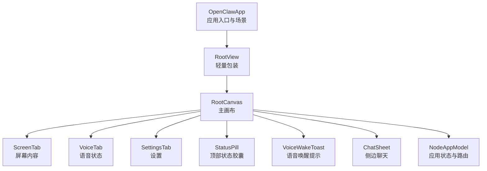
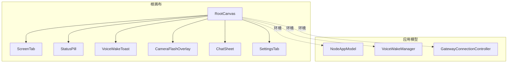
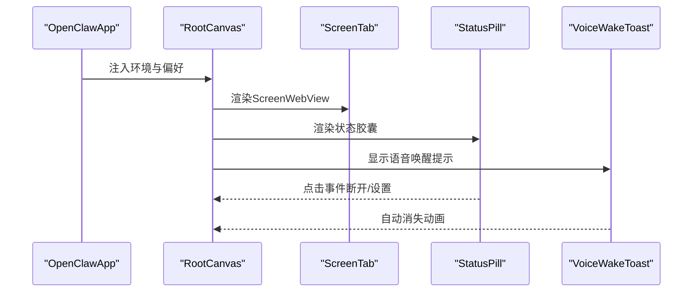
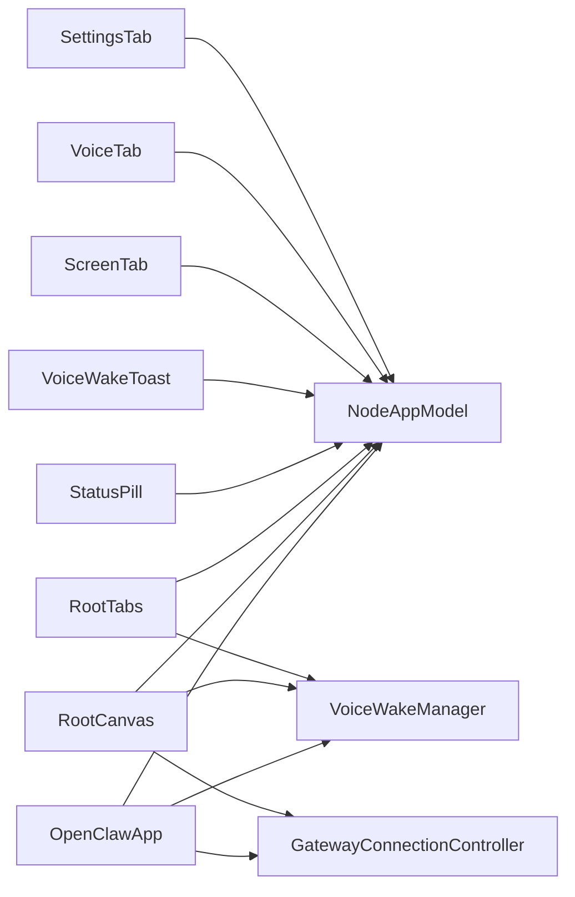

# UI与导航

<cite>
**本文引用的文件**
- [OpenClawApp.swift](file://apps/ios/Sources/OpenClawApp.swift)
- [RootView.swift](file://apps/ios/Sources/RootView.swift)
- [RootCanvas.swift](file://apps/ios/Sources/RootCanvas.swift)
- [RootTabs.swift](file://apps/ios/Sources/RootTabs.swift)
- [ScreenTab.swift](file://apps/ios/Sources/Screen/ScreenTab.swift)
- [VoiceTab.swift](file://apps/ios/Sources/Voice/VoiceTab.swift)
- [SettingsTab.swift](file://apps/ios/Sources/Settings/SettingsTab.swift)
- [StatusPill.swift](file://apps/ios/Sources/Status/StatusPill.swift)
- [VoiceWakeToast.swift](file://apps/ios/Sources/Status/VoiceWakeToast.swift)
- [ChatSheet.swift](file://apps/ios/Sources/Chat/ChatSheet.swift)
- [NodeAppModel.swift](file://apps/ios/Sources/Model/NodeAppModel.swift)
</cite>

## 目录

1. 引言
2. 项目结构
3. 核心组件
4. 架构总览
5. 详细组件分析
6. 依赖关系分析
7. 性能考量
8. 故障排查指南
9. 结论
10. 附录

## 引言

本文件面向OpenClaw iOS应用的UI与导航系统，聚焦于整体UI架构、RootView、RootTabs与RootCanvas的设计理念，以及导航结构、页面切换与用户交互流程。文档同时覆盖主要界面组件、布局设计与样式规范、响应式与屏幕适配、横竖屏支持、可访问性、动画与过渡效果，并提供UI定制、主题与品牌元素使用指南。

## 项目结构

iOS应用UI位于apps/ios/Sources目录下，采用以功能域划分的组织方式：

- 应用入口与场景：OpenClawApp.swift
- 根视图层：RootView.swift（轻量包装）、RootCanvas.swift（主画布）、RootTabs.swift（Tab导航）
- 功能页签：Screen/ScreenTab.swift（屏幕内容）、Voice/VoiceTab.swift（语音状态与设置）、Settings/SettingsTab.swift（设备与网关设置）
- 状态与提示：Status/StatusPill.swift（顶部状态胶囊）、Status/VoiceWakeToast.swift（语音唤醒提示）
- 聊天与会话：Chat/ChatSheet.swift（侧边弹出聊天）
- 模型与状态：Model/NodeAppModel.swift（应用状态与能力路由）

**图表来源**

- [OpenClawApp.swift](file://apps/ios/Sources/OpenClawApp.swift#L16-L30)
- [RootView.swift](file://apps/ios/Sources/RootView.swift#L3-L7)
- [RootCanvas.swift](file://apps/ios/Sources/RootCanvas.swift#L34-L107)
- [ScreenTab.swift](file://apps/ios/Sources/Screen/ScreenTab.swift#L7-L24)
- [VoiceTab.swift](file://apps/ios/Sources/Voice/VoiceTab.swift#L9-L44)
- [SettingsTab.swift](file://apps/ios/Sources/Settings/SettingsTab.swift#L44-L379)
- [StatusPill.swift](file://apps/ios/Sources/Status/StatusPill.swift#L45-L107)
- [VoiceWakeToast.swift](file://apps/ios/Sources/Status/VoiceWakeToast.swift#L7-L32)
- [ChatSheet.swift](file://apps/ios/Sources/Chat/ChatSheet.swift#L21-L40)
- [NodeAppModel.swift](file://apps/ios/Sources/Model/NodeAppModel.swift#L42-L186)

**章节来源**

- [OpenClawApp.swift](file://apps/ios/Sources/OpenClawApp.swift#L16-L30)
- [RootView.swift](file://apps/ios/Sources/RootView.swift#L3-L7)
- [RootCanvas.swift](file://apps/ios/Sources/RootCanvas.swift#L34-L107)
- [ScreenTab.swift](file://apps/ios/Sources/Screen/ScreenTab.swift#L7-L24)
- [VoiceTab.swift](file://apps/ios/Sources/Voice/VoiceTab.swift#L9-L44)
- [SettingsTab.swift](file://apps/ios/Sources/Settings/SettingsTab.swift#L44-L379)
- [StatusPill.swift](file://apps/ios/Sources/Status/StatusPill.swift#L45-L107)
- [VoiceWakeToast.swift](file://apps/ios/Sources/Status/VoiceWakeToast.swift#L7-L32)
- [ChatSheet.swift](file://apps/ios/Sources/Chat/ChatSheet.swift#L21-L40)
- [NodeAppModel.swift](file://apps/ios/Sources/Model/NodeAppModel.swift#L42-L186)

## 核心组件

- 应用入口与环境注入：OpenClawApp在WindowGroup中注入NodeAppModel、VoiceWakeManager与GatewayConnectionController，统一管理场景生命周期与深链处理。
- 根视图层：
  - RootView：最外层包装，直接返回RootCanvas，保持层级简洁。
  - RootCanvas：主画布，承载ScreenTab、状态胶囊、语音唤醒提示、侧边聊天与设置弹窗；负责空闲计时器、调试状态显示与自动打开设置等行为。
  - RootTabs：传统TabView风格，包含Screen、Voice、Settings三个标签页，顶部叠加状态胶囊与语音唤醒提示，支持确认对话框进行断开连接或跳转设置。
- 功能页签：
  - ScreenTab：展示ScreenWebView并根据网关状态显示错误提示；导航由代理驱动，无本地地址栏。
  - VoiceTab：列表展示语音唤醒与Talk模式状态、监听状态与触发词说明。
  - SettingsTab：Form表单，涵盖网关配对与连接、自动连接、手动网关、发现日志、调试开关、设备信息与权限等。
- 状态与提示：
  - StatusPill：顶部胶囊，显示网关连接状态与活动状态（含麦克风图标），支持脉冲动画与无障碍值。
  - VoiceWakeToast：语音唤醒命令提示，带过渡动画。
- 聊天与会话：ChatSheet以Sheet形式呈现OpenClawChatView，支持会话切换与用户强调色。

**章节来源**

- [OpenClawApp.swift](file://apps/ios/Sources/OpenClawApp.swift#L9-L28)
- [RootView.swift](file://apps/ios/Sources/RootView.swift#L3-L7)
- [RootCanvas.swift](file://apps/ios/Sources/RootCanvas.swift#L34-L107)
- [RootTabs.swift](file://apps/ios/Sources/RootTabs.swift#L12-L87)
- [ScreenTab.swift](file://apps/ios/Sources/Screen/ScreenTab.swift#L7-L24)
- [VoiceTab.swift](file://apps/ios/Sources/Voice/VoiceTab.swift#L9-L44)
- [SettingsTab.swift](file://apps/ios/Sources/Settings/SettingsTab.swift#L44-L379)
- [StatusPill.swift](file://apps/ios/Sources/Status/StatusPill.swift#L45-L107)
- [VoiceWakeToast.swift](file://apps/ios/Sources/Status/VoiceWakeToast.swift#L7-L32)
- [ChatSheet.swift](file://apps/ios/Sources/Chat/ChatSheet.swift#L21-L40)

## 架构总览

OpenClaw iOS UI采用“根画布 + 叠加层”的设计理念：

- RootCanvas作为主容器，ZStack组合ScreenTab与覆盖层（状态胶囊、语音提示、Talk模式覆盖、侧边聊天与设置）。
- 通过AppStorage与环境变量驱动状态，结合NodeAppModel协调网关、语音唤醒、Talk模式、屏幕录制与相机等能力。
- RootTabs提供传统Tab导航，适合探索式使用；RootCanvas提供更丰富的覆盖层与即时操作，适合沉浸式使用。

**图表来源**

- [RootCanvas.swift](file://apps/ios/Sources/RootCanvas.swift#L34-L107)
- [ScreenTab.swift](file://apps/ios/Sources/Screen/ScreenTab.swift#L7-L24)
- [StatusPill.swift](file://apps/ios/Sources/Status/StatusPill.swift#L45-L107)
- [VoiceWakeToast.swift](file://apps/ios/Sources/Status/VoiceWakeToast.swift#L7-L32)
- [NodeAppModel.swift](file://apps/ios/Sources/Model/NodeAppModel.swift#L42-L186)

## 详细组件分析

### RootCanvas：主画布与覆盖层

- 设计要点
  - 使用ZStack将ScreenTab作为底层内容，上层叠加状态胶囊、语音提示、Talk模式覆盖与侧边聊天/设置。
  - 通过AppStorage控制“阻止休眠”“调试状态”“首次引导完成”等偏好；通过环境变量获取系统颜色方案与场景阶段。
  - 提供相机闪光覆盖层CameraFlashOverlay，基于nonce触发短暂高亮动画。
- 交互与动画
  - 语音唤醒命令触发后，通过Spring动画显示提示，定时器自动消失并EaseOut收尾。
  - 点击状态胶囊：已连接时弹出确认对话框断开或跳转设置；未连接时直接跳转设置。
  - 预防休眠：根据场景阶段与偏好动态设置UIApplication.shared.isIdleTimerDisabled。
- 响应式与屏幕适配
  - ScreenTab使用ignoresSafeArea填充全屏；状态胶囊与提示使用safeAreaPadding保证安全区域。
  - 系统颜色方案影响覆盖按钮材质与描边透明度，实现浅色/深色自适应。
- 可访问性
  - 状态胶囊与语音提示均提供无障碍标签与值，便于VoiceOver识别。
- 主要流程（RootCanvas到ScreenTab）

**图表来源**

- [OpenClawApp.swift](file://apps/ios/Sources/OpenClawApp.swift#L16-L28)
- [RootCanvas.swift](file://apps/ios/Sources/RootCanvas.swift#L34-L107)
- [ScreenTab.swift](file://apps/ios/Sources/Screen/ScreenTab.swift#L7-L24)
- [StatusPill.swift](file://apps/ios/Sources/Status/StatusPill.swift#L45-L107)
- [VoiceWakeToast.swift](file://apps/ios/Sources/Status/VoiceWakeToast.swift#L7-L32)

**章节来源**

- [RootCanvas.swift](file://apps/ios/Sources/RootCanvas.swift#L34-L157)

### RootTabs：传统Tab导航

- 设计要点
  - 使用TabView选择当前页签，叠加状态胶囊与语音提示；支持确认对话框断开网关或跳转设置。
  - 顶部状态胶囊聚合网关连接状态与活动状态（如后台要求、修复中、待审批、录制中、相机状态、语音唤醒暂停等）。
- 交互流程
  - 语音唤醒命令变更时，更新提示文本并启动定时消失任务。
  - 点击状态胶囊：已连接弹出断开/设置/取消；未连接直接跳转设置。
- 可访问性
  - 所有按钮与状态胶囊提供无障碍标签与值。

**章节来源**

- [RootTabs.swift](file://apps/ios/Sources/RootTabs.swift#L12-L87)
- [StatusPill.swift](file://apps/ios/Sources/Status/StatusPill.swift#L45-L107)

### ScreenTab：屏幕内容与错误提示

- 设计要点
  - 屏幕内容通过ScreenWebView渲染，全屏覆盖；当网关未连接且存在错误文本时，在顶部显示错误提示气泡。
  - 导航由代理驱动，不内置地址栏。
- 适配与布局
  - ignoresSafeArea确保内容延伸至屏幕边缘；错误提示使用薄材料背景与圆角矩形裁剪。

**章节来源**

- [ScreenTab.swift](file://apps/ios/Sources/Screen/ScreenTab.swift#L7-L24)

### VoiceTab：语音状态与设置

- 设计要点
  - 列表展示语音唤醒启用状态、监听状态、状态文本、Talk模式启用状态与触发词说明。
  - 支持通过AppStorage与NodeAppModel同步语音唤醒与Talk模式开关。
- 可访问性
  - 文本与图标均提供辅助描述。

**章节来源**

- [VoiceTab.swift](file://apps/ios/Sources/Voice/VoiceTab.swift#L9-L44)

### SettingsTab：设备与网关设置

- 设计要点
  - 使用Form与DisclosureGroup组织网关配对、自动连接、手动网关、发现日志、调试开关、设备信息与权限。
  - 支持从Telegram配对码解析并连接网关，支持预检连通性与Tailnet校验。
  - 设备信息包含名称、实例ID、本地IP、平台版本、机型等；支持复制与上下文菜单。
- 交互与验证
  - 手动端口输入过滤非数字字符并限制范围；Tailnet主机自动推导端口。
  - 连接前进行TCP探测，失败时提示网络问题。
- 可访问性
  - 关闭按钮提供无障碍标签。

**章节来源**

- [SettingsTab.swift](file://apps/ios/Sources/Settings/SettingsTab.swift#L44-L379)

### StatusPill：顶部状态胶囊

- 设计要点
  - 显示网关连接状态（连接/连接中/错误/离线）与活动状态（后台要求、修复中、待审批、录制中、相机状态、语音唤醒暂停等）。
  - 连接中状态带脉冲动画；活动状态与麦克风图标之间切换。
- 可访问性
  - 提供完整无障碍标签与值，包含当前状态与活动描述。

**章节来源**

- [StatusPill.swift](file://apps/ios/Sources/Status/StatusPill.swift#L45-L127)

### VoiceWakeToast：语音唤醒提示

- 设计要点
  - 显示最近一次语音唤醒命令，带过渡动画；材质背景与阴影增强可读性。
- 可访问性
  - 提供无障碍标签与值。

**章节来源**

- [VoiceWakeToast.swift](file://apps/ios/Sources/Status/VoiceWakeToast.swift#L7-L32)

### ChatSheet：侧边聊天

- 设计要点
  - 以Sheet呈现OpenClawChatView，支持会话切换与用户强调色；标题根据代理名称动态调整。
- 交互
  - 顶部关闭按钮用于退出聊天。

**章节来源**

- [ChatSheet.swift](file://apps/ios/Sources/Chat/ChatSheet.swift#L21-L40)

### NodeAppModel：应用状态与能力路由

- 设计要点
  - 统一管理网关会话（node/operator）、语音唤醒、Talk模式、屏幕录制、相机、位置、通知中心等。
  - 提供Canvas相关能力路由（present/hide/navigate/evalJS/snapshot）与深链处理。
- 与UI协作
  - RootCanvas/RootTabs通过环境注入使用NodeAppModel提供的状态与方法，驱动UI更新与交互。

**章节来源**

- [NodeAppModel.swift](file://apps/ios/Sources/Model/NodeAppModel.swift#L42-L186)
- [NodeAppModel.swift](file://apps/ios/Sources/Model/NodeAppModel.swift#L1280-L1305)

## 依赖关系分析

- 入口与环境
  - OpenClawApp注入NodeAppModel、VoiceWakeManager与GatewayConnectionController，贯穿整个UI生命周期。
- 视图与模型
  - RootCanvas/RootTabs依赖NodeAppModel的状态与方法；StatusPill与VoiceWakeToast消费NodeAppModel提供的状态文本与活动状态。
- 能力与服务
  - NodeAppModel封装多种服务（相机、屏幕录制、位置、通知等），UI仅通过状态与回调交互，降低耦合。

**图表来源**

- [OpenClawApp.swift](file://apps/ios/Sources/OpenClawApp.swift#L9-L28)
- [RootCanvas.swift](file://apps/ios/Sources/RootCanvas.swift#L5-L17)
- [RootTabs.swift](file://apps/ios/Sources/RootTabs.swift#L4-L10)
- [StatusPill.swift](file://apps/ios/Sources/Status/StatusPill.swift#L3-L41)
- [VoiceWakeToast.swift](file://apps/ios/Sources/Status/VoiceWakeToast.swift#L3-L5)
- [NodeAppModel.swift](file://apps/ios/Sources/Model/NodeAppModel.swift#L42-L186)

**章节来源**

- [OpenClawApp.swift](file://apps/ios/Sources/OpenClawApp.swift#L9-L28)
- [RootCanvas.swift](file://apps/ios/Sources/RootCanvas.swift#L5-L17)
- [RootTabs.swift](file://apps/ios/Sources/RootTabs.swift#L4-L10)
- [StatusPill.swift](file://apps/ios/Sources/Status/StatusPill.swift#L3-L41)
- [VoiceWakeToast.swift](file://apps/ios/Sources/Status/VoiceWakeToast.swift#L3-L5)
- [NodeAppModel.swift](file://apps/ios/Sources/Model/NodeAppModel.swift#L42-L186)

## 性能考量

- 动画与过渡
  - 语音唤醒提示使用Spring与EaseOut动画，避免频繁重排；状态胶囊脉冲动画仅在连接中且前台时启用，减少不必要的动画开销。
- 资源与生命周期
  - RootCanvas在onDisappear中恢复空闲计时器并清理定时任务，防止后台资源泄漏。
- 网络与连接
  - SettingsTab在连接前进行TCP探测与Tailnet校验，避免无效尝试导致UI卡顿。
- 材质与阴影
  - 使用ultraThinMaterial与阴影提升视觉层次，但需注意在低端设备上的性能影响，建议按需启用调试状态与高斯模糊。

[本节为通用指导，无需列出具体文件来源]

## 故障排查指南

- 网关连接失败
  - 检查SettingsTab中的“发现日志”与“调试Canvas状态”，确认连接状态文本与远端地址；若为Tailnet主机，确保Tailscale已开启。
- 语音唤醒无响应
  - 在VoiceTab检查语音唤醒与监听状态；若状态为“暂停”，确认Talk模式是否启用或应用是否处于后台。
- 录制/相机异常
  - 查看StatusPill中的活动状态（录制中/相机状态），确认权限与设备可用性。
- 界面卡顿或闪烁
  - 关闭调试状态与高斯模糊；检查是否存在大量动画叠加；确认相机闪光覆盖层是否频繁触发。

**章节来源**

- [SettingsTab.swift](file://apps/ios/Sources/Settings/SettingsTab.swift#L106-L213)
- [VoiceTab.swift](file://apps/ios/Sources/Voice/VoiceTab.swift#L9-L44)
- [StatusPill.swift](file://apps/ios/Sources/Status/StatusPill.swift#L257-L316)
- [RootCanvas.swift](file://apps/ios/Sources/RootCanvas.swift#L126-L136)

## 结论

OpenClaw iOS UI以RootCanvas为核心，结合覆盖层与传统Tab导航，实现了沉浸式与易用性的平衡。通过NodeAppModel统一管理状态与能力，UI具备良好的可维护性与扩展性。建议在实际开发中遵循本文档的布局与交互规范，确保一致的用户体验与可访问性。

[本节为总结性内容，无需列出具体文件来源]

## 附录

### 响应式设计与屏幕适配

- 全屏覆盖：ScreenTab使用ignoresSafeArea填满屏幕，配合safeAreaPadding在覆盖层中留白。
- 安全区域：状态胶囊与提示使用safeAreaPadding与alignment对齐，避免遮挡通知栏或Home Indicator。
- 浅色/深色：系统颜色方案影响覆盖按钮材质与描边透明度，实现自然适配。

**章节来源**

- [ScreenTab.swift](file://apps/ios/Sources/Screen/ScreenTab.swift#L7-L24)
- [RootCanvas.swift](file://apps/ios/Sources/RootCanvas.swift#L34-L107)
- [StatusPill.swift](file://apps/ios/Sources/Status/StatusPill.swift#L45-L107)

### 横竖屏支持

- RootCanvas与各功能页签均基于ZStack与VStack布局，天然适配横竖屏切换。
- 状态胶囊与提示使用相对定位与safeAreaPadding，确保在不同方向下位置稳定。

**章节来源**

- [RootCanvas.swift](file://apps/ios/Sources/RootCanvas.swift#L34-L107)
- [StatusPill.swift](file://apps/ios/Sources/Status/StatusPill.swift#L45-L107)

### 可访问性

- 重要控件均提供无障碍标签与值，如状态胶囊、语音提示、关闭按钮等。
- 文本与图标语义明确，便于VoiceOver阅读。

**章节来源**

- [StatusPill.swift](file://apps/ios/Sources/Status/StatusPill.swift#L96-L114)
- [VoiceWakeToast.swift](file://apps/ios/Sources/Status/VoiceWakeToast.swift#L30-L32)
- [ChatSheet.swift](file://apps/ios/Sources/Chat/ChatSheet.swift#L29-L38)

### 动画与过渡效果

- 语音唤醒提示：Spring进入、定时消失EaseOut。
- 状态胶囊脉冲：连接中前台时自动循环脉冲。
- 侧边弹窗：Sheet默认过渡，配合状态胶囊与提示的Move+Opacity组合过渡。

**章节来源**

- [RootCanvas.swift](file://apps/ios/Sources/RootCanvas.swift#L83-L101)
- [RootTabs.swift](file://apps/ios/Sources/RootTabs.swift#L49-L67)
- [StatusPill.swift](file://apps/ios/Sources/Status/StatusPill.swift#L116-L126)

### UI定制指南与主题配置

- 品牌强调色
  - 通过NodeAppModel.seamColor传递给ChatSheet与覆盖按钮，实现品牌一致性。
- 覆盖按钮样式
  - 使用ultraThinMaterial与渐变描边，支持isActive与tint参数切换视觉状态。
- 调试与偏好
  - 通过AppStorage控制“阻止休眠”“调试Canvas状态”“首次引导完成”等偏好，便于开发与测试。

**章节来源**

- [ChatSheet.swift](file://apps/ios/Sources/Chat/ChatSheet.swift#L11-L19)
- [RootCanvas.swift](file://apps/ios/Sources/RootCanvas.swift#L159-L207)
- [RootCanvas.swift](file://apps/ios/Sources/RootCanvas.swift#L10-L17)
