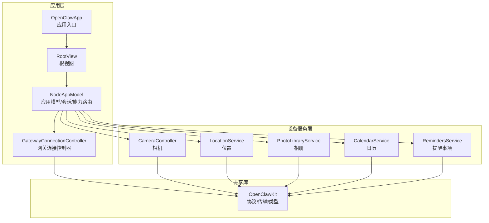
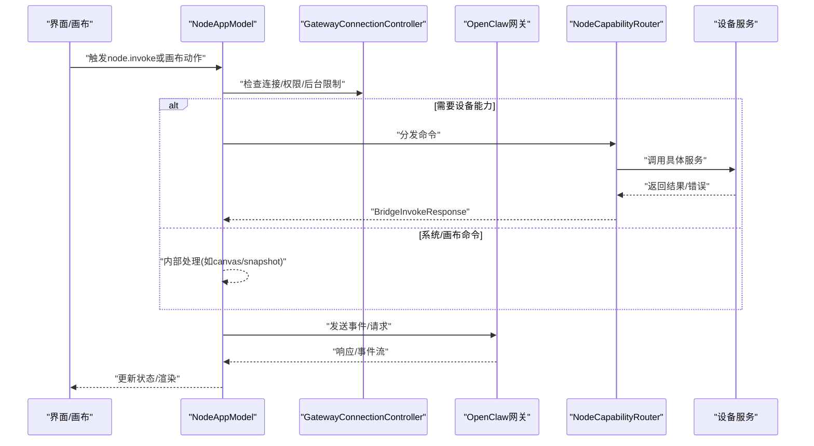
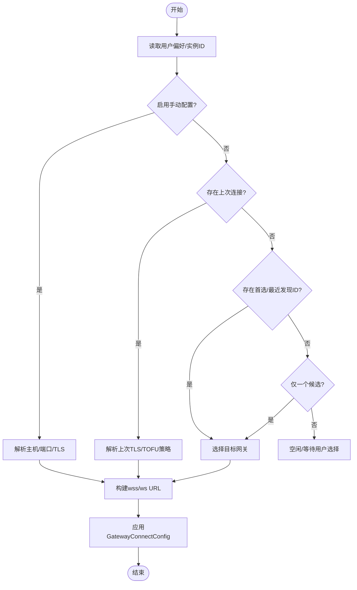
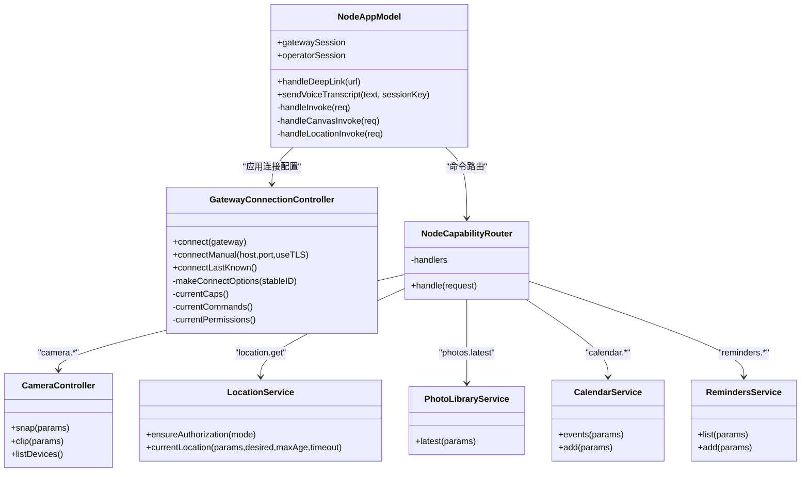
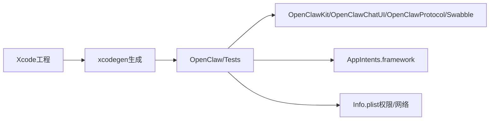

# iOS应用

<cite>
**本文引用的文件**
- [apps/ios/README.md](file://apps/ios/README.md)
- [apps/ios/project.yml](file://apps/ios/project.yml)
- [apps/ios/Sources/OpenClawApp.swift](file://apps/ios/Sources/OpenClawApp.swift)
- [apps/ios/Sources/RootView.swift](file://apps/ios/Sources/RootView.swift)
- [apps/ios/Sources/Model/NodeAppModel.swift](file://apps/ios/Sources/Model/NodeAppModel.swift)
- [apps/ios/Sources/Gateway/GatewayConnectionController.swift](file://apps/ios/Sources/Gateway/GatewayConnectionController.swift)
- [apps/ios/Sources/Capabilities/NodeCapabilityRouter.swift](file://apps/ios/Sources/Capabilities/NodeCapabilityRouter.swift)
- [apps/ios/Sources/Camera/CameraController.swift](file://apps/ios/Sources/Camera/CameraController.swift)
- [apps/ios/Sources/Location/LocationService.swift](file://apps/ios/Sources/Location/LocationService.swift)
- [apps/ios/Sources/Media/PhotoLibraryService.swift](file://apps/ios/Sources/Media/PhotoLibraryService.swift)
- [apps/ios/Sources/Calendar/CalendarService.swift](file://apps/ios/Sources/Calendar/CalendarService.swift)
- [apps/ios/Sources/Reminders/RemindersService.swift](file://apps/ios/Sources/Reminders/RemindersService.swift)
- [apps/shared/OpenClawKit/Package.swift](file://apps/shared/OpenClawKit/Package.swift)
</cite>

## 目录

1. [简介](#简介)
2. [项目结构](#项目结构)
3. [核心组件](#核心组件)
4. [架构总览](#架构总览)
5. [详细组件分析](#详细组件分析)
6. [依赖关系分析](#依赖关系分析)
7. [性能考虑](#性能考虑)
8. [故障排查指南](#故障排查指南)
9. [结论](#结论)
10. [附录](#附录)

## 简介

本文件面向OpenClaw iOS应用的技术文档，聚焦于iOS节点（role: node）如何连接到OpenClaw网关，涵盖WebSocket连接、设备配对流程、权限管理以及核心设备服务能力（相机、位置、相册、日历、提醒事项等）。同时说明应用的UI架构、导航结构、用户交互模式，构建流程、Xcode配置与测试方法，并解释与共享代码库OpenClawKit的集成方式，以及iOS平台特有行为、后台限制与权限处理策略。

## 项目结构

iOS应用位于apps/ios目录，采用SwiftUI驱动的MVVM风格，核心入口为OpenClawApp，通过NodeAppModel协调网关连接、能力路由与设备服务；网关侧由GatewayConnectionController负责发现、TLS参数解析、自动重连与连接配置；设备服务以协议化接口抽象，便于在NodeAppModel中统一调度。

图表来源

- [apps/ios/Sources/OpenClawApp.swift](file://apps/ios/Sources/OpenClawApp.swift#L1-L32)
- [apps/ios/Sources/RootView.swift](file://apps/ios/Sources/RootView.swift#L1-L8)
- [apps/ios/Sources/Model/NodeAppModel.swift](file://apps/ios/Sources/Model/NodeAppModel.swift#L1-L120)
- [apps/ios/Sources/Gateway/GatewayConnectionController.swift](file://apps/ios/Sources/Gateway/GatewayConnectionController.swift#L1-L60)
- [apps/ios/Sources/Camera/CameraController.swift](file://apps/ios/Sources/Camera/CameraController.swift#L1-L40)
- [apps/ios/Sources/Location/LocationService.swift](file://apps/ios/Sources/Location/LocationService.swift#L1-L30)
- [apps/ios/Sources/Media/PhotoLibraryService.swift](file://apps/ios/Sources/Media/PhotoLibraryService.swift#L1-L20)
- [apps/ios/Sources/Calendar/CalendarService.swift](file://apps/ios/Sources/Calendar/CalendarService.swift#L1-L20)
- [apps/ios/Sources/Reminders/RemindersService.swift](file://apps/ios/Sources/Reminders/RemindersService.swift#L1-L20)
- [apps/shared/OpenClawKit/Package.swift](file://apps/shared/OpenClawKit/Package.swift#L1-L40)

章节来源

- [apps/ios/README.md](file://apps/ios/README.md#L1-L67)
- [apps/ios/project.yml](file://apps/ios/project.yml#L1-L135)

## 核心组件

- 应用入口与生命周期：OpenClawApp负责初始化NodeAppModel与GatewayConnectionController，注入环境并监听场景状态变化与深链。
- 应用模型：NodeAppModel封装网关会话（node/operator双通道）、健康监测、语音唤醒与通话模式、设备能力路由、屏幕与画布交互、深链与A2UI动作处理、后台行为控制等。
- 网关连接控制器：GatewayConnectionController负责本地网关发现、TLS指纹校验与TOFU策略、自动连接/重连、命令与权限声明、客户端标识与显示名解析。
- 能力路由：NodeCapabilityRouter将网关下发的node.invoke命令分发至对应设备服务处理器。
- 设备服务：CameraController、LocationService、PhotoLibraryService、CalendarService、RemindersService分别实现相机拍照/录像、位置获取、相册最新照片、日历事件查询/新增、提醒事项列表/新增等。

章节来源

- [apps/ios/Sources/OpenClawApp.swift](file://apps/ios/Sources/OpenClawApp.swift#L1-L32)
- [apps/ios/Sources/Model/NodeAppModel.swift](file://apps/ios/Sources/Model/NodeAppModel.swift#L1-L120)
- [apps/ios/Sources/Gateway/GatewayConnectionController.swift](file://apps/ios/Sources/Gateway/GatewayConnectionController.swift#L1-L60)
- [apps/ios/Sources/Capabilities/NodeCapabilityRouter.swift](file://apps/ios/Sources/Capabilities/NodeCapabilityRouter.swift#L1-L26)

## 架构总览

应用以NodeAppModel为中心，通过两个GatewayNodeSession分别承载“节点能力”和“操作者指令”，配合GatewayConnectionController完成网关发现、TLS参数与自动连接。设备服务通过NodeCapabilityRouter统一接入，NodeAppModel在invoke时根据命令与权限进行前置校验与错误反馈。

图表来源

- [apps/ios/Sources/Model/NodeAppModel.swift](file://apps/ios/Sources/Model/NodeAppModel.swift#L620-L790)
- [apps/ios/Sources/Gateway/GatewayConnectionController.swift](file://apps/ios/Sources/Gateway/GatewayConnectionController.swift#L316-L340)
- [apps/ios/Sources/Capabilities/NodeCapabilityRouter.swift](file://apps/ios/Sources/Capabilities/NodeCapabilityRouter.swift#L19-L24)

## 详细组件分析

### 应用入口与UI架构

- OpenClawApp：初始化持久化、构造NodeAppModel与GatewayConnectionController，注入环境变量，监听深链与场景状态变化。
- RootView：简单包装RootCanvas，作为应用主视图容器。
- RootCanvas：由NodeAppModel驱动，承载标签页、画布与聊天界面。

章节来源

- [apps/ios/Sources/OpenClawApp.swift](file://apps/ios/Sources/OpenClawApp.swift#L1-L32)
- [apps/ios/Sources/RootView.swift](file://apps/ios/Sources/RootView.swift#L1-L8)

### 网关连接与自动重连

- 发现与TLS：GatewayConnectionController基于Bonjour/本地网络发现网关，解析稳定ID与TLS指纹，支持TOFU首次信任与后续校验。
- 自动连接：依据用户偏好与最近连接信息，自动选择手动配置、上次连接或首选/最近发现的网关，生成连接选项（role: node、capabilities、commands、permissions）。
- 场景感知：前台启动发现/重连，后台停止发现，避免无谓资源消耗。
- 连接选项：动态声明capabilities与commands，结合系统权限状态决定permissions字典。

图表来源

- [apps/ios/Sources/Gateway/GatewayConnectionController.swift](file://apps/ios/Sources/Gateway/GatewayConnectionController.swift#L173-L289)
- [apps/ios/Sources/Gateway/GatewayConnectionController.swift](file://apps/ios/Sources/Gateway/GatewayConnectionController.swift#L316-L340)

章节来源

- [apps/ios/Sources/Gateway/GatewayConnectionController.swift](file://apps/ios/Sources/Gateway/GatewayConnectionController.swift#L1-L667)

### 权限管理与后台行为

- 权限声明：根据当前授权状态动态生成permissions字典，覆盖相机、麦克风、语音识别、位置、屏幕录制、相册、联系人、日历、提醒事项、运动等。
- 后台限制：NodeAppModel在场景进入后台时暂停健康监测、释放麦克风、延迟重连策略；前台恢复后根据健康检查结果决定是否重建连接。
- 位置模式：支持whenInUse与always两种模式，后台需要always以允许持续定位；NodeAppModel在invoke前校验模式与授权状态。

章节来源

- [apps/ios/Sources/Gateway/GatewayConnectionController.swift](file://apps/ios/Sources/Gateway/GatewayConnectionController.swift#L542-L570)
- [apps/ios/Sources/Model/NodeAppModel.swift](file://apps/ios/Sources/Model/NodeAppModel.swift#L266-L326)
- [apps/ios/Sources/Location/LocationService.swift](file://apps/ios/Sources/Location/LocationService.swift#L33-L53)

### 设备服务能力与命令路由

- 能力与命令：GatewayConnectionController动态声明capabilities与commands，如camera._、location.get、device._、photos.latest、contacts._、calendar._、reminders.*、motion.*等。
- 路由器：NodeCapabilityRouter按command分发到具体处理器，未知命令返回无效请求错误。
- 前置校验：NodeAppModel在invoke前检查后台限制、能力开关与权限状态，必要时提示用户前往设置开启。

图表来源

- [apps/ios/Sources/Model/NodeAppModel.swift](file://apps/ios/Sources/Model/NodeAppModel.swift#L627-L790)
- [apps/ios/Sources/Gateway/GatewayConnectionController.swift](file://apps/ios/Sources/Gateway/GatewayConnectionController.swift#L458-L540)
- [apps/ios/Sources/Capabilities/NodeCapabilityRouter.swift](file://apps/ios/Sources/Capabilities/NodeCapabilityRouter.swift#L1-L26)
- [apps/ios/Sources/Camera/CameraController.swift](file://apps/ios/Sources/Camera/CameraController.swift#L1-L120)
- [apps/ios/Sources/Location/LocationService.swift](file://apps/ios/Sources/Location/LocationService.swift#L55-L74)
- [apps/ios/Sources/Media/PhotoLibraryService.swift](file://apps/ios/Sources/Media/PhotoLibraryService.swift#L16-L55)
- [apps/ios/Sources/Calendar/CalendarService.swift](file://apps/ios/Sources/Calendar/CalendarService.swift#L6-L37)
- [apps/ios/Sources/Reminders/RemindersService.swift](file://apps/ios/Sources/Reminders/RemindersService.swift#L6-L48)

章节来源

- [apps/ios/Sources/Capabilities/NodeCapabilityRouter.swift](file://apps/ios/Sources/Capabilities/NodeCapabilityRouter.swift#L1-L26)
- [apps/ios/Sources/Model/NodeAppModel.swift](file://apps/ios/Sources/Model/NodeAppModel.swift#L627-L790)

### 相机服务（CameraController）

- 拍照：支持指定前置/后置、格式、最大宽度、质量、延时；内部进行权限确保、会话预热与延迟；输出JPEG并限制最大编码字节数以适配网关WS帧上限。
- 录像：可选音频，限制最大时长，默认转码为MP4；输出base64与音频标志位。
- 设备枚举：列出可用视频设备及其朝向与类型。
- 错误处理：统一映射为本地化错误描述，便于上层展示。

章节来源

- [apps/ios/Sources/Camera/CameraController.swift](file://apps/ios/Sources/Camera/CameraController.swift#L1-L407)

### 位置服务（LocationService）

- 授权：支持whenInUse与always模式，必要时触发授权请求；不阻塞invoke路径，使用回调通知授权变更。
- 定位：支持精度策略（粗/平衡/精确）、超时与缓存年龄；封装异步超时逻辑，避免阻塞。
- 返回：标准化位置对象，包含经纬度、海拔、速度、航向、时间戳与精度授权标记。

章节来源

- [apps/ios/Sources/Location/LocationService.swift](file://apps/ios/Sources/Location/LocationService.swift#L1-L139)

### 相册服务（PhotoLibraryService）

- 最新照片：限制数量与总预算，按最大宽度与质量编码；单张照片也有限制，防止超过网关WS最大载荷。
- 编码策略：优先降低质量，再逐步缩小尺寸，直至满足预算；否则抛出错误提示调整参数。

章节来源

- [apps/ios/Sources/Media/PhotoLibraryService.swift](file://apps/ios/Sources/Media/PhotoLibraryService.swift#L1-L165)

### 日历服务（CalendarService）

- 查询：支持起止时间范围与条数限制，返回事件列表（标题、时间、地点、日历名称等）。
- 新增：校验必填字段与ISO时间格式，解析目标日历（按ID/名称或默认），保存后返回事件详情。

章节来源

- [apps/ios/Sources/Calendar/CalendarService.swift](file://apps/ios/Sources/Calendar/CalendarService.swift#L1-L168)

### 提醒事项服务（RemindersService）

- 列表：支持状态过滤（全部/已完成/未完成），返回提醒列表（标题、到期时间、完成状态、清单名称）。
- 新增：校验标题，解析到期时间与清单（ID/名称或默认），保存后返回提醒详情。

章节来源

- [apps/ios/Sources/Reminders/RemindersService.swift](file://apps/ios/Sources/Reminders/RemindersService.swift#L1-L166)

### 画布与A2UI交互

- 画布呈现/隐藏/跳转/JS求值/截图：NodeAppModel内部处理，支持不同图片格式与最大宽度约束。
- A2UI动作：从画布按钮点击触发，组装上下文与会话键，向网关发送代理深链请求，并回写执行结果到画布。

章节来源

- [apps/ios/Sources/Model/NodeAppModel.swift](file://apps/ios/Sources/Model/NodeAppModel.swift#L188-L263)
- [apps/ios/Sources/Model/NodeAppModel.swift](file://apps/ios/Sources/Model/NodeAppModel.swift#L739-L791)

### 语音唤醒与通话模式

- 语音唤醒：通过VoiceWakeManager配置触发词，与通话模式互斥，前台后台切换时暂停/恢复。
- 通话模式：TalkModeManager与operator会话绑定，避免麦克风争用。

章节来源

- [apps/ios/Sources/Model/NodeAppModel.swift](file://apps/ios/Sources/Model/NodeAppModel.swift#L98-L170)
- [apps/ios/Sources/Model/NodeAppModel.swift](file://apps/ios/Sources/Model/NodeAppModel.swift#L328-L354)

## 依赖关系分析

- 项目配置：project.yml定义了bundle前缀、部署目标、Xcode版本、Swift版本、并发严格性、产品包依赖（OpenClawKit、OpenClawChatUI、OpenClawProtocol、Swabble）与Info.plist中的权限与网络配置。
- 构建脚本：通过xcodegen生成工程，支持SwiftFormat与SwiftLint预构建脚本。
- 测试：单元测试目标依赖应用与SwabbleKit，使用模拟器目的地运行。

图表来源

- [apps/ios/project.yml](file://apps/ios/project.yml#L1-L135)

章节来源

- [apps/ios/project.yml](file://apps/ios/project.yml#L1-L135)

## 性能考虑

- 网络与负载：相机与相册输出均限制最大编码长度与单张预算，避免WS帧过大导致断开。
- 后台策略：后台释放麦克风、停止发现、延迟重连，前台主动健康检查失败时重建连接，减少“已连接但死”的状态。
- 会话与并发：严格并发设置，避免跨线程共享非Sendable类型；invoke前进行权限与后台限制前置校验，减少无效RPC。

章节来源

- [apps/ios/Sources/Camera/CameraController.swift](file://apps/ios/Sources/Camera/CameraController.swift#L96-L110)
- [apps/ios/Sources/Media/PhotoLibraryService.swift](file://apps/ios/Sources/Media/PhotoLibraryService.swift#L13-L14)
- [apps/ios/Sources/Model/NodeAppModel.swift](file://apps/ios/Sources/Model/NodeAppModel.swift#L266-L326)

## 故障排查指南

- 连接问题
  - TLS指纹：若首次连接提示证书问题，确认GatewayTLSStore中指纹或允许TOFU重置策略。
  - 自动重连：检查gateway.autoconnect与gateway.manual.enabled偏好，确认实例ID与clientId覆盖。
- 权限问题
  - 相机/麦克风：确认系统设置中已授权；invoke前不会弹窗，需引导用户前往设置。
  - 位置：whenInUse与always差异导致后台不可用；确保授权模式匹配需求。
  - 日历/提醒事项/相册/联系人：授权状态需为authorized/fullAccess/writeOnly才允许写入。
- 后台行为
  - 画布/相机/屏幕命令在后台受限；前台恢复后健康检查失败会触发断开与重建。
- 深链与A2UI
  - 检查NodeAppModel对深链与A2UI动作的处理分支与错误回传。

章节来源

- [apps/ios/Sources/Gateway/GatewayConnectionController.swift](file://apps/ios/Sources/Gateway/GatewayConnectionController.swift#L342-L372)
- [apps/ios/Sources/Model/NodeAppModel.swift](file://apps/ios/Sources/Model/NodeAppModel.swift#L630-L678)
- [apps/ios/Sources/Location/LocationService.swift](file://apps/ios/Sources/Location/LocationService.swift#L33-L53)
- [apps/ios/Sources/Calendar/CalendarService.swift](file://apps/ios/Sources/Calendar/CalendarService.swift#L98-L128)
- [apps/ios/Sources/Reminders/RemindersService.swift](file://apps/ios/Sources/Reminders/RemindersService.swift#L103-L133)
- [apps/ios/Sources/Media/PhotoLibraryService.swift](file://apps/ios/Sources/Media/PhotoLibraryService.swift#L57-L60)

## 结论

该iOS应用以NodeAppModel为核心，结合GatewayConnectionController与NodeCapabilityRouter，实现了对OpenClaw网关的稳定连接与丰富的设备服务能力。通过严格的权限声明与后台行为控制，兼顾用户体验与系统资源管理。与OpenClawKit的深度集成确保了协议一致性与跨平台复用。

## 附录

### 构建与测试

- 本地开发：安装pnpm与xcodegen后，在仓库根目录执行安装与打开工程命令；在Xcode中选择OpenClaw方案与模拟器/真机运行。
- 命令行构建：使用pnpm ios:build进行构建。
- 单元测试：在apps/ios目录下生成工程并使用xcodebuild在模拟器上运行测试套件。

章节来源

- [apps/ios/README.md](file://apps/ios/README.md#L27-L67)

### 配置要点（Info.plist）

- 网络与权限：NSLocalNetworkUsageDescription、NSBonjourServices、NSCameraUsageDescription、NSLocationWhenInUseUsageDescription、NSLocationAlwaysAndWhenInUseUsageDescription、NSMicrophoneUsageDescription、NSSpeechRecognitionUsageDescription等。
- 应用属性：UILaunchScreen、UIApplicationSceneManifest、UIBackgroundModes（音频）、UISupportedInterfaceOrientations等。

章节来源

- [apps/ios/project.yml](file://apps/ios/project.yml#L86-L111)

### 与OpenClawKit的集成

- 包依赖：OpenClawKit、OpenClawChatUI、OpenClawProtocol作为SwiftPM包引入。
- 类型与协议：NodeAppModel与各设备服务均直接依赖OpenClawKit中的桥接帧、能力枚举、命令定义与传输协议。

章节来源

- [apps/ios/project.yml](file://apps/ios/project.yml#L12-L41)
- [apps/shared/OpenClawKit/Package.swift](file://apps/shared/OpenClawKit/Package.swift#L1-L40)
