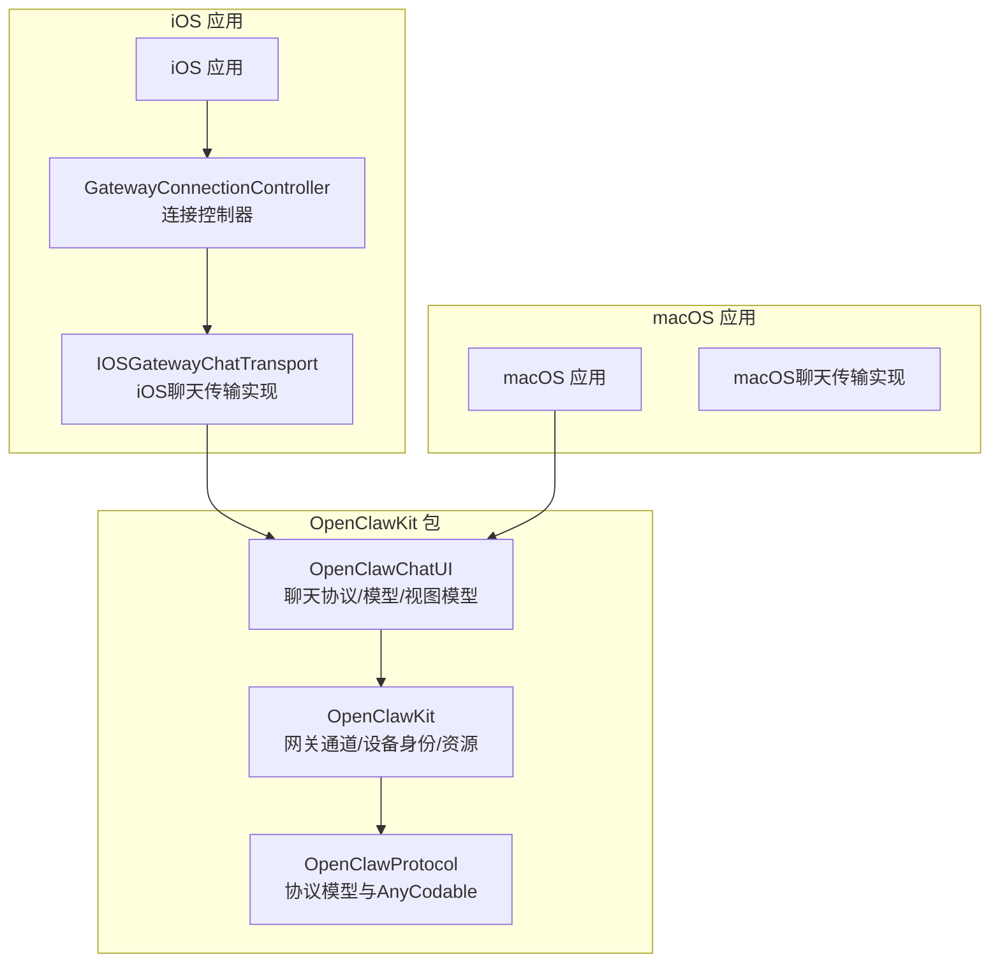
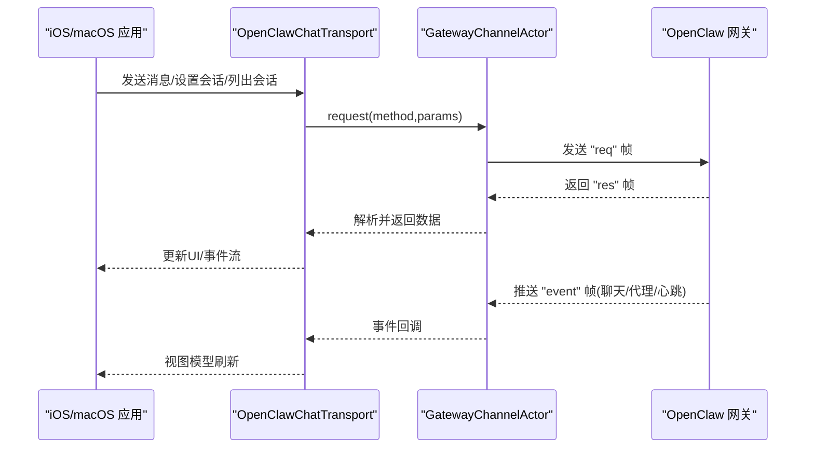
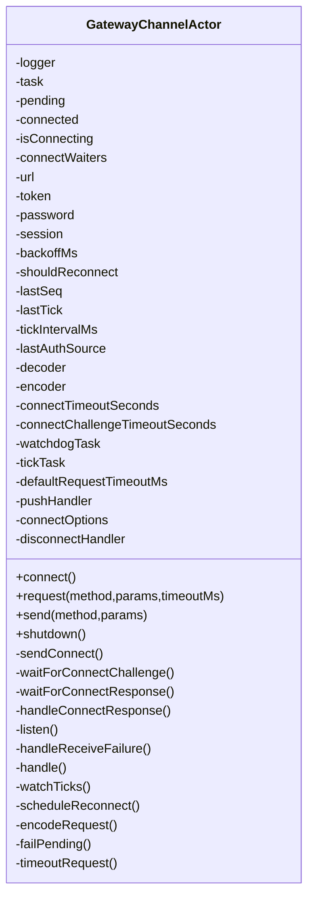
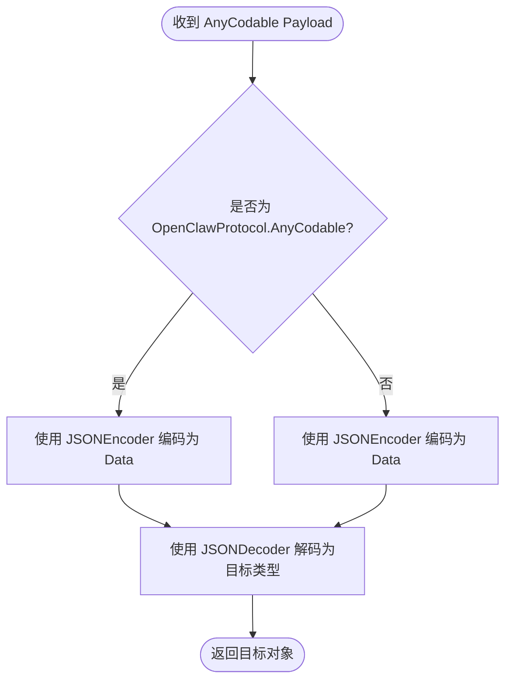
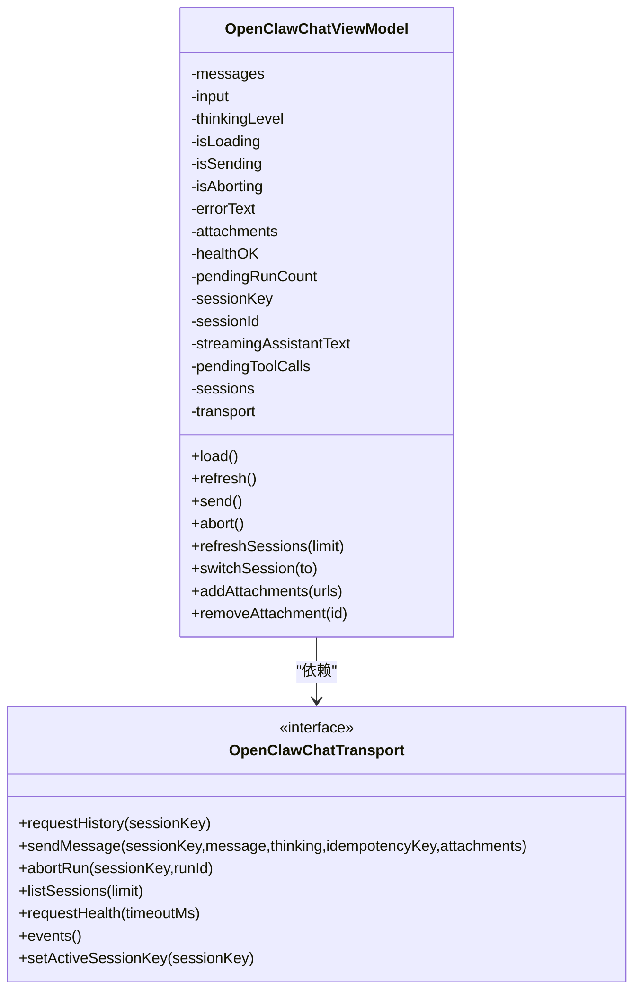
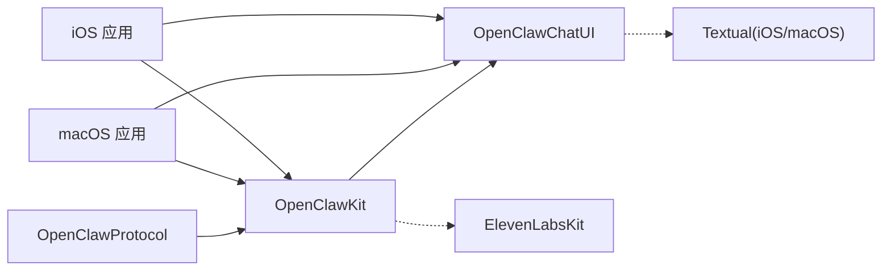

# 共享代码集成

<cite>
**本文档引用的文件**
- [apps/shared/OpenClawKit/Package.swift](file://apps/shared/OpenClawKit/Package.swift)
- [apps/shared/OpenClawKit/Sources/OpenClawProtocol/GatewayModels.swift](file://apps/shared/OpenClawKit/Sources/OpenClawProtocol/GatewayModels.swift)
- [apps/shared/OpenClawKit/Sources/OpenClawKit/GatewayChannel.swift](file://apps/shared/OpenClawKit/Sources/OpenClawKit/GatewayChannel.swift)
- [apps/shared/OpenClawKit/Sources/OpenClawKit/GatewayPayloadDecoding.swift](file://apps/shared/OpenClawKit/Sources/OpenClawKit/GatewayPayloadDecoding.swift)
- [apps/shared/OpenClawKit/Sources/OpenClawKit/DeviceIdentity.swift](file://apps/shared/OpenClawKit/Sources/OpenClawKit/DeviceIdentity.swift)
- [apps/shared/OpenClawKit/Sources/OpenClawKit/Capabilities.swift](file://apps/shared/OpenClawKit/Sources/OpenClawKit/Capabilities.swift)
- [apps/shared/OpenClawKit/Sources/OpenClawChatUI/ChatTransport.swift](file://apps/shared/OpenClawKit/Sources/OpenClawChatUI/ChatTransport.swift)
- [apps/shared/OpenClawKit/Sources/OpenClawChatUI/ChatModels.swift](file://apps/shared/OpenClawKit/Sources/OpenClawChatUI/ChatModels.swift)
- [apps/shared/OpenClawKit/Sources/OpenClawChatUI/ChatViewModel.swift](file://apps/shared/OpenClawKit/Sources/OpenClawChatUI/ChatViewModel.swift)
- [apps/shared/OpenClawKit/Sources/OpenClawKit/OpenClawKitResources.swift](file://apps/shared/OpenClawKit/Sources/OpenClawKit/OpenClawKitResources.swift)
- [apps/shared/OpenClawKit/Tests/OpenClawKitTests/ChatViewModelTests.swift](file://apps/shared/OpenClawKit/Tests/OpenClawKitTests/ChatViewModelTests.swift)
- [apps/ios/README.md](file://apps/ios/README.md)
- [apps/macos/Package.swift](file://apps/macos/Package.swift)
</cite>

## 目录

1. [简介](#简介)
2. [项目结构](#项目结构)
3. [核心组件](#核心组件)
4. [架构总览](#架构总览)
5. [详细组件分析](#详细组件分析)
6. [依赖分析](#依赖分析)
7. [性能考虑](#性能考虑)
8. [故障排除指南](#故障排除指南)
9. [结论](#结论)
10. [附录](#附录)

## 简介

本文件面向OpenClaw iOS应用的共享代码集成，系统性阐述apps/shared/OpenClawKit的作用与架构，重点覆盖以下方面：

- 共享传输层与类型定义的复用：通过OpenClawProtocol统一协议模型，通过OpenClawKit实现WebSocket网关连接与请求封装，通过OpenClawChatUI提供聊天UI与视图模型。
- iOS应用如何利用OpenClawKit：iOS端通过GatewayConnectionController与GatewayChannel建立连接，使用OpenClawChatUI的ChatTransport接口与视图模型进行消息收发、会话管理与事件处理。
- 模块划分、接口定义与依赖关系：Package.swift定义了OpenClawProtocol、OpenClawKit、OpenClawChatUI三库产品及其依赖；各模块职责清晰、边界明确。
- 跨平台代码共享最佳实践、版本兼容性与更新策略：严格并发特性启用、资源包定位兼容、平台条件编译等。
- 测试方法、调试技巧与性能优化：单元测试与行为测试、日志与错误包装、超时与重连机制。
- 扩展与定制共享功能的指导：新增命令、能力与UI扩展的建议路径。

## 项目结构

OpenClawKit采用Swift Package Manager组织，核心目录与产物如下：

- OpenClawProtocol：生成的协议模型与通用类型（如AnyCodable），用于跨端一致的帧格式与参数结构。
- OpenClawKit：传输层与设备身份、网关通道、资源加载等基础能力。
- OpenClawChatUI：聊天UI协议、模型与视图模型，负责消息渲染、工具调用、会话列表与健康检查等。

图表来源

- [apps/shared/OpenClawKit/Package.swift](file://apps/shared/OpenClawKit/Package.swift#L5-L61)
- [apps/macos/Package.swift](file://apps/macos/Package.swift#L26-L67)

章节来源

- [apps/shared/OpenClawKit/Package.swift](file://apps/shared/OpenClawKit/Package.swift#L5-L61)
- [apps/ios/README.md](file://apps/ios/README.md#L64-L66)

## 核心组件

- OpenClawProtocol：定义协议版本、错误码、连接参数、帧结构（请求/响应/事件）、快照与状态版本、以及各类业务参数（发送、轮询、代理、配对等）。
- OpenClawKit：提供网关通道GatewayChannelActor，封装WebSocket连接、认证挑战、心跳保活、请求/响应与事件推送、超时与指数退避重连。
- OpenClawChatUI：定义聊天传输协议OpenClawChatTransport及事件流，提供聊天消息模型、会话模型、附件模型与视图模型OpenClawChatViewModel，负责消息去重、工具调用、运行超时与健康检查。
- 设备身份与权限：DeviceIdentity与DeviceIdentityStore负责设备密钥对生成、持久化与签名；Capabilities枚举描述可用能力集合。
- 资源加载：OpenClawKitResources提供跨环境的资源Bundle定位，避免打包后资源查找失败。

章节来源

- [apps/shared/OpenClawKit/Sources/OpenClawProtocol/GatewayModels.swift](file://apps/shared/OpenClawKit/Sources/OpenClawProtocol/GatewayModels.swift#L1-L2796)
- [apps/shared/OpenClawKit/Sources/OpenClawKit/GatewayChannel.swift](file://apps/shared/OpenClawKit/Sources/OpenClawKit/GatewayChannel.swift#L117-L737)
- [apps/shared/OpenClawKit/Sources/OpenClawChatUI/ChatTransport.swift](file://apps/shared/OpenClawKit/Sources/OpenClawChatUI/ChatTransport.swift#L1-L46)
- [apps/shared/OpenClawKit/Sources/OpenClawChatUI/ChatModels.swift](file://apps/shared/OpenClawKit/Sources/OpenClawChatUI/ChatModels.swift#L1-L333)
- [apps/shared/OpenClawKit/Sources/OpenClawChatUI/ChatViewModel.swift](file://apps/shared/OpenClawKit/Sources/OpenClawChatUI/ChatViewModel.swift#L15-L555)
- [apps/shared/OpenClawKit/Sources/OpenClawKit/DeviceIdentity.swift](file://apps/shared/OpenClawKit/Sources/OpenClawKit/DeviceIdentity.swift#L1-L113)
- [apps/shared/OpenClawKit/Sources/OpenClawKit/Capabilities.swift](file://apps/shared/OpenClawKit/Sources/OpenClawKit/Capabilities.swift#L1-L16)
- [apps/shared/OpenClawKit/Sources/OpenClawKit/OpenClawKitResources.swift](file://apps/shared/OpenClawKit/Sources/OpenClawKit/OpenClawKitResources.swift#L1-L30)

## 架构总览

OpenClawKit在iOS/macOS之间共享传输层与UI层，核心流程如下：

- 连接建立：GatewayChannelActor通过WebSocket连接到网关，发送connect帧并处理挑战/响应，存储设备令牌与心跳策略。
- 请求/响应：通过request方法编码请求帧，等待响应或超时；send方法用于无需等待的推送。
- 事件处理：接收事件帧（聊天、代理、心跳、序列号断点），驱动视图模型更新。
- UI层：OpenClawChatViewModel订阅事件流，维护消息历史、工具调用、运行状态与健康检查。

图表来源

- [apps/shared/OpenClawKit/Sources/OpenClawKit/GatewayChannel.swift](file://apps/shared/OpenClawKit/Sources/OpenClawKit/GatewayChannel.swift#L595-L666)
- [apps/shared/OpenClawKit/Sources/OpenClawChatUI/ChatTransport.swift](file://apps/shared/OpenClawKit/Sources/OpenClawChatUI/ChatTransport.swift#L11-L27)
- [apps/shared/OpenClawKit/Sources/OpenClawChatUI/ChatViewModel.swift](file://apps/shared/OpenClawKit/Sources/OpenClawChatUI/ChatViewModel.swift#L55-L69)

## 详细组件分析

### 网关通道与连接（GatewayChannelActor）

- 角色与职责：封装WebSocket任务、连接选项、认证来源、心跳与超时、指数退避重连、挂起请求管理与错误包装。
- 关键流程：
  - 连接：构造connect帧，注入客户端信息、能力、权限、语言与用户代理，可选设备身份签名与挑战nonce。
  - 心跳：根据策略周期性检查lastTick，超时则触发重连。
  - 事件：解析事件帧，分发到pushHandler；处理序列号断点与错误。
  - 请求：encodeRequest编码，带超时控制，异常时标记断开并触发重连。
- 错误处理：统一wrap错误上下文，便于UI展示；超时与发送失败均视为socket断开并重连。

图表来源

- [apps/shared/OpenClawKit/Sources/OpenClawKit/GatewayChannel.swift](file://apps/shared/OpenClawKit/Sources/OpenClawKit/GatewayChannel.swift#L117-L737)

章节来源

- [apps/shared/OpenClawKit/Sources/OpenClawKit/GatewayChannel.swift](file://apps/shared/OpenClawKit/Sources/OpenClawKit/GatewayChannel.swift#L117-L737)

### 协议模型与解码（OpenClawProtocol 与 GatewayPayloadDecoding）

- 协议模型：包含协议版本常量、错误码、连接参数、帧结构（请求/响应/事件）、快照与状态版本、以及各类业务参数（发送、轮询、代理、配对等）。
- 解码工具：GatewayPayloadDecoding提供AnyCodable与OpenClawProtocol.AnyCodable之间的双向解码，确保跨端一致的数据流转。

图表来源

- [apps/shared/OpenClawKit/Sources/OpenClawProtocol/GatewayModels.swift](file://apps/shared/OpenClawKit/Sources/OpenClawProtocol/GatewayModels.swift#L1-L2796)
- [apps/shared/OpenClawKit/Sources/OpenClawKit/GatewayPayloadDecoding.swift](file://apps/shared/OpenClawKit/Sources/OpenClawKit/GatewayPayloadDecoding.swift#L4-L36)

章节来源

- [apps/shared/OpenClawKit/Sources/OpenClawProtocol/GatewayModels.swift](file://apps/shared/OpenClawKit/Sources/OpenClawProtocol/GatewayModels.swift#L1-L2796)
- [apps/shared/OpenClawKit/Sources/OpenClawKit/GatewayPayloadDecoding.swift](file://apps/shared/OpenClawKit/Sources/OpenClawKit/GatewayPayloadDecoding.swift#L4-L36)

### 设备身份与权限（DeviceIdentity 与 Capabilities）

- 设备身份：DeviceIdentityStore负责生成/加载设备密钥对，计算设备ID，提供签名与公钥Base64Url编码；支持自定义状态目录。
- 权限与能力：Capabilities枚举定义可用能力集合（画布、相机、屏幕、语音唤醒、位置、设备、相册、联系人、日历、提醒、运动等）。

章节来源

- [apps/shared/OpenClawKit/Sources/OpenClawKit/DeviceIdentity.swift](file://apps/shared/OpenClawKit/Sources/OpenClawKit/DeviceIdentity.swift#L1-L113)
- [apps/shared/OpenClawKit/Sources/OpenClawKit/Capabilities.swift](file://apps/shared/OpenClawKit/Sources/OpenClawKit/Capabilities.swift#L1-L16)

### 聊天UI协议与视图模型（OpenClawChatUI）

- 协议层：OpenClawChatTransport定义历史拉取、消息发送、运行中止、会话列表、健康检查与事件流；提供默认空实现以增强可扩展性。
- 模型层：OpenClawChatModels定义消息内容、消息、历史、会话预览、发送响应、事件载荷、待处理工具调用、附件等。
- 视图模型：OpenClawChatViewModel订阅事件流，维护消息去重、工具调用队列、运行超时、健康检查与会话选择逻辑；负责附件上传与预览。

图表来源

- [apps/shared/OpenClawKit/Sources/OpenClawChatUI/ChatTransport.swift](file://apps/shared/OpenClawKit/Sources/OpenClawChatUI/ChatTransport.swift#L11-L46)
- [apps/shared/OpenClawKit/Sources/OpenClawChatUI/ChatViewModel.swift](file://apps/shared/OpenClawKit/Sources/OpenClawChatUI/ChatViewModel.swift#L15-L555)

章节来源

- [apps/shared/OpenClawKit/Sources/OpenClawChatUI/ChatTransport.swift](file://apps/shared/OpenClawKit/Sources/OpenClawChatUI/ChatTransport.swift#L1-L46)
- [apps/shared/OpenClawKit/Sources/OpenClawChatUI/ChatModels.swift](file://apps/shared/OpenClawKit/Sources/OpenClawChatUI/ChatModels.swift#L1-L333)
- [apps/shared/OpenClawKit/Sources/OpenClawChatUI/ChatViewModel.swift](file://apps/shared/OpenClawKit/Sources/OpenClawChatUI/ChatViewModel.swift#L15-L555)

### iOS应用集成要点

- iOS应用通过GatewayConnectionController与GatewayChannel建立连接，并使用IOSGatewayChatTransport实现OpenClawChatTransport协议，从而复用OpenClawChatUI的视图模型与UI。
- iOS README明确指出共享代码位于apps/shared/OpenClawKit，供iOS/macOS共同使用。

章节来源

- [apps/ios/README.md](file://apps/ios/README.md#L64-L66)

## 依赖分析

- 包定义：OpenClawKit定义三个库产品：OpenClawProtocol、OpenClawKit、OpenClawChatUI；OpenClawKit依赖ElevenLabsKit；OpenClawChatUI依赖Textual（仅在macOS/iOS平台）。
- 平台要求：最低iOS 18、macOS 15。
- 依赖链：OpenClawChatUI依赖OpenClawKit；OpenClawKit依赖OpenClawProtocol；macOS应用直接依赖OpenClawKit与OpenClawChatUI。

图表来源

- [apps/shared/OpenClawKit/Package.swift](file://apps/shared/OpenClawKit/Package.swift#L16-L48)
- [apps/macos/Package.swift](file://apps/macos/Package.swift#L26-L67)

章节来源

- [apps/shared/OpenClawKit/Package.swift](file://apps/shared/OpenClawKit/Package.swift#L5-L61)
- [apps/macos/Package.swift](file://apps/macos/Package.swift#L26-L67)

## 性能考虑

- 连接与重连：指数退避与看门狗定时器降低网络抖动影响；最大消息尺寸提升以适配大体量快照/历史载荷。
- 超时与并发：请求超时与挂起请求清理，避免内存泄漏；StrictConcurrency启用保证并发安全。
- UI响应：乐观更新用户消息、附件预览与去重算法减少重复渲染；健康检查与心跳保活维持长连接稳定。
- 资源加载：OpenClawKitResources兼容多种Bundle定位，避免资源缺失导致崩溃。

章节来源

- [apps/shared/OpenClawKit/Sources/OpenClawKit/GatewayChannel.swift](file://apps/shared/OpenClawKit/Sources/OpenClawKit/GatewayChannel.swift#L50-L56)
- [apps/shared/OpenClawKit/Sources/OpenClawKit/GatewayChannel.swift](file://apps/shared/OpenClawKit/Sources/OpenClawKit/GatewayChannel.swift#L136-L142)
- [apps/shared/OpenClawKit/Sources/OpenClawKit/OpenClawKitResources.swift](file://apps/shared/OpenClawKit/Sources/OpenClawKit/OpenClawKitResources.swift#L1-L30)
- [apps/shared/OpenClawKit/Sources/OpenClawChatUI/ChatViewModel.swift](file://apps/shared/OpenClawKit/Sources/OpenClawChatUI/ChatViewModel.swift#L183-L206)

## 故障排除指南

- 连接失败：检查connect超时、挑战超时与错误包装；查看日志输出与断线回调；确认设备身份与令牌有效性。
- 事件中断：序列号断点触发提示“事件流中断”，建议刷新界面；检查心跳间隔与lastTick。
- 请求超时：默认请求超时配置，必要时传入自定义timeoutMs；超时后清理挂起请求并提示用户重试。
- 调试技巧：使用AsyncStream事件流与日志记录；在测试中模拟事件与响应，验证视图模型行为。
- 资源问题：若资源无法加载，检查OpenClawKitResources的Bundle定位逻辑。

章节来源

- [apps/shared/OpenClawKit/Sources/OpenClawKit/GatewayChannel.swift](file://apps/shared/OpenClawKit/Sources/OpenClawKit/GatewayChannel.swift#L234-L255)
- [apps/shared/OpenClawKit/Sources/OpenClawKit/GatewayChannel.swift](file://apps/shared/OpenClawKit/Sources/OpenClawKit/GatewayChannel.swift#L487-L496)
- [apps/shared/OpenClawKit/Sources/OpenClawKit/GatewayChannel.swift](file://apps/shared/OpenClawKit/Sources/OpenClawKit/GatewayChannel.swift#L726-L733)
- [apps/shared/OpenClawKit/Sources/OpenClawKit/OpenClawKitResources.swift](file://apps/shared/OpenClawKit/Sources/OpenClawKit/OpenClawKitResources.swift#L18-L30)
- [apps/shared/OpenClawKit/Tests/OpenClawKitTests/ChatViewModelTests.swift](file://apps/shared/OpenClawKit/Tests/OpenClawKitTests/ChatViewModelTests.swift#L1-L503)

## 结论

OpenClawKit通过清晰的模块划分与严格的并发设计，实现了iOS与macOS间的共享传输层与UI层。其核心优势在于：

- 统一协议模型与传输抽象，简化跨端开发；
- 完善的连接生命周期管理与错误处理，保障稳定性；
- 可测试的UI协议与视图模型，便于行为验证；
- 资源加载与平台兼容策略，降低部署风险。

## 附录

### 版本兼容性与更新策略

- 平台版本：iOS 18+、macOS 15+；升级前需评估平台最低版本要求。
- 协议版本：GATEWAY_PROTOCOL_VERSION由OpenClawProtocol统一管理，升级时需同步前后端协议版本范围。
- 依赖版本：ElevenLabsKit与Textual版本固定，升级需进行兼容性测试。

章节来源

- [apps/shared/OpenClawKit/Package.swift](file://apps/shared/OpenClawKit/Package.swift#L7-L19)

### 测试方法与调试技巧

- 行为测试：使用Swift Testing框架编写ChatViewModel测试，模拟事件流与响应，验证消息去重、工具调用、运行超时与会话切换。
- 单元测试：针对解码、资源定位、设备身份等模块进行独立测试。
- 调试建议：开启日志、捕获错误上下文、使用异步流断点与超时等待辅助定位问题。

章节来源

- [apps/shared/OpenClawKit/Tests/OpenClawKitTests/ChatViewModelTests.swift](file://apps/shared/OpenClawKit/Tests/OpenClawKitTests/ChatViewModelTests.swift#L1-L503)

### 扩展与定制共享功能指导

- 新增命令：在OpenClawProtocol中补充参数模型，在OpenClawKit中扩展GatewayChannelActor的请求方法或在OpenClawChatUI中增加对应UI交互。
- 新增能力：在Capabilities中添加新能力枚举值，并在设备身份与权限校验处完善逻辑。
- UI扩展：基于OpenClawChatTransport协议实现新的传输实现，或在OpenClawChatViewModel中扩展消息渲染与工具调用处理。

章节来源

- [apps/shared/OpenClawKit/Sources/OpenClawKit/Capabilities.swift](file://apps/shared/OpenClawKit/Sources/OpenClawKit/Capabilities.swift#L1-L16)
- [apps/shared/OpenClawKit/Sources/OpenClawChatUI/ChatTransport.swift](file://apps/shared/OpenClawKit/Sources/OpenClawChatUI/ChatTransport.swift#L11-L46)
