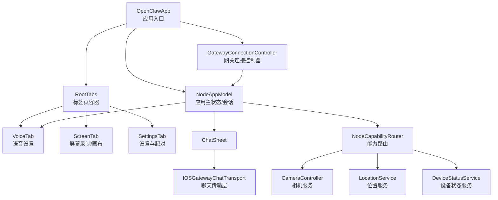
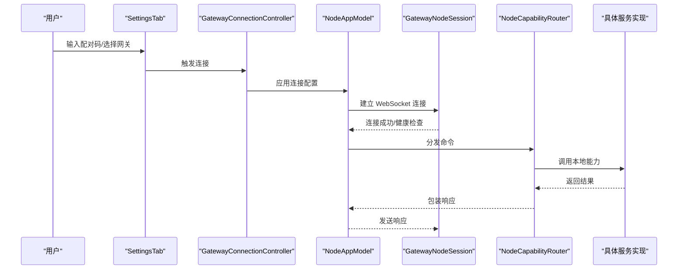
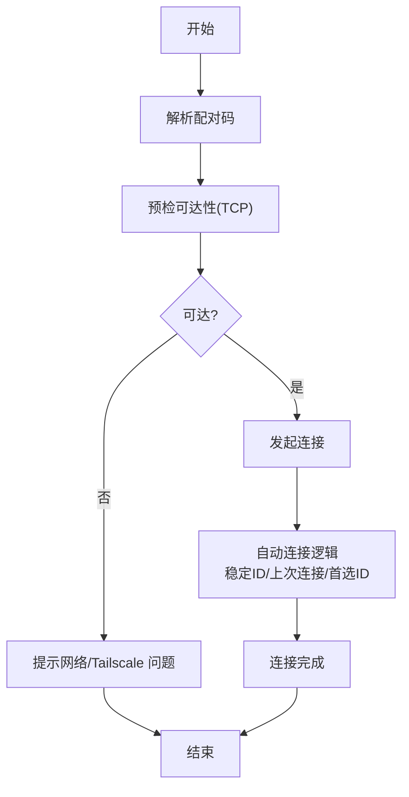
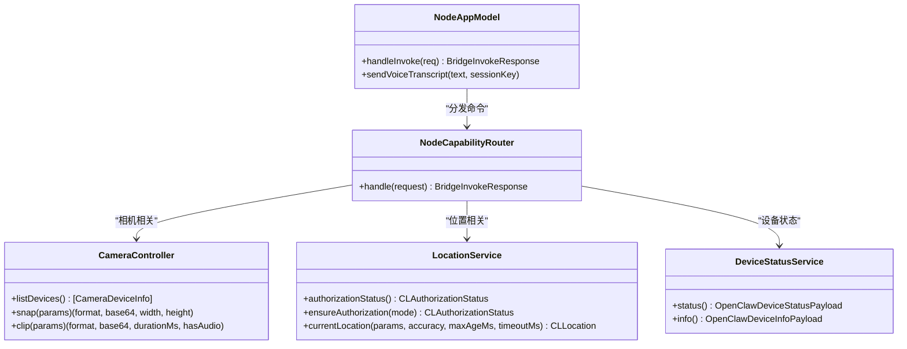
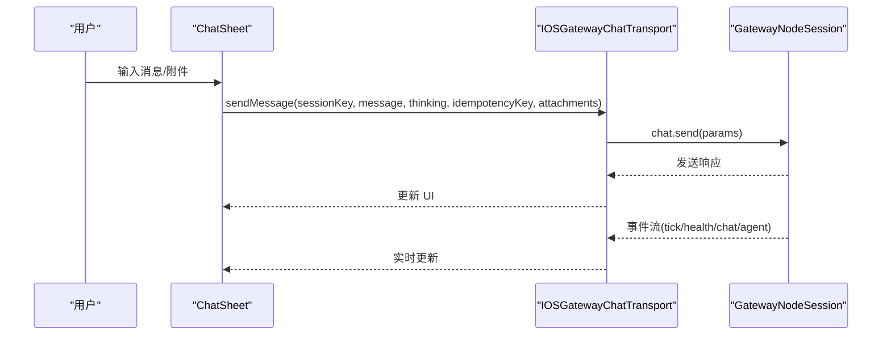
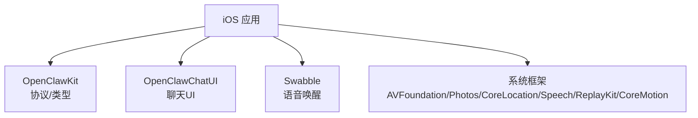

# 应用概述

<cite>
**本文引用的文件**
- [README.md](file://apps/ios/README.md)
- [project.yml](file://apps/ios/project.yml)
- [OpenClawApp.swift](file://apps/ios/Sources/OpenClawApp.swift)
- [GatewayConnectionController.swift](file://apps/ios/Sources/Gateway/GatewayConnectionController.swift)
- [NodeAppModel.swift](file://apps/ios/Sources/Model/NodeAppModel.swift)
- [NodeCapabilityRouter.swift](file://apps/ios/Sources/Capabilities/NodeCapabilityRouter.swift)
- [VoiceTab.swift](file://apps/ios/Sources/Voice/VoiceTab.swift)
- [ChatSheet.swift](file://apps/ios/Sources/Chat/ChatSheet.swift)
- [IOSGatewayChatTransport.swift](file://apps/ios/Sources/Chat/IOSGatewayChatTransport.swift)
- [RootTabs.swift](file://apps/ios/Sources/RootTabs.swift)
- [SettingsTab.swift](file://apps/ios/Sources/Settings/SettingsTab.swift)
- [NodeServiceProtocols.swift](file://apps/ios/Sources/Services/NodeServiceProtocols.swift)
- [DeviceStatusService.swift](file://apps/ios/Sources/Device/DeviceStatusService.swift)
- [LocationService.swift](file://apps/ios/Sources/Location/LocationService.swift)
- [CameraController.swift](file://apps/ios/Sources/Camera/CameraController.swift)
</cite>

## 目录

1. [简介](#简介)
2. [项目结构](#项目结构)
3. [核心组件](#核心组件)
4. [架构总览](#架构总览)
5. [详细组件分析](#详细组件分析)
6. [依赖关系分析](#依赖关系分析)
7. [性能考量](#性能考量)
8. [故障排查指南](#故障排查指南)
9. [结论](#结论)
10. [附录](#附录)

## 简介

OpenClaw iOS 应用是一个处于 alpha 阶段的节点（role: node）客户端，用于连接到 OpenClaw 网关，提供设备能力暴露与交互界面。其核心目标是：

- 通过 ws:// 或 wss:// 连接到网关
- 与网关进行配对（需经由 bot 批准）
- 暴露手机服务（相机、位置、相册、日历、提醒事项、运动等），受 iOS 权限控制
- 提供 Talk 与 Chat 界面（alpha）

当前状态与已知限制：

- UI 与引导流程快速迭代中
- 后台行为尚不稳定（前台运行为当前受支持模式）
- 权限为可选，应用应被视为敏感，需要进一步加固

## 项目结构

iOS 应用采用 SwiftUI + 观察模型（@Observable）组织，核心模块包括：

- 应用入口与生命周期：OpenClawApp
- 网关连接与发现：GatewayConnectionController
- 应用主状态与会话：NodeAppModel
- 设备能力路由：NodeCapabilityRouter
- 语音与通话：VoiceTab、TalkModeManager（集成于 NodeAppModel）
- 聊天界面：ChatSheet、IOSGatewayChatTransport
- 设置与配对：SettingsTab
- 设备服务接口与实现：NodeServiceProtocols、DeviceStatusService、LocationService、CameraController 等

图表来源

- [OpenClawApp.swift](file://apps/ios/Sources/OpenClawApp.swift#L1-L32)
- [RootTabs.swift](file://apps/ios/Sources/RootTabs.swift#L1-L170)
- [SettingsTab.swift](file://apps/ios/Sources/Settings/SettingsTab.swift#L1-L969)
- [GatewayConnectionController.swift](file://apps/ios/Sources/Gateway/GatewayConnectionController.swift#L1-L667)
- [NodeAppModel.swift](file://apps/ios/Sources/Model/NodeAppModel.swift#L1-L1813)
- [NodeCapabilityRouter.swift](file://apps/ios/Sources/Capabilities/NodeCapabilityRouter.swift#L1-L26)
- [CameraController.swift](file://apps/ios/Sources/Camera/CameraController.swift#L1-L407)
- [LocationService.swift](file://apps/ios/Sources/Location/LocationService.swift#L1-L139)
- [DeviceStatusService.swift](file://apps/ios/Sources/Device/DeviceStatusService.swift#L1-L88)
- [ChatSheet.swift](file://apps/ios/Sources/Chat/ChatSheet.swift#L1-L48)
- [IOSGatewayChatTransport.swift](file://apps/ios/Sources/Chat/IOSGatewayChatTransport.swift#L1-L130)

章节来源

- [README.md](file://apps/ios/README.md#L1-L67)
- [project.yml](file://apps/ios/project.yml#L1-L135)

## 核心组件

- 应用入口与环境注入：OpenClawApp 初始化 NodeAppModel 与 GatewayConnectionController，并注入到根视图与子视图环境。
- 网关连接控制器：负责网关发现、自动连接、TLS 参数解析、连接配置下发与健康监测。
- 应用主状态：NodeAppModel 维护两个会话（node/operator）、语音唤醒与通话模式、设备能力调用、深链与 A2UI 动作处理。
- 能力路由：NodeCapabilityRouter 将网关下发的命令分发到具体服务实现。
- 聊天传输：IOSGatewayChatTransport 将聊天请求映射为网关 RPC 并订阅事件流。
- 设置与配对：SettingsTab 提供配对码输入、手动连接、自动连接开关、发现日志与调试信息。

章节来源

- [OpenClawApp.swift](file://apps/ios/Sources/OpenClawApp.swift#L1-L32)
- [GatewayConnectionController.swift](file://apps/ios/Sources/Gateway/GatewayConnectionController.swift#L1-L667)
- [NodeAppModel.swift](file://apps/ios/Sources/Model/NodeAppModel.swift#L1-L1813)
- [NodeCapabilityRouter.swift](file://apps/ios/Sources/Capabilities/NodeCapabilityRouter.swift#L1-L26)
- [IOSGatewayChatTransport.swift](file://apps/ios/Sources/Chat/IOSGatewayChatTransport.swift#L1-L130)
- [SettingsTab.swift](file://apps/ios/Sources/Settings/SettingsTab.swift#L1-L969)

## 架构总览

iOS 应用以 NodeAppModel 为中心协调各模块，通过 GatewayNodeSession 与网关建立双向通信；NodeCapabilityRouter 将网关侧的“invoke”请求转发至本地服务；SettingsTab 负责配对与连接参数配置；VoiceTab 与 ChatSheet 提供语音唤醒与聊天界面。

图表来源

- [SettingsTab.swift](file://apps/ios/Sources/Settings/SettingsTab.swift#L599-L724)
- [GatewayConnectionController.swift](file://apps/ios/Sources/Gateway/GatewayConnectionController.swift#L59-L148)
- [NodeAppModel.swift](file://apps/ios/Sources/Model/NodeAppModel.swift#L623-L673)
- [NodeCapabilityRouter.swift](file://apps/ios/Sources/Capabilities/NodeCapabilityRouter.swift#L19-L24)

## 详细组件分析

### 网关连接与配对流程

- 自动发现与连接：GatewayConnectionController 使用 Bonjour/mDNS 发现网关，根据稳定 ID 与上次连接信息决定是否自动连接。
- TLS 参数：根据网关返回或存储的指纹决定是否强制 TLS，支持 TOFU（首次信任）策略。
- 手动连接：支持指定主机、端口与 TLS 开关，自动推断端口（尾网域名默认 443，否则 18789）。
- 配对码流程：SettingsTab 解析配对码（支持 JSON 或 Base64），预检可达性后发起连接；连接成功后可在设置中选择代理的 Agent。

图表来源

- [SettingsTab.swift](file://apps/ios/Sources/Settings/SettingsTab.swift#L599-L724)
- [GatewayConnectionController.swift](file://apps/ios/Sources/Gateway/GatewayConnectionController.swift#L173-L289)

章节来源

- [README.md](file://apps/ios/README.md#L18-L26)
- [SettingsTab.swift](file://apps/ios/Sources/Settings/SettingsTab.swift#L599-L724)
- [GatewayConnectionController.swift](file://apps/ios/Sources/Gateway/GatewayConnectionController.swift#L342-L397)

### 设备能力暴露与权限管理

- 能力列表：根据开关与授权状态动态暴露（画布、屏幕录制、相机、语音唤醒、位置、设备、相册、通讯录、日历、提醒、运动）。
- 权限检查：在调用前检查相机、麦克风、语音识别、位置、屏幕录制、相册、联系人、日历、提醒、运动等权限。
- 前台限制：部分命令（画布、相机、屏幕录制、通话）仅在前台可用，后台会返回相应错误。

图表来源

- [NodeCapabilityRouter.swift](file://apps/ios/Sources/Capabilities/NodeCapabilityRouter.swift#L1-L26)
- [CameraController.swift](file://apps/ios/Sources/Camera/CameraController.swift#L1-L407)
- [LocationService.swift](file://apps/ios/Sources/Location/LocationService.swift#L1-L139)
- [DeviceStatusService.swift](file://apps/ios/Sources/Device/DeviceStatusService.swift#L1-L88)
- [NodeAppModel.swift](file://apps/ios/Sources/Model/NodeAppModel.swift#L627-L737)

章节来源

- [GatewayConnectionController.swift](file://apps/ios/Sources/Gateway/GatewayConnectionController.swift#L458-L570)
- [NodeAppModel.swift](file://apps/ios/Sources/Model/NodeAppModel.swift#L627-L737)
- [NodeServiceProtocols.swift](file://apps/ios/Sources/Services/NodeServiceProtocols.swift#L1-L65)

### 聊天与 Talk 界面

- 聊天传输：IOSGatewayChatTransport 将消息发送、历史拉取、会话切换、中断运行等操作映射为网关 RPC，并订阅服务器事件流。
- 聊天视图：ChatSheet 封装 OpenClawChatViewModel，提供会话切换与用户主题色支持。
- Talk 模式：NodeAppModel 内置 TalkModeManager，与语音唤醒互斥，避免麦克风抢占。

图表来源

- [ChatSheet.swift](file://apps/ios/Sources/Chat/ChatSheet.swift#L1-L48)
- [IOSGatewayChatTransport.swift](file://apps/ios/Sources/Chat/IOSGatewayChatTransport.swift#L50-L83)
- [NodeAppModel.swift](file://apps/ios/Sources/Model/NodeAppModel.swift#L470-L490)

章节来源

- [VoiceTab.swift](file://apps/ios/Sources/Voice/VoiceTab.swift#L1-L47)
- [RootTabs.swift](file://apps/ios/Sources/RootTabs.swift#L1-L170)
- [ChatSheet.swift](file://apps/ios/Sources/Chat/ChatSheet.swift#L1-L48)
- [IOSGatewayChatTransport.swift](file://apps/ios/Sources/Chat/IOSGatewayChatTransport.swift#L1-L130)

### 应用主状态与生命周期

- 场景切换：NodeAppModel 在前台/后台切换时暂停/恢复语音唤醒与通话，必要时进行健康检查或重连。
- 会话键：支持主会话键与按 Agent 切换的会话键组合。
- 深链与 A2UI：处理来自网关的深链与 A2UI 动作，触发相应业务流程。

章节来源

- [OpenClawApp.swift](file://apps/ios/Sources/OpenClawApp.swift#L1-L32)
- [NodeAppModel.swift](file://apps/ios/Sources/Model/NodeAppModel.swift#L266-L326)
- [NodeAppModel.swift](file://apps/ios/Sources/Model/NodeAppModel.swift#L188-L263)

## 依赖关系分析

- 外部框架与系统服务：AVFoundation、Photos、CoreLocation、Speech、ReplayKit、CoreMotion 等。
- 共享包：OpenClawKit（协议与类型）、OpenClawChatUI（聊天 UI）、Swabble（语音唤醒相关）。
- 系统权限与网络：Info.plist 中声明了网络发现、相机、位置、麦克风、语音识别、Bonjour 服务等用途描述。

图表来源

- [project.yml](file://apps/ios/project.yml#L12-L42)
- [OpenClawApp.swift](file://apps/ios/Sources/OpenClawApp.swift#L1-L32)

章节来源

- [project.yml](file://apps/ios/project.yml#L1-L135)

## 性能考量

- 前台优先：相机、屏幕录制、画布与通话命令在后台受限，避免后台资源占用与异常。
- 负载控制：相机快照与视频导出默认限制最大宽度与时长，防止超大负载；Base64 编码后大小受控。
- 连接健康：Operator 会话定期健康检查，异常自动断开并尝试重连。
- 资源释放：后台暂停语音唤醒与通话，释放麦克风；前台恢复时按需恢复。

章节来源

- [NodeAppModel.swift](file://apps/ios/Sources/Model/NodeAppModel.swift#L627-L678)
- [CameraController.swift](file://apps/ios/Sources/Camera/CameraController.swift#L49-L103)
- [CameraController.swift](file://apps/ios/Sources/Camera/CameraController.swift#L118-L189)
- [NodeAppModel.swift](file://apps/ios/Sources/Model/NodeAppModel.swift#L492-L523)

## 故障排查指南

- 连接失败
  - 检查网络与 Tailscale：Settings 中显示“Tailscale 关闭”提示时需开启。
  - 预检可达性：使用“连接（手动）”前先进行 TCP 探测。
  - 查看发现日志：启用“Discovery Debug Logs”查看最新日志条目。
- 权限问题
  - 相机/麦克风/位置/语音识别/相册/联系人/日历/提醒/运动未授权会导致对应命令失败。
  - 位置后台访问需“始终允许”，否则后台位置不可用。
- 语音唤醒与通话冲突
  - 同时启用语音唤醒与通话时，语音唤醒会暂停；通话结束后自动恢复。
- 前台限制
  - 相机/屏幕录制/画布/通话在后台不可用，需回到前台执行。

章节来源

- [SettingsTab.swift](file://apps/ios/Sources/Settings/SettingsTab.swift#L701-L724)
- [SettingsTab.swift](file://apps/ios/Sources/Settings/SettingsTab.swift#L185-L193)
- [NodeAppModel.swift](file://apps/ios/Sources/Model/NodeAppModel.swift#L328-L354)
- [NodeAppModel.swift](file://apps/ios/Sources/Model/NodeAppModel.swift#L630-L678)

## 结论

OpenClaw iOS 应用作为节点角色，围绕“连接—配对—能力暴露—交互”形成完整闭环。当前处于 alpha，UI 与后台行为仍在快速演进，建议在前台使用并谨慎授予权限。通过 Settings 的配对流程与健康监控，可稳定地接入网关并使用 Talk/Chat 等功能。

## 附录

- 推荐配对流程
  - 在 Telegram Bot 执行 /pair 获取配对码，粘贴到 iOS 设置中的“连接（带配对码）”，随后在 Bot 中 /pair approve 完成批准。
- 使用场景
  - 语音唤醒与通话：适合前台交互与免提通话
  - 聊天：跨设备会话与多 Agent 协作
  - 设备能力：拍照、录屏、位置共享、日历/提醒事项操作等

章节来源

- [README.md](file://apps/ios/README.md#L18-L26)
- [SettingsTab.swift](file://apps/ios/Sources/Settings/SettingsTab.swift#L48-L104)
