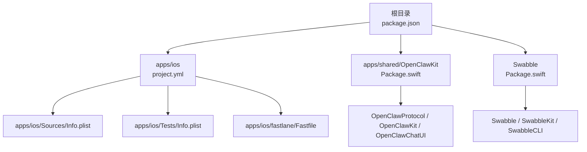
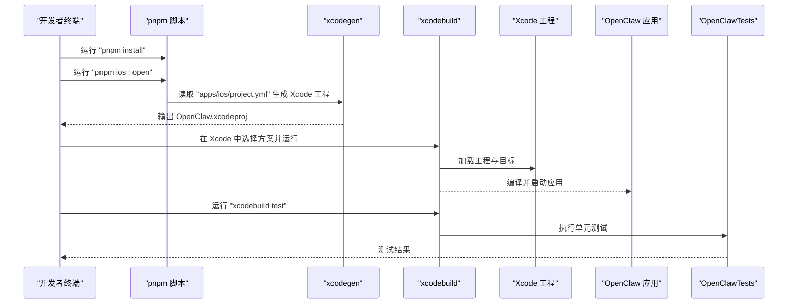
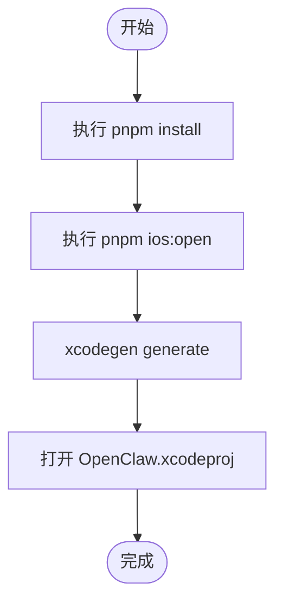
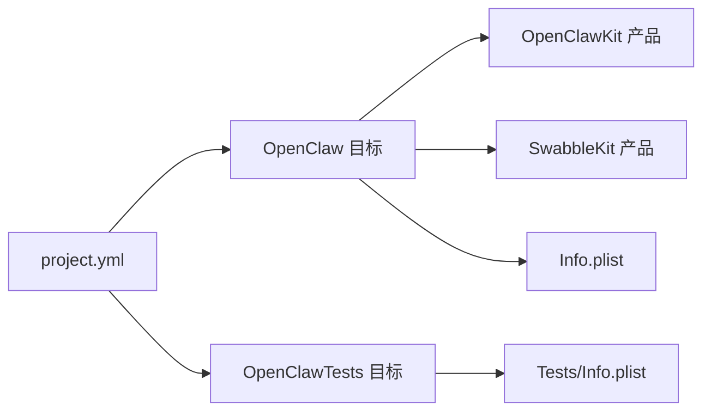
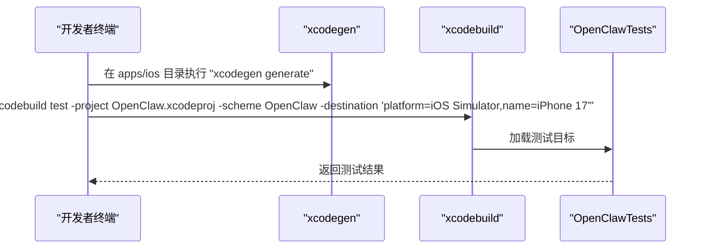
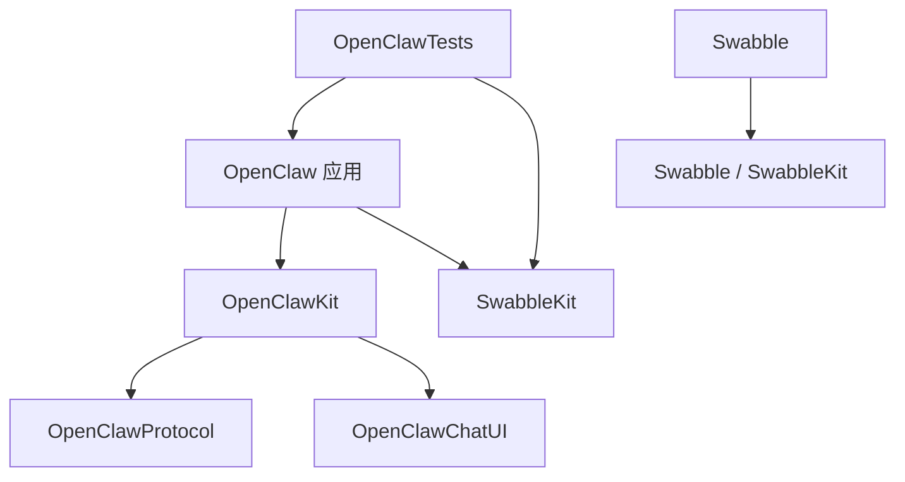

# 构建与配置

<cite>
**本文引用的文件**
- [package.json](file://package.json)
- [apps/ios/README.md](file://apps/ios/README.md)
- [apps/ios/project.yml](file://apps/ios/project.yml)
- [apps/ios/Sources/Info.plist](file://apps/ios/Sources/Info.plist)
- [apps/ios/Tests/Info.plist](file://apps/ios/Tests/Info.plist)
- [apps/ios/fastlane/Fastfile](file://apps/ios/fastlane/Fastfile)
- [apps/shared/OpenClawKit/Package.swift](file://apps/shared/OpenClawKit/Package.swift)
- [Swabble/Package.swift](file://Swabble/Package.swift)
</cite>

## 目录

1. [简介](#简介)
2. [项目结构](#项目结构)
3. [核心组件](#核心组件)
4. [架构总览](#架构总览)
5. [详细组件分析](#详细组件分析)
6. [依赖分析](#依赖分析)
7. [性能考虑](#性能考虑)
8. [故障排查指南](#故障排查指南)
9. [结论](#结论)
10. [附录](#附录)

## 简介

本文件面向在 macOS 上为 OpenClaw iOS 应用进行本地开发与构建的工程师，提供从环境准备到 CLI 构建、测试运行、签名配置与 Bundle Identifier 修改的完整指南。内容覆盖：

- 开发环境要求（Xcode、pnpm、xcodegen）
- 根目录构建流程（pnpm install、pnpm ios:open）
- Xcode 项目生成与运行设置
- CLI 构建命令（pnpm ios:build）与测试运行（xcodegen generate + xcodebuild test）
- 个人 Apple Development 团队签名配置与 Bundle Identifier 修改的必要性

## 项目结构

OpenClaw 采用多平台与多包管理的组织方式，iOS 应用位于 apps/ios，其构建脚本与配置由根目录的 package.json 和 apps/ios 的 project.yml 驱动；共享库 OpenClawKit 与 Swabble 通过 Swift Package Manager 管理。

图表来源

- [package.json](file://package.json#L33-L109)
- [apps/ios/project.yml](file://apps/ios/project.yml#L1-L135)
- [apps/shared/OpenClawKit/Package.swift](file://apps/shared/OpenClawKit/Package.swift#L1-L62)
- [Swabble/Package.swift](file://Swabble/Package.swift#L1-L56)

章节来源

- [package.json](file://package.json#L33-L109)
- [apps/ios/README.md](file://apps/ios/README.md#L1-L67)

## 核心组件

- 根级构建脚本与工具链
  - 使用 pnpm 作为包管理器与脚本入口，提供 ios:open、ios:build、ios:gen、ios:run 等脚本。
  - 依赖 xcodegen 生成 Xcode 工程，xcodebuild 执行构建与测试。
- iOS 工程定义
  - project.yml 定义工程名、部署目标、Swift 版本、包依赖、目标与方案、构建设置（签名、Team、Bundle Identifier、Provisioning Profile）等。
- 共享与测试配置
  - OpenClawKit 提供协议与 UI 组件，Swabble 提供语音与测试能力。
  - 测试目标 OpenClawTests 依赖主应用与 SwabbleKit，并指定测试宿主与加载器。

章节来源

- [package.json](file://package.json#L33-L109)
- [apps/ios/project.yml](file://apps/ios/project.yml#L1-L135)
- [apps/shared/OpenClawKit/Package.swift](file://apps/shared/OpenClawKit/Package.swift#L1-L62)
- [Swabble/Package.swift](file://Swabble/Package.swift#L1-L56)

## 架构总览

下图展示从仓库根目录到 Xcode 工程生成与运行的关键路径，以及与共享库的关系。

图表来源

- [package.json](file://package.json#L58-L61)
- [apps/ios/README.md](file://apps/ios/README.md#L27-L62)
- [apps/ios/project.yml](file://apps/ios/project.yml#L18-L27)

## 详细组件分析

### 开发环境与前置条件

- 必需工具
  - Xcode（当前稳定版）
  - pnpm（根目录 package.json 指定版本）
  - xcodegen（用于根据 project.yml 生成 Xcode 工程）
- 安装与验证
  - 安装 pnpm 后，确保其版本满足工作区要求。
  - 安装 xcodegen 并确认可被命令行调用。
  - 确保已登录 Apple Developer 账户并在 Xcode 中可用。

章节来源

- [apps/ios/README.md](file://apps/ios/README.md#L29-L34)
- [package.json](file://package.json#L192-L196)

### 根目录构建流程（pnpm install 与 pnpm ios:open）

- 步骤说明
  - 在仓库根目录执行 pnpm install，拉取所有依赖（含 iOS 子包与共享库）。
  - 执行 pnpm ios:open，该脚本会：
    - 生成 Xcode 工程（xcodegen generate）
    - 打开生成的 OpenClaw.xcodeproj 文件
- Xcode 工程生成依据
  - project.yml 中定义了工程名、部署目标、Swift 版本、包依赖、目标与方案、构建设置（签名、Team、Bundle Identifier、Provisioning Profile）等。

图表来源

- [package.json](file://package.json#L58-L61)
- [apps/ios/README.md](file://apps/ios/README.md#L35-L46)

章节来源

- [package.json](file://package.json#L33-L109)
- [apps/ios/README.md](file://apps/ios/README.md#L27-L46)

### Xcode 项目配置、方案与运行设置

- 工程与目标
  - 工程名：OpenClaw
  - 目标：OpenClaw（应用）、OpenClawTests（单元测试）
  - 方案：OpenClaw（包含构建与测试目标）
- 构建设置（签名与标识）
  - CODE_SIGN_IDENTITY：Apple Development
  - CODE_SIGN_STYLE：Manual
  - DEVELOPMENT_TEAM：Y5PE65HELJ（示例团队 ID）
  - PRODUCT_BUNDLE_IDENTIFIER：ai.openclaw.ios
  - PROVISIONING_PROFILE_SPECIFIER：ai.openclaw.ios Development
- 信息属性列表
  - 应用 Info.plist 与测试 Info.plist 均包含版本号、显示名称、权限描述等。
- 包与依赖
  - OpenClawKit（包含 OpenClawProtocol、OpenClawKit、OpenClawChatUI）
  - Swabble（包含 Swabble、SwabbleKit、SwabbleCLI）

图表来源

- [apps/ios/project.yml](file://apps/ios/project.yml#L18-L135)
- [apps/ios/Sources/Info.plist](file://apps/ios/Sources/Info.plist#L1-L73)
- [apps/ios/Tests/Info.plist](file://apps/ios/Tests/Info.plist#L1-L25)

章节来源

- [apps/ios/project.yml](file://apps/ios/project.yml#L1-L135)
- [apps/ios/Sources/Info.plist](file://apps/ios/Sources/Info.plist#L1-L73)
- [apps/ios/Tests/Info.plist](file://apps/ios/Tests/Info.plist#L1-L25)

### CLI 构建命令（pnpm ios:build）

- 命令行为
  - 在 apps/ios 目录下执行 xcodegen generate 生成工程
  - 使用 xcodebuild 指定项目、方案、目标设备与配置进行 Debug 构建
- 可选环境变量
  - IOS_DEST：自定义目标设备或模拟器名称
  - IOS_SIM：自定义模拟器名称（用于 ios:run 脚本中）
- 注意事项
  - 若使用个人 Apple Development 团队，需确保 Bundle Identifier 唯一且签名配置正确

章节来源

- [package.json](file://package.json#L58-L61)
- [apps/ios/README.md](file://apps/ios/README.md#L50-L54)

### 测试运行（xcodegen generate 与 xcodebuild test）

- 流程
  - 在 apps/ios 目录执行 xcodegen generate
  - 使用 xcodebuild test 指定项目、方案与目标模拟器（如 iPhone 17）执行测试
- 测试目标
  - OpenClawTests 依赖 OpenClaw 应用与 SwabbleKit，并设置 TEST_HOST 与 BUNDLE_LOADER

图表来源

- [apps/ios/README.md](file://apps/ios/README.md#L56-L62)
- [apps/ios/project.yml](file://apps/ios/project.yml#L112-L135)

章节来源

- [apps/ios/README.md](file://apps/ios/README.md#L56-L62)
- [apps/ios/project.yml](file://apps/ios/project.yml#L112-L135)

### 个人 Apple Development 团队签名配置与 Bundle Identifier 修改

- 团队与签名
  - project.yml 默认使用固定 DEVELOPMENT_TEAM 与 PROVISIONING_PROFILE_SPECIFIER
  - 若你使用个人 Apple Development 团队，可能需要：
    - 在 Xcode 中更新 DEVELOPMENT_TEAM
    - 确保 Provisioning Profile 与证书匹配
- Bundle Identifier
  - 默认 PRODUCT_BUNDLE_IDENTIFIER 为 ai.openclaw.ios
  - 若多人开发或团队共享，建议将 Bundle Identifier 修改为唯一值以避免冲突
- 说明
  - README 提示：若使用个人团队，可能需要在 Xcode 中修改 Bundle Identifier 以确保签名成功

章节来源

- [apps/ios/project.yml](file://apps/ios/project.yml#L71-L78)
- [apps/ios/README.md](file://apps/ios/README.md#L48-L49)

## 依赖分析

- Swift 包依赖
  - OpenClawKit：提供协议与 UI 组件，iOS 平台最低版本 18，macOS 最低版本 15
  - Swabble：提供语音与测试能力，iOS 平台最低版本 17，macOS 最低版本 15
- 工程依赖关系
  - OpenClaw 应用依赖 OpenClawKit 与 SwabbleKit
  - OpenClawTests 依赖 OpenClaw 应用与 SwabbleKit

图表来源

- [apps/ios/project.yml](file://apps/ios/project.yml#L28-L41)
- [apps/shared/OpenClawKit/Package.swift](file://apps/shared/OpenClawKit/Package.swift#L10-L52)
- [Swabble/Package.swift](file://Swabble/Package.swift#L10-L55)

章节来源

- [apps/shared/OpenClawKit/Package.swift](file://apps/shared/OpenClawKit/Package.swift#L1-L62)
- [Swabble/Package.swift](file://Swabble/Package.swift#L1-L56)
- [apps/ios/project.yml](file://apps/ios/project.yml#L28-L41)

## 性能考虑

- 构建缓存与增量编译
  - 利用 Swift 的增量编译与模块化设计，减少重复编译时间
- 依赖管理
  - 使用 Swift Package Manager 与 pnpm 协同管理，避免重复下载与版本冲突
- 测试策略
  - 将单元测试与集成测试分离，优先运行单元测试以快速反馈

## 故障排查指南

- xcodegen 无法生成工程
  - 确认已安装 xcodegen，且 project.yml 语法正确
  - 检查 Swift 包依赖是否可访问（网络与认证）
- 签名失败或 Team 不匹配
  - 在 Xcode 中检查 DEVELOPMENT_TEAM 是否与证书匹配
  - 如使用个人团队，确保 Bundle Identifier 唯一
- 测试失败
  - 确认测试目标 OpenClawTests 的 TEST_HOST 与 BUNDLE_LOADER 设置正确
  - 使用 xcodebuild test 指定正确的模拟器名称
- Fastlane 密钥配置
  - 若后续使用 Fastlane 自动化发布，按 Fastfile 中的提示配置 App Store Connect API Key 或 Team ID

章节来源

- [apps/ios/project.yml](file://apps/ios/project.yml#L71-L78)
- [apps/ios/README.md](file://apps/ios/README.md#L56-L62)
- [apps/ios/fastlane/Fastfile](file://apps/ios/fastlane/Fastfile#L65-L72)

## 结论

通过 pnpm 与 xcodegen 的组合，OpenClaw iOS 应用实现了从工程生成到本地运行与测试的自动化流程。遵循本文档的环境准备、构建与测试步骤，并根据个人 Apple 团队与 Bundle Identifier 的要求调整签名配置，即可高效完成本地开发与验证。

## 附录

- 常用命令速查
  - pnpm install：安装根目录与子包依赖
  - pnpm ios:open：生成工程并打开 Xcode
  - pnpm ios:build：CLI 构建（支持 IOS_DEST 环境变量）
  - xcodegen generate：从 project.yml 生成 Xcode 工程
  - xcodebuild test：在指定模拟器上执行测试
- 相关文件索引
  - 根脚本与工具链：package.json
  - 工程定义与签名：apps/ios/project.yml
  - 应用与测试信息：apps/ios/Sources/Info.plist、apps/ios/Tests/Info.plist
  - 共享库与测试：apps/shared/OpenClawKit/Package.swift、Swabble/Package.swift
  - 发布与元数据：apps/ios/fastlane/Fastfile
