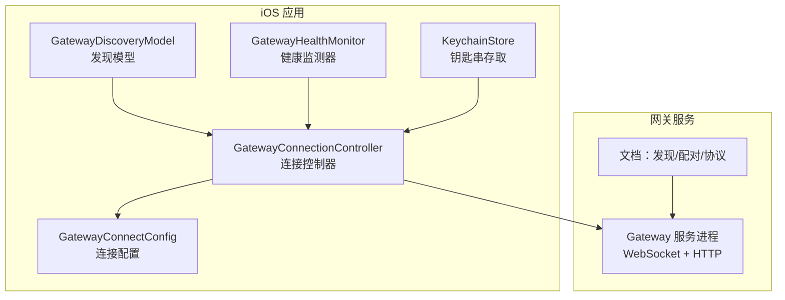
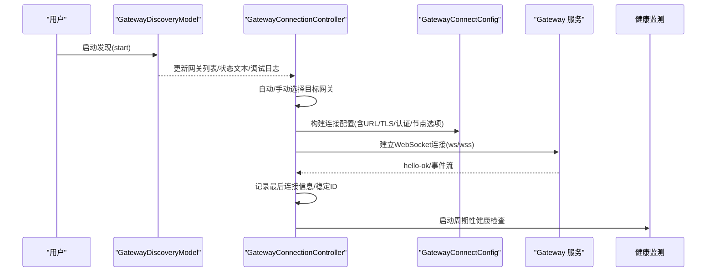
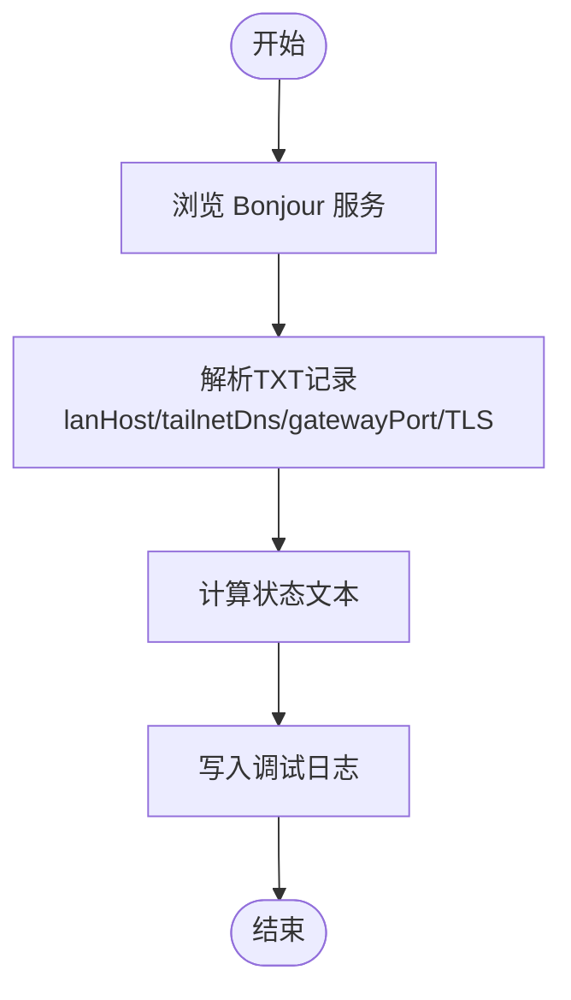
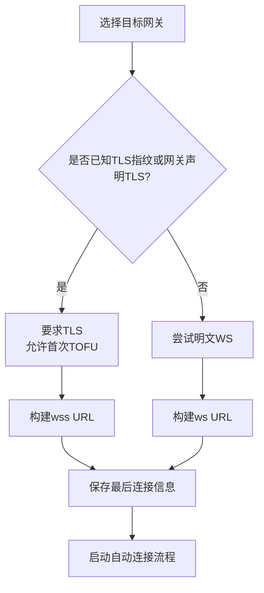
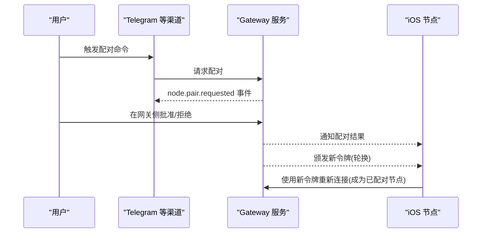
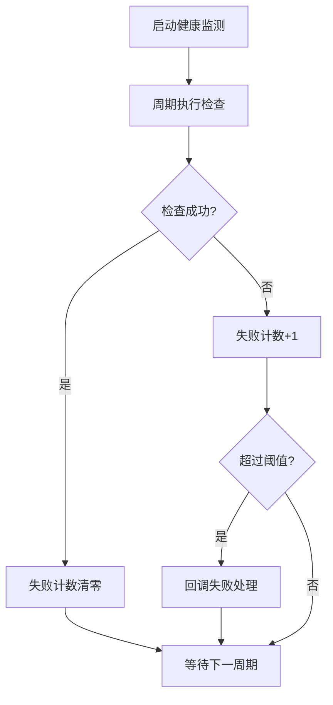
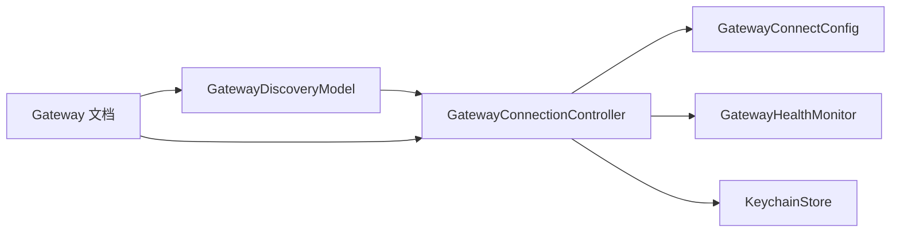

# 网关连接

<cite>
**本文引用的文件**
- [apps/ios/Sources/Gateway/GatewayConnectionController.swift](file://apps/ios/Sources/Gateway/GatewayConnectionController.swift)
- [apps/ios/Sources/Gateway/GatewayConnectConfig.swift](file://apps/ios/Sources/Gateway/GatewayConnectConfig.swift)
- [apps/ios/Sources/Gateway/GatewayDiscoveryModel.swift](file://apps/ios/Sources/Gateway/GatewayDiscoveryModel.swift)
- [apps/ios/Sources/Gateway/GatewayHealthMonitor.swift](file://apps/ios/Sources/Gateway/GatewayHealthMonitor.swift)
- [apps/ios/Sources/Gateway/KeychainStore.swift](file://apps/ios/Sources/Gateway/KeychainStore.swift)
- [docs/gateway/discovery.md](file://docs/gateway/discovery.md)
- [docs/gateway/pairing.md](file://docs/gateway/pairing.md)
- [docs/gateway/configuration.md](file://docs/gateway/configuration.md)
- [docs/gateway/index.md](file://docs/gateway/index.md)
</cite>

## 目录

1. [简介](#简介)
2. [项目结构](#项目结构)
3. [核心组件](#核心组件)
4. [架构总览](#架构总览)
5. [详细组件分析](#详细组件分析)
6. [依赖关系分析](#依赖关系分析)
7. [性能考量](#性能考量)
8. [故障排除指南](#故障排除指南)
9. [结论](#结论)
10. [附录](#附录)

## 简介

本文件面向OpenClaw iOS应用的“网关连接”能力，系统化说明以下内容：

- WebSocket连接机制：ws://与wss://协议选择、TLS参数与指纹校验策略
- 设备配对流程：从Telegram bot命令到iOS应用设置的完整链路
- SessionKey的作用与管理方式（在iOS侧的体现）
- 网关发现、连接建立与保持连接的实现细节
- 连接错误处理、重连机制与网络状态监控
- 连接状态显示与故障排除指南

## 项目结构

iOS侧与网关连接直接相关的模块集中在apps/ios/Sources/Gateway目录，围绕“发现—配置—连接—健康监测—凭据存储”形成闭环；同时通过文档docs/gateway系列明确了网关端的发现、配对与协议行为。

图表来源

- [apps/ios/Sources/Gateway/GatewayConnectionController.swift](file://apps/ios/Sources/Gateway/GatewayConnectionController.swift#L18-L40)
- [apps/ios/Sources/Gateway/GatewayDiscoveryModel.swift](file://apps/ios/Sources/Gateway/GatewayDiscoveryModel.swift#L8-L40)
- [apps/ios/Sources/Gateway/GatewayHealthMonitor.swift](file://apps/ios/Sources/Gateway/GatewayHealthMonitor.swift#L5-L25)
- [apps/ios/Sources/Gateway/KeychainStore.swift](file://apps/ios/Sources/Gateway/KeychainStore.swift#L4-L49)
- [docs/gateway/discovery.md](file://docs/gateway/discovery.md#L10-L31)

章节来源

- [apps/ios/Sources/Gateway/GatewayConnectionController.swift](file://apps/ios/Sources/Gateway/GatewayConnectionController.swift#L1-L667)
- [apps/ios/Sources/Gateway/GatewayDiscoveryModel.swift](file://apps/ios/Sources/Gateway/GatewayDiscoveryModel.swift#L1-L225)
- [apps/ios/Sources/Gateway/GatewayHealthMonitor.swift](file://apps/ios/Sources/Gateway/GatewayHealthMonitor.swift#L1-L86)
- [apps/ios/Sources/Gateway/KeychainStore.swift](file://apps/ios/Sources/Gateway/KeychainStore.swift#L1-L49)
- [docs/gateway/discovery.md](file://docs/gateway/discovery.md#L1-L117)

## 核心组件

- 发现模型：基于Bonjour浏览网关WS端点，解析TXT记录并生成可选的直连或SSH路径
- 连接控制器：负责自动/手动连接、TLS参数推断、构建连接配置、触发会话建立
- 连接配置：统一承载URL、稳定ID、TLS参数、认证信息与节点选项
- 健康监测：周期性检查连接可用性，失败累计后触发处理
- 钥匙串存取：安全持久化网关令牌/密码与TLS指纹

章节来源

- [apps/ios/Sources/Gateway/GatewayDiscoveryModel.swift](file://apps/ios/Sources/Gateway/GatewayDiscoveryModel.swift#L15-L136)
- [apps/ios/Sources/Gateway/GatewayConnectionController.swift](file://apps/ios/Sources/Gateway/GatewayConnectionController.swift#L18-L340)
- [apps/ios/Sources/Gateway/GatewayConnectConfig.swift](file://apps/ios/Sources/Gateway/GatewayConnectConfig.swift#L12-L27)
- [apps/ios/Sources/Gateway/GatewayHealthMonitor.swift](file://apps/ios/Sources/Gateway/GatewayHealthMonitor.swift#L6-L57)
- [apps/ios/Sources/Gateway/KeychainStore.swift](file://apps/ios/Sources/Gateway/KeychainStore.swift#L4-L49)

## 架构总览

下图展示iOS侧从发现到连接、再到健康监测的整体交互：

图表来源

- [apps/ios/Sources/Gateway/GatewayDiscoveryModel.swift](file://apps/ios/Sources/Gateway/GatewayDiscoveryModel.swift#L51-L109)
- [apps/ios/Sources/Gateway/GatewayConnectionController.swift](file://apps/ios/Sources/Gateway/GatewayConnectionController.swift#L59-L148)
- [apps/ios/Sources/Gateway/GatewayConnectConfig.swift](file://apps/ios/Sources/Gateway/GatewayConnectConfig.swift#L12-L27)
- [apps/ios/Sources/Gateway/GatewayHealthMonitor.swift](file://apps/ios/Sources/Gateway/GatewayHealthMonitor.swift#L26-L57)

## 详细组件分析

### 组件A：网关发现与传输选择

- Bonjour浏览：按域遍历服务类型，解析TXT记录，提取lanHost、tailnetDns、gatewayPort、gatewayTls、gatewayTlsSha256等字段
- 状态文本：根据浏览器状态聚合输出“Idle/Setup/Searching/Failed/Waiting”
- 调试日志：可开关，限制保留最近200条
- 传输选择策略（客户端建议）：优先已配对直连，否则Bonjour/LAN直连，再考虑Tailnet，最后回退SSH

图表来源

- [apps/ios/Sources/Gateway/GatewayDiscoveryModel.swift](file://apps/ios/Sources/Gateway/GatewayDiscoveryModel.swift#L51-L136)
- [docs/gateway/discovery.md](file://docs/gateway/discovery.md#L43-L101)

章节来源

- [apps/ios/Sources/Gateway/GatewayDiscoveryModel.swift](file://apps/ios/Sources/Gateway/GatewayDiscoveryModel.swift#L1-L225)
- [docs/gateway/discovery.md](file://docs/gateway/discovery.md#L1-L117)

### 组件B：连接建立与TLS参数推断

- URL构建：根据是否启用TLS选择ws或wss
- TLS参数推断：
  - 直连场景：若网关TXT声明TLS或本地已有指纹，则要求TLS；首次可允许TOFU（信任新指纹），后续持久化指纹
  - 手动/直连：若主机名以“.ts.net”结尾则强制走443端口；否则默认18789
- 连接配置：统一承载URL、稳定ID、TLS参数、认证信息与节点选项
- 自动连接：依据偏好/上次连接/发现结果进行无感重连

图表来源

- [apps/ios/Sources/Gateway/GatewayConnectionController.swift](file://apps/ios/Sources/Gateway/GatewayConnectionController.swift#L342-L372)
- [apps/ios/Sources/Gateway/GatewayConnectionController.swift](file://apps/ios/Sources/Gateway/GatewayConnectionController.swift#L384-L391)
- [apps/ios/Sources/Gateway/GatewayConnectionController.swift](file://apps/ios/Sources/Gateway/GatewayConnectionController.swift#L393-L397)
- [apps/ios/Sources/Gateway/GatewayConnectionController.swift](file://apps/ios/Sources/Gateway/GatewayConnectionController.swift#L432-L442)

章节来源

- [apps/ios/Sources/Gateway/GatewayConnectionController.swift](file://apps/ios/Sources/Gateway/GatewayConnectionController.swift#L59-L148)
- [apps/ios/Sources/Gateway/GatewayConnectConfig.swift](file://apps/ios/Sources/Gateway/GatewayConnectConfig.swift#L12-L27)

### 组件C：设备配对流程（从Telegram到iOS设置）

- 网关端配对：GatewayOwned Pairing由网关作为准入源，支持pending请求、批准/拒绝、令牌轮换
- iOS侧角色：WS节点使用“node”角色发起连接，调用node.pair.\*方法进行配对
- 通道入口：Telegram等渠道可触发配对请求，网关发出node.pair.requested事件，随后在网关侧审批
- 审批后：网关颁发新令牌，节点使用该令牌重新连接成为“paired node”

图表来源

- [docs/gateway/pairing.md](file://docs/gateway/pairing.md#L27-L36)
- [docs/gateway/pairing.md](file://docs/gateway/pairing.md#L56-L71)

章节来源

- [docs/gateway/pairing.md](file://docs/gateway/pairing.md#L1-L100)

### 组件D：SessionKey的作用与管理

- SessionKey在网关配置与RPC更新中用于重启后的“唤醒Ping”，确保配置变更后会话恢复
- iOS侧未直接暴露SessionKey字段；但连接配置结构体包含token/password等认证要素，用于握手阶段的身份验证
- 若需在iOS侧参与配置变更后的会话恢复，应确保使用稳定的stableID与持久化的令牌

章节来源

- [docs/gateway/configuration.md](file://docs/gateway/configuration.md#L380-L417)
- [apps/ios/Sources/Gateway/GatewayConnectConfig.swift](file://apps/ios/Sources/Gateway/GatewayConnectConfig.swift#L12-L27)

### 组件E：连接保持与健康监测

- 周期性健康检查：可配置间隔、超时与最大连续失败次数；超时采用带超时包装
- 失败计数：连续失败达到阈值后回调处理函数，便于触发重连或提示
- 与连接控制器联动：在场景切换或自动重连时启动/停止

图表来源

- [apps/ios/Sources/Gateway/GatewayHealthMonitor.swift](file://apps/ios/Sources/Gateway/GatewayHealthMonitor.swift#L26-L57)
- [apps/ios/Sources/Gateway/GatewayHealthMonitor.swift](file://apps/ios/Sources/Gateway/GatewayHealthMonitor.swift#L64-L84)

章节来源

- [apps/ios/Sources/Gateway/GatewayHealthMonitor.swift](file://apps/ios/Sources/Gateway/GatewayHealthMonitor.swift#L1-L86)

### 组件F：凭据与TLS指纹存储

- 钥匙串存取：封装通用的读取/保存/删除接口，用于安全存储令牌、密码与指纹
- iOS侧TLS指纹：首次连接若允许TOFU且指纹有效，将持久化到钥匙串，后续连接直接校验指纹

章节来源

- [apps/ios/Sources/Gateway/KeychainStore.swift](file://apps/ios/Sources/Gateway/KeychainStore.swift#L4-L49)
- [apps/ios/Sources/Gateway/GatewayConnectionController.swift](file://apps/ios/Sources/Gateway/GatewayConnectionController.swift#L342-L372)

## 依赖关系分析

- 发现模型依赖Network框架的NWBrowser进行Bonjour浏览，并解析TXT记录
- 连接控制器依赖发现模型提供的网关信息，结合用户偏好与环境判断选择直连/SSH/手动
- 连接配置是连接建立的唯一真相源，确保两路WebSocket会话（node/operator）共享同一套参数
- 健康监测独立于连接控制器，通过注入的检查闭包与失败回调实现解耦
- 钥匙串存取为凭据与指纹提供持久化能力

图表来源

- [apps/ios/Sources/Gateway/GatewayDiscoveryModel.swift](file://apps/ios/Sources/Gateway/GatewayDiscoveryModel.swift#L8-L40)
- [apps/ios/Sources/Gateway/GatewayConnectionController.swift](file://apps/ios/Sources/Gateway/GatewayConnectionController.swift#L18-L40)
- [apps/ios/Sources/Gateway/GatewayHealthMonitor.swift](file://apps/ios/Sources/Gateway/GatewayHealthMonitor.swift#L5-L25)
- [apps/ios/Sources/Gateway/KeychainStore.swift](file://apps/ios/Sources/Gateway/KeychainStore.swift#L4-L49)
- [docs/gateway/discovery.md](file://docs/gateway/discovery.md#L10-L31)

章节来源

- [apps/ios/Sources/Gateway/GatewayDiscoveryModel.swift](file://apps/ios/Sources/Gateway/GatewayDiscoveryModel.swift#L1-L225)
- [apps/ios/Sources/Gateway/GatewayConnectionController.swift](file://apps/ios/Sources/Gateway/GatewayConnectionController.swift#L1-L667)
- [apps/ios/Sources/Gateway/GatewayHealthMonitor.swift](file://apps/ios/Sources/Gateway/GatewayHealthMonitor.swift#L1-L86)
- [apps/ios/Sources/Gateway/KeychainStore.swift](file://apps/ios/Sources/Gateway/KeychainStore.swift#L1-L49)
- [docs/gateway/discovery.md](file://docs/gateway/discovery.md#L1-L117)

## 性能考量

- 发现阶段：Bonjour浏览按域并发启动，结果合并排序，避免重复扫描
- 连接阶段：URL构建与TLS参数推断逻辑简单，开销极低
- 健康监测：可配置间隔与超时，避免频繁探测造成资源浪费
- 自动重连：仅在必要时触发，避免重复连接循环

## 故障排除指南

- 无法发现网关
  - 检查Bonjour域与服务类型是否正确，确认状态文本包含“Failed/Waiting”
  - 参考文档中的Bonjour与广域可达性说明
- 连接失败（TLS相关）
  - 若首次连接允许TOFU，请确认是否接受新指纹；后续应校验指纹
  - 对于“.ts.net”域名，强制使用443端口；否则默认18789
- 认证失败
  - 确认使用的令牌/密码与网关配置一致；网关端支持token/password两种认证
- 连接不稳定
  - 启用健康监测，观察失败次数与阈值；必要时缩短检查间隔或提高阈值
- 重连策略
  - 在场景切换或应用回到前台时触发自动重连；若已存在活动连接配置则避免重复启动

章节来源

- [apps/ios/Sources/Gateway/GatewayDiscoveryModel.swift](file://apps/ios/Sources/Gateway/GatewayDiscoveryModel.swift#L138-L176)
- [apps/ios/Sources/Gateway/GatewayConnectionController.swift](file://apps/ios/Sources/Gateway/GatewayConnectionController.swift#L393-L397)
- [apps/ios/Sources/Gateway/GatewayConnectionController.swift](file://apps/ios/Sources/Gateway/GatewayConnectionController.swift#L291-L299)
- [docs/gateway/index.md](file://docs/gateway/index.md#L101-L117)
- [docs/gateway/configuration.md](file://docs/gateway/configuration.md#L74-L73)

## 结论

iOS应用通过“发现—配置—连接—健康监测—凭据存储”的闭环设计，实现了对OpenClaw网关的可靠接入。ws/wss协议选择、TLS指纹校验与自动重连机制共同保障了连接的安全与稳定；配合网关端的GatewayOwned Pairing，用户可在Telegram等渠道完成配对审批，最终在iOS侧以已配对节点身份建立长连接，获得持续可控的控制平面与能力调用通道。

## 附录

- 协议快速参考（来自网关文档）：首帧必须为connect，网关返回hello-ok快照，请求格式为req(method, params)，常见事件包括agent、chat、presence、tick、health、heartbeat、shutdown等
- 运行时模型：单进程路由/控制面/通道连接，多路复用端口承载WebSocket控制/RPC与HTTP API

章节来源

- [docs/gateway/index.md](file://docs/gateway/index.md#L195-L208)
