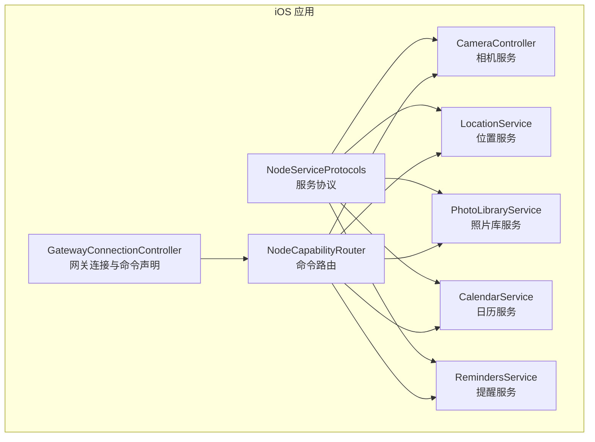
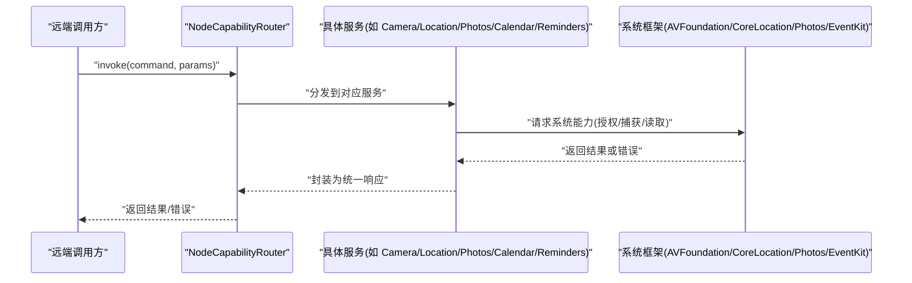
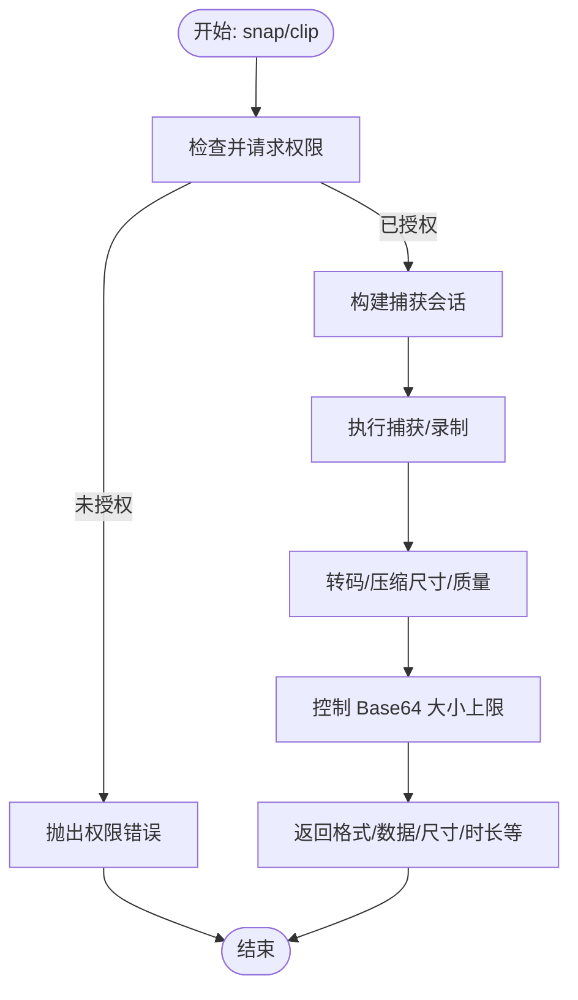
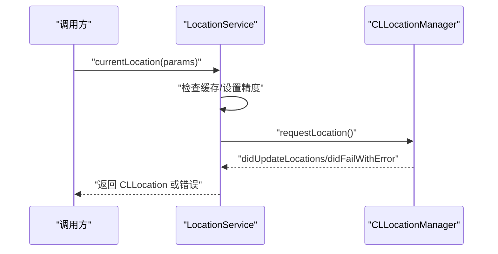
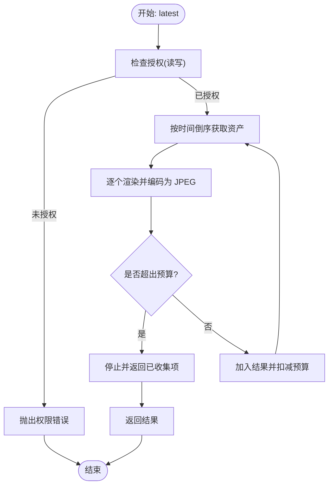
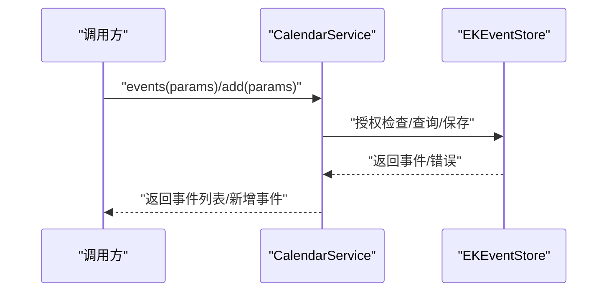
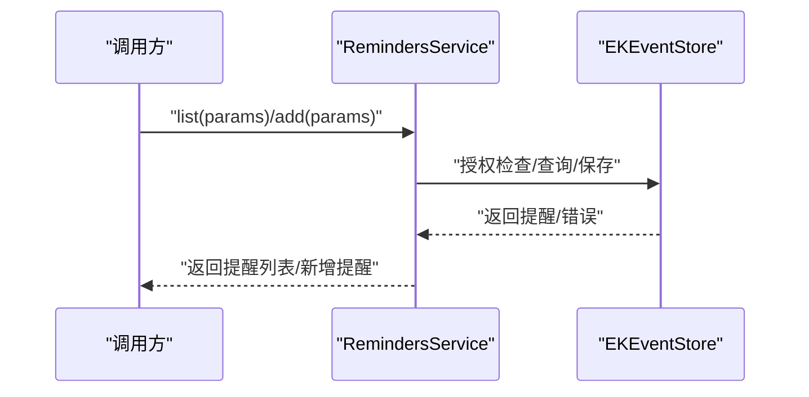
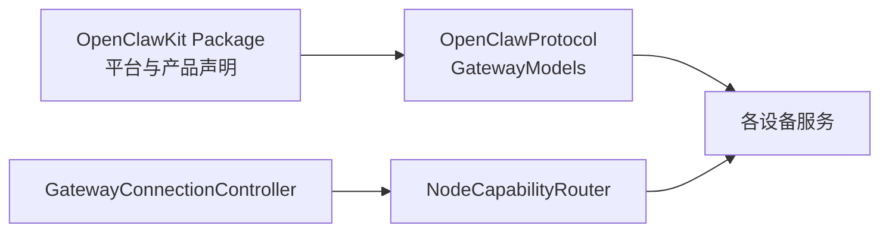

# 设备服务

<cite>
**本文引用的文件**
- [apps/ios/Sources/Camera/CameraController.swift](file://apps/ios/Sources/Camera/CameraController.swift)
- [apps/ios/Sources/Location/LocationService.swift](file://apps/ios/Sources/Location/LocationService.swift)
- [apps/ios/Sources/Media/PhotoLibraryService.swift](file://apps/ios/Sources/Media/PhotoLibraryService.swift)
- [apps/ios/Sources/Calendar/CalendarService.swift](file://apps/ios/Sources/Calendar/CalendarService.swift)
- [apps/ios/Sources/Reminders/RemindersService.swift](file://apps/ios/Sources/Reminders/RemindersService.swift)
- [apps/ios/Sources/Services/NodeServiceProtocols.swift](file://apps/ios/Sources/Services/NodeServiceProtocols.swift)
- [apps/ios/Sources/Capabilities/NodeCapabilityRouter.swift](file://apps/ios/Sources/Capabilities/NodeCapabilityRouter.swift)
- [apps/ios/Sources/Gateway/GatewayConnectionController.swift](file://apps/ios/Sources/Gateway/GatewayConnectionController.swift)
- [apps/shared/OpenClawKit/Package.swift](file://apps/shared/OpenClawKit/Package.swift)
- [apps/shared/OpenClawKit/Sources/OpenClawProtocol/GatewayModels.swift](file://apps/shared/OpenClawKit/Sources/OpenClawProtocol/GatewayModels.swift)
</cite>

## 目录

1. [简介](#简介)
2. [项目结构](#项目结构)
3. [核心组件](#核心组件)
4. [架构总览](#架构总览)
5. [详细组件分析](#详细组件分析)
6. [依赖关系分析](#依赖关系分析)
7. [性能与电池优化](#性能与电池优化)
8. [权限与隐私](#权限与隐私)
9. [故障排查](#故障排查)
10. [结论](#结论)
11. [附录：API 接口与参数规范](#附录api-接口与参数规范)

## 简介

本文件面向 OpenClaw iOS 应用的“设备服务”能力，系统化说明如何将 iPhone 的本地能力（相机、位置、照片库、日历、提醒事项等）通过节点命令暴露给远端网关或控制端。内容涵盖：

- 每个设备服务的实现方式与边界
- 权限要求与授权流程
- API 接口、参数格式与返回值
- 性能与电池影响及优化建议
- 常见问题与调试方法

## 项目结构

iOS 设备服务主要位于 apps/ios/Sources 下，按功能域拆分：

- Camera：相机拍照与录制
- Location：位置获取与授权
- Media：照片库最新图片读取
- Calendar：日历事件查询与新增
- Reminders：提醒清单查询与新增
- Services：设备服务协议与扩展
- Capabilities：节点命令路由
- Gateway：与网关连接时声明支持的命令

图表来源

- [apps/ios/Sources/Camera/CameraController.swift](file://apps/ios/Sources/Camera/CameraController.swift#L1-L407)
- [apps/ios/Sources/Location/LocationService.swift](file://apps/ios/Sources/Location/LocationService.swift#L1-L139)
- [apps/ios/Sources/Media/PhotoLibraryService.swift](file://apps/ios/Sources/Media/PhotoLibraryService.swift#L1-L165)
- [apps/ios/Sources/Calendar/CalendarService.swift](file://apps/ios/Sources/Calendar/CalendarService.swift#L1-L168)
- [apps/ios/Sources/Reminders/RemindersService.swift](file://apps/ios/Sources/Reminders/RemindersService.swift#L1-L166)
- [apps/ios/Sources/Services/NodeServiceProtocols.swift](file://apps/ios/Sources/Services/NodeServiceProtocols.swift#L1-L65)
- [apps/ios/Sources/Capabilities/NodeCapabilityRouter.swift](file://apps/ios/Sources/Capabilities/NodeCapabilityRouter.swift#L1-L26)
- [apps/ios/Sources/Gateway/GatewayConnectionController.swift](file://apps/ios/Sources/Gateway/GatewayConnectionController.swift#L471-L535)

章节来源

- [apps/ios/Sources/Camera/CameraController.swift](file://apps/ios/Sources/Camera/CameraController.swift#L1-L407)
- [apps/ios/Sources/Location/LocationService.swift](file://apps/ios/Sources/Location/LocationService.swift#L1-L139)
- [apps/ios/Sources/Media/PhotoLibraryService.swift](file://apps/ios/Sources/Media/PhotoLibraryService.swift#L1-L165)
- [apps/ios/Sources/Calendar/CalendarService.swift](file://apps/ios/Sources/Calendar/CalendarService.swift#L1-L168)
- [apps/ios/Sources/Reminders/RemindersService.swift](file://apps/ios/Sources/Reminders/RemindersService.swift#L1-L166)
- [apps/ios/Sources/Services/NodeServiceProtocols.swift](file://apps/ios/Sources/Services/NodeServiceProtocols.swift#L1-L65)
- [apps/ios/Sources/Capabilities/NodeCapabilityRouter.swift](file://apps/ios/Sources/Capabilities/NodeCapabilityRouter.swift#L1-L26)
- [apps/ios/Sources/Gateway/GatewayConnectionController.swift](file://apps/ios/Sources/Gateway/GatewayConnectionController.swift#L471-L535)

## 核心组件

- 协议层：统一的服务协议定义，约束各设备服务的对外接口，确保并发安全与可测试性。
- 具体服务：围绕系统框架（AVFoundation、CoreLocation、Photos、EventKit）封装，提供节点命令所需的输入输出。
- 路由器：将节点命令字符串映射到具体服务实现，负责错误与超时处理。
- 网关集成：在建立网关连接时声明支持的命令集合，供远端调用。

章节来源

- [apps/ios/Sources/Services/NodeServiceProtocols.swift](file://apps/ios/Sources/Services/NodeServiceProtocols.swift#L1-L65)
- [apps/ios/Sources/Capabilities/NodeCapabilityRouter.swift](file://apps/ios/Sources/Capabilities/NodeCapabilityRouter.swift#L1-L26)
- [apps/ios/Sources/Gateway/GatewayConnectionController.swift](file://apps/ios/Sources/Gateway/GatewayConnectionController.swift#L471-L535)

## 架构总览

下图展示从节点命令到具体服务实现的调用链路，以及与系统框架的交互。

图表来源

- [apps/ios/Sources/Capabilities/NodeCapabilityRouter.swift](file://apps/ios/Sources/Capabilities/NodeCapabilityRouter.swift#L19-L24)
- [apps/ios/Sources/Camera/CameraController.swift](file://apps/ios/Sources/Camera/CameraController.swift#L39-L110)
- [apps/ios/Sources/Location/LocationService.swift](file://apps/ios/Sources/Location/LocationService.swift#L55-L74)
- [apps/ios/Sources/Media/PhotoLibraryService.swift](file://apps/ios/Sources/Media/PhotoLibraryService.swift#L16-L55)
- [apps/ios/Sources/Calendar/CalendarService.swift](file://apps/ios/Sources/Calendar/CalendarService.swift#L6-L37)
- [apps/ios/Sources/Reminders/RemindersService.swift](file://apps/ios/Sources/Reminders/RemindersService.swift#L6-L48)

## 详细组件分析

### 相机服务（Camera）

- 功能
  - 列举设备摄像头信息
  - 拍照（可指定前置/后置、目标宽度、质量、延时）
  - 录制短视频（可选音频，限定时长）
- 关键实现要点
  - 使用 AVFoundation 进行会话配置与捕获；对首帧空白问题进行短暂预热。
  - 对输出进行转码与尺寸压缩，控制 Base64 字节上限，避免网关传输过大。
  - 音视频权限动态检查与请求，拒绝时抛出明确错误。
- 参数与返回
  - 拍照：输入包含朝向、格式、最大宽度、质量、延时；返回格式、Base64、宽高。
  - 录制：输入包含朝向、时长、是否含音频、格式；返回格式、Base64、时长、是否含音频。
  - 列表：返回设备 ID、名称、朝向、设备类型。
- 错误与边界
  - 设备不可用、权限被拒、捕获失败、导出失败等均有明确错误类型。

图表来源

- [apps/ios/Sources/Camera/CameraController.swift](file://apps/ios/Sources/Camera/CameraController.swift#L39-L110)
- [apps/ios/Sources/Camera/CameraController.swift](file://apps/ios/Sources/Camera/CameraController.swift#L112-L190)
- [apps/ios/Sources/Camera/CameraController.swift](file://apps/ios/Sources/Camera/CameraController.swift#L202-L221)

章节来源

- [apps/ios/Sources/Camera/CameraController.swift](file://apps/ios/Sources/Camera/CameraController.swift#L1-L407)

### 位置服务（Location）

- 功能
  - 查询当前授权状态与精度授权
  - 获取当前位置（支持精度策略、缓存时效、超时）
  - 在需要时触发授权（按需申请“始终使用”）
- 关键实现要点
  - 使用 CLLocationManager；根据 desiredAccuracy 设置定位精度。
  - 支持缓存命中与超时控制，避免重复定位与阻塞。
  - 授权变更通过委托回调通知，异步等待授权结果。
- 参数与返回
  - 输入：desiredAccuracy、maxAgeMs、timeoutMs；输出：CLLocation。
- 错误与边界
  - 超时、不可用、服务关闭等场景返回特定错误。

图表来源

- [apps/ios/Sources/Location/LocationService.swift](file://apps/ios/Sources/Location/LocationService.swift#L55-L74)
- [apps/ios/Sources/Location/LocationService.swift](file://apps/ios/Sources/Location/LocationService.swift#L107-L137)

章节来源

- [apps/ios/Sources/Location/LocationService.swift](file://apps/ios/Sources/Location/LocationService.swift#L1-L139)

### 照片库服务（Photos）

- 功能
  - 返回最近若干张照片（按创建时间倒序），自动压缩到传输预算内。
- 关键实现要点
  - 严格控制单张与总量的 Base64 长度预算，必要时降低质量或缩放尺寸。
  - 仅在读取时进行同步请求，避免阻塞。
- 参数与返回
  - 输入：limit、maxWidth、quality；输出：若干张照片的格式、Base64、尺寸、创建时间。
- 错误与边界
  - 权限不足、加载失败、超过传输预算等有明确错误。

图表来源

- [apps/ios/Sources/Media/PhotoLibraryService.swift](file://apps/ios/Sources/Media/PhotoLibraryService.swift#L16-L55)
- [apps/ios/Sources/Media/PhotoLibraryService.swift](file://apps/ios/Sources/Media/PhotoLibraryService.swift#L111-L148)

章节来源

- [apps/ios/Sources/Media/PhotoLibraryService.swift](file://apps/ios/Sources/Media/PhotoLibraryService.swift#L1-L165)

### 日历服务（Calendar）

- 功能
  - 查询指定时间范围内的事件列表
  - 新增事件（标题必填，起止时间必填，可选地点/备注/日历）
- 关键实现要点
  - 读取与写入分别检查授权状态；不阻塞节点调用时弹窗。
  - 解析 ISO-8601 时间字符串，解析日历或默认日历。
- 参数与返回
  - 查询：startISO、endISO、limit；返回事件数组。
  - 新增：title、startISO、endISO、isAllDay、location、notes、calendarId/Title；返回新增事件。
- 错误与边界
  - 权限不足、参数无效、日历不存在等有明确错误。

图表来源

- [apps/ios/Sources/Calendar/CalendarService.swift](file://apps/ios/Sources/Calendar/CalendarService.swift#L6-L37)
- [apps/ios/Sources/Calendar/CalendarService.swift](file://apps/ios/Sources/Calendar/CalendarService.swift#L39-L96)

章节来源

- [apps/ios/Sources/Calendar/CalendarService.swift](file://apps/ios/Sources/Calendar/CalendarService.swift#L1-L168)

### 提醒事项服务（Reminders）

- 功能
  - 列出提醒清单（支持筛选完成/未完成/全部）
  - 新增提醒（标题必填，可选备注/到期时间/清单）
- 关键实现要点
  - 读取与写入分别检查授权状态；不阻塞节点调用时弹窗。
  - 解析 ISO-8601 到期时间，解析清单或默认清单。
- 参数与返回
  - 列表：status、limit；返回提醒数组。
  - 新增：title、notes、dueISO、listId/listName；返回新增提醒。
- 错误与边界
  - 权限不足、参数无效、清单不存在等有明确错误。

图表来源

- [apps/ios/Sources/Reminders/RemindersService.swift](file://apps/ios/Sources/Reminders/RemindersService.swift#L6-L48)
- [apps/ios/Sources/Reminders/RemindersService.swift](file://apps/ios/Sources/Reminders/RemindersService.swift#L50-L101)

章节来源

- [apps/ios/Sources/Reminders/RemindersService.swift](file://apps/ios/Sources/Reminders/RemindersService.swift#L1-L166)

## 依赖关系分析

- 平台与工具链
  - OpenClawKit 作为共享库，提供协议与模型；iOS 最低版本在 Package 中声明。
  - 协议模型由脚本生成，统一了请求/响应/事件帧等结构。
- 组件耦合
  - 各服务通过协议与路由器解耦，便于替换与测试。
  - 网关连接控制器在握手阶段声明支持的命令，驱动远端调用。

图表来源

- [apps/shared/OpenClawKit/Package.swift](file://apps/shared/OpenClawKit/Package.swift#L1-L62)
- [apps/shared/OpenClawKit/Sources/OpenClawProtocol/GatewayModels.swift](file://apps/shared/OpenClawKit/Sources/OpenClawProtocol/GatewayModels.swift#L117-L198)
- [apps/ios/Sources/Capabilities/NodeCapabilityRouter.swift](file://apps/ios/Sources/Capabilities/NodeCapabilityRouter.swift#L1-L26)
- [apps/ios/Sources/Gateway/GatewayConnectionController.swift](file://apps/ios/Sources/Gateway/GatewayConnectionController.swift#L471-L535)

章节来源

- [apps/shared/OpenClawKit/Package.swift](file://apps/shared/OpenClawKit/Package.swift#L1-L62)
- [apps/shared/OpenClawKit/Sources/OpenClawProtocol/GatewayModels.swift](file://apps/shared/OpenClawKit/Sources/OpenClawProtocol/GatewayModels.swift#L1-L800)
- [apps/ios/Sources/Capabilities/NodeCapabilityRouter.swift](file://apps/ios/Sources/Capabilities/NodeCapabilityRouter.swift#L1-L26)
- [apps/ios/Sources/Gateway/GatewayConnectionController.swift](file://apps/ios/Sources/Gateway/GatewayConnectionController.swift#L471-L535)

## 性能与电池优化

- 相机
  - 默认限制最大宽度与质量，避免超大 Base64；对导出进行网络优化与平台兼容处理。
  - 预热捕获会话减少首帧空白；合理设置延时与最短/最长时长。
- 位置
  - 根据 desiredAccuracy 选择精度；利用缓存 maxAgeMs 避免频繁定位。
  - 超时控制防止长时间前台占用。
- 照片库
  - 严格预算控制（总量/单张），优先降质再缩放，保证传输稳定。
- 日历/提醒
  - 限制查询/返回数量；避免在节点调用期间触发授权弹窗。

章节来源

- [apps/ios/Sources/Camera/CameraController.swift](file://apps/ios/Sources/Camera/CameraController.swift#L48-L51)
- [apps/ios/Sources/Camera/CameraController.swift](file://apps/ios/Sources/Camera/CameraController.swift#L266-L275)
- [apps/ios/Sources/Location/LocationService.swift](file://apps/ios/Sources/Location/LocationService.swift#L69-L73)
- [apps/ios/Sources/Media/PhotoLibraryService.swift](file://apps/ios/Sources/Media/PhotoLibraryService.swift#L13-L14)
- [apps/ios/Sources/Media/PhotoLibraryService.swift](file://apps/ios/Sources/Media/PhotoLibraryService.swift#L111-L148)

## 权限与隐私

- 相机/麦克风
  - 必须在使用前请求授权；若被拒则抛出明确错误，不强制弹窗。
- 位置
  - 支持“使用期间/始终使用”两种模式；首次未决定时触发授权，后续按需升级。
- 照片库
  - 读取权限与受限权限区分；受限模式下仍可返回有限图片集。
- 日历/提醒
  - 读取与写入授权状态不同；不在节点调用期间弹窗，避免超时。
- 隐私保护
  - 所有敏感数据均在设备侧处理，尽量避免上传原始媒体；传输采用 Base64，受网关帧大小限制。

章节来源

- [apps/ios/Sources/Camera/CameraController.swift](file://apps/ios/Sources/Camera/CameraController.swift#L202-L221)
- [apps/ios/Sources/Location/LocationService.swift](file://apps/ios/Sources/Location/LocationService.swift#L33-L53)
- [apps/ios/Sources/Media/PhotoLibraryService.swift](file://apps/ios/Sources/Media/PhotoLibraryService.swift#L17-L22)
- [apps/ios/Sources/Calendar/CalendarService.swift](file://apps/ios/Sources/Calendar/CalendarService.swift#L8-L14)
- [apps/ios/Sources/Reminders/RemindersService.swift](file://apps/ios/Sources/Reminders/RemindersService.swift#L8-L14)

## 故障排查

- 相机
  - 现象：无法拍照/录制、权限被拒、导出失败
  - 排查：确认相机/麦克风授权；检查设备是否存在目标摄像头；观察 Base64 是否超限
- 位置
  - 现象：获取位置超时、无结果
  - 排查：检查定位服务开关、授权状态；调整 desiredAccuracy 与超时；确认缓存时效
- 照片库
  - 现象：返回空或数量少
  - 排查：确认读写权限；调整 limit/maxWidth/quality；检查预算是否过早耗尽
- 日历/提醒
  - 现象：权限不足、日历/清单不存在
  - 排查：确认授权状态；核对 calendarId/listId 或名称；检查默认日历是否存在

章节来源

- [apps/ios/Sources/Camera/CameraController.swift](file://apps/ios/Sources/Camera/CameraController.swift#L13-L37)
- [apps/ios/Sources/Location/LocationService.swift](file://apps/ios/Sources/Location/LocationService.swift#L7-L10)
- [apps/ios/Sources/Media/PhotoLibraryService.swift](file://apps/ios/Sources/Media/PhotoLibraryService.swift#L19-L22)
- [apps/ios/Sources/Calendar/CalendarService.swift](file://apps/ios/Sources/Calendar/CalendarService.swift#L11-L14)
- [apps/ios/Sources/Reminders/RemindersService.swift](file://apps/ios/Sources/Reminders/RemindersService.swift#L11-L14)

## 结论

OpenClaw iOS 的设备服务通过清晰的协议抽象与严格的权限/预算控制，将相机、位置、照片库、日历与提醒等本地能力以节点命令形式安全、可控地暴露给远端。配合合理的超时与缓存策略，可在保证用户体验的同时降低电池消耗与网络压力。

## 附录：API 接口与参数规范

以下为各服务对外暴露的命令与参数/返回概要（以节点命令名与参数结构命名空间为准）。具体字段定义与枚举值请参考协议模型文件。

- 相机
  - 命令：list/snap/clip
  - 输入参数：OpenClawCameraSnapParams、OpenClawCameraClipParams、OpenClawCameraListParams
  - 输出：OpenClawCameraSnapPayload、OpenClawCameraClipPayload、设备列表
- 位置
  - 命令：get
  - 输入参数：OpenClawLocationGetParams、OpenClawLocationMode、OpenClawLocationAccuracy
  - 输出：CLLocation 封装后的节点响应
- 照片库
  - 命令：latest
  - 输入参数：OpenClawPhotosLatestParams
  - 输出：OpenClawPhotosLatestPayload（含多张照片）
- 日历
  - 命令：events/add
  - 输入参数：OpenClawCalendarEventsParams、OpenClawCalendarAddParams
  - 输出：OpenClawCalendarEventsPayload、OpenClawCalendarAddPayload
- 提醒
  - 命令：list/add
  - 输入参数：OpenClawRemindersListParams、OpenClawRemindersAddParams
  - 输出：OpenClawRemindersListPayload、OpenClawRemindersAddPayload

章节来源

- [apps/ios/Sources/Gateway/GatewayConnectionController.swift](file://apps/ios/Sources/Gateway/GatewayConnectionController.swift#L507-L531)
- [apps/shared/OpenClawKit/Sources/OpenClawProtocol/GatewayModels.swift](file://apps/shared/OpenClawKit/Sources/OpenClawProtocol/GatewayModels.swift#L788-L800)
