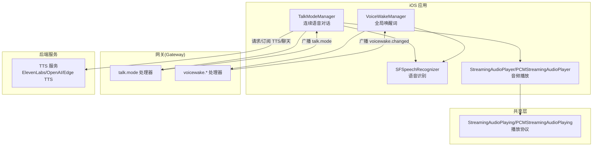
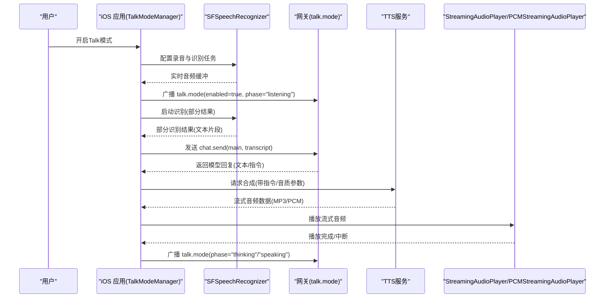
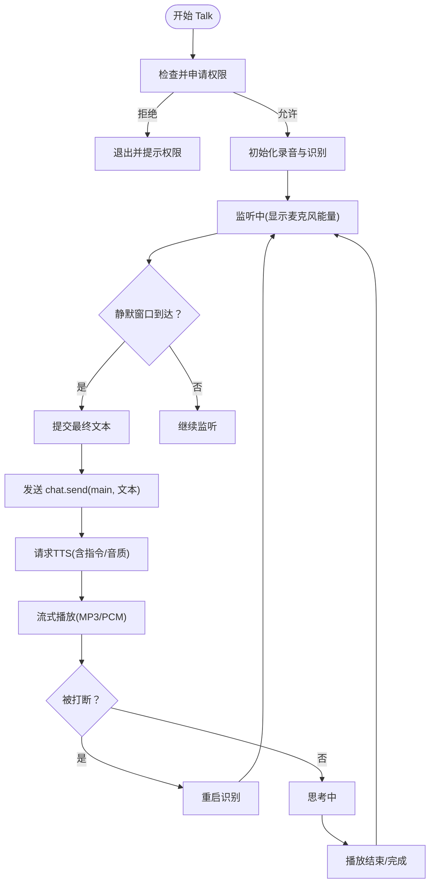
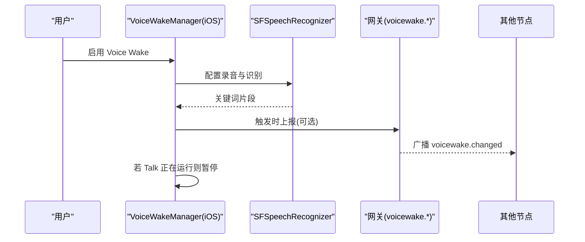
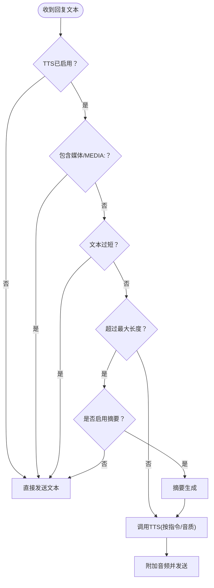
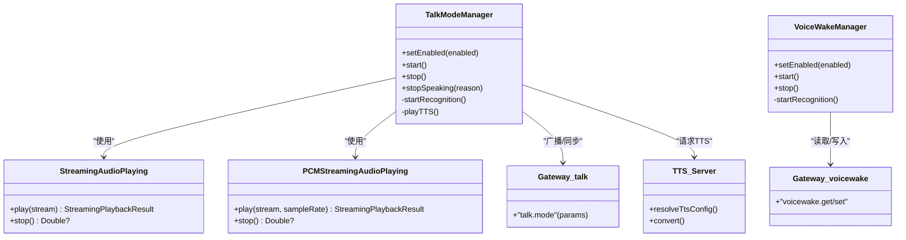

# 语音界面

<cite>
**本文引用的文件**
- [apps/ios/Sources/Voice/TalkModeManager.swift](file://apps/ios/Sources/Voice/TalkModeManager.swift)
- [apps/ios/Sources/Voice/VoiceWakeManager.swift](file://apps/ios/Sources/Voice/VoiceWakeManager.swift)
- [apps/shared/OpenClawKit/Sources/OpenClawKit/AudioStreamingProtocols.swift](file://apps/shared/OpenClawKit/Sources/OpenClawKit/AudioStreamingProtocols.swift)
- [src/gateway/server-methods/talk.ts](file://src/gateway/server-methods/talk.ts)
- [src/gateway/server-methods/voicewake.ts](file://src/gateway/server-methods/voicewake.ts)
- [src/tts/tts.ts](file://src/tts/tts.ts)
- [docs/nodes/talk.md](file://docs/nodes/talk.md)
- [docs/nodes/voicewake.md](file://docs/nodes/voicewake.md)
- [docs/tts.md](file://docs/tts.md)
</cite>

## 目录

1. [简介](#简介)
2. [项目结构](#项目结构)
3. [核心组件](#核心组件)
4. [架构总览](#架构总览)
5. [详细组件分析](#详细组件分析)
6. [依赖关系分析](#依赖关系分析)
7. [性能考量](#性能考量)
8. [故障排除指南](#故障排除指南)
9. [结论](#结论)
10. [附录](#附录)

## 简介

本文件面向OpenClaw iOS应用的语音界面功能，系统性阐述Talk连续语音对话与Voice Wake全局唤醒词的实现方式，覆盖语音识别（ASR）、语音合成（TTS）与音频流式播放的端到端流程；并说明权限管理、音频设备与音质配置、延迟与能耗优化策略，以及常见问题排查与体验优化建议。

## 项目结构

OpenClaw在iOS侧通过独立的语音模块管理Talk与Voice Wake两大能力，并通过网关（Gateway）进行状态广播与跨节点同步。TTS能力由后端统一处理，支持多提供商（ElevenLabs、OpenAI、Edge TTS），并可按会话或用户偏好动态调整。

图表来源

- [apps/ios/Sources/Voice/TalkModeManager.swift](file://apps/ios/Sources/Voice/TalkModeManager.swift#L1-L200)
- [apps/ios/Sources/Voice/VoiceWakeManager.swift](file://apps/ios/Sources/Voice/VoiceWakeManager.swift#L1-L200)
- [apps/shared/OpenClawKit/Sources/OpenClawKit/AudioStreamingProtocols.swift](file://apps/shared/OpenClawKit/Sources/OpenClawKit/AudioStreamingProtocols.swift#L1-L16)
- [src/gateway/server-methods/talk.ts](file://src/gateway/server-methods/talk.ts#L1-L39)
- [src/gateway/server-methods/voicewake.ts](file://src/gateway/server-methods/voicewake.ts#L1-L35)
- [src/tts/tts.ts](file://src/tts/tts.ts#L1-L200)

章节来源

- [apps/ios/Sources/Voice/TalkModeManager.swift](file://apps/ios/Sources/Voice/TalkModeManager.swift#L1-L200)
- [apps/ios/Sources/Voice/VoiceWakeManager.swift](file://apps/ios/Sources/Voice/VoiceWakeManager.swift#L1-L200)
- [apps/shared/OpenClawKit/Sources/OpenClawKit/AudioStreamingProtocols.swift](file://apps/shared/OpenClawKit/Sources/OpenClawKit/AudioStreamingProtocols.swift#L1-L16)
- [src/gateway/server-methods/talk.ts](file://src/gateway/server-methods/talk.ts#L1-L39)
- [src/gateway/server-methods/voicewake.ts](file://src/gateway/server-methods/voicewake.ts#L1-L35)
- [src/tts/tts.ts](file://src/tts/tts.ts#L1-L200)

## 核心组件

- TalkModeManager：负责iOS端Talk连续语音对话的生命周期管理，包括权限申请、录音与识别、静默窗口检测、与网关的状态同步、TTS播放与中断控制。
- VoiceWakeManager：负责全局唤醒词检测，支持在Talk运行时暂停以避免冲突，并将触发事件通过网关广播。
- 播放协议：定义统一的流式音频播放接口，便于切换不同输出格式（MP3/PCM）与播放器实现。
- 网关处理器：talk.mode与voicewake.\*用于接收参数校验、广播状态变更，确保各节点一致。
- TTS服务：后端统一处理文本转语音，支持多提供商与输出格式，按需生成音频并返回路径或字节流。

章节来源

- [apps/ios/Sources/Voice/TalkModeManager.swift](file://apps/ios/Sources/Voice/TalkModeManager.swift#L1-L200)
- [apps/ios/Sources/Voice/VoiceWakeManager.swift](file://apps/ios/Sources/Voice/VoiceWakeManager.swift#L1-L200)
- [apps/shared/OpenClawKit/Sources/OpenClawKit/AudioStreamingProtocols.swift](file://apps/shared/OpenClawKit/Sources/OpenClawKit/AudioStreamingProtocols.swift#L1-L16)
- [src/gateway/server-methods/talk.ts](file://src/gateway/server-methods/talk.ts#L1-L39)
- [src/gateway/server-methods/voicewake.ts](file://src/gateway/server-methods/voicewake.ts#L1-L35)
- [src/tts/tts.ts](file://src/tts/tts.ts#L1-L200)

## 架构总览

下图展示从“语音输入—识别—模型推理—TTS合成—流式播放”的完整链路，以及网关在Talk与Voice Wake中的协调作用。

图表来源

- [apps/ios/Sources/Voice/TalkModeManager.swift](file://apps/ios/Sources/Voice/TalkModeManager.swift#L137-L181)
- [src/gateway/server-methods/talk.ts](file://src/gateway/server-methods/talk.ts#L10-L37)
- [src/tts/tts.ts](file://src/tts/tts.ts#L477-L516)

章节来源

- [apps/ios/Sources/Voice/TalkModeManager.swift](file://apps/ios/Sources/Voice/TalkModeManager.swift#L137-L181)
- [src/gateway/server-methods/talk.ts](file://src/gateway/server-methods/talk.ts#L10-L37)
- [src/tts/tts.ts](file://src/tts/tts.ts#L477-L516)

## 详细组件分析

### Talk 连续语音对话（iOS）

- 生命周期与状态机
  - 支持启用/禁用、暂停/恢复、手动停止等操作；状态通过网关广播，保持跨节点一致。
  - 静默窗口检测：基于麦克风能量阈值与时间窗，判定用户停顿并提交最终文本。
- 权限与录音
  - 启动前申请麦克风与语音识别权限；在模拟器上限制录音以规避音频栈不稳定问题。
  - 使用AVAudioEngine与SFSpeechAudioBufferRecognitionRequest进行实时音频采集与识别。
- 中断与并发
  - 支持“说话时打断”（interruptOnSpeech），在播放期间重新启动识别，避免长时间无响应。
  - 与Voice Wake共存时，Talk运行期间暂停Voice Wake以避免误触发。
- TTS与播放
  - 优先使用ElevenLabs流式播放（MP3/PCM），失败或不可用时回退至系统TTS。
  - 播放器通过统一协议抽象，便于切换不同输出格式与播放器实现。

图表来源

- [apps/ios/Sources/Voice/TalkModeManager.swift](file://apps/ios/Sources/Voice/TalkModeManager.swift#L137-L181)
- [apps/ios/Sources/Voice/TalkModeManager.swift](file://apps/ios/Sources/Voice/TalkModeManager.swift#L1015-L1074)
- [apps/shared/OpenClawKit/Sources/OpenClawKit/AudioStreamingProtocols.swift](file://apps/shared/OpenClawKit/Sources/OpenClawKit/AudioStreamingProtocols.swift#L1-L16)

章节来源

- [apps/ios/Sources/Voice/TalkModeManager.swift](file://apps/ios/Sources/Voice/TalkModeManager.swift#L1-L200)
- [apps/ios/Sources/Voice/TalkModeManager.swift](file://apps/ios/Sources/Voice/TalkModeManager.swift#L137-L181)
- [apps/ios/Sources/Voice/TalkModeManager.swift](file://apps/ios/Sources/Voice/TalkModeManager.swift#L1015-L1074)
- [apps/shared/OpenClawKit/Sources/OpenClawKit/AudioStreamingProtocols.swift](file://apps/shared/OpenClawKit/Sources/OpenClawKit/AudioStreamingProtocols.swift#L1-L16)

### Voice Wake 全局唤醒词

- 全局列表与同步
  - 唤醒词列表由网关持有并广播，所有节点均能读取与编辑，编辑后通过事件通知其他客户端。
- 本地行为
  - 在Talk运行时自动暂停，避免同时录音导致误触发；权限不足或模拟器不支持时给出明确提示。
  - 使用AVAudioEngine与SFSpeechAudioBufferRecognitionRequest进行持续录音与关键词匹配。

图表来源

- [apps/ios/Sources/Voice/VoiceWakeManager.swift](file://apps/ios/Sources/Voice/VoiceWakeManager.swift#L160-L215)
- [src/gateway/server-methods/voicewake.ts](file://src/gateway/server-methods/voicewake.ts#L7-L33)

章节来源

- [apps/ios/Sources/Voice/VoiceWakeManager.swift](file://apps/ios/Sources/Voice/VoiceWakeManager.swift#L1-L200)
- [src/gateway/server-methods/voicewake.ts](file://src/gateway/server-methods/voicewake.ts#L1-L35)

### TTS 文本转语音（后端）

- 多提供商与输出格式
  - 支持ElevenLabs、OpenAI、Edge TTS；默认输出格式因渠道而异（Telegram使用Opus语音气泡，其他通道使用MP3）。
- 自动化与指令
  - 可按会话/用户偏好开启自动TTS；模型可在单条回复中注入TTS指令（如voice、model、speed等），也可仅对特定文本片段生效。
- 限制与容错
  - 对输入长度、超时、文本归一化等进行校验与裁剪；失败时回退策略与日志记录完善。

图表来源

- [src/tts/tts.ts](file://src/tts/tts.ts#L477-L516)
- [docs/tts.md](file://docs/tts.md#L325-L351)

章节来源

- [src/tts/tts.ts](file://src/tts/tts.ts#L1-L200)
- [src/tts/tts.ts](file://src/tts/tts.ts#L477-L516)
- [docs/tts.md](file://docs/tts.md#L1-L200)

## 依赖关系分析

- iOS Talk 依赖
  - AVFAudio（音频引擎与会话）、Speech（识别）、网关RPC（talk.mode）、TTS服务（ElevenLabs/OpenAI/Edge TTS）。
- iOS Voice Wake 依赖
  - AVFAudio、Speech、网关RPC（voicewake.\*）、UserDefaults（本地触发词缓存）。
- 播放抽象
  - 通过StreamingAudioPlaying/PCMStreamingAudioPlaying协议解耦具体播放器实现，便于在不同输出格式间切换。

图表来源

- [apps/ios/Sources/Voice/TalkModeManager.swift](file://apps/ios/Sources/Voice/TalkModeManager.swift#L1-L200)
- [apps/ios/Sources/Voice/VoiceWakeManager.swift](file://apps/ios/Sources/Voice/VoiceWakeManager.swift#L1-L200)
- [apps/shared/OpenClawKit/Sources/OpenClawKit/AudioStreamingProtocols.swift](file://apps/shared/OpenClawKit/Sources/OpenClawKit/AudioStreamingProtocols.swift#L1-L16)
- [src/gateway/server-methods/talk.ts](file://src/gateway/server-methods/talk.ts#L1-L39)
- [src/gateway/server-methods/voicewake.ts](file://src/gateway/server-methods/voicewake.ts#L1-L35)
- [src/tts/tts.ts](file://src/tts/tts.ts#L249-L304)

章节来源

- [apps/ios/Sources/Voice/TalkModeManager.swift](file://apps/ios/Sources/Voice/TalkModeManager.swift#L1-L200)
- [apps/ios/Sources/Voice/VoiceWakeManager.swift](file://apps/ios/Sources/Voice/VoiceWakeManager.swift#L1-L200)
- [apps/shared/OpenClawKit/Sources/OpenClawKit/AudioStreamingProtocols.swift](file://apps/shared/OpenClawKit/Sources/OpenClawKit/AudioStreamingProtocols.swift#L1-L16)
- [src/gateway/server-methods/talk.ts](file://src/gateway/server-methods/talk.ts#L1-L39)
- [src/gateway/server-methods/voicewake.ts](file://src/gateway/server-methods/voicewake.ts#L1-L35)
- [src/tts/tts.ts](file://src/tts/tts.ts#L249-L304)

## 性能考量

- 延迟控制
  - 连续语音：采用较短静默窗口与部分结果识别，降低端到端延迟；播放采用流式（MP3/PCM）以减少首包等待。
  - 打断机制：播放中若检测到新语音，立即停止播放并重启识别，避免感知延迟累积。
- 能耗管理
  - 在Talk运行时暂停Voice Wake，避免双录带来的额外功耗。
  - 录音与识别在后台或非前台时及时释放资源，必要时降采样或切换低比特率输出。
- 输出格式与适配
  - Telegram语音气泡要求特定格式（Opus），其他平台使用MP3；根据目标渠道选择最优输出，兼顾清晰度与体积。
- 容错与回退
  - TTS失败时快速回退至系统TTS；网络异常时缩短超时或启用本地可用方案。

章节来源

- [apps/ios/Sources/Voice/TalkModeManager.swift](file://apps/ios/Sources/Voice/TalkModeManager.swift#L1015-L1074)
- [src/tts/tts.ts](file://src/tts/tts.ts#L477-L516)
- [docs/tts.md](file://docs/tts.md#L309-L322)

## 故障排除指南

- 无法开始Talk
  - 检查麦克风与语音识别权限是否授予；模拟器不支持录音时请在真机测试。
  - 确认网关连接正常，Talk模式需至少存在一个已连接的iOS/Android节点。
- 无法唤醒
  - Voice Wake在Talk运行时会自动暂停；关闭Talk或等待其结束后再试。
  - 检查触发词是否符合规范（去空、去空行、数量与长度限制）。
- 播放卡顿或延迟高
  - 切换到流式播放（MP3/PCM）；确认网络稳定；适当缩短静默窗口。
  - 若使用ElevenLabs，请检查API密钥与音色/模型配置是否有效。
- Telegram语音气泡异常
  - 确保输出格式为Opus；若失败，后端会回退为MP3，但可能不满足圆润语音气泡要求。

章节来源

- [apps/ios/Sources/Voice/TalkModeManager.swift](file://apps/ios/Sources/Voice/TalkModeManager.swift#L137-L181)
- [apps/ios/Sources/Voice/VoiceWakeManager.swift](file://apps/ios/Sources/Voice/VoiceWakeManager.swift#L160-L215)
- [src/gateway/server-methods/talk.ts](file://src/gateway/server-methods/talk.ts#L10-L18)
- [src/gateway/server-methods/voicewake.ts](file://src/gateway/server-methods/voicewake.ts#L16-L33)
- [src/tts/tts.ts](file://src/tts/tts.ts#L477-L516)
- [docs/tts.md](file://docs/tts.md#L309-L322)

## 结论

OpenClaw的iOS语音界面以Talk与Voice Wake为核心，结合网关的全局状态同步与后端TTS服务，实现了低延迟、可中断、可扩展的连续语音对话体验。通过权限管理、输出格式适配与播放协议抽象，系统在保证易用性的同时兼顾了性能与能耗控制。建议在实际部署中关注权限提示文案、触发词规范化与网络稳定性，以进一步提升用户体验。

## 附录

- 用户交互要点
  - Talk模式：连续监听—思考—说话；短暂停顿即提交；支持点击云朵停止说话、点击X退出。
  - Voice Wake：全局触发词列表由网关维护；编辑后全量同步；Talk运行时暂停。
- 配置参考
  - Talk模式配置项（语音ID、模型ID、输出格式、API密钥、打断开关等）。
  - TTS配置项（自动模式、提供商、最大文本长度、超时、用户偏好等）。

章节来源

- [docs/nodes/talk.md](file://docs/nodes/talk.md#L50-L91)
- [docs/nodes/voicewake.md](file://docs/nodes/voicewake.md#L23-L48)
- [docs/tts.md](file://docs/tts.md#L64-L180)
