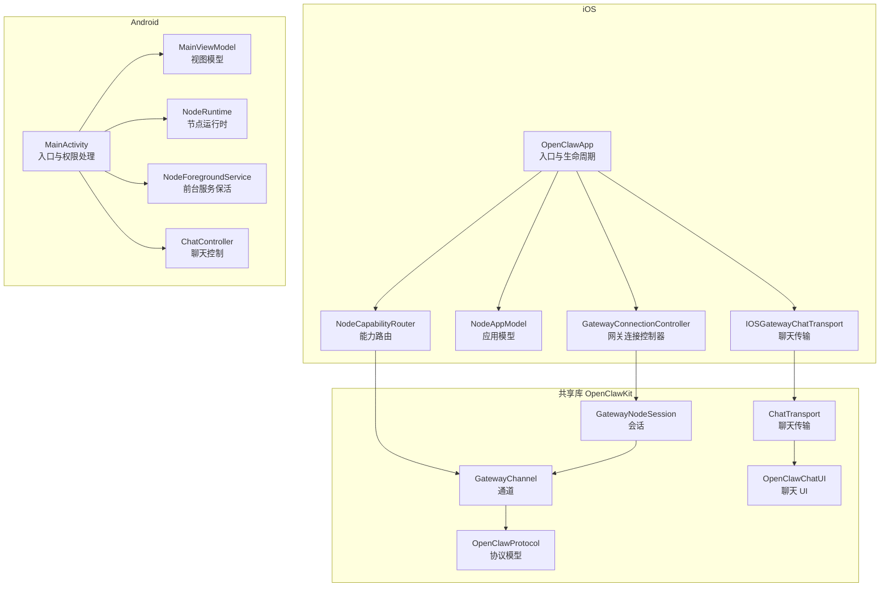
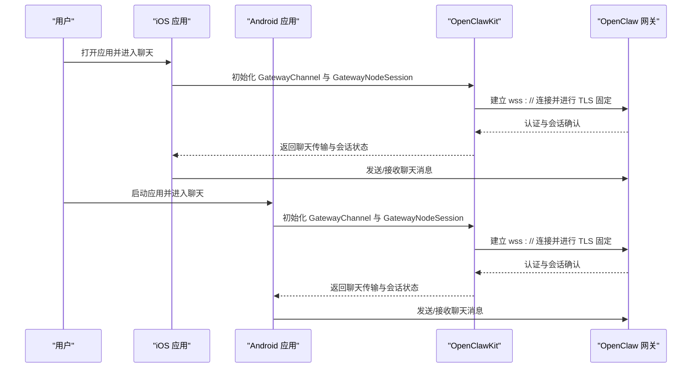
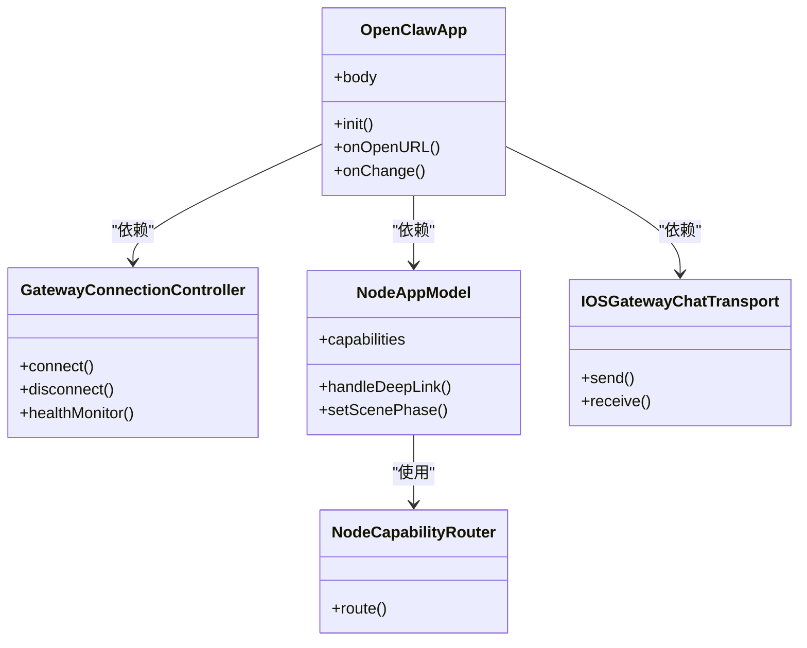
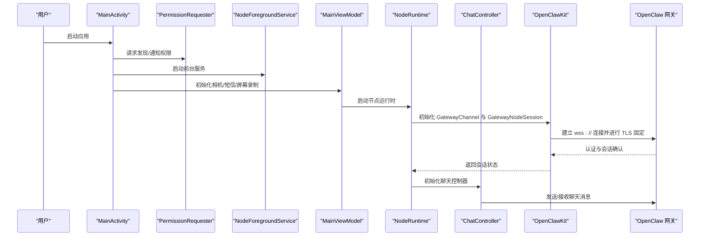
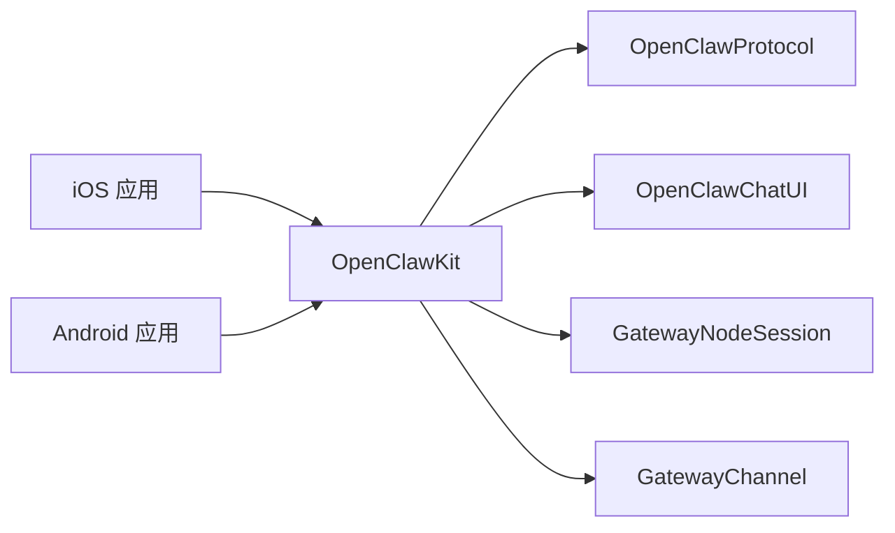

# 移动应用

<cite>
**本文引用的文件**
- [apps/ios/README.md](file://apps/ios/README.md)
- [apps/android/README.md](file://apps/android/README.md)
- [apps/shared/OpenClawKit/Package.swift](file://apps/shared/OpenClawKit/Package.swift)
- [apps/ios/Sources/OpenClawApp.swift](file://apps/ios/Sources/OpenClawApp.swift)
- [apps/ios/Sources/Gateway/GatewayConnectionController.swift](file://apps/ios/Sources/Gateway/GatewayConnectionController.swift)
- [apps/ios/Sources/Gateway/GatewaySettingsStore.swift](file://apps/ios/Sources/Gateway/GatewaySettingsStore.swift)
- [apps/ios/Sources/Model/NodeAppModel.swift](file://apps/ios/Sources/Model/NodeAppModel.swift)
- [apps/ios/Sources/Chat/IOSGatewayChatTransport.swift](file://apps/ios/Sources/Chat/IOSGatewayChatTransport.swift)
- [apps/ios/Sources/Capabilities/NodeCapabilityRouter.swift](file://apps/ios/Sources/Capabilities/NodeCapabilityRouter.swift)
- [apps/ios/Sources/Camera/CameraController.swift](file://apps/ios/Sources/Camera/CameraController.swift)
- [apps/ios/Sources/Location/LocationService.swift](file://apps/ios/Sources/Location/LocationService.swift)
- [apps/ios/Sources/Media/PhotoLibraryService.swift](file://apps/ios/Sources/Media/PhotoLibraryService.swift)
- [apps/ios/Sources/Reminders/RemindersService.swift](file://apps/ios/Sources/Reminders/RemindersService.swift)
- [apps/ios/Sources/Calendar/CalendarService.swift](file://apps/ios/Sources/Calendar/CalendarService.swift)
- [apps/ios/Sources/Contacts/ContactsService.swift](file://apps/ios/Sources/Contacts/ContactsService.swift)
- [apps/ios/Sources/Screen/ScreenController.swift](file://apps/ios/Sources/Screen/ScreenController.swift)
- [apps/ios/Sources/Services/NotificationService.swift](file://apps/ios/Sources/Services/NotificationService.swift)
- [apps/ios/Sources/Voice/VoiceTab.swift](file://apps/ios/Sources/Voice/VoiceTab.swift)
- [apps/ios/Sources/Voice/TalkModeManager.swift](file://apps/ios/Sources/Voice/TalkModeManager.swift)
- [apps/ios/Sources/Voice/VoiceWakeManager.swift](file://apps/ios/Sources/Voice/VoiceWakeManager.swift)
- [apps/ios/Sources/Settings/SettingsTab.swift](file://apps/ios/Sources/Settings/SettingsTab.swift)
- [apps/ios/Sources/Settings/SettingsNetworkingHelpers.swift](file://apps/ios/Sources/Settings/SettingsNetworkingHelpers.swift)
- [apps/ios/Sources/Status/StatusPill.swift](file://apps/ios/Sources/Status/StatusPill.swift)
- [apps/ios/Sources/Status/VoiceWakeToast.swift](file://apps/ios/Sources/Status/VoiceWakeToast.swift)
- [apps/android/app/src/main/java/ai/openclaw/android/MainActivity.kt](file://apps/android/app/src/main/java/ai/openclaw/android/MainActivity.kt)
- [apps/android/app/src/main/java/ai/openclaw/android/MainViewModel.kt](file://apps/android/app/src/main/java/ai/openclaw/android/MainViewModel.kt)
- [apps/android/app/src/main/java/ai/openclaw/android/NodeApp.kt](file://apps/android/app/src/main/java/ai/openclaw/android/NodeApp.kt)
- [apps/android/app/src/main/java/ai/openclaw/android/NodeForegroundService.kt](file://apps/android/app/src/main/java/ai/openclaw/android/NodeForegroundService.kt)
- [apps/android/app/src/main/java/ai/openclaw/android/NodeRuntime.kt](file://apps/android/app/src/main/java/ai/openclaw/android/NodeRuntime.kt)
- [apps/android/app/src/main/java/ai/openclaw/android/PermissionRequester.kt](file://apps/android/app/src/main/java/ai/openclaw/android/PermissionRequester.kt)
- [apps/android/app/src/main/java/ai/openclaw/android/ScreenCaptureRequester.kt](file://apps/android/app/src/main/java/ai/openclaw/android/ScreenCaptureRequester.kt)
- [apps/android/app/src/main/java/ai/openclaw/android/SecurePrefs.kt](file://apps/android/app/src/main/java/ai/openclaw/android/SecurePrefs.kt)
- [apps/android/app/src/main/java/ai/openclaw/android/SessionKey.kt](file://apps/android/app/src/main/java/ai/openclaw/android/SessionKey.kt)
- [apps/android/app/src/main/java/ai/openclaw/android/VoiceWakeMode.kt](file://apps/android/app/src/main/java/ai/openclaw/android/VoiceWakeMode.kt)
- [apps/android/app/src/main/java/ai/openclaw/android/WakeWords.kt](file://apps/android/app/src/main/java/ai/openclaw/android/WakeWords.kt)
- [apps/android/app/src/main/java/ai/openclaw/android/chat/ChatController.kt](file://apps/android/app/src/main/java/ai/openclaw/android/chat/ChatController.kt)
- [apps/android/app/src/main/java/ai/openclaw/android/chat/ChatModels.kt](file://apps/android/app/src/main/java/ai/openclaw/android/chat/ChatModels.kt)
- [apps/android/app/src/main/java/ai/openclaw/android/gateway/GatewayDiscovery.kt](file://apps/android/app/src/main/java/ai/openclaw/android/gateway/GatewayDiscovery.kt)
- [apps/android/app/src/main/java/ai/openclaw/android/gateway/GatewayEndpoint.kt](file://apps/android/app/src/main/java/ai/openclaw/android/gateway/GatewayEndpoint.kt)
- [apps/android/app/src/main/java/ai/openclaw/android/gateway/GatewayProtocol.kt](file://apps/android/app/src/main/java/ai/openclaw/android/gateway/GatewayProtocol.kt)
- [apps/android/app/src/main/java/ai/openclaw/android/gateway/GatewaySession.kt](file://apps/android/app/src/main/java/ai/openclaw/android/gateway/GatewaySession.kt)
- [apps/android/app/src/main/java/ai/openclaw/android/gateway/GatewayTls.kt](file://apps/android/app/src/main/java/ai/openclaw/android/gateway/GatewayTls.kt)
- [apps/android/app/src/main/java/ai/openclaw/android/node/CameraCaptureManager.kt](file://apps/android/app/src/main/java/ai/openclaw/android/node/CameraCaptureManager.kt)
- [apps/android/app/src/main/java/ai/openclaw/android/node/CanvasController.kt](file://apps/android/app/src/main/java/ai/openclaw/android/node/CanvasController.kt)
- [apps/android/app/src/main/java/ai/openclaw/android/node/JpegSizeLimiter.kt](file://apps/android/app/src/main/java/ai/openclaw/android/node/JpegSizeLimiter.kt)
- [apps/android/app/src/main/java/ai/openclaw/android/node/LocationCaptureManager.kt](file://apps/android/app/src/main/java/ai/openclaw/android/node/LocationCaptureManager.kt)
- [apps/android/app/src/main/java/ai/openclaw/android/node/ScreenRecordManager.kt](file://apps/android/app/src/main/java/ai/openclaw/android/node/ScreenRecordManager.kt)
- [apps/android/app/src/main/java/ai/openclaw/android/node/SmsManager.kt](file://apps/android/app/src/main/java/ai/openclaw/android/node/SmsManager.kt)
- [apps/android/app/src/main/java/ai/openclaw/android/protocol/OpenClawCanvasA2UIAction.kt](file://apps/android/app/src/main/java/ai/openclaw/android/protocol/OpenClawCanvasA2UIAction.kt)
- [apps/android/app/src/main/java/ai/openclaw/android/protocol/OpenClawProtocolConstants.kt](file://apps/android/app/src/main/java/ai/openclaw/android/protocol/OpenClawProtocolConstants.kt)
- [apps/android/app/src/main/java/ai/openclaw/android/ui/chat/ChatComposer.kt](file://apps/android/app/src/main/java/ai/openclaw/android/ui/chat/ChatComposer.kt)
- [apps/android/app/src/main/java/ai/openclaw/android/ui/chat/ChatMessageViews.kt](file://apps/android/app/src/main/java/ai/openclaw/android/ui/chat/ChatMessageViews.kt)
- [apps/android/app/src/main/java/ai/openclaw/android/ui/chat/ChatSheetContent.kt](file://apps/android/app/src/main/java/ai/openclaw/android/ui/chat/ChatSheetContent.kt)
- [apps/android/app/src/main/java/ai/openclaw/android/ui/chat/SessionFilters.kt](file://apps/android/app/src/main/java/ai/openclaw/android/ui/chat/SessionFilters.kt)
- [apps/android/app/src/main/java/ai/openclaw/android/ui/RootScreen.kt](file://apps/android/app/src/main/java/ai/openclaw/android/ui/RootScreen.kt)
- [apps/android/app/src/main/java/ai/openclaw/android/ui/SettingsSheet.kt](file://apps/android/app/src/main/java/ai/openclaw/android/ui/SettingsSheet.kt)
- [apps/android/app/src/main/java/ai/openclaw/android/ui/StatusPill.kt](file://apps/android/app/src/main/java/ai/openclaw/android/ui/StatusPill.kt)
- [apps/android/app/src/main/java/ai/openclaw/android/ui/TalkOrbOverlay.kt](file://apps/android/app/src/main/java/ai/openclaw/android/ui/TalkOrbOverlay.kt)
- [apps/shared/OpenClawKit/Sources/OpenClawKit/GatewayNodeSession.swift](file://apps/shared/OpenClawKit/Sources/OpenClawKit/GatewayNodeSession.swift)
- [apps/shared/OpenClawKit/Sources/OpenClawKit/GatewayChannel.swift](file://apps/shared/OpenClawKit/Sources/OpenClawKit/GatewayChannel.swift)
- [apps/shared/OpenClawKit/Sources/OpenClawKit/DeviceAuthStore.swift](file://apps/shared/OpenClawKit/Sources/OpenClawKit/DeviceAuthStore.swift)
- [apps/shared/OpenClawKit/Sources/OpenClawKit/DeviceIdentity.swift](file://apps/shared/OpenClawKit/Sources/OpenClawKit/DeviceIdentity.swift)
- [apps/shared/OpenClawKit/Sources/OpenClawKit/Capabilities.swift](file://apps/shared/OpenClawKit/Sources/OpenClawKit/Capabilities.swift)
- [apps/shared/OpenClawKit/Sources/OpenClawKit/CanvasCommands.swift](file://apps/shared/OpenClawKit/Sources/OpenClawKit/CanvasCommands.swift)
- [apps/shared/OpenClawKit/Sources/OpenClawKit/ChatCommands.swift](file://apps/shared/OpenClawKit/Sources/OpenClawKit/ChatCommands.swift)
- [apps/shared/OpenClawKit/Sources/OpenClawKit/TalkCommands.swift](file://apps/shared/OpenClawKit/Sources/OpenClawKit/TalkCommands.swift)
- [apps/shared/OpenClawKit/Sources/OpenClawKit/SystemCommands.swift](file://apps/shared/OpenClawKit/Sources/OpenClawKit/SystemCommands.swift)
- [apps/shared/OpenClawKit/Sources/OpenClawChatUI/ChatTransport.swift](file://apps/shared/OpenClawKit/Sources/OpenClawChatUI/ChatTransport.swift)
- [apps/shared/OpenClawKit/Sources/OpenClawChatUI/ChatViewModel.swift](file://apps/shared/OpenClawKit/Sources/OpenClawChatUI/ChatViewModel.swift)
- [apps/shared/OpenClawKit/Sources/OpenClawChatUI/ChatView.swift](file://apps/shared/OpenClawKit/Sources/OpenClawChatUI/ChatView.swift)
- [apps/shared/OpenClawKit/Sources/OpenClawChatUI/ChatSheets.swift](file://apps/shared/OpenClawKit/Sources/OpenClawChatUI/ChatSheets.swift)
- [apps/shared/OpenClawKit/Sources/OpenClawChatUI/ChatModels.swift](file://apps/shared/OpenClawKit/Sources/OpenClawChatUI/ChatModels.swift)
- [apps/shared/OpenClawKit/Sources/OpenClawProtocol/GatewayModels.swift](file://apps/shared/OpenClawKit/Sources/OpenClawProtocol/GatewayModels.swift)
- [apps/shared/OpenClawKit/Sources/OpenClawProtocol/AnyCodable.swift](file://apps/shared/OpenClawKit/Sources/OpenClawProtocol/AnyCodable.swift)
- [apps/shared/OpenClawKit/Sources/OpenClawProtocol/WizardHelpers.swift](file://apps/shared/OpenClawKit/Sources/OpenClawProtocol/WizardHelpers.swift)
</cite>

## 目录

1. [简介](#简介)
2. [项目结构](#项目结构)
3. [核心组件](#核心组件)
4. [架构总览](#架构总览)
5. [详细组件分析](#详细组件分析)
6. [依赖关系分析](#依赖关系分析)
7. [性能考量](#性能考量)
8. [故障排查指南](#故障排查指南)
9. [结论](#结论)
10. [附录](#附录)

## 简介

本文件为 OpenClaw 移动应用（iOS 与 Android）的全面技术文档。内容覆盖应用功能特性、使用方法、配置选项、节点配对流程、平台差异、权限管理、网络连接与数据同步机制、开发与调试指南以及性能优化建议。文档同时解释应用与网关的通信协议、安全考虑与用户体验设计，并说明各平台特有的功能与限制。

## 项目结构

移动应用由三部分组成：

- iOS 应用：SwiftUI 驱动，通过共享库与网关通信，提供聊天、语音、Canvas 画布、设备能力暴露等。
- Android 应用：Kotlin + Jetpack Compose，通过前台服务维持长连，提供聊天、相机、屏幕录制、Canvas 与语音唤醒等。
- 共享库 OpenClawKit：跨平台协议、传输层、会话与 UI 组件，统一 iOS 与 Android 的通信与界面体验。

图表来源

- [apps/ios/Sources/OpenClawApp.swift](file://apps/ios/Sources/OpenClawApp.swift#L1-L32)
- [apps/ios/Sources/Gateway/GatewayConnectionController.swift](file://apps/ios/Sources/Gateway/GatewayConnectionController.swift)
- [apps/ios/Sources/Model/NodeAppModel.swift](file://apps/ios/Sources/Model/NodeAppModel.swift)
- [apps/ios/Sources/Chat/IOSGatewayChatTransport.swift](file://apps/ios/Sources/Chat/IOSGatewayChatTransport.swift)
- [apps/ios/Sources/Capabilities/NodeCapabilityRouter.swift](file://apps/ios/Sources/Capabilities/NodeCapabilityRouter.swift)
- [apps/android/app/src/main/java/ai/openclaw/android/MainActivity.kt](file://apps/android/app/src/main/java/ai/openclaw/android/MainActivity.kt#L1-L131)
- [apps/android/app/src/main/java/ai/openclaw/android/MainViewModel.kt](file://apps/android/app/src/main/java/ai/openclaw/android/MainViewModel.kt)
- [apps/android/app/src/main/java/ai/openclaw/android/NodeRuntime.kt](file://apps/android/app/src/main/java/ai/openclaw/android/NodeRuntime.kt)
- [apps/android/app/src/main/java/ai/openclaw/android/NodeForegroundService.kt](file://apps/android/app/src/main/java/ai/openclaw/android/NodeForegroundService.kt)
- [apps/android/app/src/main/java/ai/openclaw/android/chat/ChatController.kt](file://apps/android/app/src/main/java/ai/openclaw/android/chat/ChatController.kt)
- [apps/shared/OpenClawKit/Sources/OpenClawKit/GatewayNodeSession.swift](file://apps/shared/OpenClawKit/Sources/OpenClawKit/GatewayNodeSession.swift)
- [apps/shared/OpenClawKit/Sources/OpenClawKit/GatewayChannel.swift](file://apps/shared/OpenClawKit/Sources/OpenClawKit/GatewayChannel.swift)
- [apps/shared/OpenClawKit/Sources/OpenClawChatUI/ChatTransport.swift](file://apps/shared/OpenClawKit/Sources/OpenClawChatUI/ChatTransport.swift)
- [apps/shared/OpenClawKit/Sources/OpenClawProtocol/GatewayModels.swift](file://apps/shared/OpenClawKit/Sources/OpenClawProtocol/GatewayModels.swift)

章节来源

- [apps/ios/README.md](file://apps/ios/README.md#L1-L67)
- [apps/android/README.md](file://apps/android/README.md#L1-L52)
- [apps/shared/OpenClawKit/Package.swift](file://apps/shared/OpenClawKit/Package.swift#L1-L62)

## 核心组件

- iOS
  - 应用入口与生命周期：负责初始化设置存储、应用模型与网关控制器，并处理深链与场景状态变化。
  - 网关连接控制器：封装与网关的连接、发现、TLS 固定与健康监测。
  - 应用模型：承载全局状态、能力路由与会话管理。
  - 聊天传输：基于网关通道的聊天消息收发。
  - 设备能力路由：将系统服务（相机、位置、相册、提醒、日历、联系人、屏幕）映射为节点命令。
- Android
  - 主活动：处理权限请求、沉浸式窗口、前台服务启动与生命周期事件。
  - 视图模型：协调相机、短信、屏幕录制等能力的生命周期与权限。
  - 节点运行时：维护与网关的长连、Canvas 与语音相关能力。
  - 前台服务：保持连接常驻，提供断开操作。
  - 聊天控制：统一会话键“main”，跨端一致的聊天体验。
- 共享库 OpenClawKit
  - 会话与通道：抽象 WebSocket 传输、TLS 固定、错误处理与重连策略。
  - 协议与模型：定义网关消息格式、能力声明与工具显示。
  - 聊天 UI：提供聊天视图、消息渲染、会话管理与深链支持。

章节来源

- [apps/ios/Sources/OpenClawApp.swift](file://apps/ios/Sources/OpenClawApp.swift#L1-L32)
- [apps/ios/Sources/Gateway/GatewayConnectionController.swift](file://apps/ios/Sources/Gateway/GatewayConnectionController.swift)
- [apps/ios/Sources/Model/NodeAppModel.swift](file://apps/ios/Sources/Model/NodeAppModel.swift)
- [apps/ios/Sources/Chat/IOSGatewayChatTransport.swift](file://apps/ios/Sources/Chat/IOSGatewayChatTransport.swift)
- [apps/ios/Sources/Capabilities/NodeCapabilityRouter.swift](file://apps/ios/Sources/Capabilities/NodeCapabilityRouter.swift)
- [apps/android/app/src/main/java/ai/openclaw/android/MainActivity.kt](file://apps/android/app/src/main/java/ai/openclaw/android/MainActivity.kt#L1-L131)
- [apps/android/app/src/main/java/ai/openclaw/android/MainViewModel.kt](file://apps/android/app/src/main/java/ai/openclaw/android/MainViewModel.kt)
- [apps/android/app/src/main/java/ai/openclaw/android/NodeRuntime.kt](file://apps/android/app/src/main/java/ai/openclaw/android/NodeRuntime.kt)
- [apps/android/app/src/main/java/ai/openclaw/android/NodeForegroundService.kt](file://apps/android/app/src/main/java/ai/openclaw/android/NodeForegroundService.kt)
- [apps/android/app/src/main/java/ai/openclaw/android/chat/ChatController.kt](file://apps/android/app/src/main/java/ai/openclaw/android/chat/ChatController.kt)
- [apps/shared/OpenClawKit/Sources/OpenClawKit/GatewayNodeSession.swift](file://apps/shared/OpenClawKit/Sources/OpenClawKit/GatewayNodeSession.swift)
- [apps/shared/OpenClawKit/Sources/OpenClawKit/GatewayChannel.swift](file://apps/shared/OpenClawKit/Sources/OpenClawKit/GatewayChannel.swift)
- [apps/shared/OpenClawKit/Sources/OpenClawChatUI/ChatTransport.swift](file://apps/shared/OpenClawKit/Sources/OpenClawChatUI/ChatTransport.swift)
- [apps/shared/OpenClawKit/Sources/OpenClawProtocol/GatewayModels.swift](file://apps/shared/OpenClawKit/Sources/OpenClawProtocol/GatewayModels.swift)

## 架构总览

应用通过共享库与网关建立 WebSocket 连接，采用 TLS 固定与会话管理确保安全与稳定。iOS 使用 SwiftUI，Android 使用 Jetpack Compose，两者均通过共享 UI 组件提供一致的聊天体验。设备能力经由能力路由映射为节点命令，支持相机、位置、相册、提醒、日历、联系人与屏幕录制等。

图表来源

- [apps/ios/Sources/OpenClawApp.swift](file://apps/ios/Sources/OpenClawApp.swift#L1-L32)
- [apps/ios/Sources/Chat/IOSGatewayChatTransport.swift](file://apps/ios/Sources/Chat/IOSGatewayChatTransport.swift)
- [apps/android/app/src/main/java/ai/openclaw/android/MainActivity.kt](file://apps/android/app/src/main/java/ai/openclaw/android/MainActivity.kt#L1-L131)
- [apps/shared/OpenClawKit/Sources/OpenClawKit/GatewayNodeSession.swift](file://apps/shared/OpenClawKit/Sources/OpenClawKit/GatewayNodeSession.swift)
- [apps/shared/OpenClawKit/Sources/OpenClawKit/GatewayChannel.swift](file://apps/shared/OpenClawKit/Sources/OpenClawKit/GatewayChannel.swift)

## 详细组件分析

### iOS 组件分析

- 应用入口与生命周期
  - 初始化设置持久化、应用模型与网关控制器；处理深链与场景状态变化以适配前台/后台行为。
- 网关连接控制器
  - 负责连接建立、发现、TLS 固定与健康监测；与应用模型协同管理会话。
- 应用模型
  - 统一状态管理、能力路由与会话生命周期；支持 Canvas 与语音模式切换。
- 聊天传输
  - 基于网关通道的消息编解码与发送；支持 Markdown 渲染与会话管理。
- 设备能力路由
  - 将系统服务映射为节点命令，受权限控制；包括相机、位置、相册、提醒、日历、联系人与屏幕。

图表来源

- [apps/ios/Sources/OpenClawApp.swift](file://apps/ios/Sources/OpenClawApp.swift#L1-L32)
- [apps/ios/Sources/Gateway/GatewayConnectionController.swift](file://apps/ios/Sources/Gateway/GatewayConnectionController.swift)
- [apps/ios/Sources/Model/NodeAppModel.swift](file://apps/ios/Sources/Model/NodeAppModel.swift)
- [apps/ios/Sources/Chat/IOSGatewayChatTransport.swift](file://apps/ios/Sources/Chat/IOSGatewayChatTransport.swift)
- [apps/ios/Sources/Capabilities/NodeCapabilityRouter.swift](file://apps/ios/Sources/Capabilities/NodeCapabilityRouter.swift)

章节来源

- [apps/ios/Sources/OpenClawApp.swift](file://apps/ios/Sources/OpenClawApp.swift#L1-L32)
- [apps/ios/Sources/Gateway/GatewayConnectionController.swift](file://apps/ios/Sources/Gateway/GatewayConnectionController.swift)
- [apps/ios/Sources/Model/NodeAppModel.swift](file://apps/ios/Sources/Model/NodeAppModel.swift)
- [apps/ios/Sources/Chat/IOSGatewayChatTransport.swift](file://apps/ios/Sources/Chat/IOSGatewayChatTransport.swift)
- [apps/ios/Sources/Capabilities/NodeCapabilityRouter.swift](file://apps/ios/Sources/Capabilities/NodeCapabilityRouter.swift)

### Android 组件分析

- 主活动
  - 处理权限请求（发现、通知）、沉浸式窗口、前台服务启动与生命周期事件。
- 视图模型
  - 协调相机、短信、屏幕录制等能力的生命周期与权限。
- 节点运行时
  - 维护与网关的长连、Canvas 与语音相关能力。
- 前台服务
  - 保持连接常驻，提供断开操作，避免被系统回收。
- 聊天控制
  - 统一会话键“main”，跨端一致的聊天体验。

图表来源

- [apps/android/app/src/main/java/ai/openclaw/android/MainActivity.kt](file://apps/android/app/src/main/java/ai/openclaw/android/MainActivity.kt#L1-L131)
- [apps/android/app/src/main/java/ai/openclaw/android/PermissionRequester.kt](file://apps/android/app/src/main/java/ai/openclaw/android/PermissionRequester.kt)
- [apps/android/app/src/main/java/ai/openclaw/android/NodeForegroundService.kt](file://apps/android/app/src/main/java/ai/openclaw/android/NodeForegroundService.kt)
- [apps/android/app/src/main/java/ai/openclaw/android/MainViewModel.kt](file://apps/android/app/src/main/java/ai/openclaw/android/MainViewModel.kt)
- [apps/android/app/src/main/java/ai/openclaw/android/NodeRuntime.kt](file://apps/android/app/src/main/java/ai/openclaw/android/NodeRuntime.kt)
- [apps/android/app/src/main/java/ai/openclaw/android/chat/ChatController.kt](file://apps/android/app/src/main/java/ai/openclaw/android/chat/ChatController.kt)
- [apps/shared/OpenClawKit/Sources/OpenClawKit/GatewayNodeSession.swift](file://apps/shared/OpenClawKit/Sources/OpenClawKit/GatewayNodeSession.swift)
- [apps/shared/OpenClawKit/Sources/OpenClawKit/GatewayChannel.swift](file://apps/shared/OpenClawKit/Sources/OpenClawKit/GatewayChannel.swift)

章节来源

- [apps/android/app/src/main/java/ai/openclaw/android/MainActivity.kt](file://apps/android/app/src/main/java/ai/openclaw/android/MainActivity.kt#L1-L131)
- [apps/android/app/src/main/java/ai/openclaw/android/MainViewModel.kt](file://apps/android/app/src/main/java/ai/openclaw/android/MainViewModel.kt)
- [apps/android/app/src/main/java/ai/openclaw/android/NodeRuntime.kt](file://apps/android/app/src/main/java/ai/openclaw/android/NodeRuntime.kt)
- [apps/android/app/src/main/java/ai/openclaw/android/NodeForegroundService.kt](file://apps/android/app/src/main/java/ai/openclaw/android/NodeForegroundService.kt)
- [apps/android/app/src/main/java/ai/openclaw/android/chat/ChatController.kt](file://apps/android/app/src/main/java/ai/openclaw/android/chat/ChatController.kt)

### 能力与服务映射（iOS）

- 相机：通过相机控制器捕获照片与视频，受相机与录音权限控制。
- 位置：通过位置服务获取地理信息，受定位权限控制。
- 相册：通过媒体库服务访问照片与视频。
- 提醒：通过提醒服务读取与管理提醒事项。
- 日历：通过日历服务读取日程安排。
- 联系人：通过联系人服务读取通讯录。
- 屏幕：通过屏幕控制器与屏幕录制服务实现屏幕分享与录制。

章节来源

- [apps/ios/Sources/Camera/CameraController.swift](file://apps/ios/Sources/Camera/CameraController.swift)
- [apps/ios/Sources/Location/LocationService.swift](file://apps/ios/Sources/Location/LocationService.swift)
- [apps/ios/Sources/Media/PhotoLibraryService.swift](file://apps/ios/Sources/Media/PhotoLibraryService.swift)
- [apps/ios/Sources/Reminders/RemindersService.swift](file://apps/ios/Sources/Reminders/RemindersService.swift)
- [apps/ios/Sources/Calendar/CalendarService.swift](file://apps/ios/Sources/Calendar/CalendarService.swift)
- [apps/ios/Sources/Contacts/ContactsService.swift](file://apps/ios/Sources/Contacts/ContactsService.swift)
- [apps/ios/Sources/Screen/ScreenController.swift](file://apps/ios/Sources/Screen/ScreenController.swift)

### 能力与服务映射（Android）

- 相机：通过相机捕获管理器实现拍照与录制，受相机与录音权限控制。
- 位置：通过位置捕获管理器获取地理信息。
- 屏幕录制：通过屏幕录制管理器实现屏幕录制。
- 短信：通过短信管理器读取与发送短信。
- Canvas：通过画布控制器与协议常量实现 A2UI 动作与画布交互。

章节来源

- [apps/android/app/src/main/java/ai/openclaw/android/node/CameraCaptureManager.kt](file://apps/android/app/src/main/java/ai/openclaw/android/node/CameraCaptureManager.kt)
- [apps/android/app/src/main/java/ai/openclaw/android/node/LocationCaptureManager.kt](file://apps/android/app/src/main/java/ai/openclaw/android/node/LocationCaptureManager.kt)
- [apps/android/app/src/main/java/ai/openclaw/android/node/ScreenRecordManager.kt](file://apps/android/app/src/main/java/ai/openclaw/android/node/ScreenRecordManager.kt)
- [apps/android/app/src/main/java/ai/openclaw/android/node/SmsManager.kt](file://apps/android/app/src/main/java/ai/openclaw/android/node/SmsManager.kt)
- [apps/android/app/src/main/java/ai/openclaw/android/node/CanvasController.kt](file://apps/android/app/src/main/java/ai/openclaw/android/node/CanvasController.kt)
- [apps/android/app/src/main/java/ai/openclaw/android/protocol/OpenClawProtocolConstants.kt](file://apps/android/app/src/main/java/ai/openclaw/android/protocol/OpenClawProtocolConstants.kt)

### 聊天与 UI（跨平台）

- 聊天传输：基于共享库的聊天传输接口，统一消息编码与发送。
- 聊天视图与模型：提供消息列表、Markdown 渲染、会话管理与深链支持。
- 会话键：Android 默认使用“main”会话键，确保跨端一致性。

章节来源

- [apps/shared/OpenClawKit/Sources/OpenClawChatUI/ChatTransport.swift](file://apps/shared/OpenClawKit/Sources/OpenClawChatUI/ChatTransport.swift)
- [apps/shared/OpenClawKit/Sources/OpenClawChatUI/ChatView.swift](file://apps/shared/OpenClawKit/Sources/OpenClawChatUI/ChatView.swift)
- [apps/shared/OpenClawKit/Sources/OpenClawChatUI/ChatViewModel.swift](file://apps/shared/OpenClawKit/Sources/OpenClawChatUI/ChatViewModel.swift)
- [apps/shared/OpenClawKit/Sources/OpenClawChatUI/ChatSheets.swift](file://apps/shared/OpenClawKit/Sources/OpenClawChatUI/ChatSheets.swift)
- [apps/shared/OpenClawKit/Sources/OpenClawChatUI/ChatModels.swift](file://apps/shared/OpenClawKit/Sources/OpenClawChatUI/ChatModels.swift)
- [apps/android/app/src/main/java/ai/openclaw/android/chat/ChatController.kt](file://apps/android/app/src/main/java/ai/openclaw/android/chat/ChatController.kt)
- [apps/android/app/src/main/java/ai/openclaw/android/chat/ChatModels.kt](file://apps/android/app/src/main/java/ai/openclaw/android/chat/ChatModels.kt)

### 语音与唤醒（跨平台）

- iOS
  - 语音标签页、语音唤醒管理器与语音模式管理器，支持语音指令与对话。
- Android
  - 语音唤醒模式与唤醒词配置，支持流媒体数据源与指令解析。

章节来源

- [apps/ios/Sources/Voice/VoiceTab.swift](file://apps/ios/Sources/Voice/VoiceTab.swift)
- [apps/ios/Sources/Voice/VoiceWakeManager.swift](file://apps/ios/Sources/Voice/VoiceWakeManager.swift)
- [apps/ios/Sources/Voice/TalkModeManager.swift](file://apps/ios/Sources/Voice/TalkModeManager.swift)
- [apps/android/app/src/main/java/ai/openclaw/android/VoiceWakeMode.kt](file://apps/android/app/src/main/java/ai/openclaw/android/VoiceWakeMode.kt)
- [apps/android/app/src/main/java/ai/openclaw/android/WakeWords.kt](file://apps/android/app/src/main/java/ai/openclaw/android/WakeWords.kt)

### 设置与网络（跨平台）

- iOS
  - 设置页面与网络辅助工具，支持网关配置与连接调试。
- Android
  - 设置面板与状态展示，配合前台服务与权限管理。

章节来源

- [apps/ios/Sources/Settings/SettingsTab.swift](file://apps/ios/Sources/Settings/SettingsTab.swift)
- [apps/ios/Sources/Settings/SettingsNetworkingHelpers.swift](file://apps/ios/Sources/Settings/SettingsNetworkingHelpers.swift)
- [apps/android/app/src/main/java/ai/openclaw/android/ui/SettingsSheet.kt](file://apps/android/app/src/main/java/ai/openclaw/android/ui/SettingsSheet.kt)
- [apps/android/app/src/main/java/ai/openclaw/android/ui/StatusPill.kt](file://apps/android/app/src/main/java/ai/openclaw/android/ui/StatusPill.kt)

## 依赖关系分析

- 平台与共享库
  - iOS 与 Android 均依赖 OpenClawKit 提供的协议、传输与 UI 组件。
  - 共享库定义了网关模型、能力声明与工具显示，保证跨端一致性。
- 组件耦合
  - iOS：应用入口依赖网关控制器与应用模型；聊天传输依赖通道与会话。
  - Android：主活动依赖权限请求、前台服务与视图模型；视图模型依赖节点运行时与聊天控制器。
- 外部依赖
  - iOS：ElevenLabsKit、Textual 等第三方库用于语音与文本渲染。
  - Android：Jetpack Compose、Material3 与 Android SDK。

图表来源

- [apps/shared/OpenClawKit/Package.swift](file://apps/shared/OpenClawKit/Package.swift#L1-L62)
- [apps/shared/OpenClawKit/Sources/OpenClawProtocol/GatewayModels.swift](file://apps/shared/OpenClawKit/Sources/OpenClawProtocol/GatewayModels.swift)
- [apps/shared/OpenClawKit/Sources/OpenClawChatUI/ChatTransport.swift](file://apps/shared/OpenClawKit/Sources/OpenClawChatUI/ChatTransport.swift)
- [apps/shared/OpenClawKit/Sources/OpenClawKit/GatewayNodeSession.swift](file://apps/shared/OpenClawKit/Sources/OpenClawKit/GatewayNodeSession.swift)
- [apps/shared/OpenClawKit/Sources/OpenClawKit/GatewayChannel.swift](file://apps/shared/OpenClawKit/Sources/OpenClawKit/GatewayChannel.swift)

章节来源

- [apps/shared/OpenClawKit/Package.swift](file://apps/shared/OpenClawKit/Package.swift#L1-L62)

## 性能考量

- 连接保活
  - Android 通过前台服务维持长连，减少被系统回收的风险；iOS 在前台场景下保持连接稳定。
- 权限与资源占用
  - 按需申请权限，避免不必要的后台扫描与录音；合理使用屏幕常亮与后台任务。
- 图像与媒体处理
  - Android 提供 JPEG 大小限制与屏幕录制管理，降低内存与带宽压力。
- UI 响应
  - 使用 Compose 与 SwiftUI 的响应式更新，避免主线程阻塞；聊天渲染采用 Markdown 预处理与增量更新。

## 故障排查指南

- 连接问题
  - 检查网关地址与端口配置；确认 TLS 固定与证书链有效；查看健康监测日志。
- 权限问题
  - iOS：确认相机、定位、相册、提醒、日历、联系人等权限已授予。
  - Android：确认发现权限（Android 13+ 为 NEARBY_WIFI_DEVICES，12 及以下为 ACCESS_FINE_LOCATION）、通知权限（Android 13+）与相机/录音权限。
- 前台服务与保活
  - Android：确认前台服务已启动且通知存在；检查断开按钮是否可用。
- 聊天与会话
  - 确认会话键“main”未被意外修改；检查聊天传输是否正常收发消息。
- 深链与设置
  - iOS：验证深链处理逻辑；检查设置页面的网关配置与网络辅助工具。

章节来源

- [apps/ios/Sources/Gateway/GatewayConnectionController.swift](file://apps/ios/Sources/Gateway/GatewayConnectionController.swift)
- [apps/ios/Sources/Gateway/GatewaySettingsStore.swift](file://apps/ios/Sources/Gateway/GatewaySettingsStore.swift)
- [apps/ios/Sources/Services/NotificationService.swift](file://apps/ios/Sources/Services/NotificationService.swift)
- [apps/android/app/src/main/java/ai/openclaw/android/MainActivity.kt](file://apps/android/app/src/main/java/ai/openclaw/android/MainActivity.kt#L1-L131)
- [apps/android/app/src/main/java/ai/openclaw/android/NodeForegroundService.kt](file://apps/android/app/src/main/java/ai/openclaw/android/NodeForegroundService.kt)
- [apps/shared/OpenClawKit/Sources/OpenClawKit/GatewayTLSPinning.swift](file://apps/shared/OpenClawKit/Sources/OpenClawKit/GatewayTLSPinning.swift)

## 结论

OpenClaw 移动应用通过共享库实现了跨平台的一致性与可扩展性。iOS 与 Android 在连接保活、权限管理、能力映射与聊天体验上各有侧重，但均遵循统一的协议与 UI 设计。配合严格的 TLS 固定与会话管理，应用在安全性与稳定性方面具备良好基础。后续可在后台稳定性、权限最小化与性能优化方面持续改进。

## 附录

### 节点配对流程（推荐）

- iOS
  - 在 Telegram 中向机器人发送 /pair 获取设置码；在 iOS 应用设置中粘贴设置码并连接；回到 Telegram 执行 /pair approve 完成批准。
- Android
  - 在应用设置中选择已发现的网关或手动输入主机与端口；在网关机器上执行 openclaw nodes pending 与 openclaw nodes approve <requestId> 完成批准。

章节来源

- [apps/ios/README.md](file://apps/ios/README.md#L18-L26)
- [apps/android/README.md](file://apps/android/README.md#L24-L41)

### 平台特定实现差异

- iOS
  - UI 与引导快速迭代；后台行为尚不稳定，当前以前台应用为主；权限为可选，应用敏感，需强化安全。
- Android
  - 现代 Android（minSdk 31），Kotlin + Jetpack Compose；通过前台服务维持连接；聊天统一使用会话键“main”。

章节来源

- [apps/ios/README.md](file://apps/ios/README.md#L5-L17)
- [apps/android/README.md](file://apps/android/README.md#L3-L9)

### 权限管理

- iOS
  - 相机、定位、相册、提醒、日历、联系人等权限决定相应能力的可用性。
- Android
  - 发现权限（Android 13+ NEARBY_WIFI_DEVICES，12 及以下 ACCESS_FINE_LOCATION）、通知权限（Android 13+ POST_NOTIFICATIONS）、相机与录音权限。

章节来源

- [apps/ios/README.md](file://apps/ios/README.md#L15-L16)
- [apps/android/README.md](file://apps/android/README.md#L43-L52)

### 网络连接与数据同步

- 连接方式
  - 通过 wss:// 与网关建立安全连接；支持 Bonjour 发现与手动输入网关地址。
- 数据同步
  - 聊天使用统一会话键“main”，确保跨端一致性；Canvas 与语音相关数据通过通道与会话进行同步。

章节来源

- [apps/ios/README.md](file://apps/ios/README.md#L13-L16)
- [apps/android/README.md](file://apps/android/README.md#L6-L8)
- [apps/android/app/src/main/java/ai/openclaw/android/gateway/GatewayDiscovery.kt](file://apps/android/app/src/main/java/ai/openclaw/android/gateway/GatewayDiscovery.kt)
- [apps/android/app/src/main/java/ai/openclaw/android/gateway/GatewayEndpoint.kt](file://apps/android/app/src/main/java/ai/openclaw/android/gateway/GatewayEndpoint.kt)
- [apps/shared/OpenClawKit/Sources/OpenClawKit/GatewayChannel.swift](file://apps/shared/OpenClawKit/Sources/OpenClawKit/GatewayChannel.swift)

### 开发指南与调试

- iOS
  - 使用 Xcode 与 Swift 工具链；通过 xcodegen 生成工程；支持测试与深链调试。
- Android
  - 使用 Android Studio；Gradle 构建与安装；支持单元测试与权限调试。
- 共享库
  - 通过 Swift Package Manager 管理依赖与目标；支持并发严格模式与实验特性。

章节来源

- [apps/ios/README.md](file://apps/ios/README.md#L27-L67)
- [apps/android/README.md](file://apps/android/README.md#L10-L23)
- [apps/shared/OpenClawKit/Package.swift](file://apps/shared/OpenClawKit/Package.swift#L1-L62)

### 通信协议与安全

- 协议
  - 通过 OpenClawProtocol 定义网关消息格式与能力声明；通过 GatewayChannel 与 GatewayNodeSession 实现传输与会话管理。
- 安全
  - 采用 TLS 固定与证书固定策略；设备身份与认证存储在共享库中，确保端到端安全。

章节来源

- [apps/shared/OpenClawKit/Sources/OpenClawProtocol/GatewayModels.swift](file://apps/shared/OpenClawKit/Sources/OpenClawProtocol/GatewayModels.swift)
- [apps/shared/OpenClawKit/Sources/OpenClawKit/GatewayChannel.swift](file://apps/shared/OpenClawKit/Sources/OpenClawKit/GatewayChannel.swift)
- [apps/shared/OpenClawKit/Sources/OpenClawKit/GatewayNodeSession.swift](file://apps/shared/OpenClawKit/Sources/OpenClawKit/GatewayNodeSession.swift)
- [apps/shared/OpenClawKit/Sources/OpenClawKit/DeviceAuthStore.swift](file://apps/shared/OpenClawKit/Sources/OpenClawKit/DeviceAuthStore.swift)
- [apps/shared/OpenClawKit/Sources/OpenClawKit/DeviceIdentity.swift](file://apps/shared/OpenClawKit/Sources/OpenClawKit/DeviceIdentity.swift)
- [apps/shared/OpenClawKit/Sources/OpenClawKit/GatewayTLSPinning.swift](file://apps/shared/OpenClawKit/Sources/OpenClawKit/GatewayTLSPinning.swift)

### 用户体验设计

- iOS
  - SwiftUI 界面与沉浸式体验；状态提示与语音唤醒反馈。
- Android
  - Material3 与 Jetpack Compose；沉浸式窗口与状态展示；前台服务通知与断开操作。

章节来源

- [apps/ios/Sources/Status/StatusPill.swift](file://apps/ios/Sources/Status/StatusPill.swift)
- [apps/ios/Sources/Status/VoiceWakeToast.swift](file://apps/ios/Sources/Status/VoiceWakeToast.swift)
- [apps/android/app/src/main/java/ai/openclaw/android/ui/StatusPill.kt](file://apps/android/app/src/main/java/ai/openclaw/android/ui/StatusPill.kt)
- [apps/android/app/src/main/java/ai/openclaw/android/ui/TalkOrbOverlay.kt](file://apps/android/app/src/main/java/ai/openclaw/android/ui/TalkOrbOverlay.kt)
