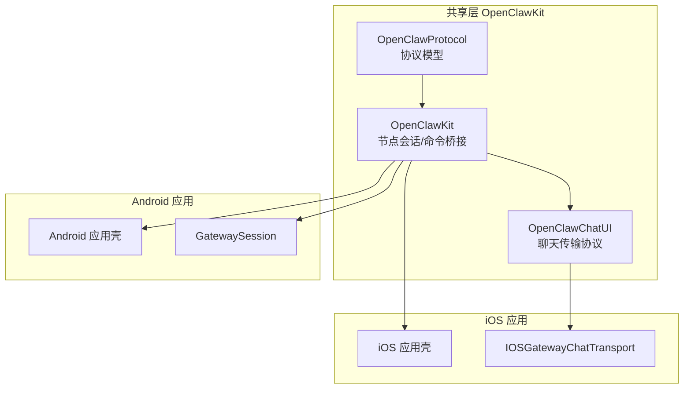
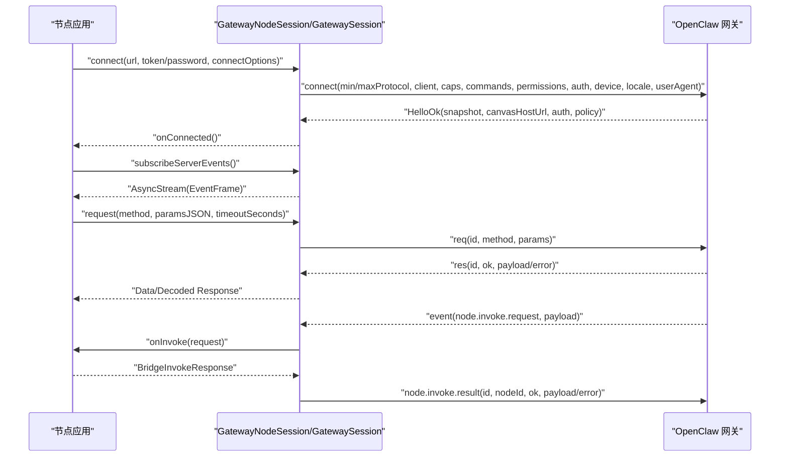
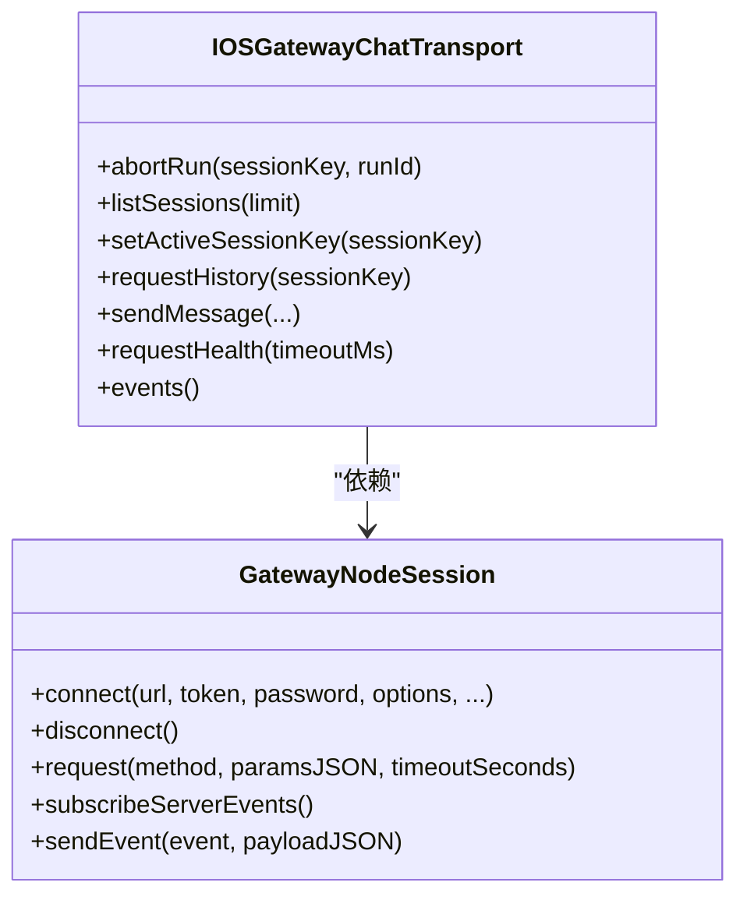
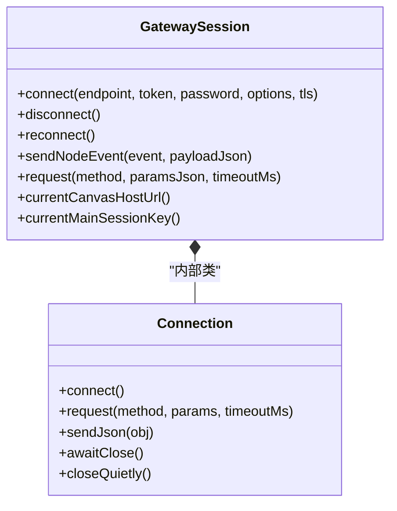
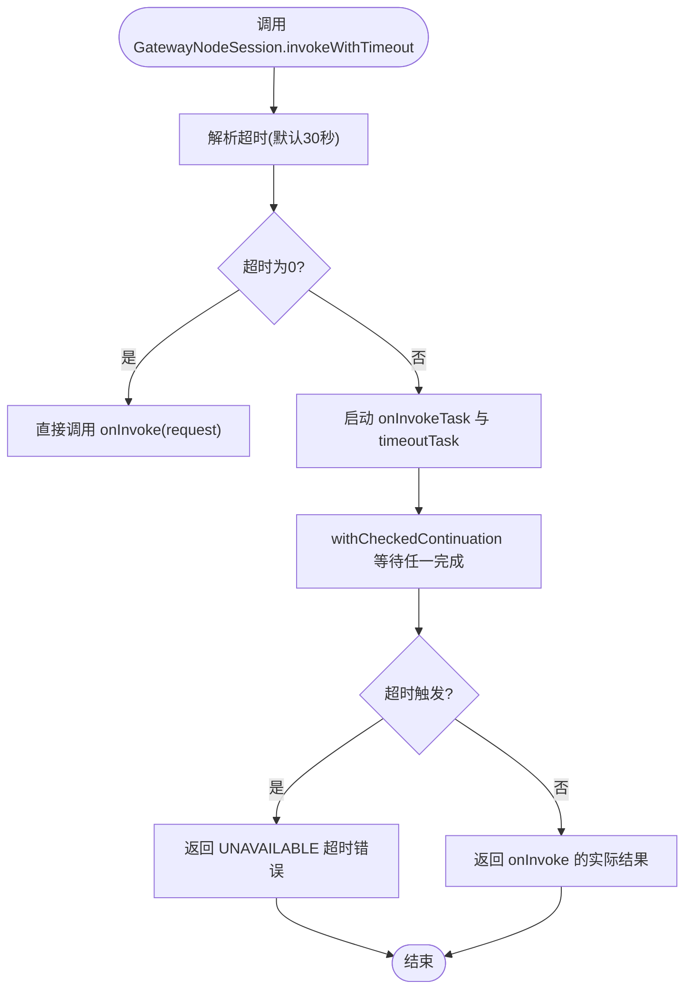
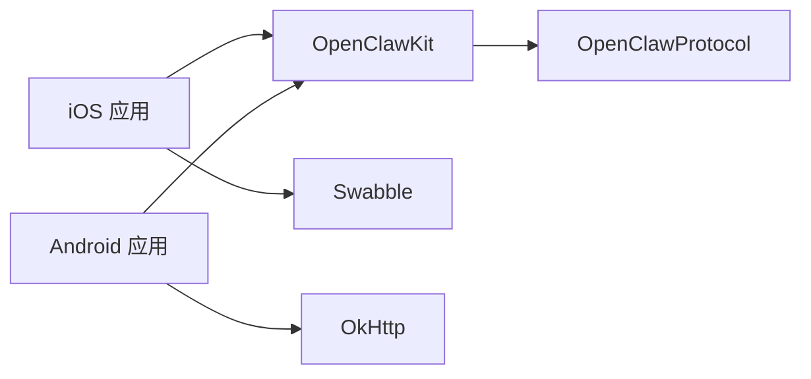

# 跨平台对比

<cite>
**本文引用的文件**
- [apps/shared/OpenClawKit/Package.swift](file://apps/shared/OpenClawKit/Package.swift)
- [apps/shared/OpenClawKit/Sources/OpenClawKit/GatewayNodeSession.swift](file://apps/shared/OpenClawKit/Sources/OpenClawKit/GatewayNodeSession.swift)
- [apps/shared/OpenClawKit/Sources/OpenClawProtocol/GatewayModels.swift](file://apps/shared/OpenClawKit/Sources/OpenClawProtocol/GatewayModels.swift)
- [apps/shared/OpenClawKit/Sources/OpenClawChatUI/ChatTransport.swift](file://apps/shared/OpenClawKit/Sources/OpenClawChatUI/ChatTransport.swift)
- [apps/ios/README.md](file://apps/ios/README.md)
- [apps/ios/project.yml](file://apps/ios/project.yml)
- [apps/ios/Sources/Chat/IOSGatewayChatTransport.swift](file://apps/ios/Sources/Chat/IOSGatewayChatTransport.swift)
- [apps/android/README.md](file://apps/android/README.md)
- [apps/android/build.gradle.kts](file://apps/android/build.gradle.kts)
- [apps/android/app/src/main/java/ai/openclaw/android/gateway/GatewaySession.kt](file://apps/android/app/src/main/java/ai/openclaw/android/gateway/GatewaySession.kt)
- [docs/platforms/android.md](file://docs/platforms/android.md)
- [docs/platforms/ios.md](file://docs/platforms/ios.md)
</cite>

## 目录

1. [引言](#引言)
2. [项目结构](#项目结构)
3. [核心组件](#核心组件)
4. [架构总览](#架构总览)
5. [详细组件分析](#详细组件分析)
6. [依赖关系分析](#依赖关系分析)
7. [性能与资源消耗](#性能与资源消耗)
8. [故障排查指南](#故障排查指南)
9. [结论](#结论)
10. [附录：平台选择与迁移建议](#附录平台选择与迁移建议)

## 引言

本文件对 OpenClaw 的 iOS 与 Android 应用进行系统性对比分析，覆盖功能实现、用户体验、技术架构、平台特定差异（相机 API、权限处理、后台行为）、共享代码库 OpenClawKit 的跨平台实现与兼容性处理，并给出平台选择指南、性能与资源消耗分析、网关通信与设备服务实现差异、以及迁移与维护最佳实践。

## 项目结构

OpenClaw 采用“共享核心 + 平台壳”的架构：

- 共享层：apps/shared/OpenClawKit 提供协议、会话、聊天传输、Canvas/A2UI 命令桥接等跨平台能力。
- 平台壳：apps/ios 与 apps/android 分别实现各自的 UI、系统服务集成与平台特性。
- 文档：docs/platforms/android.md 与 docs/platforms/ios.md 提供平台运行手册与排障要点。

图示来源

- [apps/shared/OpenClawKit/Package.swift](file://apps/shared/OpenClawKit/Package.swift#L20-L52)
- [apps/shared/OpenClawKit/Sources/OpenClawKit/GatewayNodeSession.swift](file://apps/shared/OpenClawKit/Sources/OpenClawKit/GatewayNodeSession.swift#L15-L101)
- [apps/shared/OpenClawKit/Sources/OpenClawChatUI/ChatTransport.swift](file://apps/shared/OpenClawKit/Sources/OpenClawChatUI/ChatTransport.swift#L11-L27)
- [apps/ios/Sources/Chat/IOSGatewayChatTransport.swift](file://apps/ios/Sources/Chat/IOSGatewayChatTransport.swift#L6-L130)
- [apps/android/app/src/main/java/ai/openclaw/android/gateway/GatewaySession.kt](file://apps/android/app/src/main/java/ai/openclaw/android/gateway/GatewaySession.kt#L55-L133)

章节来源

- [apps/shared/OpenClawKit/Package.swift](file://apps/shared/OpenClawKit/Package.swift#L1-L62)
- [apps/ios/README.md](file://apps/ios/README.md#L1-L67)
- [apps/android/README.md](file://apps/android/README.md#L1-L52)
- [docs/platforms/android.md](file://docs/platforms/android.md#L1-L152)
- [docs/platforms/ios.md](file://docs/platforms/ios.md#L1-L108)

## 核心组件

- 协议与模型（OpenClawProtocol）：定义连接帧、请求/响应帧、事件帧、错误码、快照与会话默认参数等，确保跨平台一致的网关交互契约。
- 节点会话（OpenClawKit.GatewayNodeSession）：封装 WebSocket 连接、connect 参数键生成、超时控制、invoke 请求/结果处理、服务器事件订阅与广播、Canvas 主机地址缓存等。
- 聊天传输协议（OpenClawChatUI.OpenClawChatTransport）：抽象聊天历史、发送消息、健康检查、事件流等接口；iOS 通过 IOSGatewayChatTransport 实现。
- 平台会话（Android GatewaySession）：Kotlin 实现的 WebSocket 客户端，负责连接、鉴权、设备签名、node.invoke 请求分发与结果回传、Canvas 主机 URL 归一化等。

章节来源

- [apps/shared/OpenClawKit/Sources/OpenClawProtocol/GatewayModels.swift](file://apps/shared/OpenClawProtocol/GatewayModels.swift#L1-L800)
- [apps/shared/OpenClawKit/Sources/OpenClawKit/GatewayNodeSession.swift](file://apps/shared/OpenClawKit/Sources/OpenClawKit/GatewayNodeSession.swift#L15-L430)
- [apps/shared/OpenClawKit/Sources/OpenClawChatUI/ChatTransport.swift](file://apps/shared/OpenClawKit/Sources/OpenClawChatUI/ChatTransport.swift#L11-L46)
- [apps/ios/Sources/Chat/IOSGatewayChatTransport.swift](file://apps/ios/Sources/Chat/IOSGatewayChatTransport.swift#L6-L130)
- [apps/android/app/src/main/java/ai/openclaw/android/gateway/GatewaySession.kt](file://apps/android/app/src/main/java/ai/openclaw/android/gateway/GatewaySession.kt#L55-L646)

## 架构总览

两端均以 WebSocket 连接网关，遵循统一的协议版本与帧格式。iOS 使用 WKWebView 承载 Canvas/A2UI，Android 使用原生 UI 与 Canvas/A2UI 命令。共享层负责：

- 网关连接与鉴权（connect）
- node.invoke 请求的接收与转发（由平台侧服务执行）
- node.invoke 结果回传
- 服务器事件订阅与推送（chat/agent/health/tick/seqGap）

图示来源

- [apps/shared/OpenClawKit/Sources/OpenClawKit/GatewayNodeSession.swift](file://apps/shared/OpenClawKit/Sources/OpenClawKit/GatewayNodeSession.swift#L143-L202)
- [apps/shared/OpenClawKit/Sources/OpenClawProtocol/GatewayModels.swift](file://apps/shared/OpenClawProtocol/GatewayModels.swift#L76-L198)
- [apps/android/app/src/main/java/ai/openclaw/android/gateway/GatewaySession.kt](file://apps/android/app/src/main/java/ai/openclaw/android/gateway/GatewaySession.kt#L193-L326)

## 详细组件分析

### iOS 组件分析

- 应用与目标：Xcode 16+，iOS 18+，Swift 6，Strict Concurrency，支持多场景与后台音频模式配置。
- 权限与隐私：Info.plist 中声明本地网络、Bonjour、相机、位置、麦克风、语音识别等用途说明。
- 聊天传输：IOSGatewayChatTransport 实现聊天历史、发送、订阅、健康检查与事件流，基于 GatewayNodeSession 的 subscribeServerEvents。
- Canvas/A2UI：iOS 通过 WKWebView 渲染，支持 navigate/eval/snapshot 等命令；若网关未提供 canvasHostUrl 则无法进入 A2UI。
- 后台行为：当前 alpha 版本前台为受支持模式，后台音频可能受限。

图示来源

- [apps/ios/Sources/Chat/IOSGatewayChatTransport.swift](file://apps/ios/Sources/Chat/IOSGatewayChatTransport.swift#L6-L130)
- [apps/shared/OpenClawKit/Sources/OpenClawKit/GatewayNodeSession.swift](file://apps/shared/OpenClawKit/Sources/OpenClawKit/GatewayNodeSession.swift#L15-L101)

章节来源

- [apps/ios/project.yml](file://apps/ios/project.yml#L1-L135)
- [apps/ios/README.md](file://apps/ios/README.md#L1-L67)
- [apps/ios/Sources/Chat/IOSGatewayChatTransport.swift](file://apps/ios/Sources/Chat/IOSGatewayChatTransport.swift#L6-L130)
- [docs/platforms/ios.md](file://docs/platforms/ios.md#L1-L108)

### Android 组件分析

- 平台要求：现代 Android（minSdk 31），Kotlin + Jetpack Compose，OkHttp WebSocket。
- 连接与会话：GatewaySession 负责连接、鉴权、设备签名、connect nonce 处理、请求/响应管理、node.invoke 事件分发与结果回传。
- 前台服务：保持连接存活（持久通知 + 断开操作），提升后台可用性。
- 权限：根据系统版本申请 NEARBY_WIFI_DEVICES、POST_NOTIFICATIONS、CAMERA、RECORD_AUDIO 等。
- 会话一致性：Chat 使用主会话键 main，确保与 WebChat/Android 一致的历史与回复。

图示来源

- [apps/android/app/src/main/java/ai/openclaw/android/gateway/GatewaySession.kt](file://apps/android/app/src/main/java/ai/openclaw/android/gateway/GatewaySession.kt#L55-L133)
- [apps/android/app/src/main/java/ai/openclaw/android/gateway/GatewaySession.kt](file://apps/android/app/src/main/java/ai/openclaw/android/gateway/GatewaySession.kt#L171-L252)

章节来源

- [apps/android/README.md](file://apps/android/README.md#L1-L52)
- [apps/android/build.gradle.kts](file://apps/android/build.gradle.kts#L1-L7)
- [apps/android/app/src/main/java/ai/openclaw/android/gateway/GatewaySession.kt](file://apps/android/app/src/main/java/ai/openclaw/android/gateway/GatewaySession.kt#L55-L646)
- [docs/platforms/android.md](file://docs/platforms/android.md#L1-L152)

### 共享代码库 OpenClawKit 的跨平台实现

- 模块划分：OpenClawProtocol（协议模型）、OpenClawKit（会话与命令桥接）、OpenClawChatUI（聊天传输协议）。
- 并发与稳定性：启用 Strict Concurrency，GatewayNodeSession 使用 Actor 模型与锁配合，确保并发安全。
- 超时与竞态：invokeWithTimeout 显式设置超时，避免权限弹窗或阻塞导致的挂起；等待快照（waitForSnapshot）用于首次连接确认。
- 事件与订阅：subscribeServerEvents 返回缓冲最新事件的 AsyncStream，便于 UI 与业务逻辑解耦。
- 资源与构建：OpenClawKit 包含资源目录与 Swift Upcoming Feature 配置，ChatUI 在 macOS/iOS 上按条件引入 Textual。

图示来源

- [apps/shared/OpenClawKit/Sources/OpenClawKit/GatewayNodeSession.swift](file://apps/shared/OpenClawKit/Sources/OpenClawKit/GatewayNodeSession.swift#L33-L101)

章节来源

- [apps/shared/OpenClawKit/Package.swift](file://apps/shared/OpenClawKit/Package.swift#L1-L62)
- [apps/shared/OpenClawKit/Sources/OpenClawKit/GatewayNodeSession.swift](file://apps/shared/OpenClawKit/Sources/OpenClawKit/GatewayNodeSession.swift#L15-L430)
- [apps/shared/OpenClawKit/Sources/OpenClawChatUI/ChatTransport.swift](file://apps/shared/OpenClawKit/Sources/OpenClawChatUI/ChatTransport.swift#L11-L46)

## 依赖关系分析

- iOS 依赖 OpenClawKit（OpenClawProtocol、OpenClawChatUI）、Swabble（测试与工具），并声明 AppIntents 框架。
- Android 依赖 OkHttp、Kotlin 协程、序列化插件，GatewaySession 自建 WebSocket 客户端。
- 共享层依赖 OpenClawProtocol，提供统一的帧模型与错误码。

图示来源

- [apps/ios/project.yml](file://apps/ios/project.yml#L12-L42)
- [apps/shared/OpenClawKit/Package.swift](file://apps/shared/OpenClawKit/Package.swift#L16-L39)
- [apps/android/build.gradle.kts](file://apps/android/build.gradle.kts#L1-L7)

章节来源

- [apps/ios/project.yml](file://apps/ios/project.yml#L1-L135)
- [apps/android/build.gradle.kts](file://apps/android/build.gradle.kts#L1-L7)
- [apps/shared/OpenClawKit/Package.swift](file://apps/shared/OpenClawKit/Package.swift#L1-L62)

## 性能与资源消耗

- 连接与重连策略
  - Android：指数退避重连（上限 8 秒），前台服务维持连接，适合后台长连场景。
  - iOS：当前 alpha，前台为受支持模式；后台音频受限，语音唤醒与通话模式为尽力而为。
- 超时与阻塞
  - 共享层对 node.invoke 设置显式超时，避免权限弹窗或阻塞导致的长时间挂起。
- 资源占用
  - Canvas/A2UI：iOS 使用 WKWebView，Android 使用原生 UI，两者均需考虑渲染与内存占用；共享层对快照等待与事件流缓冲进行节制。
- 电量与网络
  - Android 前台服务与 WebSocket 保活会增加功耗；建议在空闲时降低事件频率与批处理。
  - iOS 后台音频与语音唤醒需谨慎使用，避免不必要的唤醒与录音。

章节来源

- [apps/android/app/src/main/java/ai/openclaw/android/gateway/GatewaySession.kt](file://apps/android/app/src/main/java/ai/openclaw/android/gateway/GatewaySession.kt#L548-L570)
- [apps/shared/OpenClawKit/Sources/OpenClawKit/GatewayNodeSession.swift](file://apps/shared/OpenClawKit/Sources/OpenClawKit/GatewayNodeSession.swift#L33-L101)
- [docs/platforms/ios.md](file://docs/platforms/ios.md#L91-L98)
- [docs/platforms/android.md](file://docs/platforms/android.md#L76-L82)

## 故障排查指南

- iOS 常见问题
  - NODE_BACKGROUND_UNAVAILABLE：将应用置于前台，Canvas/Camera/Screen 命令需要前台执行。
  - A2UI_HOST_NOT_CONFIGURED：确认网关已配置 canvasHost，或使用 node.invoke canvas.navigate 指向默认 scaffold。
  - 重新安装后配对失败：钥匙串中的配对令牌被清除，需重新配对。
- Android 常见问题
  - 发现失败：mDNS 被阻断时使用手动主机/端口；或通过 Tailscale 与 Wide-Area Bonjour 解决跨网发现。
  - 权限不足：根据系统版本申请 NEARBY_WIFI_DEVICES、POST_NOTIFICATIONS、CAMERA、RECORD_AUDIO。
  - 前台服务：若通知被禁用或权限不足，可能导致连接中断。

章节来源

- [docs/platforms/ios.md](file://docs/platforms/ios.md#L96-L101)
- [docs/platforms/android.md](file://docs/platforms/android.md#L64-L96)
- [apps/android/README.md](file://apps/android/README.md#L43-L52)

## 结论

- 功能层面：两端均支持 Canvas/A2UI、聊天、设备能力暴露与 node.invoke；iOS 更强调前台体验与 WKWebView 渲染，Android 更强调后台保活与原生 UI。
- 用户体验：iOS 在前台交互与语音唤醒方面更成熟；Android 通过前台服务与权限体系提供更强的后台能力。
- 技术架构：共享层统一协议与会话，两端分别实现 UI 与系统服务集成；iOS 使用 WKWebView，Android 使用原生 UI。
- 平台差异：相机 API、权限处理、后台行为限制存在显著差异；共享层通过 GatewayNodeSession 与 GatewaySession 提供一致的 RPC 语义与事件机制。

## 附录：平台选择与迁移建议

- 选择建议
  - 若优先前台交互、WKWebView 渲染与语音体验：iOS 更合适。
  - 若需要后台保活、原生 UI 与更强的后台能力：Android 更合适。
- 迁移与维护
  - 保持共享层协议稳定，两端通过 GatewayNodeSession/GatewaySession 对接；新增命令时先完善共享层模型与序列化。
  - 平台特定 UI 与系统服务（相机、定位、通知）通过平台壳扩展，避免侵入共享层。
  - 严格区分前台/后台能力，针对 iOS 的后台限制与 Android 的权限模型分别优化。
  - 使用事件流与会话键（main）保证跨端聊天一致性，避免重复实现。
