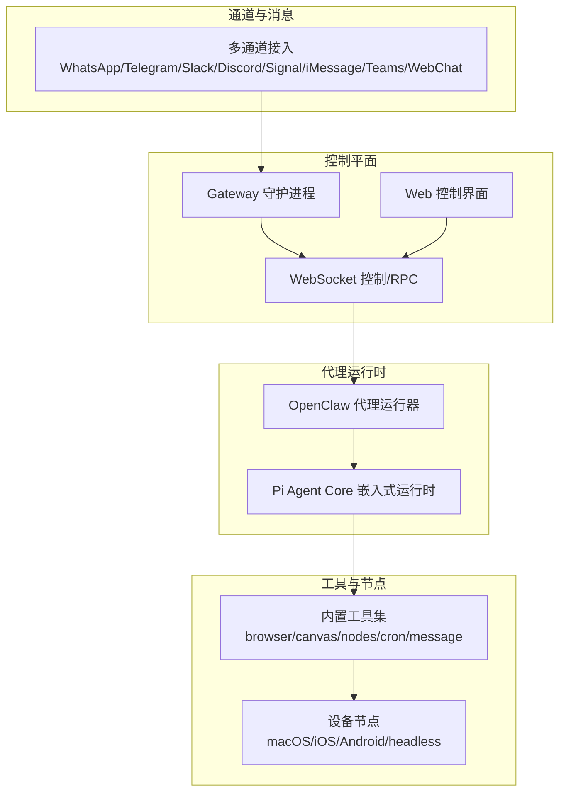
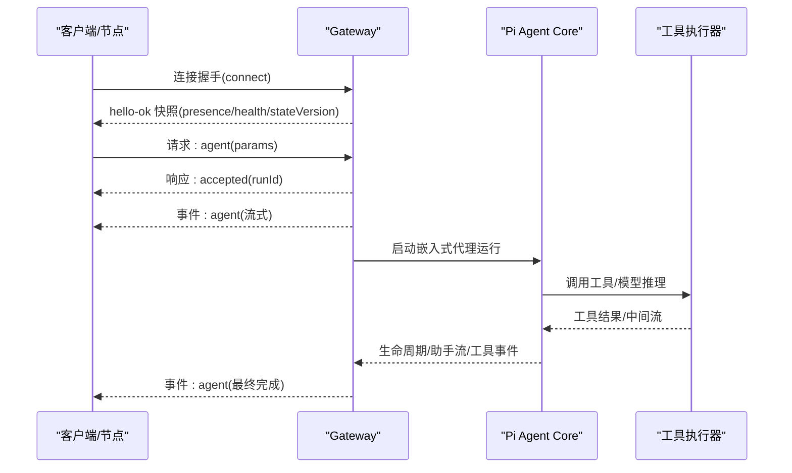
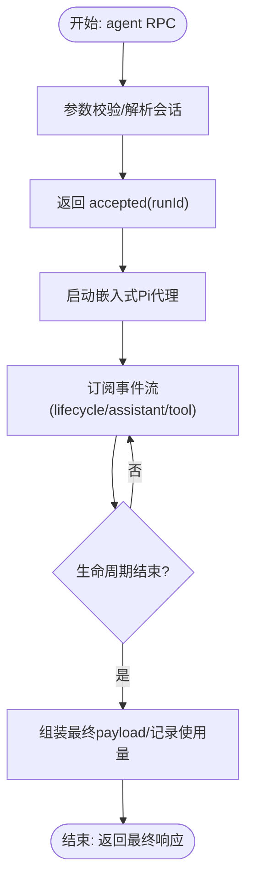
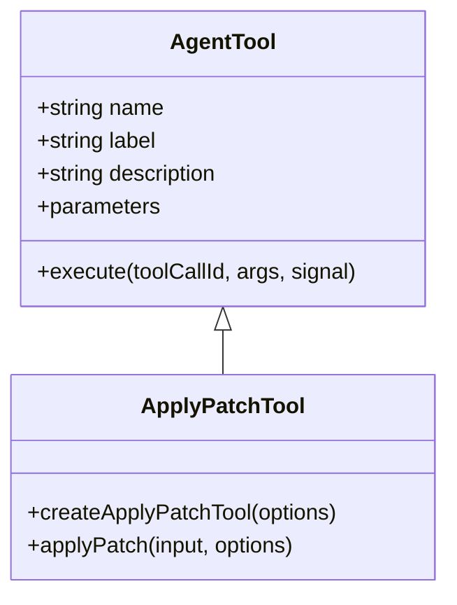
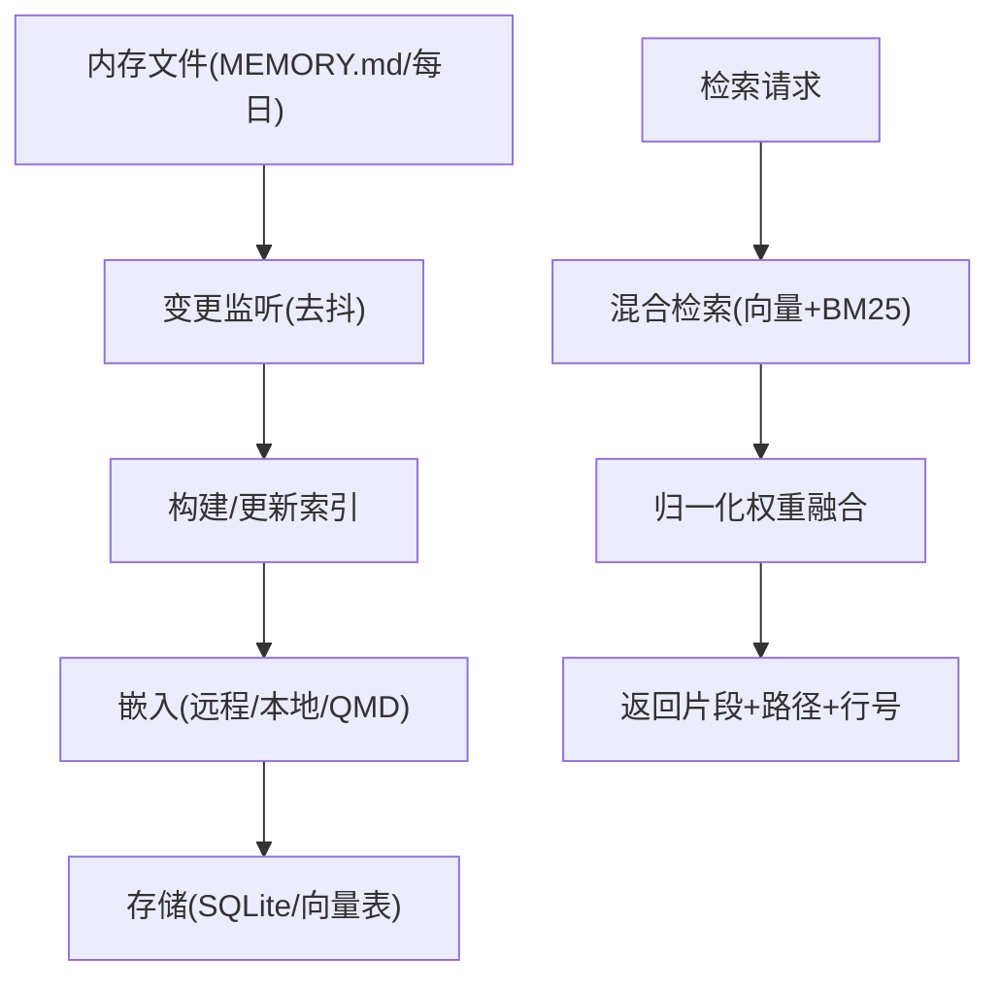
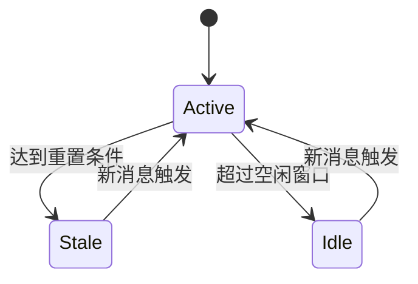
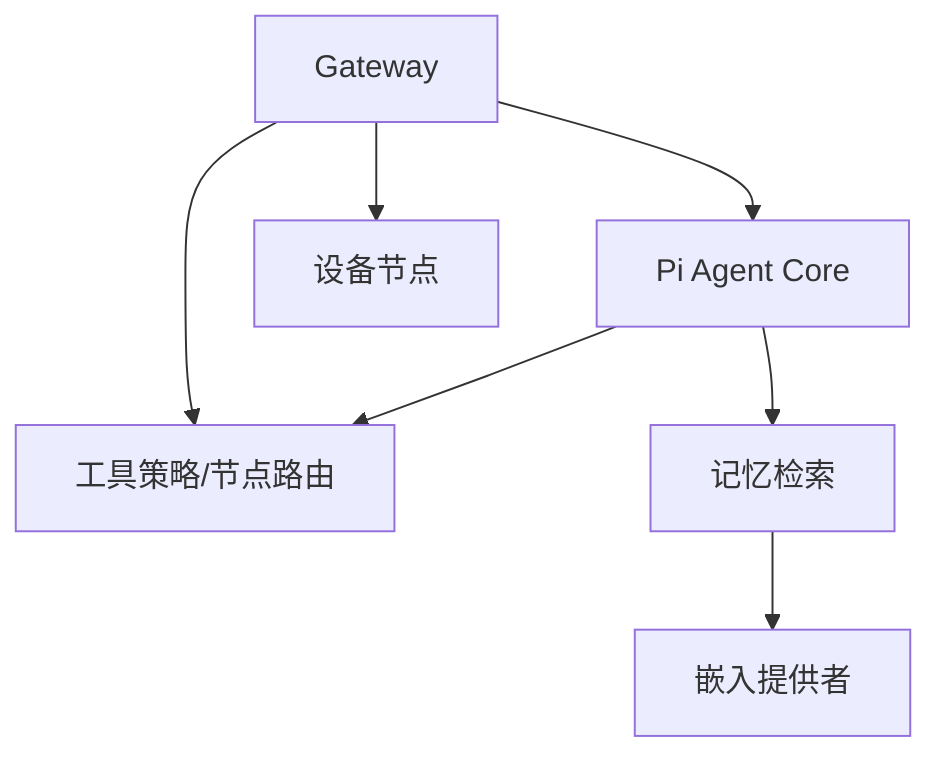

# AI代理架构

<cite>
**本文引用的文件**
- [README.md](file://README.md)
- [architecture.md](file://docs/concepts/architecture.md)
- [agent.md](file://docs/concepts/agent.md)
- [gateway/index.md](file://docs/gateway/index.md)
- [agent-loop.md](file://docs/concepts/agent-loop.md)
- [context.md](file://docs/concepts/context.md)
- [session.md](file://docs/concepts/session.md)
- [memory.md](file://docs/concepts/memory.md)
- [tools/index.md](file://docs/tools/index.md)
- [agent-paths.ts](file://src/agents/agent-paths.ts)
- [agent-scope.ts](file://src/agents/agent-scope.ts)
- [apply-patch.ts](file://src/agents/apply-patch.ts)
</cite>

## 目录

1. [简介](#简介)
2. [项目结构](#项目结构)
3. [核心组件](#核心组件)
4. [架构总览](#架构总览)
5. [详细组件分析](#详细组件分析)
6. [依赖关系分析](#依赖关系分析)
7. [性能考虑](#性能考虑)
8. [故障排查指南](#故障排查指南)
9. [结论](#结论)
10. [附录](#附录)

## 简介

本技术文档面向OpenClaw AI代理架构，聚焦Pi Agent Core集成架构，系统阐述代理生命周期管理、工具执行机制、记忆系统设计，并覆盖代理配置管理、上下文窗口管理、模型选择策略。文档同时给出工具系统与记忆系统的架构设计说明、组件关系图与工作流程图，以及性能优化建议与扩展开发指南。

## 项目结构

OpenClaw采用多语言混合工程（TypeScript/JavaScript、Swift等），核心运行时位于src目录，文档位于docs目录，平台应用与插件位于apps与extensions目录，技能与工具在skills与src/tools中组织。Pi Agent Core通过嵌入式运行时与Gateway协议桥接，形成统一的控制平面与工具执行面。

图表来源

- [architecture.md](file://docs/concepts/architecture.md#L12-L55)
- [agent-loop.md](file://docs/concepts/agent-loop.md#L18-L44)

章节来源

- [README.md](file://README.md#L180-L250)
- [architecture.md](file://docs/concepts/architecture.md#L12-L55)

## 核心组件

- Gateway：单实例控制平面，负责会话、通道、事件、RPC与安全配对；默认绑定127.0.0.1:18789，支持Tailscale/SSH隧道远程访问。
- Pi Agent Core：嵌入式推理与工具调用运行时，由OpenClaw代理运行器驱动，支持流式输出、块级流式与生命周期事件。
- 工具系统：第一类工具（browser/canvas/nodes/cron/message）替代旧版openclaw-\*技能，具备类型化参数、沙箱策略与节点路由能力。
- 记忆系统：基于工作区Markdown文件的纯文本记忆层，支持自动预压缩写入与向量检索；可选QMD后端或内置SQLite+sqlite-vec加速。
- 会话管理：以sessionKey为维度的状态机，支持主键隔离、每日/空闲重置、发送策略与来源元数据记录。

章节来源

- [gateway/index.md](file://docs/gateway/index.md#L62-L117)
- [agent.md](file://docs/concepts/agent.md#L66-L124)
- [tools/index.md](file://docs/tools/index.md#L9-L53)
- [memory.md](file://docs/concepts/memory.md#L17-L78)
- [session.md](file://docs/concepts/session.md#L63-L114)

## 架构总览

OpenClaw采用“单一Gateway + 多客户端/节点”的架构。Operator（mac应用/CLI/Web）与设备节点均通过WebSocket连接到Gateway，Gateway再驱动Pi Agent Core执行推理与工具调用。通道侧消息经Gateway路由至对应会话，会话状态持久化于Gateway主机。

图表来源

- [architecture.md](file://docs/concepts/architecture.md#L56-L75)
- [agent-loop.md](file://docs/concepts/agent-loop.md#L25-L44)

章节来源

- [architecture.md](file://docs/concepts/architecture.md#L12-L55)
- [agent-loop.md](file://docs/concepts/agent-loop.md#L18-L44)

## 详细组件分析

### 代理生命周期管理

- 入口：Gateway RPC（agent/agent.wait）、CLI命令。
- 流程：参数校验→解析会话→持久化元数据→立即返回accepted→运行嵌入式Pi代理→订阅事件→等待生命周期结束→返回最终完成。
- 队列与并发：按会话键串行，必要时通过全局队列串行，避免工具/会话竞态。
- 超时与中断：运行超时与AbortSignal均可提前终止；agent.wait仅等待生命周期事件。
- 插件钩子：before_agent_start、agent_end、before_tool_call、after_tool_call、tool_result_persist等贯穿代理生命周期。

图表来源

- [agent-loop.md](file://docs/concepts/agent-loop.md#L25-L44)
- [agent-loop.md](file://docs/concepts/agent-loop.md#L119-L147)

章节来源

- [agent-loop.md](file://docs/concepts/agent-loop.md#L18-L44)
- [agent-loop.md](file://docs/concepts/agent-loop.md#L65-L94)

### 工具系统架构设计

- 工具注册与暴露：工具以类型化Schema定义注入系统提示，模型据此调用；支持分组（group:\*）与按提供方限制。
- 执行流程：Pi代理生成工具调用→Gateway解析→执行器落地（本地/沙箱/节点）→结果回传→事件流输出。
- 结果处理：大小与图像裁剪、去重确认、NO_REPLY静默处理、重复消息抑制。
- 安全与策略：工具允许/拒绝列表、工具配置文件、节点路由、节点权限与配对。

图表来源

- [apply-patch.ts](file://src/agents/apply-patch.ts#L74-L111)
- [apply-patch.ts](file://src/agents/apply-patch.ts#L113-L174)

章节来源

- [tools/index.md](file://docs/tools/index.md#L15-L53)
- [tools/index.md](file://docs/tools/index.md#L178-L211)
- [apply-patch.ts](file://src/agents/apply-patch.ts#L74-L111)

### 记忆系统实现

- 文件层：工作区Markdown（MEMORY.md、memory/YYYY-MM-DD.md），主私会话加载MEMORY.md，每日日志追加。
- 自动写入：接近压缩阈值时触发静默写入提醒，防止丢失重要记忆。
- 检索：默认启用，支持远程嵌入（OpenAI/Gemini/Voyage）或本地node-llama-cpp；可选QMD后端；SQLite向量加速（sqlite-vec）。
- 混合检索：向量相似度+BM25关键词融合，权重归一化合并，提升自然语言与精确词项召回。
- 会话索引：可选实验性功能，异步增量索引会话转录，按阈值触发后台同步。

图表来源

- [memory.md](file://docs/concepts/memory.md#L364-L423)
- [memory.md](file://docs/concepts/memory.md#L443-L461)
- [memory.md](file://docs/concepts/memory.md#L462-L502)

章节来源

- [memory.md](file://docs/concepts/memory.md#L17-L78)
- [memory.md](file://docs/concepts/memory.md#L347-L363)
- [memory.md](file://docs/concepts/memory.md#L371-L442)

### 代理配置管理与上下文窗口

- 配置来源：全局配置、代理级覆盖、沙箱工作区；环境变量与路径解析。
- 上下文装配：系统提示（规则/工具/技能/时间/运行时元数据）+ 会话历史 + 工具调用/结果 + 附件。
- 上下文检查：/context list/detail查看贡献项与大小；/compact进行压缩摘要；/usage显示令牌用量。
- 模型选择：支持provider/model格式，别名与默认提供者解析；失败回退链路可配置。

图表来源

- [context.md](file://docs/concepts/context.md#L79-L102)
- [context.md](file://docs/concepts/context.md#L103-L131)
- [agent-scope.ts](file://src/agents/agent-scope.ts#L166-L182)
- [agent-paths.ts](file://src/agents/agent-paths.ts#L6-L25)

章节来源

- [context.md](file://docs/concepts/context.md#L22-L31)
- [context.md](file://docs/concepts/context.md#L79-L102)
- [agent-scope.ts](file://src/agents/agent-scope.ts#L166-L182)
- [agent-paths.ts](file://src/agents/agent-paths.ts#L6-L25)

### 会话管理与路由

- 会话键规则：主会话(main)、按用户/通道/账号隔离；群组/频道线程独立键；来源元数据记录。
- 重置策略：每日重置（4:00本地时间）+ 可选空闲重置；支持按类型/通道覆盖。
- 发送策略：基于规则的阻断/允许，运行时可覆盖。
- 存储位置：Gateway主机上agents/<agentId>/sessions/下的sessions.json与JSONL转录。

图表来源

- [session.md](file://docs/concepts/session.md#L103-L114)
- [session.md](file://docs/concepts/session.md#L115-L132)

章节来源

- [session.md](file://docs/concepts/session.md#L85-L114)
- [session.md](file://docs/concepts/session.md#L115-L132)

## 依赖关系分析

- 组件耦合
  - Gateway与Pi Agent Core：通过WebSocket RPC与事件桥接，Gateway持有会话与状态，Pi负责推理与工具调度。
  - 工具系统：与Gateway的工具策略、节点路由、沙箱策略强耦合。
  - 记忆系统：与工作区路径、嵌入提供者、SQLite/向量扩展存在直接依赖。
- 外部依赖
  - 提供商模型与嵌入API（OpenAI/Gemini/Voyage等）
  - 设备节点（macOS/iOS/Android）通过WebSocket与Gateway通信
  - 可选QMD后端与sqlite-vec扩展

图表来源

- [architecture.md](file://docs/concepts/architecture.md#L24-L55)
- [tools/index.md](file://docs/tools/index.md#L166-L177)
- [memory.md](file://docs/concepts/memory.md#L84-L106)

章节来源

- [architecture.md](file://docs/concepts/architecture.md#L24-L55)
- [tools/index.md](file://docs/tools/index.md#L166-L177)
- [memory.md](file://docs/concepts/memory.md#L84-L106)

## 性能考虑

- 上下文窗口优化
  - 使用/compact进行压缩摘要，减少历史长度；/context detail定位大体积贡献项。
  - 控制工具Schema大小（工具列表与JSON模式），避免过度膨胀。
- 工具执行
  - 优先使用Gateway直连工具（如browser/canvas/nodes/cron），减少跨进程开销。
  - 对耗时操作设置合理超时与后台执行，避免阻塞代理循环。
- 记忆检索
  - 启用sqlite-vec加速向量查询；合理设置混合检索权重与候选倍数。
  - 使用嵌入缓存降低重复索引成本；批处理（OpenAI/Gemini）加速大规模索引。
- 并发与队列
  - 保持每会话串行，避免竞态；必要时通过全局队列串行化高风险任务。
- 沙箱与节点
  - 在非主会话启用沙箱，隔离工具执行；节点权限需显式授权，避免阻塞与权限错误。

## 故障排查指南

- 连接与认证
  - 非loopback绑定需配置token/password；SSH隧道需携带认证信息。
  - 连接失败常见原因：端口占用、认证不匹配、无效首帧。
- 代理运行
  - agent.wait超时：检查agents.defaults.timeoutSeconds与工具执行耗时。
  - 工具未生效：核对tools.allow/deny与工具策略；确认节点已配对且在线。
- 记忆检索
  - 嵌入失败：检查API密钥与提供商可用性；切换到本地或备用提供商。
  - QMD不可用：确认二进制与SQLite扩展；回退到内置SQLite管理器。
- 会话状态
  - 会话错乱：检查session.dmScope与identityLinks；确认来源元数据正确。
  - 令牌统计异常：以Gateway store为准，UI需从Gateway查询。

章节来源

- [gateway/index.md](file://docs/gateway/index.md#L228-L238)
- [agent-loop.md](file://docs/concepts/agent-loop.md#L136-L147)
- [memory.md](file://docs/concepts/memory.md#L308-L346)
- [session.md](file://docs/concepts/session.md#L173-L182)

## 结论

OpenClaw通过Gateway统一控制平面与Pi Agent Core嵌入式运行时，实现了跨通道、跨设备的一致代理体验。工具系统与记忆系统以类型化Schema与纯文本文件为核心，兼顾易用性与可扩展性。配合完善的会话管理与上下文窗口策略，可在保证安全性的同时获得良好的性能与可维护性。建议在生产环境中启用沙箱、严格工具策略与远程嵌入回退链路，并结合监控与日志进行持续优化。

## 附录

- 开发与部署
  - 使用pnpm安装与构建；通过openclaw gateway启动守护进程；支持launchd/systemd服务化。
  - 远程访问推荐Tailscale Serve/Funnel或SSH隧道；注意认证与TLS配置。
- 扩展开发
  - 插件与钩子：利用before_agent_start/agent_end等钩子扩展代理行为。
  - 工具扩展：新增AgentTool并纳入工具策略；支持分组与按提供方限制。
  - 记忆后端：可替换QMD或自定义嵌入提供者；关注批处理与缓存策略。

章节来源

- [README.md](file://README.md#L87-L106)
- [gateway/index.md](file://docs/gateway/index.md#L118-L163)
- [agent-loop.md](file://docs/concepts/agent-loop.md#L65-L94)
- [tools/index.md](file://docs/tools/index.md#L166-L177)
- [memory.md](file://docs/concepts/memory.md#L107-L154)
