# 代理核心

<cite>
**本文引用的文件**
- [src/agents/agent-paths.ts](file://src/agents/agent-paths.ts)
- [src/agents/agent-scope.ts](file://src/agents/agent-scope.ts)
- [src/config/agent-limits.ts](file://src/config/agent-limits.ts)
- [src/agents/apply-patch.ts](file://src/agents/apply-patch.ts)
- [src/agents/auth-health.ts](file://src/agents/auth-health.ts)
- [src/gateway/server.agent.gateway-server-agent-b.e2e.test.ts](file://src/gateway/server.agent.gateway-server-agent-b.e2e.test.ts)
- [src/agents/tools/sessions-send-tool.ts](file://src/agents/tools/sessions-send-tool.ts)
- [apps/macos/Sources/OpenClaw/AgentEventStore.swift](file://apps/macos/Sources/OpenClaw/AgentEventStore.swift)
- [apps/macos/Sources/OpenClawProtocol/GatewayModels.swift](file://apps/macos/Sources/OpenClawProtocol/GatewayModels.swift)
- [apps/shared/OpenClawKit/Sources/OpenClawProtocol/GatewayModels.swift](file://apps/shared/OpenClawKit/Sources/OpenClawProtocol/GatewayModels.swift)
- [src/gateway/server-cron.ts](file://src/gateway/server-cron.ts)
- [src/gateway/server-methods/agents.ts](file://src/gateway/server-methods/agents.ts)
- [src/auto-reply/reply/commands-context-report.ts](file://src/auto-reply/reply/commands-context-report.ts)
- [docs/concepts/context.md](file://docs/concepts/context.md)
- [src/tui/tui-session-actions.ts](file://src/tui/tui-session-actions.ts)
- [src/cli/argv.ts](file://src/cli/argv.ts)
- [src/commands/agents.config.ts](file://src/commands/agents.config.ts)
- [src/gateway/session-utils.ts](file://src/gateway/session-utils.ts)
- [extensions/open-prose/skills/prose/state/postgres.md](file://extensions/open-prose/skills/prose/state/postgres.md)
</cite>

## 目录

1. [引言](#引言)
2. [项目结构](#项目结构)
3. [核心组件](#核心组件)
4. [架构总览](#架构总览)
5. [组件详解](#组件详解)
6. [依赖关系分析](#依赖关系分析)
7. [性能考量](#性能考量)
8. [故障排查指南](#故障排查指南)
9. [结论](#结论)
10. [附录](#附录)

## 引言

本文件面向OpenClaw代理核心系统（Pi Agent Core）的技术文档，聚焦于代理的集成架构、生命周期与初始化流程、状态维护机制、上下文窗口与系统提示工程、工作空间配置、代理作用域与并发控制、资源分配策略、配置参数与性能调优、错误处理机制，并通过流程图与状态图展示代理工作流及与网关等组件的交互关系。

## 项目结构

OpenClaw采用多语言混合架构：核心逻辑位于TypeScript（src目录），部分平台层使用Swift（apps目录）。代理核心涉及以下关键子系统：

- 代理作用域与路径解析：负责代理ID解析、默认代理选择、工作空间与代理目录定位
- 并发与资源限制：全局与子代理的最大并发数解析
- 工具与补丁应用：提供文件级补丁应用工具，支持沙箱路径校验
- 认证健康度：对OAuth/API Key等凭证进行健康检查与过期预警
- 网关交互：代理请求、会话发送、定时任务调度、文件清单与统计
- 上下文与系统提示：上下文报告、注入文件与工具/技能规模统计
- TUI与CLI：会话与代理选择、命令迁移策略

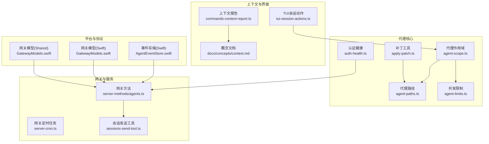

**图表来源**

- [src/agents/agent-scope.ts](file://src/agents/agent-scope.ts#L1-L193)
- [src/agents/agent-paths.ts](file://src/agents/agent-paths.ts#L1-L26)
- [src/config/agent-limits.ts](file://src/config/agent-limits.ts#L1-L21)
- [src/agents/apply-patch.ts](file://src/agents/apply-patch.ts#L1-L504)
- [src/agents/auth-health.ts](file://src/agents/auth-health.ts#L1-L253)
- [src/gateway/server-methods/agents.ts](file://src/gateway/server-methods/agents.ts#L80-L103)
- [src/gateway/server-cron.ts](file://src/gateway/server-cron.ts#L32-L52)
- [src/agents/tools/sessions-send-tool.ts](file://src/agents/tools/sessions-send-tool.ts#L337-L376)
- [src/auto-reply/reply/commands-context-report.ts](file://src/auto-reply/reply/commands-context-report.ts#L185-L228)
- [docs/concepts/context.md](file://docs/concepts/context.md#L36-L77)
- [src/tui/tui-session-actions.ts](file://src/tui/tui-session-actions.ts#L73-L107)
- [apps/macos/Sources/OpenClaw/AgentEventStore.swift](file://apps/macos/Sources/OpenClaw/AgentEventStore.swift#L1-L22)
- [apps/macos/Sources/OpenClawProtocol/GatewayModels.swift](file://apps/macos/Sources/OpenClawProtocol/GatewayModels.swift#L327-L383)
- [apps/shared/OpenClawKit/Sources/OpenClawProtocol/GatewayModels.swift](file://apps/shared/OpenClawKit/Sources/OpenClawProtocol/GatewayModels.swift#L327-L383)

**章节来源**

- [src/agents/agent-scope.ts](file://src/agents/agent-scope.ts#L1-L193)
- [src/agents/agent-paths.ts](file://src/agents/agent-paths.ts#L1-L26)
- [src/config/agent-limits.ts](file://src/config/agent-limits.ts#L1-L21)
- [src/agents/apply-patch.ts](file://src/agents/apply-patch.ts#L1-L504)
- [src/agents/auth-health.ts](file://src/agents/auth-health.ts#L1-L253)
- [src/gateway/server-methods/agents.ts](file://src/gateway/server-methods/agents.ts#L80-L103)
- [src/gateway/server-cron.ts](file://src/gateway/server-cron.ts#L32-L52)
- [src/agents/tools/sessions-send-tool.ts](file://src/agents/tools/sessions-send-tool.ts#L337-L376)
- [src/auto-reply/reply/commands-context-report.ts](file://src/auto-reply/reply/commands-context-report.ts#L185-L228)
- [docs/concepts/context.md](file://docs/concepts/context.md#L36-L77)
- [src/tui/tui-session-actions.ts](file://src/tui/tui-session-actions.ts#L73-L107)
- [apps/macos/Sources/OpenClaw/AgentEventStore.swift](file://apps/macos/Sources/OpenClaw/AgentEventStore.swift#L1-L22)
- [apps/macos/Sources/OpenClawProtocol/GatewayModels.swift](file://apps/macos/Sources/OpenClawProtocol/GatewayModels.swift#L327-L383)
- [apps/shared/OpenClawKit/Sources/OpenClawProtocol/GatewayModels.swift](file://apps/shared/OpenClawKit/Sources/OpenClawProtocol/GatewayModels.swift#L327-L383)

## 核心组件

- 代理作用域与路径解析：提供代理ID解析、默认代理选择、会话到代理映射、工作空间与代理目录解析
- 并发与资源限制：解析全局代理与子代理最大并发数，确保资源合理分配
- 补丁应用工具：解析并应用“apply_patch”格式补丁，支持沙箱路径校验与中止信号
- 认证健康度：对OAuth/API Key等凭证进行健康检查，输出概要与状态
- 网关交互：代理请求、会话发送等待、定时任务调度、工作区文件清单
- 上下文与系统提示：生成上下文报告，统计注入文件、工具与技能规模
- TUI与CLI：会话与代理选择、命令迁移策略

**章节来源**

- [src/agents/agent-scope.ts](file://src/agents/agent-scope.ts#L74-L125)
- [src/config/agent-limits.ts](file://src/config/agent-limits.ts#L6-L20)
- [src/agents/apply-patch.ts](file://src/agents/apply-patch.ts#L74-L111)
- [src/agents/auth-health.ts](file://src/agents/auth-health.ts#L156-L252)
- [src/gateway/server-methods/agents.ts](file://src/gateway/server-methods/agents.ts#L80-L103)
- [src/auto-reply/reply/commands-context-report.ts](file://src/auto-reply/reply/commands-context-report.ts#L185-L228)
- [src/tui/tui-session-actions.ts](file://src/tui/tui-session-actions.ts#L73-L107)

## 架构总览

代理核心围绕“作用域解析—路径与工作空间—并发限制—工具与认证—网关交互—上下文与报告”的主干流程展开。平台侧（macOS Swift）提供事件存储与网关模型，用于前端与协议一致性。

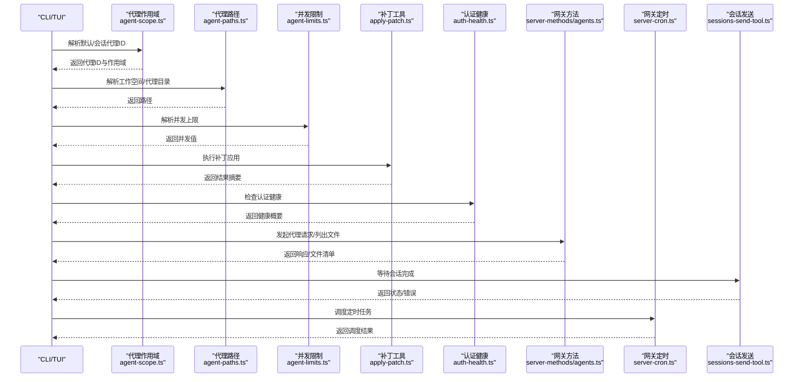

**图表来源**

- [src/agents/agent-scope.ts](file://src/agents/agent-scope.ts#L74-L125)
- [src/agents/agent-paths.ts](file://src/agents/agent-paths.ts#L6-L25)
- [src/config/agent-limits.ts](file://src/config/agent-limits.ts#L6-L20)
- [src/agents/apply-patch.ts](file://src/agents/apply-patch.ts#L113-L174)
- [src/agents/auth-health.ts](file://src/agents/auth-health.ts#L156-L252)
- [src/gateway/server-methods/agents.ts](file://src/gateway/server-methods/agents.ts#L80-L103)
- [src/agents/tools/sessions-send-tool.ts](file://src/agents/tools/sessions-send-tool.ts#L337-L376)
- [src/gateway/server-cron.ts](file://src/gateway/server-cron.ts#L32-L52)

## 组件详解

### 代理作用域与路径解析

- 作用域解析：支持从会话键解析代理ID，若未指定则回退到默认代理；默认代理由配置中首个或标记为default的条目决定
- 路径解析：优先使用配置中的workspace/agentDir，否则回退到状态目录下的默认位置；同时提供环境变量覆盖
- 工作空间与代理目录：根据代理ID与默认策略生成工作空间与代理目录，便于隔离与持久化

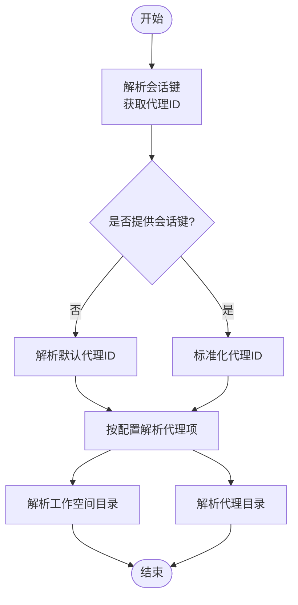

**图表来源**

- [src/agents/agent-scope.ts](file://src/agents/agent-scope.ts#L74-L125)
- [src/agents/agent-paths.ts](file://src/agents/agent-paths.ts#L6-L25)

**章节来源**

- [src/agents/agent-scope.ts](file://src/agents/agent-scope.ts#L74-L125)
- [src/agents/agent-paths.ts](file://src/agents/agent-paths.ts#L6-L25)

### 并发控制与资源分配

- 全局代理最大并发：从配置agents.defaults.maxConcurrent解析，若无效则使用默认值
- 子代理最大并发：从agents.defaults.subagents.maxConcurrent解析，同样有默认值与最小约束
- 作用：避免资源争用，保障代理与子代理在运行时的吞吐与稳定性

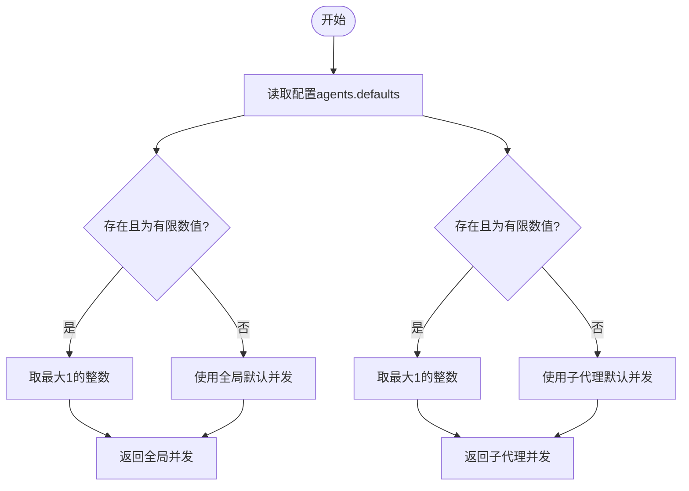

**图表来源**

- [src/config/agent-limits.ts](file://src/config/agent-limits.ts#L6-L20)

**章节来源**

- [src/config/agent-limits.ts](file://src/config/agent-limits.ts#L1-L21)

### 补丁应用工具（apply_patch）

- 功能：解析“Begin Patch/End Patch”格式补丁，支持新增、删除、更新文件，以及文件移动
- 安全：在沙箱模式下对目标路径进行校验，防止越权写入
- 中止：支持AbortSignal，允许外部取消执行
- 输出：汇总添加/修改/删除的文件列表，并格式化为可读文本

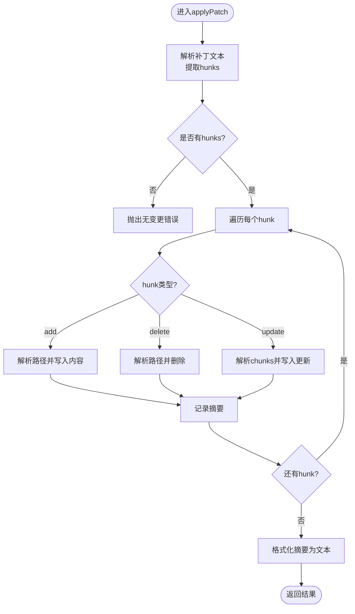

**图表来源**

- [src/agents/apply-patch.ts](file://src/agents/apply-patch.ts#L113-L174)
- [src/agents/apply-patch.ts](file://src/agents/apply-patch.ts#L215-L236)

**章节来源**

- [src/agents/apply-patch.ts](file://src/agents/apply-patch.ts#L1-L504)

### 认证健康度

- 支持三种凭证类型：api_key（静态）、token（带过期时间）、oauth（带刷新）
- 健康状态：ok/expiring/expired/missing/static
- 输出：按提供者聚合，计算剩余时间与整体状态，便于告警与运维

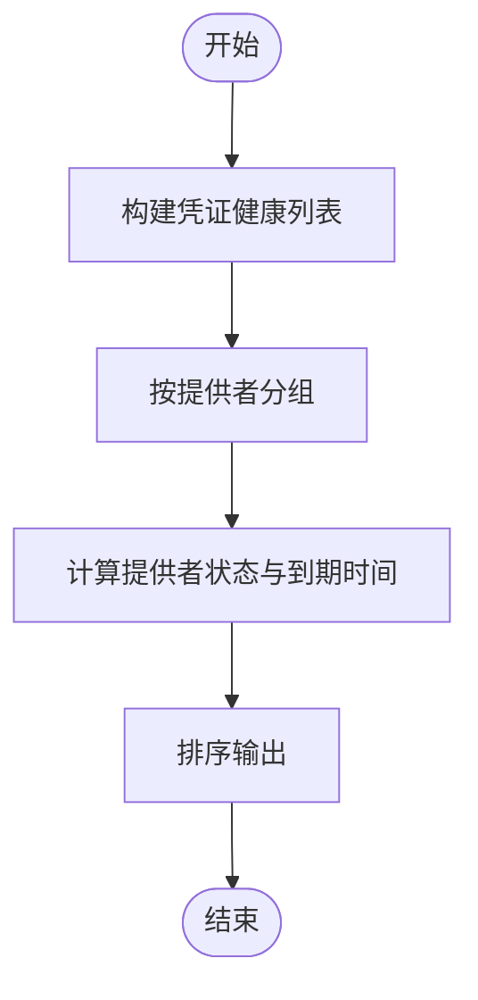

**图表来源**

- [src/agents/auth-health.ts](file://src/agents/auth-health.ts#L156-L252)

**章节来源**

- [src/agents/auth-health.ts](file://src/agents/auth-health.ts#L1-L253)

### 网关交互与会话发送

- 代理请求与确认：客户端发起agent请求，网关先返回accepted确认，随后返回最终结果，支持幂等键去重
- 会话发送等待：调用agent.wait等待完成，区分timeout/error/ok并返回对应状态
- 文件清单：列举工作区关键文件是否存在、大小与更新时间，辅助诊断

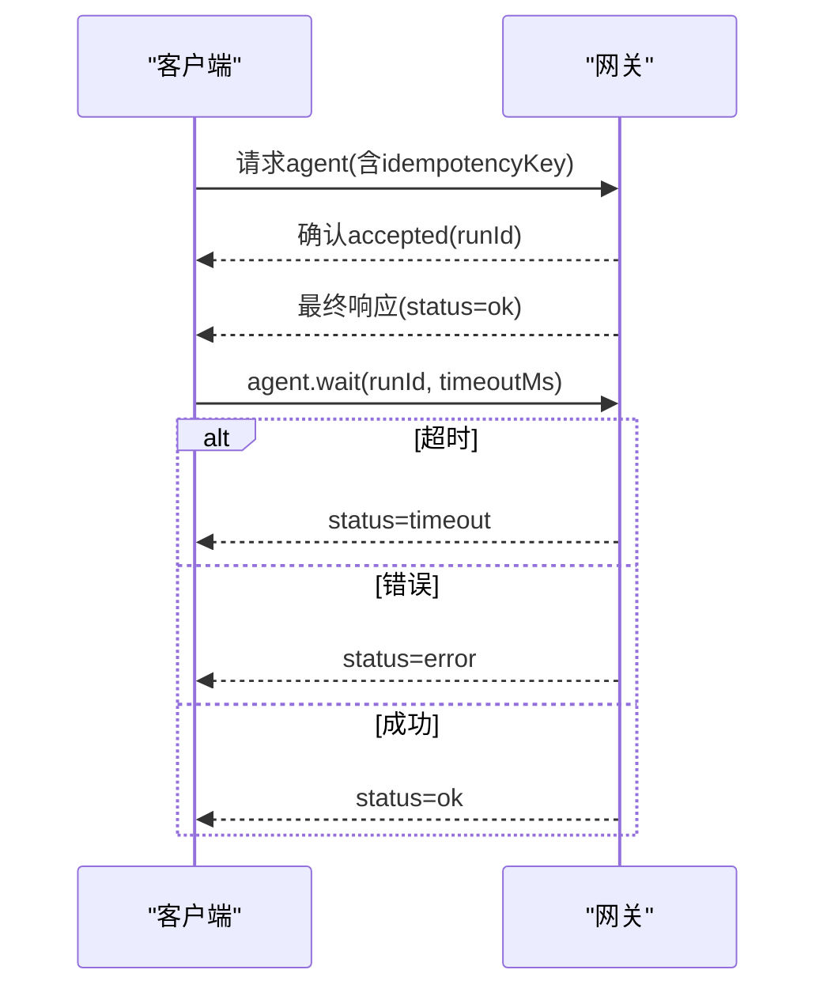

**图表来源**

- [src/gateway/server.agent.gateway-server-agent-b.e2e.test.ts](file://src/gateway/server.agent.gateway-server-agent-b.e2e.test.ts#L295-L333)
- [src/agents/tools/sessions-send-tool.ts](file://src/agents/tools/sessions-send-tool.ts#L337-L376)

**章节来源**

- [src/gateway/server.agent.gateway-server-agent-b.e2e.test.ts](file://src/gateway/server.agent.gateway-server-agent-b.e2e.test.ts#L295-L333)
- [src/agents/tools/sessions-send-tool.ts](file://src/agents/tools/sessions-send-tool.ts#L337-L376)
- [src/gateway/server-methods/agents.ts](file://src/gateway/server-methods/agents.ts#L80-L103)

### 上下文窗口与系统提示工程

- 上下文报告：支持list/detail/json三种模式，统计注入文件、工具schema与技能规模
- 文档参考：概念文档给出上下文分解示例，包括文件状态、令牌估算与工具/技能统计

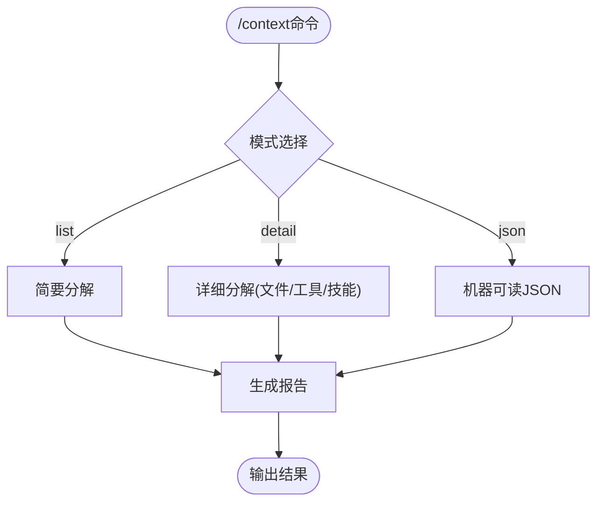

**图表来源**

- [src/auto-reply/reply/commands-context-report.ts](file://src/auto-reply/reply/commands-context-report.ts#L185-L228)
- [docs/concepts/context.md](file://docs/concepts/context.md#L36-L77)

**章节来源**

- [src/auto-reply/reply/commands-context-report.ts](file://src/auto-reply/reply/commands-context-report.ts#L185-L228)
- [docs/concepts/context.md](file://docs/concepts/context.md#L36-L77)

### 工作空间配置与作用域管理

- 代理配置应用：支持为代理设置name/workspace/agentDir/model等字段，并自动维护agents.list
- 作用域解析：会话键可携带代理ID，未提供时回退到默认代理；TUI中加载代理列表并选择当前会话代理
- 项目/用户作用域：扩展文档说明了项目级与用户级代理的持久化策略与清理建议

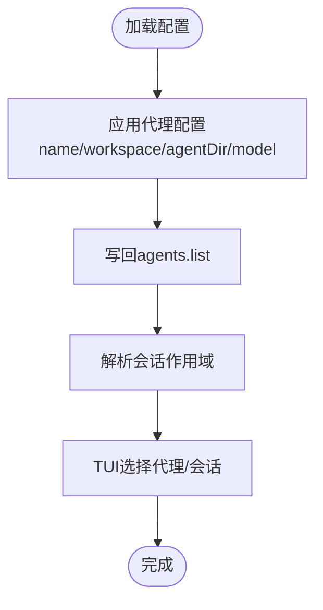

**图表来源**

- [src/commands/agents.config.ts](file://src/commands/agents.config.ts#L132-L183)
- [src/gateway/session-utils.ts](file://src/gateway/session-utils.ts#L314-L334)
- [src/tui/tui-session-actions.ts](file://src/tui/tui-session-actions.ts#L73-L107)
- [extensions/open-prose/skills/prose/state/postgres.md](file://extensions/open-prose/skills/prose/state/postgres.md#L709-L747)

**章节来源**

- [src/commands/agents.config.ts](file://src/commands/agents.config.ts#L132-L183)
- [src/gateway/session-utils.ts](file://src/gateway/session-utils.ts#L314-L334)
- [src/tui/tui-session-actions.ts](file://src/tui/tui-session-actions.ts#L73-L107)
- [extensions/open-prose/skills/prose/state/postgres.md](file://extensions/open-prose/skills/prose/state/postgres.md#L709-L747)

### 平台事件与协议模型

- 事件存储：macOS端提供可观测事件存储，限制历史事件数量，支持追加与清空
- 协议模型：定义错误形状与代理事件结构，统一前后端数据契约

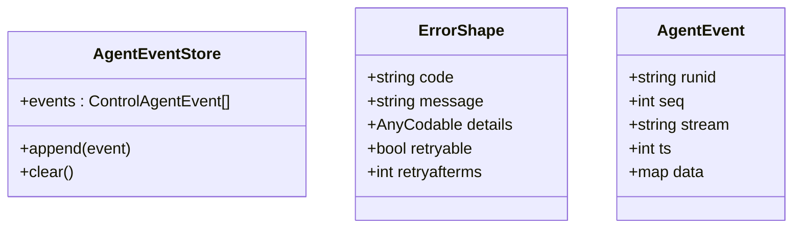

**图表来源**

- [apps/macos/Sources/OpenClaw/AgentEventStore.swift](file://apps/macos/Sources/OpenClaw/AgentEventStore.swift#L1-L22)
- [apps/macos/Sources/OpenClawProtocol/GatewayModels.swift](file://apps/macos/Sources/OpenClawProtocol/GatewayModels.swift#L327-L383)
- [apps/shared/OpenClawKit/Sources/OpenClawProtocol/GatewayModels.swift](file://apps/shared/OpenClawKit/Sources/OpenClawProtocol/GatewayModels.swift#L327-L383)

**章节来源**

- [apps/macos/Sources/OpenClaw/AgentEventStore.swift](file://apps/macos/Sources/OpenClaw/AgentEventStore.swift#L1-L22)
- [apps/macos/Sources/OpenClawProtocol/GatewayModels.swift](file://apps/macos/Sources/OpenClawProtocol/GatewayModels.swift#L327-L383)
- [apps/shared/OpenClawKit/Sources/OpenClawProtocol/GatewayModels.swift](file://apps/shared/OpenClawKit/Sources/OpenClawProtocol/GatewayModels.swift#L327-L383)

## 依赖关系分析

- 低耦合高内聚：作用域解析与路径解析相互独立，仅共享默认代理ID与会话键解析
- 外部依赖：网关方法依赖文件系统与会话存储；补丁工具依赖沙箱路径校验；认证健康依赖凭证存储
- 并发控制：通过全局与子代理并发上限解耦不同层级的资源竞争

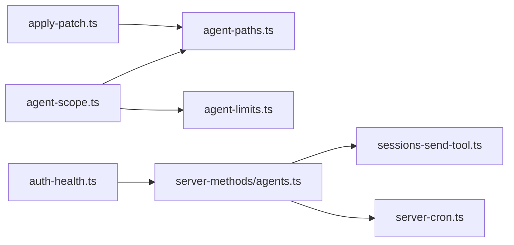

**图表来源**

- [src/agents/agent-scope.ts](file://src/agents/agent-scope.ts#L1-L193)
- [src/agents/agent-paths.ts](file://src/agents/agent-paths.ts#L1-L26)
- [src/config/agent-limits.ts](file://src/config/agent-limits.ts#L1-L21)
- [src/agents/apply-patch.ts](file://src/agents/apply-patch.ts#L1-L504)
- [src/agents/auth-health.ts](file://src/agents/auth-health.ts#L1-L253)
- [src/gateway/server-methods/agents.ts](file://src/gateway/server-methods/agents.ts#L80-L103)
- [src/agents/tools/sessions-send-tool.ts](file://src/agents/tools/sessions-send-tool.ts#L337-L376)
- [src/gateway/server-cron.ts](file://src/gateway/server-cron.ts#L32-L52)

**章节来源**

- [src/agents/agent-scope.ts](file://src/agents/agent-scope.ts#L1-L193)
- [src/agents/agent-paths.ts](file://src/agents/agent-paths.ts#L1-L26)
- [src/config/agent-limits.ts](file://src/config/agent-limits.ts#L1-L21)
- [src/agents/apply-patch.ts](file://src/agents/apply-patch.ts#L1-L504)
- [src/agents/auth-health.ts](file://src/agents/auth-health.ts#L1-L253)
- [src/gateway/server-methods/agents.ts](file://src/gateway/server-methods/agents.ts#L80-L103)
- [src/agents/tools/sessions-send-tool.ts](file://src/agents/tools/sessions-send-tool.ts#L337-L376)
- [src/gateway/server-cron.ts](file://src/gateway/server-cron.ts#L32-L52)

## 性能考量

- 并发上限：合理设置agents.defaults.maxConcurrent与subagents.maxConcurrent，避免CPU/IO瓶颈
- 资源隔离：通过工作空间与代理目录隔离，减少锁争用与I/O冲突
- 补丁应用：在沙箱模式下执行补丁，避免越权写入带来的失败重试成本
- 认证健康：定期检查凭证健康，提前发现过期风险，降低API调用失败率
- 上下文控制：通过上下文报告监控注入文件与工具规模，避免上下文溢出导致的延迟与失败

[本节为通用指导，不直接分析具体文件]

## 故障排查指南

- 代理请求无最终响应：检查网关是否返回accepted后才等待agent.wait，区分timeout与error
- 会话发送失败：关注sessions-send-tool返回的状态码与错误信息，结合网关日志定位
- 认证问题：使用auth-health概要查看provider/status/expiresAt，及时续期或更换凭证
- 上下文过大：通过/context detail查看注入文件与工具schema规模，必要时裁剪或禁用部分技能/工具
- 命令迁移：CLI迁移策略应避开agent相关命令，避免状态迁移冲突

**章节来源**

- [src/gateway/server.agent.gateway-server-agent-b.e2e.test.ts](file://src/gateway/server.agent.gateway-server-agent-b.e2e.test.ts#L295-L333)
- [src/agents/tools/sessions-send-tool.ts](file://src/agents/tools/sessions-send-tool.ts#L337-L376)
- [src/agents/auth-health.ts](file://src/agents/auth-health.ts#L156-L252)
- [src/auto-reply/reply/commands-context-report.ts](file://src/auto-reply/reply/commands-context-report.ts#L185-L228)
- [src/cli/argv.ts](file://src/cli/argv.ts#L150-L169)

## 结论

OpenClaw代理核心通过清晰的作用域与路径解析、严格的并发控制、安全的工具执行与认证健康检查，以及完善的网关交互与上下文工程，实现了稳定、可扩展、可运维的代理体系。配合平台侧事件与协议模型，进一步增强了可观测性与一致性。建议在生产环境中结合上下文报告与认证健康检查，持续优化并发与资源分配策略。

[本节为总结性内容，不直接分析具体文件]

## 附录

- 代理配置参数要点
  - agents.defaults.maxConcurrent：全局代理最大并发
  - agents.defaults.subagents.maxConcurrent：子代理最大并发
  - agents.defaults.workspace：默认工作空间
  - agents.list[].id/name/workspace/agentDir/model/skills/tools等
- 性能调优建议
  - 根据硬件能力调整并发上限
  - 控制上下文规模，避免过度注入
  - 使用沙箱执行高风险操作
  - 定期检查认证健康，避免过期导致的重试风暴
- 错误处理机制
  - 网关返回状态细分（accepted/ok/error/timeout）
  - 补丁工具支持AbortSignal与边界条件校验
  - 认证健康提供静态/过期/将过期等状态提示

[本节为概览性内容，不直接分析具体文件]
