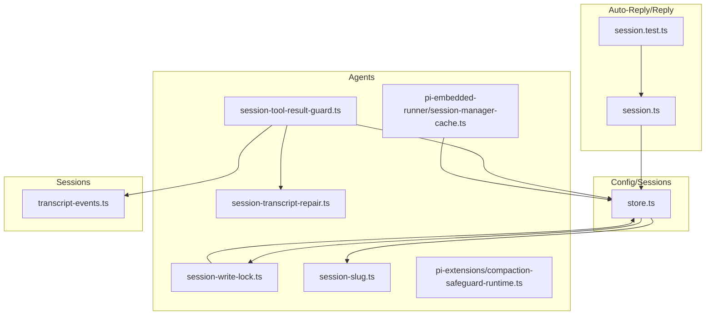
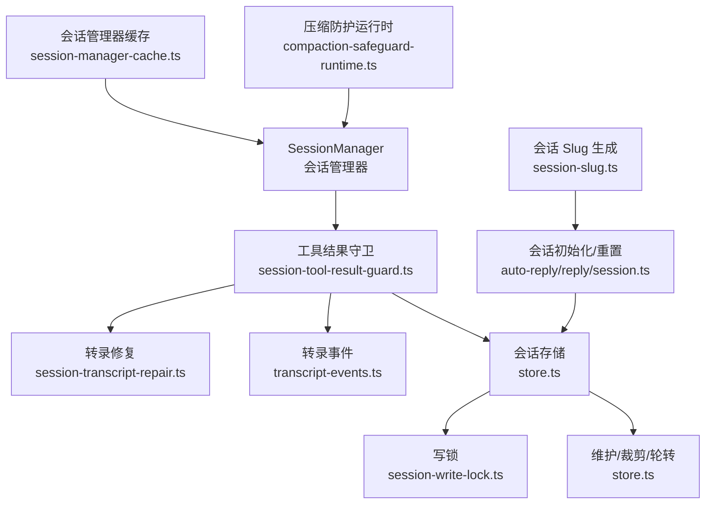
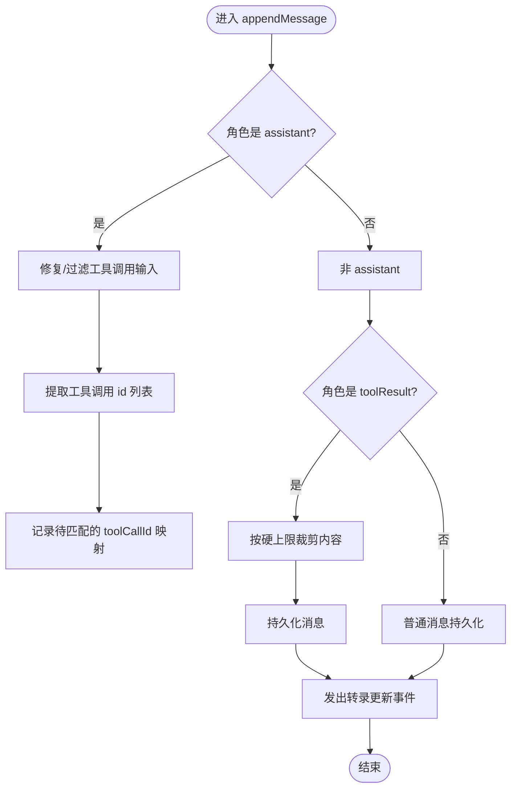
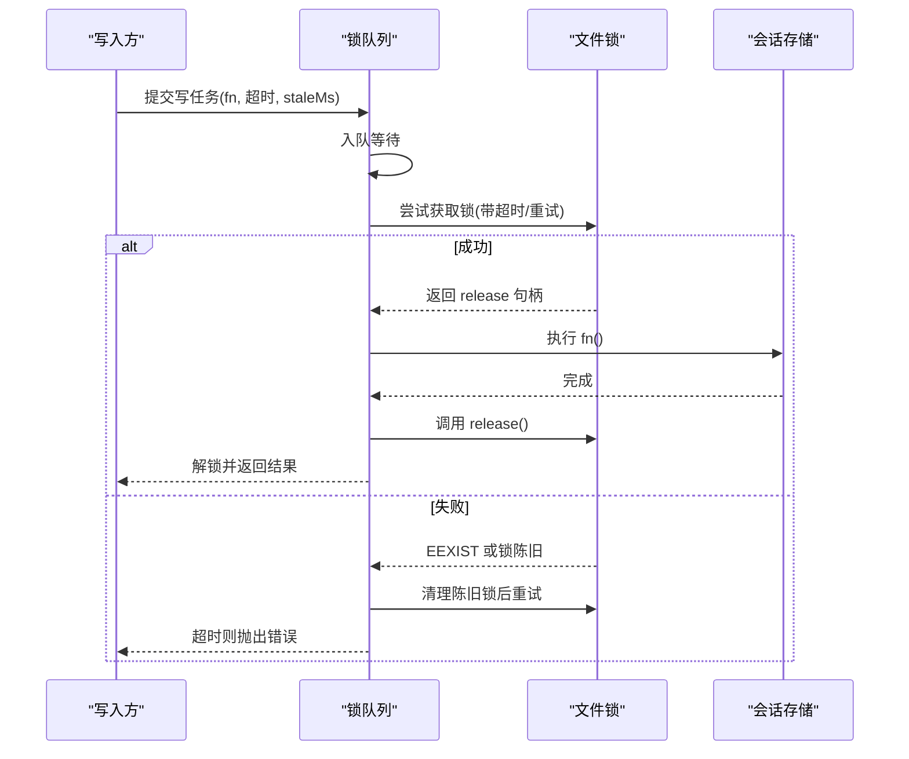
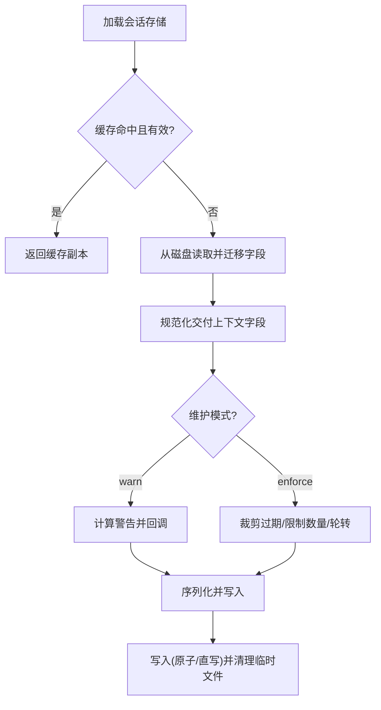
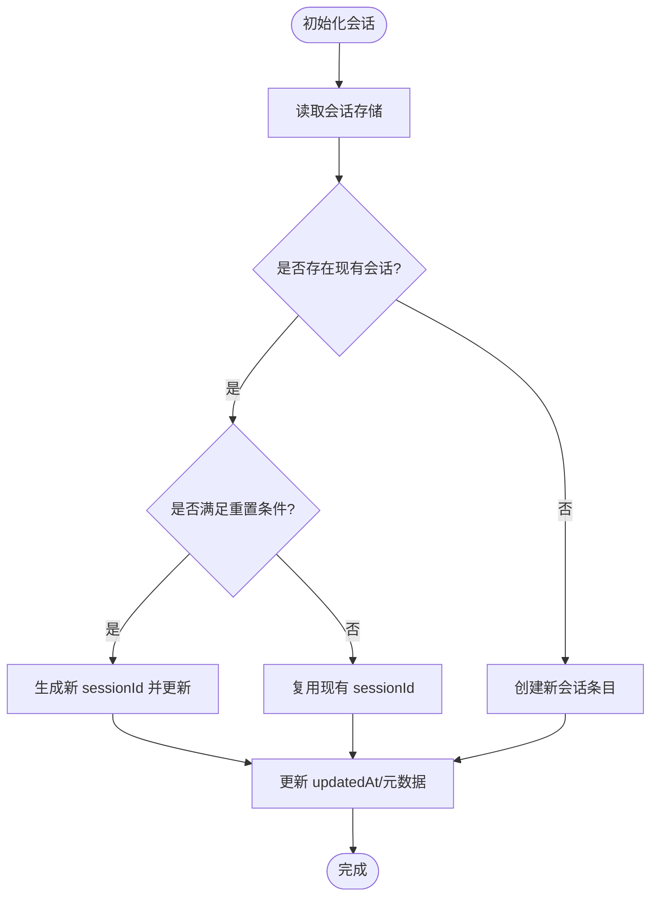
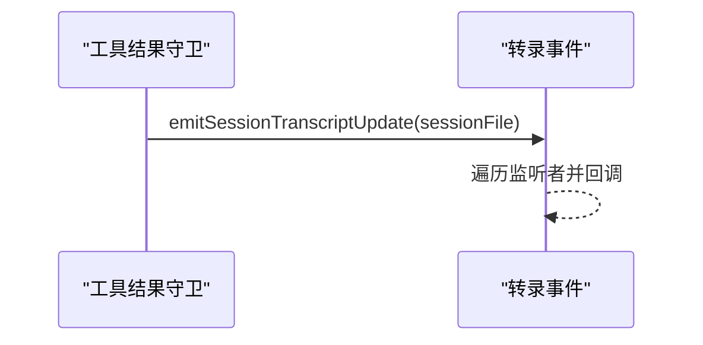
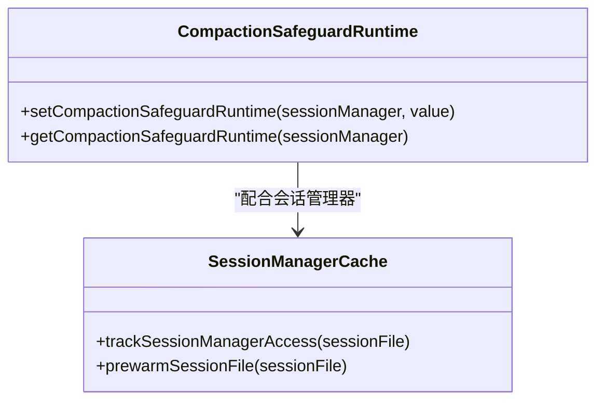
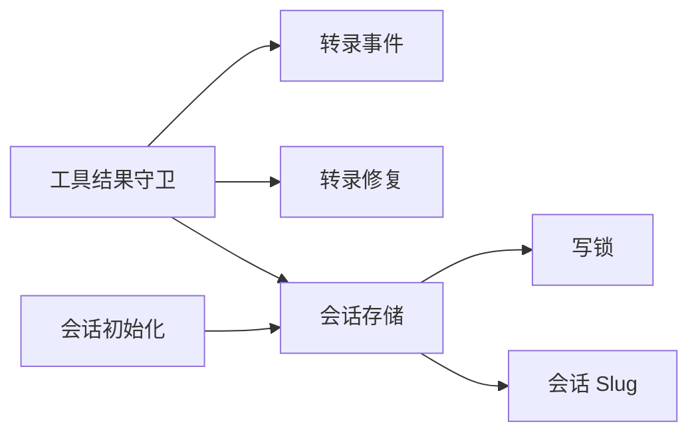

# 会话管理

<cite>
**本文引用的文件**
- [src/agents/session-tool-result-guard.ts](file://src/agents/session-tool-result-guard.ts)
- [src/agents/session-write-lock.ts](file://src/agents/session-write-lock.ts)
- [src/agents/session-slug.ts](file://src/agents/session-slug.ts)
- [src/agents/pi-embedded-runner/session-manager-cache.ts](file://src/agents/pi-embedded-runner/session-manager-cache.ts)
- [src/config/sessions/store.ts](file://src/config/sessions/store.ts)
- [src/sessions/transcript-events.ts](file://src/sessions/transcript-events.ts)
- [src/agents/session-transcript-repair.ts](file://src/agents/session-transcript-repair.ts)
- [src/agents/pi-extensions/compaction-safeguard-runtime.ts](file://src/agents/pi-extensions/compaction-safeguard-runtime.ts)
- [src/auto-reply/reply/session.ts](file://src/auto-reply/reply/session.ts)
- [src/auto-reply/reply/session.test.ts](file://src/auto-reply/reply/session.test.ts)
- [src/config/sessions/store.lock.test.ts](file://src/config/sessions/store.lock.test.ts)
- [src/config/sessions/store.pruning.test.ts](file://src/config/sessions/store.pruning.test.ts)
</cite>

## 目录

1. [简介](#简介)
2. [项目结构](#项目结构)
3. [核心组件](#核心组件)
4. [架构总览](#架构总览)
5. [详细组件分析](#详细组件分析)
6. [依赖关系分析](#依赖关系分析)
7. [性能考量](#性能考量)
8. [故障排查指南](#故障排查指南)
9. [结论](#结论)
10. [附录](#附录)

## 简介

本文件系统性梳理 OpenClaw 会话管理系统的关键机制：会话生命周期管理（初始化、重置、每日边界）、上下文窗口保护（工具结果守卫、转录修复）、会话标识符生成（会话 slug）、会话文件修复（转录配对与输入修复）、线程 ID 管理（交付上下文规范化）、会话转录事件通知、写锁与并发控制（Promise 链式互斥锁队列）、会话压缩与历史清理（裁剪、轮转、维护模式）、状态持久化与缓存、配置项与运行时参数、性能监控与故障恢复策略，并提供状态图与数据流图以帮助理解。

## 项目结构

围绕会话管理的相关模块主要分布在以下路径：

- agents：会话工具结果守卫、写锁、会话 slug、会话转录修复、会话管理器缓存、压缩防护运行时注册表
- config/sessions：会话存储的加载、保存、维护（裁剪、轮转、警告/强制模式）、并发锁队列
- sessions：会话转录事件发布/订阅
- auto-reply/reply：会话初始化与重置逻辑（含每日边界、线程场景）
- ui/views：会话列表渲染（用于前端展示）

**图表来源**

- [src/agents/session-tool-result-guard.ts](file://src/agents/session-tool-result-guard.ts#L1-L249)
- [src/agents/session-write-lock.ts](file://src/agents/session-write-lock.ts#L1-L209)
- [src/agents/session-slug.ts](file://src/agents/session-slug.ts#L1-L144)
- [src/agents/session-transcript-repair.ts](file://src/agents/session-transcript-repair.ts#L1-L319)
- [src/agents/pi-embedded-runner/session-manager-cache.ts](file://src/agents/pi-embedded-runner/session-manager-cache.ts#L1-L69)
- [src/config/sessions/store.ts](file://src/config/sessions/store.ts#L1-L800)
- [src/sessions/transcript-events.ts](file://src/sessions/transcript-events.ts#L1-L26)
- [src/auto-reply/reply/session.ts](file://src/auto-reply/reply/session.ts#L37-L54)
- [src/auto-reply/reply/session.test.ts](file://src/auto-reply/reply/session.test.ts#L210-L252)

**章节来源**

- [src/config/sessions/store.ts](file://src/config/sessions/store.ts#L1-L800)
- [src/agents/session-tool-result-guard.ts](file://src/agents/session-tool-result-guard.ts#L1-L249)
- [src/agents/session-write-lock.ts](file://src/agents/session-write-lock.ts#L1-L209)
- [src/agents/session-slug.ts](file://src/agents/session-slug.ts#L1-L144)
- [src/agents/session-transcript-repair.ts](file://src/agents/session-transcript-repair.ts#L1-L319)
- [src/agents/pi-embedded-runner/session-manager-cache.ts](file://src/agents/pi-embedded-runner/session-manager-cache.ts#L1-L69)
- [src/sessions/transcript-events.ts](file://src/sessions/transcript-events.ts#L1-L26)
- [src/auto-reply/reply/session.ts](file://src/auto-reply/reply/session.ts#L37-L54)
- [src/auto-reply/reply/session.test.ts](file://src/auto-reply/reply/session.test.ts#L210-L252)

## 核心组件

- 工具结果守卫：拦截并规范化工具调用与结果消息，限制大小、合成缺失结果、触发转录更新事件
- 写锁与并发控制：基于文件锁的互斥与队列化执行，保障会话存储写入一致性
- 会话存储与维护：加载/保存/裁剪/轮转/警告/强制模式，支持缓存与 TTL
- 会话转录修复：修复工具调用输入缺失、严格配对（assistant-toolResult）与去重
- 会话标识符生成：可读 slug 生成，避免冲突
- 会话转录事件：监听会话文件变更，驱动 UI 或下游处理
- 会话初始化与重置：按配置进行每日边界、线程场景、超时重置
- 压缩防护运行时：按会话隔离的上下文窗口安全阈值注册表

**章节来源**

- [src/agents/session-tool-result-guard.ts](file://src/agents/session-tool-result-guard.ts#L113-L249)
- [src/agents/session-write-lock.ts](file://src/agents/session-write-lock.ts#L112-L202)
- [src/config/sessions/store.ts](file://src/config/sessions/store.ts#L580-L753)
- [src/agents/session-transcript-repair.ts](file://src/agents/session-transcript-repair.ts#L100-L319)
- [src/agents/session-slug.ts](file://src/agents/session-slug.ts#L115-L144)
- [src/sessions/transcript-events.ts](file://src/sessions/transcript-events.ts#L16-L25)
- [src/auto-reply/reply/session.ts](file://src/auto-reply/reply/session.ts#L37-L54)
- [src/agents/pi-extensions/compaction-safeguard-runtime.ts](file://src/agents/pi-extensions/compaction-safeguard-runtime.ts#L1-L35)

## 架构总览

下图展示了会话管理在系统中的交互关系：会话管理器通过工具结果守卫写入转录；守卫触发转录事件；并发写入由会话存储锁队列串行化；存储层负责维护（裁剪、轮转、警告/强制模式）与持久化；初始化阶段根据配置决定是否重置或新建会话。

**图表来源**

- [src/agents/session-tool-result-guard.ts](file://src/agents/session-tool-result-guard.ts#L113-L249)
- [src/agents/session-transcript-repair.ts](file://src/agents/session-transcript-repair.ts#L1-L319)
- [src/sessions/transcript-events.ts](file://src/sessions/transcript-events.ts#L1-L26)
- [src/config/sessions/store.ts](file://src/config/sessions/store.ts#L580-L753)
- [src/agents/session-write-lock.ts](file://src/agents/session-write-lock.ts#L112-L202)
- [src/auto-reply/reply/session.ts](file://src/auto-reply/reply/session.ts#L37-L54)
- [src/agents/session-slug.ts](file://src/agents/session-slug.ts#L115-L144)
- [src/agents/pi-embedded-runner/session-manager-cache.ts](file://src/agents/pi-embedded-runner/session-manager-cache.ts#L1-L69)
- [src/agents/pi-extensions/compaction-safeguard-runtime.ts](file://src/agents/pi-extensions/compaction-safeguard-runtime.ts#L1-L35)

## 详细组件分析

### 组件A：工具结果守卫与转录修复

- 功能要点
  - 拦截 appendMessage，提取 assistant 的工具调用 id，跟踪待匹配的 toolResult
  - 对 toolResult 进行大小上限裁剪，避免占用过多上下文
  - 合成缺失的 toolResult（可配置），保证严格模型的配对要求
  - 触发转录更新事件，供 UI 或下游监听
  - 转录修复：丢弃无输入的工具调用块、移动/插入/去重 toolResult，确保严格配对
- 关键流程

**图表来源**

- [src/agents/session-tool-result-guard.ts](file://src/agents/session-tool-result-guard.ts#L174-L239)
- [src/agents/session-transcript-repair.ts](file://src/agents/session-transcript-repair.ts#L100-L148)
- [src/sessions/transcript-events.ts](file://src/sessions/transcript-events.ts#L16-L25)

**章节来源**

- [src/agents/session-tool-result-guard.ts](file://src/agents/session-tool-result-guard.ts#L113-L249)
- [src/agents/session-transcript-repair.ts](file://src/agents/session-transcript-repair.ts#L100-L319)
- [src/sessions/transcript-events.ts](file://src/sessions/transcript-events.ts#L1-L26)

### 组件B：写锁与并发控制（Promise 链式互斥）

- 功能要点
  - 使用文件锁实现跨进程互斥；重复获取时递增计数
  - 支持超时与“陈旧”锁清理（基于 pid 与创建时间）
  - 将并发写操作排队，使用 Promise 队列串行执行，避免竞态
  - 进程退出/信号时同步释放所有锁
- 关键流程

**图表来源**

- [src/agents/session-write-lock.ts](file://src/agents/session-write-lock.ts#L112-L202)
- [src/config/sessions/store.ts](file://src/config/sessions/store.ts#L712-L753)
- [src/config/sessions/store.lock.test.ts](file://src/config/sessions/store.lock.test.ts#L1-L275)

**章节来源**

- [src/agents/session-write-lock.ts](file://src/agents/session-write-lock.ts#L1-L209)
- [src/config/sessions/store.ts](file://src/config/sessions/store.ts#L649-L753)
- [src/config/sessions/store.lock.test.ts](file://src/config/sessions/store.lock.test.ts#L1-L275)

### 组件C：会话存储与维护（裁剪、轮转、警告/强制）

- 功能要点
  - 加载：支持 TTL 缓存、mtime 校验、迁移字段兼容
  - 维护：按配置裁剪过期条目、限制总数、超过阈值时轮转文件
  - 模式：warn（仅警告不强制）、enforce（强制裁剪/轮转）
  - 保存：Windows 直写，其他平台临时文件+原子重命名，设置权限
- 关键流程

**图表来源**

- [src/config/sessions/store.ts](file://src/config/sessions/store.ts#L147-L213)
- [src/config/sessions/store.ts](file://src/config/sessions/store.ts#L476-L578)
- [src/config/sessions/store.ts](file://src/config/sessions/store.ts#L281-L294)
- [src/config/sessions/store.ts](file://src/config/sessions/store.ts#L413-L465)

**章节来源**

- [src/config/sessions/store.ts](file://src/config/sessions/store.ts#L147-L213)
- [src/config/sessions/store.ts](file://src/config/sessions/store.ts#L281-L294)
- [src/config/sessions/store.ts](file://src/config/sessions/store.ts#L476-L578)
- [src/config/sessions/store.ts](file://src/config/sessions/store.ts#L413-L465)
- [src/config/sessions/store.pruning.test.ts](file://src/config/sessions/store.pruning.test.ts#L433-L467)

### 组件D：会话初始化、重置与线程 ID 管理

- 功能要点
  - 初始化：根据 sessionKey 与配置决定是否新建或复用现有会话
  - 重置策略：每日边界、空闲超时、线程场景等
  - 线程 ID 管理：交付上下文中的 threadId 规范化与移除
- 关键流程

**图表来源**

- [src/auto-reply/reply/session.ts](file://src/auto-reply/reply/session.ts#L37-L54)
- [src/auto-reply/reply/session.test.ts](file://src/auto-reply/reply/session.test.ts#L210-L252)
- [src/config/sessions/store.ts](file://src/config/sessions/store.ts#L96-L115)

**章节来源**

- [src/auto-reply/reply/session.ts](file://src/auto-reply/reply/session.ts#L37-L54)
- [src/auto-reply/reply/session.test.ts](file://src/auto-reply/reply/session.test.ts#L210-L252)
- [src/config/sessions/store.ts](file://src/config/sessions/store.ts#L96-L115)

### 组件E：会话标识符生成与转录事件

- 功能要点
  - 生成可读 slug，避免冲突；必要时追加序号或随机后缀
  - 发布转录更新事件，供监听者刷新 UI 或触发后续处理
- 关键流程

**图表来源**

- [src/agents/session-slug.ts](file://src/agents/session-slug.ts#L115-L144)
- [src/sessions/transcript-events.ts](file://src/sessions/transcript-events.ts#L16-L25)

**章节来源**

- [src/agents/session-slug.ts](file://src/agents/session-slug.ts#L1-L144)
- [src/sessions/transcript-events.ts](file://src/sessions/transcript-events.ts#L1-L26)

### 组件F：压缩防护运行时与会话管理器缓存

- 功能要点
  - 以会话管理器对象为键的弱映射，存储上下文窗口安全阈值
  - 会话管理器缓存：预热与 TTL，提升频繁访问的性能
- 关键流程

**图表来源**

- [src/agents/pi-extensions/compaction-safeguard-runtime.ts](file://src/agents/pi-extensions/compaction-safeguard-runtime.ts#L1-L35)
- [src/agents/pi-embedded-runner/session-manager-cache.ts](file://src/agents/pi-embedded-runner/session-manager-cache.ts#L24-L69)

**章节来源**

- [src/agents/pi-extensions/compaction-safeguard-runtime.ts](file://src/agents/pi-extensions/compaction-safeguard-runtime.ts#L1-L35)
- [src/agents/pi-embedded-runner/session-manager-cache.ts](file://src/agents/pi-embedded-runner/session-manager-cache.ts#L1-L69)

## 依赖关系分析

- 低耦合高内聚：工具结果守卫独立于存储层，仅依赖事件发布；存储层通过写锁解耦并发
- 关键依赖链
  - session-tool-result-guard.ts 依赖 transcript-events.ts、session-transcript-repair.ts
  - store.ts 依赖 session-write-lock.ts、session-slug.ts、delivery-context 工具
  - auto-reply/reply/session.ts 依赖 store.ts 与配置解析
- 并发与一致性
  - 通过 withSessionStoreLock 实现 Promise 链式互斥，避免竞态
  - 写锁支持陈旧锁清理，提高鲁棒性

**图表来源**

- [src/agents/session-tool-result-guard.ts](file://src/agents/session-tool-result-guard.ts#L1-L249)
- [src/sessions/transcript-events.ts](file://src/sessions/transcript-events.ts#L1-L26)
- [src/agents/session-transcript-repair.ts](file://src/agents/session-transcript-repair.ts#L1-L319)
- [src/config/sessions/store.ts](file://src/config/sessions/store.ts#L1-L800)
- [src/agents/session-write-lock.ts](file://src/agents/session-write-lock.ts#L1-L209)
- [src/agents/session-slug.ts](file://src/agents/session-slug.ts#L1-L144)
- [src/auto-reply/reply/session.ts](file://src/auto-reply/reply/session.ts#L37-L54)

**章节来源**

- [src/config/sessions/store.ts](file://src/config/sessions/store.ts#L1-L800)
- [src/agents/session-tool-result-guard.ts](file://src/agents/session-tool-result-guard.ts#L1-L249)
- [src/agents/session-write-lock.ts](file://src/agents/session-write-lock.ts#L1-L209)
- [src/agents/session-slug.ts](file://src/agents/session-slug.ts#L1-L144)
- [src/auto-reply/reply/session.ts](file://src/auto-reply/reply/session.ts#L37-L54)

## 性能考量

- 缓存策略
  - 会话存储与会话管理器访问均支持 TTL 缓存，减少磁盘 IO
- 文件写入优化
  - 非 Windows 平台采用临时文件+原子重命名，降低部分平台的写入开销
- 并发串行化
  - Promise 队列避免大量并发写导致的锁竞争与抖动
- 维护成本控制
  - 警告模式下仅计算警告，不强制裁剪，降低写放大风险

[本节为通用指导，无需特定文件分析]

## 故障排查指南

- 写锁超时
  - 现象：报错提示“等待会话存储锁超时”
  - 排查：检查 staleMs 是否过短、是否存在陈旧锁未清理、是否有长时间阻塞的写入
  - 参考
    - [src/agents/session-write-lock.ts](file://src/agents/session-write-lock.ts#L198-L202)
    - [src/config/sessions/store.lock.test.ts](file://src/config/sessions/store.lock.test.ts#L250-L275)
- 会话裁剪/轮转异常
  - 现象：磁盘空间增长、历史被清理
  - 排查：确认 session.maintenance 配置、查看日志中裁剪/轮转记录
  - 参考
    - [src/config/sessions/store.ts](file://src/config/sessions/store.ts#L281-L294)
    - [src/config/sessions/store.ts](file://src/config/sessions/store.ts#L413-L465)
    - [src/config/sessions/store.pruning.test.ts](file://src/config/sessions/store.pruning.test.ts#L433-L467)
- 工具结果过大导致上下文溢出
  - 现象：后续请求被拒绝或上下文不足
  - 排查：检查工具结果守卫的裁剪阈值、是否启用合成缺失结果
  - 参考
    - [src/agents/session-tool-result-guard.ts](file://src/agents/session-tool-result-guard.ts#L17-L72)
- 会话重置不符合预期
  - 现象：会话频繁重置或未按预期重置
  - 排查：核对每日边界、空闲超时、线程场景配置
  - 参考
    - [src/auto-reply/reply/session.test.ts](file://src/auto-reply/reply/session.test.ts#L210-L252)
    - [src/auto-reply/reply/session.ts](file://src/auto-reply/reply/session.ts#L37-L54)

**章节来源**

- [src/agents/session-write-lock.ts](file://src/agents/session-write-lock.ts#L198-L202)
- [src/config/sessions/store.lock.test.ts](file://src/config/sessions/store.lock.test.ts#L250-L275)
- [src/config/sessions/store.ts](file://src/config/sessions/store.ts#L281-L294)
- [src/config/sessions/store.ts](file://src/config/sessions/store.ts#L413-L465)
- [src/config/sessions/store.pruning.test.ts](file://src/config/sessions/store.pruning.test.ts#L433-L467)
- [src/agents/session-tool-result-guard.ts](file://src/agents/session-tool-result-guard.ts#L17-L72)
- [src/auto-reply/reply/session.test.ts](file://src/auto-reply/reply/session.test.ts#L210-L252)
- [src/auto-reply/reply/session.ts](file://src/auto-reply/reply/session.ts#L37-L54)

## 结论

OpenClaw 的会话管理通过“工具结果守卫 + 写锁 + 存储维护”的组合，实现了上下文窗口保护、严格的转录配对、可靠的并发控制与可配置的历史清理策略。配合会话 slug 生成、转录事件与缓存机制，整体在可用性、稳定性与性能之间取得平衡。建议在生产环境中合理配置维护模式与 TTL，结合监控与告警，持续优化会话生命周期策略。

[本节为总结，无需特定文件分析]

## 附录

- 会话配置项（示例）
  - 维护模式：warn/enforce
  - 过期阈值：pruneAfter/pruneDays
  - 最大条目数：maxEntries
  - 文件轮转阈值：rotateBytes
  - 缓存 TTL：OPENCLAW_SESSION_CACHE_TTL_MS、OPENCLAW_SESSION_MANAGER_CACHE_TTL_MS
- 运行时参数
  - 上下文窗口安全阈值：通过 compaction-safeguard-runtime 注册表按会话管理器隔离设置

**章节来源**

- [src/config/sessions/store.ts](file://src/config/sessions/store.ts#L281-L294)
- [src/agents/pi-extensions/compaction-safeguard-runtime.ts](file://src/agents/pi-extensions/compaction-safeguard-runtime.ts#L1-L35)
- [src/agents/pi-embedded-runner/session-manager-cache.ts](file://src/agents/pi-embedded-runner/session-manager-cache.ts#L13-L18)
