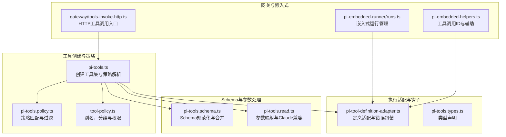
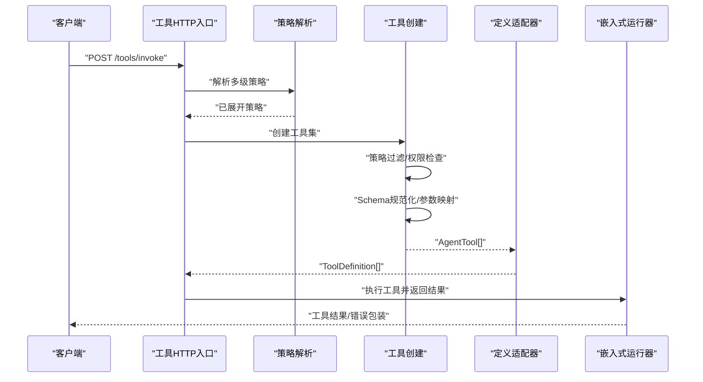
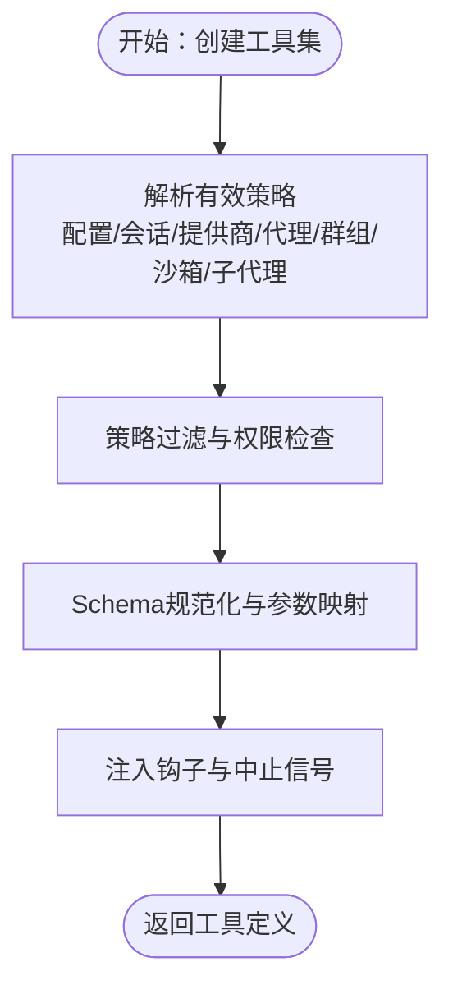
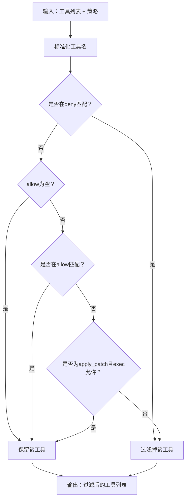
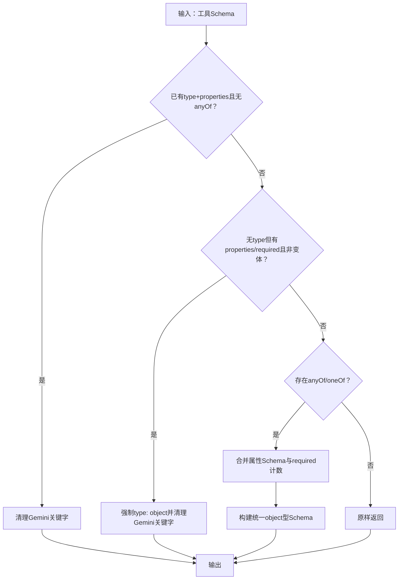
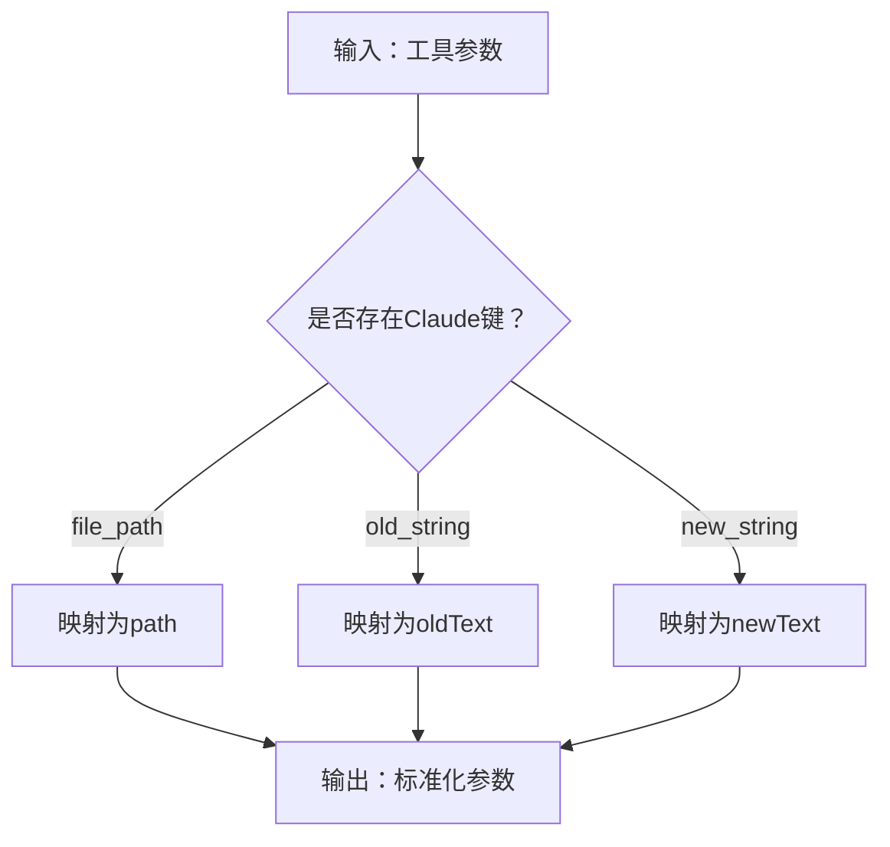
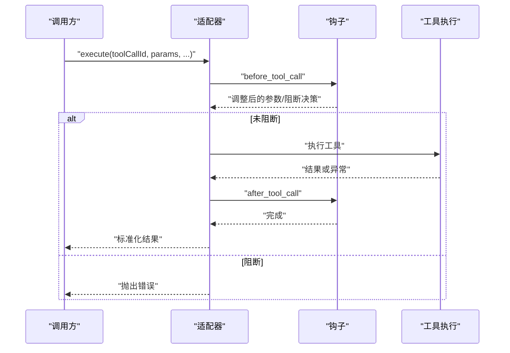
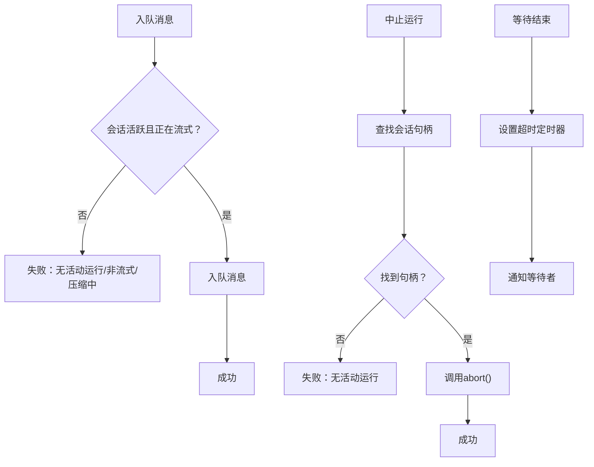
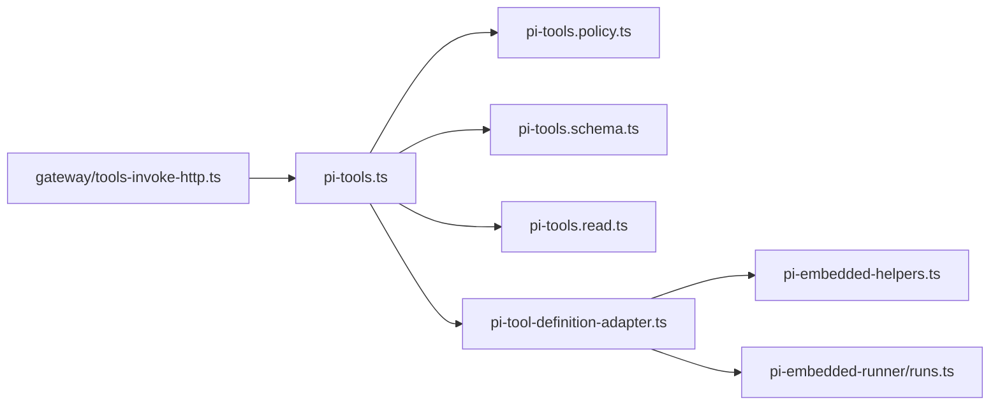

# Pi工具适配器

<cite>
**本文档引用的文件**
- [src/agents/pi-tools.ts](file://src/agents/pi-tools.ts)
- [src/agents/pi-tool-definition-adapter.ts](file://src/agents/pi-tool-definition-adapter.ts)
- [src/agents/pi-tools.policy.ts](file://src/agents/pi-tools.policy.ts)
- [src/agents/tool-policy.ts](file://src/agents/tool-policy.ts)
- [src/agents/pi-tools.schema.ts](file://src/agents/pi-tools.schema.ts)
- [src/agents/pi-tools.read.ts](file://src/agents/pi-tools.read.ts)
- [src/agents/pi-embedded-helpers.ts](file://src/agents/pi-embedded-helpers.ts)
- [src/agents/pi-embedded-runner/runs.ts](file://src/agents/pi-embedded-runner/runs.ts)
- [src/gateway/tools-invoke-http.ts](file://src/gateway/tools-invoke-http.ts)
- [src/agents/pi-tools.types.ts](file://src/agents/pi-tools.types.ts)
- [src/agents/pi-tool-definition-adapter.test.ts](file://src/agents/pi-tool-definition-adapter.test.ts)
- [src/agents/pi-tools.policy.test.ts](file://src/agents/pi-tools.policy.test.ts)
- [src/agents/pi-embedded-helpers.sanitizetoolcallid.test.ts](file://src/agents/pi-embedded-helpers.sanitizetoolcallid.test.ts)
</cite>

## 目录

1. [简介](#简介)
2. [项目结构](#项目结构)
3. [核心组件](#核心组件)
4. [架构总览](#架构总览)
5. [详细组件分析](#详细组件分析)
6. [依赖关系分析](#依赖关系分析)
7. [性能考虑](#性能考虑)
8. [故障排除指南](#故障排除指南)
9. [结论](#结论)
10. [附录](#附录)

## 简介

本文件面向OpenClaw Pi工具适配器系统，提供从架构到实现细节的专业文档。重点覆盖以下主题：

- Pi工具定义适配器：将内部AgentTool封装为Pi框架可识别的ToolDefinition，并统一错误处理与钩子调用。
- 工具Schema验证与规范化：针对不同模型提供商（如OpenAI、Gemini）进行Schema兼容性处理，合并联合模式并清理不被接受的关键字。
- 参数映射机制：在Claude Code与Pi工具约定之间进行参数键名映射与归一化，避免模型训练数据导致的工具调用循环。
- 工具策略集成：基于配置的多级策略解析（全局、按提供商、按代理、按群组、沙箱、子代理），支持通配符与分组展开。
- 权限检查：所有工具在最终输出前进行权限过滤与“仅限所有者”工具的访问控制。
- 执行流程适配：统一的工具执行包装器，注入before/after钩子、超时与中止信号、客户端工具委托等。
- Pi嵌入式工具：嵌入式会话管理、运行状态跟踪、消息队列与中止控制。
- 工具别名支持与类型转换：标准化工具名称、别名映射、插件工具分组与扩展。
- 适配器开发指南、Schema定义规范、错误处理策略、集成示例与调试技巧。

## 项目结构

Pi工具适配器位于src/agents目录下，围绕工具创建、策略、Schema处理与执行适配形成完整闭环；同时通过网关HTTP接口暴露工具调用能力，并与嵌入式运行器协作管理会话生命周期。

**图表来源**

- [src/agents/pi-tools.ts](file://src/agents/pi-tools.ts#L1-L457)
- [src/agents/pi-tools.policy.ts](file://src/agents/pi-tools.policy.ts#L1-L340)
- [src/agents/tool-policy.ts](file://src/agents/tool-policy.ts#L1-L200)
- [src/agents/pi-tools.schema.ts](file://src/agents/pi-tools.schema.ts#L1-L180)
- [src/agents/pi-tools.read.ts](file://src/agents/pi-tools.read.ts#L1-L200)
- [src/agents/pi-tool-definition-adapter.ts](file://src/agents/pi-tool-definition-adapter.ts#L1-L217)
- [src/agents/pi-embedded-runner/runs.ts](file://src/agents/pi-embedded-runner/runs.ts#L1-L140)
- [src/agents/pi-embedded-helpers.ts](file://src/agents/pi-embedded-helpers.ts#L1-L63)
- [src/gateway/tools-invoke-http.ts](file://src/gateway/tools-invoke-http.ts#L257-L307)

**章节来源**

- [src/agents/pi-tools.ts](file://src/agents/pi-tools.ts#L1-L457)
- [src/agents/pi-tools.policy.ts](file://src/agents/pi-tools.policy.ts#L1-L340)
- [src/agents/tool-policy.ts](file://src/agents/tool-policy.ts#L1-L200)
- [src/agents/pi-tools.schema.ts](file://src/agents/pi-tools.schema.ts#L1-L180)
- [src/agents/pi-tools.read.ts](file://src/agents/pi-tools.read.ts#L1-L200)
- [src/agents/pi-tool-definition-adapter.ts](file://src/agents/pi-tool-definition-adapter.ts#L1-L217)
- [src/agents/pi-embedded-runner/runs.ts](file://src/agents/pi-embedded-runner/runs.ts#L1-L140)
- [src/agents/pi-embedded-helpers.ts](file://src/agents/pi-embedded-helpers.ts#L1-L63)
- [src/gateway/tools-invoke-http.ts](file://src/gateway/tools-invoke-http.ts#L257-L307)

## 核心组件

- 工具创建与策略解析：负责聚合基础工具、注入执行配置、应用沙箱与插件策略、规范化Schema与参数，并返回最终可用的工具列表。
- 策略匹配与过滤：支持通配符、正则、分组展开与多级策略叠加，确保工具可见性与安全性。
- Schema规范化：针对不同模型提供商的Schema限制进行清理与合并，保证跨平台兼容。
- 参数映射：在Claude Code与Pi工具约定之间进行键名映射，提升模型适配一致性。
- 执行适配器：将AgentTool封装为ToolDefinition，统一错误处理、钩子调用与结果格式化。
- 嵌入式运行管理：维护嵌入式会话生命周期、消息队列、运行状态与中止控制。

**章节来源**

- [src/agents/pi-tools.ts](file://src/agents/pi-tools.ts#L115-L457)
- [src/agents/pi-tools.policy.ts](file://src/agents/pi-tools.policy.ts#L108-L121)
- [src/agents/pi-tools.schema.ts](file://src/agents/pi-tools.schema.ts#L65-L175)
- [src/agents/pi-tools.read.ts](file://src/agents/pi-tools.read.ts#L127-L149)
- [src/agents/pi-tool-definition-adapter.ts](file://src/agents/pi-tool-definition-adapter.ts#L82-L173)
- [src/agents/pi-embedded-runner/runs.ts](file://src/agents/pi-embedded-runner/runs.ts#L14-L140)

## 架构总览

下图展示从HTTP请求到工具执行再到嵌入式运行的整体流程，包括策略解析、Schema规范化、参数映射与错误包装。

**图表来源**

- [src/gateway/tools-invoke-http.ts](file://src/gateway/tools-invoke-http.ts#L257-L307)
- [src/agents/pi-tools.ts](file://src/agents/pi-tools.ts#L379-L456)
- [src/agents/pi-tool-definition-adapter.ts](file://src/agents/pi-tool-definition-adapter.ts#L82-L173)
- [src/agents/pi-embedded-runner/runs.ts](file://src/agents/pi-embedded-runner/runs.ts#L14-L140)

## 详细组件分析

### 组件A：工具创建与策略集成

- 职责
  - 聚合基础编码工具（读写编辑、应用补丁）、执行与进程工具、通道工具与OpenClaw专用工具。
  - 解析多级策略（配置文件、会话上下文、提供商、代理、群组、沙箱、子代理）。
  - 应用权限过滤与“仅限所有者”工具保护。
  - 规范化Schema与参数，注入before/after钩子与中止信号。
- 关键点
  - 多级策略合并与展开，未知允许项发出警告并提示使用alsoAllow。
  - 对OpenAI模型启用apply_patch的条件判断。
  - 沙箱环境下的工作区隔离与只读限制。
  - 客户端工具委托（返回pending而非直接执行）。

**图表来源**

- [src/agents/pi-tools.ts](file://src/agents/pi-tools.ts#L175-L456)

**章节来源**

- [src/agents/pi-tools.ts](file://src/agents/pi-tools.ts#L115-L457)

### 组件B：工具策略匹配与过滤

- 职责
  - 将allow/deny模式编译为可复用匹配器，支持通配符与正则。
  - 允许apply_patch在显式允许exec时自动放行。
  - 子代理默认拒绝危险或交互式工具。
- 关键点
  - 模式编译与匹配逻辑，避免空值与无效条目。
  - 分组展开与工具名标准化。

**图表来源**

- [src/agents/pi-tools.policy.ts](file://src/agents/pi-tools.policy.ts#L108-L121)

**章节来源**

- [src/agents/pi-tools.policy.ts](file://src/agents/pi-tools.policy.ts#L1-L340)

### 组件C：Schema验证与规范化

- 职责
  - 提取枚举值并合并属性Schema，生成统一的object型根Schema。
  - 清理Gemini不接受的关键字，保证OpenAI根schema为object类型。
  - 合并union/oneOf变体的required字段，提升跨模型兼容性。
- 关键点
  - 针对OpenAI根schema强制type: "object"。
  - 针对Gemini清理不被接受的关键词。
  - 保持title/description/default等元信息。

**图表来源**

- [src/agents/pi-tools.schema.ts](file://src/agents/pi-tools.schema.ts#L65-L175)

**章节来源**

- [src/agents/pi-tools.schema.ts](file://src/agents/pi-tools.schema.ts#L1-L180)

### 组件D：参数映射与类型转换

- 职责
  - 在Claude Code与Pi工具约定之间进行键名映射（file_path↔path、old_string↔oldText、new_string↔newText）。
  - 为Claude Code提供兼容的Schema别名，移除重复required项。
- 关键点
  - 仅当目标键不存在时才进行映射，避免覆盖用户参数。
  - 保持参数类型与语义一致。

**图表来源**

- [src/agents/pi-tools.read.ts](file://src/agents/pi-tools.read.ts#L127-L149)

**章节来源**

- [src/agents/pi-tools.read.ts](file://src/agents/pi-tools.read.ts#L1-L200)

### 组件E：执行流程适配与错误处理

- 职责
  - 将AgentTool封装为ToolDefinition，统一执行签名与参数拆解。
  - 注入before_tool_call与after_tool_call钩子，记录日志与错误栈。
  - 错误包装为标准结果格式，区分AbortError与普通错误。
  - 支持客户端工具委托（返回pending）。
- 关键点
  - 兼容旧版与新版execute参数顺序。
  - 对bash别名统一归一化为exec工具名。
  - 记录工具调用ID与参数，便于追踪。

**图表来源**

- [src/agents/pi-tool-definition-adapter.ts](file://src/agents/pi-tool-definition-adapter.ts#L91-L173)

**章节来源**

- [src/agents/pi-tool-definition-adapter.ts](file://src/agents/pi-tool-definition-adapter.ts#L1-L217)

### 组件F：Pi嵌入式工具与会话管理

- 职责
  - 维护嵌入式会话的活跃状态、消息队列与运行结束通知。
  - 提供运行中查询、消息入队、中止运行与等待结束的能力。
  - 工具调用ID清洗与模式化，确保跨模型兼容。
- 关键点
  - 使用Map维护会话句柄，避免并发问题。
  - 等待器超时与清理，防止内存泄漏。
  - 工具调用ID严格模式与长度限制。

**图表来源**

- [src/agents/pi-embedded-runner/runs.ts](file://src/agents/pi-embedded-runner/runs.ts#L21-L99)
- [src/agents/pi-embedded-helpers.ts](file://src/agents/pi-embedded-helpers.ts#L61-L63)

**章节来源**

- [src/agents/pi-embedded-runner/runs.ts](file://src/agents/pi-embedded-runner/runs.ts#L1-L140)
- [src/agents/pi-embedded-helpers.sanitizetoolcallid.test.ts](file://src/agents/pi-embedded-helpers.sanitizetoolcallid.test.ts#L1-L43)

## 依赖关系分析

- 工具创建依赖策略模块、Schema处理模块与参数映射模块，最终通过适配器输出给网关与嵌入式运行器。
- 网关HTTP入口在工具调用前进行策略解析与过滤，确保安全边界。
- 嵌入式运行器与工具适配器共享工具调用ID清洗与钩子机制。

**图表来源**

- [src/agents/pi-tools.ts](file://src/agents/pi-tools.ts#L1-L457)
- [src/agents/pi-tools.policy.ts](file://src/agents/pi-tools.policy.ts#L1-L340)
- [src/agents/pi-tools.schema.ts](file://src/agents/pi-tools.schema.ts#L1-L180)
- [src/agents/pi-tools.read.ts](file://src/agents/pi-tools.read.ts#L1-L200)
- [src/agents/pi-tool-definition-adapter.ts](file://src/agents/pi-tool-definition-adapter.ts#L1-L217)
- [src/agents/pi-embedded-helpers.ts](file://src/agents/pi-embedded-helpers.ts#L1-L63)
- [src/agents/pi-embedded-runner/runs.ts](file://src/agents/pi-embedded-runner/runs.ts#L1-L140)
- [src/gateway/tools-invoke-http.ts](file://src/gateway/tools-invoke-http.ts#L257-L307)

**章节来源**

- [src/agents/pi-tools.ts](file://src/agents/pi-tools.ts#L1-L457)
- [src/agents/pi-tools.policy.ts](file://src/agents/pi-tools.policy.ts#L1-L340)
- [src/agents/pi-tools.schema.ts](file://src/agents/pi-tools.schema.ts#L1-L180)
- [src/agents/pi-tools.read.ts](file://src/agents/pi-tools.read.ts#L1-L200)
- [src/agents/pi-tool-definition-adapter.ts](file://src/agents/pi-tool-definition-adapter.ts#L1-L217)
- [src/agents/pi-embedded-runner/runs.ts](file://src/agents/pi-embedded-runner/runs.ts#L1-L140)
- [src/gateway/tools-invoke-http.ts](file://src/gateway/tools-invoke-http.ts#L257-L307)

## 性能考虑

- 策略匹配采用预编译模式，减少重复计算。
- Schema合并与规范化仅在工具创建阶段执行一次，避免每次调用重复开销。
- 嵌入式运行器的消息队列与等待器使用定时器与集合管理，注意超时与清理。
- 参数映射与钩子调用为轻量操作，建议在工具创建时完成，降低运行时成本。

## 故障排除指南

- 工具未出现或被过滤
  - 检查策略配置中的allow/deny与alsoAllow，确认未知条目已被清理或使用tools.alsoAllow添加。
  - 子代理默认拒绝部分危险工具，必要时在配置中显式允许。
- 模型报错Schema不合法
  - 确认工具Schema已通过规范化处理，特别是OpenAI要求根schema为object类型。
  - 检查是否包含Gemini不接受的关键字。
- 工具执行异常
  - 查看错误包装结果中的status与error字段，结合日志定位具体原因。
  - 确认钩子执行是否抛出异常，必要时禁用或修复钩子。
- 嵌入式运行异常
  - 使用isEmbeddedPiRunActive与isEmbeddedPiRunStreaming检查运行状态。
  - 使用waitForEmbeddedPiRunEnd设置合理超时，避免长时间阻塞。
  - 中止运行时使用abortEmbeddedPiRun，确保句柄匹配。

**章节来源**

- [src/agents/pi-tools.policy.test.ts](file://src/agents/pi-tools.policy.test.ts#L1-L36)
- [src/agents/pi-tool-definition-adapter.test.ts](file://src/agents/pi-tool-definition-adapter.test.ts#L1-L48)
- [src/agents/pi-embedded-helpers.sanitizetoolcallid.test.ts](file://src/agents/pi-embedded-helpers.sanitizetoolcallid.test.ts#L1-L43)
- [src/agents/pi-embedded-runner/runs.ts](file://src/agents/pi-embedded-runner/runs.ts#L67-L99)

## 结论

Pi工具适配器系统通过“策略+Schema+参数”的三重适配，实现了跨模型、跨环境的一致工具体验。其设计强调安全性（多级策略与权限检查）、可移植性（Schema清理与合并）与可观测性（钩子与日志）。嵌入式运行器进一步增强了实时交互与会话管理能力。建议在实际集成中遵循本文档的开发指南与规范，确保稳定性与可维护性。

## 附录

### 适配器开发指南

- 工具定义
  - 使用统一的AgentTool接口，确保name、label、description、parameters与execute完备。
  - 对于客户端工具，返回pending结果并由客户端执行。
- 策略配置
  - 使用tools.profile与tools.alsoAllow组合，避免早期过滤导致的未知条目。
  - 对插件工具，使用group:plugins或明确列出工具名。
- Schema规范
  - 避免根级别union/oneOf，必要时交由规范化模块处理。
  - 针对Gemini清理不被接受的关键字，针对OpenAI确保根schema为object。
- 参数映射
  - 在Claude Code与Pi工具约定之间进行键名映射，保持向后兼容。
- 错误处理
  - 使用jsonResult包装错误，包含status、tool与error字段。
  - 区分AbortError与其他错误，避免混淆中止与异常。

### Schema定义规范

- 根schema类型
  - OpenAI：根schema必须为object。
  - Gemini：清理不被接受的关键字。
- 联合模式
  - 合并anyOf/oneOf变体的properties与required，生成统一object schema。
- 枚举与常量
  - 提取enum/const值，合并重复枚举，保持类型一致性。

### 集成示例与调试技巧

- 网关工具调用
  - 通过HTTP接口/tools/invoke触发工具执行，确保策略已正确解析与过滤。
- 嵌入式会话
  - 使用queueEmbeddedPiMessage发送消息，abortEmbeddedPiRun中止运行，waitForEmbeddedPiRunEnd等待结束。
- 调试要点
  - 开启详细日志，关注before_tool_call/after_tool_call钩子的执行情况。
  - 使用工具调用ID清洗函数，确保ID符合目标模型要求。
  - 对于模型特定问题，优先检查Schema规范化与参数映射步骤。

**章节来源**

- [src/gateway/tools-invoke-http.ts](file://src/gateway/tools-invoke-http.ts#L257-L307)
- [src/agents/pi-embedded-runner/runs.ts](file://src/agents/pi-embedded-runner/runs.ts#L14-L140)
- [src/agents/pi-embedded-helpers.ts](file://src/agents/pi-embedded-helpers.ts#L61-L63)
