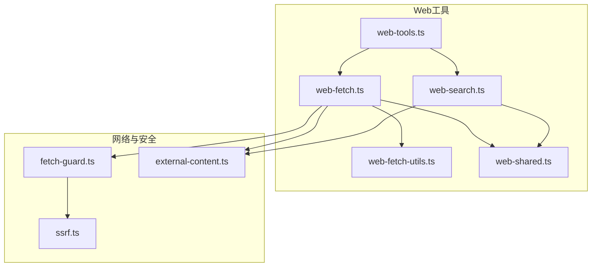
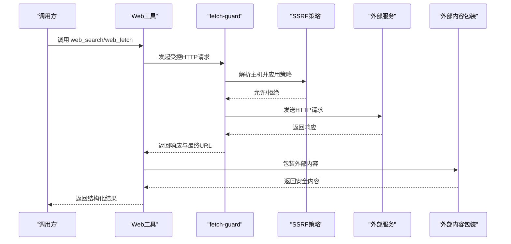
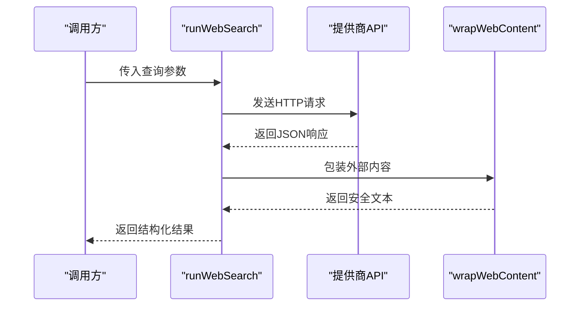
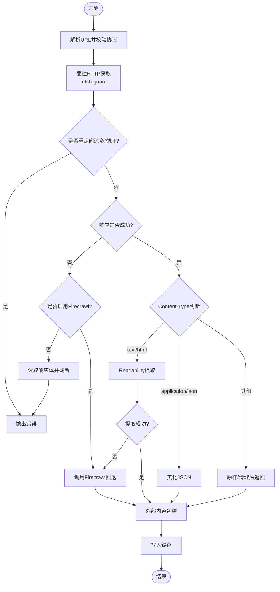
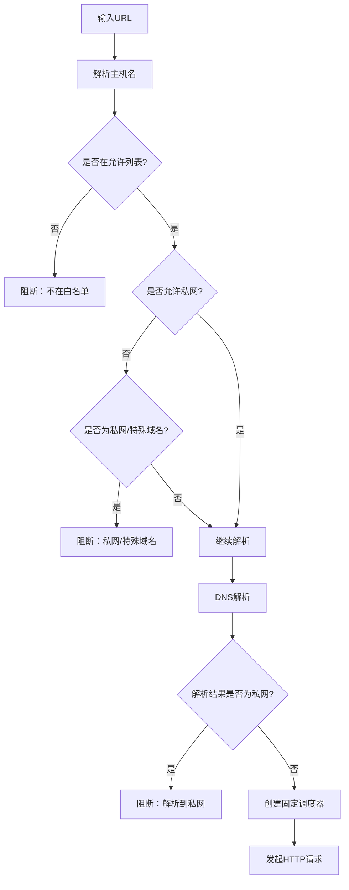
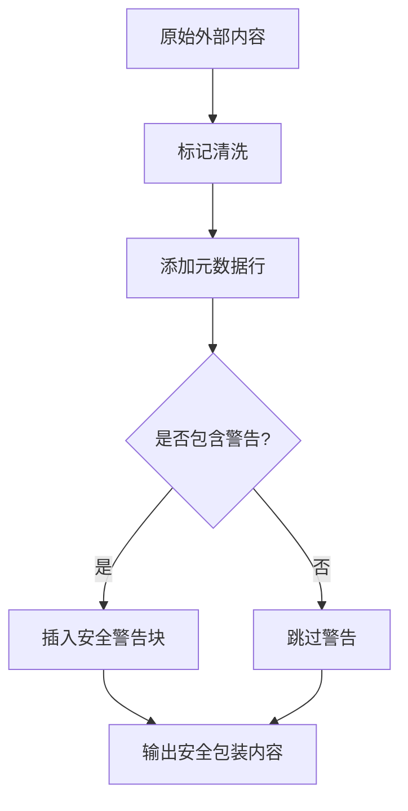
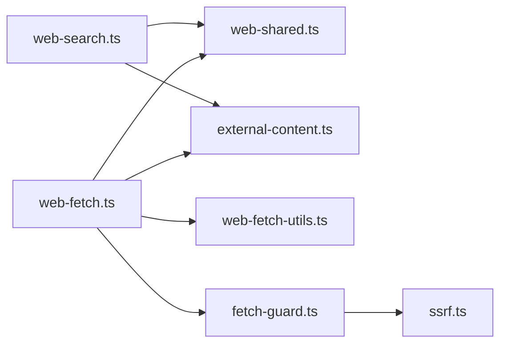

# Web工具集

<cite>
**本文引用的文件**
- [src/agents/tools/web-search.ts](file://src/agents/tools/web-search.ts)
- [src/agents/tools/web-fetch.ts](file://src/agents/tools/web-fetch.ts)
- [src/agents/tools/web-shared.ts](file://src/agents/tools/web-shared.ts)
- [src/agents/tools/web-fetch-utils.ts](file://src/agents/tools/web-fetch-utils.ts)
- [src/agents/tools/web-tools.ts](file://src/agents/tools/web-tools.ts)
- [src/agents/tools/web-fetch.ssrf.test.ts](file://src/agents/tools/web-fetch.ssrf.test.ts)
- [src/agents/tools/web-search.test.ts](file://src/agents/tools/web-search.test.ts)
- [src/infra/net/fetch-guard.ts](file://src/infra/net/fetch-guard.ts)
- [src/infra/net/ssrf.ts](file://src/infra/net/ssrf.ts)
- [src/security/external-content.ts](file://src/security/external-content.ts)
- [src/agents/tools/common.ts](file://src/agents/tools/common.ts)
- [docs/tools/web.md](file://docs/tools/web.md)
- [docs/zh-CN/gateway/configuration.md](file://docs/zh-CN/gateway/configuration.md)
</cite>

## 目录

1. [简介](#简介)
2. [项目结构](#项目结构)
3. [核心组件](#核心组件)
4. [架构总览](#架构总览)
5. [详细组件分析](#详细组件分析)
6. [依赖关系分析](#依赖关系分析)
7. [性能考量](#性能考量)
8. [故障排查指南](#故障排查指南)
9. [结论](#结论)
10. [附录](#附录)

## 简介

本文件为 OpenClaw Web 工具集的技术文档，聚焦以下能力：

- Web 抓取工具：HTTP 获取 + 可读内容提取（HTML → Markdown/文本），支持回退到 Firecrawl。
- 网络请求处理：统一的超时控制、重定向限制、SSRF 防护与 DNS 固定。
- 搜索工具集成：Brave Search API、Perplexity（直连或经 OpenRouter）、xAI Grok 的检索与结果封装。
- 内容提取与安全：可读性提取、HTML→Markdown 转换、内容截断与包装，确保外部内容安全传递给大模型。
- 配置与缓存：工具级配置项、缓存 TTL、最大字符数限制、超时与重定向上限等。

## 项目结构

Web 工具集位于 agents/tools 子目录，核心文件包括：

- web-search.ts：Web 搜索工具实现，支持多提供商与缓存。
- web-fetch.ts：Web 抓取工具实现，含可读内容提取与 Firecrawl 回退。
- web-shared.ts：通用缓存、超时与响应读取工具。
- web-fetch-utils.ts：HTML→Markdown、可读内容提取、截断等实用函数。
- fetch-guard.ts 与 ssrf.ts：网络请求与 SSRF 防护。
- external-content.ts：外部内容包装与安全提示。
- web-tools.ts：工具导出入口。
- 测试文件：web-search.test.ts、web-fetch.ssrf.test.ts。

**图表来源**

- [src/agents/tools/web-search.ts](file://src/agents/tools/web-search.ts#L1-L777)
- [src/agents/tools/web-fetch.ts](file://src/agents/tools/web-fetch.ts#L1-L705)
- [src/agents/tools/web-fetch-utils.ts](file://src/agents/tools/web-fetch-utils.ts#L1-L123)
- [src/agents/tools/web-shared.ts](file://src/agents/tools/web-shared.ts#L1-L96)
- [src/agents/tools/web-tools.ts](file://src/agents/tools/web-tools.ts#L1-L2)
- [src/infra/net/fetch-guard.ts](file://src/infra/net/fetch-guard.ts#L1-L175)
- [src/infra/net/ssrf.ts](file://src/infra/net/ssrf.ts#L1-L346)
- [src/security/external-content.ts](file://src/security/external-content.ts#L1-L285)

**章节来源**

- [src/agents/tools/web-search.ts](file://src/agents/tools/web-search.ts#L1-L777)
- [src/agents/tools/web-fetch.ts](file://src/agents/tools/web-fetch.ts#L1-L705)
- [src/agents/tools/web-shared.ts](file://src/agents/tools/web-shared.ts#L1-L96)
- [src/agents/tools/web-fetch-utils.ts](file://src/agents/tools/web-fetch-utils.ts#L1-L123)
- [src/agents/tools/web-tools.ts](file://src/agents/tools/web-tools.ts#L1-L2)
- [src/infra/net/fetch-guard.ts](file://src/infra/net/fetch-guard.ts#L1-L175)
- [src/infra/net/ssrf.ts](file://src/infra/net/ssrf.ts#L1-L346)
- [src/security/external-content.ts](file://src/security/external-content.ts#L1-L285)

## 核心组件

- Web 搜索工具（web_search）
  - 支持提供商：Brave、Perplexity、xAI Grok。
  - 参数：查询词、结果数量、国家/语言、新鲜度（Brave）等。
  - 缓存：按查询参数组合生成键，支持 TTL。
  - 安全：外部内容包装，标注来源与警告。
- Web 抓取工具（web_fetch）
  - 基础 HTTP 获取 + 可读内容提取（Readability）。
  - 回退：当 Readability 失败或不可用时，尝试 Firecrawl。
  - 安全：SSRF 防护（DNS 固定、私网地址阻断、重定向限制）。
  - 缓存：按 URL+提取模式+长度组合缓存。
  - 输出：Markdown 或纯文本，标题、状态码、长度统计等元数据。
- 共享能力（web-shared）
  - 超时控制、缓存读写、响应文本读取、键规范化。
- 提取工具（web-fetch-utils）
  - HTML→Markdown、Markdown→Text、可读内容提取、截断。
- 网络与安全（fetch-guard、ssrf）
  - 重定向计数与循环检测、私网地址阻断、主机白名单、DNS 固定调度器。
- 外部内容包装（external-content）
  - 统一封装外部来源内容，加入边界标记与安全提示。

**章节来源**

- [src/agents/tools/web-search.ts](file://src/agents/tools/web-search.ts#L39-L777)
- [src/agents/tools/web-fetch.ts](file://src/agents/tools/web-fetch.ts#L44-L705)
- [src/agents/tools/web-shared.ts](file://src/agents/tools/web-shared.ts#L11-L96)
- [src/agents/tools/web-fetch-utils.ts](file://src/agents/tools/web-fetch-utils.ts#L28-L123)
- [src/infra/net/fetch-guard.ts](file://src/infra/net/fetch-guard.ts#L73-L175)
- [src/infra/net/ssrf.ts](file://src/infra/net/ssrf.ts#L253-L346)
- [src/security/external-content.ts](file://src/security/external-content.ts#L181-L285)

## 架构总览

Web 工具集采用“工具层 + 网络层 + 安全层”的分层设计：

- 工具层：web-search.ts、web-fetch.ts 提供对外接口与参数校验。
- 网络层：fetch-guard.ts 封装 fetch，实现重定向、超时、SSRF 防护；ssrf.ts 实现主机名与 IP 白名单、私网阻断、DNS 固定。
- 安全层：external-content.ts 对外部内容进行包装与提示；web-shared.ts 提供统一缓存与超时控制。
- 提取层：web-fetch-utils.ts 提供 HTML/Markdown 转换与可读内容提取。

**图表来源**

- [src/agents/tools/web-search.ts](file://src/agents/tools/web-search.ts#L527-L677)
- [src/agents/tools/web-fetch.ts](file://src/agents/tools/web-fetch.ts#L365-L593)
- [src/infra/net/fetch-guard.ts](file://src/infra/net/fetch-guard.ts#L73-L175)
- [src/infra/net/ssrf.ts](file://src/infra/net/ssrf.ts#L253-L346)
- [src/security/external-content.ts](file://src/security/external-content.ts#L181-L285)

## 详细组件分析

### Web 搜索工具（web_search）

- 功能要点
  - 多提供商路由：Brave（结构化结果）、Perplexity（AI合成答案+引用）、xAI Grok（AI合成答案+引用）。
  - 参数校验与归一化：查询词、数量、国家/语言、新鲜度（Brave）。
  - 缓存：以查询参数组合为键，命中返回缓存值并标记 cached=true。
  - 错误处理：对非 2xx 响应读取响应体并抛出带状态码与消息的错误。
  - 外部内容包装：将结果内容与引用信息包裹，标注来源与警告。
- 关键流程（Perplexity）
  - 选择 baseUrl 与模型：根据 API Key 前缀推断直连或 OpenRouter，并做模型前缀兼容。
  - 发送请求：携带认证头与 referer/title 头，JSON 请求体。
  - 解析响应：提取 choices[0].message.content 作为答案，citations 作为引用列表。
  - 结果封装：添加 provider/model/query/耗时/外部内容标记等字段。
- 关键流程（Brave）
  - 构建查询参数：q/count/country/search_lang/ui_lang/freshness。
  - 发送请求：X-Subscription-Token 认证头。
  - 解析响应：遍历 web.results，映射为标题/URL/描述/站点名等字段。
  - 结果封装：添加 provider/query/结果数/耗时/外部内容标记等字段。

**图表来源**

- [src/agents/tools/web-search.ts](file://src/agents/tools/web-search.ts#L432-L525)
- [src/agents/tools/web-search.ts](file://src/agents/tools/web-search.ts#L616-L677)
- [src/security/external-content.ts](file://src/security/external-content.ts#L277-L284)

**章节来源**

- [src/agents/tools/web-search.ts](file://src/agents/tools/web-search.ts#L21-L777)
- [src/agents/tools/web-search.test.ts](file://src/agents/tools/web-search.test.ts#L1-L227)

### Web 抓取工具（web_fetch）

- 功能要点
  - 基础获取：使用受控 fetch（fetch-guard），支持超时、重定向限制、SSRF 防护。
  - 可读内容提取：优先 Readability；失败则尝试 Firecrawl 回退。
  - 内容格式：支持 markdown 与 text 两种提取模式。
  - 安全包装：对正文、标题、警告信息进行外部内容包装。
  - 缓存：按 url+extractMode+maxChars 组合缓存。
  - 错误处理：对非 2xx 响应读取响应体，必要时转为 Markdown 文本再截断。
- 关键流程（受控获取）
  - URL 校验：必须为 http/https。
  - 重定向：手动跟随，限制次数，检测循环。
  - SSRF：解析主机名，应用白名单/私网阻断策略，必要时固定 DNS。
  - 成功：读取响应体，按 Content-Type 判断处理路径。
- 关键流程（内容提取）
  - text/html：优先 Readability；失败则 Firecrawl 回退；均失败则报错。
  - application/json：尝试美化输出；失败回退原始文本。
  - 其他类型：原样返回或 raw 处理。
- 关键流程（Firecrawl 回退）
  - 当 Readability 不可用或失败时，调用 Firecrawl API，支持代理与缓存策略。
  - 返回 markdown 文本、标题、状态码、警告等。

**图表来源**

- [src/agents/tools/web-fetch.ts](file://src/agents/tools/web-fetch.ts#L365-L593)
- [src/agents/tools/web-fetch.ts](file://src/agents/tools/web-fetch.ts#L288-L363)
- [src/infra/net/fetch-guard.ts](file://src/infra/net/fetch-guard.ts#L73-L175)
- [src/infra/net/ssrf.ts](file://src/infra/net/ssrf.ts#L253-L346)

**章节来源**

- [src/agents/tools/web-fetch.ts](file://src/agents/tools/web-fetch.ts#L1-L705)
- [src/agents/tools/web-fetch-utils.ts](file://src/agents/tools/web-fetch-utils.ts#L1-L123)
- [src/infra/net/fetch-guard.ts](file://src/infra/net/fetch-guard.ts#L1-L175)
- [src/infra/net/ssrf.ts](file://src/infra/net/ssrf.ts#L1-L346)

### SSRF 防护与网络控制

- 主机名校验与白名单
  - 归一化主机名，检查是否在允许列表中；不在则阻断。
  - 显式允许的主机可绕过私网检查。
- 私网地址阻断
  - IPv4/IPv6 私网前缀与特殊域名（localhost、.internal 等）阻断。
  - 解析到私网地址同样阻断。
- DNS 固定与调度器
  - 为解析到的地址创建固定 lookup，避免 DNS 劫持与切换。
  - 使用 Undici Agent 与自定义 connect.lookup。
- 重定向限制与循环检测
  - 手动跟随重定向，限制次数与检测循环。
- 测试验证
  - 单测覆盖 localhost、私网 IP、DNS 解析到私网、重定向到私网等场景。

**图表来源**

- [src/infra/net/ssrf.ts](file://src/infra/net/ssrf.ts#L253-L346)
- [src/infra/net/fetch-guard.ts](file://src/infra/net/fetch-guard.ts#L116-L131)
- [src/agents/tools/web-fetch.ssrf.test.ts](file://src/agents/tools/web-fetch.ssrf.test.ts#L47-L164)

**章节来源**

- [src/infra/net/ssrf.ts](file://src/infra/net/ssrf.ts#L1-L346)
- [src/infra/net/fetch-guard.ts](file://src/infra/net/fetch-guard.ts#L1-L175)
- [src/agents/tools/web-fetch.ssrf.test.ts](file://src/agents/tools/web-fetch.ssrf.test.ts#L1-L165)

### 外部内容安全包装

- 目标
  - 对来自外部来源的内容（邮件、Webhook、Web 工具）进行边界标记与安全提示。
  - 防止注入与社会工程攻击影响模型行为。
- 方法
  - 添加边界标记与元数据行（来源、发件人、主题等）。
  - 可选包含详细安全警告块。
  - 对特定标记进行清洗，防止边界被破坏。
- Web 工具专用包装
  - web_search/web_fetch 分别调用 wrapWebContent，按需包含警告。

**图表来源**

- [src/security/external-content.ts](file://src/security/external-content.ts#L181-L285)

**章节来源**

- [src/security/external-content.ts](file://src/security/external-content.ts#L1-L285)

## 依赖关系分析

- 组件耦合
  - web-search.ts 与 web-shared.ts：共享缓存、超时、响应读取。
  - web-fetch.ts 与 web-shared.ts、web-fetch-utils.ts、fetch-guard.ts、ssrf.ts：共同完成网络请求与内容提取。
  - external-content.ts：被 web-search.ts 与 web-fetch.ts 广泛用于内容包装。
- 外部依赖
  - Mozilla Readability 与 linkedom：HTML 可读内容提取。
  - Undici Agent：连接与 DNS 固定。
  - Provider API：Brave、Perplexity、xAI Grok、Firecrawl。

**图表来源**

- [src/agents/tools/web-search.ts](file://src/agents/tools/web-search.ts#L1-L19)
- [src/agents/tools/web-fetch.ts](file://src/agents/tools/web-fetch.ts#L1-L28)
- [src/agents/tools/web-shared.ts](file://src/agents/tools/web-shared.ts#L1-L96)
- [src/agents/tools/web-fetch-utils.ts](file://src/agents/tools/web-fetch-utils.ts#L1-L123)
- [src/infra/net/fetch-guard.ts](file://src/infra/net/fetch-guard.ts#L1-L175)
- [src/infra/net/ssrf.ts](file://src/infra/net/ssrf.ts#L1-L346)
- [src/security/external-content.ts](file://src/security/external-content.ts#L1-L285)

**章节来源**

- [src/agents/tools/web-search.ts](file://src/agents/tools/web-search.ts#L1-L777)
- [src/agents/tools/web-fetch.ts](file://src/agents/tools/web-fetch.ts#L1-L705)
- [src/agents/tools/web-shared.ts](file://src/agents/tools/web-shared.ts#L1-L96)
- [src/agents/tools/web-fetch-utils.ts](file://src/agents/tools/web-fetch-utils.ts#L1-L123)
- [src/infra/net/fetch-guard.ts](file://src/infra/net/fetch-guard.ts#L1-L175)
- [src/infra/net/ssrf.ts](file://src/infra/net/ssrf.ts#L1-L346)
- [src/security/external-content.ts](file://src/security/external-content.ts#L1-L285)

## 性能考量

- 缓存策略
  - 默认 TTL：15 分钟；可通过配置覆盖。
  - 缓存键：web_search 基于 provider/query/参数组合；web_fetch 基于 url+extractMode+maxChars。
  - 最大条目：缓存容量上限，超过后逐出最旧条目。
- 超时与重定向
  - 默认超时：30 秒；可配置。
  - 重定向上限：默认 3 次；可配置。
- 内容提取
  - Readability 与 Firecrawl 均为 CPU/IO 开销操作，建议合理设置 maxChars 与超时。
- 建议
  - 对高频查询开启缓存并适当提高 TTL。
  - 对复杂页面优先启用 Firecrawl，但注意其 API 限额与延迟。
  - 控制 maxChars 与超时，避免长尾请求拖慢整体吞吐。

**章节来源**

- [src/agents/tools/web-shared.ts](file://src/agents/tools/web-shared.ts#L7-L61)
- [src/agents/tools/web-search.ts](file://src/agents/tools/web-search.ts#L542-L553)
- [src/agents/tools/web-fetch.ts](file://src/agents/tools/web-fetch.ts#L383-L389)

## 故障排查指南

- 常见问题与定位
  - 缺少 API Key：web_search 在缺少对应提供商 Key 时返回带文档链接的错误提示。
  - URL 非法：web_fetch 对非法 URL 或协议抛错。
  - SSRF 阻断：localhost、私网 IP、特殊域名或解析到私网会被阻断；查看日志中的审计上下文。
  - 过多重定向：超过上限或出现循环重定向会抛错。
  - Readability/Firecrawl 失败：检查可读内容提取开关与 Firecrawl 配置。
- 排查步骤
  - 检查配置：tools.web.search.tools.web.fetch 的 enabled、apiKey、baseUrl、timeoutSeconds、cacheTtlMinutes、maxChars、userAgent、readability、firecrawl.\*。
  - 启用更详细的日志：关注 fetch-guard 中的安全审计日志。
  - 逐步缩小范围：先尝试直接访问目标 URL，确认可达性与内容类型。
  - 降低 maxChars 与超时，观察是否仍失败。
- 相关测试参考
  - SSRF 阻断测试：验证 localhost、私网 IP、DNS 解析到私网、重定向到私网等场景。
  - Perplexity/Brave/Grok 配置解析测试：验证 baseUrl 推断、模型前缀兼容、新鲜度参数等。

**章节来源**

- [src/agents/tools/web-search.ts](file://src/agents/tools/web-search.ts#L191-L213)
- [src/agents/tools/web-fetch.ts](file://src/agents/tools/web-fetch.ts#L391-L399)
- [src/agents/tools/web-fetch.ssrf.test.ts](file://src/agents/tools/web-fetch.ssrf.test.ts#L47-L164)
- [src/agents/tools/web-search.test.ts](file://src/agents/tools/web-search.test.ts#L40-L129)

## 结论

OpenClaw Web 工具集在功能与安全之间取得平衡：

- 功能上，提供轻量的 Web 搜索与抓取能力，支持多种提供商与回退策略。
- 安全上，内置 SSRF 防护、主机白名单、私网阻断、DNS 固定与外部内容包装。
- 可靠性上，统一的缓存、超时与重定向控制，配合完善的错误处理与测试覆盖。

建议在生产环境中：

- 明确配置项与默认值，结合业务需求调整 TTL、超时与字符上限。
- 严格管理 API Key，优先使用配置文件而非环境变量。
- 对高风险场景启用更严格的 SSRF 策略与主机白名单。

## 附录

### 配置项速览（摘自官方文档）

- tools.web.search
  - enabled：是否启用
  - apiKey：Brave/Perplexity/XAI Key
  - maxResults：1–10
  - timeoutSeconds：默认 30
  - cacheTtlMinutes：默认 15
  - provider：brave/perplexity/grok
  - perplexity：baseUrl、model、apiKey
  - grok：apiKey、model、inlineCitations
- tools.web.fetch
  - enabled：是否启用
  - maxChars：默认 50000
  - maxCharsCap：默认 50000
  - timeoutSeconds：默认 30
  - cacheTtlMinutes：默认 15
  - maxRedirects：默认 3
  - userAgent：默认 Chrome UA
  - readability：默认 true
  - firecrawl：enabled、apiKey、baseUrl、onlyMainContent、maxAgeMs、timeoutSeconds

**章节来源**

- [docs/tools/web.md](file://docs/tools/web.md#L155-L262)
- [docs/zh-CN/gateway/configuration.md](file://docs/zh-CN/gateway/configuration.md#L2000-L2018)
