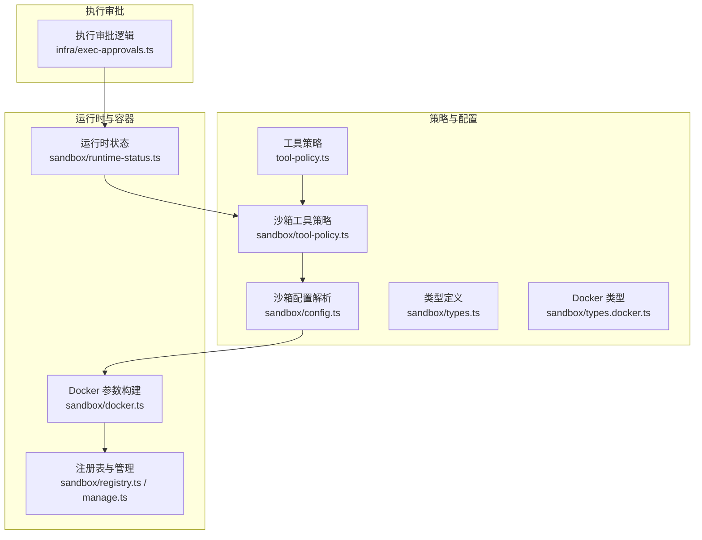
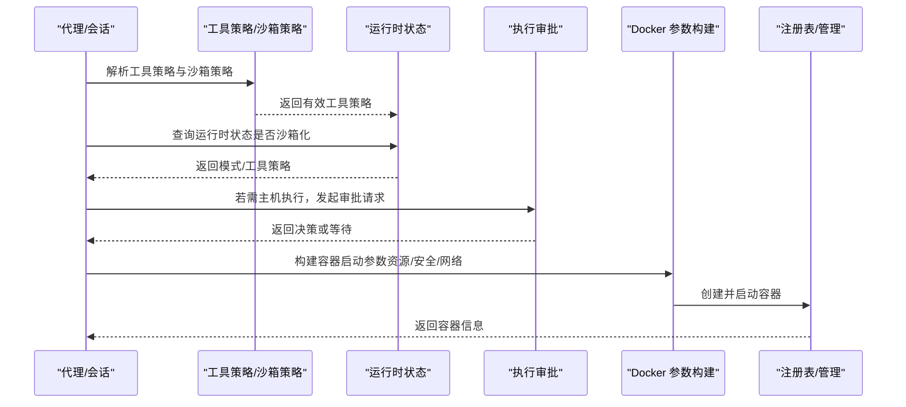
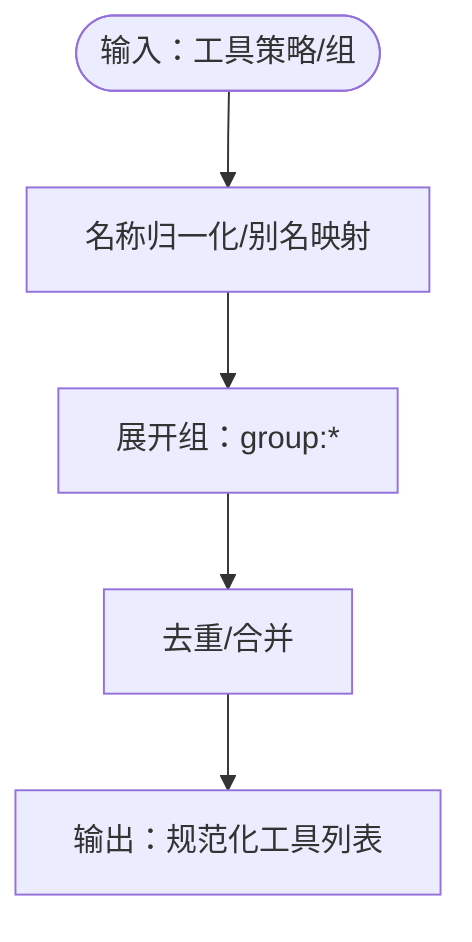
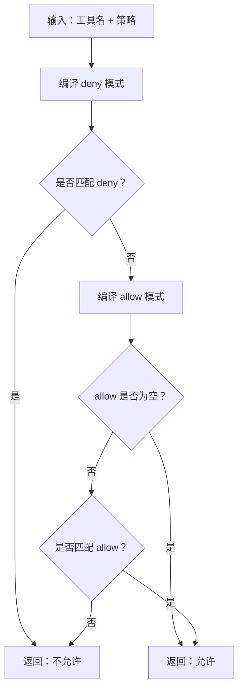
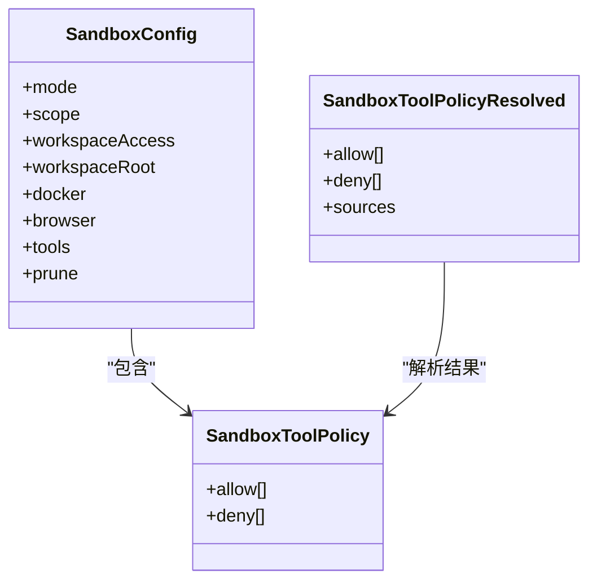
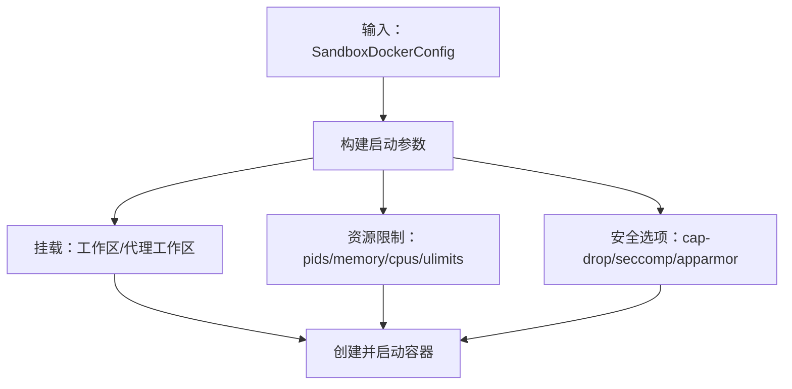
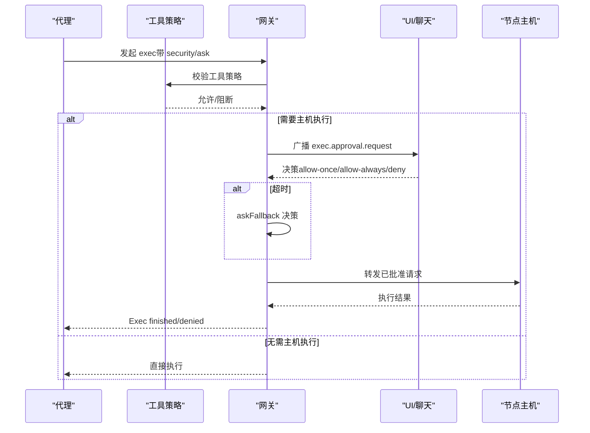
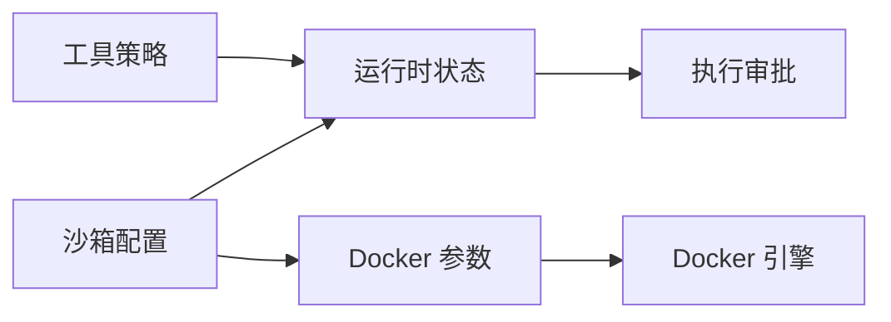

# 工具执行策略

<cite>
**本文引用的文件**
- [src/agents/tool-policy.ts](file://src/agents/tool-policy.ts)
- [src/agents/sandbox/tool-policy.ts](file://src/agents/sandbox/tool-policy.ts)
- [src/agents/sandbox/constants.ts](file://src/agents/sandbox/constants.ts)
- [src/agents/sandbox/types.ts](file://src/agents/sandbox/types.ts)
- [src/agents/sandbox/types.docker.ts](file://src/agents/sandbox/types.docker.ts)
- [src/agents/sandbox/config.ts](file://src/agents/sandbox/config.ts)
- [src/agents/sandbox/docker.ts](file://src/agents/sandbox/docker.ts)
- [src/agents/sandbox/runtime-status.ts](file://src/agents/sandbox/runtime-status.ts)
- [src/agents/sandbox/registry.ts](file://src/agents/sandbox/registry.ts)
- [src/agents/sandbox/manage.ts](file://src/agents/sandbox/manage.ts)
- [src/agents/sandbox-merge.test.ts](file://src/agents/sandbox-merge.test.ts)
- [src/agents/sandbox-create-args.test.ts](file://src/agents/sandbox-create-args.test.ts)
- [src/config/zod-schema.agent-runtime.ts](file://src/config/zod-schema.agent-runtime.ts)
- [src/config/config.sandbox-docker.test.ts](file://src/config/config.sandbox-docker.test.ts)
- [src/security/audit-extra.sync.ts](file://src/security/audit-extra.sync.ts)
- [src/agents/tool-policy.conformance.ts](file://src/agents/tool-policy.conformance.ts)
- [src/agents/tool-policy.conformance.test.ts](file://src/agents/tool-policy.conformance.test.ts)
- [src/agents/tool-policy.test.ts](file://src/agents/tool-policy.test.ts)
- [src/infra/exec-approvals.ts](file://src/infra/exec-approvals.ts)
- [src/infra/exec-approvals.test.ts](file://src/infra/exec-approvals.test.ts)
- [apps/macos/Tests/OpenClawIPCTests/ExecApprovalHelpersTests.swift](file://apps/macos/Tests/OpenClawIPCTests/ExecApprovalHelpersTests.swift)
- [src/agents/bash-tools.exec.approval-id.test.ts](file://src/agents/bash-tools.exec.approval-id.test.ts)
- [docs/tools/exec.md](file://docs/tools/exec.md)
- [docs/tools/exec-approvals.md](file://docs/tools/exec-approvals.md)
- [docs/gateway/sandbox-vs-tool-policy-vs-elevated.md](file://docs/gateway/sandbox-vs-tool-policy-vs-elevated.md)
- [docs/gateway/configuration-reference.md](file://docs/gateway/configuration-reference.md)
</cite>

## 目录

1. [简介](#简介)
2. [项目结构](#项目结构)
3. [核心组件](#核心组件)
4. [架构总览](#架构总览)
5. [详细组件分析](#详细组件分析)
6. [依赖关系分析](#依赖关系分析)
7. [性能考量](#性能考量)
8. [故障排查指南](#故障排查指南)
9. [结论](#结论)
10. [附录](#附录)

## 简介

本文件系统化梳理 OpenClaw 工具执行策略体系，覆盖工具策略规则、权限控制机制、执行约束条件、沙箱隔离与安全边界、资源限制配置、工具调用审批流程、执行优先级与并发控制，并提供策略配置示例、安全最佳实践与性能优化建议，以及调试与监控方法。

## 项目结构

围绕“工具执行策略”的关键实现分布在以下模块：

- 工具策略与分组：工具名称归一化、别名映射、组展开、配置解析与合规快照
- 沙箱策略与运行时：沙箱工具策略解析、默认允许/拒绝清单、运行状态与阻断提示
- 沙箱容器与安全：Docker 参数构建、资源限制、网络与安全选项、绑定挂载
- 执行审批与权限：执行策略（安全模式、询问模式）、批准请求与回传、UI/IPC 流程
- 配置与校验：Docker 配置 Schema 校验、配置合并测试、策略配置参考

**图表来源**

- [src/agents/tool-policy.ts](file://src/agents/tool-policy.ts#L1-L292)
- [src/agents/sandbox/tool-policy.ts](file://src/agents/sandbox/tool-policy.ts#L1-L143)
- [src/agents/sandbox/config.ts](file://src/agents/sandbox/config.ts#L126-L144)
- [src/agents/sandbox/types.ts](file://src/agents/sandbox/types.ts#L1-L86)
- [src/agents/sandbox/types.docker.ts](file://src/agents/sandbox/types.docker.ts#L1-L22)
- [src/agents/sandbox/runtime-status.ts](file://src/agents/sandbox/runtime-status.ts#L45-L97)
- [src/agents/sandbox/docker.ts](file://src/agents/sandbox/docker.ts#L125-L168)
- [src/agents/sandbox/registry.ts](file://src/agents/sandbox/registry.ts#L1-L51)
- [src/agents/sandbox/manage.ts](file://src/agents/sandbox/manage.ts#L1-L29)
- [src/infra/exec-approvals.ts](file://src/infra/exec-approvals.ts#L1557-L1603)

**章节来源**

- [src/agents/tool-policy.ts](file://src/agents/tool-policy.ts#L1-L292)
- [src/agents/sandbox/tool-policy.ts](file://src/agents/sandbox/tool-policy.ts#L1-L143)
- [src/agents/sandbox/config.ts](file://src/agents/sandbox/config.ts#L126-L144)
- [src/agents/sandbox/types.ts](file://src/agents/sandbox/types.ts#L1-L86)
- [src/agents/sandbox/types.docker.ts](file://src/agents/sandbox/types.docker.ts#L1-L22)
- [src/agents/sandbox/runtime-status.ts](file://src/agents/sandbox/runtime-status.ts#L45-L97)
- [src/agents/sandbox/docker.ts](file://src/agents/sandbox/docker.ts#L125-L168)
- [src/agents/sandbox/registry.ts](file://src/agents/sandbox/registry.ts#L1-L51)
- [src/agents/sandbox/manage.ts](file://src/agents/sandbox/manage.ts#L1-L29)
- [src/infra/exec-approvals.ts](file://src/infra/exec-approvals.ts#L1557-L1603)

## 核心组件

- 工具策略与分组
  - 工具名称归一化与别名映射（如 bash → exec、apply-patch → apply_patch）
  - 组展开（group:runtime、group:fs、group:sessions、group:memory、group:ui、group:automation、group:messaging、group:nodes、group:openclaw）
  - 配置解析：工具资料（TOOL_GROUPS）、工具资料快照（TOOL_POLICY_CONFORMANCE）
  - 合规性：conformance 测试确保实现与导出一致
- 沙箱工具策略
  - 模式解析：全局/代理级别 allow/deny，支持 group:\* 展开与默认值
  - 匹配算法：通配符、精确匹配、正则；deny 优先于 allow
  - 运行时阻断提示：在沙箱运行时给出明确的阻断原因与来源键路径
- 沙箱配置与运行时
  - 沙箱模式/作用域/工作区访问：off/non-main/all、session/agent/shared、none/ro/rw
  - 默认策略：默认允许工具集、默认拒绝工具集（含浏览器、节点、通道等）
  - 运行时状态：根据会话键判断是否沙箱化、解析有效工具策略
- 容器与安全
  - Docker 参数构建：只读根文件系统、tmpfs、网络、用户、能力丢弃、安全选项、seccomp/AppArmor、DNS、extraHosts、binds
  - 资源限制：pidsLimit、memory/memorySwap、cpus、ulimits
  - 注册表与生命周期：容器/浏览器容器列表、停止与清理
- 执行审批与权限
  - 安全模式：deny/allowlist/full；询问模式：off/on-miss/always；询问回退：deny/allowlist/full
  - 允许列表：按代理粒度的 glob 模式，记录最后使用信息
  - 审批流程：网关广播请求、UI/聊天渠道确认、超时处理、事件上报
- 配置与校验
  - Docker 配置 Schema 校验（binds 数组、ulimits 结构等）
  - 配置合并测试：环境变量/ulimit 合并（代理优先）、binds 合并（全局+代理）

**章节来源**

- [src/agents/tool-policy.ts](file://src/agents/tool-policy.ts#L10-L59)
- [src/agents/tool-policy.ts](file://src/agents/tool-policy.ts#L135-L147)
- [src/agents/tool-policy.ts](file://src/agents/tool-policy.ts#L276-L291)
- [src/agents/tool-policy.conformance.ts](file://src/agents/tool-policy.conformance.ts#L1-L17)
- [src/agents/sandbox/tool-policy.ts](file://src/agents/sandbox/tool-policy.ts#L58-L69)
- [src/agents/sandbox/tool-policy.ts](file://src/agents/sandbox/tool-policy.ts#L71-L142)
- [src/agents/sandbox/constants.ts](file://src/agents/sandbox/constants.ts#L13-L36)
- [src/agents/sandbox/runtime-status.ts](file://src/agents/sandbox/runtime-status.ts#L45-L97)
- [src/agents/sandbox/docker.ts](file://src/agents/sandbox/docker.ts#L125-L168)
- [src/agents/sandbox/docker.ts](file://src/agents/sandbox/docker.ts#L214-L251)
- [src/infra/exec-approvals.ts](file://src/infra/exec-approvals.ts#L1557-L1603)
- [src/config/zod-schema.agent-runtime.ts](file://src/config/zod-schema.agent-runtime.ts#L88-L126)
- [src/config/config.sandbox-docker.test.ts](file://src/config/config.sandbox-docker.test.ts#L1-L57)
- [src/agents/sandbox-merge.test.ts](file://src/agents/sandbox-merge.test.ts#L1-L36)
- [src/agents/sandbox-create-args.test.ts](file://src/agents/sandbox-create-args.test.ts#L1-L147)

## 架构总览

下图展示从“策略解析到容器执行”的整体流程，包括工具策略、沙箱策略、执行审批与容器参数生成的关键交互。

**图表来源**

- [src/agents/tool-policy.ts](file://src/agents/tool-policy.ts#L135-L147)
- [src/agents/sandbox/tool-policy.ts](file://src/agents/sandbox/tool-policy.ts#L71-L142)
- [src/agents/sandbox/runtime-status.ts](file://src/agents/sandbox/runtime-status.ts#L45-L97)
- [src/infra/exec-approvals.ts](file://src/infra/exec-approvals.ts#L1557-L1603)
- [src/agents/sandbox/docker.ts](file://src/agents/sandbox/docker.ts#L125-L168)
- [src/agents/sandbox/registry.ts](file://src/agents/sandbox/registry.ts#L35-L51)

## 详细组件分析

### 工具策略与分组

- 名称归一化与别名
  - 支持 bash → exec、apply-patch → apply_patch 等别名，避免大小写与拼写差异导致策略不生效
- 组展开与工具集合
  - 内置组：runtime/fs/sessions/memory/web/ui/automation/messaging/nodes/openclaw
  - group:openclaw 覆盖所有内置工具（不含插件）
- 配置解析与合规
  - TOOL_GROUPS 作为静态快照，TOOL_POLICY_CONFORMANCE 用于 CI 对齐
  - conformance 测试确保实现与导出一致

**图表来源**

- [src/agents/tool-policy.ts](file://src/agents/tool-policy.ts#L10-L13)
- [src/agents/tool-policy.ts](file://src/agents/tool-policy.ts#L15-L59)
- [src/agents/tool-policy.ts](file://src/agents/tool-policy.ts#L135-L147)
- [src/agents/tool-policy.conformance.ts](file://src/agents/tool-policy.conformance.ts#L15-L17)

**章节来源**

- [src/agents/tool-policy.ts](file://src/agents/tool-policy.ts#L10-L59)
- [src/agents/tool-policy.ts](file://src/agents/tool-policy.ts#L135-L147)
- [src/agents/tool-policy.conformance.ts](file://src/agents/tool-policy.conformance.ts#L1-L17)
- [src/agents/tool-policy.conformance.test.ts](file://src/agents/tool-policy.conformance.test.ts#L1-L13)
- [src/agents/tool-policy.test.ts](file://src/agents/tool-policy.test.ts#L1-L29)

### 沙箱工具策略

- 策略来源与优先级
  - 代理级别 > 全局级别 > 默认值
  - 支持 group:\* 展开，默认包含 image 工具（除非显式拒绝）
- 匹配算法
  - 通配符“\*”、精确匹配、正则；deny 优先，allow 非空时其他均视为阻断
- 运行时阻断提示
  - 在沙箱运行时，可格式化阻断消息，包含来源键路径，便于定位配置项

**图表来源**

- [src/agents/sandbox/tool-policy.ts](file://src/agents/sandbox/tool-policy.ts#L16-L41)
- [src/agents/sandbox/tool-policy.ts](file://src/agents/sandbox/tool-policy.ts#L58-L69)
- [src/agents/sandbox/tool-policy.ts](file://src/agents/sandbox/tool-policy.ts#L71-L142)

**章节来源**

- [src/agents/sandbox/tool-policy.ts](file://src/agents/sandbox/tool-policy.ts#L58-L69)
- [src/agents/sandbox/tool-policy.ts](file://src/agents/sandbox/tool-policy.ts#L71-L142)
- [src/agents/sandbox/constants.ts](file://src/agents/sandbox/constants.ts#L13-L36)
- [src/agents/sandbox/runtime-status.ts](file://src/agents/sandbox/runtime-status.ts#L81-L97)

### 沙箱配置与运行时

- 模式与作用域
  - 模式：off/non-main/all；作用域：session/agent/shared
  - 工作区访问：none/ro/rw；工作区根目录与容器工作目录
- 默认策略
  - 默认允许工具集：exec/process/read/write/edit/apply*patch/image/sessions*\* 等
  - 默认拒绝工具集：browser/canvas/nodes/cron/gateway 及通道 ID 列表
- 运行时状态
  - 根据会话键解析代理 ID、主会话键、是否沙箱化、有效工具策略

**图表来源**

- [src/agents/sandbox/types.ts](file://src/agents/sandbox/types.ts#L51-L60)
- [src/agents/sandbox/types.ts](file://src/agents/sandbox/types.ts#L5-L8)
- [src/agents/sandbox/types.ts](file://src/agents/sandbox/types.ts#L19-L26)
- [src/agents/sandbox/config.ts](file://src/agents/sandbox/config.ts#L126-L144)
- [src/agents/sandbox/constants.ts](file://src/agents/sandbox/constants.ts#L13-L36)

**章节来源**

- [src/agents/sandbox/types.ts](file://src/agents/sandbox/types.ts#L1-L86)
- [src/agents/sandbox/config.ts](file://src/agents/sandbox/config.ts#L126-L144)
- [src/agents/sandbox/constants.ts](file://src/agents/sandbox/constants.ts#L13-L36)
- [src/agents/sandbox/runtime-status.ts](file://src/agents/sandbox/runtime-status.ts#L45-L97)

### 容器与安全边界

- Docker 参数构建
  - 只读根文件系统、tmpfs、网络、用户、能力丢弃、安全选项、seccomp/AppArmor
  - DNS、extraHosts、binds（支持数组校验）
- 资源限制
  - pidsLimit、memory/memorySwap、cpus、ulimits（nofile/nproc/core 等）
- 容器生命周期
  - 注册表记录容器/浏览器容器、运行状态、镜像匹配；提供列表与清理接口

**图表来源**

- [src/agents/sandbox/docker.ts](file://src/agents/sandbox/docker.ts#L125-L168)
- [src/agents/sandbox/docker.ts](file://src/agents/sandbox/docker.ts#L214-L251)
- [src/agents/sandbox/types.docker.ts](file://src/agents/sandbox/types.docker.ts#L1-L22)
- [src/config/zod-schema.agent-runtime.ts](file://src/config/zod-schema.agent-runtime.ts#L88-L126)
- [src/config/config.sandbox-docker.test.ts](file://src/config/config.sandbox-docker.test.ts#L1-L57)
- [src/agents/sandbox/registry.ts](file://src/agents/sandbox/registry.ts#L1-L51)
- [src/agents/sandbox/manage.ts](file://src/agents/sandbox/manage.ts#L1-L29)

**章节来源**

- [src/agents/sandbox/docker.ts](file://src/agents/sandbox/docker.ts#L125-L168)
- [src/agents/sandbox/docker.ts](file://src/agents/sandbox/docker.ts#L214-L251)
- [src/agents/sandbox/types.docker.ts](file://src/agents/sandbox/types.docker.ts#L1-L22)
- [src/config/zod-schema.agent-runtime.ts](file://src/config/zod-schema.agent-runtime.ts#L88-L126)
- [src/config/config.sandbox-docker.test.ts](file://src/config/config.sandbox-docker.test.ts#L1-L57)
- [src/agents/sandbox/registry.ts](file://src/agents/sandbox/registry.ts#L1-L51)
- [src/agents/sandbox/manage.ts](file://src/agents/sandbox/manage.ts#L1-L29)

### 执行审批与权限控制

- 策略键
  - security：deny/allowlist/full；ask：off/on-miss/always；askFallback：deny/allowlist/full
- 允许列表与安全二进制
  - 按代理粒度的 glob 模式；safeBins（stdin-only）在 allowlist 模式下自动放行
- 审批流程
  - 网关广播 exec.approval.request，UI/聊天渠道确认；超时按 askFallback 处理；事件通知 Exec finished/denied
- 与工具策略的关系
  - deny 优先：工具策略拒绝的工具无法通过 /exec 或 elevated 提升
  - elevated 仅影响 exec 的执行位置与审批豁免，不扩大工具集

**图表来源**

- [docs/tools/exec-approvals.md](file://docs/tools/exec-approvals.md#L150-L232)
- [src/infra/exec-approvals.ts](file://src/infra/exec-approvals.ts#L1557-L1603)
- [apps/macos/Tests/OpenClawIPCTests/ExecApprovalHelpersTests.swift](file://apps/macos/Tests/OpenClawIPCTests/ExecApprovalHelpersTests.swift#L32-L60)
- [src/agents/bash-tools.exec.approval-id.test.ts](file://src/agents/bash-tools.exec.approval-id.test.ts#L154-L184)

**章节来源**

- [docs/tools/exec-approvals.md](file://docs/tools/exec-approvals.md#L1-L247)
- [src/infra/exec-approvals.ts](file://src/infra/exec-approvals.ts#L1557-L1603)
- [apps/macos/Tests/OpenClawIPCTests/ExecApprovalHelpersTests.swift](file://apps/macos/Tests/OpenClawIPCTests/ExecApprovalHelpersTests.swift#L32-L60)
- [src/agents/bash-tools.exec.approval-id.test.ts](file://src/agents/bash-tools.exec.approval-id.test.ts#L154-L184)

### 权限控制与执行约束

- 工具策略规则
  - deny 总是优先；allow 非空时其他均为阻断
  - /exec 仅调整会话默认，不授予工具访问
- 沙箱与工具策略叠加
  - 沙箱模式为 all 时，应用沙箱工具策略；deny 优先于 allow
- Elevated 与工具策略
  - elevated 不扩大工具集，仅影响 exec 的执行位置与审批豁免
- 执行约束
  - host=gateway/node 时拒绝 PATH 与 loader 覆盖，防止劫持
  - allowlist 模式下链式命令与重定向受限，safeBins 例外

**章节来源**

- [docs/gateway/sandbox-vs-tool-policy-vs-elevated.md](file://docs/gateway/sandbox-vs-tool-policy-vs-elevated.md#L52-L129)
- [docs/tools/exec.md](file://docs/tools/exec.md#L101-L128)
- [src/agents/sandbox/tool-policy.ts](file://src/agents/sandbox/tool-policy.ts#L58-L69)

### 并发控制与执行优先级

- 并发控制
  - 沙箱容器按作用域（session/agent/shared）与会话键管理；容器注册表记录使用时间与镜像匹配
  - Docker 参数支持 pidsLimit、ulimits 控制进程与资源占用
- 执行优先级
  - 未在代码中发现显式的“优先级”调度机制；默认遵循队列与会话生命周期管理

**章节来源**

- [src/agents/sandbox/registry.ts](file://src/agents/sandbox/registry.ts#L1-L51)
- [src/agents/sandbox/docker.ts](file://src/agents/sandbox/docker.ts#L125-L168)
- [src/agents/sandbox/types.docker.ts](file://src/agents/sandbox/types.docker.ts#L12-L16)

## 依赖关系分析

- 组件耦合
  - 工具策略与沙箱策略：工具策略为硬门槛，沙箱策略在沙箱模式下进一步细化
  - 运行时状态依赖沙箱配置解析与工具策略解析
  - 审批逻辑依赖运行时状态与工具策略，决定是否需要 UI/聊天渠道确认
  - 容器层依赖 Docker 配置与安全选项，受资源限制与网络策略约束
- 外部依赖
  - Docker 引擎与安全配置（seccomp/AppArmor、capabilities）
  - macOS 应用通过本地 IPC 与网关通信进行审批

**图表来源**

- [src/agents/tool-policy.ts](file://src/agents/tool-policy.ts#L135-L147)
- [src/agents/sandbox/config.ts](file://src/agents/sandbox/config.ts#L126-L144)
- [src/agents/sandbox/runtime-status.ts](file://src/agents/sandbox/runtime-status.ts#L45-L97)
- [src/infra/exec-approvals.ts](file://src/infra/exec-approvals.ts#L1557-L1603)
- [src/agents/sandbox/docker.ts](file://src/agents/sandbox/docker.ts#L125-L168)

**章节来源**

- [src/agents/tool-policy.ts](file://src/agents/tool-policy.ts#L135-L147)
- [src/agents/sandbox/config.ts](file://src/agents/sandbox/config.ts#L126-L144)
- [src/agents/sandbox/runtime-status.ts](file://src/agents/sandbox/runtime-status.ts#L45-L97)
- [src/infra/exec-approvals.ts](file://src/infra/exec-approvals.ts#L1557-L1603)
- [src/agents/sandbox/docker.ts](file://src/agents/sandbox/docker.ts#L125-L168)

## 性能考量

- 沙箱镜像与工作区
  - 使用 slim 镜像与最小化工作区，减少启动与 IO 开销
  - tmpfs 临时挂载提升频繁读写的性能
- 资源限制
  - 合理设置 pidsLimit/memory/cpus/ulimits，避免资源争用与 OOM
- 审批与事件
  - 适当配置 approvalRunningNoticeMs，平衡用户体验与系统负载
- 并发与会话
  - 通过作用域（session/agent/shared）与会话键管理容器复用，降低重复创建成本

[本节为通用指导，无需具体文件分析]

## 故障排查指南

- 常见问题与修复
  - “工具被沙箱工具策略阻断”：检查 agents.defaults.sandbox.tools.allow/deny 或 agents.list[].tools.sandbox.tools.\*
  - “误以为是 main 会话却沙箱化”：切换模式至 off 或使用 main 会话键
  - “exec 被 host 执行策略阻断”：调整 tools.exec.security 与 ask，或启用 elevated/full
- 调试工具
  - 使用 openclaw sandbox explain 查看有效沙箱模式、作用域、工具策略来源
  - 检查运行时状态 resolveSandboxRuntimeStatus 输出
- 审批相关
  - 确认 ~/.openclaw/exec-approvals.json 存在且权限正确（socket 0600、token）
  - 超时后按 askFallback 决策，必要时改为 full 或 allowlist

**章节来源**

- [docs/gateway/sandbox-vs-tool-policy-vs-elevated.md](file://docs/gateway/sandbox-vs-tool-policy-vs-elevated.md#L16-L33)
- [src/agents/sandbox/runtime-status.ts](file://src/agents/sandbox/runtime-status.ts#L45-L97)
- [docs/tools/exec-approvals.md](file://docs/tools/exec-approvals.md#L215-L220)

## 结论

OpenClaw 的工具执行策略以“工具策略为硬门槛、沙箱策略为细化、执行审批为补充”的三层防护体系，结合严格的容器安全边界与资源限制，既保障了安全性，又提供了灵活的配置与可观测性。通过规范的策略配置与最佳实践，可在不同场景下实现安全与效率的平衡。

[本节为总结，无需具体文件分析]

## 附录

### 策略配置示例与参考

- 工具策略（全局/代理/沙箱）
  - 全局：tools.allow/tools.deny
  - 代理：agents.list[].tools.allow/agents.list[].tools.deny
  - 沙箱：tools.sandbox.tools.allow/tools.sandbox.tools.deny
  - 组展开：group:runtime/group:fs/group:sessions/group:memory 等
- 沙箱配置
  - 模式/作用域/工作区访问：agents.defaults.sandbox.mode/scope/workspaceAccess
  - Docker：image/containerPrefix/workdir/readOnlyRoot/tmpfs/network/user/capDrop/env/pidsLimit/memory/cpus/ulimits/seccompProfile/apparmorProfile/dns/extraHosts/binds
- 执行策略
  - tools.exec.security：deny/allowlist/full
  - tools.exec.ask：off/on-miss/always
  - tools.exec.approvalRunningNoticeMs：审批运行提示阈值
  - elevated：sender allowlists 与启用开关

**章节来源**

- [docs/gateway/sandbox-vs-tool-policy-vs-elevated.md](file://docs/gateway/sandbox-vs-tool-policy-vs-elevated.md#L52-L129)
- [docs/tools/exec.md](file://docs/tools/exec.md#L45-L106)
- [docs/gateway/configuration-reference.md](file://docs/gateway/configuration-reference.md#L1324-L1347)
- [src/agents/sandbox/types.docker.ts](file://src/agents/sandbox/types.docker.ts#L1-L22)
- [src/agents/sandbox/constants.ts](file://src/agents/sandbox/constants.ts#L5-L11)

### 安全最佳实践

- 默认拒绝（deny 优先），按需白名单（allow）
- 沙箱模式设为 all，配合最小化工具允许集
- 严格限制 binds 与网络，优先 ro 挂载
- 启用 seccomp/AppArmor，丢弃多余 capabilities
- 使用 allowlist 模式，谨慎使用 full
- 审批策略：ask=on-miss，askFallback=deny

**章节来源**

- [src/agents/sandbox/tool-policy.ts](file://src/agents/sandbox/tool-policy.ts#L58-L69)
- [src/agents/sandbox/docker.ts](file://src/agents/sandbox/docker.ts#L146-L168)
- [docs/tools/exec-approvals.md](file://docs/tools/exec-approvals.md#L76-L94)

### 性能优化建议

- 使用 tmpfs 缓存热点数据
- 合理设置 pidsLimit/memory/cpus/ulimits
- 通过作用域共享减少容器重建
- 合并全局与代理 Docker 配置，避免重复设置

**章节来源**

- [src/agents/sandbox/docker.ts](file://src/agents/sandbox/docker.ts#L125-L168)
- [src/agents/sandbox-merge.test.ts](file://src/agents/sandbox-merge.test.ts#L13-L33)

### 策略调试与监控方法

- 调试
  - openclaw sandbox explain 查看有效策略来源与会话沙箱状态
  - 检查运行时阻断消息 formatSandboxToolPolicyBlockedMessage
- 监控
  - 系统事件：Exec running/finished/denied
  - 审批事件：exec.approval.requested/exec.approval.resolve
  - 容器注册表：容器/浏览器容器状态与使用时间

**章节来源**

- [src/agents/sandbox/runtime-status.ts](file://src/agents/sandbox/runtime-status.ts#L81-L97)
- [docs/tools/exec-approvals.md](file://docs/tools/exec-approvals.md#L221-L232)
- [src/agents/sandbox/registry.ts](file://src/agents/sandbox/registry.ts#L35-L51)
