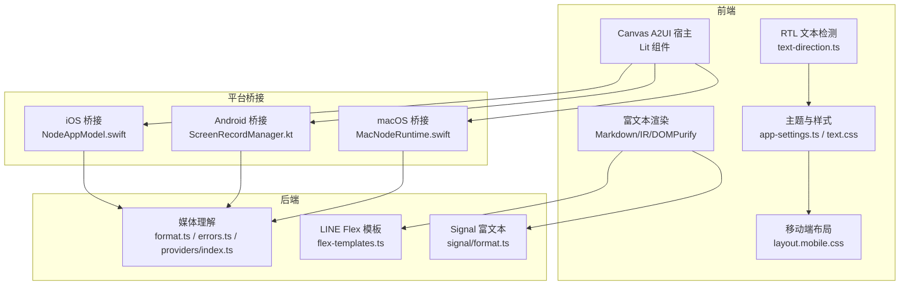
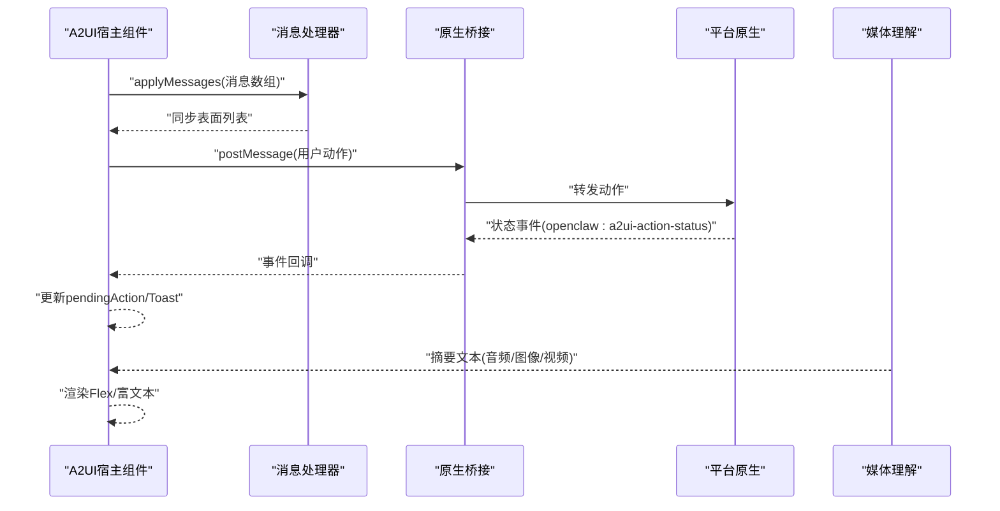
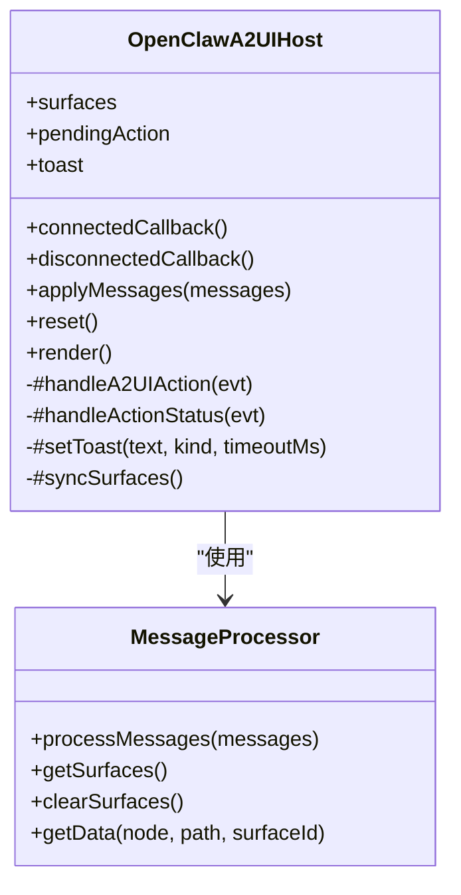
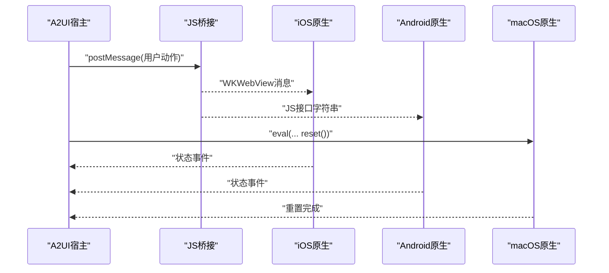
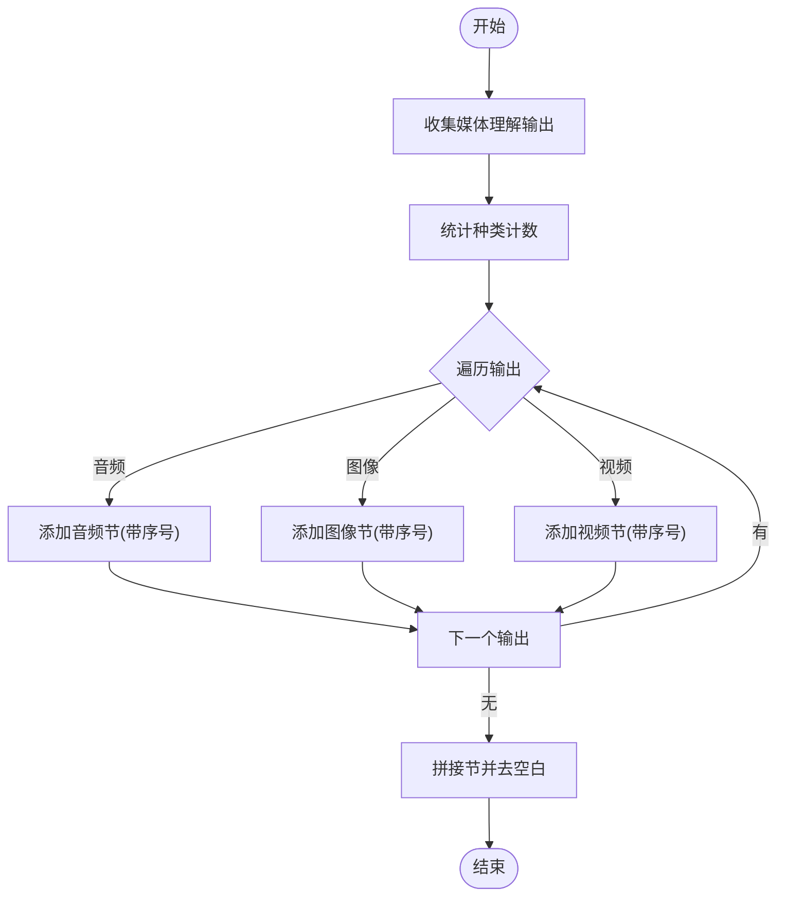
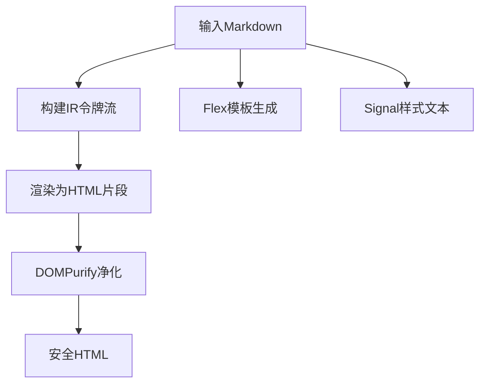
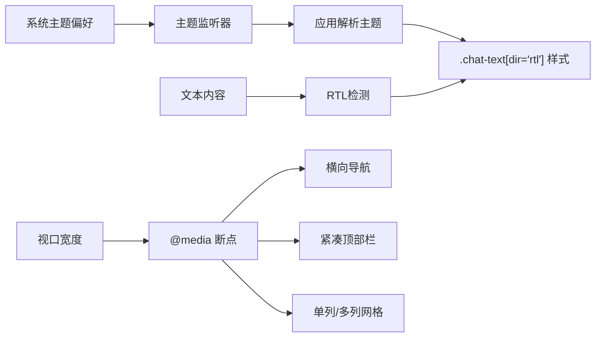
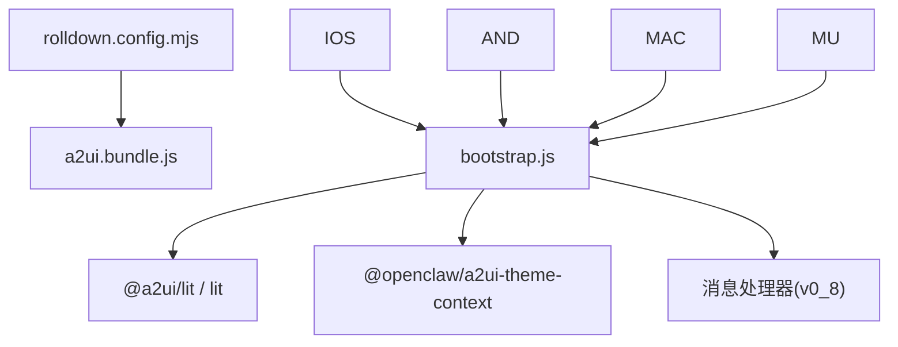

# 工具显示系统

<cite>
**本文档引用的文件**
- [apps/shared/OpenClawKit/Tools/CanvasA2UI/bootstrap.js](file://apps/shared/OpenClawKit/Tools/CanvasA2UI/bootstrap.js)
- [apps/shared/OpenClawKit/Tools/CanvasA2UI/rolldown.config.mjs](file://apps/shared/OpenClawKit/Tools/CanvasA2UI/rolldown.config.mjs)
- [apps/macos/Sources/OpenClaw/NodeMode/MacNodeRuntime.swift](file://apps/macos/Sources/OpenClaw/NodeMode/MacNodeRuntime.swift)
- [apps/ios/Sources/Model/NodeAppModel.swift](file://apps/ios/Sources/Model/NodeAppModel.swift)
- [apps/android/app/src/main/java/ai/openclaw/android/node/ScreenRecordManager.kt](file://apps/android/app/src/main/java/ai/openclaw/android/node/ScreenRecordManager.kt)
- [src/media-understanding/format.ts](file://src/media-understanding/format.ts)
- [src/media-understanding/errors.ts](file://src/media-understanding/errors.ts)
- [src/media-understanding/providers/index.ts](file://src/media-understanding/providers/index.ts)
- [src/line/flex-templates.ts](file://src/line/flex-templates.ts)
- [src/line/markdown-to-line.test.ts](file://src/line/markdown-to-line.test.ts)
- [src/signal/format.ts](file://src/signal/format.ts)
- [src/signal/format.test.ts](file://src/signal/format.test.ts)
- [src/markdown/ir.ts](file://src/markdown/ir.ts)
- [ui/src/ui/markdown.ts](file://ui/src/ui/markdown.ts)
- [ui/src/ui/text-direction.ts](file://ui/src/ui/text-direction.ts)
- [ui/src/styles/chat/text.css](file://ui/src/styles/chat/text.css)
- [ui/src/styles/layout.mobile.css](file://ui/src/styles/layout.mobile.css)
- [ui/src/ui/app-render.helpers.ts](file://ui/src/ui/app-render.helpers.ts)
- [ui/src/ui/app-settings.ts](file://ui/src/ui/app-settings.ts)
- [ui/src/ui/views/usageStyles.ts](file://ui/src/ui/views/usageStyles.ts)
</cite>

## 目录

1. [简介](#简介)
2. [项目结构](#项目结构)
3. [核心组件](#核心组件)
4. [架构总览](#架构总览)
5. [详细组件分析](#详细组件分析)
6. [依赖关系分析](#依赖关系分析)
7. [性能考量](#性能考量)
8. [故障排查指南](#故障排查指南)
9. [结论](#结论)
10. [附录](#附录)

## 简介

本文件面向OpenClaw工具显示系统，聚焦以下目标：

- 工具结果展示机制与消息处理流水线
- 图像处理与多媒体内容理解、渲染与格式化
- 富文本格式化与跨平台适配（含RTL）
- 响应式布局与主题切换
- 显示配置选项、样式定制与无障碍访问
- 显示组件开发指南与性能优化建议

## 项目结构

OpenClaw的显示系统由前端Web组件、跨平台原生桥接、以及后端媒体理解与富文本处理模块共同组成。关键路径如下：

- Canvas A2UI宿主：基于Web Components与Lit，负责接收消息并渲染交互界面
- 平台桥接：iOS/Android/macOS通过原生代码与JS桥通信，转发用户动作与状态
- 媒体理解：对音频/视频/图片进行理解与摘要生成
- 富文本与模板：将结构化输出转为各渠道可渲染的富文本或Flex卡片
- UI样式与布局：主题切换、RTL支持、移动端自适应

**图表来源**

- [apps/shared/OpenClawKit/Tools/CanvasA2UI/bootstrap.js](file://apps/shared/OpenClawKit/Tools/CanvasA2UI/bootstrap.js#L154-L490)
- [apps/ios/Sources/Model/NodeAppModel.swift](file://apps/ios/Sources/Model/NodeAppModel.swift#L188-L217)
- [apps/android/app/src/main/java/ai/openclaw/android/node/ScreenRecordManager.kt](file://apps/android/app/src/main/java/ai/openclaw/android/node/ScreenRecordManager.kt#L179-L199)
- [apps/macos/Sources/OpenClaw/NodeMode/MacNodeRuntime.swift](file://apps/macos/Sources/OpenClaw/NodeMode/MacNodeRuntime.swift#L342-L354)
- [src/media-understanding/format.ts](file://src/media-understanding/format.ts#L47-L98)
- [src/media-understanding/errors.ts](file://src/media-understanding/errors.ts#L1-L15)
- [src/media-understanding/providers/index.ts](file://src/media-understanding/providers/index.ts#L29-L58)
- [src/line/flex-templates.ts](file://src/line/flex-templates.ts#L31-L1446)
- [src/signal/format.ts](file://src/signal/format.ts#L210-L238)
- [ui/src/ui/markdown.ts](file://ui/src/ui/markdown.ts#L193-L209)
- [ui/src/ui/text-direction.ts](file://ui/src/ui/text-direction.ts#L16-L30)
- [ui/src/styles/chat/text.css](file://ui/src/styles/chat/text.css#L126-L144)
- [ui/src/styles/layout.mobile.css](file://ui/src/styles/layout.mobile.css#L1-L91)

**章节来源**

- [apps/shared/OpenClawKit/Tools/CanvasA2UI/bootstrap.js](file://apps/shared/OpenClawKit/Tools/CanvasA2UI/bootstrap.js#L1-L491)
- [apps/shared/OpenClawKit/Tools/CanvasA2UI/rolldown.config.mjs](file://apps/shared/OpenClawKit/Tools/CanvasA2UI/rolldown.config.mjs#L1-L45)

## 核心组件

- Canvas A2UI宿主组件：负责接收消息、构建表面（surfaces）、渲染状态提示与Toast、派发用户动作到原生桥接层
- 平台桥接层：iOS/Android/macOS分别实现原生消息通道与动作回调，驱动宿主更新
- 媒体理解与摘要：按类型生成统一摘要文本，支持错误分类与能力注册
- 富文本与模板：Markdown IR解析、DOMPurify净化、LINE Flex卡片、Signal富文本样式
- UI主题与布局：主题切换监听、RTL检测与样式、移动端断点

**章节来源**

- [apps/shared/OpenClawKit/Tools/CanvasA2UI/bootstrap.js](file://apps/shared/OpenClawKit/Tools/CanvasA2UI/bootstrap.js#L154-L490)
- [apps/ios/Sources/Model/NodeAppModel.swift](file://apps/ios/Sources/Model/NodeAppModel.swift#L188-L217)
- [apps/android/app/src/main/java/ai/openclaw/android/node/ScreenRecordManager.kt](file://apps/android/app/src/main/java/ai/openclaw/android/node/ScreenRecordManager.kt#L179-L199)
- [apps/macos/Sources/OpenClaw/NodeMode/MacNodeRuntime.swift](file://apps/macos/Sources/OpenClaw/NodeMode/MacNodeRuntime.swift#L342-L354)
- [src/media-understanding/format.ts](file://src/media-understanding/format.ts#L47-L98)
- [src/media-understanding/errors.ts](file://src/media-understanding/errors.ts#L1-L15)
- [src/media-understanding/providers/index.ts](file://src/media-understanding/providers/index.ts#L29-L58)
- [src/line/flex-templates.ts](file://src/line/flex-templates.ts#L31-L1446)
- [src/signal/format.ts](file://src/signal/format.ts#L210-L238)
- [ui/src/ui/markdown.ts](file://ui/src/ui/markdown.ts#L193-L209)
- [ui/src/ui/text-direction.ts](file://ui/src/ui/text-direction.ts#L16-L30)
- [ui/src/styles/chat/text.css](file://ui/src/styles/chat/text.css#L126-L144)
- [ui/src/styles/layout.mobile.css](file://ui/src/styles/layout.mobile.css#L1-L91)

## 架构总览

显示系统采用“消息驱动 + 平台桥接”的分层架构：

- 前端A2UI宿主通过消息处理器维护多个“表面”，每个表面包含若干组件
- 用户动作通过事件冒泡到宿主，宿主构造标准化动作对象并通过原生桥发送
- 原生侧接收动作后执行对应逻辑，并通过状态事件回传给前端
- 后端媒体理解模块提供统一的摘要文本，前端再根据渠道需求生成富文本或Flex卡片

**图表来源**

- [apps/shared/OpenClawKit/Tools/CanvasA2UI/bootstrap.js](file://apps/shared/OpenClawKit/Tools/CanvasA2UI/bootstrap.js#L276-L331)
- [apps/ios/Sources/Model/NodeAppModel.swift](file://apps/ios/Sources/Model/NodeAppModel.swift#L188-L217)
- [apps/android/app/src/main/java/ai/openclaw/android/node/ScreenRecordManager.kt](file://apps/android/app/src/main/java/ai/openclaw/android/node/ScreenRecordManager.kt#L179-L199)
- [apps/macos/Sources/OpenClaw/NodeMode/MacNodeRuntime.swift](file://apps/macos/Sources/OpenClaw/NodeMode/MacNodeRuntime.swift#L342-L354)
- [src/media-understanding/format.ts](file://src/media-understanding/format.ts#L47-L98)

## 详细组件分析

### Canvas A2UI宿主组件

- 职责：接收消息、构建表面、渲染状态与Toast、派发用户动作、管理主题上下文
- 关键流程：
  - 接收消息：校验数组，调用处理器处理并同步表面
  - 渲染：空态提示、状态条、Toast、表面网格
  - 动作派发：收集上下文、构造动作对象、通过桥接发送
  - 状态监听：订阅状态事件，更新pendingAction与Toast

**图表来源**

- [apps/shared/OpenClawKit/Tools/CanvasA2UI/bootstrap.js](file://apps/shared/OpenClawKit/Tools/CanvasA2UI/bootstrap.js#L154-L490)

**章节来源**

- [apps/shared/OpenClawKit/Tools/CanvasA2UI/bootstrap.js](file://apps/shared/OpenClawKit/Tools/CanvasA2UI/bootstrap.js#L154-L490)

### 平台桥接层

- iOS：解析用户动作字典，提取动作名与ID，定位源组件所在表面，转发到原生服务
- Android：解析参数字符串，估算码率，用于屏幕录制等场景
- macOS：通过CanvasManager在指定会话中执行JavaScript，重置A2UI宿主

**图表来源**

- [apps/ios/Sources/Model/NodeAppModel.swift](file://apps/ios/Sources/Model/NodeAppModel.swift#L188-L217)
- [apps/android/app/src/main/java/ai/openclaw/android/node/ScreenRecordManager.kt](file://apps/android/app/src/main/java/ai/openclaw/android/node/ScreenRecordManager.kt#L179-L199)
- [apps/macos/Sources/OpenClaw/NodeMode/MacNodeRuntime.swift](file://apps/macos/Sources/OpenClaw/NodeMode/MacNodeRuntime.swift#L342-L354)

**章节来源**

- [apps/ios/Sources/Model/NodeAppModel.swift](file://apps/ios/Sources/Model/NodeAppModel.swift#L188-L217)
- [apps/android/app/src/main/java/ai/openclaw/android/node/ScreenRecordManager.kt](file://apps/android/app/src/main/java/ai/openclaw/android/node/ScreenRecordManager.kt#L179-L199)
- [apps/macos/Sources/OpenClaw/NodeMode/MacNodeRuntime.swift](file://apps/macos/Sources/OpenClaw/NodeMode/MacNodeRuntime.swift#L342-L354)

### 媒体理解与摘要生成

- 输入：多路媒体理解输出（音频转写、图像描述、视频描述）
- 处理：统计种类数量与序号，生成带后缀的标题；音频/图像/视频分别映射到对应节
- 输出：拼接后的摘要文本，供渠道渲染

**图表来源**

- [src/media-understanding/format.ts](file://src/media-understanding/format.ts#L47-L98)

**章节来源**

- [src/media-understanding/format.ts](file://src/media-understanding/format.ts#L47-L98)
- [src/media-understanding/errors.ts](file://src/media-understanding/errors.ts#L1-L15)
- [src/media-understanding/providers/index.ts](file://src/media-understanding/providers/index.ts#L29-L58)

### 富文本与模板渲染

- Markdown IR：解析内联样式（粗体、斜体、删除线、行内代码、Spoiler），链接栈处理
- DOMPurify净化：仅允许白名单标签与属性，避免XSS
- LINE Flex卡片：信息卡、列表卡、带图英雄区、控制按钮网格布局
- Signal富文本：将Markdown转为带样式的纯文本与样式范围，支持分块

**图表来源**

- [src/markdown/ir.ts](file://src/markdown/ir.ts#L512-L559)
- [ui/src/ui/markdown.ts](file://ui/src/ui/markdown.ts#L193-L209)
- [src/line/flex-templates.ts](file://src/line/flex-templates.ts#L31-L1446)
- [src/signal/format.ts](file://src/signal/format.ts#L210-L238)

**章节来源**

- [src/markdown/ir.ts](file://src/markdown/ir.ts#L512-L559)
- [ui/src/ui/markdown.ts](file://ui/src/ui/markdown.ts#L193-L209)
- [src/line/flex-templates.ts](file://src/line/flex-templates.ts#L31-L1446)
- [src/signal/format.ts](file://src/signal/format.ts#L210-L238)
- [src/signal/format.test.ts](file://src/signal/format.test.ts#L1-L36)

### 主题、RTL与响应式布局

- 主题切换：监听系统偏好变化，提供系统/浅色/深色三态切换
- RTL检测：基于Unicode脚本属性识别文本方向，应用对应样式
- 移动端布局：断点适配导航、顶部栏、图表与网格布局

**图表来源**

- [ui/src/ui/app-settings.ts](file://ui/src/ui/app-settings.ts#L282-L317)
- [ui/src/ui/text-direction.ts](file://ui/src/ui/text-direction.ts#L16-L30)
- [ui/src/styles/chat/text.css](file://ui/src/styles/chat/text.css#L126-L144)
- [ui/src/styles/layout.mobile.css](file://ui/src/styles/layout.mobile.css#L1-L91)
- [ui/src/ui/views/usageStyles.ts](file://ui/src/ui/views/usageStyles.ts#L1872-L1910)

**章节来源**

- [ui/src/ui/app-settings.ts](file://ui/src/ui/app-settings.ts#L282-L317)
- [ui/src/ui/text-direction.ts](file://ui/src/ui/text-direction.ts#L16-L30)
- [ui/src/styles/chat/text.css](file://ui/src/styles/chat/text.css#L126-L144)
- [ui/src/styles/layout.mobile.css](file://ui/src/styles/layout.mobile.css#L1-L91)
- [ui/src/ui/views/usageStyles.ts](file://ui/src/ui/views/usageStyles.ts#L1872-L1910)

## 依赖关系分析

- 构建与打包：Rollup配置别名指向a2ui/lit与主题上下文，输出ESM bundle
- 组件耦合：A2UI宿主依赖消息处理器与Lit上下文；平台桥接依赖宿主暴露的API
- 数据流：媒体理解输出经格式化后进入消息处理器，最终由宿主渲染

**图表来源**

- [apps/shared/OpenClawKit/Tools/CanvasA2UI/rolldown.config.mjs](file://apps/shared/OpenClawKit/Tools/CanvasA2UI/rolldown.config.mjs#L1-L45)
- [apps/shared/OpenClawKit/Tools/CanvasA2UI/bootstrap.js](file://apps/shared/OpenClawKit/Tools/CanvasA2UI/bootstrap.js#L1-L491)

**章节来源**

- [apps/shared/OpenClawKit/Tools/CanvasA2UI/rolldown.config.mjs](file://apps/shared/OpenClawKit/Tools/CanvasA2UI/rolldown.config.mjs#L1-L45)
- [apps/shared/OpenClawKit/Tools/CanvasA2UI/bootstrap.js](file://apps/shared/OpenClawKit/Tools/CanvasA2UI/bootstrap.js#L1-L491)

## 性能考量

- 渲染优化
  - 使用Lit的repeat指令与requestUpdate减少重绘
  - 避免在活跃流式渲染时清空工具流，防止闪烁与重复
- 富文本
  - 流式内容禁用缓存，DOMPurify白名单过滤
  - 分块渲染Signal富文本，控制单次传输大小
- 媒体理解
  - 对超大/超时/不支持/空内容进行跳过与错误分类
  - 提供能力注册表，按需覆盖默认提供者
- 移动端
  - 使用@media断点，减少复杂阴影与滤镜以降低合成开销
  - 横向滚动容器启用硬件加速滚动

[本节为通用指导，无需列出具体文件来源]

## 故障排查指南

- A2UI动作失败
  - 检查原生桥是否可用（缺失桥会设置错误状态与Toast）
  - 核对动作名称与上下文键值是否存在
- 媒体理解异常
  - 捕获MediaUnderstandingSkipError，区分最大字节数、超时、不支持、空内容等原因
  - 校验提供者ID规范化与注册表覆盖逻辑
- 富文本渲染问题
  - 确认DOMPurify白名单与标记库版本一致
  - 检查Markdown IR中未闭合的样式标记，必要时进行补丁
- RTL与主题
  - 确保dir属性正确设置，RTL样式生效
  - 检查系统主题监听器绑定与解绑逻辑

**章节来源**

- [apps/shared/OpenClawKit/Tools/CanvasA2UI/bootstrap.js](file://apps/shared/OpenClawKit/Tools/CanvasA2UI/bootstrap.js#L402-L422)
- [src/media-understanding/errors.ts](file://src/media-understanding/errors.ts#L1-L15)
- [src/media-understanding/providers/index.ts](file://src/media-understanding/providers/index.ts#L29-L58)
- [ui/src/ui/markdown.ts](file://ui/src/ui/markdown.ts#L193-L209)
- [ui/src/ui/text-direction.ts](file://ui/src/ui/text-direction.ts#L16-L30)
- [ui/src/ui/app-settings.ts](file://ui/src/ui/app-settings.ts#L282-L317)

## 结论

OpenClaw工具显示系统通过A2UI宿主组件与平台桥接，实现了跨端的消息驱动渲染；结合媒体理解与富文本模板，能够将多模态输出转化为各渠道友好的展示形式。配合主题、RTL与移动端断点，系统具备良好的可访问性与跨平台一致性。建议在实际开发中遵循组件职责分离、消息驱动与最小权限原则，持续优化渲染与网络传输性能。

[本节为总结性内容，无需列出具体文件来源]

## 附录

### 开发指南

- 组件开发
  - 使用Lit编写Web Components，确保属性声明与样式隔离
  - 通过ContextProvider注入主题上下文，保持视觉一致性
  - 在connectedCallback中注册事件监听，在disconnectedCallback中清理
- 消息处理
  - 严格校验消息数组与动作结构，避免空指针
  - 将上下文解析与数据获取解耦，便于测试与复用
- 平台桥接
  - iOS使用WKWebView消息处理器，Android使用JS接口字符串
  - macOS通过CanvasManager执行脚本，确保会话上下文正确
- 富文本与模板
  - 先构建IR，再净化，最后渲染，保证安全性
  - Flex模板与Signal样式需考虑不同渠道的限制与特性
- 样式与无障碍
  - 提供dir属性与RTL样式，确保阿拉伯语/希伯来语等文本正确显示
  - 使用aria-pressed/aria-label等属性提升可访问性
  - 为主题切换与断点提供明确的语义化类名

**章节来源**

- [apps/shared/OpenClawKit/Tools/CanvasA2UI/bootstrap.js](file://apps/shared/OpenClawKit/Tools/CanvasA2UI/bootstrap.js#L154-L490)
- [apps/ios/Sources/Model/NodeAppModel.swift](file://apps/ios/Sources/Model/NodeAppModel.swift#L188-L217)
- [apps/android/app/src/main/java/ai/openclaw/android/node/ScreenRecordManager.kt](file://apps/android/app/src/main/java/ai/openclaw/android/node/ScreenRecordManager.kt#L179-L199)
- [apps/macos/Sources/OpenClaw/NodeMode/MacNodeRuntime.swift](file://apps/macos/Sources/OpenClaw/NodeMode/MacNodeRuntime.swift#L342-L354)
- [src/line/flex-templates.ts](file://src/line/flex-templates.ts#L31-L1446)
- [src/signal/format.ts](file://src/signal/format.ts#L210-L238)
- [ui/src/ui/text-direction.ts](file://ui/src/ui/text-direction.ts#L16-L30)
- [ui/src/styles/chat/text.css](file://ui/src/styles/chat/text.css#L126-L144)
