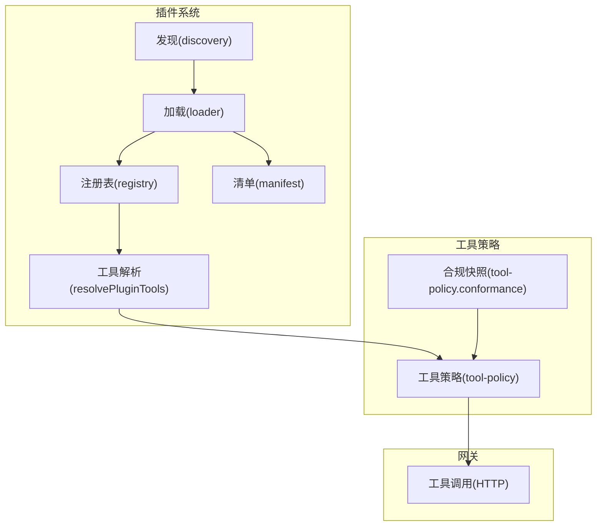
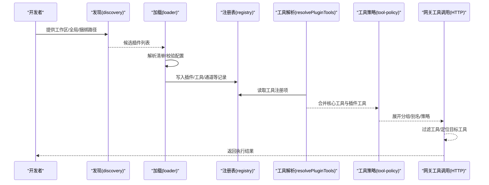
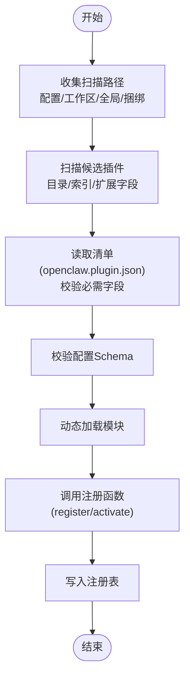
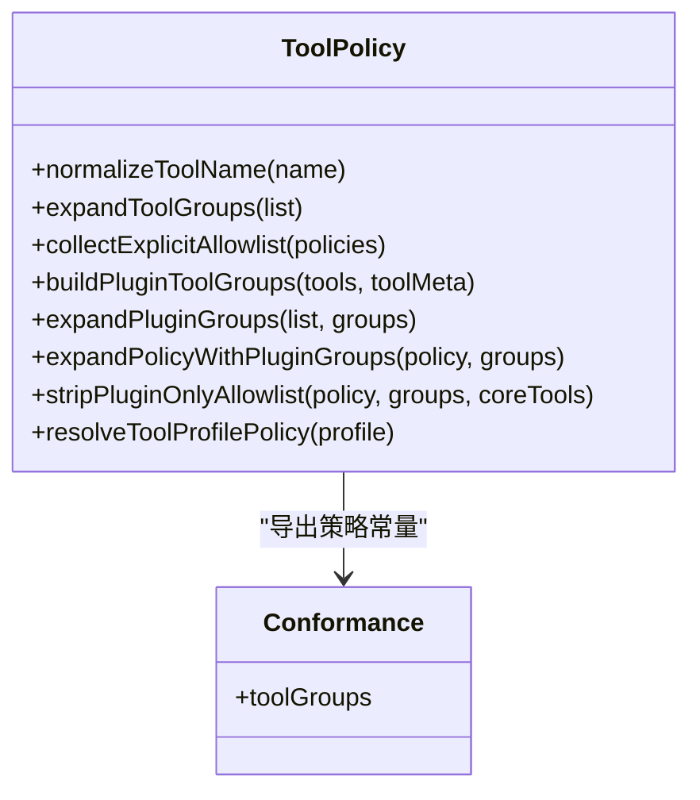
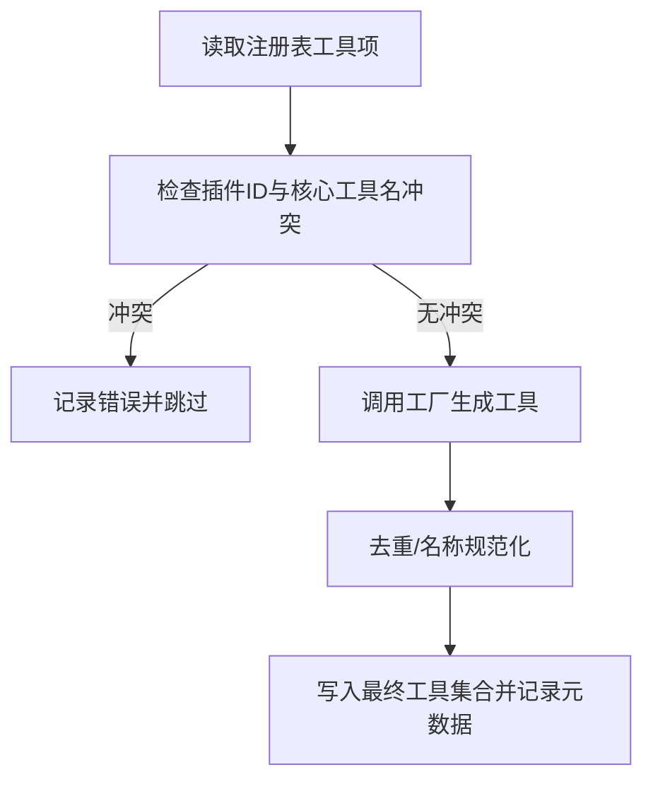
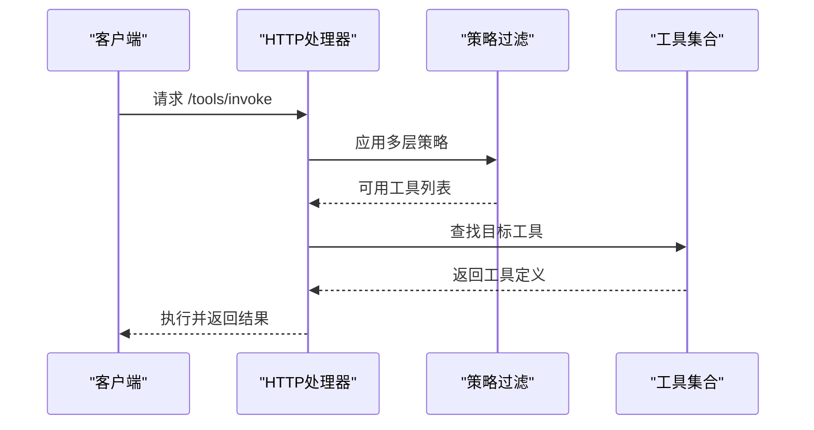
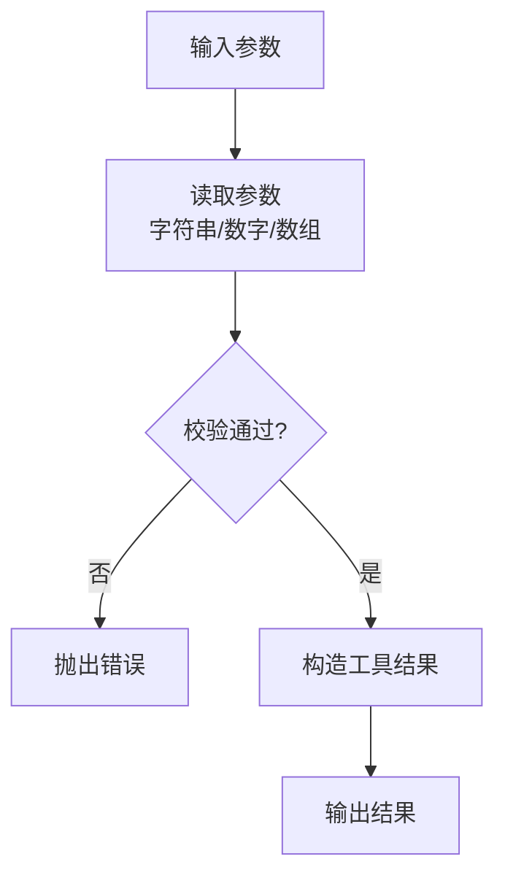
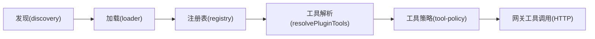

# 工具注册与管理

<cite>
**本文引用的文件**
- [src/plugins/tools.ts](file://src/plugins/tools.ts)
- [src/plugins/loader.ts](file://src/plugins/loader.ts)
- [src/plugins/discovery.ts](file://src/plugins/discovery.ts)
- [src/plugins/manifest.ts](file://src/plugins/manifest.ts)
- [src/plugins/registry.ts](file://src/plugins/registry.ts)
- [src/agents/tool-policy.ts](file://src/agents/tool-policy.ts)
- [src/agents/tool-policy.conformance.ts](file://src/agents/tool-policy.conformance.ts)
- [src/gateway/tools-invoke-http.ts](file://src/gateway/tools-invoke-http.ts)
- [src/agents/tools/common.ts](file://src/agents/tools/common.ts)
- [extensions/discord/openclaw.plugin.json](file://extensions/discord/openclaw.plugin.json)
- [extensions/telegram/openclaw.plugin.json](file://extensions/telegram/openclaw.plugin.json)
- [extensions/slack/openclaw.plugin.json](file://extensions/slack/openclaw.plugin.json)
</cite>

## 目录

1. [简介](#简介)
2. [项目结构](#项目结构)
3. [核心组件](#核心组件)
4. [架构总览](#架构总览)
5. [详细组件分析](#详细组件分析)
6. [依赖关系分析](#依赖关系分析)
7. [性能考量](#性能考量)
8. [故障排查指南](#故障排查指南)
9. [结论](#结论)
10. [附录](#附录)

## 简介

本文件面向OpenClaw工具注册与管理系统，系统性阐述工具注册机制、工具元数据定义、工具分类体系、工具发现流程、工具验证规则、工具版本管理，并覆盖浏览器工具、Web工具、通用工具的注册方式与配置选项。同时提供工具开发规范、命名约定、参数验证方法，以及工具注册示例与最佳实践。

## 项目结构

OpenClaw围绕“插件式工具生态”组织代码，核心模块包括：

- 插件发现与加载：负责扫描候选插件、解析清单、校验配置、动态加载并注册工具。
- 工具策略与分组：提供工具分组、别名、允许/拒绝列表、配置文件级策略等。
- 网关调用与过滤：在HTTP入口处按策略过滤可用工具并执行调用。
- 通用工具基元：提供参数读取、类型转换、结果封装等通用能力。

图表来源

- [src/plugins/discovery.ts](file://src/plugins/discovery.ts#L301-L365)
- [src/plugins/loader.ts](file://src/plugins/loader.ts#L170-L457)
- [src/plugins/registry.ts](file://src/plugins/registry.ts#L146-L516)
- [src/plugins/manifest.ts](file://src/plugins/manifest.ts#L44-L100)
- [src/plugins/tools.ts](file://src/plugins/tools.ts#L44-L139)
- [src/agents/tool-policy.ts](file://src/agents/tool-policy.ts#L1-L292)
- [src/agents/tool-policy.conformance.ts](file://src/agents/tool-policy.conformance.ts#L1-L17)
- [src/gateway/tools-invoke-http.ts](file://src/gateway/tools-invoke-http.ts#L275-L307)

章节来源

- [src/plugins/discovery.ts](file://src/plugins/discovery.ts#L1-L365)
- [src/plugins/loader.ts](file://src/plugins/loader.ts#L1-L457)
- [src/plugins/registry.ts](file://src/plugins/registry.ts#L1-L516)
- [src/plugins/manifest.ts](file://src/plugins/manifest.ts#L1-L152)
- [src/plugins/tools.ts](file://src/plugins/tools.ts#L1-L139)
- [src/agents/tool-policy.ts](file://src/agents/tool-policy.ts#L1-L292)
- [src/agents/tool-policy.conformance.ts](file://src/agents/tool-policy.conformance.ts#L1-L17)
- [src/gateway/tools-invoke-http.ts](file://src/gateway/tools-invoke-http.ts#L275-L307)

## 核心组件

- 插件发现器：从多源路径扫描候选插件，支持目录递归、包清单扩展字段、索引文件等。
- 插件加载器：解析清单、校验配置Schema、动态加载模块、调用注册函数、构建注册表。
- 注册表：统一记录插件、工具、通道、提供方、HTTP路由、命令等实体。
- 工具策略：定义工具分组、别名、配置文件策略、允许/拒绝列表展开与校验。
- 工具解析：合并核心工具与插件工具，处理名称冲突与可选工具白名单。
- 网关工具调用：按策略过滤工具，定位具体工具并执行。

章节来源

- [src/plugins/discovery.ts](file://src/plugins/discovery.ts#L301-L365)
- [src/plugins/loader.ts](file://src/plugins/loader.ts#L170-L457)
- [src/plugins/registry.ts](file://src/plugins/registry.ts#L146-L516)
- [src/plugins/tools.ts](file://src/plugins/tools.ts#L44-L139)
- [src/agents/tool-policy.ts](file://src/agents/tool-policy.ts#L1-L292)
- [src/gateway/tools-invoke-http.ts](file://src/gateway/tools-invoke-http.ts#L275-L307)

## 架构总览

下图展示从“发现候选插件”到“网关调用工具”的完整链路，以及策略过滤的关键节点。

图表来源

- [src/plugins/discovery.ts](file://src/plugins/discovery.ts#L301-L365)
- [src/plugins/loader.ts](file://src/plugins/loader.ts#L170-L457)
- [src/plugins/registry.ts](file://src/plugins/registry.ts#L146-L516)
- [src/plugins/tools.ts](file://src/plugins/tools.ts#L44-L139)
- [src/agents/tool-policy.ts](file://src/agents/tool-policy.ts#L135-L147)
- [src/gateway/tools-invoke-http.ts](file://src/gateway/tools-invoke-http.ts#L275-L307)

## 详细组件分析

### 组件A：插件发现与加载

- 发现阶段：支持配置路径、工作区、全局、捆绑目录，自动识别包清单中的扩展字段或索引文件。
- 加载阶段：解析清单、校验配置Schema、动态加载模块、调用注册函数、记录诊断信息。
- 注册阶段：统一写入插件、工具、通道、提供方、HTTP路由、命令等实体，便于后续查询与调用。

图表来源

- [src/plugins/discovery.ts](file://src/plugins/discovery.ts#L301-L365)
- [src/plugins/loader.ts](file://src/plugins/loader.ts#L200-L441)
- [src/plugins/manifest.ts](file://src/plugins/manifest.ts#L44-L100)
- [src/plugins/registry.ts](file://src/plugins/registry.ts#L146-L516)

章节来源

- [src/plugins/discovery.ts](file://src/plugins/discovery.ts#L1-L365)
- [src/plugins/loader.ts](file://src/plugins/loader.ts#L1-L457)
- [src/plugins/manifest.ts](file://src/plugins/manifest.ts#L1-L152)
- [src/plugins/registry.ts](file://src/plugins/registry.ts#L1-L516)

### 组件B：工具策略与分组

- 工具分组：内置多类分组（如内存、Web、文件系统、运行时、会话、UI、自动化、消息、节点、OpenClaw原生）。
- 别名映射：提供工具名称别名，保证兼容性。
- 配置文件策略：支持按配置文件定义的允许/拒绝列表，自动展开分组与别名。
- 合规快照：导出策略常量，用于CI检测策略漂移。

图表来源

- [src/agents/tool-policy.ts](file://src/agents/tool-policy.ts#L1-L292)
- [src/agents/tool-policy.conformance.ts](file://src/agents/tool-policy.conformance.ts#L1-L17)

章节来源

- [src/agents/tool-policy.ts](file://src/agents/tool-policy.ts#L1-L292)
- [src/agents/tool-policy.conformance.ts](file://src/agents/tool-policy.conformance.ts#L1-L17)

### 组件C：工具解析与冲突处理

- 合并核心工具与插件工具，处理名称冲突与可选工具白名单。
- 对插件工具进行工厂调用，生成最终工具集合。
- 记录诊断信息，便于问题定位。

图表来源

- [src/plugins/tools.ts](file://src/plugins/tools.ts#L74-L139)
- [src/plugins/registry.ts](file://src/plugins/registry.ts#L168-L193)

章节来源

- [src/plugins/tools.ts](file://src/plugins/tools.ts#L1-L139)
- [src/plugins/registry.ts](file://src/plugins/registry.ts#L1-L516)

### 组件D：网关工具调用与策略过滤

- 在HTTP入口处按策略过滤工具，确保只暴露允许的工具。
- 支持多层策略叠加（个人/群组/全局/提供方/代理等），最终定位目标工具并执行。

图表来源

- [src/gateway/tools-invoke-http.ts](file://src/gateway/tools-invoke-http.ts#L275-L307)

章节来源

- [src/gateway/tools-invoke-http.ts](file://src/gateway/tools-invoke-http.ts#L275-L307)

### 组件E：通用工具基元与参数验证

- 提供字符串、数字、数组等参数读取与校验工具，支持必填、去空、整数等约束。
- 提供图片/文本结果封装，统一媒体处理流程。

图表来源

- [src/agents/tools/common.ts](file://src/agents/tools/common.ts#L33-L160)
- [src/agents/tools/common.ts](file://src/agents/tools/common.ts#L189-L244)

章节来源

- [src/agents/tools/common.ts](file://src/agents/tools/common.ts#L1-L244)

## 依赖关系分析

- 插件发现依赖文件系统扫描与包清单解析。
- 插件加载依赖清单校验、Schema校验与动态模块加载。
- 工具解析依赖注册表与策略模块。
- 网关工具调用依赖策略模块与工具集合。

图表来源

- [src/plugins/discovery.ts](file://src/plugins/discovery.ts#L301-L365)
- [src/plugins/loader.ts](file://src/plugins/loader.ts#L170-L457)
- [src/plugins/registry.ts](file://src/plugins/registry.ts#L146-L516)
- [src/plugins/tools.ts](file://src/plugins/tools.ts#L44-L139)
- [src/agents/tool-policy.ts](file://src/agents/tool-policy.ts#L135-L147)
- [src/gateway/tools-invoke-http.ts](file://src/gateway/tools-invoke-http.ts#L275-L307)

章节来源

- [src/plugins/discovery.ts](file://src/plugins/discovery.ts#L1-L365)
- [src/plugins/loader.ts](file://src/plugins/loader.ts#L1-L457)
- [src/plugins/registry.ts](file://src/plugins/registry.ts#L1-L516)
- [src/plugins/tools.ts](file://src/plugins/tools.ts#L1-L139)
- [src/agents/tool-policy.ts](file://src/agents/tool-policy.ts#L1-L292)
- [src/gateway/tools-invoke-http.ts](file://src/gateway/tools-invoke-http.ts#L275-L307)

## 性能考量

- 缓存：插件注册表支持缓存，避免重复扫描与加载。
- 快路径：当插件被禁用时，跳过发现与动态加载，加速单元测试与热路径。
- 并发：清单解析与模块加载采用异步流程，减少阻塞。
- 过滤：在HTTP入口处尽早过滤不可用工具，降低后续处理成本。

章节来源

- [src/plugins/loader.ts](file://src/plugins/loader.ts#L42-L83)
- [src/plugins/loader.ts](file://src/plugins/loader.ts#L49-L50)
- [src/gateway/tools-invoke-http.ts](file://src/gateway/tools-invoke-http.ts#L275-L277)

## 故障排查指南

- 插件未加载：检查清单是否存在、id与configSchema是否满足要求；查看诊断日志中的错误信息。
- 配置不合法：确认配置Schema校验失败原因，修正字段类型与必填项。
- 工具名称冲突：插件工具与核心工具或其它插件工具名称冲突时会被跳过并记录错误。
- 策略导致工具不可见：检查允许/拒绝列表与分组展开逻辑，确认是否被策略过滤。
- 网关找不到工具：确认工具名称大小写与别名映射，核对策略过滤后的可用工具集合。

章节来源

- [src/plugins/loader.ts](file://src/plugins/loader.ts#L283-L295)
- [src/plugins/loader.ts](file://src/plugins/loader.ts#L367-L386)
- [src/plugins/tools.ts](file://src/plugins/tools.ts#L114-L134)
- [src/agents/tool-policy.ts](file://src/agents/tool-policy.ts#L135-L147)
- [src/gateway/tools-invoke-http.ts](file://src/gateway/tools-invoke-http.ts#L300-L307)

## 结论

OpenClaw通过“插件发现—加载—注册—策略—调用”的完整链路，实现了灵活、可扩展且安全的工具注册与管理体系。借助清单与Schema的强约束、策略的分层控制与严格的冲突处理，系统在易用性与安全性之间取得平衡。建议在开发新工具时遵循命名约定、参数验证与配置Schema规范，以获得更好的集成体验。

## 附录

### 工具注册机制与元数据定义

- 清单文件：openclaw.plugin.json，包含id、configSchema、kind、channels/providers/skills等元数据。
- 元数据字段说明：
  - id：插件唯一标识，必须存在且非空。
  - configSchema：JSON Schema，用于校验插件配置。
  - kind：插件类型（如memory等）。
  - channels/providers/skills：关联的通道/提供方/技能标识列表。
- 示例清单文件：
  - [extensions/discord/openclaw.plugin.json](file://extensions/discord/openclaw.plugin.json#L1-L10)
  - [extensions/telegram/openclaw.plugin.json](file://extensions/telegram/openclaw.plugin.json#L1-L10)
  - [extensions/slack/openclaw.plugin.json](file://extensions/slack/openclaw.plugin.json#L1-L10)

章节来源

- [src/plugins/manifest.ts](file://src/plugins/manifest.ts#L10-L25)
- [src/plugins/manifest.ts](file://src/plugins/manifest.ts#L44-L100)
- [extensions/discord/openclaw.plugin.json](file://extensions/discord/openclaw.plugin.json#L1-L10)
- [extensions/telegram/openclaw.plugin.json](file://extensions/telegram/openclaw.plugin.json#L1-L10)
- [extensions/slack/openclaw.plugin.json](file://extensions/slack/openclaw.plugin.json#L1-L10)

### 工具分类体系

- 分组定义：group:memory、group:web、group:fs、group:runtime、group:sessions、group:ui、group:automation、group:messaging、group:nodes、group:openclaw。
- 配置文件策略：支持allow/deny列表，自动展开分组与别名。
- 策略应用：在工具解析与网关调用阶段生效。

章节来源

- [src/agents/tool-policy.ts](file://src/agents/tool-policy.ts#L15-L59)
- [src/agents/tool-policy.ts](file://src/agents/tool-policy.ts#L135-L147)
- [src/agents/tool-policy.ts](file://src/agents/tool-policy.ts#L276-L291)

### 工具发现流程

- 路径来源：配置路径、工作区扩展目录、全局扩展目录、捆绑扩展目录。
- 扫描策略：支持目录递归、包清单扩展字段、索引文件。
- 候选生成：根据文件扩展名与包清单决定候选插件。

章节来源

- [src/plugins/discovery.ts](file://src/plugins/discovery.ts#L301-L365)

### 工具验证规则

- 清单校验：id与configSchema为必需字段，类型需为对象。
- 配置Schema校验：使用JSON Schema进行校验，错误信息记录在诊断中。
- 工具名称规范化：统一转小写与别名映射，避免大小写与拼写差异。

章节来源

- [src/plugins/manifest.ts](file://src/plugins/manifest.ts#L62-L69)
- [src/plugins/loader.ts](file://src/plugins/loader.ts#L367-L386)
- [src/agents/tool-policy.ts](file://src/agents/tool-policy.ts#L82-L89)

### 工具版本管理

- 版本信息来源于清单文件的version字段，加载器在记录插件记录时同步保存。
- 插件记录包含id、name、version、description等元数据，便于追踪与诊断。

章节来源

- [src/plugins/loader.ts](file://src/plugins/loader.ts#L260-L270)
- [src/plugins/manifest.ts](file://src/plugins/manifest.ts#L73-L74)

### 浏览器工具、Web工具、通用工具的注册方式与配置选项

- 浏览器工具：通过UI提示提及Chrome扩展中继，参数Schema保持OpenAI兼容风格，保留必要属性与必填项。
- Web工具：默认启用抓取工具（非沙箱环境），可通过配置开关与超时、缓存等参数调整。
- 通用工具：通过插件注册API注册工具，支持名称规范化与可选工具白名单。

章节来源

- [src/plugins/tools.ts](file://src/plugins/tools.ts#L102-L110)
- [src/agents/pi-tools.create-openclaw-coding-tools.adds-claude-style-aliases-schemas-without-dropping.test.ts](file://src/agents/pi-tools.create-openclaw-coding-tools.adds-claude-style-aliases-schemas-without-dropping.test.ts#L78-L105)
- [src/agents/tools/web-tools.enabled-defaults.test.ts](file://src/agents/tools/web-tools.enabled-defaults.test.ts#L1-L48)

### 工具开发规范、命名约定、参数验证

- 命名约定：工具名称统一小写，必要时使用别名映射；插件ID与工具名冲突将被拒绝。
- 参数验证：使用通用工具基元读取与校验参数，支持必填、去空、整数等约束。
- 结果封装：统一使用文本与图片结果封装，确保媒体内容安全与格式一致。

章节来源

- [src/agents/tool-policy.ts](file://src/agents/tool-policy.ts#L82-L89)
- [src/agents/tools/common.ts](file://src/agents/tools/common.ts#L33-L160)
- [src/agents/tools/common.ts](file://src/agents/tools/common.ts#L189-L244)

### 工具注册示例与最佳实践

- 示例清单：参考频道插件的最小化清单，包含id与空配置Schema。
- 最佳实践：
  - 使用清晰的id与简短描述，确保configSchema完整覆盖所有配置项。
  - 在工具注册时提供明确的名称与参数Schema，便于策略与UI提示。
  - 将可选工具纳入白名单管理，避免误启用高风险工具。
  - 在开发阶段开启严格参数校验，减少运行期错误。

章节来源

- [extensions/discord/openclaw.plugin.json](file://extensions/discord/openclaw.plugin.json#L1-L10)
- [extensions/telegram/openclaw.plugin.json](file://extensions/telegram/openclaw.plugin.json#L1-L10)
- [extensions/slack/openclaw.plugin.json](file://extensions/slack/openclaw.plugin.json#L1-L10)
- [src/plugins/tools.ts](file://src/plugins/tools.ts#L102-L110)
- [src/agents/tools/common.ts](file://src/agents/tools/common.ts#L33-L160)
