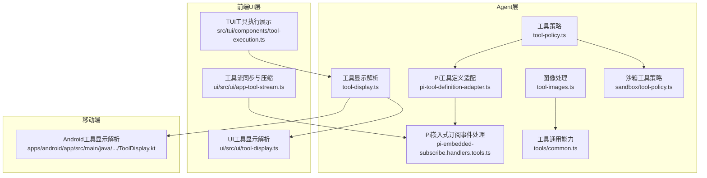
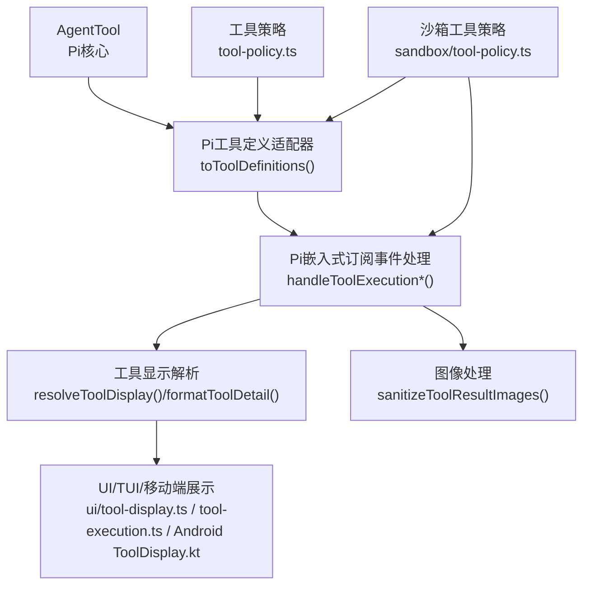
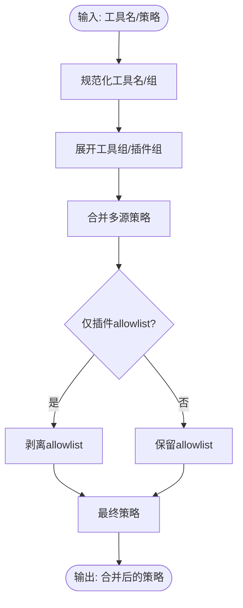
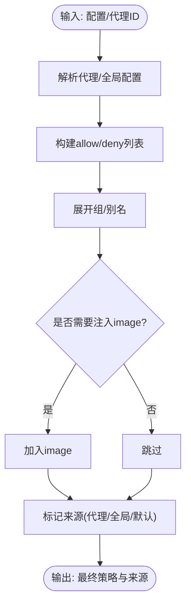
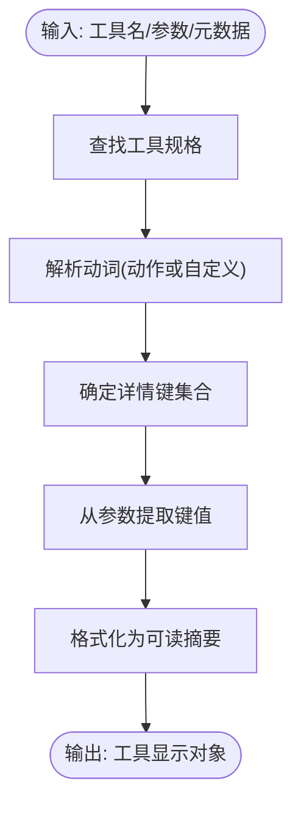
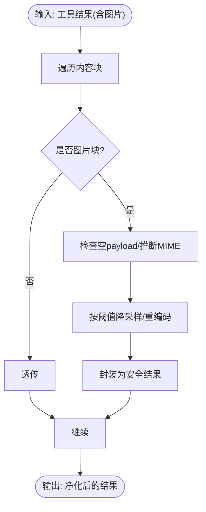
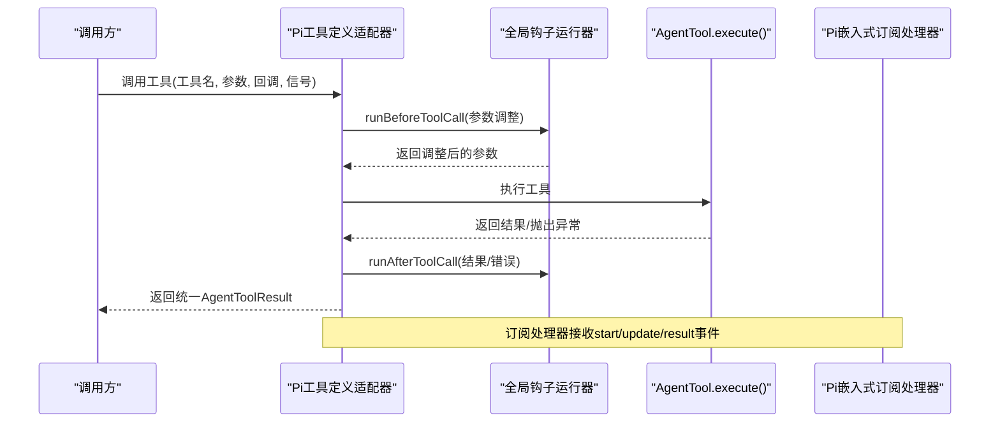
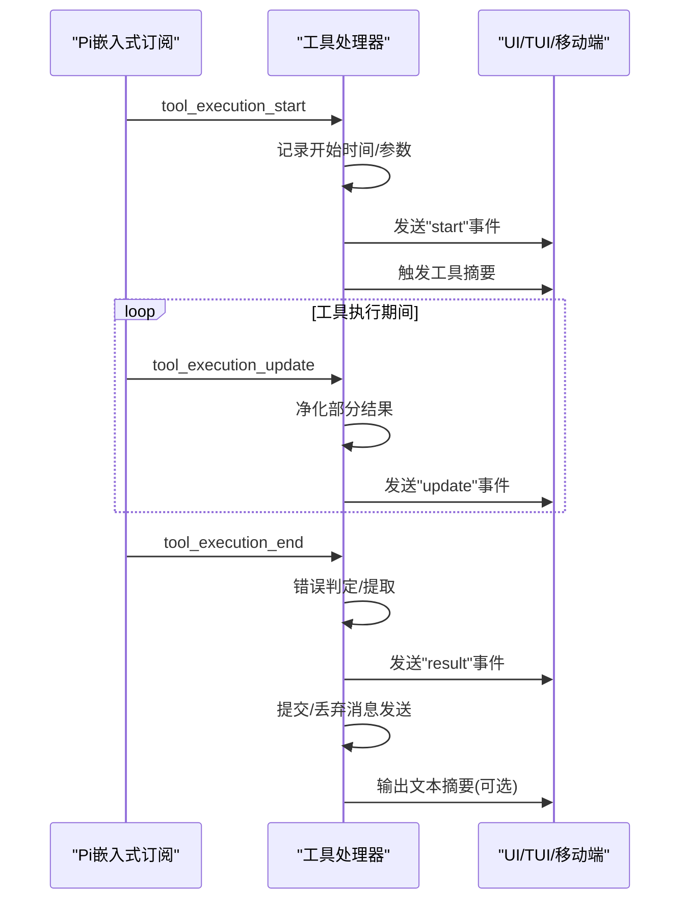
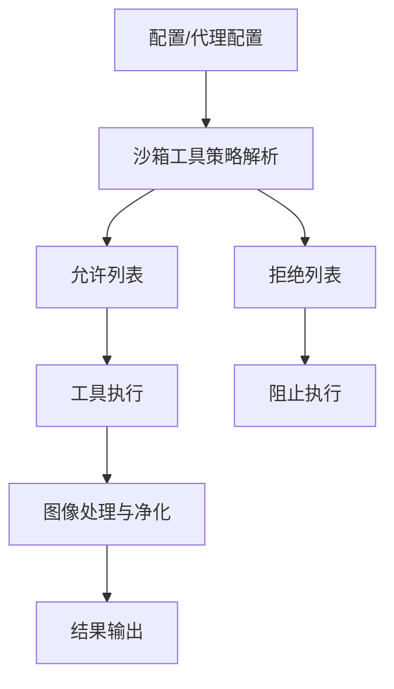
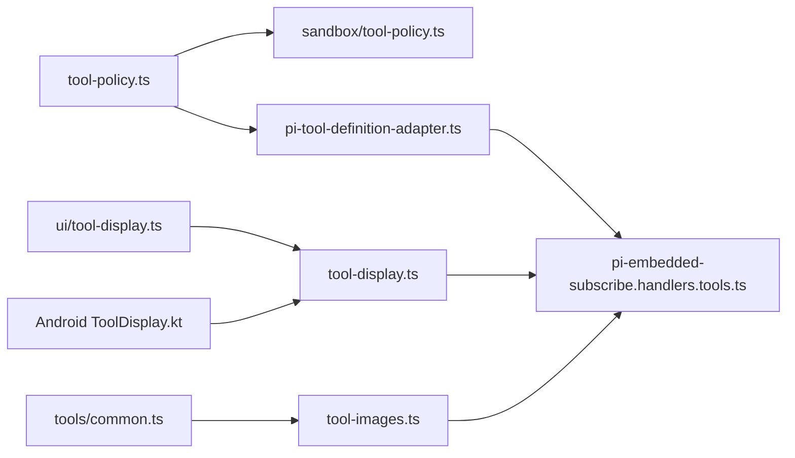

# 工具系统

<cite>
**本文引用的文件**
- [src/agents/tool-display.ts](file://src/agents/tool-display.ts)
- [src/agents/tool-display.json](file://src/agents/tool-display.json)
- [src/agents/tool-images.ts](file://src/agents/tool-images.ts)
- [src/agents/tool-policy.ts](file://src/agents/tool-policy.ts)
- [src/agents/sandbox/tool-policy.ts](file://src/agents/sandbox/tool-policy.ts)
- [src/agents/sandbox/types.ts](file://src/agents/sandbox/types.ts)
- [src/agents/pi-tool-definition-adapter.ts](file://src/agents/pi-tool-definition-adapter.ts)
- [src/agents/pi-embedded-subscribe.handlers.tools.ts](file://src/agents/pi-embedded-subscribe.handlers.tools.ts)
- [src/agents/tools/common.ts](file://src/agents/tools/common.ts)
- [apps/android/app/src/main/java/ai/openclaw/android/tools/ToolDisplay.kt](file://apps/android/app/src/main/java/ai/openclaw/android/tools/ToolDisplay.kt)
- [ui/src/ui/tool-display.ts](file://ui/src/ui/tool-display.ts)
- [src/tui/components/tool-execution.ts](file://src/tui/components/tool-execution.ts)
- [src/agents/pi-tools.create-openclaw-coding-tools.adds-claude-style-aliases-schemas-without-dropping-f.test.ts](file://src/agents/pi-tools.create-openclaw-coding-tools.adds-claude-style-aliases-schemas-without-dropping-f.test.ts)
- [src/agents/pi-tools.create-openclaw-coding-tools.adds-claude-style-aliases-schemas-without-dropping-b.test.ts](file://src/agents/pi-tools.create-openclaw-coding-tools.adds-claude-style-aliases-schemas-without-dropping-b.test.ts)
- [src/agents/pi-tools.create-openclaw-coding-tools.adds-claude-style-aliases-schemas-without-dropping-d.test.ts](file://src/agents/pi-tools.create-openclaw-coding-tools.adds-claude-style-aliases-schemas-without-dropping-d.test.ts)
- [apps/macos/Sources/OpenClaw/WorkActivityStore.swift](file://apps/macos/Sources/OpenClaw/WorkActivityStore.swift)
- [ui/src/ui/app-tool-stream.ts](file://ui/src/ui/app-tool-stream.ts)
</cite>

## 目录

1. [简介](#简介)
2. [项目结构](#项目结构)
3. [核心组件](#核心组件)
4. [架构总览](#架构总览)
5. [详细组件分析](#详细组件分析)
6. [依赖关系分析](#依赖关系分析)
7. [性能考量](#性能考量)
8. [故障排查指南](#故障排查指南)
9. [结论](#结论)
10. [附录](#附录)

## 简介

本文件面向OpenClaw工具系统，提供从架构设计到实现细节的全景式技术文档。内容覆盖工具注册与适配、执行流程与结果处理、工具策略与权限控制、沙箱隔离机制、工具显示与图像处理、工具摘要生成，以及Pi工具适配器、工具定义与调用协议。同时给出工具开发指南、最佳实践与性能优化建议，并提供工具执行流程图与安全边界示意图。

## 项目结构

OpenClaw工具系统横跨后端Agent层、前端UI层与移动端平台，核心模块分布如下：

- Agent层：工具策略、沙箱策略、工具显示、图像处理、工具定义适配、嵌入式Pi订阅事件处理等。
- 前端UI层：工具显示解析与摘要格式化、TUI工具执行展示、工具流同步与压缩。
- 移动端平台：Android侧工具显示解析与摘要展示。
- 测试与验证：对工具别名、模式匹配、工作区路径解析、图像元数据保留等进行测试。

**图表来源**

- [src/agents/tool-policy.ts](file://src/agents/tool-policy.ts#L1-L292)
- [src/agents/sandbox/tool-policy.ts](file://src/agents/sandbox/tool-policy.ts#L1-L143)
- [src/agents/tool-display.ts](file://src/agents/tool-display.ts#L1-L292)
- [src/agents/tool-images.ts](file://src/agents/tool-images.ts#L1-L224)
- [src/agents/pi-tool-definition-adapter.ts](file://src/agents/pi-tool-definition-adapter.ts#L1-L217)
- [src/agents/pi-embedded-subscribe.handlers.tools.ts](file://src/agents/pi-embedded-subscribe.handlers.tools.ts#L1-L319)
- [src/agents/tools/common.ts](file://src/agents/tools/common.ts#L1-L244)
- [ui/src/ui/tool-display.ts](file://ui/src/ui/tool-display.ts#L1-L61)
- [src/tui/components/tool-execution.ts](file://src/tui/components/tool-execution.ts#L1-L52)
- [ui/src/ui/app-tool-stream.ts](file://ui/src/ui/app-tool-stream.ts#L169-L211)
- [apps/android/app/src/main/java/ai/openclaw/android/tools/ToolDisplay.kt](file://apps/android/app/src/main/java/ai/openclaw/android/tools/ToolDisplay.kt#L1-L91)

**章节来源**

- [src/agents/tool-policy.ts](file://src/agents/tool-policy.ts#L1-L292)
- [src/agents/sandbox/tool-policy.ts](file://src/agents/sandbox/tool-policy.ts#L1-L143)
- [src/agents/tool-display.ts](file://src/agents/tool-display.ts#L1-L292)
- [src/agents/tool-images.ts](file://src/agents/tool-images.ts#L1-L224)
- [src/agents/pi-tool-definition-adapter.ts](file://src/agents/pi-tool-definition-adapter.ts#L1-L217)
- [src/agents/pi-embedded-subscribe.handlers.tools.ts](file://src/agents/pi-embedded-subscribe.handlers.tools.ts#L1-L319)
- [src/agents/tools/common.ts](file://src/agents/tools/common.ts#L1-L244)
- [ui/src/ui/tool-display.ts](file://ui/src/ui/tool-display.ts#L1-L61)
- [src/tui/components/tool-execution.ts](file://src/tui/components/tool-execution.ts#L1-L52)
- [ui/src/ui/app-tool-stream.ts](file://ui/src/ui/app-tool-stream.ts#L169-L211)
- [apps/android/app/src/main/java/ai/openclaw/android/tools/ToolDisplay.kt](file://apps/android/app/src/main/java/ai/openclaw/android/tools/ToolDisplay.kt#L1-L91)

## 核心组件

- 工具策略系统：支持工具组、别名、插件组扩展、显式白名单剥离与策略合并。
- 沙箱工具策略：基于允许/拒绝列表与通配符/正则匹配，支持默认集与多源合并。
- 工具显示系统：通过JSON配置映射工具名与动作，生成标题、标签、动词与详情摘要。
- 图像处理：自动缩放与重编码，满足外部模型API限制，保障会话稳健性。
- Pi工具适配器：统一AgentTool与ToolDefinition接口，注入钩子与错误归一化。
- 嵌入式Pi订阅事件处理：工具生命周期事件（开始/更新/结束）与摘要输出、消息发送追踪。
- 工具通用能力：参数读取、结果封装、图片结果构造与安全净化。

**章节来源**

- [src/agents/tool-policy.ts](file://src/agents/tool-policy.ts#L1-L292)
- [src/agents/sandbox/tool-policy.ts](file://src/agents/sandbox/tool-policy.ts#L1-L143)
- [src/agents/tool-display.ts](file://src/agents/tool-display.ts#L1-L292)
- [src/agents/tool-images.ts](file://src/agents/tool-images.ts#L1-L224)
- [src/agents/pi-tool-definition-adapter.ts](file://src/agents/pi-tool-definition-adapter.ts#L1-L217)
- [src/agents/pi-embedded-subscribe.handlers.tools.ts](file://src/agents/pi-embedded-subscribe.handlers.tools.ts#L1-L319)
- [src/agents/tools/common.ts](file://src/agents/tools/common.ts#L1-L244)

## 架构总览

下图展示了工具系统在Pi Agent生态中的位置与交互：工具定义经适配器转换为统一协议，Pi嵌入式订阅处理工具生命周期事件，工具显示与图像处理贯穿前后端，沙箱策略在执行前生效。

**图表来源**

- [src/agents/pi-tool-definition-adapter.ts](file://src/agents/pi-tool-definition-adapter.ts#L82-L173)
- [src/agents/pi-embedded-subscribe.handlers.tools.ts](file://src/agents/pi-embedded-subscribe.handlers.tools.ts#L46-L319)
- [src/agents/tool-display.ts](file://src/agents/tool-display.ts#L222-L292)
- [src/agents/tool-images.ts](file://src/agents/tool-images.ts#L211-L224)
- [src/agents/tool-policy.ts](file://src/agents/tool-policy.ts#L135-L147)
- [src/agents/sandbox/tool-policy.ts](file://src/agents/sandbox/tool-policy.ts#L71-L143)
- [ui/src/ui/tool-display.ts](file://ui/src/ui/tool-display.ts#L1-L61)
- [src/tui/components/tool-execution.ts](file://src/tui/components/tool-execution.ts#L1-L52)
- [apps/android/app/src/main/java/ai/openclaw/android/tools/ToolDisplay.kt](file://apps/android/app/src/main/java/ai/openclaw/android/tools/ToolDisplay.kt#L54-L91)

## 详细组件分析

### 工具策略系统

- 工具组与别名：内置工具组（如fs、runtime、sessions等），以及别名映射（如bash→exec），便于策略简化与兼容。
- 插件组扩展：按插件聚合工具，支持“group:plugins”展开，避免误伤核心工具。
- 显式白名单剥离：当仅存在插件工具时，自动剥离allowlist以确保核心工具可用。
- 策略合并：多源策略（全局/代理/沙箱）合并，遵循“最严格优先”。

**图表来源**

- [src/agents/tool-policy.ts](file://src/agents/tool-policy.ts#L135-L292)

**章节来源**

- [src/agents/tool-policy.ts](file://src/agents/tool-policy.ts#L1-L292)

### 沙箱工具策略

- 模式匹配：支持“\*”、“精确名”、“正则”，拒绝优先于允许。
- 多源来源：代理级、全局级、默认值，分别标注来源键路径。
- 默认集增强：在沙箱场景下自动包含“image”，除非显式拒绝。
- 解析流程：合并allow/deny，展开组，注入image默认项，返回来源信息。

**图表来源**

- [src/agents/sandbox/tool-policy.ts](file://src/agents/sandbox/tool-policy.ts#L71-L143)

**章节来源**

- [src/agents/sandbox/tool-policy.ts](file://src/agents/sandbox/tool-policy.ts#L1-L143)
- [src/agents/sandbox/types.ts](file://src/agents/sandbox/types.ts#L1-L86)

### 工具显示系统

- 配置驱动：通过JSON配置映射工具名与动作，定义emoji、标题、标签、动词与详情键。
- 动作解析：根据args.action选择动作规格，提取verb与detailKeys。
- 详情生成：从args中抽取键值，格式化为“键 值”组合，限制最大条数与长度。
- 跨端一致性：UI/TUI与Android共享同一套配置与解析逻辑，保证展示一致。

**图表来源**

- [src/agents/tool-display.ts](file://src/agents/tool-display.ts#L222-L292)
- [src/agents/tool-display.json](file://src/agents/tool-display.json#L1-L309)
- [ui/src/ui/tool-display.ts](file://ui/src/ui/tool-display.ts#L1-L61)
- [apps/android/app/src/main/java/ai/openclaw/android/tools/ToolDisplay.kt](file://apps/android/app/src/main/java/ai/openclaw/android/tools/ToolDisplay.kt#L54-L91)

**章节来源**

- [src/agents/tool-display.ts](file://src/agents/tool-display.ts#L1-L292)
- [src/agents/tool-display.json](file://src/agents/tool-display.json#L1-L309)
- [ui/src/ui/tool-display.ts](file://ui/src/ui/tool-display.ts#L1-L61)
- [apps/android/app/src/main/java/ai/openclaw/android/tools/ToolDisplay.kt](file://apps/android/app/src/main/java/ai/openclaw/android/tools/ToolDisplay.kt#L1-L91)

### 图像处理与结果封装

- 限制与目标：针对外部模型API的尺寸与体积限制，自动降采样与重编码。
- 宽高与体积校验：超过阈值时按网格与质量递减尝试，直至满足体积限制。
- 结果净化：对空payload与异常进行文本提示，避免传输无效内容。
- 统一封装：提供imageResult与imageResultFromFile，自动检测MIME并净化。

**图表来源**

- [src/agents/tool-images.ts](file://src/agents/tool-images.ts#L148-L224)
- [src/agents/tools/common.ts](file://src/agents/tools/common.ts#L201-L244)

**章节来源**

- [src/agents/tool-images.ts](file://src/agents/tool-images.ts#L1-L224)
- [src/agents/tools/common.ts](file://src/agents/tools/common.ts#L1-L244)

### Pi工具适配器与调用协议

- 接口适配：将AgentTool转换为ToolDefinition，统一起止回调与参数签名。
- 钩子集成：在执行前后运行before_tool_call/after_tool_call钩子，支持阻断与参数调整。
- 错误归一化：捕获异常，标准化错误消息，注入工具名与状态，确保UI一致呈现。
- 客户端工具拦截：对客户端托管工具返回“pending”结果，交由客户端执行。

**图表来源**

- [src/agents/pi-tool-definition-adapter.ts](file://src/agents/pi-tool-definition-adapter.ts#L82-L173)
- [src/agents/pi-embedded-subscribe.handlers.tools.ts](file://src/agents/pi-embedded-subscribe.handlers.tools.ts#L46-L319)

**章节来源**

- [src/agents/pi-tool-definition-adapter.ts](file://src/agents/pi-tool-definition-adapter.ts#L1-L217)
- [src/agents/pi-embedded-subscribe.handlers.tools.ts](file://src/agents/pi-embedded-subscribe.handlers.tools.ts#L1-L319)

### 工具执行流程与摘要生成

- 生命周期事件：start（记录元数据、触发摘要）、update（净化结果、事件上报）、end（错误提取、消息发送提交/丢弃、结果事件、after_tool_call钩子）。
- 摘要与输出：根据工具名与参数生成摘要行；在允许条件下输出文本内容。
- 消息工具追踪：对消息发送动作记录目标与文本，在成功时提交，失败时丢弃。

**图表来源**

- [src/agents/pi-embedded-subscribe.handlers.tools.ts](file://src/agents/pi-embedded-subscribe.handlers.tools.ts#L46-L319)
- [src/tui/components/tool-execution.ts](file://src/tui/components/tool-execution.ts#L1-L52)
- [apps/android/app/src/main/java/ai/openclaw/android/tools/ToolDisplay.kt](file://apps/android/app/src/main/java/ai/openclaw/android/tools/ToolDisplay.kt#L54-L91)

**章节来源**

- [src/agents/pi-embedded-subscribe.handlers.tools.ts](file://src/agents/pi-embedded-subscribe.handlers.tools.ts#L1-L319)
- [src/tui/components/tool-execution.ts](file://src/tui/components/tool-execution.ts#L1-L52)
- [apps/android/app/src/main/java/ai/openclaw/android/tools/ToolDisplay.kt](file://apps/android/app/src/main/java/ai/openclaw/android/tools/ToolDisplay.kt#L1-L91)

### 权限控制与沙箱隔离机制

- 策略来源与优先级：代理级 > 全局级 > 默认值；拒绝优先于允许。
- 工具组与别名：统一管理工具集合，避免遗漏关键工具（如image）。
- 沙箱上下文：容器镜像、网络、只读根文件系统、临时内存、浏览器桥接等。
- 工具流同步与压缩：前端对工具流进行节流与压缩，提升大结果渲染效率。

**图表来源**

- [src/agents/sandbox/tool-policy.ts](file://src/agents/sandbox/tool-policy.ts#L71-L143)
- [src/agents/sandbox/types.ts](file://src/agents/sandbox/types.ts#L51-L86)
- [ui/src/ui/app-tool-stream.ts](file://ui/src/ui/app-tool-stream.ts#L169-L211)

**章节来源**

- [src/agents/sandbox/tool-policy.ts](file://src/agents/sandbox/tool-policy.ts#L1-L143)
- [src/agents/sandbox/types.ts](file://src/agents/sandbox/types.ts#L1-L86)
- [ui/src/ui/app-tool-stream.ts](file://ui/src/ui/app-tool-stream.ts#L169-L211)

### 工具开发指南与最佳实践

- 使用工具策略：优先使用工具组与别名，减少重复配置；避免仅插件allowlist导致核心工具不可用。
- 显示配置：为常用工具与动作提供清晰的emoji、标题与详情键，提升可观测性。
- 图像处理：上传前尽量控制尺寸与体积，利用内置净化逻辑避免异常传播。
- 钩子与错误：在适配器中统一处理异常，确保错误消息简洁且不泄露内部栈。
- 跨端一致性：UI/TUI/移动端共享显示配置，保持体验一致。

**章节来源**

- [src/agents/tool-policy.ts](file://src/agents/tool-policy.ts#L135-L292)
- [src/agents/tool-display.ts](file://src/agents/tool-display.ts#L1-L292)
- [src/agents/tool-images.ts](file://src/agents/tool-images.ts#L1-L224)
- [src/agents/pi-tool-definition-adapter.ts](file://src/agents/pi-tool-definition-adapter.ts#L1-L217)

### 性能优化建议

- 工具流节流：前端对工具流进行定时器节流，降低频繁更新带来的渲染压力。
- 结果压缩：对历史工具结果进行压缩与分段，避免一次性渲染过多内容。
- 图像降采样：在工具侧尽早降采样与重编码，减少带宽与内存占用。
- 事件去抖：在快速start/result交替时延迟清理，避免界面闪烁。

**章节来源**

- [ui/src/ui/app-tool-stream.ts](file://ui/src/ui/app-tool-stream.ts#L169-L211)
- [src/agents/tool-images.ts](file://src/agents/tool-images.ts#L53-L146)

### 故障排查指南

- 工具未执行：检查沙箱策略是否阻断、工具组是否正确展开、是否被剥离allowlist。
- 显示异常：核对tool-display.json中对应工具的动作规格与详情键是否存在。
- 图像问题：确认图像尺寸/体积是否超限，查看净化日志与错误提示。
- 事件丢失：关注工具流同步与压缩逻辑，确认节流定时器是否被重置。

**章节来源**

- [src/agents/sandbox/tool-policy.ts](file://src/agents/sandbox/tool-policy.ts#L1-L143)
- [src/agents/tool-display.ts](file://src/agents/tool-display.ts#L1-L292)
- [src/agents/tool-images.ts](file://src/agents/tool-images.ts#L1-L224)
- [ui/src/ui/app-tool-stream.ts](file://ui/src/ui/app-tool-stream.ts#L169-L211)

## 依赖关系分析

- 工具策略依赖工具组与别名映射，用于策略展开与剥离。
- 沙箱策略依赖工具策略的展开与默认集注入。
- 工具显示依赖配置文件与跨端解析器。
- 图像处理依赖媒体工具与净化逻辑。
- Pi工具适配器依赖钩子运行器与工具通用能力。
- 嵌入式订阅处理器依赖显示与图像处理模块，负责事件分发与摘要输出。

**图表来源**

- [src/agents/tool-policy.ts](file://src/agents/tool-policy.ts#L1-L292)
- [src/agents/sandbox/tool-policy.ts](file://src/agents/sandbox/tool-policy.ts#L1-L143)
- [src/agents/pi-tool-definition-adapter.ts](file://src/agents/pi-tool-definition-adapter.ts#L1-L217)
- [src/agents/pi-embedded-subscribe.handlers.tools.ts](file://src/agents/pi-embedded-subscribe.handlers.tools.ts#L1-L319)
- [src/agents/tool-display.ts](file://src/agents/tool-display.ts#L1-L292)
- [src/agents/tool-images.ts](file://src/agents/tool-images.ts#L1-L224)
- [src/agents/tools/common.ts](file://src/agents/tools/common.ts#L1-L244)
- [ui/src/ui/tool-display.ts](file://ui/src/ui/tool-display.ts#L1-L61)
- [apps/android/app/src/main/java/ai/openclaw/android/tools/ToolDisplay.kt](file://apps/android/app/src/main/java/ai/openclaw/android/tools/ToolDisplay.kt#L1-L91)

**章节来源**

- [src/agents/tool-policy.ts](file://src/agents/tool-policy.ts#L1-L292)
- [src/agents/sandbox/tool-policy.ts](file://src/agents/sandbox/tool-policy.ts#L1-L143)
- [src/agents/pi-tool-definition-adapter.ts](file://src/agents/pi-tool-definition-adapter.ts#L1-L217)
- [src/agents/pi-embedded-subscribe.handlers.tools.ts](file://src/agents/pi-embedded-subscribe.handlers.tools.ts#L1-L319)
- [src/agents/tool-display.ts](file://src/agents/tool-display.ts#L1-L292)
- [src/agents/tool-images.ts](file://src/agents/tool-images.ts#L1-L224)
- [src/agents/tools/common.ts](file://src/agents/tools/common.ts#L1-L244)
- [ui/src/ui/tool-display.ts](file://ui/src/ui/tool-display.ts#L1-L61)
- [apps/android/app/src/main/java/ai/openclaw/android/tools/ToolDisplay.kt](file://apps/android/app/src/main/java/ai/openclaw/android/tools/ToolDisplay.kt#L1-L91)

## 性能考量

- 工具流节流与压缩：前端对工具流进行定时器节流，避免频繁更新；对历史结果进行压缩，减少渲染开销。
- 图像处理前置：在工具侧完成降采样与重编码，降低下游传输与渲染成本。
- 事件去抖：在快速start/result交替时延迟清理，避免界面闪烁与抖动。
- 策略合并与展开：在启动阶段完成策略合并与展开，避免运行时重复计算。

[本节为通用指导，无需列出章节来源]

## 故障排查指南

- 工具未执行：检查沙箱策略是否阻断、工具组是否正确展开、是否被剥离allowlist。
- 显示异常：核对tool-display.json中对应工具的动作规格与详情键是否存在。
- 图像问题：确认图像尺寸/体积是否超限，查看净化日志与错误提示。
- 事件丢失：关注工具流同步与压缩逻辑，确认节流定时器是否被重置。

**章节来源**

- [src/agents/sandbox/tool-policy.ts](file://src/agents/sandbox/tool-policy.ts#L1-L143)
- [src/agents/tool-display.ts](file://src/agents/tool-display.ts#L1-L292)
- [src/agents/tool-images.ts](file://src/agents/tool-images.ts#L1-L224)
- [ui/src/ui/app-tool-stream.ts](file://ui/src/ui/app-tool-stream.ts#L169-L211)

## 结论

OpenClaw工具系统通过策略化、配置化与适配器化设计，实现了跨平台、可扩展、可审计的工具执行与展示体系。沙箱策略与图像净化保障了安全性与稳健性，Pi工具适配器与嵌入式订阅处理器提供了统一的生命周期管理与跨端一致性。配合前端流同步与压缩机制，系统在复杂任务场景下仍能保持良好的性能与可观测性。

[本节为总结性内容，无需列出章节来源]

## 附录

### 工具执行流程图（映射实际代码）

**图表来源**

- [src/agents/pi-embedded-subscribe.handlers.tools.ts](file://src/agents/pi-embedded-subscribe.handlers.tools.ts#L46-L319)
- [src/tui/components/tool-execution.ts](file://src/tui/components/tool-execution.ts#L1-L52)
- [apps/android/app/src/main/java/ai/openclaw/android/tools/ToolDisplay.kt](file://apps/android/app/src/main/java/ai/openclaw/android/tools/ToolDisplay.kt#L54-L91)

### 安全边界示意图（映射实际策略）

**图表来源**

- [src/agents/sandbox/tool-policy.ts](file://src/agents/sandbox/tool-policy.ts#L71-L143)
- [src/agents/sandbox/types.ts](file://src/agents/sandbox/types.ts#L51-L86)
- [src/agents/tool-images.ts](file://src/agents/tool-images.ts#L148-L224)

### 工具开发与验证要点

- 别名与模式：确保工具别名与模式匹配符合预期，参考测试用例。
- 工作区路径：验证相对路径在不同工作区下的解析行为。
- 图像元数据：确认读取工具对图像元数据的保留与处理。

**章节来源**

- [src/agents/pi-tools.create-openclaw-coding-tools.adds-claude-style-aliases-schemas-without-dropping-b.test.ts](file://src/agents/pi-tools.create-openclaw-coding-tools.adds-claude-style-aliases-schemas-without-dropping-b.test.ts#L1-L32)
- [src/agents/pi-tools.create-openclaw-coding-tools.adds-claude-style-aliases-schemas-without-dropping-f.test.ts](file://src/agents/pi-tools.create-openclaw-coding-tools.adds-claude-style-aliases-schemas-without-dropping-f.test.ts#L1-L25)
- [src/agents/pi-tools.create-openclaw-coding-tools.adds-claude-style-aliases-schemas-without-dropping-d.test.ts](file://src/agents/pi-tools.create-openclaw-coding-tools.adds-claude-style-aliases-schemas-without-dropping-d.test.ts#L1-L33)
