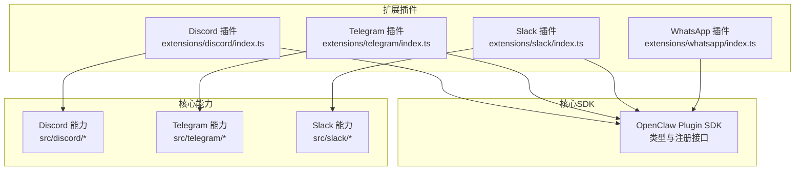
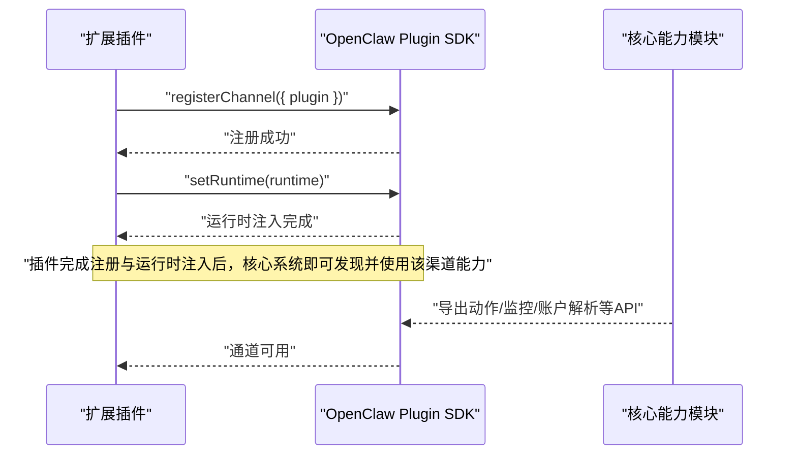
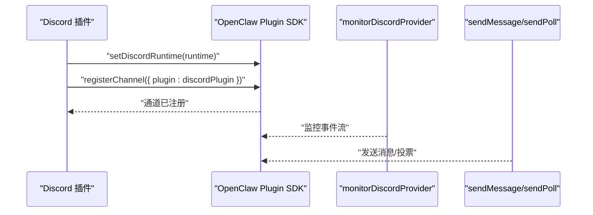
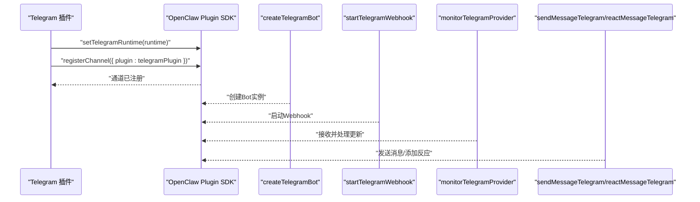
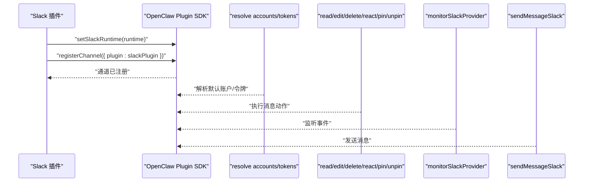
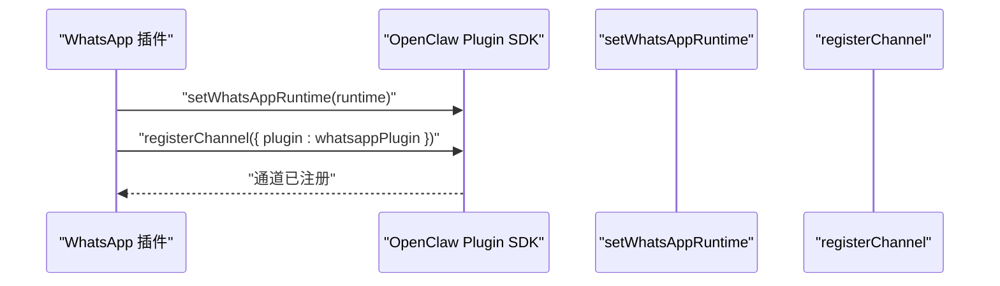
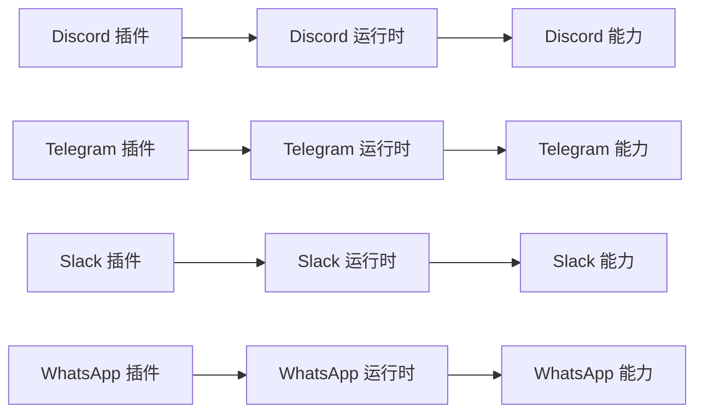

# 渠道专用工具

<cite>
**本文引用的文件**
- [extensions/discord/index.ts](file://extensions/discord/index.ts)
- [extensions/telegram/index.ts](file://extensions/telegram/index.ts)
- [extensions/slack/index.ts](file://extensions/slack/index.ts)
- [extensions/whatsapp/index.ts](file://extensions/whatsapp/index.ts)
- [src/discord/index.ts](file://src/discord/index.ts)
- [src/telegram/index.ts](file://src/telegram/index.ts)
- [src/slack/index.ts](file://src/slack/index.ts)
- [docs/channels/discord.md](file://docs/channels/discord.md)
- [docs/channels/telegram.md](file://docs/channels/telegram.md)
- [docs/channels/slack.md](file://docs/channels/slack.md)
- [docs/channels/whatsapp.md](file://docs/channels/whatsapp.md)
</cite>

## 目录

1. [引言](#引言)
2. [项目结构](#项目结构)
3. [核心组件](#核心组件)
4. [架构总览](#架构总览)
5. [详细组件分析](#详细组件分析)
6. [依赖关系分析](#依赖关系分析)
7. [性能考量](#性能考量)
8. [故障排除指南](#故障排除指南)
9. [结论](#结论)
10. [附录](#附录)

## 引言

本文件面向OpenClaw渠道专用工具系统，聚焦于Discord、Telegram、Slack与WhatsApp四类消息渠道的专用工具实现、API适配器与功能扩展。文档从插件注册机制入手，梳理各渠道在OpenClaw中的角色定位、运行时注入、通道暴露方式，并结合官方渠道文档说明权限控制、消息格式化与交互模式。最后提供配置建议、最佳实践与故障排除清单，并给出开发模板与集成示例路径，帮助开发者快速上手并安全稳定地扩展渠道能力。

## 项目结构

OpenClaw采用“扩展插件 + 核心SDK”的分层设计：

- 扩展层：每个渠道以独立插件形式存在，负责注册自身通道与运行时环境。
- 核心层：提供统一的插件SDK接口、类型定义与通用能力，各渠道通过SDK暴露通道能力。
- 文档层：各渠道的官方文档对权限模型、消息格式、交互流程进行权威说明。

下图展示扩展插件与核心SDK的关系概览：

图表来源

- [extensions/discord/index.ts](file://extensions/discord/index.ts#L1-L18)
- [extensions/telegram/index.ts](file://extensions/telegram/index.ts#L1-L18)
- [extensions/slack/index.ts](file://extensions/slack/index.ts#L1-L18)
- [extensions/whatsapp/index.ts](file://extensions/whatsapp/index.ts#L1-L18)
- [src/discord/index.ts](file://src/discord/index.ts#L1-L3)
- [src/telegram/index.ts](file://src/telegram/index.ts#L1-L5)
- [src/slack/index.ts](file://src/slack/index.ts#L1-L26)

章节来源

- [extensions/discord/index.ts](file://extensions/discord/index.ts#L1-L18)
- [extensions/telegram/index.ts](file://extensions/telegram/index.ts#L1-L18)
- [extensions/slack/index.ts](file://extensions/slack/index.ts#L1-L18)
- [extensions/whatsapp/index.ts](file://extensions/whatsapp/index.ts#L1-L18)
- [src/discord/index.ts](file://src/discord/index.ts#L1-L3)
- [src/telegram/index.ts](file://src/telegram/index.ts#L1-L5)
- [src/slack/index.ts](file://src/slack/index.ts#L1-L26)

## 核心组件

- 插件注册与运行时注入
  - 每个渠道插件在注册时调用SDK提供的运行时设置函数，向OpenClaw注入该渠道的运行时上下文；随后通过SDK注册通道对象，使核心系统可发现并使用该渠道的能力。
  - 注册流程的关键点包括：插件ID、名称、描述、空配置模式（无额外配置项）、注册回调中完成运行时注入与通道注册。
- 渠道能力导出
  - 各渠道在核心目录下提供统一的导出入口，集中暴露监控、发送、反应、账户解析等能力，便于上层工具或技能直接调用。

章节来源

- [extensions/discord/index.ts](file://extensions/discord/index.ts#L6-L15)
- [extensions/telegram/index.ts](file://extensions/telegram/index.ts#L6-L15)
- [extensions/slack/index.ts](file://extensions/slack/index.ts#L6-L15)
- [extensions/whatsapp/index.ts](file://extensions/whatsapp/index.ts#L6-L15)
- [src/discord/index.ts](file://src/discord/index.ts#L1-L3)
- [src/telegram/index.ts](file://src/telegram/index.ts#L1-L5)
- [src/slack/index.ts](file://src/slack/index.ts#L1-L26)

## 架构总览

下图展示OpenClaw中四个渠道插件如何通过SDK注册通道，并由核心能力模块提供具体动作与监控服务：

图表来源

- [extensions/discord/index.ts](file://extensions/discord/index.ts#L11-L14)
- [extensions/telegram/index.ts](file://extensions/telegram/index.ts#L11-L14)
- [extensions/slack/index.ts](file://extensions/slack/index.ts#L11-L14)
- [extensions/whatsapp/index.ts](file://extensions/whatsapp/index.ts#L11-L14)

## 详细组件分析

### Discord 渠道专用工具

- 插件注册与运行时
  - 插件在注册回调中注入Discord运行时，并通过SDK注册Discord通道对象，确保核心系统可调用其能力。
- 能力导出
  - 提供监控、发送消息与投票等能力的导出入口，便于上层工具直接调用。
- 权限控制与交互模式
  - 参考官方渠道文档，明确机器人权限、服务器/频道访问范围、消息发送与反应权限等。
- 消息格式化
  - 遵循Discord Markdown与富文本规范，支持嵌入、附件与表情包等。

图表来源

- [extensions/discord/index.ts](file://extensions/discord/index.ts#L11-L14)
- [src/discord/index.ts](file://src/discord/index.ts#L1-L3)

章节来源

- [extensions/discord/index.ts](file://extensions/discord/index.ts#L1-L18)
- [src/discord/index.ts](file://src/discord/index.ts#L1-L3)
- [docs/channels/discord.md](file://docs/channels/discord.md)

### Telegram 渠道专用工具

- 插件注册与运行时
  - 插件在注册回调中注入Telegram运行时，并通过SDK注册Telegram通道对象。
- 能力导出
  - 提供机器人创建、Webhook回调、监控、发送消息、反应与Webhook启动等能力的导出入口。
- 权限控制与交互模式
  - 参考官方渠道文档，明确Bot权限、私聊/群组交互限制、Inline模式与命令菜单等。
- 消息格式化
  - 支持Markdown/HTML格式、多媒体与内联键盘等。

图表来源

- [extensions/telegram/index.ts](file://extensions/telegram/index.ts#L11-L14)
- [src/telegram/index.ts](file://src/telegram/index.ts#L1-L5)

章节来源

- [extensions/telegram/index.ts](file://extensions/telegram/index.ts#L1-L18)
- [src/telegram/index.ts](file://src/telegram/index.ts#L1-L5)
- [docs/channels/telegram.md](file://docs/channels/telegram.md)

### Slack 渠道专用工具

- 插件注册与运行时
  - 插件在注册回调中注入Slack运行时，并通过SDK注册Slack通道对象。
- 能力导出
  - 提供账户解析、消息读取、编辑、删除、反应、表情、置顶/取消置顶、监控、探针与发送消息等能力的导出入口。
- 权限控制与交互模式
  - 参考官方渠道文档，明确Bot令牌与App令牌差异、用户权限范围、工作区/频道访问策略、交互式组件权限等。
- 消息格式化
  - 支持Block Kit、Markdown、附件与文件上传等。

图表来源

- [extensions/slack/index.ts](file://extensions/slack/index.ts#L11-L14)
- [src/slack/index.ts](file://src/slack/index.ts#L1-L26)

章节来源

- [extensions/slack/index.ts](file://extensions/slack/index.ts#L1-L18)
- [src/slack/index.ts](file://src/slack/index.ts#L1-L26)
- [docs/channels/slack.md](file://docs/channels/slack.md)

### WhatsApp 渠道专用工具

- 插件注册与运行时
  - 插件在注册回调中注入WhatsApp运行时，并通过SDK注册WhatsApp通道对象。
- 能力导出
  - 提供通道能力的导出入口，便于上层工具调用。
- 权限控制与交互模式
  - 参考官方渠道文档，明确业务API权限、号码验证、消息类型与交互限制等。
- 消息格式化
  - 支持文本、图片、视频、文档、位置与交互按钮等。

图表来源

- [extensions/whatsapp/index.ts](file://extensions/whatsapp/index.ts#L11-L14)

章节来源

- [extensions/whatsapp/index.ts](file://extensions/whatsapp/index.ts#L1-L18)
- [docs/channels/whatsapp.md](file://docs/channels/whatsapp.md)

## 依赖关系分析

- 组件耦合与内聚
  - 扩展插件仅负责注册与运行时注入，核心能力模块提供具体API，保持高内聚低耦合。
- 外部依赖与集成点
  - 各渠道依赖官方平台API与令牌体系；通过OpenClaw SDK桥接，避免直接耦合到具体实现。
- 接口契约
  - 通过SDK的通道注册与运行时注入接口，确保不同渠道具备一致的接入体验。

图表来源

- [extensions/discord/index.ts](file://extensions/discord/index.ts#L11-L14)
- [extensions/telegram/index.ts](file://extensions/telegram/index.ts#L11-L14)
- [extensions/slack/index.ts](file://extensions/slack/index.ts#L11-L14)
- [extensions/whatsapp/index.ts](file://extensions/whatsapp/index.ts#L11-L14)

章节来源

- [extensions/discord/index.ts](file://extensions/discord/index.ts#L1-L18)
- [extensions/telegram/index.ts](file://extensions/telegram/index.ts#L1-L18)
- [extensions/slack/index.ts](file://extensions/slack/index.ts#L1-L18)
- [extensions/whatsapp/index.ts](file://extensions/whatsapp/index.ts#L1-L18)

## 性能考量

- 并发与限流
  - 各渠道API通常有速率限制，应引入队列与退避策略，避免触发限流。
- 缓存与去重
  - 对重复消息与反应进行去重处理，减少无效调用。
- 异步处理
  - 将耗时操作（如文件上传）异步化，避免阻塞主线程。
- 监控与可观测性
  - 记录请求耗时、错误率与重试次数，辅助定位性能瓶颈。

## 故障排除指南

- 常见问题
  - 令牌无效或过期：检查Bot/App令牌是否正确配置与续期。
  - 权限不足：确认机器人在目标服务器/频道的权限范围。
  - Webhook无法接收：检查域名、SSL证书与端口可达性。
  - 消息未送达：核对收件人ID、群组ID与消息格式。
- 定位步骤
  - 开启调试日志，捕获请求与响应。
  - 使用探针或最小复现脚本验证连接与权限。
  - 分模块排查：先验证令牌与权限，再验证消息格式与路由。
- 参考文档
  - 各渠道官方文档提供了详细的权限模型与交互流程说明，是排障的重要依据。

章节来源

- [docs/channels/discord.md](file://docs/channels/discord.md)
- [docs/channels/telegram.md](file://docs/channels/telegram.md)
- [docs/channels/slack.md](file://docs/channels/slack.md)
- [docs/channels/whatsapp.md](file://docs/channels/whatsapp.md)

## 结论

OpenClaw通过标准化的插件SDK与清晰的通道注册机制，实现了对Discord、Telegram、Slack与WhatsApp等渠道的统一接入。开发者只需在插件中完成运行时注入与通道注册，即可复用核心能力模块提供的监控、发送、反应与账户解析等功能。配合官方渠道文档，可在保证权限合规的前提下，高效实现消息格式化与交互模式定制，并通过合理的性能与故障排除策略保障系统稳定性。

## 附录

- 开发模板与集成示例路径
  - 插件骨架：参考现有四个渠道插件的注册与运行时注入模式，复制并修改插件ID、名称与描述。
  - 通道注册：在注册回调中调用对应渠道的运行时设置函数与通道注册函数。
  - 能力导出：在核心目录下按需导出监控、发送、反应、账户解析等API，供上层工具调用。
  - 集成示例：参考各渠道官方文档中的最小可运行示例，结合OpenClaw的令牌配置与Webhook设置，完成端到端集成。

章节来源

- [extensions/discord/index.ts](file://extensions/discord/index.ts#L1-L18)
- [extensions/telegram/index.ts](file://extensions/telegram/index.ts#L1-L18)
- [extensions/slack/index.ts](file://extensions/slack/index.ts#L1-L18)
- [extensions/whatsapp/index.ts](file://extensions/whatsapp/index.ts#L1-L18)
- [src/discord/index.ts](file://src/discord/index.ts#L1-L3)
- [src/telegram/index.ts](file://src/telegram/index.ts#L1-L5)
- [src/slack/index.ts](file://src/slack/index.ts#L1-L26)
- [docs/channels/discord.md](file://docs/channels/discord.md)
- [docs/channels/telegram.md](file://docs/channels/telegram.md)
- [docs/channels/slack.md](file://docs/channels/slack.md)
- [docs/channels/whatsapp.md](file://docs/channels/whatsapp.md)
