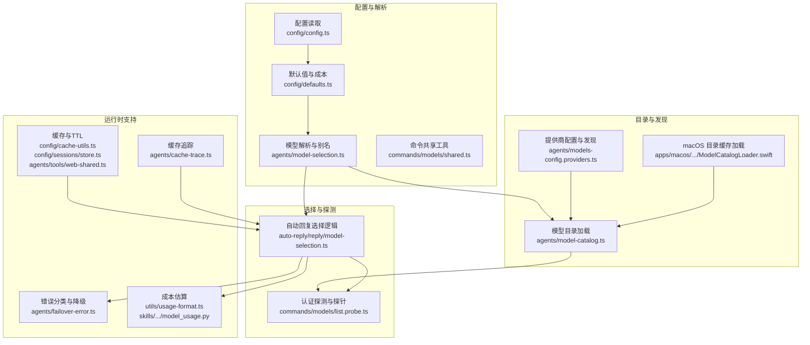
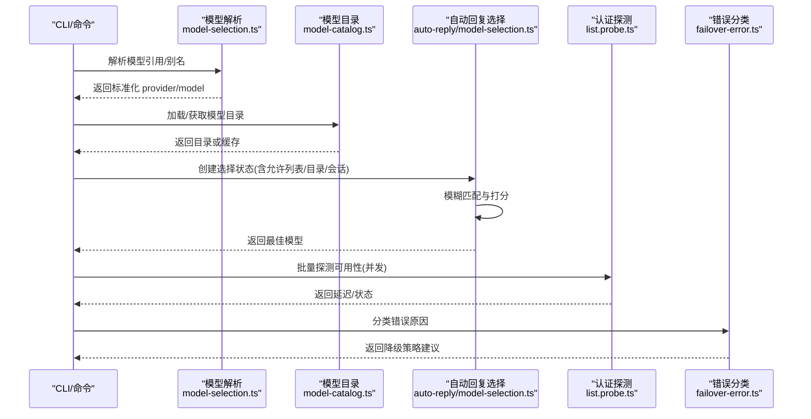
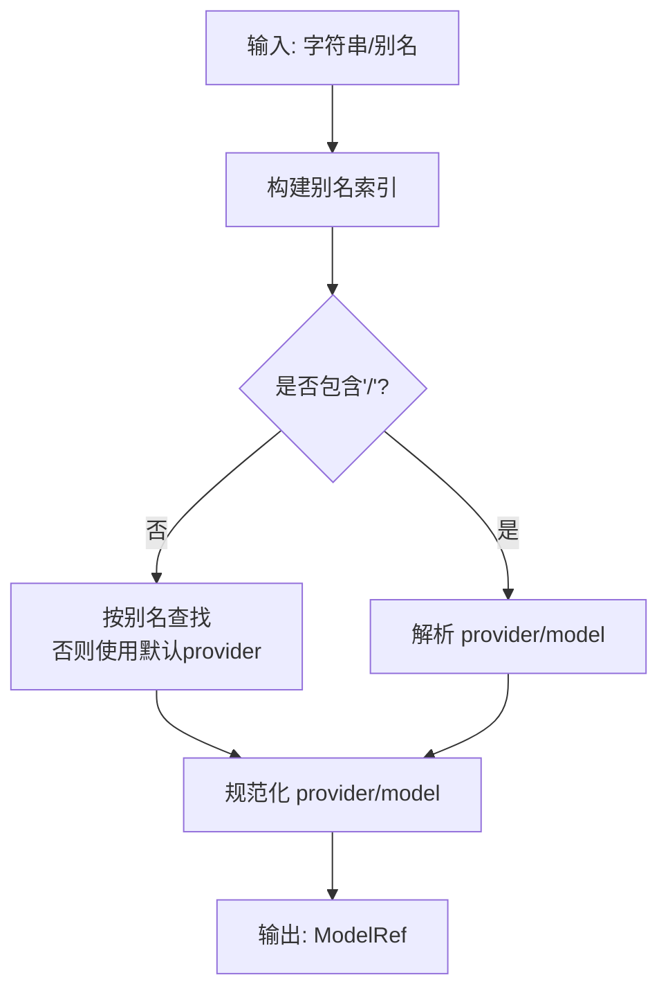
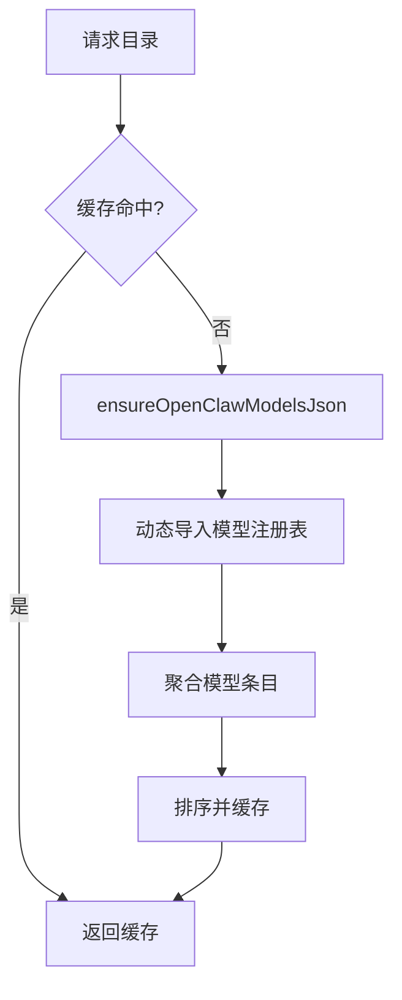
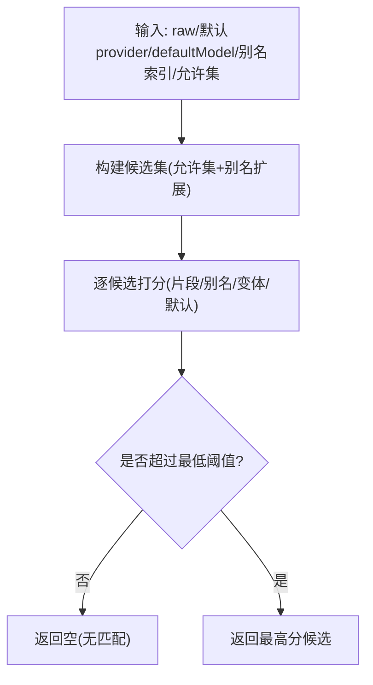
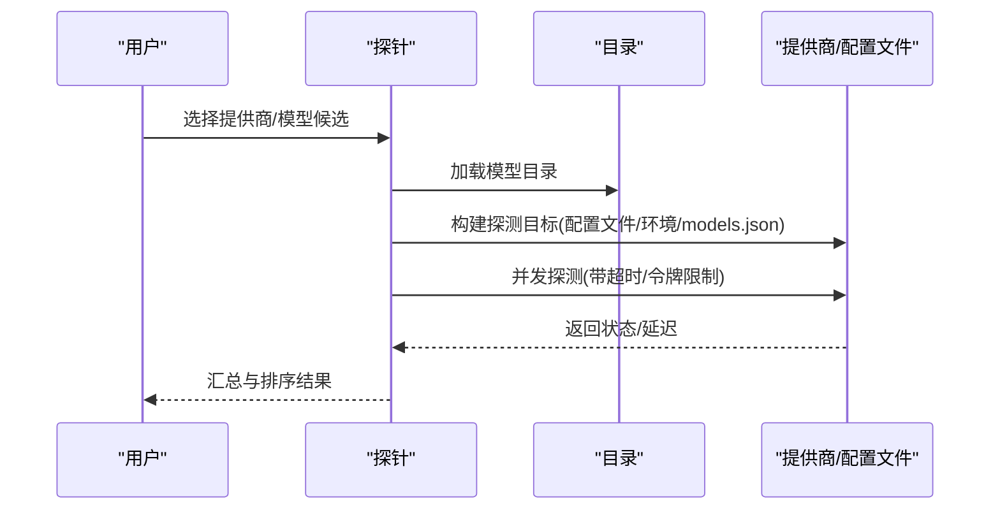
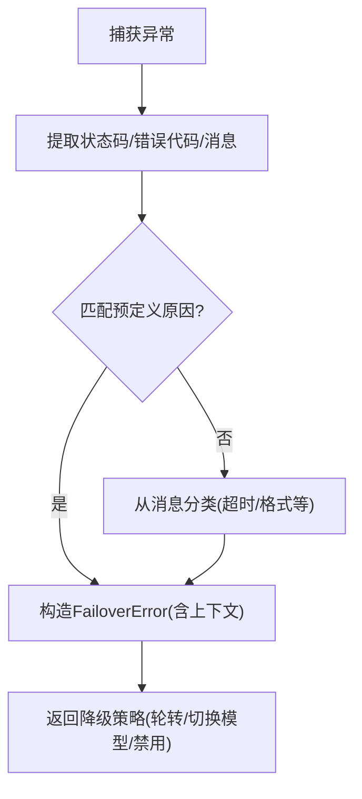
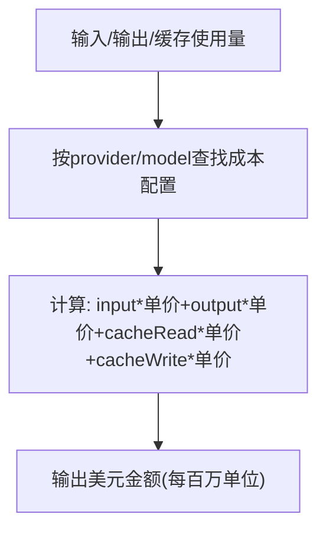
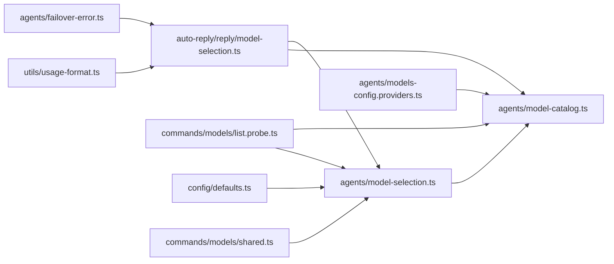
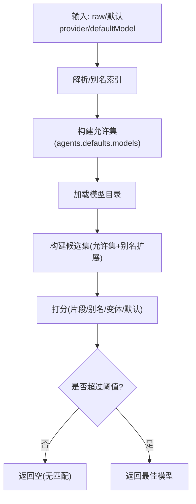

# 模型选择

<cite>
**本文档引用的文件**
- [src/agents/model-selection.ts](file://src/agents/model-selection.ts)
- [src/auto-reply/reply/model-selection.ts](file://src/auto-reply/reply/model-selection.ts)
- [src/agents/model-catalog.ts](file://src/agents/model-catalog.ts)
- [src/config/defaults.ts](file://src/config/defaults.ts)
- [src/agents/models-config.providers.ts](file://src/agents/models-config.providers.ts)
- [src/commands/models/list.probe.ts](file://src/commands/models/list.probe.ts)
- [src/agents/failover-error.ts](file://src/agents/failover-error.ts)
- [src/commands/models/shared.ts](file://src/commands/models/shared.ts)
- [src/config/cache-utils.ts](file://src/config/cache-utils.ts)
- [src/config/sessions/store.ts](file://src/config/sessions/store.ts)
- [src/agents/tools/web-shared.ts](file://src/agents/tools/web-shared.ts)
- [src/agents/cache-trace.ts](file://src/agents/cache-trace.ts)
- [src/utils/usage-format.ts](file://src/utils/usage-format.ts)
- [skills/model-usage/scripts/model_usage.py](file://skills/model-usage/scripts/model_usage.py)
- [apps/macos/Sources/OpenClaw/ModelCatalogLoader.swift](file://apps/macos/Sources/OpenClaw/ModelCatalogLoader.swift)
- [docs/concepts/model-failover.md](file://docs/concepts/model-failover.md)
</cite>

## 目录

1. [简介](#简介)
2. [项目结构](#项目结构)
3. [核心组件](#核心组件)
4. [架构总览](#架构总览)
5. [详细组件分析](#详细组件分析)
6. [依赖关系分析](#依赖关系分析)
7. [性能考量](#性能考量)
8. [故障排查指南](#故障排查指南)
9. [结论](#结论)
10. [附录](#附录)

## 简介

本文件面向 OpenClaw 模型选择系统，提供从算法、兼容性检查、降级策略到实时过滤、目录管理、配置解析、兼容性验证、性能评估、负载均衡、模型切换与缓存、错误处理与成本控制的完整技术说明。文档同时给出关键流程图与兼容性矩阵，帮助开发者与运维人员快速理解与优化模型选择行为。

## 项目结构

OpenClaw 的模型选择能力由“配置层 + 解析层 + 目录层 + 选择层 + 探测层 + 错误与成本层”构成，跨平台与多端（Node/TS、Swift）协同加载模型目录，确保一致性与可用性。

图表来源

- [src/config/defaults.ts](file://src/config/defaults.ts#L172-L292)
- [src/agents/model-selection.ts](file://src/agents/model-selection.ts#L1-L127)
- [src/agents/model-catalog.ts](file://src/agents/model-catalog.ts#L41-L119)
- [src/agents/models-config.providers.ts](file://src/agents/models-config.providers.ts#L511-L628)
- [src/auto-reply/reply/model-selection.ts](file://src/auto-reply/reply/model-selection.ts#L261-L409)
- [src/commands/models/list.probe.ts](file://src/commands/models/list.probe.ts#L136-L287)
- [src/agents/failover-error.ts](file://src/agents/failover-error.ts#L145-L180)
- [src/config/cache-utils.ts](file://src/config/cache-utils.ts#L1-L27)
- [src/config/sessions/store.ts](file://src/config/sessions/store.ts#L25-L33)
- [src/agents/tools/web-shared.ts](file://src/agents/tools/web-shared.ts#L1-L39)
- [src/agents/cache-trace.ts](file://src/agents/cache-trace.ts#L204-L211)
- [src/utils/usage-format.ts](file://src/utils/usage-format.ts#L46-L86)
- [skills/model-usage/scripts/model_usage.py](file://skills/model-usage/scripts/model_usage.py#L122-L148)
- [apps/macos/Sources/OpenClaw/ModelCatalogLoader.swift](file://apps/macos/Sources/OpenClaw/ModelCatalogLoader.swift#L122-L156)

章节来源

- [src/agents/model-selection.ts](file://src/agents/model-selection.ts#L1-L127)
- [src/auto-reply/reply/model-selection.ts](file://src/auto-reply/reply/model-selection.ts#L261-L409)
- [src/agents/model-catalog.ts](file://src/agents/model-catalog.ts#L41-L119)
- [src/agents/models-config.providers.ts](file://src/agents/models-config.providers.ts#L511-L628)
- [src/commands/models/list.probe.ts](file://src/commands/models/list.probe.ts#L136-L287)
- [src/agents/failover-error.ts](file://src/agents/failover-error.ts#L145-L180)
- [src/config/cache-utils.ts](file://src/config/cache-utils.ts#L1-L27)
- [src/config/sessions/store.ts](file://src/config/sessions/store.ts#L25-L33)
- [src/agents/tools/web-shared.ts](file://src/agents/tools/web-shared.ts#L1-L39)
- [src/agents/cache-trace.ts](file://src/agents/cache-trace.ts#L204-L211)
- [src/utils/usage-format.ts](file://src/utils/usage-format.ts#L46-L86)
- [skills/model-usage/scripts/model_usage.py](file://skills/model-usage/scripts/model_usage.py#L122-L148)
- [apps/macos/Sources/OpenClaw/ModelCatalogLoader.swift](file://apps/macos/Sources/OpenClaw/ModelCatalogLoader.swift#L122-L156)

## 核心组件

- 模型解析与别名：负责将字符串解析为标准化的 provider/model 引用，支持别名映射与规范化。
- 模型目录加载：统一加载与缓存模型目录，支持动态导入与错误恢复。
- 选择状态机：在指令、会话、允许列表、目录约束下进行模糊匹配与打分，决定最终模型。
- 探测与认证：批量探测各提供商/配置文件可用性，返回延迟与状态。
- 错误与降级：基于错误原因进行分类，支持轮转与降级策略。
- 成本与缓存：成本配置与估算、缓存 TTL 与失效、会话缓存与追踪。

章节来源

- [src/agents/model-selection.ts](file://src/agents/model-selection.ts#L129-L178)
- [src/agents/model-catalog.ts](file://src/agents/model-catalog.ts#L41-L119)
- [src/auto-reply/reply/model-selection.ts](file://src/auto-reply/reply/model-selection.ts#L261-L409)
- [src/commands/models/list.probe.ts](file://src/commands/models/list.probe.ts#L136-L287)
- [src/agents/failover-error.ts](file://src/agents/failover-error.ts#L145-L180)
- [src/utils/usage-format.ts](file://src/utils/usage-format.ts#L46-L86)
- [src/config/cache-utils.ts](file://src/config/cache-utils.ts#L1-L27)

## 架构总览

模型选择系统的关键交互如下：

图表来源

- [src/agents/model-selection.ts](file://src/agents/model-selection.ts#L129-L178)
- [src/agents/model-catalog.ts](file://src/agents/model-catalog.ts#L41-L119)
- [src/auto-reply/reply/model-selection.ts](file://src/auto-reply/reply/model-selection.ts#L261-L409)
- [src/commands/models/list.probe.ts](file://src/commands/models/list.probe.ts#L421-L460)
- [src/agents/failover-error.ts](file://src/agents/failover-error.ts#L145-L180)

## 详细组件分析

### 组件A：模型解析与别名索引

- 功能要点
  - 解析字符串为 ModelRef，支持 provider/model 或仅 model（使用默认 provider）。
  - 别名索引：将别名映射到具体 provider/model，并建立 key->aliases 的反向索引。
  - 规范化：provider 名称归一化（如 z.ai→zai），模型 ID 规范化（如 google gemini 版本号）。
  - 允许集构建：根据 agents.defaults.models 生成允许 key 集合，支持 CLI provider 识别。
- 性能与复杂度
  - 解析与别名查找为 O(1)~O(n)（n 为别名数量）。
  - 允许集构建为 O(m)（m 为 allowlist 数量）。
- 关键实现路径
  - [解析与别名索引](file://src/agents/model-selection.ts#L129-L178)
  - [允许集构建](file://src/agents/model-selection.ts#L256-L329)

图表来源

- [src/agents/model-selection.ts](file://src/agents/model-selection.ts#L129-L178)

章节来源

- [src/agents/model-selection.ts](file://src/agents/model-selection.ts#L129-L178)
- [src/agents/model-selection.ts](file://src/agents/model-selection.ts#L256-L329)

### 组件B：模型目录加载与缓存

- 功能要点
  - 动态导入模型注册表，聚合模型条目（id/name/provider/contextWindow/reasoning/input）。
  - 缓存与错误恢复：首次失败不污染缓存，保留已有结果；支持禁用缓存。
  - macOS 端缓存：从源文件提取并清洗导出内容，写入本地缓存文件。
- 性能与复杂度
  - 加载为 O(k)（k 为模型条目数）；排序 O(k log k)。
  - 缓存命中避免重复 IO；TTL 支持按环境变量控制。
- 关键实现路径
  - [目录加载与缓存](file://src/agents/model-catalog.ts#L41-L119)
  - [macOS 目录缓存](file://apps/macos/Sources/OpenClaw/ModelCatalogLoader.swift#L122-L156)
  - [缓存工具](file://src/config/cache-utils.ts#L1-L27)

图表来源

- [src/agents/model-catalog.ts](file://src/agents/model-catalog.ts#L41-L119)
- [apps/macos/Sources/OpenClaw/ModelCatalogLoader.swift](file://apps/macos/Sources/OpenClaw/ModelCatalogLoader.swift#L122-L156)
- [src/config/cache-utils.ts](file://src/config/cache-utils.ts#L1-L27)

章节来源

- [src/agents/model-catalog.ts](file://src/agents/model-catalog.ts#L41-L119)
- [apps/macos/Sources/OpenClaw/ModelCatalogLoader.swift](file://apps/macos/Sources/OpenClaw/ModelCatalogLoader.swift#L122-L156)
- [src/config/cache-utils.ts](file://src/config/cache-utils.ts#L1-L27)

### 组件C：自动回复模型选择与实时过滤

- 功能要点
  - 创建选择状态：合并 allowlist、目录、会话覆盖、父会话覆盖、心跳覆盖等上下文。
  - 模糊匹配与打分：基于 provider/model 片段、别名、变体词、默认模型权重、长度等综合评分。
  - 最低阈值过滤：根据是否限定 provider 决定不同阈值，未达阈值则放弃。
  - 默认推理级别：根据目录与配置推断默认思考层级。
- 复杂度与性能
  - 候选集遍历 O(n)，打分为 O(1) 每候选；整体 O(n)。
  - 排序按分数、默认优先、变体匹配数、模型长度等稳定排序。
- 关键实现路径
  - [选择状态创建](file://src/auto-reply/reply/model-selection.ts#L261-L409)
  - [模糊匹配与打分](file://src/auto-reply/reply/model-selection.ts#L154-L259)
  - [模糊匹配主流程](file://src/auto-reply/reply/model-selection.ts#L411-L582)

图表来源

- [src/auto-reply/reply/model-selection.ts](file://src/auto-reply/reply/model-selection.ts#L411-L582)

章节来源

- [src/auto-reply/reply/model-selection.ts](file://src/auto-reply/reply/model-selection.ts#L261-L409)
- [src/auto-reply/reply/model-selection.ts](file://src/auto-reply/reply/model-selection.ts#L411-L582)

### 组件D：认证探测与实时模型过滤

- 功能要点
  - 构建探测目标：结合目录、允许集、配置文件顺序、环境变量与 models.json 自定义密钥。
  - 并发探测：按并发度调度，记录延迟与状态，支持进度回调。
  - 结果汇总：按提供商分组、排序，格式化摘要。
- 关键实现路径
  - [目标构建](file://src/commands/models/list.probe.ts#L136-L287)
  - [并发执行](file://src/commands/models/list.probe.ts#L365-L419)
  - [结果汇总与格式化](file://src/commands/models/list.probe.ts#L421-L497)

图表来源

- [src/commands/models/list.probe.ts](file://src/commands/models/list.probe.ts#L136-L287)
- [src/commands/models/list.probe.ts](file://src/commands/models/list.probe.ts#L365-L419)

章节来源

- [src/commands/models/list.probe.ts](file://src/commands/models/list.probe.ts#L136-L287)
- [src/commands/models/list.probe.ts](file://src/commands/models/list.probe.ts#L365-L419)
- [src/commands/models/list.probe.ts](file://src/commands/models/list.probe.ts#L421-L497)

### 组件E：错误分类与降级策略

- 功能要点
  - 从 HTTP 状态码、错误代码、错误消息中推断失败原因（认证、速率限制、账单、超时、格式）。
  - 将通用错误转换为 FailoverError，携带 provider/model/profileId/status/code。
  - 文档化轮转顺序与会话粘性：OAuth 优先、最旧使用优先、冷却后移末尾；会话内固定以提升缓存命中。
- 关键实现路径
  - [错误分类与推断](file://src/agents/failover-error.ts#L145-L180)
  - [错误描述与状态映射](file://src/agents/failover-error.ts#L182-L203)
  - [轮转与粘性策略](file://docs/concepts/model-failover.md#L49-L78)

图表来源

- [src/agents/failover-error.ts](file://src/agents/failover-error.ts#L145-L180)
- [src/agents/failover-error.ts](file://src/agents/failover-error.ts#L182-L203)
- [docs/concepts/model-failover.md](file://docs/concepts/model-failover.md#L49-L78)

章节来源

- [src/agents/failover-error.ts](file://src/agents/failover-error.ts#L145-L180)
- [src/agents/failover-error.ts](file://src/agents/failover-error.ts#L182-L203)
- [docs/concepts/model-failover.md](file://docs/concepts/model-failover.md#L49-L78)

### 组件F：成本控制与性能评估

- 功能要点
  - 成本配置：在模型定义中配置 input/output/cacheRead/cacheWrite。
  - 成本估算：基于使用量与成本配置计算美元金额，支持按 provider/model 查找成本。
  - 模型使用统计：技能脚本按最近日期与最高成本模型回溯当前模型。
- 关键实现路径
  - [成本配置与估算](file://src/utils/usage-format.ts#L46-L86)
  - [模型使用统计逻辑](file://skills/model-usage/scripts/model_usage.py#L122-L148)

图表来源

- [src/utils/usage-format.ts](file://src/utils/usage-format.ts#L46-L86)
- [skills/model-usage/scripts/model_usage.py](file://skills/model-usage/scripts/model_usage.py#L122-L148)

章节来源

- [src/utils/usage-format.ts](file://src/utils/usage-format.ts#L46-L86)
- [skills/model-usage/scripts/model_usage.py](file://skills/model-usage/scripts/model_usage.py#L122-L148)

### 组件G：缓存策略与会话持久化

- 功能要点
  - TTL 解析：支持环境变量与默认值，启用/禁用缓存。
  - 会话缓存：记录加载时间、文件 mtime、TTL，避免频繁 IO。
  - Web 缓存：Map 缓存 + 过期时间 + 最大条目数。
  - 缓存追踪：可选写入缓存轨迹文件，便于诊断。
- 关键实现路径
  - [TTL 与启用判断](file://src/config/cache-utils.ts#L1-L27)
  - [会话缓存结构](file://src/config/sessions/store.ts#L25-L33)
  - [Web 缓存工具](file://src/agents/tools/web-shared.ts#L1-L39)
  - [缓存追踪](file://src/agents/cache-trace.ts#L204-L211)

章节来源

- [src/config/cache-utils.ts](file://src/config/cache-utils.ts#L1-L27)
- [src/config/sessions/store.ts](file://src/config/sessions/store.ts#L25-L33)
- [src/agents/tools/web-shared.ts](file://src/agents/tools/web-shared.ts#L1-L39)
- [src/agents/cache-trace.ts](file://src/agents/cache-trace.ts#L204-L211)

## 依赖关系分析

图表来源

- [src/agents/model-selection.ts](file://src/agents/model-selection.ts#L1-L127)
- [src/auto-reply/reply/model-selection.ts](file://src/auto-reply/reply/model-selection.ts#L1-L50)
- [src/agents/model-catalog.ts](file://src/agents/model-catalog.ts#L1-L30)
- [src/commands/models/list.probe.ts](file://src/commands/models/list.probe.ts#L1-L30)
- [src/config/defaults.ts](file://src/config/defaults.ts#L172-L292)
- [src/agents/models-config.providers.ts](file://src/agents/models-config.providers.ts#L511-L628)
- [src/agents/failover-error.ts](file://src/agents/failover-error.ts#L145-L180)
- [src/utils/usage-format.ts](file://src/utils/usage-format.ts#L46-L86)
- [src/commands/models/shared.ts](file://src/commands/models/shared.ts#L59-L76)

章节来源

- [src/agents/model-selection.ts](file://src/agents/model-selection.ts#L1-L127)
- [src/auto-reply/reply/model-selection.ts](file://src/auto-reply/reply/model-selection.ts#L1-L50)
- [src/agents/model-catalog.ts](file://src/agents/model-catalog.ts#L1-L30)
- [src/commands/models/list.probe.ts](file://src/commands/models/list.probe.ts#L1-L30)
- [src/config/defaults.ts](file://src/config/defaults.ts#L172-L292)
- [src/agents/models-config.providers.ts](file://src/agents/models-config.providers.ts#L511-L628)
- [src/agents/failover-error.ts](file://src/agents/failover-error.ts#L145-L180)
- [src/utils/usage-format.ts](file://src/utils/usage-format.ts#L46-L86)
- [src/commands/models/shared.ts](file://src/commands/models/shared.ts#L59-L76)

## 性能考量

- 目录加载与缓存
  - 使用 Promise 单例缓存避免重复加载；失败时不污染缓存，保留已有结果。
  - macOS 端缓存文件减少重复解析与网络依赖。
- 选择算法
  - 模糊匹配采用带最大距离的 Levenshtein 优化，避免全量扫描。
  - 打分函数常数时间，排序按多关键字稳定比较，整体近似线性。
- 探测并发
  - 通过并发度参数控制并行任务数，避免资源争用。
- 缓存与 TTL
  - 会话缓存与 Web 缓存均支持 TTL 与失效清理，降低重复 IO 与网络调用。

[本节为通用指导，无需特定文件引用]

## 故障排查指南

- 目录为空或加载失败
  - 检查目录缓存是否被清空；确认动态导入是否成功；查看错误日志。
  - 参考：[目录加载与错误恢复](file://src/agents/model-catalog.ts#L104-L115)
- 模型不可用或认证失败
  - 使用探针命令批量探测，关注状态与延迟；根据错误原因调整配置文件顺序或密钥。
  - 参考：[探针构建与并发执行](file://src/commands/models/list.probe.ts#L136-L287)
- 超时/格式错误
  - 依据错误分类推断原因，必要时降低并发或增加超时；检查请求格式与模型能力。
  - 参考：[错误分类与状态映射](file://src/agents/failover-error.ts#L145-L180)
- 成本估算异常
  - 确认模型成本配置存在且数值有效；检查使用量字段是否缺失。
  - 参考：[成本估算](file://src/utils/usage-format.ts#L46-L86)

章节来源

- [src/agents/model-catalog.ts](file://src/agents/model-catalog.ts#L104-L115)
- [src/commands/models/list.probe.ts](file://src/commands/models/list.probe.ts#L136-L287)
- [src/agents/failover-error.ts](file://src/agents/failover-error.ts#L145-L180)
- [src/utils/usage-format.ts](file://src/utils/usage-format.ts#L46-L86)

## 结论

OpenClaw 的模型选择系统通过“解析-目录-选择-探测-降级-成本”的闭环设计，在保证兼容性与性能的同时，提供了灵活的实时过滤、会话粘性与成本控制能力。借助缓存与并发优化，系统可在多提供商、多配置文件场景下稳定运行，并通过错误分类与降级策略提升鲁棒性。

[本节为总结，无需特定文件引用]

## 附录

### 模型选择流程图（代码级）

图表来源

- [src/agents/model-selection.ts](file://src/agents/model-selection.ts#L129-L178)
- [src/auto-reply/reply/model-selection.ts](file://src/auto-reply/reply/model-selection.ts#L411-L582)

### 兼容性矩阵（示例）

- 目录来源
  - 内置目录：由模型注册表聚合。
  - 外部提供商：通过 models.json 或环境变量注入。
  - 本地发现：Ollama、Bedrock 等按配置发现。
- 兼容性检查
  - provider/model 是否在允许集内。
  - 目录是否存在对应条目。
  - 是否为 CLI provider（允许在目录外）。
- 降级策略
  - 轮转：OAuth 优先、最旧使用优先、冷却后移末尾。
  - 切换：在用户锁定前尝试其他配置文件；失败时考虑模型回退。

章节来源

- [src/agents/model-selection.ts](file://src/agents/model-selection.ts#L256-L329)
- [src/agents/models-config.providers.ts](file://src/agents/models-config.providers.ts#L511-L628)
- [docs/concepts/model-failover.md](file://docs/concepts/model-failover.md#L49-L78)
