# 认证配置

<cite>
**本文引用的文件**
- [src/agents/auth-health.ts](file://src/agents/auth-health.ts)
- [src/agents/auth-profiles/oauth.ts](file://src/agents/auth-profiles/oauth.ts)
- [src/agents/auth-profiles/types.ts](file://src/agents/auth-profiles/types.ts)
- [src/agents/auth-profiles/usage.ts](file://src/agents/auth-profiles/usage.ts)
- [src/commands/doctor-auth.ts](file://src/commands/doctor-auth.ts)
- [src/config/types.auth.ts](file://src/config/types.auth.ts)
- [src/config/config.ts](file://src/config/config.ts)
- [scripts/setup-auth-system.sh](file://scripts/setup-auth-system.sh)
- [scripts/auth-monitor.sh](file://scripts/auth-monitor.sh)
- [docs/gateway/authentication.md](file://docs/gateway/authentication.md)
- [apps/macos/Sources/OpenClawProtocol/GatewayModels.swift](file://apps/macos/Sources/OpenClawProtocol/GatewayModels.swift)
- [apps/shared/OpenClawKit/Sources/OpenClawProtocol/GatewayModels.swift](file://apps/shared/OpenClawKit/Sources/OpenClawProtocol/GatewayModels.swift)
- [src/security/audit.ts](file://src/security/audit.ts)
- [src/security/secret-equal.ts](file://src/security/secret-equal.ts)
- [src/security/fix.ts](file://src/security/fix.ts)
- [src/security/audit-extra.sync.ts](file://src/security/audit-extra.sync.ts)
- [ui/src/ui/views/channels.config.ts](file://ui/src/ui/views/channels.config.ts)
- [src/config/types.telegram.ts](file://src/config/types.telegram.ts)
</cite>

## 目录

1. [简介](#简介)
2. [项目结构](#项目结构)
3. [核心组件](#核心组件)
4. [架构总览](#架构总览)
5. [详细组件分析](#详细组件分析)
6. [依赖关系分析](#依赖关系分析)
7. [性能考量](#性能考量)
8. [故障排除指南](#故障排除指南)
9. [结论](#结论)
10. [附录](#附录)

## 简介

本文件面向OpenClaw认证配置系统，系统性阐述认证配置管理、密钥轮换、OAuth集成、认证健康检查、配置验证、故障转移机制、身份管理与头像处理、渠道特定配置、认证配置存储与加密保护、安全策略等主题。文档同时提供认证流程图、配置模板要点、故障排除指南，并给出认证架构图与安全边界说明，帮助开发者与运维人员快速理解并正确部署与维护认证体系。

## 项目结构

OpenClaw认证配置系统由“配置定义与校验”“认证状态与健康检查”“凭据存储与轮换”“运维监控与修复工具”“平台协议与UI渲染”“安全审计与防护”等模块协同组成。下图展示与认证配置相关的关键目录与文件：

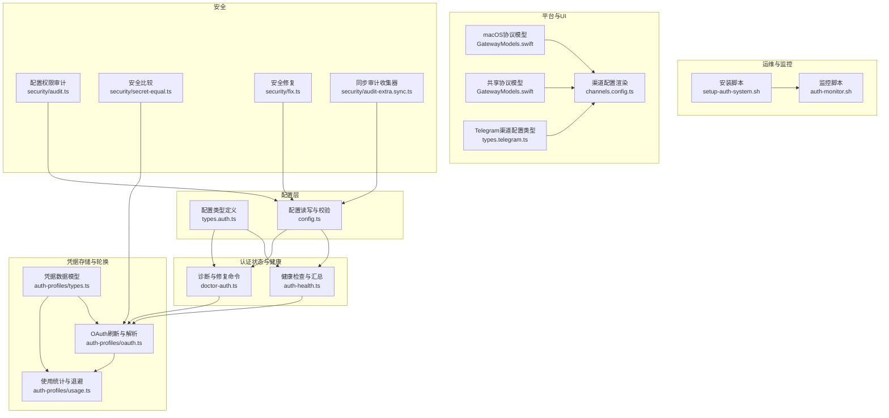

图表来源

- [src/config/types.auth.ts](file://src/config/types.auth.ts#L1-L29)
- [src/config/config.ts](file://src/config/config.ts#L1-L20)
- [src/agents/auth-health.ts](file://src/agents/auth-health.ts#L1-L253)
- [src/commands/doctor-auth.ts](file://src/commands/doctor-auth.ts#L1-L335)
- [src/agents/auth-profiles/types.ts](file://src/agents/auth-profiles/types.ts#L1-L75)
- [src/agents/auth-profiles/oauth.ts](file://src/agents/auth-profiles/oauth.ts#L1-L286)
- [src/agents/auth-profiles/usage.ts](file://src/agents/auth-profiles/usage.ts#L1-L323)
- [scripts/setup-auth-system.sh](file://scripts/setup-auth-system.sh#L1-L120)
- [scripts/auth-monitor.sh](file://scripts/auth-monitor.sh#L1-L90)
- [apps/macos/Sources/OpenClawProtocol/GatewayModels.swift](file://apps/macos/Sources/OpenClawProtocol/GatewayModels.swift#L1483-L1519)
- [apps/shared/OpenClawKit/Sources/OpenClawProtocol/GatewayModels.swift](file://apps/shared/OpenClawKit/Sources/OpenClawProtocol/GatewayModels.swift#L1483-L1519)
- [ui/src/ui/views/channels.config.ts](file://ui/src/ui/views/channels.config.ts#L51-L104)
- [src/config/types.telegram.ts](file://src/config/types.telegram.ts#L129-L141)
- [src/security/audit.ts](file://src/security/audit.ts#L197-L231)
- [src/security/secret-equal.ts](file://src/security/secret-equal.ts#L1-L16)
- [src/security/fix.ts](file://src/security/fix.ts#L187-L230)
- [src/security/audit-extra.sync.ts](file://src/security/audit-extra.sync.ts#L269-L301)

章节来源

- [src/config/types.auth.ts](file://src/config/types.auth.ts#L1-L29)
- [src/config/config.ts](file://src/config/config.ts#L1-L20)
- [src/agents/auth-health.ts](file://src/agents/auth-health.ts#L1-L253)
- [src/commands/doctor-auth.ts](file://src/commands/doctor-auth.ts#L1-L335)
- [src/agents/auth-profiles/types.ts](file://src/agents/auth-profiles/types.ts#L1-L75)
- [src/agents/auth-profiles/oauth.ts](file://src/agents/auth-profiles/oauth.ts#L1-L286)
- [src/agents/auth-profiles/usage.ts](file://src/agents/auth-profiles/usage.ts#L1-L323)
- [scripts/setup-auth-system.sh](file://scripts/setup-auth-system.sh#L1-L120)
- [scripts/auth-monitor.sh](file://scripts/auth-monitor.sh#L1-L90)
- [apps/macos/Sources/OpenClawProtocol/GatewayModels.swift](file://apps/macos/Sources/OpenClawProtocol/GatewayModels.swift#L1483-L1519)
- [apps/shared/OpenClawKit/Sources/OpenClawProtocol/GatewayModels.swift](file://apps/shared/OpenClawKit/Sources/OpenClawProtocol/GatewayModels.swift#L1483-L1519)
- [ui/src/ui/views/channels.config.ts](file://ui/src/ui/views/channels.config.ts#L51-L104)
- [src/config/types.telegram.ts](file://src/config/types.telegram.ts#L129-L141)
- [src/security/audit.ts](file://src/security/audit.ts#L197-L231)
- [src/security/secret-equal.ts](file://src/security/secret-equal.ts#L1-L16)
- [src/security/fix.ts](file://src/security/fix.ts#L187-L230)
- [src/security/audit-extra.sync.ts](file://src/security/audit-extra.sync.ts#L269-L301)

## 核心组件

- 配置类型与校验：定义认证配置结构（如profiles、order、cooldowns）及配置读取、解析与校验接口，确保配置合法与可审计。
- 健康检查与汇总：对OAuth/Token/API Key进行状态评估，输出按提供方聚合的健康摘要。
- 凭据存储与轮换：统一管理凭据存储、并发锁、刷新逻辑、失败退避与冷却时间计算。
- 诊断与修复：自动发现过期/将过期/缺失凭据，提示修复建议，支持一键刷新或清理。
- 运维监控：定时检查凭据有效期，通过通知通道预警；提供安装脚本完成系统级监控部署。
- 平台协议与UI：在macOS/共享协议中暴露渠道与账户信息；UI侧渲染渠道额外字段与响应前缀等。
- 安全审计与防护：检测配置文件权限风险、提供安全修复建议、安全比较函数避免时序攻击。

章节来源

- [src/config/types.auth.ts](file://src/config/types.auth.ts#L1-L29)
- [src/config/config.ts](file://src/config/config.ts#L1-L20)
- [src/agents/auth-health.ts](file://src/agents/auth-health.ts#L12-L38)
- [src/agents/auth-profiles/types.ts](file://src/agents/auth-profiles/types.ts#L4-L52)
- [src/agents/auth-profiles/oauth.ts](file://src/agents/auth-profiles/oauth.ts#L36-L106)
- [src/agents/auth-profiles/usage.ts](file://src/agents/auth-profiles/usage.ts#L78-L134)
- [src/commands/doctor-auth.ts](file://src/commands/doctor-auth.ts#L264-L334)
- [scripts/auth-monitor.sh](file://scripts/auth-monitor.sh#L68-L90)
- [apps/macos/Sources/OpenClawProtocol/GatewayModels.swift](file://apps/macos/Sources/OpenClawProtocol/GatewayModels.swift#L1483-L1519)
- [apps/shared/OpenClawKit/Sources/OpenClawProtocol/GatewayModels.swift](file://apps/shared/OpenClawKit/Sources/OpenClawProtocol/GatewayModels.swift#L1483-L1519)
- [ui/src/ui/views/channels.config.ts](file://ui/src/ui/views/channels.config.ts#L51-L104)
- [src/security/audit.ts](file://src/security/audit.ts#L197-L231)

## 架构总览

下图展示认证配置系统的端到端交互：配置层负责定义与校验；健康检查与诊断命令负责状态评估与修复；凭据存储与轮换负责刷新与退避；运维监控负责周期性告警；平台协议与UI负责呈现与操作入口；安全模块贯穿始终提供审计与防护。

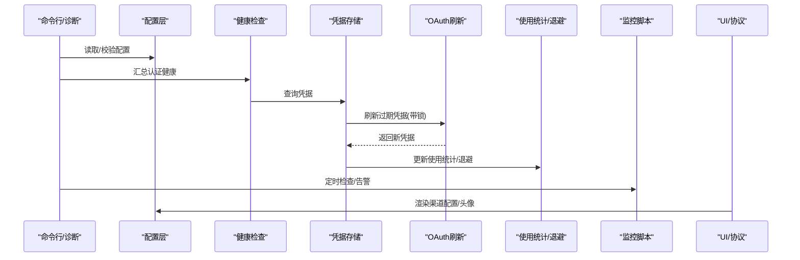

图表来源

- [src/config/config.ts](file://src/config/config.ts#L1-L20)
- [src/agents/auth-health.ts](file://src/agents/auth-health.ts#L156-L252)
- [src/agents/auth-profiles/oauth.ts](file://src/agents/auth-profiles/oauth.ts#L36-L106)
- [src/agents/auth-profiles/usage.ts](file://src/agents/auth-profiles/usage.ts#L205-L263)
- [scripts/auth-monitor.sh](file://scripts/auth-monitor.sh#L68-L90)
- [ui/src/ui/views/channels.config.ts](file://ui/src/ui/views/channels.config.ts#L51-L104)

## 详细组件分析

### 组件A：认证健康检查与汇总

- 功能要点
  - 将每个凭据映射为健康条目（类型、到期时间、剩余时长、状态），并按提供方聚合。
  - 对OAuth/Token提供“即将过期/已过期/缺失/静态”等状态判定。
  - 支持按提供方过滤与排序，便于诊断与展示。
- 关键流程
  - 解析OAuth状态：根据expires与当前时间判断剩余毫秒数与状态。
  - 对带refresh_token的OAuth，在首次调用即可自动续期，避免误报过期。
  - 聚合提供方级别状态：若存在过期/缺失则标记为过期/缺失，否则为ok。
- 复杂度
  - 时间复杂度：O(P + C)，P为提供方数量，C为凭据数量。
  - 空间复杂度：O(P + C)。

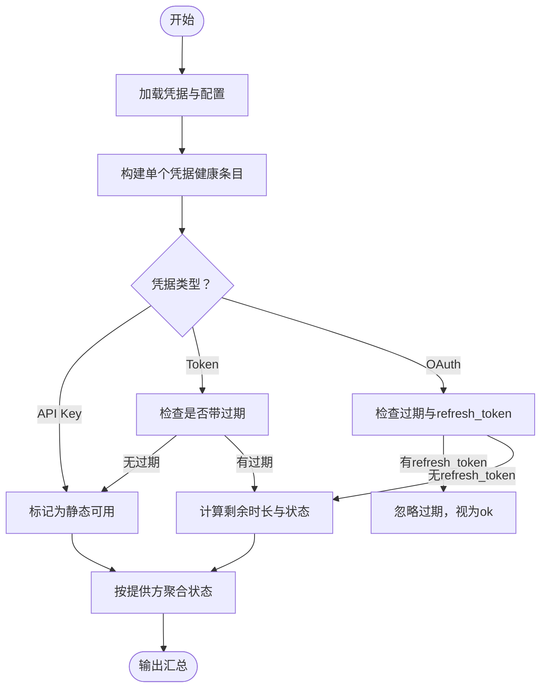

图表来源

- [src/agents/auth-health.ts](file://src/agents/auth-health.ts#L65-L154)
- [src/agents/auth-health.ts](file://src/agents/auth-health.ts#L156-L252)

章节来源

- [src/agents/auth-health.ts](file://src/agents/auth-health.ts#L1-L253)

### 组件B：OAuth凭据解析与刷新

- 功能要点
  - 在并发场景下通过文件锁保证凭据更新一致性。
  - 支持多提供方OAuth刷新，针对特殊提供方（如chutes、qwen-portal）采用专用刷新逻辑。
  - 若凭据未过期，直接返回；若过期则尝试刷新并持久化。
  - 提供回退策略：兼容旧默认profileId、二级代理继承主代理凭据、抛出可诊断错误。
- 关键流程
  - 解析profile配置与存储中的provider/mode一致性。
  - 若为静态token且过期，直接拒绝；OAuth优先走刷新。
  - 刷新失败时，尝试从主代理继承新鲜凭据，再抛出带修复建议的错误。
- 复杂度
  - 时间复杂度：O(1)（不含网络请求），加锁与IO开销受磁盘与并发影响。
  - 空间复杂度：O(1)。

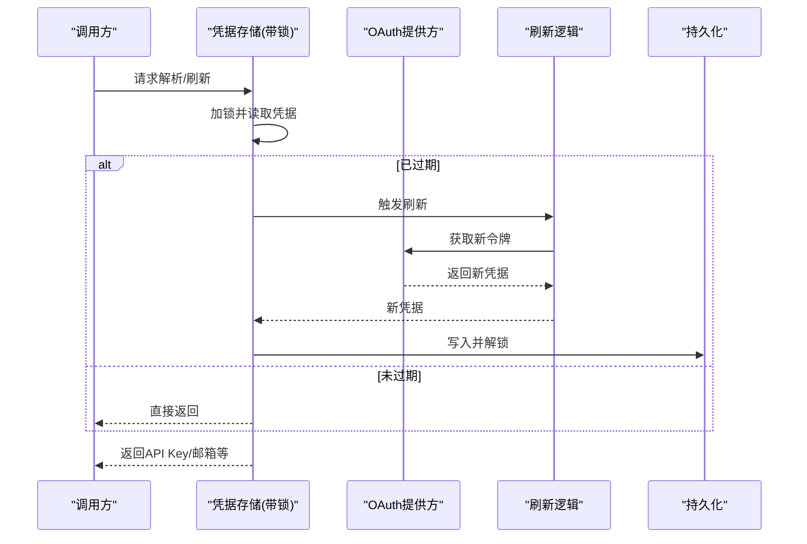

图表来源

- [src/agents/auth-profiles/oauth.ts](file://src/agents/auth-profiles/oauth.ts#L36-L106)
- [src/agents/auth-profiles/oauth.ts](file://src/agents/auth-profiles/oauth.ts#L149-L285)

章节来源

- [src/agents/auth-profiles/oauth.ts](file://src/agents/auth-profiles/oauth.ts#L1-L286)

### 组件C：使用统计与退避/禁用策略

- 功能要点
  - 成功使用后重置错误计数与冷却时间。
  - 失败时按原因分类（认证、格式、限流、账单、超时、未知），计算指数退避或账单禁用。
  - 提供冷却窗口与失败计数的跨会话记忆，避免频繁抖动。
- 关键流程
  - 解析配置中的账单退避小时数、最大小时数、失败窗口小时数。
  - 计算冷却时间：1min、5min、25min，上限1小时；账单禁用按2的幂次增长，上限受配置限制。
  - 统一计算“不可用截止时间”，用于UI显示与路由决策。
- 复杂度
  - 时间复杂度：O(1)。
  - 空间复杂度：O(1)。

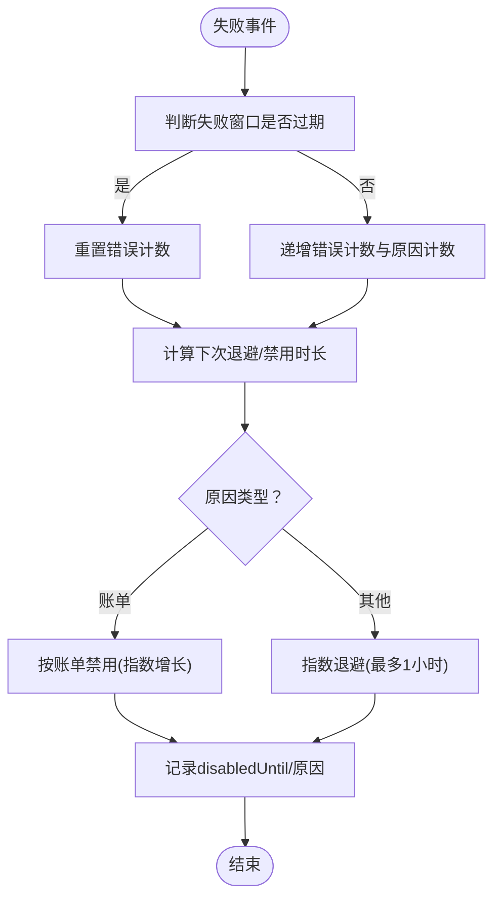

图表来源

- [src/agents/auth-profiles/usage.ts](file://src/agents/auth-profiles/usage.ts#L92-L134)
- [src/agents/auth-profiles/usage.ts](file://src/agents/auth-profiles/usage.ts#L160-L199)
- [src/agents/auth-profiles/usage.ts](file://src/agents/auth-profiles/usage.ts#L205-L263)

章节来源

- [src/agents/auth-profiles/usage.ts](file://src/agents/auth-profiles/usage.ts#L1-L323)

### 组件D：诊断与修复命令

- 功能要点
  - 自动发现过期/将过期/缺失的OAuth/Token凭据，输出可读列表与修复建议。
  - 支持一键刷新选中的OAuth凭据，并重新汇总健康状态。
  - 清理已废弃的CLI外部认证profile，保持配置简洁。
  - 对Anthropic等提供方的profileId不一致问题进行迁移修复。
- 关键流程
  - 构建健康摘要，筛选问题凭据。
  - 用户确认后逐个刷新，捕获错误并汇总。
  - 输出不可用凭据（冷却/禁用）及其剩余时长与原因。
- 复杂度
  - 时间复杂度：O(P + C)。
  - 空间复杂度：O(P + C)。

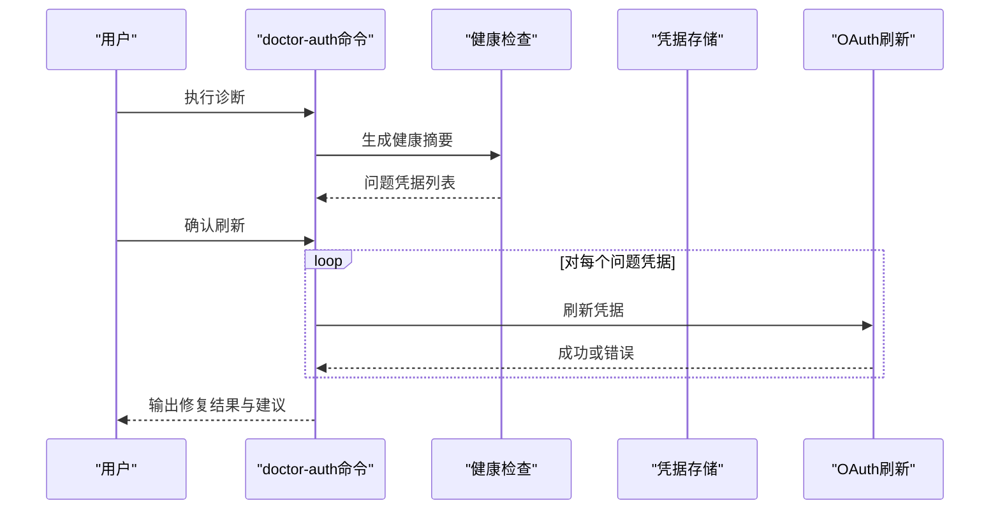

图表来源

- [src/commands/doctor-auth.ts](file://src/commands/doctor-auth.ts#L264-L334)
- [src/agents/auth-health.ts](file://src/agents/auth-health.ts#L156-L252)
- [src/agents/auth-profiles/oauth.ts](file://src/agents/auth-profiles/oauth.ts#L149-L285)

章节来源

- [src/commands/doctor-auth.ts](file://src/commands/doctor-auth.ts#L1-L335)

### 组件E：运维监控与安装

- 功能要点
  - 定时检查凭据有效期，支持nfty推送与OpenClaw消息提醒。
  - 安装脚本引导设置长期令牌、启用systemd定时任务、配置Termux快捷widget。
- 关键流程
  - 读取凭据文件与状态文件，计算剩余时长。
  - 根据阈值发送不同优先级的通知，并更新最近通知时间戳以避免刷屏。
  - 安装脚本更新服务环境变量、复制unit文件并启用timer。
- 复杂度
  - 时间复杂度：O(1)。
  - 空间复杂度：O(1)。

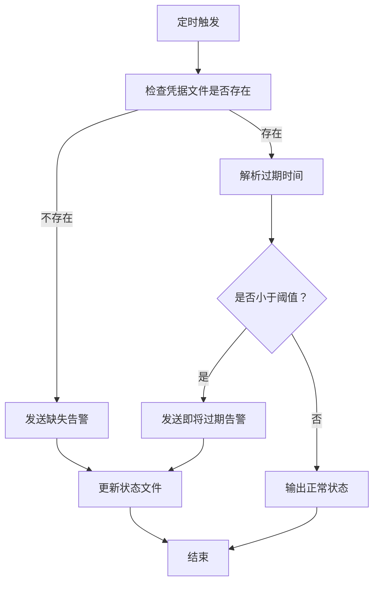

图表来源

- [scripts/auth-monitor.sh](file://scripts/auth-monitor.sh#L68-L90)
- [scripts/setup-auth-system.sh](file://scripts/setup-auth-system.sh#L64-L82)

章节来源

- [scripts/auth-monitor.sh](file://scripts/auth-monitor.sh#L1-L90)
- [scripts/setup-auth-system.sh](file://scripts/setup-auth-system.sh#L1-L120)

### 组件F：配置模板与渠道特定配置

- 配置模板要点
  - 认证配置包含profiles（按profileId定义provider/mode/email）、order（提供方优先顺序）、cooldowns（账单退避/失败窗口等）。
  - 渠道配置支持响应前缀、心跳可见性、链接预览等字段，部分字段支持按渠道或账号覆盖。
- 复杂度
  - 配置解析与渲染为线性复杂度，取决于字段数量。

```mermaid
classDiagram
class AuthProfileConfig {
+provider : string
+mode : "api_key" | "oauth" | "token"
+email? : string
}
class AuthConfig {
+profiles? : Record<string, AuthProfileConfig>
+order? : Record<string, string[]>
+cooldowns? : {
billingBackoffHours? : number
billingBackoffHoursByProvider? : Record<string, number>
billingMaxHours? : number
failureWindowHours? : number
}
}
class TelegramChannelConfig {
+heartbeat? : ChannelHeartbeatVisibilityConfig
+linkPreview? : boolean
+responsePrefix? : string
}
AuthConfig --> AuthProfileConfig : "包含"
```

图表来源

- [src/config/types.auth.ts](file://src/config/types.auth.ts#L1-L29)
- [src/config/types.telegram.ts](file://src/config/types.telegram.ts#L129-L141)

章节来源

- [src/config/types.auth.ts](file://src/config/types.auth.ts#L1-L29)
- [src/config/types.telegram.ts](file://src/config/types.telegram.ts#L129-L141)
- [ui/src/ui/views/channels.config.ts](file://ui/src/ui/views/channels.config.ts#L51-L104)

### 组件G：平台协议与UI渲染

- 功能要点
  - macOS与共享协议模型中包含channels、channelAccounts、channelDefaultAccountId等字段，用于UI侧渠道与账户展示。
  - UI渲染渠道额外字段（如groupPolicy、streamMode、dmPolicy）与响应前缀等。
- 复杂度
  - 协议模型与UI渲染均为常量级操作。

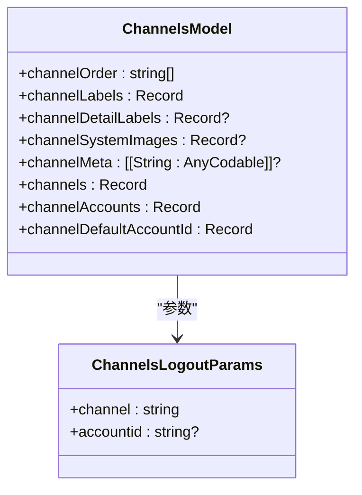

图表来源

- [apps/macos/Sources/OpenClawProtocol/GatewayModels.swift](file://apps/macos/Sources/OpenClawProtocol/GatewayModels.swift#L1483-L1519)
- [apps/shared/OpenClawKit/Sources/OpenClawProtocol/GatewayModels.swift](file://apps/shared/OpenClawKit/Sources/OpenClawProtocol/GatewayModels.swift#L1483-L1519)

章节来源

- [apps/macos/Sources/OpenClawProtocol/GatewayModels.swift](file://apps/macos/Sources/OpenClawProtocol/GatewayModels.swift#L1483-L1519)
- [apps/shared/OpenClawKit/Sources/OpenClawProtocol/GatewayModels.swift](file://apps/shared/OpenClawKit/Sources/OpenClawProtocol/GatewayModels.swift#L1483-L1519)
- [ui/src/ui/views/channels.config.ts](file://ui/src/ui/views/channels.config.ts#L51-L104)

### 组件H：安全审计与防护

- 功能要点
  - 检测配置文件权限（世界可读/组可写），提出修复方案。
  - 将渠道groupPolicy为open的项转换为allowlist，降低默认开放风险。
  - 使用timing-safe比较函数避免时序攻击。
- 复杂度
  - 文件权限检测与字符串比较为O(1)。

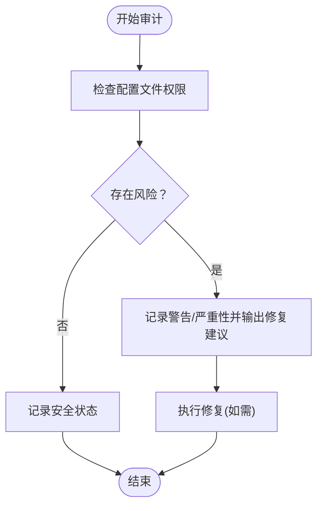

图表来源

- [src/security/audit.ts](file://src/security/audit.ts#L197-L231)
- [src/security/fix.ts](file://src/security/fix.ts#L187-L230)
- [src/security/audit-extra.sync.ts](file://src/security/audit-extra.sync.ts#L269-L301)
- [src/security/secret-equal.ts](file://src/security/secret-equal.ts#L1-L16)

章节来源

- [src/security/audit.ts](file://src/security/audit.ts#L197-L231)
- [src/security/fix.ts](file://src/security/fix.ts#L187-L230)
- [src/security/audit-extra.sync.ts](file://src/security/audit-extra.sync.ts#L269-L301)
- [src/security/secret-equal.ts](file://src/security/secret-equal.ts#L1-L16)

## 依赖关系分析

- 配置层依赖于类型定义与校验模块，为上层健康检查与诊断提供输入。
- 健康检查与诊断命令依赖于凭据存储与轮换模块，实现状态评估与修复。
- 凭据存储与轮换模块依赖使用统计模块进行退避与禁用控制。
- 运维监控脚本独立运行，但与诊断命令共享相同的健康检查逻辑。
- 平台协议与UI渲染依赖配置层提供的渠道与账户信息。
- 安全模块贯穿配置读取、凭据存储与UI渲染，提供权限与策略审计。

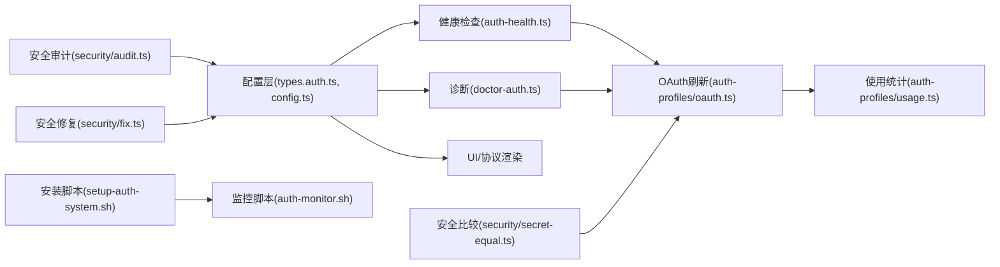

图表来源

- [src/config/types.auth.ts](file://src/config/types.auth.ts#L1-L29)
- [src/config/config.ts](file://src/config/config.ts#L1-L20)
- [src/agents/auth-health.ts](file://src/agents/auth-health.ts#L1-L253)
- [src/commands/doctor-auth.ts](file://src/commands/doctor-auth.ts#L1-L335)
- [src/agents/auth-profiles/oauth.ts](file://src/agents/auth-profiles/oauth.ts#L1-L286)
- [src/agents/auth-profiles/usage.ts](file://src/agents/auth-profiles/usage.ts#L1-L323)
- [scripts/setup-auth-system.sh](file://scripts/setup-auth-system.sh#L1-L120)
- [scripts/auth-monitor.sh](file://scripts/auth-monitor.sh#L1-L90)
- [src/security/audit.ts](file://src/security/audit.ts#L197-L231)
- [src/security/secret-equal.ts](file://src/security/secret-equal.ts#L1-L16)
- [src/security/fix.ts](file://src/security/fix.ts#L187-L230)

章节来源

- [src/config/types.auth.ts](file://src/config/types.auth.ts#L1-L29)
- [src/config/config.ts](file://src/config/config.ts#L1-L20)
- [src/agents/auth-health.ts](file://src/agents/auth-health.ts#L1-L253)
- [src/commands/doctor-auth.ts](file://src/commands/doctor-auth.ts#L1-L335)
- [src/agents/auth-profiles/oauth.ts](file://src/agents/auth-profiles/oauth.ts#L1-L286)
- [src/agents/auth-profiles/usage.ts](file://src/agents/auth-profiles/usage.ts#L1-L323)
- [scripts/setup-auth-system.sh](file://scripts/setup-auth-system.sh#L1-L120)
- [scripts/auth-monitor.sh](file://scripts/auth-monitor.sh#L1-L90)
- [src/security/audit.ts](file://src/security/audit.ts#L197-L231)
- [src/security/secret-equal.ts](file://src/security/secret-equal.ts#L1-L16)
- [src/security/fix.ts](file://src/security/fix.ts#L187-L230)

## 性能考量

- 并发安全：凭据刷新使用文件锁，避免竞态条件，适合高并发场景。
- 退避策略：指数退避上限1小时，账单禁用按2的幂次增长，减少对上游的压力。
- 会话粘性：按会话固定认证配置，减少缓存抖动，提升响应速度。
- IO优化：健康检查与诊断命令按需查询，避免全量扫描；监控脚本仅做简单解析与通知。

## 故障排除指南

- 无凭据或凭据缺失
  - 检查配置文件与凭据存储是否正确；必要时通过向导或命令行导入。
  - 参考：[认证文档](file://docs/gateway/authentication.md#L126-L146)
- 凭据即将过期/已过期
  - 使用诊断命令查看具体profile与剩余时长，选择刷新或重新授权。
  - 参考：[诊断命令](file://src/commands/doctor-auth.ts#L264-L334)
- 账单受限导致禁用
  - 查看冷却/禁用状态与剩余时长，等待或充值后重试。
  - 参考：[使用统计与退避](file://src/agents/auth-profiles/usage.ts#L184-L196)
- 配置文件权限问题
  - 按审计报告调整权限，避免世界可读/组可写。
  - 参考：[安全审计](file://src/security/audit.ts#L197-L231)
- 渠道策略过于开放
  - 将groupPolicy从open改为allowlist，降低风险。
  - 参考：[安全修复](file://src/security/fix.ts#L187-L230)

章节来源

- [docs/gateway/authentication.md](file://docs/gateway/authentication.md#L126-L146)
- [src/commands/doctor-auth.ts](file://src/commands/doctor-auth.ts#L264-L334)
- [src/agents/auth-profiles/usage.ts](file://src/agents/auth-profiles/usage.ts#L184-L196)
- [src/security/audit.ts](file://src/security/audit.ts#L197-L231)
- [src/security/fix.ts](file://src/security/fix.ts#L187-L230)

## 结论

OpenClaw认证配置系统通过清晰的配置模型、完善的健康检查与诊断、稳健的凭据存储与轮换、可靠的运维监控与安全审计，实现了对多提供方OAuth/Token/API Key的统一管理。其会话粘性与退避策略提升了稳定性与用户体验，而平台协议与UI渲染确保了跨端一致性。建议在生产环境中结合监控脚本与安全审计，持续优化配置与策略，保障认证体系的安全与可靠。

## 附录

- 认证流程图（概念）

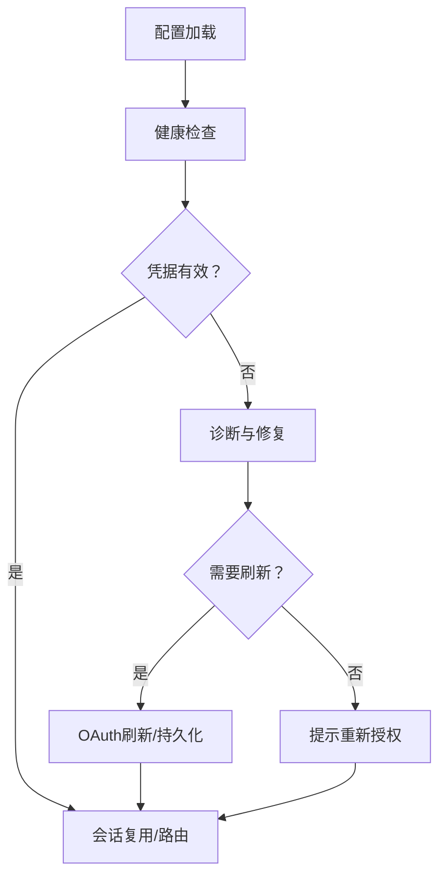

- 安全边界说明
  - 配置文件应严格限制权限，避免泄露敏感令牌。
  - 默认策略应收紧（如groupPolicy从open改为allowlist），最小化暴露面。
  - 使用安全比较函数避免时序攻击，确保凭据比对安全。
  - 监控脚本与诊断命令应具备最小权限原则，避免过度授权。
