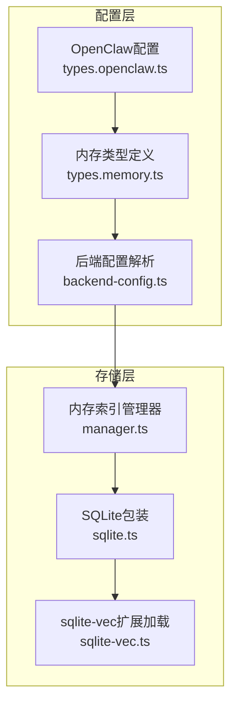
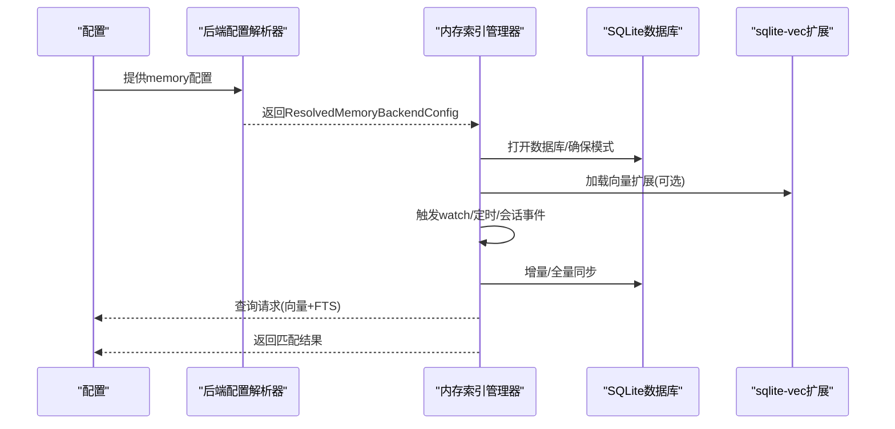
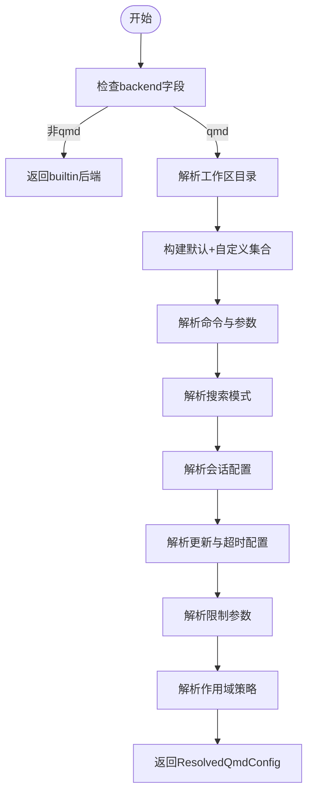
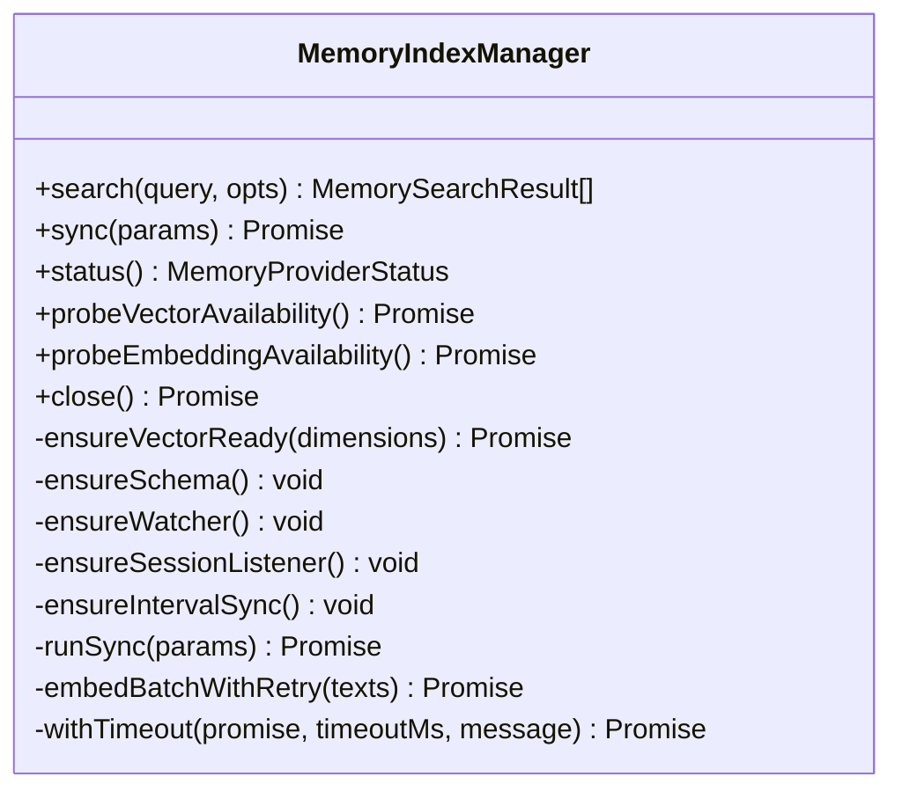
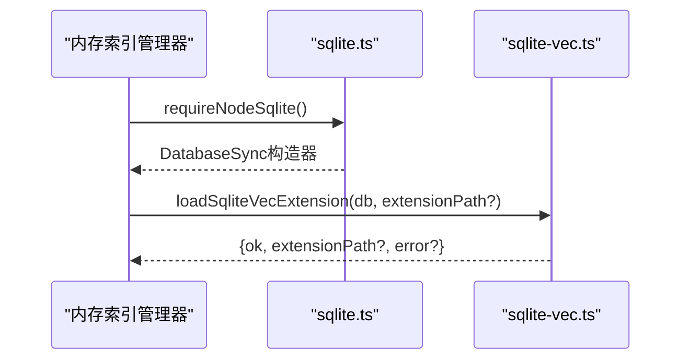
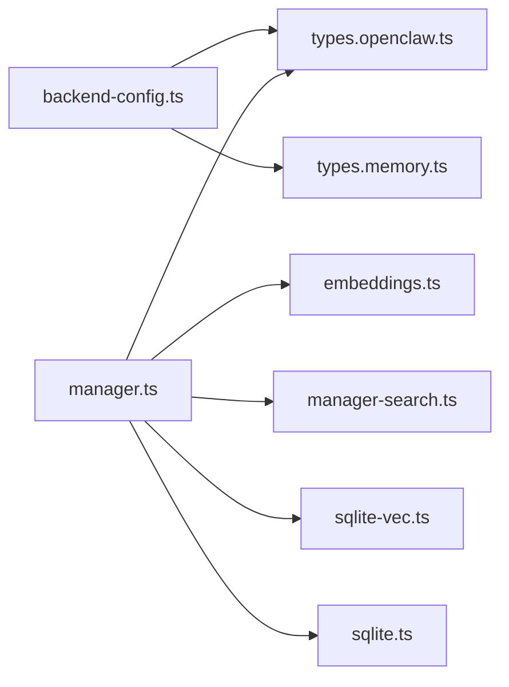

# 内存后端配置

<cite>
**本文引用的文件**
- [src/memory/backend-config.ts](file://src/memory/backend-config.ts)
- [src/config/types.memory.ts](file://src/config/types.memory.ts)
- [src/config/types.openclaw.ts](file://src/config/types.openclaw.ts)
- [src/memory/sqlite.ts](file://src/memory/sqlite.ts)
- [src/memory/sqlite-vec.ts](file://src/memory/sqlite-vec.ts)
- [src/memory/manager.ts](file://src/memory/manager.ts)
- [src/memory/backend-config.test.ts](file://src/memory/backend-config.test.ts)
</cite>

## 目录

1. [简介](#简介)
2. [项目结构](#项目结构)
3. [核心组件](#核心组件)
4. [架构总览](#架构总览)
5. [详细组件分析](#详细组件分析)
6. [依赖关系分析](#依赖关系分析)
7. [性能考量](#性能考量)
8. [故障排查指南](#故障排查指南)
9. [结论](#结论)
10. [附录](#附录)

## 简介

本文件面向OpenClaw内存后端配置系统，聚焦于“内置”与“QMD”两种后端的配置解析、SQLite存储与向量扩展、FTS全文检索、启用/禁用策略、自动检测与兼容性检查、配置文件格式与环境变量支持、动态配置更新等主题。文档同时提供参数说明、最佳实践、验证工具与迁移建议，帮助开发者与运维人员在不同平台与场景下稳定地部署与优化内存索引能力。

## 项目结构

围绕内存后端的关键代码位于以下模块：

- 配置解析与类型：backend-config.ts、types.memory.ts、types.openclaw.ts
- SQLite与向量扩展：sqlite.ts、sqlite-vec.ts
- 内存索引管理：manager.ts（含向量、FTS、批处理、缓存、同步策略）
- 配置验证与示例：backend-config.test.ts

图表来源

- [src/config/types.openclaw.ts](file://src/config/types.openclaw.ts#L28-L100)
- [src/config/types.memory.ts](file://src/config/types.memory.ts#L3-L53)
- [src/memory/backend-config.ts](file://src/memory/backend-config.ts#L254-L311)
- [src/memory/sqlite.ts](file://src/memory/sqlite.ts#L1-L10)
- [src/memory/sqlite-vec.ts](file://src/memory/sqlite-vec.ts#L1-L25)
- [src/memory/manager.ts](file://src/memory/manager.ts#L104-L248)

章节来源

- [src/config/types.openclaw.ts](file://src/config/types.openclaw.ts#L28-L100)
- [src/config/types.memory.ts](file://src/config/types.memory.ts#L3-L53)
- [src/memory/backend-config.ts](file://src/memory/backend-config.ts#L254-L311)
- [src/memory/sqlite.ts](file://src/memory/sqlite.ts#L1-L10)
- [src/memory/sqlite-vec.ts](file://src/memory/sqlite-vec.ts#L1-L25)
- [src/memory/manager.ts](file://src/memory/manager.ts#L104-L248)

## 核心组件

- 后端配置解析器：将OpenClaw配置转换为运行时的ResolvedMemoryBackendConfig，支持默认值、路径解析、时间间隔解析、限制参数解析、会话导出配置等。
- 内存索引管理器：负责数据库打开、模式初始化、向量扩展加载、FTS可用性检测、增量/全量同步、批处理嵌入、缓存命中与写入、超时与重试、回退策略等。
- SQLite与sqlite-vec：封装node:sqlite并按需加载sqlite-vec扩展；根据配置决定是否允许扩展加载。
- 类型系统：统一定义MemoryBackend、MemoryCitationsMode、MemoryQmdSearchMode以及相关配置对象，确保配置结构与默认行为一致。

章节来源

- [src/memory/backend-config.ts](file://src/memory/backend-config.ts#L16-L62)
- [src/memory/manager.ts](file://src/memory/manager.ts#L111-L248)
- [src/memory/sqlite.ts](file://src/memory/sqlite.ts#L1-L10)
- [src/memory/sqlite-vec.ts](file://src/memory/sqlite-vec.ts#L1-L25)
- [src/config/types.memory.ts](file://src/config/types.memory.ts#L3-L53)

## 架构总览

内存后端的运行流程如下：

- 解析配置：从OpenClaw配置读取memory段，解析为ResolvedQmdConfig或回退到builtin。
- 初始化存储：打开SQLite数据库，确保模式与FTS可用性，按需加载sqlite-vec扩展。
- 同步策略：基于watch、session增量、定时任务触发同步；支持批处理嵌入与缓存。
- 搜索流程：混合检索（向量+FTS），按权重合并结果，返回片段与评分。

图表来源

- [src/memory/backend-config.ts](file://src/memory/backend-config.ts#L254-L311)
- [src/memory/manager.ts](file://src/memory/manager.ts#L169-L248)
- [src/memory/sqlite-vec.ts](file://src/memory/sqlite-vec.ts#L3-L24)

## 详细组件分析

### 后端配置解析器（backend-config.ts）

职责与特性：

- 默认后端：当memory.backend未指定时，默认使用builtin。
- QMD后端：当backend为qmd时，解析命令、搜索模式、集合（默认+自定义）、会话导出、更新与超时、限制参数、作用域策略等。
- 路径解析：支持绝对路径、~展开、相对工作区路径解析与规范化。
- 时间间隔解析：支持字符串到毫秒的解析，带默认值与容错。
- 限制参数解析：对最大结果数、片段长度、注入长度、超时进行数值校验与取整。
- 会话配置：启用开关、导出目录、保留天数。
- 名称去重：为集合生成唯一名称，避免冲突。

图表来源

- [src/memory/backend-config.ts](file://src/memory/backend-config.ts#L254-L311)

章节来源

- [src/memory/backend-config.ts](file://src/memory/backend-config.ts#L16-L62)
- [src/memory/backend-config.ts](file://src/memory/backend-config.ts#L111-L120)
- [src/memory/backend-config.ts](file://src/memory/backend-config.ts#L122-L144)
- [src/memory/backend-config.ts](file://src/memory/backend-config.ts#L160-L175)
- [src/memory/backend-config.ts](file://src/memory/backend-config.ts#L177-L182)
- [src/memory/backend-config.ts](file://src/memory/backend-config.ts#L184-L198)
- [src/memory/backend-config.ts](file://src/memory/backend-config.ts#L200-L231)
- [src/memory/backend-config.ts](file://src/memory/backend-config.ts#L233-L252)
- [src/memory/backend-config.ts](file://src/memory/backend-config.ts#L254-L311)

### 内存索引管理器（manager.ts）

职责与特性：

- 数据库与模式：打开SQLite数据库，确保表结构（files、chunks、meta、FTS、向量表）存在；支持向量维度变更时重建表。
- 向量扩展：按配置启用/禁用，加载sqlite-vec扩展，超时控制，失败记录与恢复。
- FTS：按需启用，可用性检测，查询构建与BM25归一化。
- 同步策略：watch文件变化、会话增量、定时任务；支持强制同步与全量重建。
- 批处理嵌入：针对OpenAI/Gemini/Voyage提供批处理接口，失败计数与回退至非批处理。
- 缓存：嵌入向量缓存表，LRU裁剪，命中率优化。
- 超时与重试：查询与批处理分别设定本地/远程超时阈值，速率限制类错误指数退避重试。
- 回退策略：嵌入错误时切换备用提供商，记录原因与来源。

图表来源

- [src/memory/manager.ts](file://src/memory/manager.ts#L111-L248)
- [src/memory/manager.ts](file://src/memory/manager.ts#L266-L314)
- [src/memory/manager.ts](file://src/memory/manager.ts#L391-L403)
- [src/memory/manager.ts](file://src/memory/manager.ts#L567-L582)
- [src/memory/manager.ts](file://src/memory/manager.ts#L613-L667)
- [src/memory/manager.ts](file://src/memory/manager.ts#L798-L810)
- [src/memory/manager.ts](file://src/memory/manager.ts#L812-L846)
- [src/memory/manager.ts](file://src/memory/manager.ts#L848-L862)
- [src/memory/manager.ts](file://src/memory/manager.ts#L1022-L1033)
- [src/memory/manager.ts](file://src/memory/manager.ts#L1271-L1337)
- [src/memory/manager.ts](file://src/memory/manager.ts#L1339-L1405)
- [src/memory/manager.ts](file://src/memory/manager.ts#L1407-L1509)
- [src/memory/manager.ts](file://src/memory/manager.ts#L2006-L2085)
- [src/memory/manager.ts](file://src/memory/manager.ts#L2140-L2192)

章节来源

- [src/memory/manager.ts](file://src/memory/manager.ts#L111-L248)
- [src/memory/manager.ts](file://src/memory/manager.ts#L613-L667)
- [src/memory/manager.ts](file://src/memory/manager.ts#L798-L810)
- [src/memory/manager.ts](file://src/memory/manager.ts#L1022-L1033)
- [src/memory/manager.ts](file://src/memory/manager.ts#L1271-L1337)
- [src/memory/manager.ts](file://src/memory/manager.ts#L1339-L1405)
- [src/memory/manager.ts](file://src/memory/manager.ts#L1407-L1509)
- [src/memory/manager.ts](file://src/memory/manager.ts#L2006-L2085)
- [src/memory/manager.ts](file://src/memory/manager.ts#L2140-L2192)

### SQLite与sqlite-vec（sqlite.ts、sqlite-vec.ts）

- sqlite.ts：封装node:sqlite加载，安装进程警告过滤，按需启用扩展加载。
- sqlite-vec.ts：加载sqlite-vec扩展，支持显式扩展路径或自动探测；捕获异常并返回错误信息。

图表来源

- [src/memory/sqlite.ts](file://src/memory/sqlite.ts#L1-L10)
- [src/memory/sqlite-vec.ts](file://src/memory/sqlite-vec.ts#L3-L24)

章节来源

- [src/memory/sqlite.ts](file://src/memory/sqlite.ts#L1-L10)
- [src/memory/sqlite-vec.ts](file://src/memory/sqlite-vec.ts#L1-L25)

### 配置类型与默认值（types.memory.ts、types.openclaw.ts）

- MemoryBackend：builtin、qmd
- MemoryCitationsMode：auto、on、off
- MemoryQmdSearchMode：query、search、vsearch
- MemoryConfig：backend、citations、qmd
- MemoryQmdConfig：command、searchMode、includeDefaultMemory、paths、sessions、update、limits、scope
- OpenClawConfig：在根级包含memory字段，作为全局默认

章节来源

- [src/config/types.memory.ts](file://src/config/types.memory.ts#L3-L53)
- [src/config/types.openclaw.ts](file://src/config/types.openclaw.ts#L28-L100)

## 依赖关系分析

- backend-config.ts依赖：
  - OpenClaw配置类型（types.openclaw.ts）
  - 代理工作区解析（agents/agent-scope）
  - 时长解析（cli/parse-duration）
  - 用户路径解析（utils）
  - shell参数拆分（utils/shell-argv）
- manager.ts依赖：
  - 配置解析（config/config）
  - 代理作用域（agents/agent-scope）
  - 会话转录路径（config/sessions/paths）
  - 日志子系统（logging/subsystem）
  - 会话事件（sessions/transcript-events）
  - 嵌入提供者（memory/embeddings）
  - FTS与向量搜索（memory/manager-search）
  - sqlite-vec扩展（memory/sqlite-vec）
  - node:sqlite（memory/sqlite）

图表来源

- [src/memory/backend-config.ts](file://src/memory/backend-config.ts#L1-L15)
- [src/memory/manager.ts](file://src/memory/manager.ts#L1-L67)
- [src/config/types.openclaw.ts](file://src/config/types.openclaw.ts#L14-L20)
- [src/config/types.memory.ts](file://src/config/types.memory.ts#L1-L53)

章节来源

- [src/memory/backend-config.ts](file://src/memory/backend-config.ts#L1-L15)
- [src/memory/manager.ts](file://src/memory/manager.ts#L1-L67)

## 性能考量

- 并发与批处理
  - 嵌入并发：默认4路并发（本地模型）；启用批处理时由配置concurrency决定。
  - 批处理等待与轮询：wait、pollIntervalMs、timeoutMs影响吞吐与延迟。
  - 批失败上限：超过BATCH_FAILURE_LIMIT后禁用批处理并回退。
- 超时与重试
  - 查询与批处理分别设置本地/远程超时阈值，避免长时间阻塞。
  - 速率限制类错误采用指数退避重试，最多3次。
- 缓存与裁剪
  - 嵌入缓存表按provider/model/provider_key/hash索引，支持LRU裁剪（maxEntries）。
- 向量与FTS
  - 向量表按维度动态创建；FTS按模型隔离，避免跨模型污染。
  - 混合检索通过权重融合，兼顾召回与相关度。

章节来源

- [src/memory/manager.ts](file://src/memory/manager.ts#L92-L102)
- [src/memory/manager.ts](file://src/memory/manager.ts#L1343-L1364)
- [src/memory/manager.ts](file://src/memory/manager.ts#L2006-L2085)
- [src/memory/manager.ts](file://src/memory/manager.ts#L1647-L1673)
- [src/memory/manager.ts](file://src/memory/manager.ts#L302-L314)

## 故障排查指南

- 启用/禁用与兼容性
  - 当backend非qmd时，自动回退到builtin；仅当backend为qmd且配置有效时才启用QMD后端。
  - sqlite-vec加载失败时记录错误并标记不可用；后续查询将不使用向量能力。
- FTS不可用
  - 若FTS不可用，关键词检索将为空；可在状态中查看available与loadError。
- 批处理失败
  - 多次失败后禁用批处理并回退；记录最后错误与提供方；可通过调整concurrency/pollIntervalMs/timeoutMs缓解。
- 超时与重试
  - 若出现超时，系统会尝试一次性重试；若仍失败，记录失败计数并可能禁用批处理。
- 路径与权限
  - 自定义路径需在工作区内或额外允许路径内；非法路径会抛出错误。
- 验证与测试
  - 使用backend-config.test.ts中的用例作为参考，覆盖默认值、命令解析、路径解析、超时覆盖、搜索模式等场景。

章节来源

- [src/memory/backend-config.ts](file://src/memory/backend-config.ts#L254-L311)
- [src/memory/manager.ts](file://src/memory/manager.ts#L613-L667)
- [src/memory/manager.ts](file://src/memory/manager.ts#L800-L810)
- [src/memory/manager.ts](file://src/memory/manager.ts#L1339-L1405)
- [src/memory/manager.ts](file://src/memory/manager.ts#L2006-L2085)
- [src/memory/backend-config.test.ts](file://src/memory/backend-config.test.ts#L7-L112)

## 结论

OpenClaw内存后端配置系统通过清晰的类型定义与严格的解析逻辑，实现了从OpenClaw配置到运行时后端的平滑映射。内置后端以SQLite为核心，结合sqlite-vec与FTS，提供向量化与关键词混合检索；QMD后端则通过外部命令与集合配置实现灵活的内容索引。配合批处理、缓存、超时与回退策略，系统在不同环境与负载下具备良好的稳定性与可维护性。

## 附录

### 配置项与默认值速览

- 后端选择
  - backend: builtin | qmd（默认：builtin）
  - citations: auto | on | off（默认：auto）
- QMD配置（backend=qmd时生效）
  - command: 字符串（默认："qmd"，支持shell参数解析）
  - searchMode: query | search | vsearch（默认："query"）
  - includeDefaultMemory: boolean（默认：true）
  - paths: 数组（path/name/pattern）
  - sessions.enabled: boolean（默认：false）
  - sessions.exportDir: 字符串（相对工作区或绝对路径）
  - sessions.retentionDays: number（默认：无）
  - update.interval: 字符串（如"5m"）（默认："5m"）
  - update.debounceMs: number（默认：15000）
  - update.onBoot: boolean（默认：true）
  - update.waitForBootSync: boolean（默认：false）
  - update.embedInterval: 字符串（默认："60m"）
  - update.commandTimeoutMs: number（默认：30000）
  - update.updateTimeoutMs: number（默认：120000）
  - update.embedTimeoutMs: number（默认：120000）
  - limits.maxResults: number（默认：6）
  - limits.maxSnippetChars: number（默认：700）
  - limits.maxInjectedChars: number（默认：4000）
  - limits.timeoutMs: number（默认：4000）
  - scope: SessionSendPolicyConfig（默认：default deny，允许direct聊天）

章节来源

- [src/config/types.memory.ts](file://src/config/types.memory.ts#L7-L53)
- [src/memory/backend-config.ts](file://src/memory/backend-config.ts#L64-L88)
- [src/memory/backend-config.ts](file://src/memory/backend-config.ts#L122-L158)
- [src/memory/backend-config.ts](file://src/memory/backend-config.ts#L160-L175)
- [src/memory/backend-config.ts](file://src/memory/backend-config.ts#L177-L182)
- [src/memory/backend-config.ts](file://src/memory/backend-config.ts#L184-L198)

### 存储路径与SQLite配置

- 数据库存放：由manager.ts读取store.path并解析用户路径，确保目录存在后打开数据库。
- 扩展加载：当vector.enabled为true时，允许扩展加载；sqlite-vec按配置extensionPath或自动探测。
- 表结构：files、chunks、meta、FTS表、向量表（vec0），按需创建与维度变更重建。

章节来源

- [src/memory/manager.ts](file://src/memory/manager.ts#L704-L714)
- [src/memory/manager.ts](file://src/memory/manager.ts#L641-L667)
- [src/memory/manager.ts](file://src/memory/manager.ts#L669-L692)

### 启用/禁用策略与自动检测

- 后端启用：backend=qmd时启用QMD；否则builtin。
- 向量扩展：按配置启用，加载失败则降级为不可用。
- FTS：按配置启用，可用性检测失败记录错误。
- 批处理：根据提供商与配置决定是否启用，失败计数达到阈值后禁用。

章节来源

- [src/memory/backend-config.ts](file://src/memory/backend-config.ts#L254-L311)
- [src/memory/manager.ts](file://src/memory/manager.ts#L232-L238)
- [src/memory/manager.ts](file://src/memory/manager.ts#L800-L810)
- [src/memory/manager.ts](file://src/memory/manager.ts#L1343-L1364)

### 动态配置更新与验证

- 运行时更新：manager.ts内部通过watch、定时器、会话事件驱动增量同步；全量重建通过force参数触发。
- 配置验证：backend-config.test.ts提供多场景断言，建议在CI中复用类似用例进行回归测试。
- 最佳实践：合理设置update.embedInterval与limits，避免频繁全量重建；在高并发场景适当提高concurrency并关注批处理超时。

章节来源

- [src/memory/manager.ts](file://src/memory/manager.ts#L812-L846)
- [src/memory/manager.ts](file://src/memory/manager.ts#L1022-L1033)
- [src/memory/manager.ts](file://src/memory/manager.ts#L1271-L1337)
- [src/memory/backend-config.test.ts](file://src/memory/backend-config.test.ts#L7-L112)
