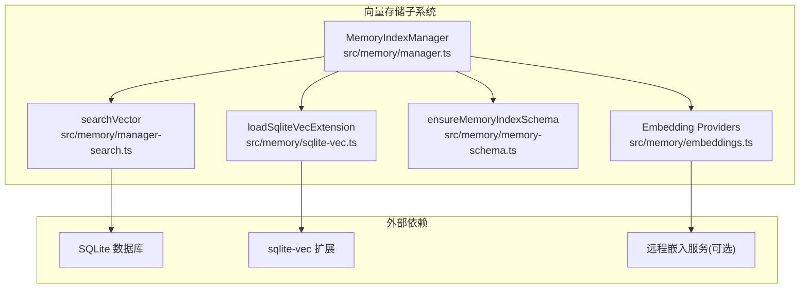
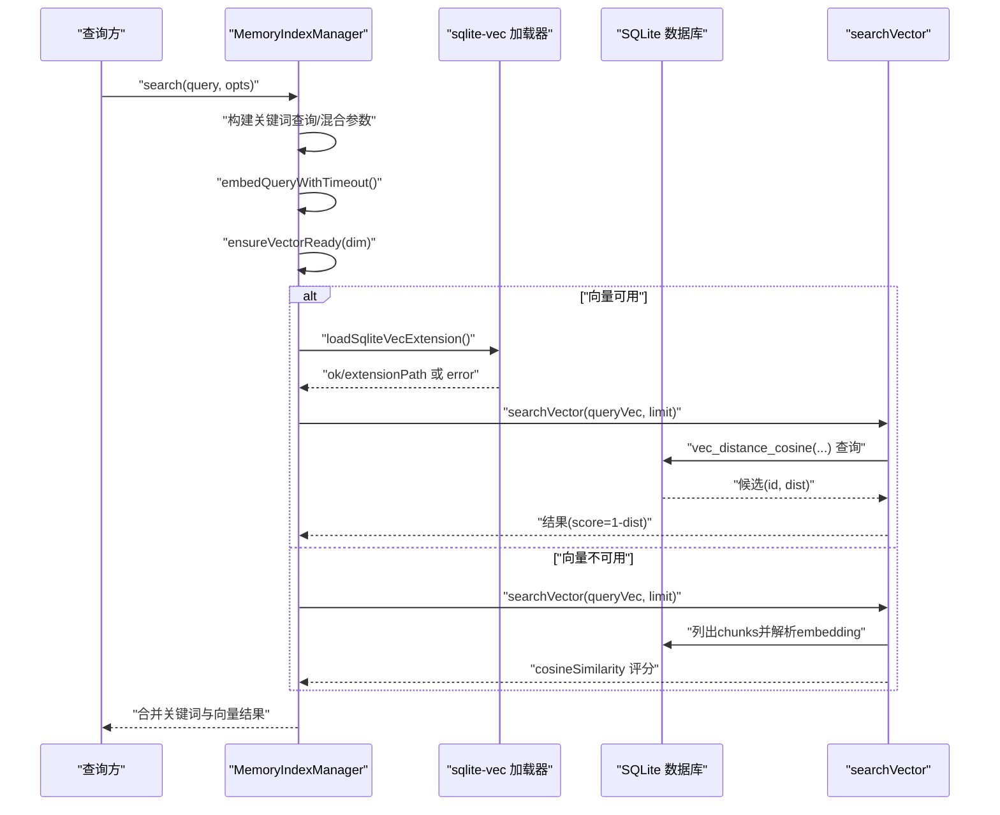
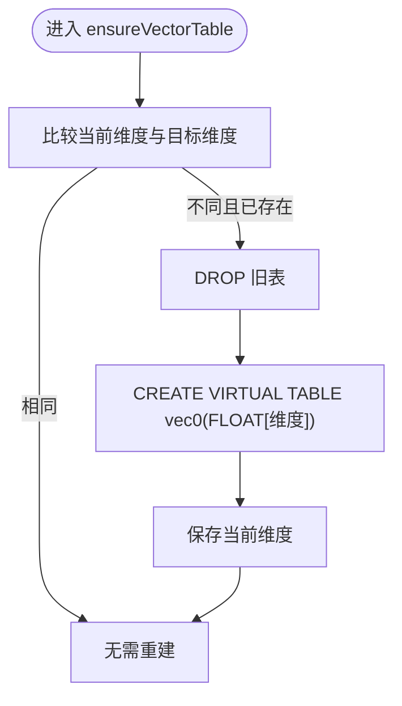
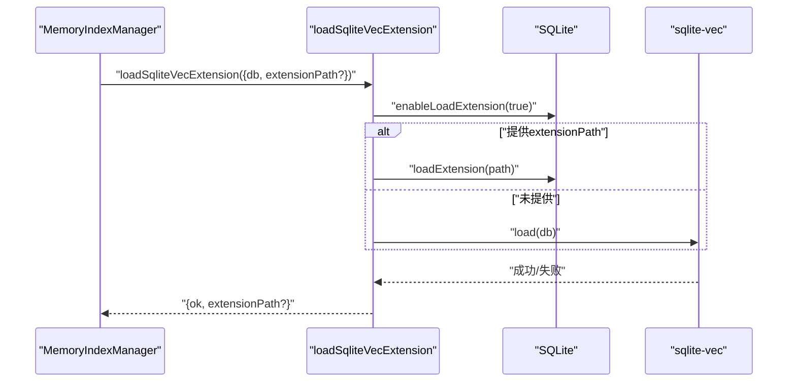
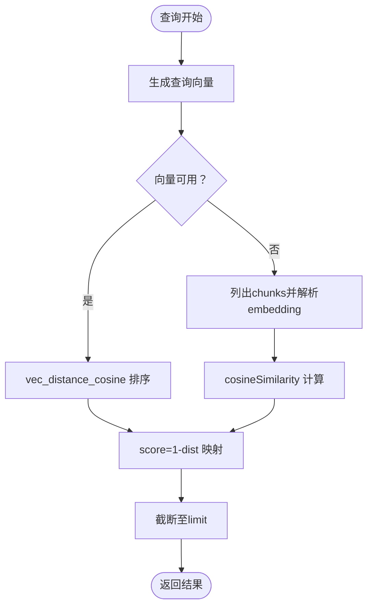
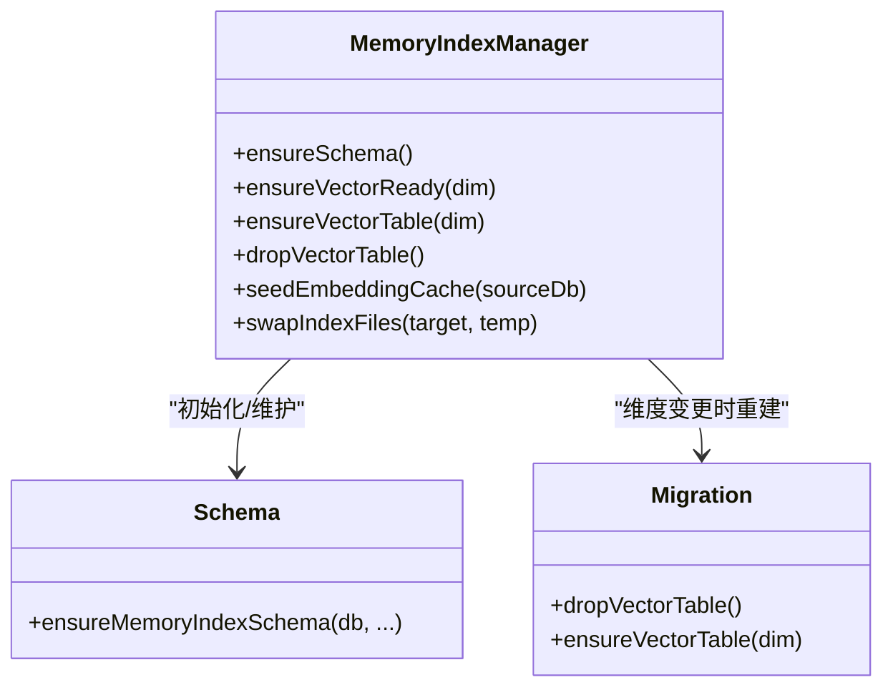
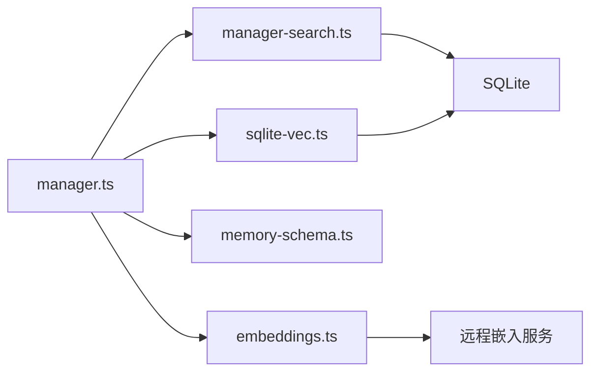
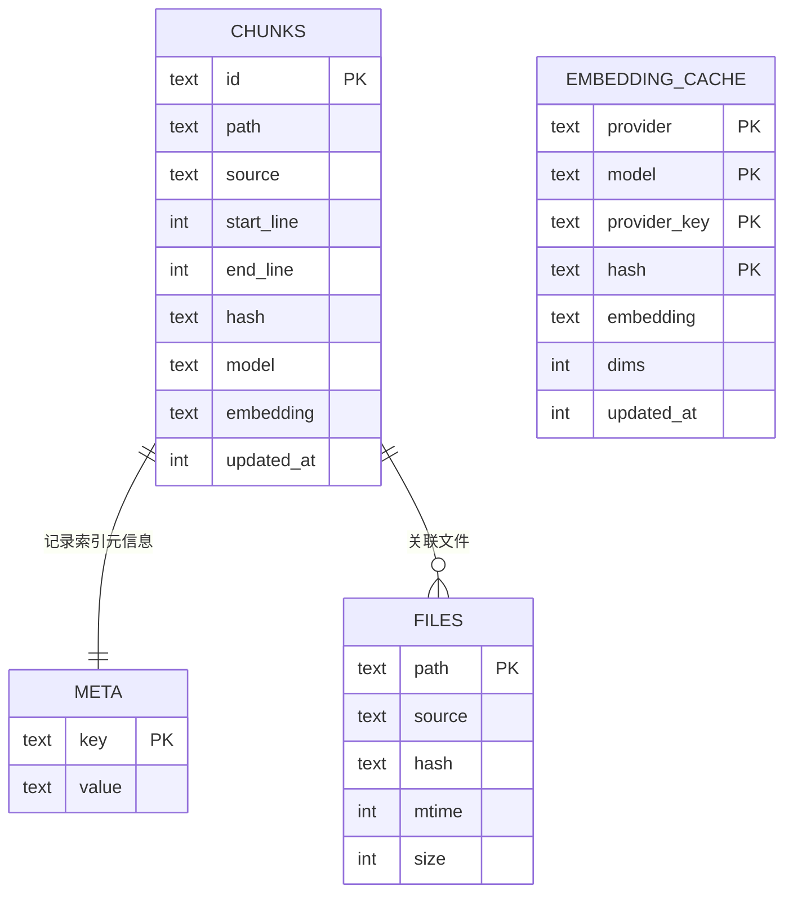

# 向量存储

<cite>
**本文引用的文件**
- [src/memory/manager.ts](file://src/memory/manager.ts)
- [src/memory/manager-search.ts](file://src/memory/manager-search.ts)
- [src/memory/sqlite-vec.ts](file://src/memory/sqlite-vec.ts)
- [src/memory/memory-schema.ts](file://src/memory/memory-schema.ts)
- [src/memory/embeddings.ts](file://src/memory/embeddings.ts)
- [scripts/sqlite-vec-smoke.mjs](file://scripts/sqlite-vec-smoke.mjs)
- [extensions/memory-lancedb/index.ts](file://extensions/memory-lancedb/index.ts)
- [extensions/memory-lancedb/config.ts](file://extensions/memory-lancedb/config.ts)
</cite>

## 目录

1. [简介](#简介)
2. [项目结构](#项目结构)
3. [核心组件](#核心组件)
4. [架构总览](#架构总览)
5. [详细组件分析](#详细组件分析)
6. [依赖关系分析](#依赖关系分析)
7. [性能考量](#性能考量)
8. [故障排除指南](#故障排除指南)
9. [结论](#结论)
10. [附录](#附录)

## 简介

本文件面向OpenClaw的向量存储子系统，聚焦sqlite-vec扩展的集成与配置，系统性说明向量表结构、维度管理、索引优化；阐述向量嵌入的存储格式（二进制浮点）、内存布局与相似度计算；解释向量表的创建、维护与迁移机制；并提供架构图、性能基准参考与容量规划建议，以及配置示例与故障排除指引。

## 项目结构

OpenClaw将“向量检索”作为内置记忆索引的一部分，采用SQLite数据库与sqlite-vec扩展结合的方式实现高内聚、低耦合的本地向量检索能力。关键模块包括：

- 记忆索引管理器：负责数据库打开、模式初始化、向量表与FTS表的维护、向量可用性探测与加载、同步与搜索编排。
- 搜索执行器：封装向量与关键词混合检索的SQL与评分逻辑。
- sqlite-vec扩展加载器：统一处理扩展启用、加载与错误上报。
- 嵌入模型与归一化：提供多提供商嵌入生成与向量标准化。
- 示例脚本：最小可运行的sqlite-vec加载与查询验证。

**图表来源**

- [src/memory/manager.ts](file://src/memory/manager.ts#L111-L248)
- [src/memory/manager-search.ts](file://src/memory/manager-search.ts#L20-L94)
- [src/memory/sqlite-vec.ts](file://src/memory/sqlite-vec.ts#L3-L24)
- [src/memory/memory-schema.ts](file://src/memory/memory-schema.ts#L3-L83)
- [src/memory/embeddings.ts](file://src/memory/embeddings.ts#L130-L214)

**章节来源**

- [src/memory/manager.ts](file://src/memory/manager.ts#L111-L248)
- [src/memory/manager-search.ts](file://src/memory/manager-search.ts#L20-L94)
- [src/memory/sqlite-vec.ts](file://src/memory/sqlite-vec.ts#L3-L24)
- [src/memory/memory-schema.ts](file://src/memory/memory-schema.ts#L3-L83)
- [src/memory/embeddings.ts](file://src/memory/embeddings.ts#L130-L214)

## 核心组件

- MemoryIndexManager：负责数据库生命周期、模式初始化、向量表与FTS表维护、向量可用性探测、批量嵌入缓存、增量同步与混合检索。
- searchVector：在向量可用时调用sqlite-vec的余弦距离函数进行检索；不可用时回退到本地计算余弦相似度。
- loadSqliteVecExtension：启用扩展、加载sqlite-vec，并返回实际加载路径或错误信息。
- ensureMemoryIndexSchema：确保基础表与索引存在，按需创建FTS虚拟表。
- Embedding Providers：支持OpenAI、Gemini、Voyage与本地LLama模型，统一输出单位化向量。

**章节来源**

- [src/memory/manager.ts](file://src/memory/manager.ts#L111-L248)
- [src/memory/manager-search.ts](file://src/memory/manager-search.ts#L20-L94)
- [src/memory/sqlite-vec.ts](file://src/memory/sqlite-vec.ts#L3-L24)
- [src/memory/memory-schema.ts](file://src/memory/memory-schema.ts#L3-L83)
- [src/memory/embeddings.ts](file://src/memory/embeddings.ts#L130-L214)

## 架构总览

下图展示从查询到向量检索的关键流程，包括向量可用性检查、表结构准备、SQL检索与评分映射。

**图表来源**

- [src/memory/manager.ts](file://src/memory/manager.ts#L266-L314)
- [src/memory/manager-search.ts](file://src/memory/manager-search.ts#L20-L94)
- [src/memory/sqlite-vec.ts](file://src/memory/sqlite-vec.ts#L3-L24)

## 详细组件分析

### 组件A：向量表结构与维度管理

- 表名与列：向量表使用虚拟表vec0，主键为id，列embedding为FLOAT[维度]，用于存储二进制浮点向量。
- 维度变更：当检测到维度变化时，先删除旧表，再以新维度重建，确保一致性。
- 存储格式：向量以二进制形式存储于embedding列，由Float32Array打包为Buffer写入。
- 元数据：通过meta表记录索引元信息（含vectorDims），用于重启后恢复维度状态。

**图表来源**

- [src/memory/manager.ts](file://src/memory/manager.ts#L669-L683)
- [src/memory/memory-schema.ts](file://src/memory/memory-schema.ts#L3-L49)

**章节来源**

- [src/memory/manager.ts](file://src/memory/manager.ts#L669-L683)
- [src/memory/memory-schema.ts](file://src/memory/memory-schema.ts#L3-L49)

### 组件B：sqlite-vec扩展加载与配置

- 加载入口：enableLoadExtension(true)后，通过sqlite-vec.load或显式loadExtension加载。
- 路径优先级：若用户提供了extensionPath，则直接使用；否则使用getLoadablePath自动定位。
- 可用性探测：ensureVectorReady在超时时间内完成加载即视为可用，失败则记录错误并降级。
- 数据库连接：根据配置决定是否允许扩展（allowExtension）。

**图表来源**

- [src/memory/sqlite-vec.ts](file://src/memory/sqlite-vec.ts#L3-L24)
- [src/memory/manager.ts](file://src/memory/manager.ts#L641-L667)

**章节来源**

- [src/memory/sqlite-vec.ts](file://src/memory/sqlite-vec.ts#L3-L24)
- [src/memory/manager.ts](file://src/memory/manager.ts#L641-L667)

### 组件C：向量嵌入与相似度计算

- 嵌入生成：支持OpenAI、Gemini、Voyage与本地LLama模型；统一进行数值清洗与向量归一化。
- 存储格式：embedding列存储字符串化的向量（解析时转换为数组）；写入时由Float32Array转Buffer。
- 相似度计算：
  - 向量可用：使用sqlite-vec的余弦距离函数，score=1-distance。
  - 向量不可用：从chunks表读取已持久化的embedding，计算余弦相似度。
- 查询SQL：JOIN chunks与向量表，按距离排序，限制返回数量。

**图表来源**

- [src/memory/manager-search.ts](file://src/memory/manager-search.ts#L20-L94)
- [src/memory/embeddings.ts](file://src/memory/embeddings.ts#L11-L18)

**章节来源**

- [src/memory/manager-search.ts](file://src/memory/manager-search.ts#L20-L94)
- [src/memory/embeddings.ts](file://src/memory/embeddings.ts#L11-L18)

### 组件D：向量表的创建、维护与迁移

- 创建：首次使用时按当前维度创建虚拟表vec0，列embedding为FLOAT[维度]。
- 维护：确保基础表chunks、files与索引存在；FTS虚拟表按需创建；embedding_cache表用于嵌入缓存。
- 迁移：当检测到维度变化时，先DROP旧表，再以新维度重建，避免不一致。
- 备份与切换：索引文件通过临时文件名交换方式安全切换，失败时回滚至备份。

**图表来源**

- [src/memory/manager.ts](file://src/memory/manager.ts#L798-L83)
- [src/memory/manager.ts](file://src/memory/manager.ts#L669-L692)
- [src/memory/memory-schema.ts](file://src/memory/memory-schema.ts#L3-L83)

**章节来源**

- [src/memory/manager.ts](file://src/memory/manager.ts#L798-L83)
- [src/memory/manager.ts](file://src/memory/manager.ts#L669-L692)
- [src/memory/memory-schema.ts](file://src/memory/memory-schema.ts#L3-L83)

### 组件E：与LanceDB插件的对比与参考

- LanceDB插件展示了另一种向量存储方案：基于LanceDB的向量表，使用L2距离并通过逆函数映射为相似度。
- 对比要点：OpenClaw内置sqlite-vec方案更轻量、无需额外进程；LanceDB方案在大规模场景可能具备不同索引策略与性能特征。

**章节来源**

- [extensions/memory-lancedb/index.ts](file://extensions/memory-lancedb/index.ts#L47-L139)
- [extensions/memory-lancedb/config.ts](file://extensions/memory-lancedb/config.ts#L49-L68)

## 依赖关系分析

- 内部依赖：MemoryIndexManager依赖sqlite-vec加载器、搜索执行器、嵌入提供者与模式初始化工具。
- 外部依赖：sqlite-vec扩展、远程嵌入服务（可选）、SQLite数据库。
- 配置耦合：向量维度由嵌入模型决定；扩展路径可由用户覆盖；数据库连接是否允许扩展取决于配置。

**图表来源**

- [src/memory/manager.ts](file://src/memory/manager.ts#L65-L67)
- [src/memory/sqlite-vec.ts](file://src/memory/sqlite-vec.ts#L3-L24)
- [src/memory/manager-search.ts](file://src/memory/manager-search.ts#L1-L6)
- [src/memory/memory-schema.ts](file://src/memory/memory-schema.ts#L1-L83)
- [src/memory/embeddings.ts](file://src/memory/embeddings.ts#L1-L10)

**章节来源**

- [src/memory/manager.ts](file://src/memory/manager.ts#L65-L67)
- [src/memory/sqlite-vec.ts](file://src/memory/sqlite-vec.ts#L3-L24)
- [src/memory/manager-search.ts](file://src/memory/manager-search.ts#L1-L6)
- [src/memory/memory-schema.ts](file://src/memory/memory-schema.ts#L1-L83)
- [src/memory/embeddings.ts](file://src/memory/embeddings.ts#L1-L10)

## 性能考量

- 向量可用性优先：当sqlite-vec可用时，优先使用vec_distance_cosine进行GPU/CPU加速的向量检索；不可用时回退到本地相似度计算。
- 混合检索权重：支持向量与关键词检索的加权融合，合理设置候选倍数与权重，平衡召回与精度。
- 索引与表设计：确保chunks与files表的必要索引存在；FTS表按需启用；embedding_cache表按更新时间建立索引以支持清理。
- 维度与存储：向量以二进制浮点存储，占用与维度线性相关；建议根据模型选择合适维度，避免过大导致I/O与内存压力。
- 批处理与重试：嵌入批处理具备并发与重试策略，减少网络抖动影响。

[本节为通用性能建议，不直接分析具体文件]

## 故障排除指南

- sqlite-vec加载失败
  - 现象：日志提示sqlite-vec不可用，ensureVectorReady返回false。
  - 排查：确认扩展路径正确；检查getLoadablePath对应平台的可加载文件是否存在；确认数据库连接允许扩展。
  - 参考
    - [src/memory/sqlite-vec.ts](file://src/memory/sqlite-vec.ts#L3-L24)
    - [src/memory/manager.ts](file://src/memory/manager.ts#L641-L667)
- 向量维度不匹配
  - 现象：重建向量表后历史数据无法匹配。
  - 排查：确认嵌入模型未变更；如必须变更，先备份索引文件，再重建向量表。
  - 参考
    - [src/memory/manager.ts](file://src/memory/manager.ts#L669-L683)
    - [src/memory/manager.ts](file://src/memory/manager.ts#L766-L796)
- 查询无结果或性能异常
  - 现象：向量不可用时回退到本地相似度计算，速度较慢。
  - 排查：确认sqlite-vec加载成功；检查embedding_cache命中情况；适当调整候选数量与混合权重。
  - 参考
    - [src/memory/manager-search.ts](file://src/memory/manager-search.ts#L20-L94)
    - [src/memory/manager.ts](file://src/memory/manager.ts#L266-L314)
- 示例验证
  - 使用脚本验证sqlite-vec基本功能与加载路径。
  - 参考
    - [scripts/sqlite-vec-smoke.mjs](file://scripts/sqlite-vec-smoke.mjs#L1-L39)

**章节来源**

- [src/memory/sqlite-vec.ts](file://src/memory/sqlite-vec.ts#L3-L24)
- [src/memory/manager.ts](file://src/memory/manager.ts#L641-L667)
- [src/memory/manager.ts](file://src/memory/manager.ts#L669-L683)
- [src/memory/manager.ts](file://src/memory/manager.ts#L766-L796)
- [src/memory/manager-search.ts](file://src/memory/manager-search.ts#L20-L94)
- [scripts/sqlite-vec-smoke.mjs](file://scripts/sqlite-vec-smoke.mjs#L1-L39)

## 结论

OpenClaw的向量存储以sqlite-vec为核心，结合本地嵌入与混合检索，在保证易部署的同时提供高效的向量相似度计算。通过严格的维度管理、表结构维护与迁移机制，系统在可用性与一致性之间取得平衡。对于大规模或对向量索引有更高要求的场景，可参考LanceDB插件的实现思路进行评估与选型。

[本节为总结性内容，不直接分析具体文件]

## 附录

### A. 向量存储架构图（代码级）

**图表来源**

- [src/memory/memory-schema.ts](file://src/memory/memory-schema.ts#L3-L83)

### B. 性能基准与容量规划建议

- 基准参考：使用示例脚本进行sqlite-vec加载与查询验证，观察内存占用与查询延迟。
  - 参考
    - [scripts/sqlite-vec-smoke.mjs](file://scripts/sqlite-vec-smoke.mjs#L1-L39)
- 容量规划：
  - 维度与行数：每条向量占用维度×4字节；建议按预期条目估算磁盘与内存需求。
  - 索引与缓存：开启embedding_cache可显著降低重复嵌入成本；定期清理过期缓存。
  - 混合检索：根据业务调整候选倍数与权重，避免过度扫描。

[本节为通用指导，不直接分析具体文件]

### C. 配置示例与最佳实践

- 开启向量检索与扩展
  - 在配置中启用向量与sqlite-vec扩展；如需自定义扩展路径，提供extensionPath。
  - 参考
    - [src/memory/manager.ts](file://src/memory/manager.ts#L234-L238)
    - [src/memory/sqlite-vec.ts](file://src/memory/sqlite-vec.ts#L3-L24)
- 选择嵌入模型与维度
  - 根据模型选择合适的维度；内置维度映射可参考LanceDB插件的模型-维度表。
  - 参考
    - [extensions/memory-lancedb/config.ts](file://extensions/memory-lancedb/config.ts#L49-L68)
- 混合检索参数
  - 设置候选倍数、向量与文本权重，结合BM25与余弦相似度评分。
  - 参考
    - [src/memory/manager.ts](file://src/memory/manager.ts#L286-L314)
    - [src/memory/manager-search.ts](file://src/memory/manager-search.ts#L146-L187)

**章节来源**

- [src/memory/manager.ts](file://src/memory/manager.ts#L234-L238)
- [src/memory/sqlite-vec.ts](file://src/memory/sqlite-vec.ts#L3-L24)
- [extensions/memory-lancedb/config.ts](file://extensions/memory-lancedb/config.ts#L49-L68)
- [src/memory/manager.ts](file://src/memory/manager.ts#L286-L314)
- [src/memory/manager-search.ts](file://src/memory/manager-search.ts#L146-L187)
