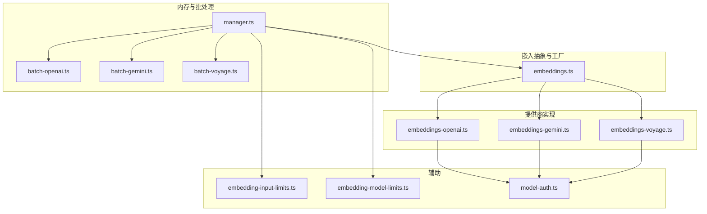
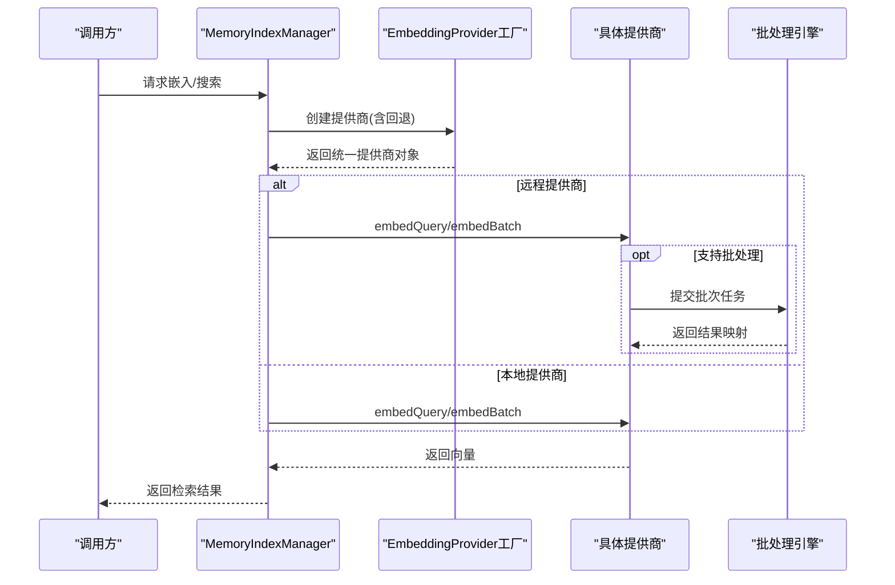
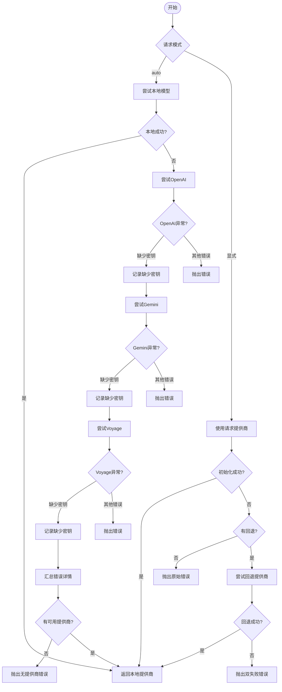
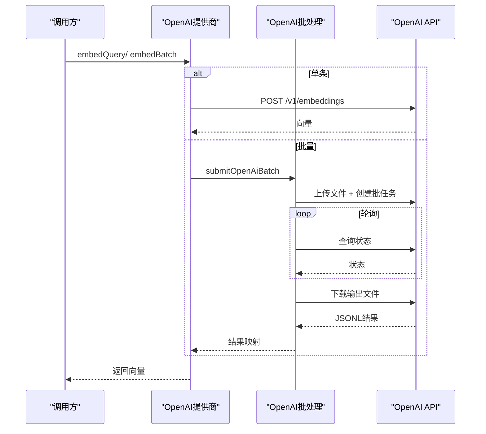
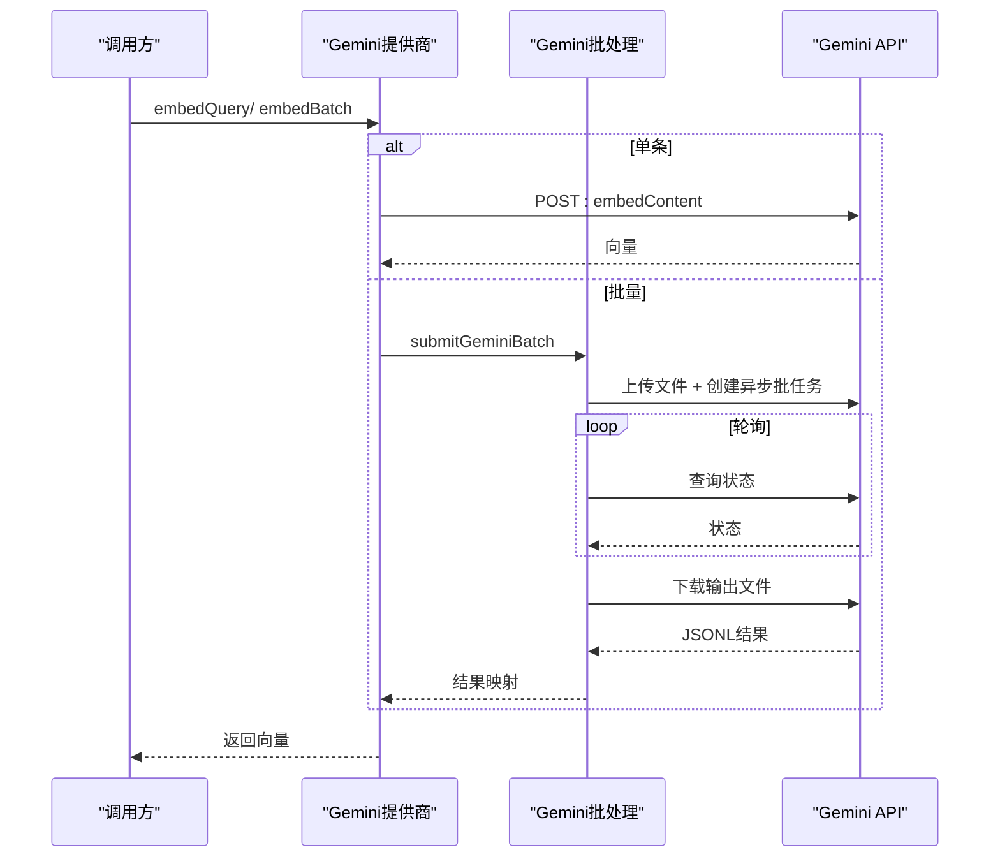
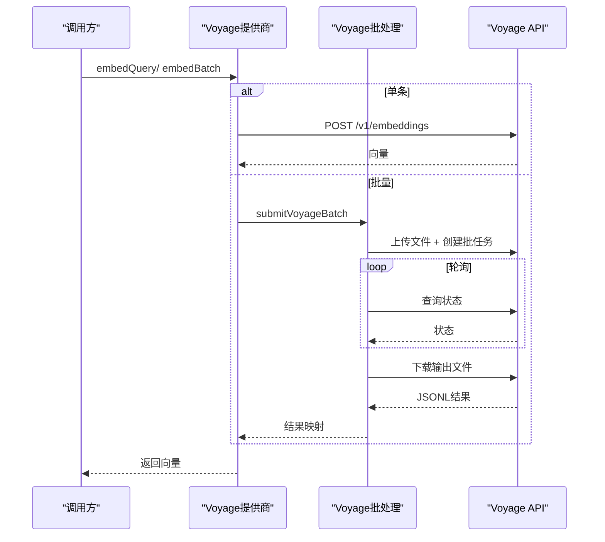
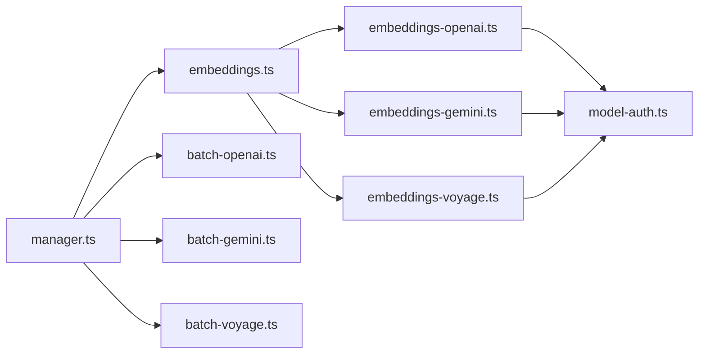

# 嵌入模型提供商

<cite>
**本文引用的文件**
- [embeddings.ts](file://src/memory/embeddings.ts)
- [embeddings-openai.ts](file://src/memory/embeddings-openai.ts)
- [embeddings-gemini.ts](file://src/memory/embeddings-gemini.ts)
- [embeddings-voyage.ts](file://src/memory/embeddings-voyage.ts)
- [manager.ts](file://src/memory/manager.ts)
- [embedding-model-limits.ts](file://src/memory/embedding-model-limits.ts)
- [embedding-input-limits.ts](file://src/memory/embedding-input-limits.ts)
- [batch-openai.ts](file://src/memory/batch-openai.ts)
- [batch-gemini.ts](file://src/memory/batch-gemini.ts)
- [batch-voyage.ts](file://src/memory/batch-voyage.ts)
- [model-auth.ts](file://src/agents/model-auth.ts)
</cite>

## 目录

1. [简介](#简介)
2. [项目结构](#项目结构)
3. [核心组件](#核心组件)
4. [架构总览](#架构总览)
5. [详细组件分析](#详细组件分析)
6. [依赖关系分析](#依赖关系分析)
7. [性能考量](#性能考量)
8. [故障排查指南](#故障排查指南)
9. [结论](#结论)
10. [附录](#附录)

## 简介

本文件面向OpenClaw嵌入模型提供商系统，系统支持本地与多家远程嵌入模型提供商（OpenAI、Google Gemini、Voyage AI），并提供统一的抽象接口与一致的错误处理、降级与批处理能力。本文将从架构设计、组件职责、数据流、并发与重试策略、兼容性与降级机制、性能监控与配置等方面进行深入说明，并给出模型切换与最佳实践建议。

## 项目结构

围绕嵌入模型的模块主要分布在以下路径：

- 提供商抽象与工厂：src/memory/embeddings.ts
- 各提供商实现：src/memory/embeddings-\*.ts
- 内存索引与批处理：src/memory/manager.ts、src/memory/batch-\*.ts
- 模型输入限制与模型上限：src/memory/embedding-input-limits.ts、src/memory/embedding-model-limits.ts
- 认证与密钥解析：src/agents/model-auth.ts

图表来源

- [embeddings.ts](file://src/memory/embeddings.ts#L130-L214)
- [embeddings-openai.ts](file://src/memory/embeddings-openai.ts#L29-L98)
- [embeddings-gemini.ts](file://src/memory/embeddings-gemini.ts#L68-L169)
- [embeddings-voyage.ts](file://src/memory/embeddings-voyage.ts#L29-L106)
- [manager.ts](file://src/memory/manager.ts#L184-L203)
- [batch-openai.ts](file://src/memory/batch-openai.ts#L283-L398)
- [batch-gemini.ts](file://src/memory/batch-gemini.ts#L315-L431)
- [batch-voyage.ts](file://src/memory/batch-voyage.ts#L243-L373)
- [embedding-input-limits.ts](file://src/memory/embedding-input-limits.ts#L1-L68)
- [embedding-model-limits.ts](file://src/memory/embedding-model-limits.ts#L1-L36)
- [model-auth.ts](file://src/agents/model-auth.ts#L135-L233)

章节来源

- [embeddings.ts](file://src/memory/embeddings.ts#L1-L250)
- [manager.ts](file://src/memory/manager.ts#L1-L203)

## 核心组件

- 统一嵌入提供商接口：定义了嵌入查询与批量嵌入的标准方法，以及可选的最大输入令牌数。
- 工厂函数：根据配置自动选择或回退到可用的提供商，处理缺失密钥与初始化失败场景。
- 认证解析：集中解析环境变量、配置文件与认证存储中的密钥，支持多模式（API Key/OAuth/Token/AWS SDK）。
- 批处理执行器：针对不同提供商封装异步批处理提交、轮询、结果解析与错误聚合。
- 输入与模型限制：提供UTF-8字节估算与模型最大输入令牌的保守映射，避免越界。

章节来源

- [embeddings.ts](file://src/memory/embeddings.ts#L24-L40)
- [embeddings.ts](file://src/memory/embeddings.ts#L130-L214)
- [model-auth.ts](file://src/agents/model-auth.ts#L135-L233)
- [embedding-input-limits.ts](file://src/memory/embedding-input-limits.ts#L1-L68)
- [embedding-model-limits.ts](file://src/memory/embedding-model-limits.ts#L1-L36)

## 架构总览

OpenClaw的嵌入系统采用“抽象工厂 + 多提供商适配 + 批处理引擎”的分层架构。上层通过统一接口发起查询，底层按需选择OpenAI/Gemini/Voyage或本地LLM，同时在远程提供商下启用批处理以提升吞吐。

图表来源

- [manager.ts](file://src/memory/manager.ts#L266-L314)
- [embeddings.ts](file://src/memory/embeddings.ts#L130-L214)
- [batch-openai.ts](file://src/memory/batch-openai.ts#L283-L398)
- [batch-gemini.ts](file://src/memory/batch-gemini.ts#L315-L431)
- [batch-voyage.ts](file://src/memory/batch-voyage.ts#L243-L373)

## 详细组件分析

### 统一嵌入提供商工厂与回退策略

- 支持的提供商：openai、gemini、voyage、local、auto。
- auto模式优先尝试本地模型；若不可用则依次尝试openai、gemini、voyage，遇到缺少API Key时记录原因但继续尝试其他提供商。
- 显式指定提供商时，若失败且配置了fallback，则尝试回退到另一个提供商，并保留原始失败原因与来源信息。

图表来源

- [embeddings.ts](file://src/memory/embeddings.ts#L156-L213)

章节来源

- [embeddings.ts](file://src/memory/embeddings.ts#L130-L214)

### OpenAI嵌入提供商

- 默认模型与基础URL、最大输入令牌映射。
- 客户端构建：从配置或远程覆盖解析基础URL、头部与模型名，自动注入Authorization头。
- 单条与批量嵌入：单条调用embeddings端点；批量通过OpenAI Batch API提交，支持分组、轮询、错误聚合与超时控制。

图表来源

- [embeddings-openai.ts](file://src/memory/embeddings-openai.ts#L29-L68)
- [batch-openai.ts](file://src/memory/batch-openai.ts#L69-L135)
- [batch-openai.ts](file://src/memory/batch-openai.ts#L137-L246)
- [batch-openai.ts](file://src/memory/batch-openai.ts#L283-L398)

章节来源

- [embeddings-openai.ts](file://src/memory/embeddings-openai.ts#L1-L99)
- [batch-openai.ts](file://src/memory/batch-openai.ts#L1-L399)

### Google Gemini嵌入提供商

- 默认模型与基础URL、最大输入令牌映射。
- 客户端构建：支持从远程覆盖或配置解析基础URL与头部，自动注入x-goog-api-key。
- 单条与批量嵌入：分别调用embedContent与batchEmbedContents端点；批量通过Gemini Async Batch API，支持分组、轮询、错误聚合与超时控制。

图表来源

- [embeddings-gemini.ts](file://src/memory/embeddings-gemini.ts#L68-L129)
- [batch-gemini.ts](file://src/memory/batch-gemini.ts#L111-L184)
- [batch-gemini.ts](file://src/memory/batch-gemini.ts#L235-L278)
- [batch-gemini.ts](file://src/memory/batch-gemini.ts#L315-L431)

章节来源

- [embeddings-gemini.ts](file://src/memory/embeddings-gemini.ts#L1-L170)
- [batch-gemini.ts](file://src/memory/batch-gemini.ts#L1-L432)

### Voyage AI嵌入提供商

- 默认模型与基础URL、最大输入令牌映射。
- 客户端构建：从配置或远程覆盖解析基础URL与头部，自动注入Authorization头。
- 单条与批量嵌入：单条调用embeddings端点；批量通过Voyage Batch API提交，支持分组、轮询、错误聚合与超时控制。

图表来源

- [embeddings-voyage.ts](file://src/memory/embeddings-voyage.ts#L29-L76)
- [batch-voyage.ts](file://src/memory/batch-voyage.ts#L72-L144)
- [batch-voyage.ts](file://src/memory/batch-voyage.ts#L196-L241)
- [batch-voyage.ts](file://src/memory/batch-voyage.ts#L243-L373)

章节来源

- [embeddings-voyage.ts](file://src/memory/embeddings-voyage.ts#L1-L107)
- [batch-voyage.ts](file://src/memory/batch-voyage.ts#L1-L374)

### 认证与密钥解析

- 支持从配置、环境变量、认证存储与特定提供商的OAuth/Token/API Key模式解析密钥。
- 对于OpenAI/Gemini/Voyage等常见提供商，提供标准化的环境变量映射。
- 当找不到密钥时，会抛出明确的错误信息，便于用户定位问题。

章节来源

- [model-auth.ts](file://src/agents/model-auth.ts#L135-L233)
- [model-auth.ts](file://src/agents/model-auth.ts#L238-L318)
- [embeddings-openai.ts](file://src/memory/embeddings-openai.ts#L70-L98)
- [embeddings-gemini.ts](file://src/memory/embeddings-gemini.ts#L131-L169)
- [embeddings-voyage.ts](file://src/memory/embeddings-voyage.ts#L78-L106)

### 批处理与并发控制

- 批处理分组：按提供商最大请求数限制对请求进行分组，确保单批不超过上限。
- 并发执行：使用通用并发工具函数，按配置并发度并行提交各组任务。
- 轮询与等待：对未完成的批任务进行轮询，支持超时与等待策略。
- 错误聚合：解析输出文件，收集错误消息与缺失响应，统一抛出。

章节来源

- [batch-openai.ts](file://src/memory/batch-openai.ts#L58-L67)
- [batch-openai.ts](file://src/memory/batch-openai.ts#L248-L281)
- [batch-openai.ts](file://src/memory/batch-openai.ts#L283-L398)
- [batch-gemini.ts](file://src/memory/batch-gemini.ts#L75-L84)
- [batch-gemini.ts](file://src/memory/batch-gemini.ts#L280-L313)
- [batch-gemini.ts](file://src/memory/batch-gemini.ts#L315-L431)
- [batch-voyage.ts](file://src/memory/batch-voyage.ts#L61-L70)
- [batch-voyage.ts](file://src/memory/batch-voyage.ts#L243-L373)

### 输入限制与模型兼容性

- UTF-8字节估算与安全分割：基于UTF-8字节长度进行保守估算与二分查找分割，避免切分代理项。
- 模型最大输入令牌映射：内置常见模型的上限映射，未知模型时按提供商保守回退。
- 向量归一化：对返回向量进行数值清洗与单位化，保证后续相似度计算稳定。

章节来源

- [embedding-input-limits.ts](file://src/memory/embedding-input-limits.ts#L1-L68)
- [embedding-model-limits.ts](file://src/memory/embedding-model-limits.ts#L1-L36)
- [embeddings.ts](file://src/memory/embeddings.ts#L11-L18)

## 依赖关系分析

- 抽象层与实现层解耦：统一接口由embeddings.ts定义，具体提供商独立实现，便于扩展新提供商。
- 批处理引擎与提供商解耦：batch-\*.ts仅依赖对应提供商客户端的HTTP接口，不关心具体提供商细节。
- 认证层集中化：model-auth.ts集中处理密钥解析与模式识别，避免各提供商重复逻辑。
- 内存管理器作为编排者：manager.ts负责选择提供商、执行嵌入、合并结果与状态上报。

图表来源

- [embeddings.ts](file://src/memory/embeddings.ts#L1-L250)
- [manager.ts](file://src/memory/manager.ts#L1-L203)
- [batch-openai.ts](file://src/memory/batch-openai.ts#L1-L399)
- [batch-gemini.ts](file://src/memory/batch-gemini.ts#L1-L432)
- [batch-voyage.ts](file://src/memory/batch-voyage.ts#L1-L374)
- [model-auth.ts](file://src/agents/model-auth.ts#L135-L233)

章节来源

- [embeddings.ts](file://src/memory/embeddings.ts#L1-L250)
- [manager.ts](file://src/memory/manager.ts#L1-L203)

## 性能考量

- 批处理吞吐：通过批处理API显著提升大批量嵌入的吞吐，减少网络往返与连接开销。
- 并发度与超时：批处理并发度与轮询间隔、超时时间可调，平衡吞吐与资源占用。
- 向量维度与索引：SQLite-vec扩展按向量维度动态创建虚拟表，避免跨维度兼容问题。
- 输入限制：基于UTF-8字节的保守估算与分割，避免因令牌越界导致的失败重试。
- 本地模型：在离线或低延迟场景下，本地LLM可提供稳定性能，但首次加载与上下文初始化有启动成本。

[本节为通用指导，无需列出章节来源]

## 故障排查指南

- 缺少API Key：当解析不到密钥时会抛出明确错误，检查环境变量、配置文件与认证存储。
- 回退链路：auto模式下若出现多个提供商均缺Key，会汇总错误详情；显式模式下若配置了fallback，会尝试回退并保留原始失败原因。
- 批处理失败：检查批任务状态、错误文件内容与网络连通性；确认并发度与超时设置是否合理。
- 本地模型不可用：若本地依赖缺失或安装失败，会提示安装与重建步骤；可切换到远程提供商或禁用本地。

章节来源

- [embeddings.ts](file://src/memory/embeddings.ts#L77-L80)
- [embeddings.ts](file://src/memory/embeddings.ts#L153-L213)
- [embeddings.ts](file://src/memory/embeddings.ts#L227-L249)
- [batch-openai.ts](file://src/memory/batch-openai.ts#L178-L199)
- [batch-gemini.ts](file://src/memory/batch-gemini.ts#L235-L278)
- [batch-voyage.ts](file://src/memory/batch-voyage.ts#L196-L241)

## 结论

OpenClaw的嵌入模型提供商系统通过统一抽象、灵活回退、批处理优化与严格的认证与限制控制，实现了在多提供商环境下的高可用与高性能。结合本地与远程提供商的组合，可在不同部署场景下获得稳定的嵌入服务与良好的用户体验。

[本节为总结，无需列出章节来源]

## 附录

### 配置参数与认证方式概览

- OpenAI
  - 模型默认值与最大输入令牌映射见OpenAI实现文件。
  - 认证：支持环境变量OPENAI_API_KEY或配置文件中的API Key。
  - 批处理：通过OpenAI Batch API提交与轮询。
- Google Gemini
  - 模型默认值与最大输入令牌映射见Gemini实现文件。
  - 认证：支持环境变量GEMINI_API_KEY或配置文件中的API Key。
  - 批处理：通过Gemini Async Batch API提交与轮询。
- Voyage AI
  - 模型默认值与最大输入令牌映射见Voyage实现文件。
  - 认证：支持环境变量VOYAGE_API_KEY或配置文件中的API Key。
  - 批处理：通过Voyage Batch API提交与轮询。
- 本地模型
  - 通过本地LLM提供嵌入，首次加载可能较慢。
  - 认证：本地模型通常不需要API Key。

章节来源

- [embeddings-openai.ts](file://src/memory/embeddings-openai.ts#L10-L16)
- [embeddings-openai.ts](file://src/memory/embeddings-openai.ts#L70-L98)
- [embeddings-gemini.ts](file://src/memory/embeddings-gemini.ts#L13-L17)
- [embeddings-gemini.ts](file://src/memory/embeddings-gemini.ts#L131-L169)
- [embeddings-voyage.ts](file://src/memory/embeddings-voyage.ts#L10-L16)
- [embeddings-voyage.ts](file://src/memory/embeddings-voyage.ts#L78-L106)

### 模型切换指南

- 切换提供商：在配置中将agents.defaults.memorySearch.provider设置为目标提供商。
- 回退策略：如需在主提供商失败时自动切换，设置fallback字段为备选提供商。
- 本地优先：auto模式下若本地模型可用将优先使用；否则按顺序尝试远程提供商。

章节来源

- [embeddings.ts](file://src/memory/embeddings.ts#L156-L213)

### 性能对比与最佳实践

- 批处理优先：大批量嵌入应启用批处理并合理设置并发度与轮询间隔。
- 输入限制：使用UTF-8字节估算与分割，避免令牌越界导致的失败。
- 本地与远程权衡：在离线或低延迟场景优先考虑本地模型；在线场景可利用远程提供商的批处理能力。
- 监控与日志：开启调试日志以观察批处理状态与错误详情，便于快速定位问题。

章节来源

- [embedding-input-limits.ts](file://src/memory/embedding-input-limits.ts#L1-L68)
- [embedding-model-limits.ts](file://src/memory/embedding-model-limits.ts#L1-L36)
- [manager.ts](file://src/memory/manager.ts#L91-L102)
