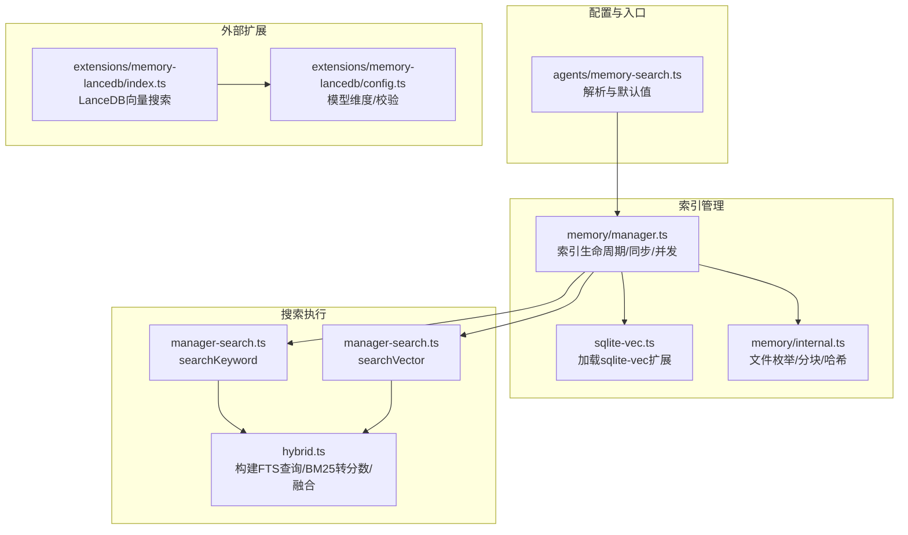
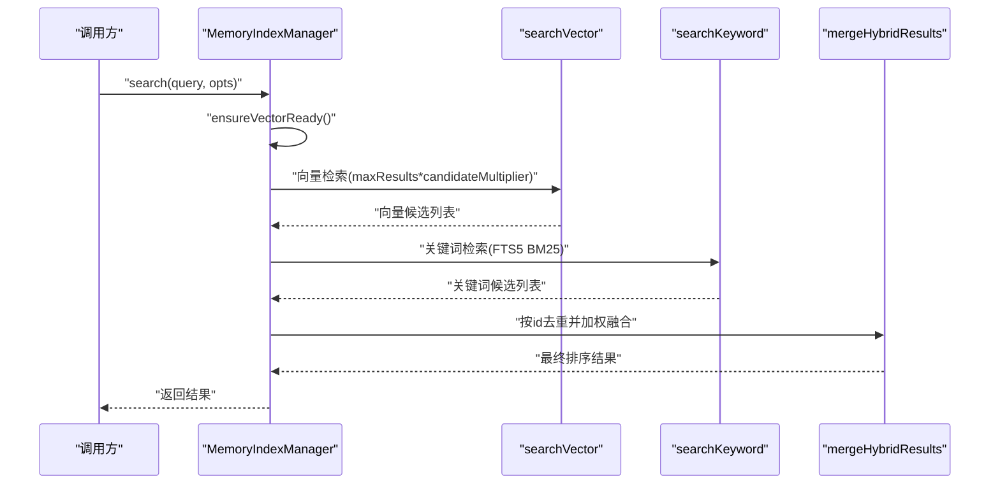
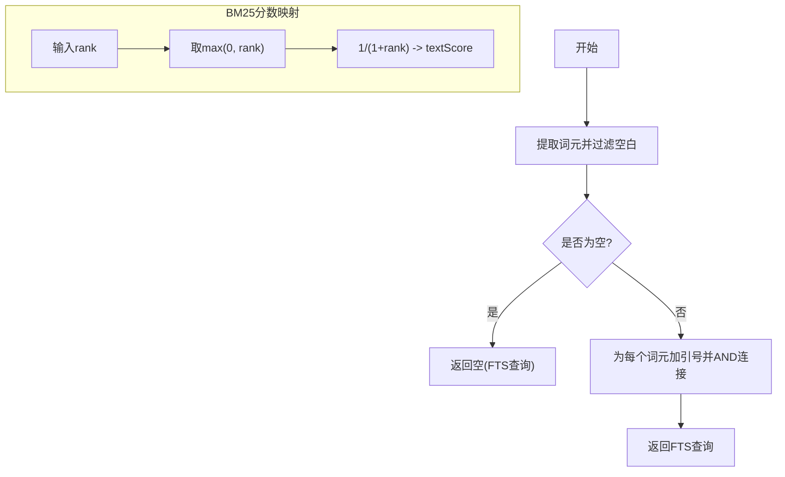
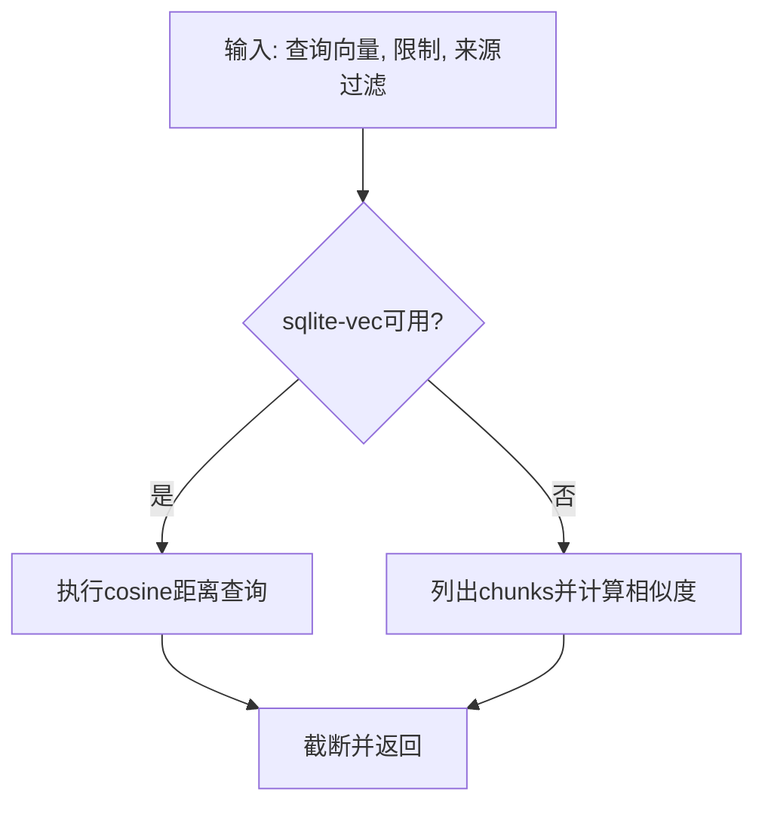
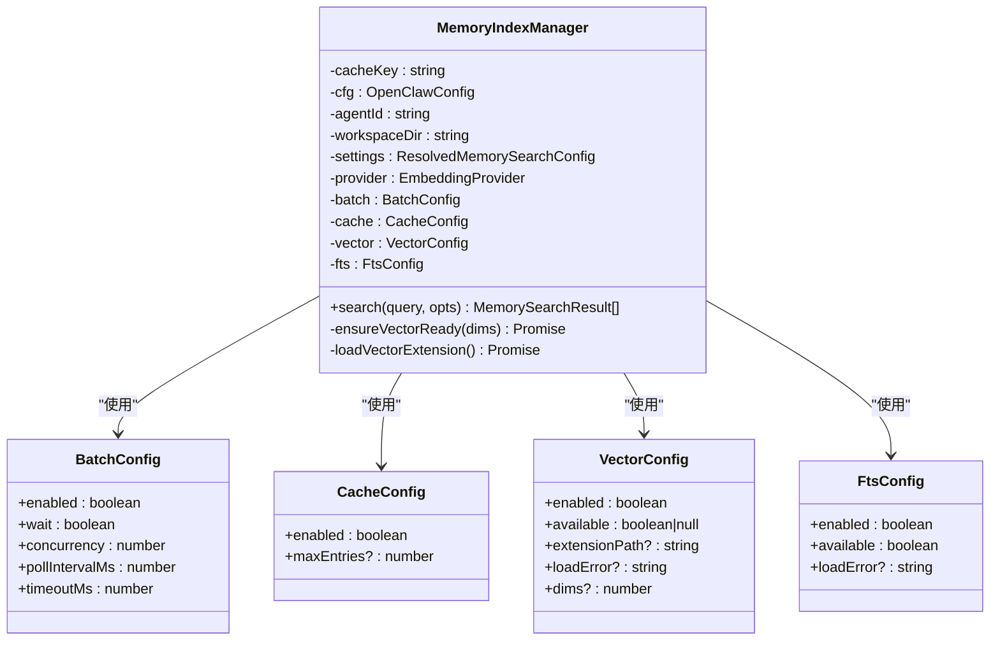
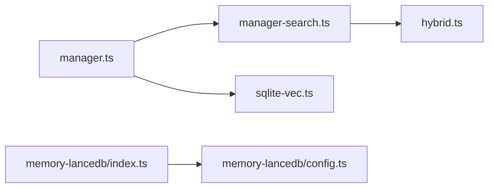
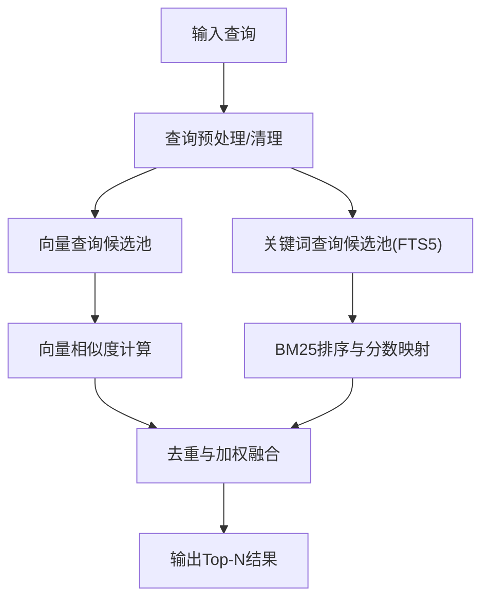

# 搜索算法

<cite>
**本文引用的文件**
- [src/memory/hybrid.ts](file://src/memory/hybrid.ts)
- [src/memory/manager-search.ts](file://src/memory/manager-search.ts)
- [src/memory/manager.ts](file://src/memory/manager.ts)
- [src/memory/sqlite-vec.ts](file://src/memory/sqlite-vec.ts)
- [src/agents/memory-search.ts](file://src/agents/memory-search.ts)
- [src/memory/internal.ts](file://src/memory/internal.ts)
- [docs/concepts/memory.md](file://docs/concepts/memory.md)
- [extensions/memory-lancedb/index.ts](file://extensions/memory-lancedb/index.ts)
- [extensions/memory-lancedb/config.ts](file://extensions/memory-lancedb/config.ts)
- [src/agents/tools/web-shared.ts](file://src/agents/tools/web-shared.ts)
- [scripts/bench-model.ts](file://scripts/bench-model.ts)
- [src/commands/models/scan.ts](file://src/commands/models/scan.ts)
</cite>

## 目录

1. [简介](#简介)
2. [项目结构](#项目结构)
3. [核心组件](#核心组件)
4. [架构总览](#架构总览)
5. [详细组件分析](#详细组件分析)
6. [依赖关系分析](#依赖关系分析)
7. [性能考量](#性能考量)
8. [故障排查指南](#故障排查指南)
9. [结论](#结论)
10. [附录](#附录)

## 简介

本文件面向OpenClaw搜索算法系统，聚焦“混合搜索架构”，涵盖向量搜索、关键词搜索（BM25）、结果融合策略与权重、相关性评分、查询预处理与文本清理、并发与缓存策略、性能优化与基准测试方法等。文档以代码为依据，辅以可视化流程图与配置参考，帮助开发者与运维人员快速理解与优化搜索能力。

## 项目结构

OpenClaw的搜索能力由多模块协同实现：

- 配置层：解析与合并代理级搜索配置，决定向量/关键词开关、权重、候选倍数、缓存等。
- 索引与存储：SQLite + sqlite-vec扩展用于向量检索；FTS5用于关键词检索；内存/会话源可选。
- 搜索执行：分别调用向量与关键词检索，再进行去重与加权融合。
- 扩展与插件：支持LanceDB作为长期记忆后端，提供向量搜索能力与CLI工具。

图表来源

- [src/agents/memory-search.ts](file://src/agents/memory-search.ts#L1-L200)
- [src/memory/manager.ts](file://src/memory/manager.ts#L111-L246)
- [src/memory/sqlite-vec.ts](file://src/memory/sqlite-vec.ts#L1-L25)
- [src/memory/internal.ts](file://src/memory/internal.ts#L1-L200)
- [src/memory/manager-search.ts](file://src/memory/manager-search.ts#L1-L188)
- [src/memory/hybrid.ts](file://src/memory/hybrid.ts#L1-L116)
- [extensions/memory-lancedb/index.ts](file://extensions/memory-lancedb/index.ts#L47-L139)
- [extensions/memory-lancedb/config.ts](file://extensions/memory-lancedb/config.ts#L49-L92)

章节来源

- [src/agents/memory-search.ts](file://src/agents/memory-search.ts#L1-L200)
- [src/memory/manager.ts](file://src/memory/manager.ts#L111-L246)
- [src/memory/sqlite-vec.ts](file://src/memory/sqlite-vec.ts#L1-L25)
- [src/memory/internal.ts](file://src/memory/internal.ts#L1-L200)
- [src/memory/manager-search.ts](file://src/memory/manager-search.ts#L1-L188)
- [src/memory/hybrid.ts](file://src/memory/hybrid.ts#L1-L116)
- [extensions/memory-lancedb/index.ts](file://extensions/memory-lancedb/index.ts#L47-L139)
- [extensions/memory-lancedb/config.ts](file://extensions/memory-lancedb/config.ts#L49-L92)

## 核心组件

- 混合搜索工具
  - 构建FTS查询：将查询按词元提取并用AND连接，生成SQLite FTS5查询串。
  - BM25分数映射：将rank转换为0~1范围的textScore，rank越小越相关。
  - 结果融合：按chunk id去重，保留关键词片段优先，计算加权最终得分。
- 搜索执行器
  - 向量搜索：优先使用sqlite-vec扩展的cosine距离；若扩展不可用则回退到内存计算相似度。
  - 关键词搜索：基于FTS5 BM25 rank排序，限制候选数量。
- 索引管理器
  - 生命周期：初始化数据库、确保模式、加载扩展、监听文件变更、定时同步。
  - 并发与批处理：对嵌入请求进行批处理与并发控制，带指数退避与超时。
  - 缓存：支持查询结果与嵌入缓存，控制最大条目与TTL。
- 配置解析
  - 默认值覆盖：提供丰富的默认值，支持代理级覆盖。
  - 混合搜索参数：向量/文本权重、候选倍数、最大结果数、最小分数等。

章节来源

- [src/memory/hybrid.ts](file://src/memory/hybrid.ts#L23-L116)
- [src/memory/manager-search.ts](file://src/memory/manager-search.ts#L20-L188)
- [src/memory/manager.ts](file://src/memory/manager.ts#L111-L246)
- [src/agents/memory-search.ts](file://src/agents/memory-search.ts#L1-L200)

## 架构总览

混合搜索的关键流程如下：

图表来源

- [src/memory/manager.ts](file://src/memory/manager.ts#L111-L246)
- [src/memory/manager-search.ts](file://src/memory/manager-search.ts#L20-L188)
- [src/memory/hybrid.ts](file://src/memory/hybrid.ts#L41-L116)

## 详细组件分析

### 组件A：混合搜索工具（hybrid.ts）

- 功能要点
  - 构建FTS查询：提取字母数字下划线词元，过滤空值，用双引号包围并AND连接。
  - BM25分数映射：将rank映射到0~1区间，rank越大越小，越相关。
  - 融合策略：按chunk id聚合，保留关键词片段优先，计算加权最终得分，降序返回。
- 复杂度与性能
  - 时间复杂度：O(N+M)，N/M分别为向量与关键词候选数；去重与合并为线性。
  - 空间复杂度：O(N+M)用于中间映射表。
- 边界与健壮性
  - 当FTS查询为空时直接返回空，避免无效查询。
  - 若向量扩展不可用，仍可返回关键词结果，保证可用性。

图表来源

- [src/memory/hybrid.ts](file://src/memory/hybrid.ts#L23-L39)

章节来源

- [src/memory/hybrid.ts](file://src/memory/hybrid.ts#L1-L116)

### 组件B：向量搜索（manager-search.ts）

- 功能要点
  - 使用sqlite-vec扩展时，通过cosine距离检索，返回相似度得分。
  - 扩展不可用时，回退到内存计算相似度，遍历chunks并筛选有限数值。
  - 支持按来源过滤与限制返回数量。
- 性能特性
  - 扩展路径：向量表建立虚拟表，使用vec0后端，支持原生距离计算。
  - 回退路径：内存计算相似度，适合小规模数据或开发环境。

图表来源

- [src/memory/manager-search.ts](file://src/memory/manager-search.ts#L20-L94)
- [src/memory/sqlite-vec.ts](file://src/memory/sqlite-vec.ts#L1-L25)

章节来源

- [src/memory/manager-search.ts](file://src/memory/manager-search.ts#L1-L188)
- [src/memory/sqlite-vec.ts](file://src/memory/sqlite-vec.ts#L1-L25)

### 组件C：关键词搜索（manager-search.ts）

- 功能要点
  - 基于FTS5 BM25 rank排序，限制候选数量。
  - 将rank映射为textScore参与融合。
- 性能特性
  - SQLite内置FTS5，无需额外依赖。
  - 通过构建的FTS查询减少无关匹配。

章节来源

- [src/memory/manager-search.ts](file://src/memory/manager-search.ts#L136-L188)
- [src/memory/hybrid.ts](file://src/memory/hybrid.ts#L36-L39)

### 组件D：索引管理与并发（manager.ts）

- 生命周期与模式
  - 初始化数据库、确保模式、加载sqlite-vec扩展、监听文件变更、定时同步。
  - 支持内存与会话源，自动增量更新。
- 并发与批处理
  - 对嵌入请求进行批处理，控制并发度与轮询间隔，带超时与重试。
  - 批处理失败计数与锁，避免雪崩。
- 缓存策略
  - 查询结果缓存与嵌入缓存，支持TTL与最大条目数。
- 可靠性
  - 向量扩展加载失败不致命，回退至关键词搜索。
  - 主备后端切换与错误追踪。

图表来源

- [src/memory/manager.ts](file://src/memory/manager.ts#L111-L246)

章节来源

- [src/memory/manager.ts](file://src/memory/manager.ts#L111-L246)

### 组件E：配置解析（agents/memory-search.ts）

- 默认值与覆盖
  - 提供默认的provider/model/chunking/sync/query/cache等参数。
  - 支持代理级覆盖，合并默认与代理配置。
- 混合搜索参数
  - 开关、向量/文本权重、候选倍数、最大结果数、最小分数。
- 存储与路径
  - 默认SQLite存储路径，支持模板化占位符替换。

章节来源

- [src/agents/memory-search.ts](file://src/agents/memory-search.ts#L1-L200)

### 组件F：扩展：LanceDB（memory-lancedb）

- 能力概览
  - 基于LanceDB的向量搜索，支持自动召回与捕获。
  - CLI命令：统计、搜索、列出记忆。
- 评分与过滤
  - 将L2距离转换为相似度分数，并按阈值过滤。
- 模型维度
  - 校验与解析嵌入模型对应的维度，确保向量列定义一致。

章节来源

- [extensions/memory-lancedb/index.ts](file://extensions/memory-lancedb/index.ts#L47-L139)
- [extensions/memory-lancedb/index.ts](file://extensions/memory-lancedb/index.ts#L242-L522)
- [extensions/memory-lancedb/config.ts](file://extensions/memory-lancedb/config.ts#L49-L92)

## 依赖关系分析

- 模块耦合
  - manager.ts依赖manager-search.ts提供的向量/关键词搜索函数。
  - hybrid.ts被manager.ts与manager-search.ts共同使用，承担FTS构建与融合逻辑。
  - sqlite-vec.ts被manager.ts调用以加载扩展。
- 外部依赖
  - sqlite-vec：向量检索加速。
  - LanceDB：可选的长期记忆后端。
- 循环依赖
  - 未见循环依赖；各模块职责清晰，接口单向依赖。

图表来源

- [src/memory/manager.ts](file://src/memory/manager.ts#L1-L200)
- [src/memory/manager-search.ts](file://src/memory/manager-search.ts#L1-L188)
- [src/memory/sqlite-vec.ts](file://src/memory/sqlite-vec.ts#L1-L25)
- [src/memory/hybrid.ts](file://src/memory/hybrid.ts#L1-L116)
- [extensions/memory-lancedb/index.ts](file://extensions/memory-lancedb/index.ts#L47-L139)
- [extensions/memory-lancedb/config.ts](file://extensions/memory-lancedb/config.ts#L49-L92)

章节来源

- [src/memory/manager.ts](file://src/memory/manager.ts#L1-L200)
- [src/memory/manager-search.ts](file://src/memory/manager-search.ts#L1-L188)
- [src/memory/sqlite-vec.ts](file://src/memory/sqlite-vec.ts#L1-L25)
- [src/memory/hybrid.ts](file://src/memory/hybrid.ts#L1-L116)
- [extensions/memory-lancedb/index.ts](file://extensions/memory-lancedb/index.ts#L47-L139)
- [extensions/memory-lancedb/config.ts](file://extensions/memory-lancedb/config.ts#L49-L92)

## 性能考量

- 向量搜索
  - 优先启用sqlite-vec扩展，利用原生cosine距离计算。
  - 扩展不可用时回退内存计算，适合小规模数据。
- 关键词搜索
  - FTS5 BM25排序，合理设置候选倍数与最大结果数，平衡召回与性能。
- 融合策略
  - 加权融合（向量权重+文本权重=1），权重比例直接影响结果分布。
  - BM25分数映射为0~1，避免不同信号域的量纲差异。
- 并发与批处理
  - 控制批处理并发度与轮询间隔，避免过载。
  - 设置合理超时与重试策略，提升稳定性。
- 缓存
  - 启用查询与嵌入缓存，设置TTL与最大条目数，降低重复查询成本。
- 基准测试
  - 使用脚本计算模型调用的中位耗时与令牌用量，辅助评估性能与成本。

章节来源

- [src/memory/manager-search.ts](file://src/memory/manager-search.ts#L20-L94)
- [src/memory/hybrid.ts](file://src/memory/hybrid.ts#L36-L39)
- [src/memory/manager.ts](file://src/memory/manager.ts#L124-L134)
- [src/agents/tools/web-shared.ts](file://src/agents/tools/web-shared.ts#L1-L39)
- [scripts/bench-model.ts](file://scripts/bench-model.ts#L1-L48)

## 故障排查指南

- sqlite-vec加载失败
  - 现象：向量搜索不可用，回退至关键词搜索。
  - 排查：检查扩展路径与权限，确认已启用允许加载扩展。
- FTS5不可用
  - 现象：仅关键词搜索生效。
  - 排查：确认数据库已初始化FTS表，或在配置中关闭混合搜索。
- 批处理失败
  - 现象：嵌入请求堆积或超时。
  - 排查：调整并发度、轮询间隔与超时时间，查看失败计数与最后错误。
- 结果质量不佳
  - 调整混合权重、候选倍数与最小分数；检查查询预处理与词元提取。
- 缓存命中率低
  - 调整TTL与最大条目数，确保键规范化与过期清理有效。

章节来源

- [src/memory/sqlite-vec.ts](file://src/memory/sqlite-vec.ts#L1-L25)
- [src/memory/manager.ts](file://src/memory/manager.ts#L641-L667)
- [src/memory/manager.ts](file://src/memory/manager.ts#L124-L134)
- [src/memory/hybrid.ts](file://src/memory/hybrid.ts#L23-L39)

## 结论

OpenClaw采用“向量+关键词”的混合搜索架构，在准确语义匹配与精确词元检索之间取得平衡。通过可配置的权重、候选倍数与最小分数，结合sqlite-vec与FTS5的高效实现，以及批处理、缓存与扩展机制，系统在可用性、性能与可维护性方面均具备良好表现。建议根据业务场景微调权重与阈值，并结合基准测试持续优化。

## 附录

### 搜索算法流程图（概念）

（该图为概念流程，不直接对应具体源码文件）

### 配置示例与参数说明

- 混合搜索开关与权重
  - enabled：是否启用混合搜索。
  - vectorWeight：向量信号权重（归一化为1）。
  - textWeight：关键词信号权重（归一化为1）。
  - candidateMultiplier：候选倍数，用于扩大候选池以提升召回。
- 查询与存储
  - maxResults：最大返回结果数。
  - minScore：最小分数阈值。
  - store.vector.enabled：是否启用向量存储与sqlite-vec。
  - cache.enabled：是否启用缓存。
- 并发与批处理
  - batch.enabled/wait/concurrency/pollIntervalMs/timeoutMs：批处理并发与轮询策略。

章节来源

- [src/agents/memory-search.ts](file://src/agents/memory-search.ts#L57-L71)
- [src/agents/memory-search.ts](file://src/agents/memory-search.ts#L145-L164)
- [src/memory/manager.ts](file://src/memory/manager.ts#L124-L134)

### 调试技巧

- 启用日志子系统“memory”，观察向量扩展加载、FTS可用性与批处理状态。
- 使用LanceDB CLI命令进行手动验证：统计、搜索、列出记忆。
- 通过基准脚本评估模型调用耗时与成本，定位瓶颈。

章节来源

- [src/memory/manager.ts](file://src/memory/manager.ts#L104-L105)
- [extensions/memory-lancedb/index.ts](file://extensions/memory-lancedb/index.ts#L448-L487)
- [scripts/bench-model.ts](file://scripts/bench-model.ts#L1-L48)
