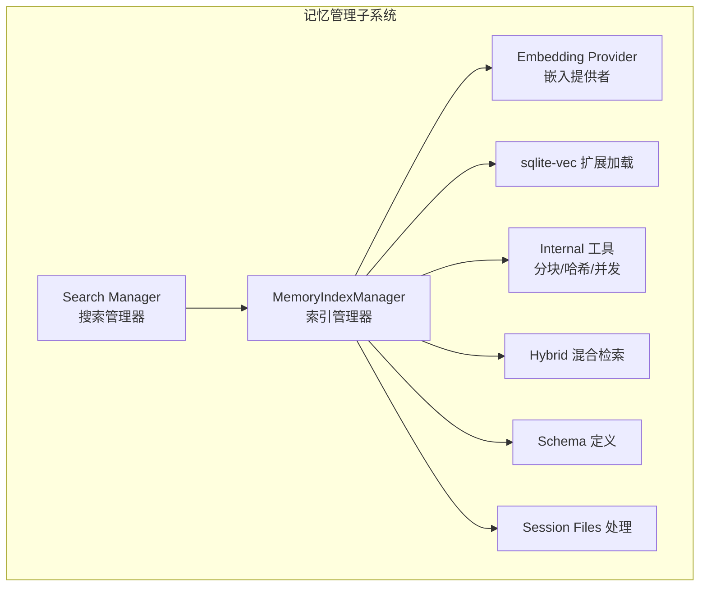
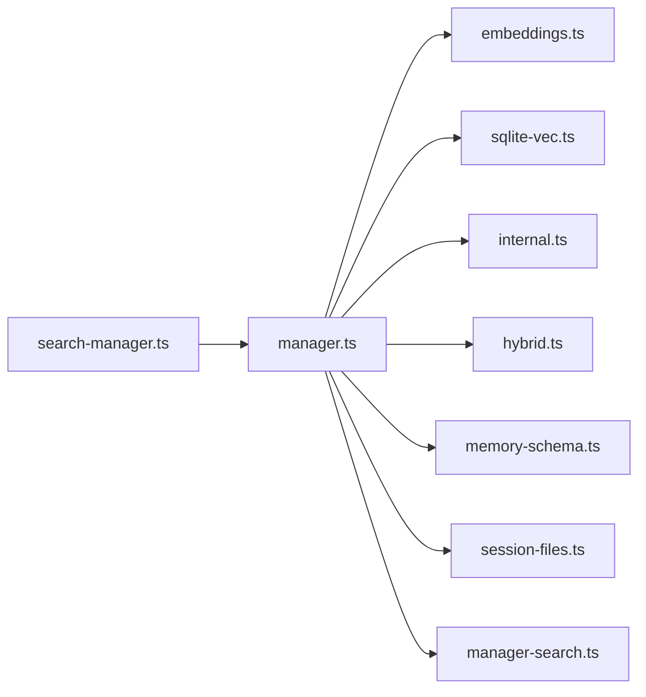
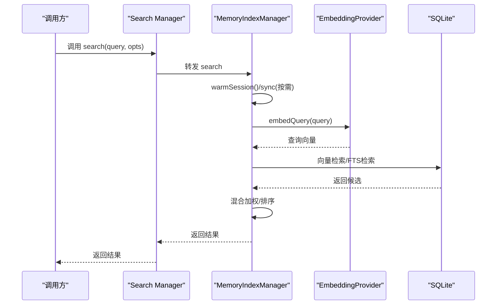
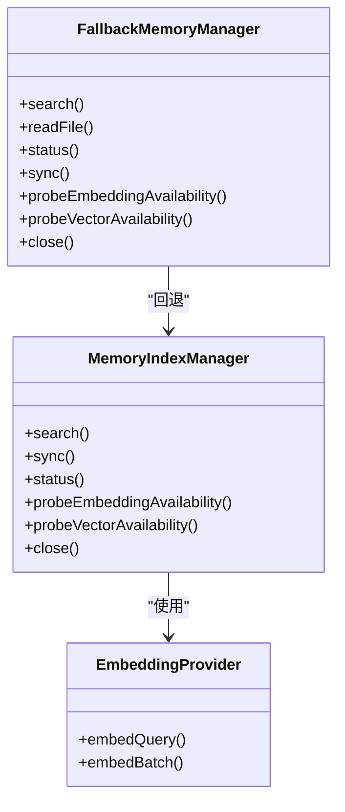

# 记忆管理

<cite>
**本文引用的文件**
- [src/memory/manager.ts](file://src/memory/manager.ts)
- [src/memory/embeddings.ts](file://src/memory/embeddings.ts)
- [src/memory/search-manager.ts](file://src/memory/search-manager.ts)
- [src/memory/sqlite-vec.ts](file://src/memory/sqlite-vec.ts)
- [src/memory/internal.ts](file://src/memory/internal.ts)
- [src/memory/types.ts](file://src/memory/types.ts)
- [src/memory/hybrid.ts](file://src/memory/hybrid.ts)
- [src/memory/manager-search.ts](file://src/memory/manager-search.ts)
- [src/memory/memory-schema.ts](file://src/memory/memory-schema.ts)
- [src/memory/session-files.ts](file://src/memory/session-files.ts)
</cite>

## 目录

1. [简介](#简介)
2. [项目结构](#项目结构)
3. [核心组件](#核心组件)
4. [架构总览](#架构总览)
5. [详细组件分析](#详细组件分析)
6. [依赖关系分析](#依赖关系分析)
7. [性能考量](#性能考量)
8. [故障排查指南](#故障排查指南)
9. [结论](#结论)
10. [附录](#附录)

## 简介

本文件面向OpenClaw的记忆管理系统，系统性阐述其架构与实现：向量存储、嵌入模型、索引机制、批量处理与异步更新、混合检索（关键词+向量）、相似度计算、SQLite集成与性能调优、检索流程与缓存机制、数据同步方案等。目标是帮助开发者与运维人员快速理解并高效使用该系统。

## 项目结构

记忆管理子系统位于src/memory目录，围绕“索引管理器”为核心，配合嵌入模型抽象、SQLite向量扩展加载、混合检索与内部工具函数协同工作。



图表来源

- [src/memory/manager.ts](file://src/memory/manager.ts#L111-L248)
- [src/memory/search-manager.ts](file://src/memory/search-manager.ts#L19-L65)
- [src/memory/embeddings.ts](file://src/memory/embeddings.ts#L130-L214)
- [src/memory/sqlite-vec.ts](file://src/memory/sqlite-vec.ts#L3-L24)
- [src/memory/internal.ts](file://src/memory/internal.ts#L1-L200)
- [src/memory/hybrid.ts](file://src/memory/hybrid.ts#L23-L116)
- [src/memory/memory-schema.ts](file://src/memory/memory-schema.ts#L3-L97)
- [src/memory/session-files.ts](file://src/memory/session-files.ts#L21-L132)

章节来源

- [src/memory/manager.ts](file://src/memory/manager.ts#L111-L248)
- [src/memory/search-manager.ts](file://src/memory/search-manager.ts#L19-L65)

## 核心组件

- 索引管理器：负责构建/维护向量与全文索引、批处理嵌入、增量同步、缓存与回退策略、状态查询与关闭。
- 嵌入提供者：统一抽象OpenAI/Gemini/Voyage/本地LLM四种嵌入能力，支持自动选择与回退。
- 搜索管理器：对外暴露统一接口，支持QMD后端与内置索引的降级封装。
- SQLite向量扩展：动态加载sqlite-vec，启用向量相似度检索。
- 内部工具：文件枚举、分块、哈希、行号映射、并发控制、余弦相似度等。
- 混合检索：将关键词BM25与向量余弦相似度加权融合。
- 数据库模式：meta/files/chunks/fts表及索引的初始化与演进。
- 会话文件：解析JSONL会话为可检索文本并建立行号映射。

章节来源

- [src/memory/manager.ts](file://src/memory/manager.ts#L111-L248)
- [src/memory/embeddings.ts](file://src/memory/embeddings.ts#L24-L57)
- [src/memory/search-manager.ts](file://src/memory/search-manager.ts#L67-L202)
- [src/memory/sqlite-vec.ts](file://src/memory/sqlite-vec.ts#L3-L24)
- [src/memory/internal.ts](file://src/memory/internal.ts#L146-L337)
- [src/memory/hybrid.ts](file://src/memory/hybrid.ts#L41-L116)
- [src/memory/memory-schema.ts](file://src/memory/memory-schema.ts#L3-L97)
- [src/memory/session-files.ts](file://src/memory/session-files.ts#L74-L132)

## 架构总览

记忆管理采用“内置SQLite + 可选向量扩展”的轻量架构，结合嵌入缓存与批处理，实现高吞吐的增量索引与混合检索。

```mermaid
classDiagram
class MemorySearchManager {
+search(query, opts) MemorySearchResult[]
+readFile(params) {text,path}
+status() MemoryProviderStatus
+sync(params) Promise<void>
+probeEmbeddingAvailability() Promise
+probeVectorAvailability() Promise<bool>
+close() Promise<void>
}
class MemoryIndexManager {
-cacheKey : string
-cfg
-agentId : string
-workspaceDir : string
-settings
-provider : EmbeddingProvider
-db : DatabaseSync
-sources : Set
-vector : {enabled,available,dims}
-fts : {enabled,available}
+search()
+sync()
+status()
+probeEmbeddingAvailability()
+probeVectorAvailability()
+close()
}
class EmbeddingProvider {
+id : string
+model : string
+maxInputTokens?
+embedQuery(text) Promise<number[]>
+embedBatch(texts) Promise<number[][]>
}
class FallbackMemoryManager {
-fallback : MemorySearchManager
-primaryFailed : boolean
+search()
+readFile()
+status()
+sync()
+probeEmbeddingAvailability()
+probeVectorAvailability()
+close()
}
MemorySearchManager <|.. MemoryIndexManager
MemorySearchManager <|.. FallbackMemoryManager
MemoryIndexManager --> EmbeddingProvider : "使用"
```

图表来源

- [src/memory/types.ts](file://src/memory/types.ts#L61-L81)
- [src/memory/manager.ts](file://src/memory/manager.ts#L111-L248)
- [src/memory/embeddings.ts](file://src/memory/embeddings.ts#L24-L57)
- [src/memory/search-manager.ts](file://src/memory/search-manager.ts#L67-L202)

## 详细组件分析

### 索引管理器（MemoryIndexManager）

- 职责
  - 统一入口：通过静态工厂按agent与配置获取实例，带进程内缓存。
  - 同步策略：监听文件与会话变更，支持watch、间隔定时、会话增量阈值触发。
  - 索引构建：分块Markdown，生成嵌入，写入chunks；可选写入向量表与FTS表。
  - 检索：支持关键词（FTS）与向量（cosine）双通道，可混合加权。
  - 缓存：嵌入结果缓存表，LRU裁剪，避免重复请求。
  - 回退：嵌入错误时自动切换到备选提供商。
  - 批处理：对OpenAI/Gemini/Voyage提供批任务提交与轮询，失败自动降级。
  - 关闭：清理定时器、取消监听、关闭数据库、释放缓存。

- 关键常量与参数
  - 向量/FTS表名、元信息键、片段最大长度、批大小、并发、重试次数与延迟、超时阈值、会话增量阈值等。

- 数据库模式
  - meta：保存索引元信息（模型、提供商、分块参数、向量维度）。
  - files：记录路径、来源、哈希、mtime、size。
  - chunks：记录id/path/source/行列/哈希/模型/文本/嵌入/时间戳。
  - embedding_cache：按provider/model/provider_key/hash缓存嵌入，支持裁剪。

- 会话增量
  - 基于文件大小与换行计数阈值，累积增量后批量索引，减少频繁写入。

- 混合检索
  - 关键词：FTS BM25打分归一化；向量：余弦距离转相似度；加权合并并排序。

- 批处理与回退
  - 对OpenAI/Gemini/Voyage分别构造批请求，支持等待/并发/轮询/超时；失败计数达到阈值禁用批处理并降级为逐条请求。

- 向量可用性探测
  - 动态加载sqlite-vec扩展，失败记录错误并标记不可用。

章节来源

- [src/memory/manager.ts](file://src/memory/manager.ts#L111-L248)
- [src/memory/manager.ts](file://src/memory/manager.ts#L391-L468)
- [src/memory/manager.ts](file://src/memory/manager.ts#L567-L582)
- [src/memory/manager.ts](file://src/memory/manager.ts#L798-L810)
- [src/memory/manager.ts](file://src/memory/manager.ts#L812-L846)
- [src/memory/manager.ts](file://src/memory/manager.ts#L848-L875)
- [src/memory/manager.ts](file://src/memory/manager.ts#L877-L913)
- [src/memory/manager.ts](file://src/memory/manager.ts#L1050-L1068)
- [src/memory/manager.ts](file://src/memory/manager.ts#L1271-L1337)
- [src/memory/manager.ts](file://src/memory/manager.ts#L1343-L1364)
- [src/memory/manager.ts](file://src/memory/manager.ts#L1366-L1405)
- [src/memory/manager.ts](file://src/memory/manager.ts#L1407-L1509)
- [src/memory/manager.ts](file://src/memory/manager.ts#L1547-L1573)
- [src/memory/manager.ts](file://src/memory/manager.ts#L1675-L1715)
- [src/memory/manager.ts](file://src/memory/manager.ts#L1752-L2004)
- [src/memory/manager.ts](file://src/memory/manager.ts#L2006-L2085)
- [src/memory/manager.ts](file://src/memory/manager.ts#L2087-L2192)
- [src/memory/manager.ts](file://src/memory/manager.ts#L2198-L2301)

### 嵌入提供者（EmbeddingProvider）

- 抽象
  - 统一接口：id/model/maxInputTokens，以及embedQuery/embedBatch。
- 实现
  - OpenAI/Gemini/Voyage：远程HTTP客户端封装，支持批任务。
  - 本地LLM：基于node-llama-cpp，按需懒加载，上下文复用。
- 自动选择与回退
  - auto模式优先尝试本地模型，否则依次尝试OpenAI/Gemini/Voyage；若主提供商异常且允许回退，则切换到备选。

章节来源

- [src/memory/embeddings.ts](file://src/memory/embeddings.ts#L24-L57)
- [src/memory/embeddings.ts](file://src/memory/embeddings.ts#L82-L128)
- [src/memory/embeddings.ts](file://src/memory/embeddings.ts#L130-L214)

### 搜索管理器（Search Manager）

- 统一入口：根据后端配置优先尝试QMD，失败则回退到内置索引管理器。
- 降级包装器：捕获主后端异常，记录错误并切换到内置索引，同时清理缓存以便后续重试。

章节来源

- [src/memory/search-manager.ts](file://src/memory/search-manager.ts#L19-L65)
- [src/memory/search-manager.ts](file://src/memory/search-manager.ts#L67-L202)

### SQLite向量扩展（sqlite-vec）

- 动态加载：启用扩展、定位或加载扩展文件，返回加载路径或错误。
- 向量表：按维度创建虚拟表vec0，用于cosine相似度检索。

章节来源

- [src/memory/sqlite-vec.ts](file://src/memory/sqlite-vec.ts#L3-L24)
- [src/memory/manager.ts](file://src/memory/manager.ts#L669-L692)

### 内部工具（Internal Utilities）

- 文件与路径
  - 列举记忆文件（MEMORY.md/memory目录/额外路径），去重、规范化。
  - 会话文件解析为纯文本并建立行号映射，保证chunk行号回溯到原始JSONL。
- 分块与哈希
  - Markdown分块：按字符上限与重叠切分，生成chunk与哈希。
  - 文本哈希：SHA-256。
- 并发执行
  - 控制并发度的任务调度器，保证错误早发现、整体完成。
- 相似度
  - 余弦相似度计算，向量归一化处理零向量。

章节来源

- [src/memory/internal.ts](file://src/memory/internal.ts#L78-L144)
- [src/memory/internal.ts](file://src/memory/internal.ts#L150-L164)
- [src/memory/internal.ts](file://src/memory/internal.ts#L166-L247)
- [src/memory/internal.ts](file://src/memory/internal.ts#L259-L268)
- [src/memory/internal.ts](file://src/memory/internal.ts#L270-L298)
- [src/memory/internal.ts](file://src/memory/internal.ts#L300-L337)

### 混合检索（Hybrid）

- 关键词查询：从原始查询提取token，构建FTS查询串。
- BM25打分：将rank归一化为score。
- 向量检索：cosine距离转相似度。
- 合并：按权重加权求和，去重后按score降序。

章节来源

- [src/memory/hybrid.ts](file://src/memory/hybrid.ts#L23-L39)
- [src/memory/hybrid.ts](file://src/memory/hybrid.ts#L41-L116)

### 检索实现（manager-search）

- 向量检索：优先使用sqlite-vec cosine；不可用时回退到内存遍历计算余弦。
- 关键词检索：FTS bm25匹配，限制数量并截断snippet。
- 列出chunks：用于回退场景的候选集。

章节来源

- [src/memory/manager-search.ts](file://src/memory/manager-search.ts#L20-L94)
- [src/memory/manager-search.ts](file://src/memory/manager-search.ts#L136-L187)

### 数据库模式（memory-schema）

- 初始化：meta/files/chunks/embedding_cache表与必要索引。
- FTS：按配置启用，失败记录错误但不影响其他功能。
- 兼容性：确保新增列存在（如source字段）。

章节来源

- [src/memory/memory-schema.ts](file://src/memory/memory-schema.ts#L3-L97)

### 会话文件（session-files）

- 解析：读取JSONL，过滤消息记录，拼接用户/助手文本，敏感信息脱敏。
- 行号映射：将内容行号映射回原始JSONL行号，便于chunk定位。
- 路径转换：输出相对路径形式。

章节来源

- [src/memory/session-files.ts](file://src/memory/session-files.ts#L74-L132)

## 依赖关系分析



图表来源

- [src/memory/manager.ts](file://src/memory/manager.ts#L23-L67)
- [src/memory/search-manager.ts](file://src/memory/search-manager.ts#L31-L59)

章节来源

- [src/memory/manager.ts](file://src/memory/manager.ts#L1-L68)
- [src/memory/search-manager.ts](file://src/memory/search-manager.ts#L1-L11)

## 性能考量

- 批处理嵌入
  - 针对OpenAI/Gemini/Voyage启用批任务，显著降低往返开销；失败自动降级，避免阻塞。
- 嵌入缓存
  - 基于provider/model/provider_key/hash缓存嵌入，支持LRU裁剪，减少重复请求与成本。
- 并发与限流
  - 索引与嵌入并发可控，默认并发与批并发可配置；嵌入请求带指数退避与最大重试。
- 向量可用性
  - 仅在sqlite-vec可用时使用硬件加速cosine；否则回退到内存计算，保证可用性。
- FTS与向量并行
  - 可选开启FTS，提升关键词召回；混合检索时对两者进行加权融合。
- I/O与增量
  - 会话文件基于大小与消息计数阈值增量索引，避免频繁全量重建。
- 超时与稳定性
  - 嵌入查询/批任务设置合理超时，防止阻塞；批任务超时自动重试一次。

[本节为通用指导，不直接分析具体文件]

## 故障排查指南

- 向量不可用
  - 现象：向量表未创建或加载失败。
  - 排查：检查sqlite-vec扩展是否成功加载；确认向量维度与模型一致；查看日志中的loadError。
- 批处理失败
  - 现象：批任务超时或服务端错误，批功能被禁用。
  - 排查：查看失败计数与最后错误；确认提供商凭据与网络；必要时降低并发或禁用批处理。
- 嵌入错误与回退
  - 现象：嵌入报错触发回退。
  - 排查：检查主提供商错误原因；确认回退配置；查看fallback字段状态。
- FTS不可用
  - 现象：关键词检索无效。
  - 排查：检查FTS启用与加载错误；确认SQLite版本与FTS5支持。
- 权限与路径
  - 现象：无法读取会话或记忆文件。
  - 排查：确认文件权限、符号链接、路径规范化；检查额外路径是否正确。

章节来源

- [src/memory/manager.ts](file://src/memory/manager.ts#L613-L667)
- [src/memory/manager.ts](file://src/memory/manager.ts#L1339-L1405)
- [src/memory/manager.ts](file://src/memory/manager.ts#L2112-L2134)
- [src/memory/manager.ts](file://src/memory/manager.ts#L806-L810)
- [src/memory/session-files.ts](file://src/memory/session-files.ts#L74-L132)

## 结论

OpenClaw的记忆管理系统以“内置SQLite + 可选向量扩展”为基础，结合嵌入缓存、批处理与回退策略，在可用性与性能之间取得平衡。通过混合检索与增量同步，系统能够稳定支撑多源（记忆文件与会话）知识的高效检索与更新。建议在生产中：

- 明确提供商与模型，启用批处理并合理配置并发；
- 开启嵌入缓存并设置合理的容量；
- 在具备条件时启用sqlite-vec以获得更好的向量检索性能；
- 使用会话增量阈值减少I/O压力；
- 定期监控状态与错误，及时调整配置。

[本节为总结，不直接分析具体文件]

## 附录

### 记忆检索流程（序列图）



图表来源

- [src/memory/search-manager.ts](file://src/memory/search-manager.ts#L81-L102)
- [src/memory/manager.ts](file://src/memory/manager.ts#L266-L314)
- [src/memory/manager-search.ts](file://src/memory/manager-search.ts#L20-L94)
- [src/memory/hybrid.ts](file://src/memory/hybrid.ts#L41-L116)

### 记忆架构图（类图）



图表来源

- [src/memory/manager.ts](file://src/memory/manager.ts#L111-L248)
- [src/memory/embeddings.ts](file://src/memory/embeddings.ts#L24-L57)
- [src/memory/search-manager.ts](file://src/memory/search-manager.ts#L67-L202)
