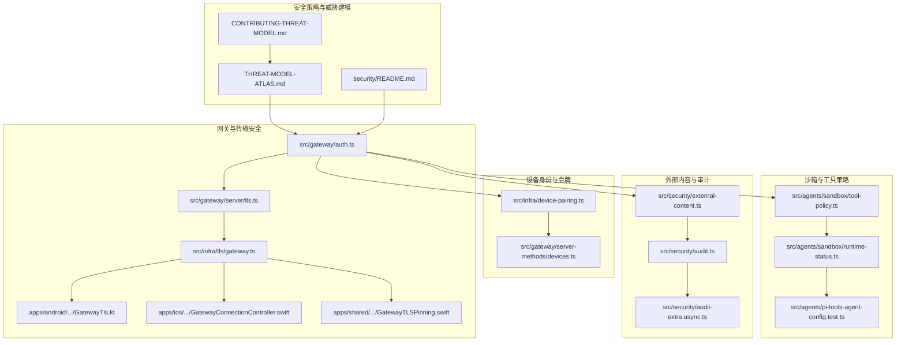
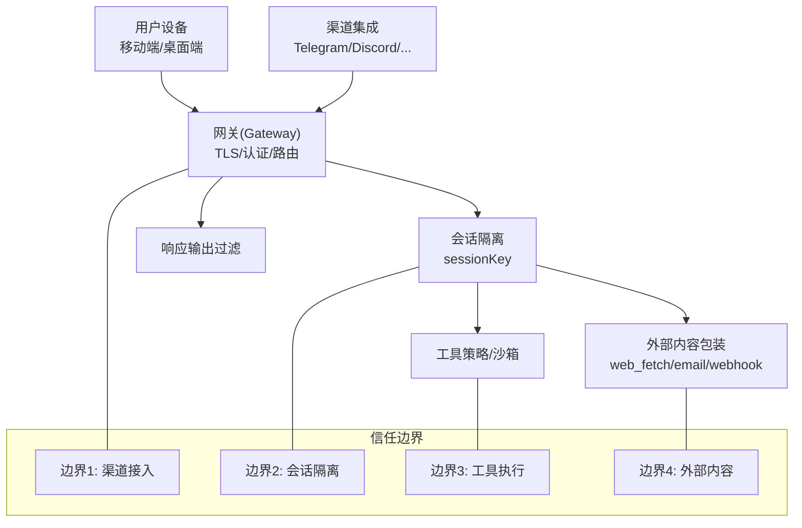
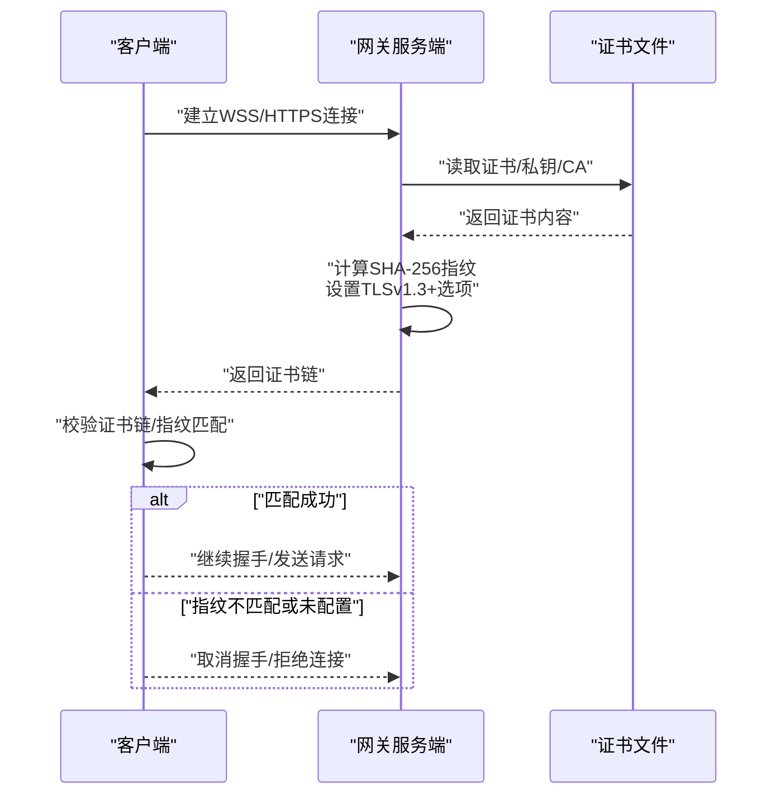
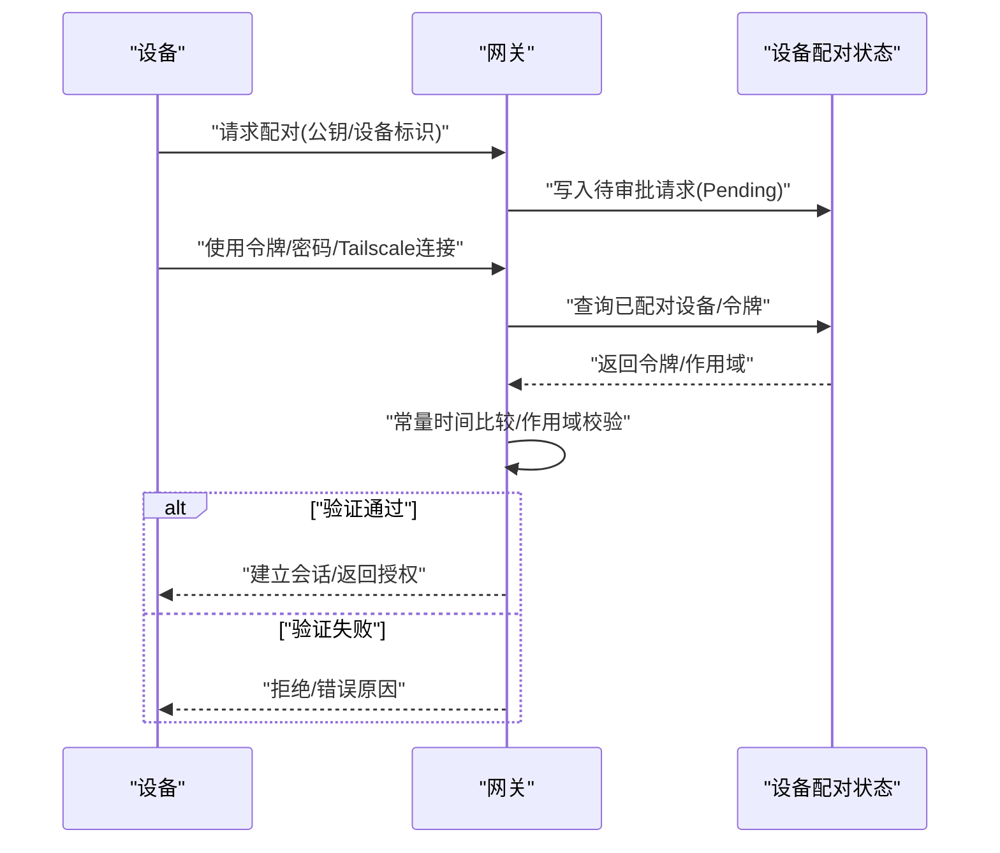
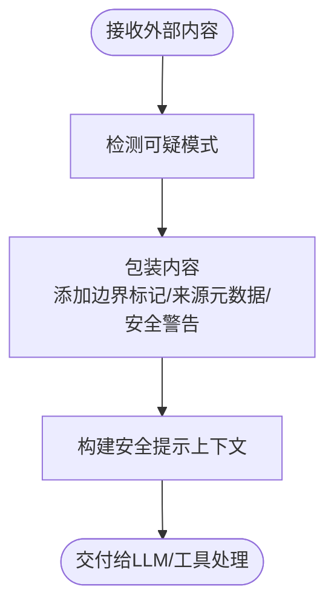
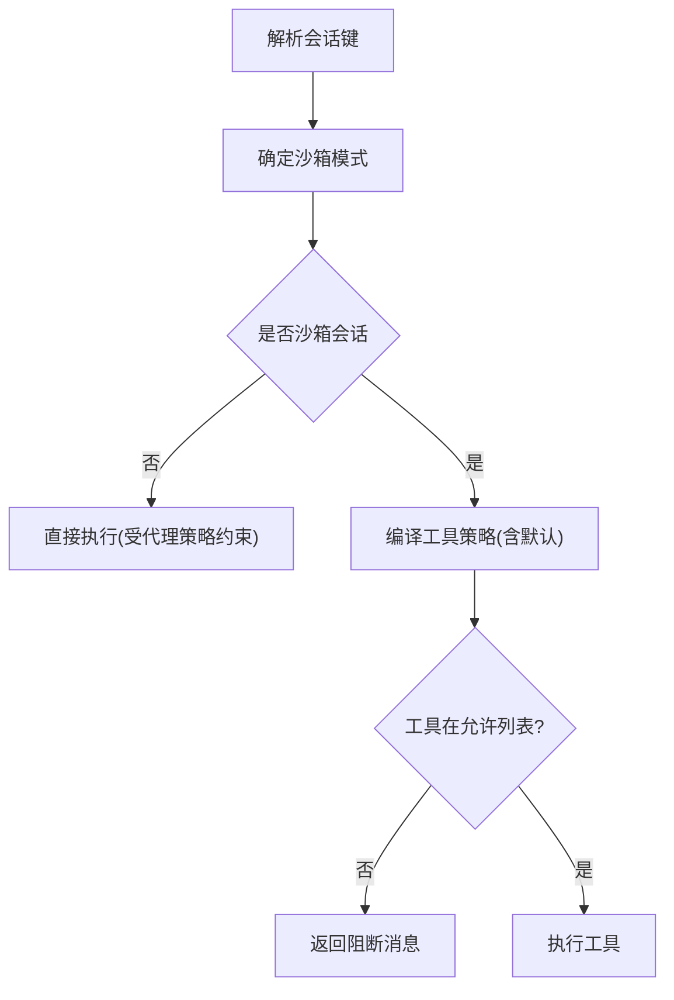
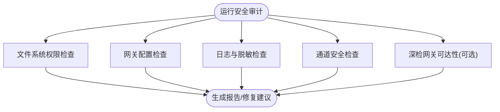
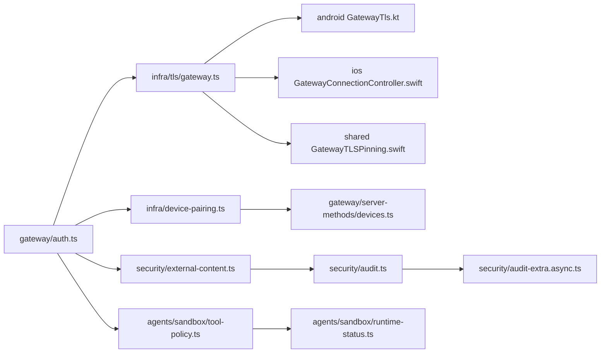

# 安全架构

<cite>
**本文引用的文件**
- [SECURITY.md](file://SECURITY.md)
- [docs/security/README.md](file://docs/security/README.md)
- [docs/security/CONTRIBUTING-THREAT-MODEL.md](file://docs/security/CONTRIBUTING-THREAT-MODEL.md)
- [docs/security/THREAT-MODEL-ATLAS.md](file://docs/security/THREAT-MODEL-ATLAS.md)
- [src/security/audit.ts](file://src/security/audit.ts)
- [src/security/audit-extra.async.ts](file://src/security/audit-extra.async.ts)
- [src/security/external-content.ts](file://src/security/external-content.ts)
- [src/gateway/auth.ts](file://src/gateway/auth.ts)
- [src/gateway/server/tls.ts](file://src/gateway/server/tls.ts)
- [src/infra/tls/gateway.ts](file://src/infra/tls/gateway.ts)
- [apps/android/app/src/main/java/ai/openclaw/android/gateway/GatewayTls.kt](file://apps/android/app/src/main/java/ai/openclaw/android/gateway/GatewayTls.kt)
- [apps/shared/OpenClawKit/Sources/OpenClawKit/GatewayTLSPinning.swift](file://apps/shared/OpenClawKit/Sources/OpenClawKit/GatewayTLSPinning.swift)
- [apps/ios/Sources/Gateway/GatewayConnectionController.swift](file://apps/ios/Sources/Gateway/GatewayConnectionController.swift)
- [src/infra/device-pairing.ts](file://src/infra/device-pairing.ts)
- [src/gateway/server-methods/devices.ts](file://src/gateway/server-methods/devices.ts)
- [src/agents/sandbox/tool-policy.ts](file://src/agents/sandbox/tool-policy.ts)
- [src/agents/sandbox/runtime-status.ts](file://src/agents/sandbox/runtime-status.ts)
- [src/agents/pi-tools-agent-config.test.ts](file://src/agents/pi-tools-agent-config.test.ts)
- [docs/gateway/security/index.md](file://docs/gateway/security/index.md)
</cite>

## 目录

1. [引言](#引言)
2. [项目结构](#项目结构)
3. [核心组件](#核心组件)
4. [架构总览](#架构总览)
5. [详细组件分析](#详细组件分析)
6. [依赖关系分析](#依赖关系分析)
7. [性能考量](#性能考量)
8. [故障排查指南](#故障排查指南)
9. [结论](#结论)
10. [附录](#附录)

## 引言

本文件面向OpenClaw安全架构，系统化阐述多层安全设计与实现：传输安全（TLS与证书固定）、身份认证（网关令牌/密码、Tailscale、设备令牌）、授权控制（会话隔离、工具沙箱、访问组/白名单）、数据保护（外部内容包装与提示注入缓解、日志敏感信息脱敏）。同时给出威胁模型、安全边界、防护策略、安全配置指南、漏洞评估方法与应急响应流程，帮助读者在部署与运维中建立可操作的安全基线。

## 项目结构

OpenClaw安全能力横跨后端网关、移动客户端、代理与沙箱执行等模块，并通过统一的威胁模型与安全审计工具进行持续评估与加固。下图展示与安全相关的关键目录与文件：

图表来源

- [docs/security/THREAT-MODEL-ATLAS.md](file://docs/security/THREAT-MODEL-ATLAS.md#L1-L604)
- [src/gateway/auth.ts](file://src/gateway/auth.ts#L1-L271)
- [src/gateway/server/tls.ts](file://src/gateway/server/tls.ts#L1-L14)
- [src/infra/tls/gateway.ts](file://src/infra/tls/gateway.ts#L81-L150)
- [apps/android/app/src/main/java/ai/openclaw/android/gateway/GatewayTls.kt](file://apps/android/app/src/main/java/ai/openclaw/android/gateway/GatewayTls.kt#L1-L75)
- [apps/ios/Sources/Gateway/GatewayConnectionController.swift](file://apps/ios/Sources/Gateway/GatewayConnectionController.swift#L346-L382)
- [apps/shared/OpenClawKit/Sources/OpenClawKit/GatewayTLSPinning.swift](file://apps/shared/OpenClawKit/Sources/OpenClawKit/GatewayTLSPinning.swift#L1-L119)
- [src/infra/device-pairing.ts](file://src/infra/device-pairing.ts#L1-L560)
- [src/gateway/server-methods/devices.ts](file://src/gateway/server-methods/devices.ts#L1-L30)
- [src/security/external-content.ts](file://src/security/external-content.ts#L1-L285)
- [src/security/audit.ts](file://src/security/audit.ts#L1-L800)
- [src/security/audit-extra.async.ts](file://src/security/audit-extra.async.ts#L503-L545)
- [src/agents/sandbox/tool-policy.ts](file://src/agents/sandbox/tool-policy.ts#L1-L143)
- [src/agents/sandbox/runtime-status.ts](file://src/agents/sandbox/runtime-status.ts#L45-L97)
- [src/agents/pi-tools-agent-config.test.ts](file://src/agents/pi-tools-agent-config.test.ts#L460-L504)

章节来源

- [docs/security/README.md](file://docs/security/README.md#L1-L18)
- [docs/security/CONTRIBUTING-THREAT-MODEL.md](file://docs/security/CONTRIBUTING-THREAT-MODEL.md#L1-L91)
- [docs/security/THREAT-MODEL-ATLAS.md](file://docs/security/THREAT-MODEL-ATLAS.md#L1-L604)

## 核心组件

- 传输安全与证书固定：服务端TLS加载与指纹校验，移动端/桌面端证书固定与TOFU支持，确保链路加密与主机真实性。
- 身份认证与授权：网关令牌/密码认证、Tailscale代理认证、设备配对与令牌管理、会话隔离与访问组/白名单。
- 外部内容处理：对外部输入进行标记、警告与包装，降低提示注入风险。
- 沙箱与工具策略：按会话粒度启用沙箱、工具白名单/黑名单、默认最小权限。
- 安全审计：文件系统权限检查、网关暴露面评估、日志与配置敏感性检查、通道安全配置核查。

章节来源

- [src/gateway/auth.ts](file://src/gateway/auth.ts#L178-L271)
- [src/infra/tls/gateway.ts](file://src/infra/tls/gateway.ts#L81-L150)
- [apps/shared/OpenClawKit/Sources/OpenClawKit/GatewayTLSPinning.swift](file://apps/shared/OpenClawKit/Sources/OpenClawKit/GatewayTLSPinning.swift#L1-L119)
- [src/infra/device-pairing.ts](file://src/infra/device-pairing.ts#L411-L491)
- [src/security/external-content.ts](file://src/security/external-content.ts#L181-L206)
- [src/agents/sandbox/tool-policy.ts](file://src/agents/sandbox/tool-policy.ts#L58-L143)
- [src/security/audit.ts](file://src/security/audit.ts#L259-L387)

## 架构总览

下图展示OpenClaw安全边界与信任域划分，以及数据流与关键防护点：

图表来源

- [docs/security/THREAT-MODEL-ATLAS.md](file://docs/security/THREAT-MODEL-ATLAS.md#L56-L123)
- [src/security/external-content.ts](file://src/security/external-content.ts#L181-L206)
- [src/agents/sandbox/tool-policy.ts](file://src/agents/sandbox/tool-policy.ts#L58-L143)

## 详细组件分析

### 传输安全与证书固定

- 服务端TLS加载：自动检测证书/私钥存在性，生成自签名证书（可选），计算SHA-256指纹并设置最低TLS版本。
- 移动端/桌面端证书固定：支持期望指纹匹配、TOFU首次信任存储、默认信任链回退；在无期望指纹时允许临时信任以完成首次连接。
- 网络层TLS配置：服务端强制TLSv1.3以上，客户端在握手阶段进行证书链校验与指纹比对。

图表来源

- [src/infra/tls/gateway.ts](file://src/infra/tls/gateway.ts#L81-L150)
- [apps/shared/OpenClawKit/Sources/OpenClawKit/GatewayTLSPinning.swift](file://apps/shared/OpenClawKit/Sources/OpenClawKit/GatewayTLSPinning.swift#L59-L96)
- [apps/android/app/src/main/java/ai/openclaw/android/gateway/GatewayTls.kt](file://apps/android/app/src/main/java/ai/openclaw/android/gateway/GatewayTls.kt#L27-L67)
- [apps/ios/Sources/Gateway/GatewayConnectionController.swift](file://apps/ios/Sources/Gateway/GatewayConnectionController.swift#L346-L382)

章节来源

- [src/gateway/server/tls.ts](file://src/gateway/server/tls.ts#L1-L14)
- [src/infra/tls/gateway.ts](file://src/infra/tls/gateway.ts#L81-L150)
- [apps/shared/OpenClawKit/Sources/OpenClawKit/GatewayTLSPinning.swift](file://apps/shared/OpenClawKit/Sources/OpenClawKit/GatewayTLSPinning.swift#L1-L119)
- [apps/android/app/src/main/java/ai/openclaw/android/gateway/GatewayTls.kt](file://apps/android/app/src/main/java/ai/openclaw/android/gateway/GatewayTls.kt#L1-L75)
- [apps/ios/Sources/Gateway/GatewayConnectionController.swift](file://apps/ios/Sources/Gateway/GatewayConnectionController.swift#L346-L382)

### 身份认证与授权控制

- 网关认证模式：支持令牌与密码两种模式，优先从环境变量或配置读取；可启用Tailscale代理认证，结合WHOIS校验确保来源可信。
- 本地直连判定：基于Host头、Loopback地址与反向代理头判断是否为本地直连，避免被伪造。
- 设备配对与令牌：设备首次配对产生待审批请求，批准后生成角色化令牌，支持作用域限制、轮换与撤销；验证时进行常量时间比较与作用域校验。

图表来源

- [src/gateway/auth.ts](file://src/gateway/auth.ts#L217-L271)
- [src/infra/device-pairing.ts](file://src/infra/device-pairing.ts#L297-L347)
- [src/infra/device-pairing.ts](file://src/infra/device-pairing.ts#L411-L491)

章节来源

- [src/gateway/auth.ts](file://src/gateway/auth.ts#L1-L271)
- [src/infra/device-pairing.ts](file://src/infra/device-pairing.ts#L1-L560)
- [src/gateway/server-methods/devices.ts](file://src/gateway/server-methods/devices.ts#L1-L30)

### 外部内容处理与提示注入缓解

- 内容包装：对外部输入（邮件、Webhook、Web抓取）添加安全边界标记与来源元数据，附带安全警告，明确禁止将外部内容视为系统指令。
- 注入检测：内置可疑模式检测列表，用于监控潜在提示注入尝试。
- 钩子识别：识别来自钩子的会话来源，以便采取相应安全策略。

图表来源

- [src/security/external-content.ts](file://src/security/external-content.ts#L15-L41)
- [src/security/external-content.ts](file://src/security/external-content.ts#L181-L206)
- [src/security/external-content.ts](file://src/security/external-content.ts#L212-L244)

章节来源

- [src/security/external-content.ts](file://src/security/external-content.ts#L1-L285)

### 沙箱与工具策略

- 工具策略：支持通配/精确/正则三种模式，按“先拒后允”原则，全局/代理级策略叠加，图像类工具默认开放。
- 运行时状态：根据会话键解析沙箱模式与工具策略，若会话被判定为沙箱，则对不允许的工具返回阻断消息。
- 测试用例：验证代理策略优先于沙箱策略，且沙箱进一步收紧权限。

图表来源

- [src/agents/sandbox/runtime-status.ts](file://src/agents/sandbox/runtime-status.ts#L45-L97)
- [src/agents/sandbox/tool-policy.ts](file://src/agents/sandbox/tool-policy.ts#L58-L143)
- [src/agents/pi-tools-agent-config.test.ts](file://src/agents/pi-tools-agent-config.test.ts#L460-L504)

章节来源

- [src/agents/sandbox/tool-policy.ts](file://src/agents/sandbox/tool-policy.ts#L1-L143)
- [src/agents/sandbox/runtime-status.ts](file://src/agents/sandbox/runtime-status.ts#L45-L97)
- [src/agents/pi-tools-agent-config.test.ts](file://src/agents/pi-tools-agent-config.test.ts#L460-L504)

### 安全审计与配置检查

- 文件系统与配置：检查状态目录与配置文件权限，识别世界可写/可读风险；检查日志文件权限与敏感信息脱敏设置。
- 网关暴露面：检查绑定地址、Tailscale模式、控制界面认证开关、令牌长度等；识别HTTP端点的会话键覆盖风险。
- 通道安全：检查各渠道DM策略与AllowFrom配置一致性，识别开放DM与多用户共享主会话的风险。
- 扩展审计：支持深检（deep probe）探测网关可达性与连接状态，汇总严重程度并提供修复建议。

图表来源

- [src/security/audit.ts](file://src/security/audit.ts#L129-L257)
- [src/security/audit.ts](file://src/security/audit.ts#L259-L387)
- [src/security/audit.ts](file://src/security/audit.ts#L503-L504)
- [src/security/audit-extra.async.ts](file://src/security/audit-extra.async.ts#L503-L545)

章节来源

- [src/security/audit.ts](file://src/security/audit.ts#L1-L800)
- [src/security/audit-extra.async.ts](file://src/security/audit-extra.async.ts#L503-L545)

## 依赖关系分析

- 组件耦合：网关认证依赖Tailscale WHOIS与客户端IP解析；TLS加载依赖证书文件与指纹计算；设备配对状态持久化与原子写入；外部内容包装贯穿会话与工具调用前处理。
- 外部依赖：Node.js crypto库用于随机数与常量时间比较；平台TLS栈用于证书固定与握手；移动平台安全框架用于证书链校验。

图表来源

- [src/gateway/auth.ts](file://src/gateway/auth.ts#L1-L271)
- [src/infra/tls/gateway.ts](file://src/infra/tls/gateway.ts#L81-L150)
- [apps/android/app/src/main/java/ai/openclaw/android/gateway/GatewayTls.kt](file://apps/android/app/src/main/java/ai/openclaw/android/gateway/GatewayTls.kt#L1-L75)
- [apps/ios/Sources/Gateway/GatewayConnectionController.swift](file://apps/ios/Sources/Gateway/GatewayConnectionController.swift#L346-L382)
- [apps/shared/OpenClawKit/Sources/OpenClawKit/GatewayTLSPinning.swift](file://apps/shared/OpenClawKit/Sources/OpenClawKit/GatewayTLSPinning.swift#L1-L119)
- [src/infra/device-pairing.ts](file://src/infra/device-pairing.ts#L1-L560)
- [src/gateway/server-methods/devices.ts](file://src/gateway/server-methods/devices.ts#L1-L30)
- [src/security/external-content.ts](file://src/security/external-content.ts#L1-L285)
- [src/security/audit.ts](file://src/security/audit.ts#L1-L800)
- [src/security/audit-extra.async.ts](file://src/security/audit-extra.async.ts#L503-L545)
- [src/agents/sandbox/tool-policy.ts](file://src/agents/sandbox/tool-policy.ts#L1-L143)
- [src/agents/sandbox/runtime-status.ts](file://src/agents/sandbox/runtime-status.ts#L45-L97)

## 性能考量

- TLS握手与证书固定：指纹计算与证书链校验开销较小，建议在客户端缓存指纹以减少重复计算。
- 设备配对状态：采用原子写入与锁机制，避免并发写冲突；建议批量操作时合并请求。
- 外部内容包装：标记替换与正则检测成本低，建议在上游缓存已包装内容以减少重复处理。
- 沙箱策略：工具策略编译与匹配在会话初始化时完成，运行期仅做快速匹配，影响可忽略。

## 故障排查指南

- TLS连接失败
  - 检查证书/私钥是否存在且格式正确，确认指纹计算结果。
  - 客户端指纹不匹配：核对服务端证书指纹与客户端期望值，必要时启用TOFU并保存指纹。
  - 参考路径：[src/infra/tls/gateway.ts](file://src/infra/tls/gateway.ts#L81-L150)、[apps/shared/OpenClawKit/Sources/OpenClawKit/GatewayTLSPinning.swift](file://apps/shared/OpenClawKit/Sources/OpenClawKit/GatewayTLSPinning.swift#L59-L96)
- 认证失败
  - 确认网关认证模式与凭据配置，检查Tailscale代理头与WHOIS校验。
  - 参考路径：[src/gateway/auth.ts](file://src/gateway/auth.ts#L217-L271)
- 设备令牌无效
  - 检查设备是否已配对、令牌是否撤销、作用域是否满足请求范围。
  - 参考路径：[src/infra/device-pairing.ts](file://src/infra/device-pairing.ts#L411-L491)
- 外部内容导致异常
  - 查看可疑模式检测日志，确认包装是否生效；必要时调整工具策略。
  - 参考路径：[src/security/external-content.ts](file://src/security/external-content.ts#L15-L41)、[src/security/external-content.ts](file://src/security/external-content.ts#L181-L206)
- 沙箱策略误拦截
  - 检查代理/全局工具策略叠加逻辑，确认图像类工具默认开放规则。
  - 参考路径：[src/agents/sandbox/tool-policy.ts](file://src/agents/sandbox/tool-policy.ts#L125-L133)、[src/agents/pi-tools-agent-config.test.ts](file://src/agents/pi-tools-agent-config.test.ts#L460-L504)

章节来源

- [src/infra/tls/gateway.ts](file://src/infra/tls/gateway.ts#L81-L150)
- [apps/shared/OpenClawKit/Sources/OpenClawKit/GatewayTLSPinning.swift](file://apps/shared/OpenClawKit/Sources/OpenClawKit/GatewayTLSPinning.swift#L59-L96)
- [src/gateway/auth.ts](file://src/gateway/auth.ts#L217-L271)
- [src/infra/device-pairing.ts](file://src/infra/device-pairing.ts#L411-L491)
- [src/security/external-content.ts](file://src/security/external-content.ts#L15-L41)
- [src/agents/sandbox/tool-policy.ts](file://src/agents/sandbox/tool-policy.ts#L125-L133)
- [src/agents/pi-tools-agent-config.test.ts](file://src/agents/pi-tools-agent-config.test.ts#L460-L504)

## 结论

OpenClaw通过“传输加密+证书固定”“多因子认证+设备令牌”“会话隔离+工具沙箱”“外部内容包装+提示注入缓解”“持续安全审计”的组合拳，构建了覆盖端到端的纵深防御体系。建议在生产环境中启用TLS、严格控制网关暴露面、实施最小权限的工具策略、强化通道白名单与会话隔离，并定期运行安全审计以发现与修复风险。

## 附录

### 威胁模型与安全边界

- MITRE ATLAS驱动的威胁建模文档，定义了五大信任边界与关键数据流，涵盖识别、初始访问、执行、持久化、规避、发现、采集与泄露、影响等战术。
- 关键攻击链：技能供应链污染、提示注入到命令执行、间接注入经由抓取内容传播。
- 参考路径：[docs/security/THREAT-MODEL-ATLAS.md](file://docs/security/THREAT-MODEL-ATLAS.md#L1-L604)

章节来源

- [docs/security/THREAT-MODEL-ATLAS.md](file://docs/security/THREAT-MODEL-ATLAS.md#L1-L604)

### 安全配置指南

- 网关
  - 绑定地址仅限本地回环或尾网，启用令牌认证并设置足够长度的随机令牌；如需公开，优先使用Tailscale Serve而非Funnel。
  - 控制界面禁用不安全HTTP认证与设备身份豁免开关。
  - 参考路径：[src/security/audit.ts](file://src/security/audit.ts#L259-L387)
- 传输
  - 使用TLSv1.3及以上，启用证书固定；客户端指纹与服务端一致或允许TOFU后保存。
  - 参考路径：[src/infra/tls/gateway.ts](file://src/infra/tls/gateway.ts#L81-L150)、[apps/shared/OpenClawKit/Sources/OpenClawKit/GatewayTLSPinning.swift](file://apps/shared/OpenClawKit/Sources/OpenClawKit/GatewayTLSPinning.swift#L59-L96)
- 设备与令牌
  - 严格配对流程，最小化作用域，定期轮换令牌，撤销不再使用的令牌。
  - 参考路径：[src/infra/device-pairing.ts](file://src/infra/device-pairing.ts#L297-L347)、[src/infra/device-pairing.ts](file://src/infra/device-pairing.ts#L451-L491)
- 外部内容
  - 对所有外部输入进行包装与安全警告；对web_fetch实施URL白名单与SSRF防护。
  - 参考路径：[src/security/external-content.ts](file://src/security/external-content.ts#L181-L206)
- 沙箱与工具
  - 默认沙箱执行，工具策略“先拒后允”，代理策略优先于全局策略。
  - 参考路径：[src/agents/sandbox/tool-policy.ts](file://src/agents/sandbox/tool-policy.ts#L58-L143)、[src/agents/sandbox/runtime-status.ts](file://src/agents/sandbox/runtime-status.ts#L45-L97)

### 漏洞评估方法

- 自动化扫描：使用detect-secrets检测密钥泄露；运行安全审计命令收集暴露面与配置问题。
- 手工验证：针对高危配置（如Funnel、AllowFrom通配符、日志脱敏关闭）进行复核。
- 参考路径：[SECURITY.md](file://SECURITY.md#L89-L100)、[src/security/audit.ts](file://src/security/audit.ts#L1-L800)

### 应急响应流程

- 触发条件：发现凭证泄露、通道被滥用、供应链技能异常、提示注入事件。
- 处置步骤：
  - 立即撤销受影响令牌与凭据，轮换网关令牌，收紧通道AllowFrom。
  - 检查日志与审计报告，定位受影响会话与工具调用。
  - 通知用户与受影响渠道，限制或暂停相关技能。
  - 回归测试：验证TLS指纹、沙箱策略、外部内容包装是否正常。
- 参考路径：[src/infra/device-pairing.ts](file://src/infra/device-pairing.ts#L533-L559)、[src/security/audit.ts](file://src/security/audit.ts#L503-L504)
