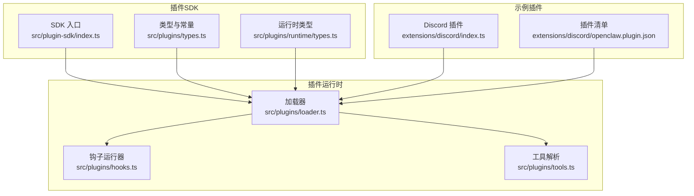
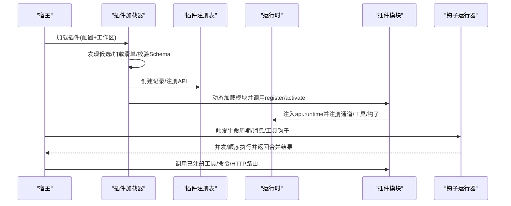
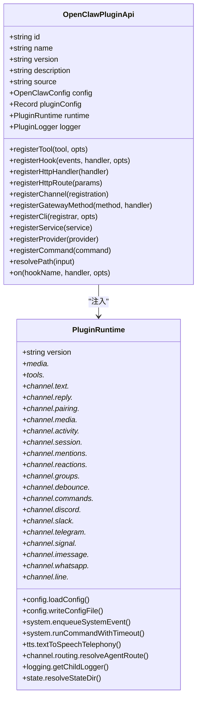
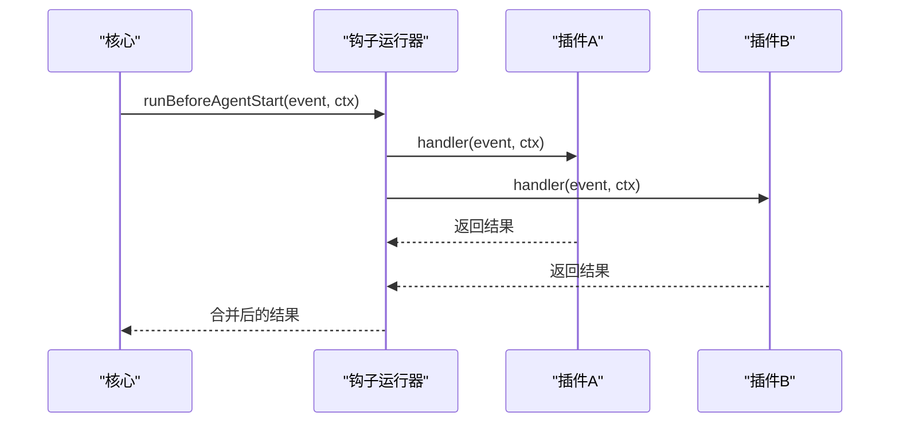
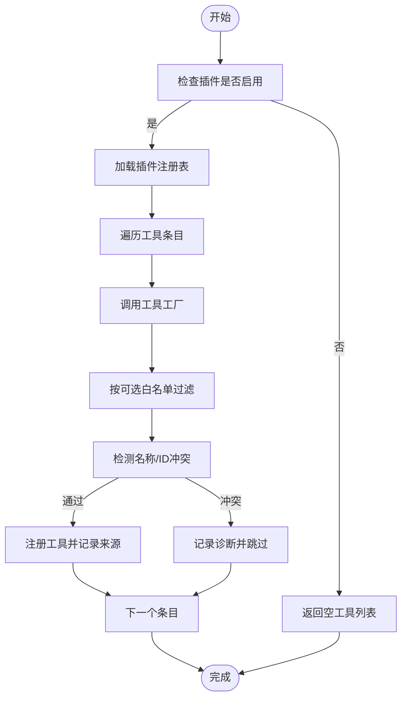
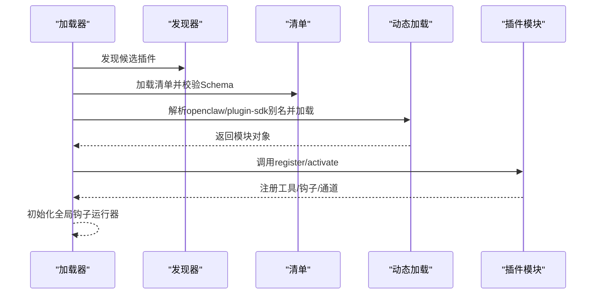
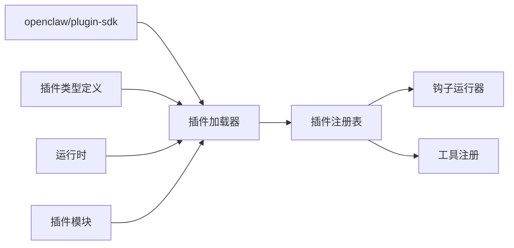

# 插件API与开发框架

<cite>
**本文引用的文件**
- [README.md](file://README.md)
- [plugin-sdk.md](file://docs/refactor/plugin-sdk.md)
- [index.ts（插件SDK入口）](file://src/plugin-sdk/index.ts)
- [types.ts（插件类型定义）](file://src/plugins/types.ts)
- [hooks.ts（插件钩子运行器）](file://src/plugins/hooks.ts)
- [tools.ts（插件工具解析）](file://src/plugins/tools.ts)
- [runtime/types.ts（运行时类型）](file://src/plugins/runtime/types.ts)
- [loader.ts（插件加载器）](file://src/plugins/loader.ts)
- [discord/openclaw.plugin.json](file://extensions/discord/openclaw.plugin.json)
- [discord/index.ts](file://extensions/discord/index.ts)
</cite>

## 目录

1. [简介](#简介)
2. [项目结构](#项目结构)
3. [核心组件](#核心组件)
4. [架构总览](#架构总览)
5. [详细组件分析](#详细组件分析)
6. [依赖关系分析](#依赖关系分析)
7. [性能考量](#性能考量)
8. [故障排查指南](#故障排查指南)
9. [结论](#结论)
10. [附录](#附录)

## 简介

本文件面向OpenClaw插件开发者与维护者，系统化阐述插件API与开发框架的设计理念、接口规范与运行时机制。内容覆盖事件钩子、工具注册、配置管理、运行时注入、沙箱隔离与权限控制、资源限制、生命周期钩子、工具调用钩子、消息处理钩子等主题，并提供最佳实践、调试指南与完整开发示例路径。

## 项目结构

OpenClaw采用“插件SDK + 运行时”的双层架构设计，目标是将所有消息通道连接器统一为插件，通过稳定且可版本化的SDK与运行时进行交互，避免直接导入核心源码，确保外部插件生态的独立演进与安全边界。

- 插件SDK：提供类型、工具函数、配置Schema与帮助器，不包含运行时状态与副作用。
- 插件运行时：通过OpenClawPluginApi.runtime暴露对核心行为的受控访问，插件不得直接导入src/\*\*。
- 插件加载与发现：基于清单与别名映射，动态加载并注册插件模块，支持缓存与诊断输出。
- 钩子系统：提供生命周期、消息、工具、会话、网关等钩子，支持顺序与并发执行策略及优先级合并。

图表来源

- [index.ts（插件SDK入口）](file://src/plugin-sdk/index.ts#L1-L392)
- [types.ts（插件类型定义）](file://src/plugins/types.ts#L1-L538)
- [runtime/types.ts（运行时类型）](file://src/plugins/runtime/types.ts#L1-L363)
- [loader.ts（插件加载器）](file://src/plugins/loader.ts#L1-L457)
- [discord/index.ts](file://extensions/discord/index.ts#L1-L18)
- [discord/openclaw.plugin.json](file://extensions/discord/openclaw.plugin.json#L1-L10)

章节来源

- [plugin-sdk.md](file://docs/refactor/plugin-sdk.md#L1-L215)
- [README.md](file://README.md#L1-L550)

## 核心组件

- 插件SDK（编译期、稳定、可发布）
  - 提供ChannelPlugin、适配器、元数据、能力声明、配置Schema构建器、配对与引导辅助、工具参数辅助、文档链接辅助等。
  - 交付形式：作为openclaw/plugin-sdk发布或在核心内导出。
- 插件运行时（执行面、被注入）
  - 通过OpenClawPluginApi.runtime暴露：文本分块、回复派发、路由、配对、媒体拉取与保存、提及匹配、群组策略、去抖、命令授权、系统命令、日志、状态目录等。
  - 每个运行时方法均映射到现有核心实现，避免重复逻辑。
- 插件加载器
  - 发现候选插件、加载清单、校验配置Schema、动态加载模块、创建API并调用register/activate、初始化全局钩子运行器、缓存与诊断。
- 钩子系统
  - 生命周期钩子（before_agent_start、agent_end、before_compaction、after_compaction）、消息钩子（message_received、message_sending、message_sent）、工具钩子（before_tool_call、after_tool_call、tool_result_persist）、会话钩子（session_start、session_end）、网关钩子（gateway_start、gateway_stop）。
  - 支持顺序执行（合并结果）与并发执行（fire-and-forget），并允许设置优先级。
- 工具注册
  - 解析插件工具工厂，按名称冲突与可选工具白名单过滤，注入到Agent工具集，记录来源与可选标记。
- 配置管理
  - 插件需提供JSON Schema配置，加载器负责校验；插件可通过configSchema与UI提示完善配置体验。
- 安全与沙箱
  - 默认主会话无沙箱；非主会话可在会话维度启用Docker沙箱，限制工具白名单/黑名单，保障通道与设备操作安全。

章节来源

- [plugin-sdk.md](file://docs/refactor/plugin-sdk.md#L19-L152)
- [index.ts（插件SDK入口）](file://src/plugin-sdk/index.ts#L1-L392)
- [runtime/types.ts（运行时类型）](file://src/plugins/runtime/types.ts#L178-L362)
- [loader.ts（插件加载器）](file://src/plugins/loader.ts#L170-L456)
- [hooks.ts（插件钩子运行器）](file://src/plugins/hooks.ts#L93-L471)
- [tools.ts（插件工具解析）](file://src/plugins/tools.ts#L44-L138)

## 架构总览

下图展示从插件加载到运行时注入、钩子执行与工具注册的整体流程。

图表来源

- [loader.ts（插件加载器）](file://src/plugins/loader.ts#L170-L456)
- [hooks.ts（插件钩子运行器）](file://src/plugins/hooks.ts#L93-L471)
- [discord/index.ts](file://extensions/discord/index.ts#L11-L14)

章节来源

- [plugin-sdk.md](file://docs/refactor/plugin-sdk.md#L153-L212)
- [README.md](file://README.md#L327-L333)

## 详细组件分析

### 组件A：插件SDK与运行时接口

- 设计要点
  - SDK保持稳定与最小化，仅暴露必要类型与工具，避免引入运行时状态。
  - 运行时通过OpenClawPluginApi.runtime统一注入，插件不得直接导入src/\*\*。
  - 每个运行时方法对应核心已有实现，保证行为一致性。
- 关键接口
  - OpenClawPluginApi：registerTool、registerHook、registerHttpHandler、registerHttpRoute、registerChannel、registerGatewayMethod、registerCli、registerService、registerProvider、registerCommand、resolvePath、on。
  - PluginRuntime：文本、回复、路由、配对、媒体、提及、群组、去抖、命令授权、系统命令、日志、状态目录等。
- 类型与常量
  - 插件类型、钩子名称、上下文、事件、结果、诊断等类型集中于types.ts，便于消费端强类型约束。

图表来源

- [types.ts（插件类型定义）](file://src/plugins/types.ts#L244-L283)
- [runtime/types.ts（运行时类型）](file://src/plugins/runtime/types.ts#L178-L362)

章节来源

- [plugin-sdk.md](file://docs/refactor/plugin-sdk.md#L21-L152)
- [index.ts（插件SDK入口）](file://src/plugin-sdk/index.ts#L1-L392)
- [types.ts（插件类型定义）](file://src/plugins/types.ts#L1-L538)
- [runtime/types.ts（运行时类型）](file://src/plugins/runtime/types.ts#L1-L363)

### 组件B：插件钩子系统

- 执行模型
  - 并发钩子：fire-and-forget，适合无状态通知（如message*received、message_sent、agent_end、session*_、gateway\__）。
  - 顺序钩子：按优先级串行执行，合并结果（如before_agent_start、message_sending、before_tool_call、tool_result_persist）。
  - 同步钩子：tool_result_persist严格同步，禁止异步返回。
- 常见钩子用途
  - before_agent_start：注入系统提示词与前置上下文。
  - message_sending：修改或取消外发消息。
  - before_tool_call：阻断或修改工具调用参数。
  - tool_result_persist：精简或替换写入会话的消息体。
  - session_start/end：会话生命周期事件。
  - gateway_start/stop：网关生命周期事件。
- 错误处理
  - 可配置catchErrors，失败时记录日志或抛出异常，避免单个插件影响整体链路。

图表来源

- [hooks.ts（插件钩子运行器）](file://src/plugins/hooks.ts#L183-L199)

章节来源

- [hooks.ts（插件钩子运行器）](file://src/plugins/hooks.ts#L93-L471)

### 组件C：插件工具注册机制

- 流程概览
  - 读取插件配置与测试默认值，规范化插件开关与加载路径。
  - 加载插件注册表，遍历工具条目，工厂产出工具后进行名称冲突与可选白名单过滤。
  - 记录工具来源与可选性，注入到Agent工具集合。
- 关键点
  - 名称冲突检测：插件ID与核心工具名冲突、同插件内重复名称冲突。
  - 可选工具白名单：支持按工具名、插件ID或组别(group:plugins)放行。
  - 性能优化：当插件禁用时跳过发现与动态加载，降低热路径开销。

图表来源

- [tools.ts（插件工具解析）](file://src/plugins/tools.ts#L44-L138)

章节来源

- [tools.ts（插件工具解析）](file://src/plugins/tools.ts#L1-L139)

### 组件D：插件加载与发现

- 发现与清单
  - 基于工作区与额外路径发现候选插件，加载清单并进行重名覆盖判定。
- 动态加载
  - 使用jiti解析openclaw/plugin-sdk别名，动态加载模块，解析默认导出或命名导出。
- 配置校验
  - 使用JSON Schema校验插件配置，支持缓存键生成与错误收集。
- 注册与诊断
  - 创建API并调用register/activate，记录诊断信息，初始化全局钩子运行器，支持缓存。

图表来源

- [loader.ts（插件加载器）](file://src/plugins/loader.ts#L170-L456)

章节来源

- [loader.ts（插件加载器）](file://src/plugins/loader.ts#L1-L457)

### 组件E：示例：Discord插件

- 清单
  - openclaw.plugin.json声明插件ID、通道类型与空配置Schema。
- 模块
  - index.ts导出插件定义，注册运行时、通道插件，使用SDK提供的emptyPluginConfigSchema。
- 开发要点
  - 通过api.runtime注入通道能力，避免直接依赖核心实现。
  - 在register中完成通道注册与运行时绑定。

章节来源

- [discord/openclaw.plugin.json](file://extensions/discord/openclaw.plugin.json#L1-L10)
- [discord/index.ts](file://extensions/discord/index.ts#L1-L18)

## 依赖关系分析

- 插件SDK与运行时
  - 插件仅通过openclaw/plugin-sdk与api.runtime访问核心能力，避免直接导入src/\*\*。
- 插件加载器
  - 依赖发现器、清单注册表、jiti别名解析、运行时创建与全局钩子初始化。
- 钩子系统
  - 与插件注册表耦合，按钩子名称与优先级排序执行。
- 工具注册
  - 依赖插件注册表与工具工厂，进行冲突检测与白名单过滤。

图表来源

- [index.ts（插件SDK入口）](file://src/plugin-sdk/index.ts#L1-L392)
- [types.ts（插件类型定义）](file://src/plugins/types.ts#L1-L538)
- [loader.ts（插件加载器）](file://src/plugins/loader.ts#L1-L457)
- [hooks.ts（插件钩子运行器）](file://src/plugins/hooks.ts#L1-L471)
- [tools.ts（插件工具解析）](file://src/plugins/tools.ts#L1-L139)

章节来源

- [plugin-sdk.md](file://docs/refactor/plugin-sdk.md#L183-L212)

## 性能考量

- 插件禁用快速路径：在工具解析与加载阶段，若插件未启用则跳过发现与动态加载，显著降低单元测试与热路径开销。
- 钩子并发策略：消息接收与发送确认等无状态钩子采用并发执行，提升吞吐。
- 缓存：插件注册表支持缓存键生成与复用，减少重复加载。
- 同步钩子限制：tool_result_persist严格同步，避免异步带来的热点路径阻塞风险。

章节来源

- [tools.ts（插件工具解析）](file://src/plugins/tools.ts#L44-L55)
- [hooks.ts（插件钩子运行器）](file://src/plugins/hooks.ts#L97-L127)
- [loader.ts（插件加载器）](file://src/plugins/loader.ts#L77-L83)

## 故障排查指南

- 插件加载失败
  - 检查插件模块导出是否包含register/activate函数，确认openclaw/plugin-sdk别名解析成功。
  - 查看诊断信息与错误字段，定位具体失败原因。
- 配置校验失败
  - 核对openclaw.plugin.json中的configSchema，确保与实际配置一致。
- 钩子异常
  - 若catchErrors为true，错误会被记录但不会中断其他钩子；否则会抛出异常。
  - 对tool_result_persist，确保处理器为同步函数，避免Promise被忽略。
- 工具冲突
  - 若出现“插件ID冲突”或“工具名冲突”，请调整插件ID或工具名，避免与核心或其它插件重复。
- 安全与沙箱
  - 非主会话建议启用沙箱，限制工具白名单/黑名单，避免通道与设备操作越权。

章节来源

- [loader.ts（插件加载器）](file://src/plugins/loader.ts#L297-L440)
- [hooks.ts（插件钩子运行器）](file://src/plugins/hooks.ts#L325-L372)
- [tools.ts（插件工具解析）](file://src/plugins/tools.ts#L74-L134)
- [README.md](file://README.md#L327-L333)

## 结论

OpenClaw插件API与开发框架以“SDK + 运行时”为核心，提供稳定、可扩展且安全的插件生态。通过严格的运行时注入、钩子系统、工具注册与配置Schema校验，既保证了外部插件的独立演进，又确保了与核心行为的一致性与可观测性。遵循本文的最佳实践与调试指南，可高效构建高质量插件并快速定位问题。

## 附录

- 开发示例路径
  - 示例插件：extensions/discord/index.ts 与 extensions/discord/openclaw.plugin.json
  - SDK入口：src/plugin-sdk/index.ts
  - 类型与钩子：src/plugins/types.ts、src/plugins/hooks.ts
  - 运行时接口：src/plugins/runtime/types.ts
  - 插件加载：src/plugins/loader.ts
  - 工具注册：src/plugins/tools.ts
- 最佳实践
  - 使用openclaw/plugin-sdk与api.runtime，避免直接导入src/\*\*。
  - 提供完备的configSchema与UI提示，提升配置体验。
  - 合理使用钩子优先级与合并策略，避免竞态与状态污染。
  - 在非主会话场景启用沙箱与工具白名单，强化安全边界。
  - 对tool_result_persist等热点钩子保持同步与轻量处理。
