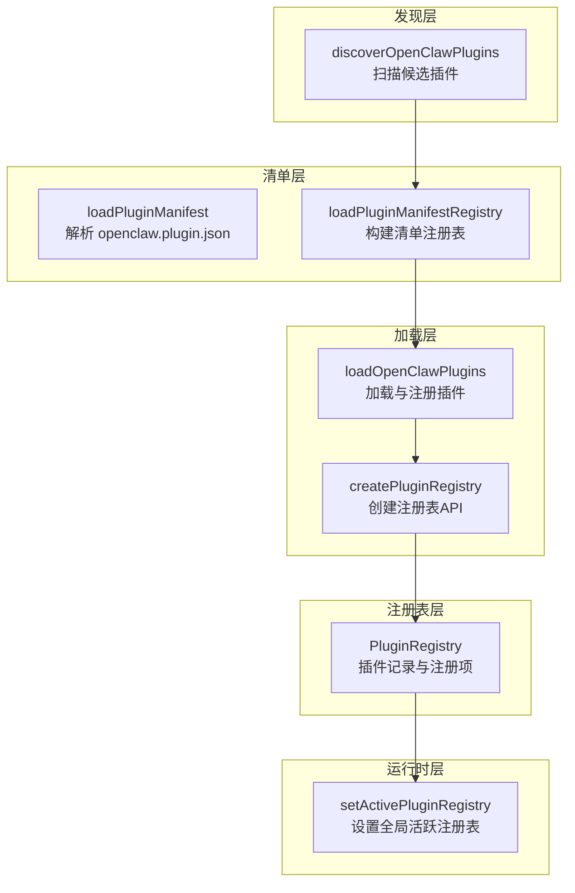
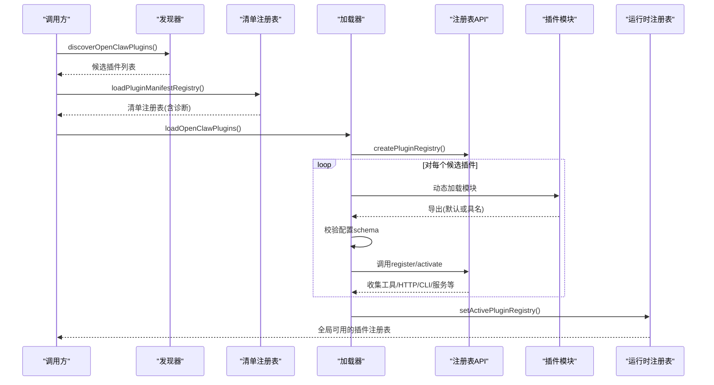
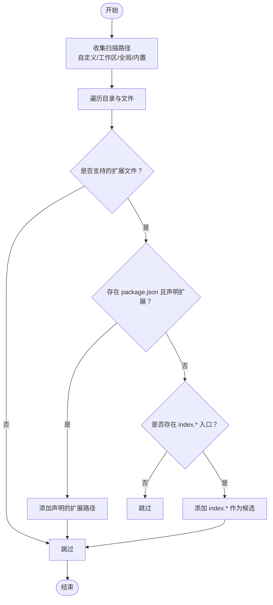
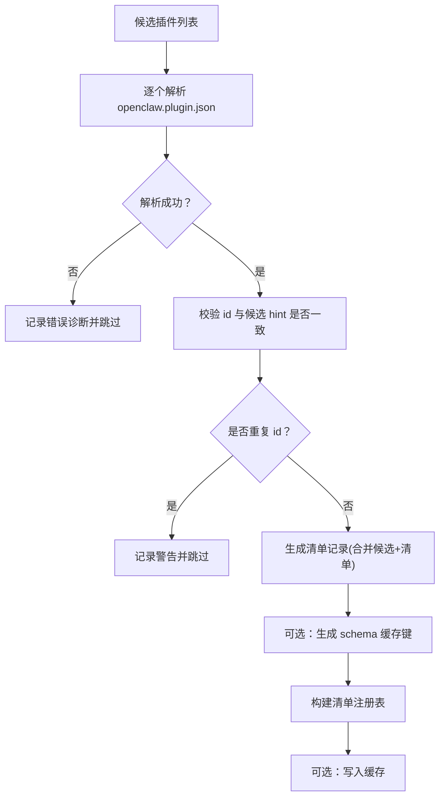
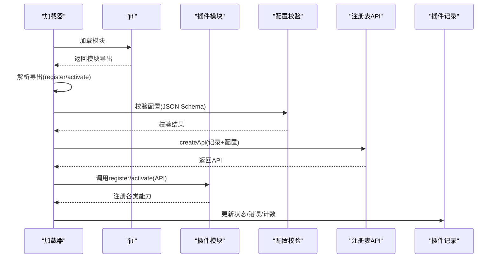
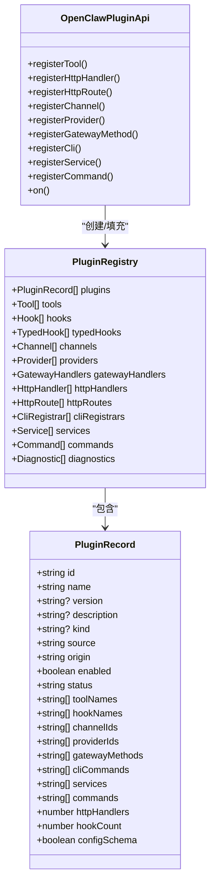
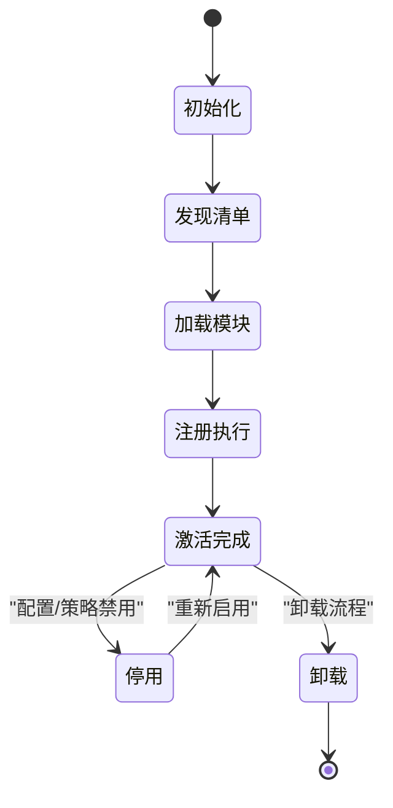
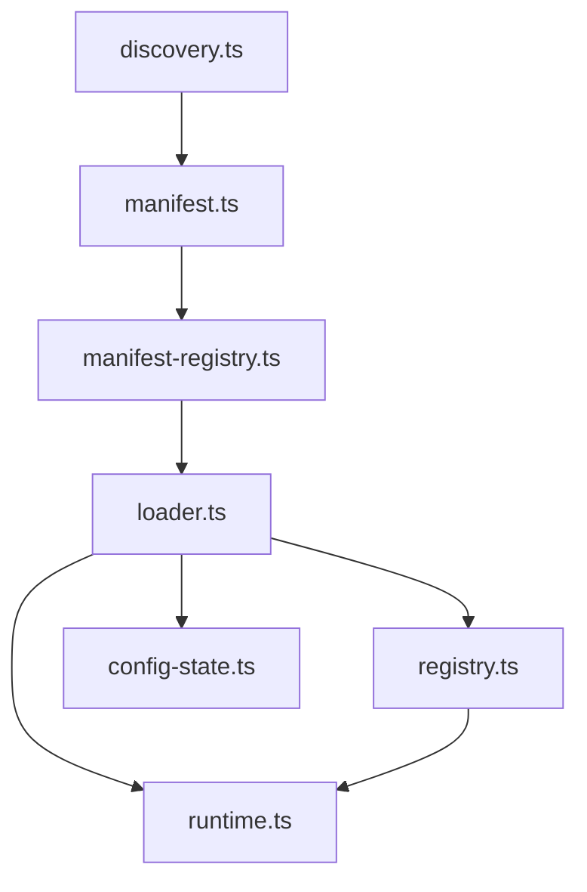

# 插件发现与加载机制

<cite>
**本文档引用的文件**
- [manifest.ts](file://src/plugins/manifest.ts)
- [manifest-registry.ts](file://src/plugins/manifest-registry.ts)
- [discovery.ts](file://src/plugins/discovery.ts)
- [loader.ts](file://src/plugins/loader.ts)
- [registry.ts](file://src/plugins/registry.ts)
- [config-state.ts](file://src/plugins/config-state.ts)
- [runtime.ts](file://src/plugins/runtime.ts)
- [openclaw.plugin.json（discord）](file://extensions/discord/openclaw.plugin.json)
- [openclaw.plugin.json（telegram）](file://extensions/telegram/openclaw.plugin.json)
- [openclaw.plugin.json（memory-core）](file://extensions/memory-core/openclaw.plugin.json)
- [manifest.md](file://docs/plugins/manifest.md)
</cite>

## 目录

1. [简介](#简介)
2. [项目结构](#项目结构)
3. [核心组件](#核心组件)
4. [架构总览](#架构总览)
5. [详细组件分析](#详细组件分析)
6. [依赖关系分析](#依赖关系分析)
7. [性能考量](#性能考量)
8. [故障排查指南](#故障排查指南)
9. [结论](#结论)
10. [附录](#附录)

## 简介

本文件系统性阐述 OpenClaw 的插件发现与加载机制，覆盖以下主题：

- 插件发现算法：目录扫描、manifest 解析、插件标识符生成
- 插件加载流程：从文件系统读取到内存实例化
- 插件注册表设计：插件索引、依赖关系管理、冲突检测
- 内置插件目录结构与外部插件加载策略
- 插件生命周期管理：初始化、激活、停用、卸载
- 错误处理与故障恢复策略

## 项目结构

OpenClaw 的插件子系统由多个模块协同工作：

- 发现层：扫描内置、全局、工作区与自定义路径中的候选插件
- 清单层：解析 openclaw.plugin.json 并构建清单记录
- 加载层：按配置与规则加载插件模块，执行注册回调
- 注册表层：维护插件记录与各类注册项（工具、HTTP、CLI、服务等）
- 运行时层：维护全局活跃插件注册表，供运行时使用

图表来源

- [discovery.ts](file://src/plugins/discovery.ts#L301-L365)
- [manifest.ts](file://src/plugins/manifest.ts#L44-L100)
- [manifest-registry.ts](file://src/plugins/manifest-registry.ts#L109-L200)
- [loader.ts](file://src/plugins/loader.ts#L170-L456)
- [registry.ts](file://src/plugins/registry.ts#L146-L515)
- [runtime.ts](file://src/plugins/runtime.ts#L39-L57)

章节来源

- [discovery.ts](file://src/plugins/discovery.ts#L1-L365)
- [manifest.ts](file://src/plugins/manifest.ts#L1-L152)
- [manifest-registry.ts](file://src/plugins/manifest-registry.ts#L1-L201)
- [loader.ts](file://src/plugins/loader.ts#L1-L457)
- [registry.ts](file://src/plugins/registry.ts#L1-L516)
- [runtime.ts](file://src/plugins/runtime.ts#L1-L58)

## 核心组件

- 插件清单模型与解析：定义清单字段、校验与解析逻辑
- 候选插件发现：扫描内置、全局、工作区与自定义路径
- 清单注册表：去重、诊断、缓存键生成与记录构建
- 插件加载器：模块加载、导出解析、配置校验、注册执行
- 插件注册表：统一收集工具、HTTP、CLI、服务等注册项
- 配置状态与决策：启用/禁用、白名单/黑名单、内存槽位选择
- 运行时注册表：全局活跃注册表，供运行时访问

章节来源

- [manifest.ts](file://src/plugins/manifest.ts#L10-L100)
- [discovery.ts](file://src/plugins/discovery.ts#L14-L31)
- [manifest-registry.ts](file://src/plugins/manifest-registry.ts#L9-L107)
- [loader.ts](file://src/plugins/loader.ts#L170-L456)
- [registry.ts](file://src/plugins/registry.ts#L97-L138)
- [config-state.ts](file://src/plugins/config-state.ts#L5-L79)
- [runtime.ts](file://src/plugins/runtime.ts#L39-L57)

## 架构总览

下图展示从发现到加载再到注册的端到端流程。

图表来源

- [discovery.ts](file://src/plugins/discovery.ts#L301-L365)
- [manifest-registry.ts](file://src/plugins/manifest-registry.ts#L109-L200)
- [loader.ts](file://src/plugins/loader.ts#L170-L456)
- [registry.ts](file://src/plugins/registry.ts#L146-L515)
- [runtime.ts](file://src/plugins/runtime.ts#L39-L57)

## 详细组件分析

### 组件A：插件发现算法

- 扫描范围
  - 自定义路径：来自配置的额外加载路径
  - 工作区扩展：工作区根目录下的特定扩展目录
  - 全局扩展：用户配置目录下的扩展位置
  - 内置扩展：内置插件目录
- 文件识别
  - 支持多种扩展后缀的源文件
  - 优先处理 package.json 中声明的扩展路径
  - 否则尝试 index.ts/js/mjs/cjs 等入口
- 标识符生成
  - 无包多文件：以文件名为基础
  - 包含多扩展：组合包名与文件名
  - 无包单文件：以文件名为基础
  - 包含包名：去除作用域前缀以保持配置键稳定

图表来源

- [discovery.ts](file://src/plugins/discovery.ts#L115-L201)
- [discovery.ts](file://src/plugins/discovery.ts#L203-L299)
- [discovery.ts](file://src/plugins/discovery.ts#L301-L365)

章节来源

- [discovery.ts](file://src/plugins/discovery.ts#L1-L365)

### 组件B：清单解析与注册表构建

- 清单解析
  - 定位 openclaw.plugin.json
  - 解析 JSON 并进行基本校验（对象、必需字段、类型）
  - 提取 id、kind、channels/providers/skills、uiHints、版本信息
- 注册表构建
  - 去重：基于插件 id 的重复检测与警告
  - 诊断：id 不匹配、缺失 manifest、schema 缺失等
  - 记录构建：合并候选信息与清单字段，生成清单记录
  - 缓存：基于环境变量与工作区/配置键的缓存 TTL

图表来源

- [manifest.ts](file://src/plugins/manifest.ts#L44-L100)
- [manifest-registry.ts](file://src/plugins/manifest-registry.ts#L109-L200)

章节来源

- [manifest.ts](file://src/plugins/manifest.ts#L1-L152)
- [manifest-registry.ts](file://src/plugins/manifest-registry.ts#L1-L201)

### 组件C：插件加载与注册

- 模块加载
  - 使用 jiti 动态加载插件模块，支持 TS/JS 多种扩展
  - 可通过别名指向 SDK 源码或产物，便于开发调试
- 导出解析
  - 优先解析默认导出；若导出为对象，则回退到 register 或 activate
  - 校验 id/kind 一致性并记录警告
- 配置校验
  - 使用 JSON Schema 校验插件配置
  - 支持缓存键（基于 manifest 修改时间）提升性能
- 注册执行
  - 创建插件 API，调用插件的 register/activate
  - 收集工具、HTTP、CLI、服务、命令、通道、提供者等注册项
  - 记录诊断：异步返回、缺失导出、注册异常等
- 内存槽位策略
  - 依据配置选择唯一 memory 插件，未命中时发出警告
  - 测试环境默认禁用内存槽位以避免加载重型依赖

图表来源

- [loader.ts](file://src/plugins/loader.ts#L170-L456)
- [registry.ts](file://src/plugins/registry.ts#L146-L515)
- [config-state.ts](file://src/plugins/config-state.ts#L164-L225)

章节来源

- [loader.ts](file://src/plugins/loader.ts#L1-L457)
- [registry.ts](file://src/plugins/registry.ts#L1-L516)
- [config-state.ts](file://src/plugins/config-state.ts#L1-L226)

### 组件D：插件注册表设计

- 结构组成
  - 插件记录：id/name/version/description/kind/status/来源/启用状态等
  - 注册项：工具、HTTP处理器、HTTP路由、CLI注册器、服务、命令、通道、提供者、钩子
  - 诊断：错误/警告信息
- 关键职责
  - 工具注册：支持单个工具或工厂函数，自动去重与名称规范化
  - HTTP注册：路径规范化、重复路由检测、数量统计
  - CLI注册：命令名收集与注册器登记
  - 服务注册：服务 id 去重
  - 命令注册：统一命令系统，冲突检测与错误上报
  - 钩子注册：内部钩子系统集成与事件绑定
- 类型与关系

图表来源

- [registry.ts](file://src/plugins/registry.ts#L97-L138)
- [registry.ts](file://src/plugins/registry.ts#L146-L515)

章节来源

- [registry.ts](file://src/plugins/registry.ts#L1-L516)

### 组件E：内置插件目录与外部插件加载策略

- 内置插件目录
  - 位于内置扩展目录，按需扫描
  - 默认对部分内置插件启用，其余默认禁用
- 外部插件加载
  - 支持从任意路径加载单文件或目录
  - 若目录包含 package.json 且声明扩展，优先使用声明路径
  - 否则尝试 index.\* 入口
- 策略要点
  - id 一致性：manifest 与导出 id 不一致时记录警告
  - 重复 id：后续覆盖前者并发出警告
  - 内存插件：仅允许一个被选中，未命中时发出警告

章节来源

- [discovery.ts](file://src/plugins/discovery.ts#L352-L361)
- [config-state.ts](file://src/plugins/config-state.ts#L16-L20)
- [loader.ts](file://src/plugins/loader.ts#L319-L340)
- [loader.ts](file://src/plugins/loader.ts#L240-L256)
- [loader.ts](file://src/plugins/loader.ts#L443-L448)

### 组件F：插件生命周期管理

- 初始化
  - 清理旧命令注册
  - 创建运行时与注册表 API
  - 构建清单注册表并合并诊断
- 激活
  - 逐个候选插件：模块加载、导出解析、配置校验、注册执行
  - 收集注册项并更新插件记录状态
- 停用
  - 通过配置禁用或内存槽位策略导致禁用
- 卸载
  - 通过卸载流程清理配置、移除链接路径、重置槽位
  - 清理 undefined 字段，保持配置整洁

图表来源

- [loader.ts](file://src/plugins/loader.ts#L190-L191)
- [loader.ts](file://src/plugins/loader.ts#L275-L281)
- [uninstall.ts](file://src/plugins/uninstall.ts#L106-L156)

章节来源

- [loader.ts](file://src/plugins/loader.ts#L170-L456)
- [uninstall.ts](file://src/plugins/uninstall.ts#L106-L156)

## 依赖关系分析

- 模块耦合
  - 发现器依赖文件系统与配置解析
  - 清单解析器依赖 JSON 与类型工具
  - 加载器依赖 jiti、注册表 API、配置状态与运行时
  - 注册表 API 负责统一收集与去重
- 外部依赖
  - jiti：动态模块加载
  - Node FS：文件系统操作
  - JSON Schema 校验：配置验证

图表来源

- [discovery.ts](file://src/plugins/discovery.ts#L1-L365)
- [manifest.ts](file://src/plugins/manifest.ts#L1-L152)
- [manifest-registry.ts](file://src/plugins/manifest-registry.ts#L1-L201)
- [loader.ts](file://src/plugins/loader.ts#L1-L457)
- [registry.ts](file://src/plugins/registry.ts#L1-L516)
- [config-state.ts](file://src/plugins/config-state.ts#L1-L226)
- [runtime.ts](file://src/plugins/runtime.ts#L1-L58)

章节来源

- [discovery.ts](file://src/plugins/discovery.ts#L1-L365)
- [manifest.ts](file://src/plugins/manifest.ts#L1-L152)
- [manifest-registry.ts](file://src/plugins/manifest-registry.ts#L1-L201)
- [loader.ts](file://src/plugins/loader.ts#L1-L457)
- [registry.ts](file://src/plugins/registry.ts#L1-L516)
- [config-state.ts](file://src/plugins/config-state.ts#L1-L226)
- [runtime.ts](file://src/plugins/runtime.ts#L1-L58)

## 性能考量

- 清单缓存
  - 基于环境变量与工作区/配置键的短 TTL 缓存，减少重复解析
  - 支持禁用缓存以便调试
- 配置校验缓存
  - 基于 manifest 修改时间生成缓存键，避免重复校验
- 并发与批处理
  - 注册表 API 在钩子执行时采用并行策略以提升性能
- 测试优化
  - 测试环境下默认禁用插件与内存槽位，加速测试套件

章节来源

- [manifest-registry.ts](file://src/plugins/manifest-registry.ts#L37-L58)
- [manifest-registry.ts](file://src/plugins/manifest-registry.ts#L193-L198)
- [loader.ts](file://src/plugins/loader.ts#L94-L104)
- [config-state.ts](file://src/plugins/config-state.ts#L112-L148)
- [hooks.ts](file://src/plugins/hooks.ts#L97-L111)

## 故障排查指南

- 常见错误与诊断
  - 清单缺失或解析失败：检查 openclaw.plugin.json 是否存在与合法
  - id 不一致：manifest 与导出 id 不一致会记录警告
  - 重复 id：后续插件覆盖前者并发出警告
  - 缺少 configSchema：视为错误并阻止加载
  - 模块加载失败：检查路径、权限与依赖
  - 注册异常：查看注册阶段抛出的错误信息
  - 内存槽位未命中：检查 slots.memory 配置
- 诊断输出
  - 错误/警告级别区分
  - 包含插件 id、源路径与具体消息
- 恢复建议
  - 修复清单字段与 schema
  - 调整启用/禁用与白名单/黑名单
  - 清理缓存或禁用缓存以排除缓存问题
  - 在测试环境中确认最小化配置以定位问题

章节来源

- [manifest-registry.ts](file://src/plugins/manifest-registry.ts#L144-L173)
- [loader.ts](file://src/plugins/loader.ts#L297-L313)
- [loader.ts](file://src/plugins/loader.ts#L373-L386)
- [loader.ts](file://src/plugins/loader.ts#L426-L440)
- [loader.ts](file://src/plugins/loader.ts#L443-L448)

## 结论

OpenClaw 的插件系统通过清晰的分层设计实现了高可扩展性与强健性：

- 发现层确保全面覆盖内置、全局、工作区与自定义路径
- 清单层在不执行代码的前提下完成严格校验
- 加载层在模块加载、导出解析、配置校验与注册执行之间建立稳健流程
- 注册表层统一收集与去重各类注册项，提供一致的运行时接口
- 配置状态与运行时层保障了灵活的启用策略与全局可见性

该机制既满足开发者快速迭代的需求，也保证了生产环境的稳定性与可观测性。

## 附录

- 示例清单字段说明
  - id：插件唯一标识
  - kind：插件种类（如 memory）
  - channels/providers/skills：声明的渠道/提供者/技能
  - configSchema：JSON Schema，用于配置校验
  - name/description/version/uiHints：元数据与 UI 提示
- 参考文档
  - 插件清单规范与校验行为

章节来源

- [openclaw.plugin.json（discord）](file://extensions/discord/openclaw.plugin.json#L1-L10)
- [openclaw.plugin.json（telegram）](file://extensions/telegram/openclaw.plugin.json#L1-L10)
- [openclaw.plugin.json（memory-core）](file://extensions/memory-core/openclaw.plugin.json#L1-L10)
- [manifest.md](file://docs/plugins/manifest.md#L1-L72)
