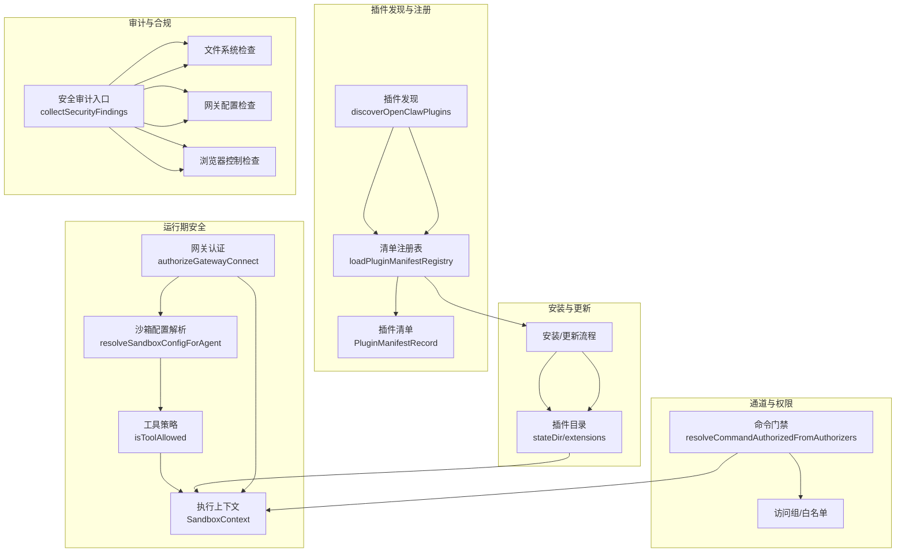
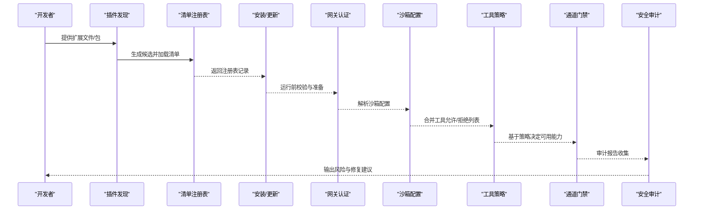
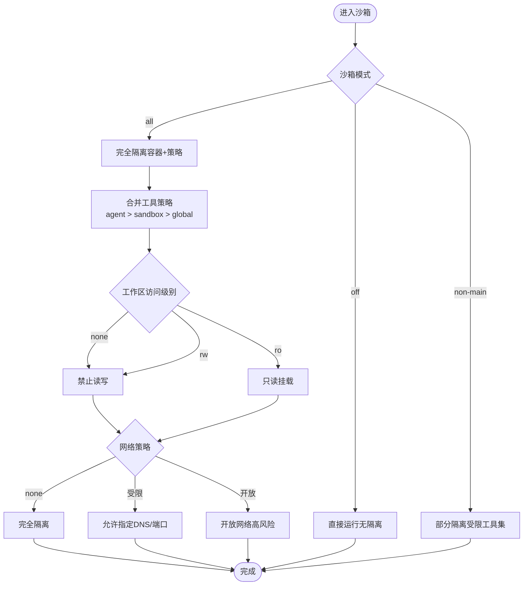
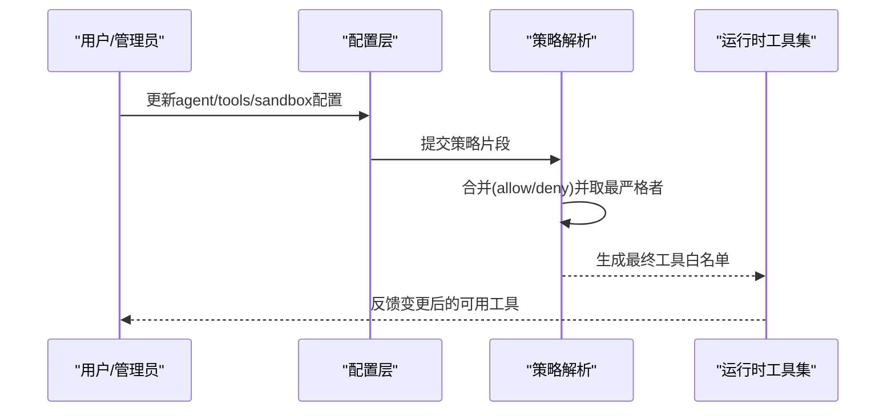
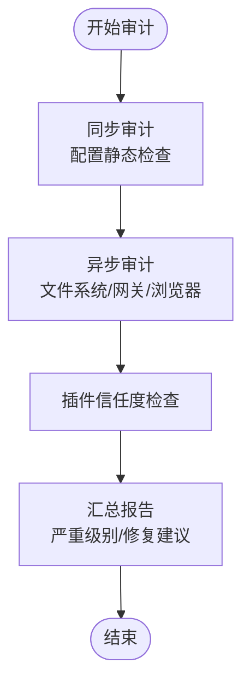
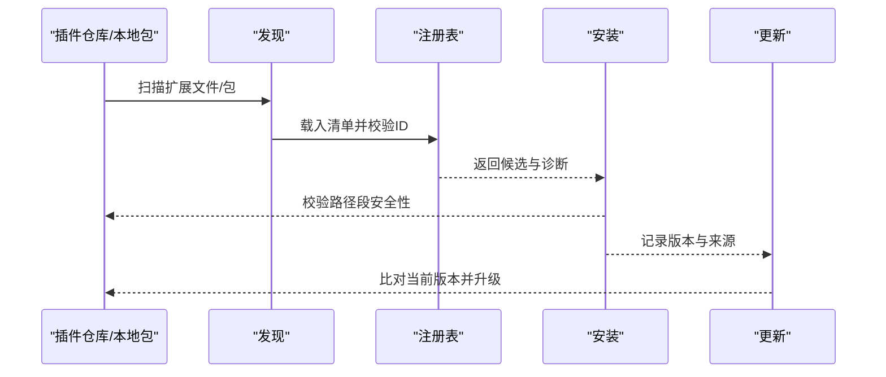
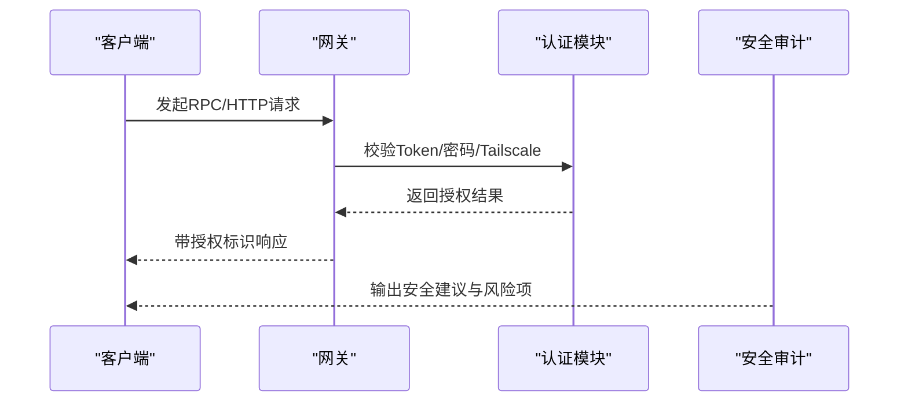

# 插件安全模型

<cite>
**本文引用的文件**
- [src/agents/sandbox/types.ts](file://src/agents/sandbox/types.ts)
- [src/agents/sandbox/config.ts](file://src/agents/sandbox/config.ts)
- [src/agents/sandbox/tool-policy.ts](file://src/agents/sandbox/tool-policy.ts)
- [src/agents/sandbox/create-args.ts](file://src/agents/sandbox/create-args.ts)
- [src/plugins/discovery.ts](file://src/plugins/discovery.ts)
- [src/plugins/manifest-registry.ts](file://src/plugins/manifest-registry.ts)
- [src/plugins/install.test.ts](file://src/plugins/install.test.ts)
- [src/plugins/update.ts](file://src/plugins/update.ts)
- [src/gateway/auth.ts](file://src/gateway/auth.ts)
- [src/security/audit.ts](file://src/security/audit.ts)
- [src/security/audit-extra.async.ts](file://src/security/audit-extra.async.ts)
- [src/security/audit-extra.sync.ts](file://src/security/audit-extra.sync.ts)
- [src/channels/command-gating.test.ts](file://src/channels/command-gating.test.ts)
- [docs/refactor/plugin-sdk.md](file://docs/refactor/plugin-sdk.md)
- [docs/zh-CN/refactor/plugin-sdk.md](file://docs/zh-CN/refactor/plugin-sdk.md)
</cite>

## 目录

1. [引言](#引言)
2. [项目结构](#项目结构)
3. [核心组件](#核心组件)
4. [架构总览](#架构总览)
5. [详细组件分析](#详细组件分析)
6. [依赖关系分析](#依赖关系分析)
7. [性能考量](#性能考量)
8. [故障排查指南](#故障排查指南)
9. [结论](#结论)
10. [附录：安全配置与威胁模型](#附录安全配置与威胁模型)

## 引言

本文件面向OpenClaw插件系统的安全工程实践，围绕“插件沙箱机制、权限系统、代码审计、依赖验证、服务接口安全”五大主题，结合仓库中的实现与文档，给出可操作的技术说明与最佳实践。目标是帮助开发者在不牺牲功能性的前提下，构建更稳健、可审计、可演进的插件安全体系。

## 项目结构

OpenClaw将插件安全贯穿于“发现—注册—安装—运行—审计”的全生命周期，并通过网关认证、通道命令门禁、沙箱工具策略等模块形成纵深防御。

图示来源

- [src/plugins/discovery.ts](file://src/plugins/discovery.ts#L301-L365)
- [src/plugins/manifest-registry.ts](file://src/plugins/manifest-registry.ts#L109-L200)
- [src/gateway/auth.ts](file://src/gateway/auth.ts#L217-L271)
- [src/agents/sandbox/config.ts](file://src/agents/sandbox/config.ts#L126-L144)
- [src/agents/sandbox/tool-policy.ts](file://src/agents/sandbox/tool-policy.ts#L58-L69)
- [src/channels/command-gating.test.ts](file://src/channels/command-gating.test.ts#L1-L97)
- [src/security/audit.ts](file://src/security/audit.ts#L259-L387)

章节来源

- [src/plugins/discovery.ts](file://src/plugins/discovery.ts#L1-L365)
- [src/plugins/manifest-registry.ts](file://src/plugins/manifest-registry.ts#L1-L201)
- [src/gateway/auth.ts](file://src/gateway/auth.ts#L1-L271)
- [src/agents/sandbox/config.ts](file://src/agents/sandbox/config.ts#L126-L144)
- [src/agents/sandbox/tool-policy.ts](file://src/agents/sandbox/tool-policy.ts#L58-L69)
- [src/channels/command-gating.test.ts](file://src/channels/command-gating.test.ts#L1-L97)
- [src/security/audit.ts](file://src/security/audit.ts#L1-L1032)

## 核心组件

- 沙箱与工具策略：定义沙箱模式、作用域、工作区访问级别、Docker参数与Seccomp/AppArmor加固；工具允许/拒绝列表按“最严格优先”合并。
- 插件发现与注册：从多源路径扫描扩展文件，解析package.json中的扩展声明，生成候选并构建清单注册表，支持缓存与重复ID检测。
- 网关认证：支持Token/密码/Tailscale设备身份认证，区分本地直连与代理场景，严格校验客户端IP与头信息。
- 通道命令门禁：基于访问组与授权器，对控制命令进行细粒度放行判定，支持“关闭/宽松/严格”三种模式。
- 安全审计：覆盖文件系统权限、网关暴露面、浏览器控制、日志脱敏、提升执行白名单、通道安全策略等维度。

章节来源

- [src/agents/sandbox/types.ts](file://src/agents/sandbox/types.ts#L51-L86)
- [src/agents/sandbox/tool-policy.ts](file://src/agents/sandbox/tool-policy.ts#L58-L69)
- [src/plugins/discovery.ts](file://src/plugins/discovery.ts#L115-L200)
- [src/plugins/manifest-registry.ts](file://src/plugins/manifest-registry.ts#L143-L200)
- [src/gateway/auth.ts](file://src/gateway/auth.ts#L178-L271)
- [src/channels/command-gating.test.ts](file://src/channels/command-gating.test.ts#L1-L97)
- [src/security/audit.ts](file://src/security/audit.ts#L259-L387)

## 架构总览

下图展示插件安全的关键交互链路：从插件发现到运行期沙箱，再到网关认证与通道门禁，最后由安全审计汇总风险。

图示来源

- [src/plugins/discovery.ts](file://src/plugins/discovery.ts#L301-L365)
- [src/plugins/manifest-registry.ts](file://src/plugins/manifest-registry.ts#L109-L200)
- [src/gateway/auth.ts](file://src/gateway/auth.ts#L217-L271)
- [src/agents/sandbox/config.ts](file://src/agents/sandbox/config.ts#L126-L144)
- [src/agents/sandbox/tool-policy.ts](file://src/agents/sandbox/tool-policy.ts#L58-L69)
- [src/channels/command-gating.test.ts](file://src/channels/command-gating.test.ts#L1-L97)
- [src/security/audit.ts](file://src/security/audit.ts#L962-L978)

## 详细组件分析

### 组件A：插件沙箱机制

- 进程隔离与容器加固
  - 使用只读根文件系统、tmpfs、无网络、降权(capDrop)、资源限制(CPU/内存/PIDs/ulimit)、Seccomp/AppArmor等。
  - 支持浏览器沙箱上下文（CDP/VNC/noVNC），并可选择是否允许宿主机控制。
- 文件系统访问控制
  - 工作区访问级别：none/ro/rw；默认仅在需要时开启读写。
  - 通过工具策略对具体工具进行允许/拒绝，遵循“agent策略优先、沙箱策略次之、全局策略兜底”的合并规则。
- 网络通信限制
  - 默认禁用网络或仅允许受限DNS；可通过配置开放特定端口或上游代理。

图示来源

- [src/agents/sandbox/types.ts](file://src/agents/sandbox/types.ts#L51-L86)
- [src/agents/sandbox/config.ts](file://src/agents/sandbox/config.ts#L126-L144)
- [src/agents/sandbox/tool-policy.ts](file://src/agents/sandbox/tool-policy.ts#L58-L69)

章节来源

- [src/agents/sandbox/types.ts](file://src/agents/sandbox/types.ts#L51-L86)
- [src/agents/sandbox/config.ts](file://src/agents/sandbox/config.ts#L126-L144)
- [src/agents/sandbox/tool-policy.ts](file://src/agents/sandbox/tool-policy.ts#L58-L69)

### 组件B：插件权限系统（最小权限、动态申请、撤销）

- 最小权限原则
  - 默认拒绝所有工具，除非显式允许；工作区默认none，网络默认none。
- 动态权限申请
  - 通过“agent级策略优先”的合并逻辑，允许在会话/代理粒度临时放宽工具集。
- 权限撤销机制
  - 通过更新配置或重置沙箱策略，使后续调用回到更严格的基线。

图示来源

- [src/agents/sandbox/tool-policy.ts](file://src/agents/sandbox/tool-policy.ts#L58-L69)
- [src/agents/sandbox/config.ts](file://src/agents/sandbox/config.ts#L126-L144)

章节来源

- [src/agents/sandbox/tool-policy.ts](file://src/agents/sandbox/tool-policy.ts#L58-L69)
- [src/agents/sandbox/config.ts](file://src/agents/sandbox/config.ts#L126-L144)

### 组件C：插件代码审计流程（静态分析、运行时监控、异常行为）

- 静态分析与同步审计
  - 基于配置的静态检查（如小模型风险、钩子加固、暴露矩阵等）。
- 运行时监控与异步审计
  - 文件系统权限检查、网关暴露面检查、浏览器控制检查、插件信任度检查等。
- 代码安全细节格式化
  - 将扫描结果映射为可读路径与规则ID，便于定位修复。

图示来源

- [src/security/audit.ts](file://src/security/audit.ts#L259-L387)
- [src/security/audit-extra.async.ts](file://src/security/audit-extra.async.ts#L185-L221)
- [src/security/audit-extra.sync.ts](file://src/security/audit-extra.sync.ts#L1-L31)

章节来源

- [src/security/audit.ts](file://src/security/audit.ts#L1-L1032)
- [src/security/audit-extra.async.ts](file://src/security/audit-extra.async.ts#L1-L200)
- [src/security/audit-extra.sync.ts](file://src/security/audit-extra.sync.ts#L1-L31)

### 组件D：插件依赖验证（完整性、版本兼容、循环依赖）

- 清单与注册表
  - 加载插件清单，校验ID一致性与重复ID警告；记录来源与schema缓存键。
- 安装与更新
  - 安装流程中进行路径段安全检查（例如拒绝包含保留路径段的包名），避免路径遍历风险；更新流程记录版本与来源。
- 版本兼容性
  - 通过读取package.json中的version字段与安装目录状态，确保版本一致性与可回溯。

图示来源

- [src/plugins/discovery.ts](file://src/plugins/discovery.ts#L115-L200)
- [src/plugins/manifest-registry.ts](file://src/plugins/manifest-registry.ts#L143-L200)
- [src/plugins/install.test.ts](file://src/plugins/install.test.ts#L275-L309)
- [src/plugins/update.ts](file://src/plugins/update.ts#L254-L287)

章节来源

- [src/plugins/manifest-registry.ts](file://src/plugins/manifest-registry.ts#L143-L200)
- [src/plugins/install.test.ts](file://src/plugins/install.test.ts#L275-L309)
- [src/plugins/update.ts](file://src/plugins/update.ts#L254-L287)

### 组件E：插件服务接口安全（RPC调用验证、序列化安全、跨域控制）

- RPC调用验证
  - 网关认证支持Token/密码/Tailscale设备身份，严格校验请求来源与头信息，区分本地直连与代理转发。
- 数据序列化安全
  - 审计报告中包含对敏感信息脱敏的建议，避免日志泄露。
- 跨域访问控制
  - 通道安全检查关注DM策略、分组策略与访问组设置，防止越权调用。

图示来源

- [src/gateway/auth.ts](file://src/gateway/auth.ts#L217-L271)
- [src/security/audit.ts](file://src/security/audit.ts#L452-L466)
- [src/channels/command-gating.test.ts](file://src/channels/command-gating.test.ts#L1-L97)

章节来源

- [src/gateway/auth.ts](file://src/gateway/auth.ts#L178-L271)
- [src/security/audit.ts](file://src/security/audit.ts#L452-L466)
- [src/channels/command-gating.test.ts](file://src/channels/command-gating.test.ts#L1-L97)

## 依赖关系分析

- 组件耦合
  - 沙箱配置依赖工具策略解析；工具策略又受agent与全局配置影响，体现“策略自上而下、以最严格为准”的设计。
  - 插件发现与注册为安装/更新提供输入，安装/更新结果影响运行期沙箱与工具可用性。
  - 网关认证为运行期RPC提供统一入口，通道门禁在应用层进一步细化权限。
- 外部依赖与集成点
  - Docker容器运行时（镜像、网络、安全配置）、Tailscale设备身份、浏览器控制协议（CDP）等。

图示来源

- [src/plugins/discovery.ts](file://src/plugins/discovery.ts#L301-L365)
- [src/plugins/manifest-registry.ts](file://src/plugins/manifest-registry.ts#L109-L200)
- [src/plugins/update.ts](file://src/plugins/update.ts#L254-L287)
- [src/agents/sandbox/config.ts](file://src/agents/sandbox/config.ts#L126-L144)
- [src/agents/sandbox/tool-policy.ts](file://src/agents/sandbox/tool-policy.ts#L58-L69)
- [src/gateway/auth.ts](file://src/gateway/auth.ts#L217-L271)
- [src/channels/command-gating.test.ts](file://src/channels/command-gating.test.ts#L1-L97)
- [src/security/audit.ts](file://src/security/audit.ts#L962-L978)

章节来源

- [src/plugins/discovery.ts](file://src/plugins/discovery.ts#L301-L365)
- [src/plugins/manifest-registry.ts](file://src/plugins/manifest-registry.ts#L109-L200)
- [src/plugins/update.ts](file://src/plugins/update.ts#L254-L287)
- [src/agents/sandbox/config.ts](file://src/agents/sandbox/config.ts#L126-L144)
- [src/agents/sandbox/tool-policy.ts](file://src/agents/sandbox/tool-policy.ts#L58-L69)
- [src/gateway/auth.ts](file://src/gateway/auth.ts#L217-L271)
- [src/channels/command-gating.test.ts](file://src/channels/command-gating.test.ts#L1-L97)
- [src/security/audit.ts](file://src/security/audit.ts#L962-L978)

## 性能考量

- 沙箱启动成本
  - 通过合理的资源限制与Seccomp/AppArmor配置，在保证安全的同时尽量降低容器启动与运行时开销。
- 审计扫描
  - 对大目录递归include的深度限制与缓存策略，减少I/O压力；对插件清单注册表启用短 TTL 缓存，平衡新鲜度与性能。
- 网关认证
  - 在代理场景下正确配置可信代理列表，避免重复解析客户端IP带来的额外开销。

## 故障排查指南

- 网关暴露面问题
  - 若出现“绑定非回环且未配置认证”或“Tailscale公开暴露”，应立即设置强Token或切换到Serve/Funnel模式并加强鉴权。
- 浏览器控制未认证
  - 启用浏览器控制需同时配置网关认证，否则任何本地进程均可调用。
- 通道命令不受控
  - 检查commands.useAccessGroups与各通道的allowFrom/分组策略，必要时启用“严格”模式并配置访问组。
- 插件安装失败
  - 若提示“保留路径段”，请修正包名或安装路径，避免路径遍历风险。
- 日志泄露
  - 设置日志脱敏级别为“tools”以上，避免敏感信息落入日志。

章节来源

- [src/security/audit.ts](file://src/security/audit.ts#L259-L387)
- [src/gateway/auth.ts](file://src/gateway/auth.ts#L217-L271)
- [src/channels/command-gating.test.ts](file://src/channels/command-gating.test.ts#L1-L97)
- [src/plugins/install.test.ts](file://src/plugins/install.test.ts#L275-L309)

## 结论

OpenClaw的插件安全模型以“最小权限+容器隔离+严格认证+通道门禁+持续审计”为核心，既满足灵活扩展的需求，又能在生产环境中保持可控的风险边界。建议在部署时遵循本文的安全配置与威胁模型建议，并将安全审计纳入CI/CD流程，持续优化策略与基线。

## 附录：安全配置与威胁模型

### 安全配置要点

- 沙箱
  - 默认关闭网络与读写工作区；仅在确需时开启tmpfs与受限DNS；启用Seccomp/AppArmor。
- 网关
  - 优先使用Token认证；避免将网关暴露至公网；若使用Tailscale Funnel，必须配合强认证与设备身份校验。
- 通道
  - 关闭“开放DM/群组策略”；启用访问组与明确的allowFrom；对多用户DM启用按发送者隔离。
- 日志
  - 开启敏感信息脱敏；避免在日志中输出密钥与令牌。

章节来源

- [src/agents/sandbox/types.ts](file://src/agents/sandbox/types.ts#L51-L86)
- [src/gateway/auth.ts](file://src/gateway/auth.ts#L178-L271)
- [src/security/audit.ts](file://src/security/audit.ts#L452-L466)
- [src/channels/command-gating.test.ts](file://src/channels/command-gating.test.ts#L1-L97)

### 威胁模型分析

- 内部威胁
  - 通过通道命令门禁与访问组限制，降低内部误操作与越权风险。
- 外部威胁
  - 通过网关认证与暴露面控制，阻断外部未授权访问；对浏览器控制接口同样施加认证。
- 供应链威胁
  - 通过插件清单校验、重复ID告警与安装路径段安全检查，降低恶意插件注入风险。
- 配置漂移
  - 通过安全审计定期巡检文件系统权限、网关暴露面与通道策略，及时发现并纠正配置偏差。

章节来源

- [src/plugins/manifest-registry.ts](file://src/plugins/manifest-registry.ts#L143-L200)
- [src/plugins/install.test.ts](file://src/plugins/install.test.ts#L275-L309)
- [src/security/audit.ts](file://src/security/audit.ts#L259-L387)
