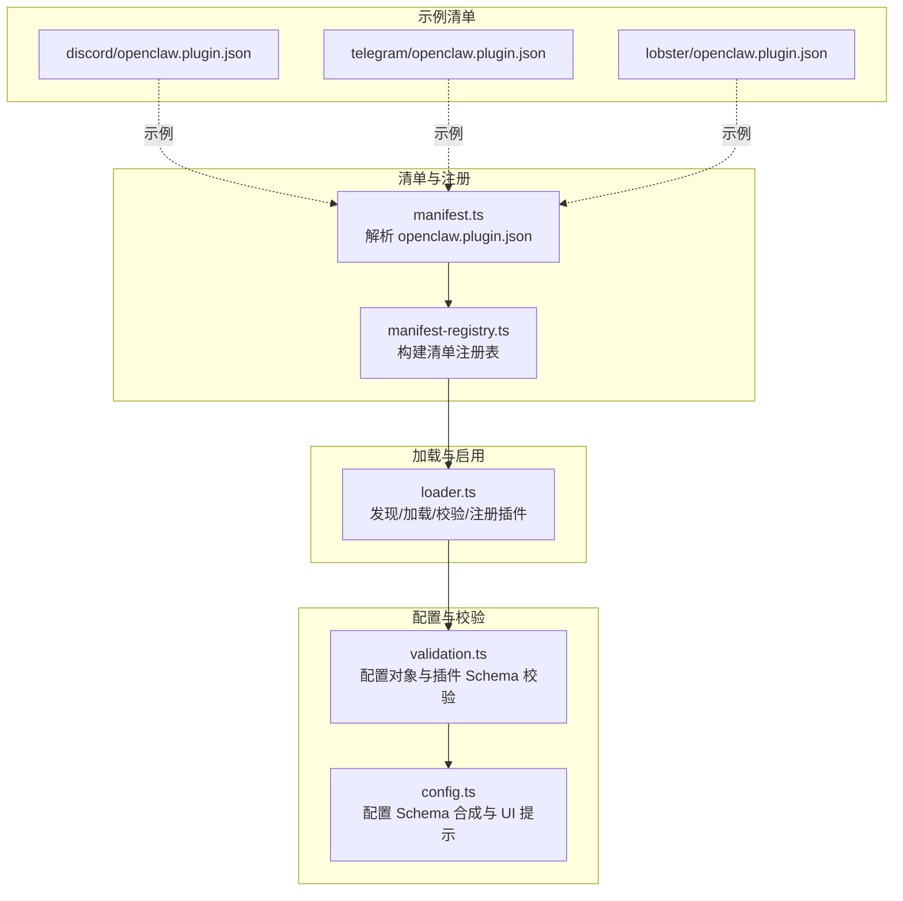
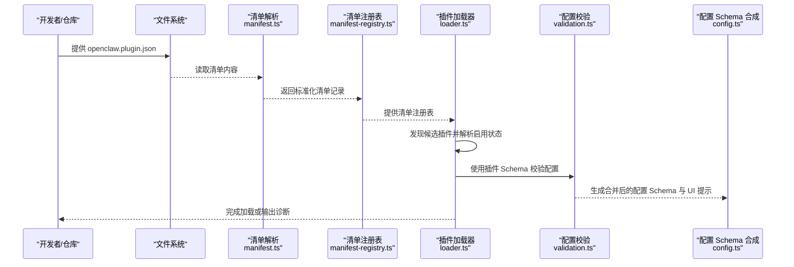
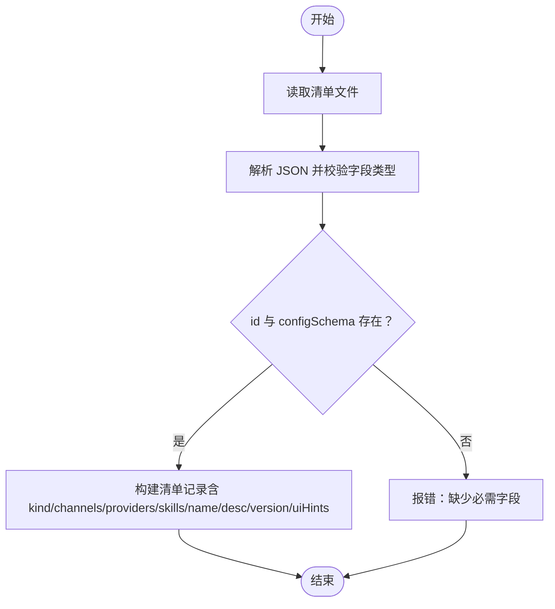
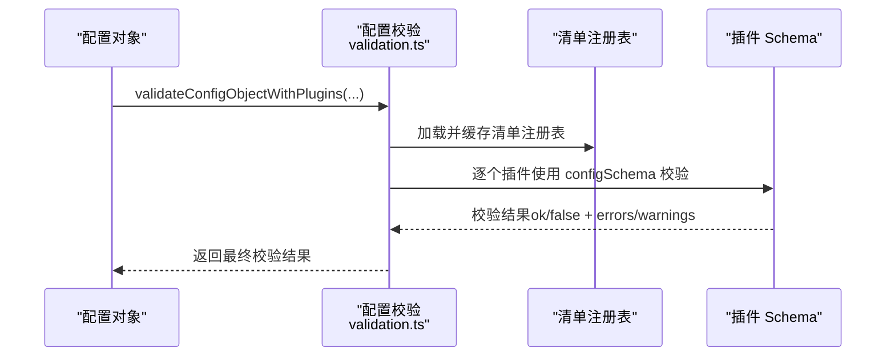
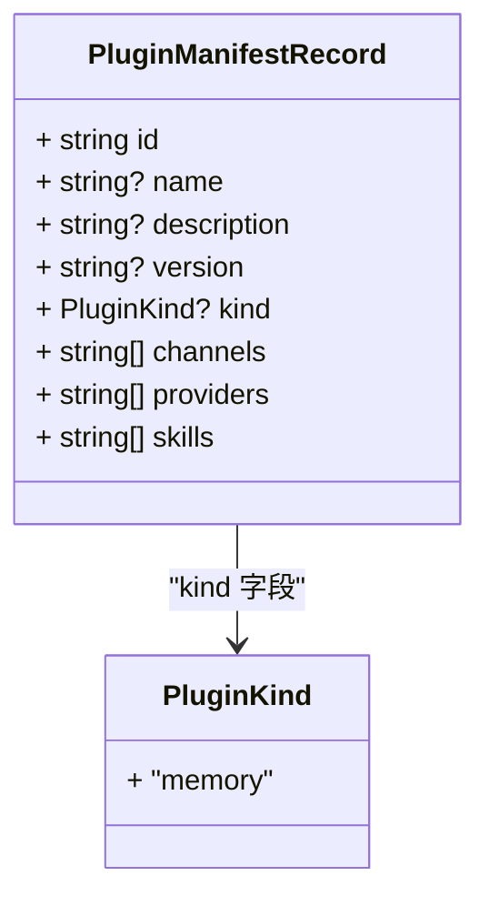
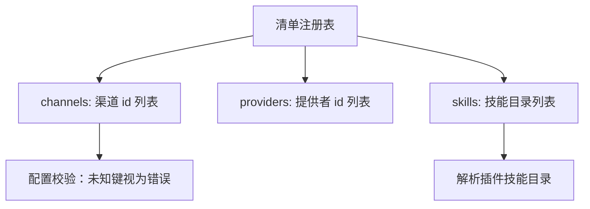
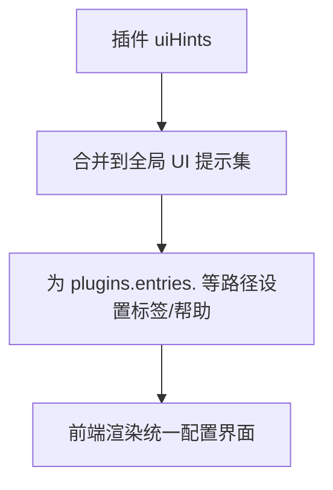
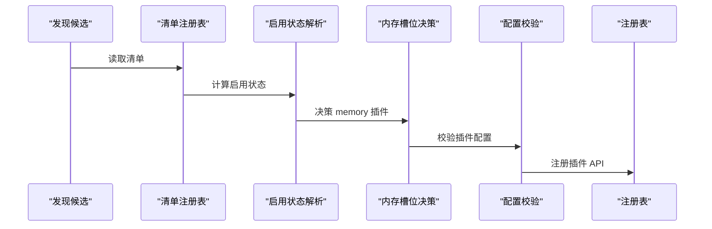
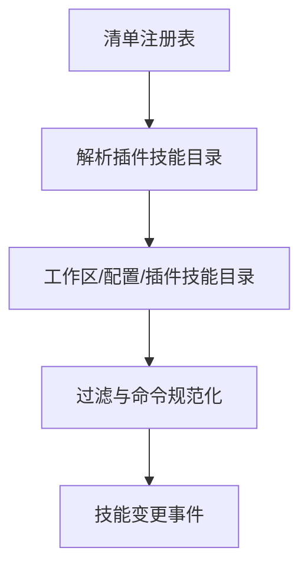

# 插件清单与配置

<cite>
**本文档引用的文件**
- [docs/plugins/manifest.md](file://docs/plugins/manifest.md)
- [src/plugins/manifest.ts](file://src/plugins/manifest.ts)
- [src/plugins/manifest-registry.ts](file://src/plugins/manifest-registry.ts)
- [src/plugins/loader.ts](file://src/plugins/loader.ts)
- [src/config/validation.ts](file://src/config/validation.ts)
- [src/config/schema.ts](file://src/config/schema.ts)
- [src/gateway/protocol/schema/config.ts](file://src/gateway/protocol/schema/config.ts)
- [extensions/discord/openclaw.plugin.json](file://extensions/discord/openclaw.plugin.json)
- [extensions/telegram/openclaw.plugin.json](file://extensions/telegram/openclaw.plugin.json)
- [extensions/lobster/openclaw.plugin.json](file://extensions/lobster/openclaw.plugin.json)
- [src/plugins/types.ts](file://src/plugins/types.ts)
- [src/agents/skills/plugin-skills.ts](file://src/agents/skills/plugin-skills.ts)
- [src/agents/skills/workspace.ts](file://src/agents/skills/workspace.ts)
- [src/agents/skills/refresh.ts](file://src/agents/skills/refresh.ts)
- [src/config/config.plugin-validation.test.ts](file://src/config/config.plugin-validation.test.ts)
</cite>

## 目录

1. [简介](#简介)
2. [项目结构](#项目结构)
3. [核心组件](#核心组件)
4. [架构总览](#架构总览)
5. [详细组件分析](#详细组件分析)
6. [依赖关系分析](#依赖关系分析)
7. [性能考量](#性能考量)
8. [故障排查指南](#故障排查指南)
9. [结论](#结论)
10. [附录](#附录)

## 简介

本文件面向插件开发者与运维人员，系统性阐述 OpenClaw 插件清单与配置体系：包括 openclaw.plugin.json 清单文件的结构与字段语义、插件配置模式（JSON Schema）的设计与校验、插件类型分类（kind）、依赖声明（channels/providers/skills）的解析机制、以及配置 UI 提示系统（uiHints）的工作方式。同时给出清单示例与最佳实践，帮助你快速构建可验证、可维护、可配置的插件。

## 项目结构

围绕“清单 + 配置 + 校验 + 加载”的主干流程，相关代码分布在以下模块：

- 文档与规范：docs/plugins/manifest.md
- 清单解析与注册：src/plugins/manifest.ts、src/plugins/manifest-registry.ts
- 插件加载与启用策略：src/plugins/loader.ts
- 配置校验与诊断：src/config/validation.ts
- 配置 Schema 合成与 UI 提示：src/config/schema.ts、src/gateway/protocol/schema/config.ts
- 示例清单：extensions/\*/openclaw.plugin.json
- 技能目录与插件技能：src/agents/skills/plugin-skills.ts、src/agents/skills/workspace.ts、src/agents/skills/refresh.ts
- 测试用例：src/config/config.plugin-validation.test.ts

图表来源

- [src/plugins/manifest.ts](file://src/plugins/manifest.ts#L44-L100)
- [src/plugins/manifest-registry.ts](file://src/plugins/manifest-registry.ts#L109-L200)
- [src/plugins/loader.ts](file://src/plugins/loader.ts#L170-L457)
- [src/config/validation.ts](file://src/config/validation.ts#L176-L404)
- [src/config/schema.ts](file://src/config/schema.ts#L313-L335)
- [extensions/discord/openclaw.plugin.json](file://extensions/discord/openclaw.plugin.json#L1-L10)
- [extensions/telegram/openclaw.plugin.json](file://extensions/telegram/openclaw.plugin.json#L1-L10)
- [extensions/lobster/openclaw.plugin.json](file://extensions/lobster/openclaw.plugin.json#L1-L11)

章节来源

- [docs/plugins/manifest.md](file://docs/plugins/manifest.md#L1-L72)
- [src/plugins/manifest.ts](file://src/plugins/manifest.ts#L1-L152)
- [src/plugins/manifest-registry.ts](file://src/plugins/manifest-registry.ts#L1-L201)
- [src/plugins/loader.ts](file://src/plugins/loader.ts#L1-L457)
- [src/config/validation.ts](file://src/config/validation.ts#L176-L404)
- [src/config/schema.ts](file://src/config/schema.ts#L45-L335)
- [src/gateway/protocol/schema/config.ts](file://src/gateway/protocol/schema/config.ts#L48-L70)
- [extensions/discord/openclaw.plugin.json](file://extensions/discord/openclaw.plugin.json#L1-L10)
- [extensions/telegram/openclaw.plugin.json](file://extensions/telegram/openclaw.plugin.json#L1-L10)
- [extensions/lobster/openclaw.plugin.json](file://extensions/lobster/openclaw.plugin.json#L1-L11)

## 核心组件

- 插件清单（openclaw.plugin.json）
  - 必需字段：id、configSchema
  - 可选字段：kind、channels、providers、skills、name、description、uiHints、version
  - 清单用于在不执行插件代码的前提下完成配置校验与发现
- 插件配置模式（JSON Schema）
  - 每个插件必须提供 JSON Schema，即使为空也必须显式声明
  - Schema 在配置读写阶段校验，非运行时
- 插件类型分类（kind）
  - 当前实现支持的类型：memory
  - 其他类型预留，可通过扩展类型系统支持
- 依赖声明
  - channels：由插件注册的渠道 id 列表
  - providers：由插件注册的模型/服务提供者 id 列表
  - skills：相对插件根目录的技能目录列表
- 配置 UI 提示（uiHints）
  - 为字段提供标签、帮助文本、占位符、敏感标记、分组与排序等元信息
  - 通过配置 Schema 合成器合并到全局配置 UI 提示集中

章节来源

- [docs/plugins/manifest.md](file://docs/plugins/manifest.md#L18-L72)
- [src/plugins/manifest.ts](file://src/plugins/manifest.ts#L10-L21)
- [src/plugins/types.ts](file://src/plugins/types.ts#L37-L38)
- [src/config/schema.ts](file://src/config/schema.ts#L72-L131)
- [src/gateway/protocol/schema/config.ts](file://src/gateway/protocol/schema/config.ts#L48-L70)

## 架构总览

下图展示了从“清单解析”到“配置校验”再到“插件加载”的端到端流程。

图表来源

- [src/plugins/manifest.ts](file://src/plugins/manifest.ts#L44-L100)
- [src/plugins/manifest-registry.ts](file://src/plugins/manifest-registry.ts#L109-L200)
- [src/plugins/loader.ts](file://src/plugins/loader.ts#L170-L457)
- [src/config/validation.ts](file://src/config/validation.ts#L176-L404)
- [src/config/schema.ts](file://src/config/schema.ts#L313-L335)

## 详细组件分析

### 组件A：清单结构与字段语义

- 字段定义与约束
  - id：插件唯一标识，必填
  - configSchema：JSON Schema，必填（即使空也必须提供）
  - kind：插件类型，可选（如 memory）
  - channels/providers/skills：字符串数组，可选
  - name/description/version：字符串，可选
  - uiHints：对象，可选，用于 UI 提示
- 解析与校验
  - 清单文件名固定为 openclaw.plugin.json
  - 解析时对字段做类型检查与规范化（如 trim、去空）
  - 缺失 id 或 configSchema 将导致错误
- 示例
  - 频道类插件（如 discord、telegram）通常声明 channels
  - 工具类插件（如 lobster）可只声明 id 与空 schema

图表来源

- [src/plugins/manifest.ts](file://src/plugins/manifest.ts#L44-L100)

章节来源

- [docs/plugins/manifest.md](file://docs/plugins/manifest.md#L18-L72)
- [src/plugins/manifest.ts](file://src/plugins/manifest.ts#L10-L21)
- [extensions/discord/openclaw.plugin.json](file://extensions/discord/openclaw.plugin.json#L1-L10)
- [extensions/telegram/openclaw.plugin.json](file://extensions/telegram/openclaw.plugin.json#L1-L10)
- [extensions/lobster/openclaw.plugin.json](file://extensions/lobster/openclaw.plugin.json#L1-L11)

### 组件B：配置模式（Schema）设计与校验

- 设计原则
  - 每个插件必须提供 JSON Schema，即使不接收配置
  - Schema 在配置读写阶段校验，确保尽早暴露错误
  - 支持 uiHints 与 jsonSchema 两种形态（TypeBox/Zod 等）
- 校验流程
  - 读取配置对象后，先进行基础校验
  - 再基于插件清单中的 configSchema 对 plugins.entries.<id>.config 做逐项校验
  - 若插件被禁用但仍有配置，产生警告
- 诊断与错误
  - 未知的 channels.\* 键被视为错误（除非已在清单中声明）
  - plugins.entries.<id>、plugins.allow、plugins.deny、plugins.slots.\* 必须引用“可发现”的插件 id
  - 清单缺失或损坏会导致验证失败

图表来源

- [src/config/validation.ts](file://src/config/validation.ts#L176-L404)
- [src/plugins/manifest-registry.ts](file://src/plugins/manifest-registry.ts#L109-L200)

章节来源

- [docs/plugins/manifest.md](file://docs/plugins/manifest.md#L47-L72)
- [src/config/validation.ts](file://src/config/validation.ts#L176-L404)
- [src/config/config.plugin-validation.test.ts](file://src/config/config.plugin-validation.test.ts#L100-L137)

### 组件C：插件类型分类（kind）

- 类型定义
  - memory：当前实现支持的类型
- 使用场景
  - 通过内存槽位（slots.memory）选择特定类型的插件
  - 加载器会根据启用状态与内存槽决策决定是否启用某插件
- 扩展建议
  - 新增类型时，应在类型系统与加载逻辑中同步扩展

图表来源

- [src/plugins/types.ts](file://src/plugins/types.ts#L37-L38)
- [src/plugins/manifest-registry.ts](file://src/plugins/manifest-registry.ts#L9-L31)

章节来源

- [src/plugins/types.ts](file://src/plugins/types.ts#L37-L38)
- [src/plugins/loader.ts](file://src/plugins/loader.ts#L347-L365)

### 组件D：依赖声明（channels/providers/skills）

- channels
  - 清单中声明的频道 id 列表
  - 未知的 channels.\* 键在配置校验时被视为错误（除非该 id 已在清单中声明）
- providers
  - 清单中声明的提供者 id 列表
  - 用于与模型/服务提供者集成
- skills
  - 相对插件根目录的技能目录路径列表
  - 加载器会解析这些目录以发现插件提供的技能
- 解析机制
  - 清单注册表构建时读取 manifest 中的 channels/providers/skills
  - 加载器在启用决策与配置校验时使用这些信息

图表来源

- [src/plugins/manifest-registry.ts](file://src/plugins/manifest-registry.ts#L81-L107)
- [src/agents/skills/plugin-skills.ts](file://src/agents/skills/plugin-skills.ts#L14-L74)
- [docs/plugins/manifest.md](file://docs/plugins/manifest.md#L55-L58)

章节来源

- [docs/plugins/manifest.md](file://docs/plugins/manifest.md#L38-L41)
- [src/plugins/manifest-registry.ts](file://src/plugins/manifest-registry.ts#L81-L107)
- [src/agents/skills/plugin-skills.ts](file://src/agents/skills/plugin-skills.ts#L14-L74)

### 组件E：配置 UI 提示系统（uiHints）

- 数据结构
  - label/help/advanced/sensitive/placeholder/group/order/itemTemplate 等
- 合成过程
  - 从插件清单的 uiHints 合并到全局配置 UI 提示集中
  - 为 plugins.entries.<id>、plugins.entries.<id>.enabled、plugins.entries.<id>.config 等路径设置默认标签与帮助文本
- 协议层
  - 配置响应协议包含 schema 与 uiHints，便于前端渲染统一配置界面

图表来源

- [src/config/schema.ts](file://src/config/schema.ts#L91-L131)
- [src/gateway/protocol/schema/config.ts](file://src/gateway/protocol/schema/config.ts#L48-L70)
- [src/plugins/types.ts](file://src/plugins/types.ts#L29-L35)

章节来源

- [src/config/schema.ts](file://src/config/schema.ts#L72-L131)
- [src/gateway/protocol/schema/config.ts](file://src/gateway/protocol/schema/config.ts#L48-L70)
- [src/plugins/types.ts](file://src/plugins/types.ts#L29-L35)

### 组件F：插件加载与启用策略

- 发现与候选
  - 基于工作区与额外路径发现插件候选
  - 读取清单并构建清单注册表
- 启用状态
  - 根据配置与来源（bundled/global/workspace/config）解析启用状态
  - 处理重复 id 与覆盖情况
- 内存槽位
  - memory 类型插件受 slots.memory 影响，仅允许一个被选中
- 配置校验
  - 使用清单中的 configSchema 对插件配置进行校验
  - 校验失败则记录错误并停止加载
- 导出与注册
  - 要求插件导出 register/activate 函数
  - 注册成功后加入运行时注册表

图表来源

- [src/plugins/loader.ts](file://src/plugins/loader.ts#L170-L457)
- [src/plugins/manifest-registry.ts](file://src/plugins/manifest-registry.ts#L109-L200)

章节来源

- [src/plugins/loader.ts](file://src/plugins/loader.ts#L233-L457)

### 组件G：技能目录与插件技能

- 插件技能目录解析
  - 基于清单注册表与启用状态，解析插件声明的 skills 目录
  - 去重与存在性检查，避免重复与无效路径
- 技能命令与过滤
  - 技能命令名称规范化与查找
  - 支持按过滤器筛选技能集合
- 技能变更监听
  - 监听工作区、配置与插件技能目录变化，触发刷新

图表来源

- [src/agents/skills/plugin-skills.ts](file://src/agents/skills/plugin-skills.ts#L14-L74)
- [src/agents/skills/workspace.ts](file://src/agents/skills/workspace.ts#L46-L123)
- [src/agents/skills/refresh.ts](file://src/agents/skills/refresh.ts#L58-L80)

章节来源

- [src/agents/skills/plugin-skills.ts](file://src/agents/skills/plugin-skills.ts#L14-L74)
- [src/agents/skills/workspace.ts](file://src/agents/skills/workspace.ts#L46-L123)
- [src/agents/skills/refresh.ts](file://src/agents/skills/refresh.ts#L58-L80)

## 依赖关系分析

- 组件耦合
  - manifest.ts 与 manifest-registry.ts 强耦合，前者负责解析，后者负责构建注册表
  - loader.ts 依赖 manifest-registry.ts 的结果进行加载与启用决策
  - config/schema.ts 与 gateway 协议层共同驱动 UI 提示与 Schema 合成
- 外部依赖
  - 文件系统：读取 openclaw.plugin.json
  - JSON Schema 校验器：用于配置校验
  - 类型系统：TypeBox/Zod 等（通过类型定义体现）

图表来源

- [src/plugins/manifest.ts](file://src/plugins/manifest.ts#L44-L100)
- [src/plugins/manifest-registry.ts](file://src/plugins/manifest-registry.ts#L109-L200)
- [src/plugins/loader.ts](file://src/plugins/loader.ts#L170-L457)
- [src/config/validation.ts](file://src/config/validation.ts#L176-L404)
- [src/config/schema.ts](file://src/config/schema.ts#L313-L335)
- [src/gateway/protocol/schema/config.ts](file://src/gateway/protocol/schema/config.ts#L48-L70)

章节来源

- [src/plugins/manifest.ts](file://src/plugins/manifest.ts#L44-L100)
- [src/plugins/manifest-registry.ts](file://src/plugins/manifest-registry.ts#L109-L200)
- [src/plugins/loader.ts](file://src/plugins/loader.ts#L170-L457)
- [src/config/validation.ts](file://src/config/validation.ts#L176-L404)
- [src/config/schema.ts](file://src/config/schema.ts#L313-L335)
- [src/gateway/protocol/schema/config.ts](file://src/gateway/protocol/schema/config.ts#L48-L70)

## 性能考量

- 清单缓存
  - 清单注册表支持 TTL 缓存，默认缓存时间可配置，减少重复解析开销
- 插件加载缓存
  - 插件加载器支持基于工作区与配置的缓存键，避免重复加载
- 校验优化
  - 配置校验在读写阶段进行，尽早失败，降低运行期成本
- I/O 优化
  - 清单与插件文件访问采用最小化读取策略，仅在必要时解析

章节来源

- [src/plugins/manifest-registry.ts](file://src/plugins/manifest-registry.ts#L33-L58)
- [src/plugins/loader.ts](file://src/plugins/loader.ts#L77-L83)

## 故障排查指南

- 常见问题与定位
  - 清单缺失或格式错误：manifest.ts 会返回错误信息，定位到具体 manifestPath
  - 配置 Schema 缺失：loader.ts 会在缺少 configSchema 时记录错误并停止加载
  - 配置校验失败：validation.ts 会将错误映射到 plugins.entries.<id>.config 路径
  - 未知渠道键：docs/plugins/manifest.md 明确未知 channels.\* 键为错误
  - 插件禁用但仍有配置：会产生警告，提醒保留配置
- 调试建议
  - 使用 Doctor 输出的诊断信息定位问题
  - 检查清单字段是否齐全且符合类型
  - 确认 plugins.entries.<id>、plugins.allow、plugins.deny、plugins.slots.\* 是否引用可发现的插件 id
  - 如涉及原生模块，参考文档注意事项进行构建与允许列表配置

章节来源

- [src/plugins/manifest.ts](file://src/plugins/manifest.ts#L44-L100)
- [src/plugins/loader.ts](file://src/plugins/loader.ts#L283-L295)
- [src/config/validation.ts](file://src/config/validation.ts#L367-L397)
- [docs/plugins/manifest.md](file://docs/plugins/manifest.md#L53-L72)
- [src/config/config.plugin-validation.test.ts](file://src/config/config.plugin-validation.test.ts#L100-L137)

## 结论

OpenClaw 的插件清单与配置体系以“清单优先、Schema 驱动、UI 提示增强”为核心设计思想，通过严格的字段约束、清晰的类型分类与完善的依赖声明，实现了可验证、可维护、可扩展的插件生态。配合缓存与早期校验机制，既保证了开发体验，也兼顾了运行效率。建议在开发插件时严格遵循清单规范与 Schema 设计，充分利用 uiHints 提升配置界面的友好度，并在测试中覆盖典型配置场景与边界条件。

## 附录

### A. 清单字段一览与示例

- 字段清单
  - id（必填）、configSchema（必填）
  - kind（可选）、channels（可选）、providers（可选）、skills（可选）
  - name/description/version（可选）、uiHints（可选）
- 示例清单
  - 频道插件示例：discord、telegram
  - 工具插件示例：lobster

章节来源

- [docs/plugins/manifest.md](file://docs/plugins/manifest.md#L18-L72)
- [extensions/discord/openclaw.plugin.json](file://extensions/discord/openclaw.plugin.json#L1-L10)
- [extensions/telegram/openclaw.plugin.json](file://extensions/telegram/openclaw.plugin.json#L1-L10)
- [extensions/lobster/openclaw.plugin.json](file://extensions/lobster/openclaw.plugin.json#L1-L11)

### B. 最佳实践

- 清单编写
  - 每个插件必须提供 configSchema，即使为空也要显式声明
  - 使用 uiHints 为关键字段提供标签、帮助与占位符
  - channels/providers/skills 字段应与实际能力一致，避免冗余
- 配置管理
  - 在 plugins.entries.<id>.config 中提供最小可用配置
  - 对敏感字段标记 sensitive，避免泄露
  - 使用 plugins.allow/plugins.deny 控制插件启用范围
- 开发与调试
  - 保持清单与插件导出的一致性（id、kind）
  - 在测试环境中验证配置校验与加载流程
  - 关注 Doctor 输出的诊断信息，及时修复问题

章节来源

- [docs/plugins/manifest.md](file://docs/plugins/manifest.md#L47-L72)
- [src/plugins/loader.ts](file://src/plugins/loader.ts#L319-L340)
- [src/config/schema.ts](file://src/config/schema.ts#L91-L131)
