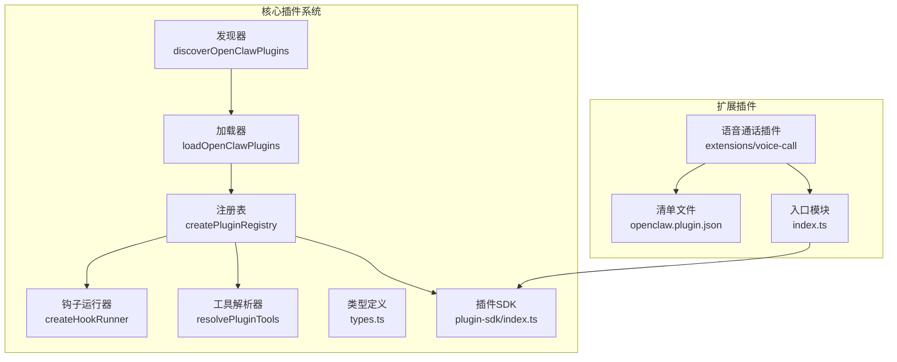
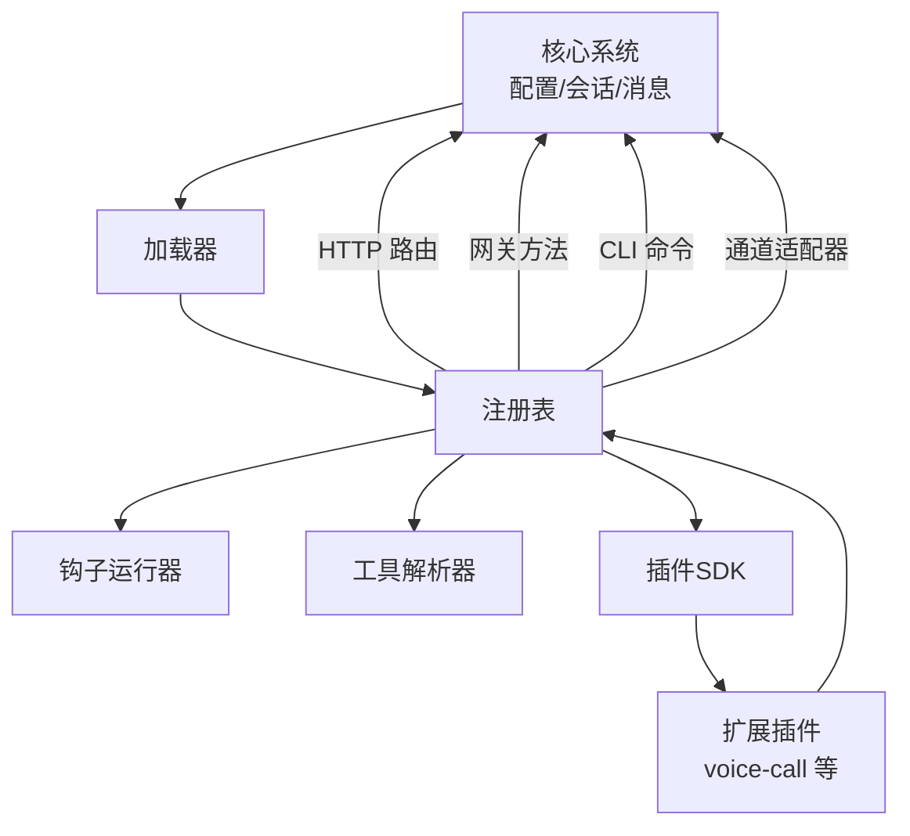
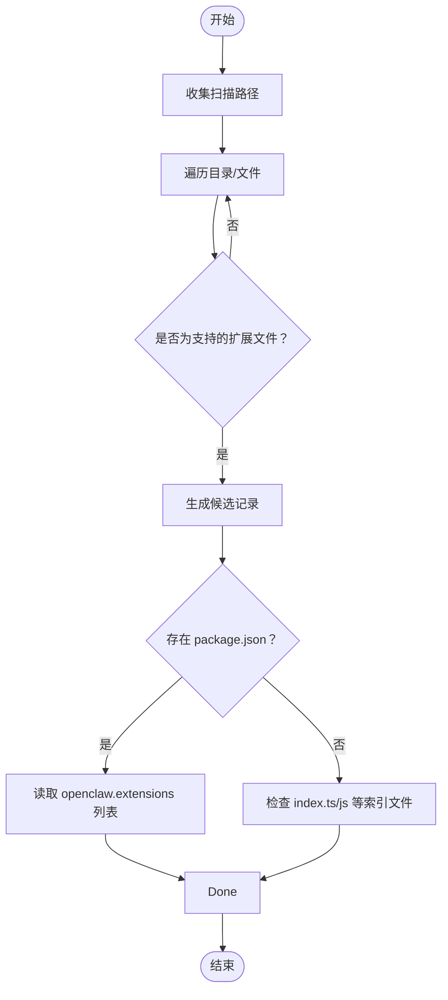
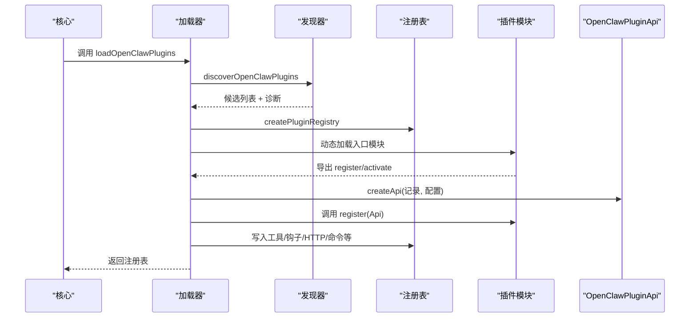
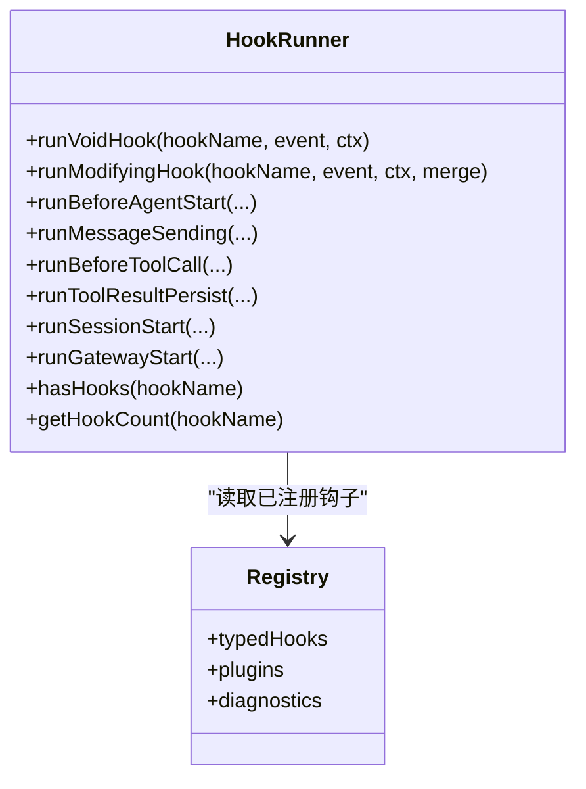
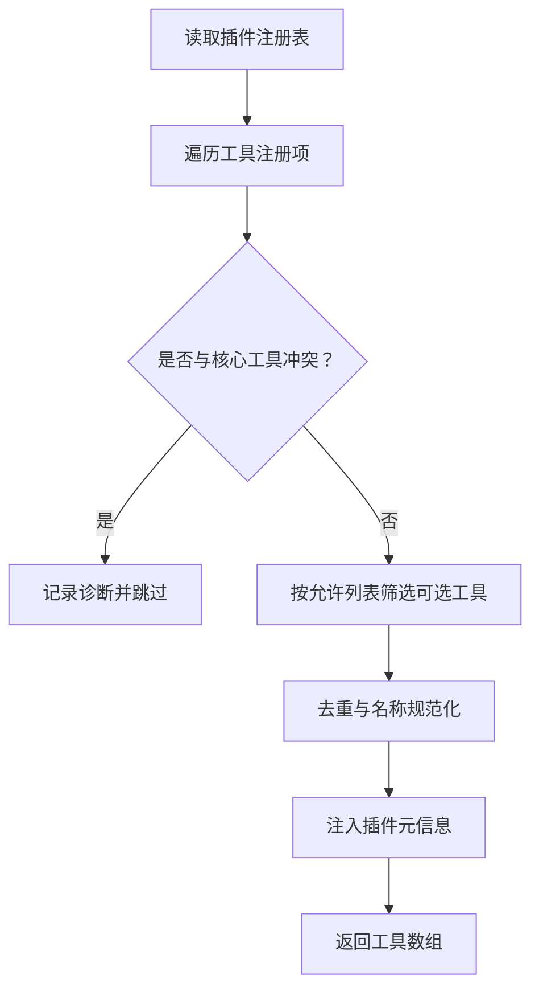
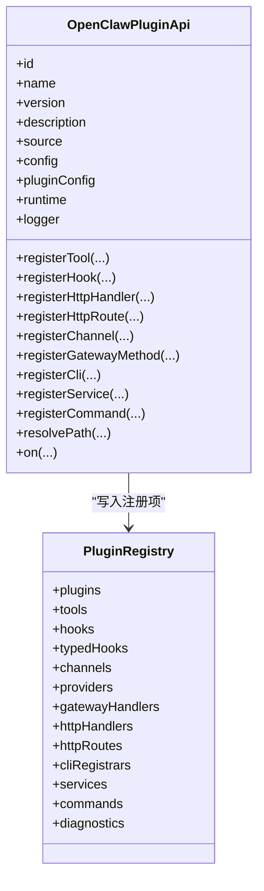
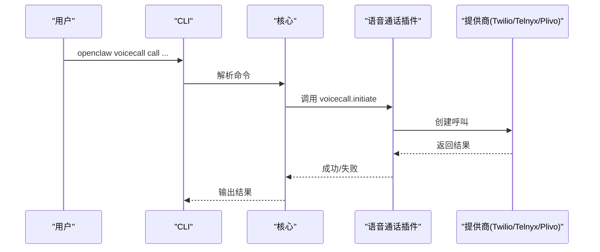
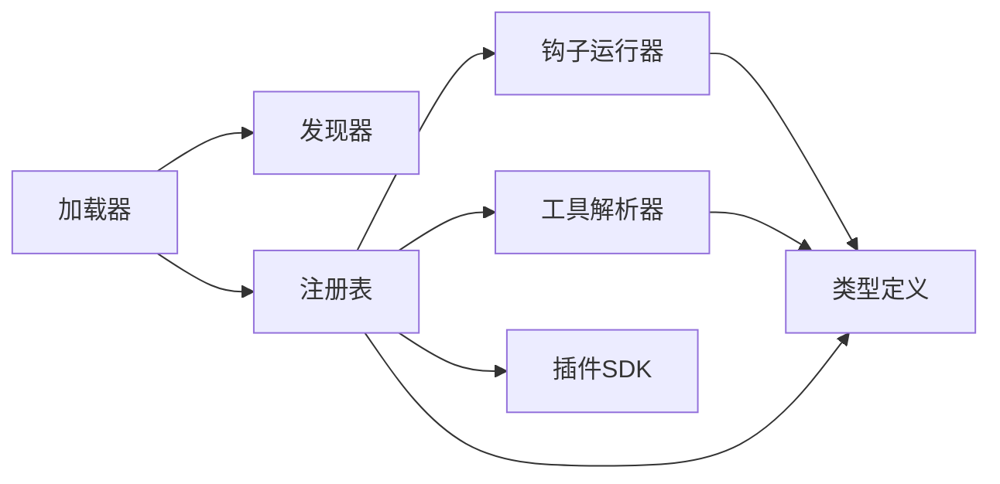

# 插件系统架构

<cite>
**本文档引用的文件**
- [src/plugins/loader.ts](file://src/plugins/loader.ts)
- [src/plugins/discovery.ts](file://src/plugins/discovery.ts)
- [src/plugins/manifest.ts](file://src/plugins/manifest.ts)
- [src/plugins/hooks.ts](file://src/plugins/hooks.ts)
- [src/plugins/tools.ts](file://src/plugins/tools.ts)
- [src/plugins/types.ts](file://src/plugins/types.ts)
- [src/plugins/registry.ts](file://src/plugins/registry.ts)
- [src/plugin-sdk/index.ts](file://src/plugin-sdk/index.ts)
- [docs/plugins/manifest.md](file://docs/plugins/manifest.md)
- [docs/plugins/agent-tools.md](file://docs/plugins/agent-tools.md)
- [docs/plugins/voice-call.md](file://docs/plugins/voice-call.md)
- [extensions/voice-call/openclaw.plugin.json](file://extensions/voice-call/openclaw.plugin.json)
- [extensions/voice-call/index.ts](file://extensions/voice-call/index.ts)
</cite>

## 目录

1. [简介](#简介)
2. [项目结构](#项目结构)
3. [核心组件](#核心组件)
4. [架构总览](#架构总览)
5. [详细组件分析](#详细组件分析)
6. [依赖关系分析](#依赖关系分析)
7. [性能考虑](#性能考虑)
8. [故障排除指南](#故障排除指南)
9. [结论](#结论)
10. [附录](#附录)

## 简介

本文件面向OpenClaw插件系统，提供从架构到实现细节的完整技术文档。内容涵盖插件发现机制、加载流程、生命周期管理；插件API设计（钩子系统、事件机制、工具注册）；配置管理、依赖解析与版本兼容；安全模型（沙箱、权限与资源限制）；以及与核心系统的集成方式。同时给出架构图、组件交互图、开发指南、最佳实践与故障排除方法。

## 项目结构

OpenClaw插件系统位于src/plugins目录，围绕“发现-加载-注册-运行”闭环构建，并通过插件SDK对外暴露统一API。扩展插件位于extensions目录，每个插件均包含openclaw.plugin.json清单与入口模块。

图表来源

- [src/plugins/loader.ts](file://src/plugins/loader.ts#L170-L456)
- [src/plugins/discovery.ts](file://src/plugins/discovery.ts#L301-L364)
- [src/plugins/registry.ts](file://src/plugins/registry.ts#L146-L515)
- [src/plugins/hooks.ts](file://src/plugins/hooks.ts#L93-L471)
- [src/plugins/tools.ts](file://src/plugins/tools.ts#L44-L138)
- [src/plugin-sdk/index.ts](file://src/plugin-sdk/index.ts#L1-L392)
- [extensions/voice-call/openclaw.plugin.json](file://extensions/voice-call/openclaw.plugin.json#L1-L560)
- [extensions/voice-call/index.ts](file://extensions/voice-call/index.ts#L143-L512)

章节来源

- [src/plugins/loader.ts](file://src/plugins/loader.ts#L170-L456)
- [src/plugins/discovery.ts](file://src/plugins/discovery.ts#L301-L364)
- [src/plugins/registry.ts](file://src/plugins/registry.ts#L146-L515)
- [src/plugin-sdk/index.ts](file://src/plugin-sdk/index.ts#L1-L392)

## 核心组件

- 发现器：扫描工作区、全局与捆绑目录，收集候选插件并生成清单记录。
- 加载器：基于发现结果与清单，动态加载插件模块，执行注册函数，建立注册表。
- 注册表：集中管理插件工具、钩子、通道、网关方法、HTTP路由、CLI命令、服务等。
- 钩子系统：提供生命周期钩子的有序执行与错误隔离，支持同步/异步策略。
- 工具解析器：在运行时按允许列表与冲突规则构建可用工具集合。
- 类型系统：统一定义插件API、钩子事件、工具上下文、命令与服务接口。
- 插件SDK：对外暴露registerTool/registerHook/registerGatewayMethod等能力。

章节来源

- [src/plugins/discovery.ts](file://src/plugins/discovery.ts#L1-L365)
- [src/plugins/loader.ts](file://src/plugins/loader.ts#L1-L457)
- [src/plugins/registry.ts](file://src/plugins/registry.ts#L1-L516)
- [src/plugins/hooks.ts](file://src/plugins/hooks.ts#L1-L471)
- [src/plugins/tools.ts](file://src/plugins/tools.ts#L1-L139)
- [src/plugins/types.ts](file://src/plugins/types.ts#L1-L538)
- [src/plugin-sdk/index.ts](file://src/plugin-sdk/index.ts#L1-L392)

## 架构总览

下图展示插件系统与核心组件的交互关系，以及插件与外部系统的对接点（HTTP、网关RPC、CLI、通道适配器）。

图表来源

- [src/plugins/loader.ts](file://src/plugins/loader.ts#L193-L456)
- [src/plugins/registry.ts](file://src/plugins/registry.ts#L146-L515)
- [src/plugins/hooks.ts](file://src/plugins/hooks.ts#L93-L471)
- [src/plugins/tools.ts](file://src/plugins/tools.ts#L44-L138)
- [src/plugin-sdk/index.ts](file://src/plugin-sdk/index.ts#L1-L392)
- [extensions/voice-call/index.ts](file://extensions/voice-call/index.ts#L143-L512)

## 详细组件分析

### 插件发现机制

- 扫描路径：配置指定路径、工作区扩展目录、全局扩展目录、捆绑扩展目录。
- 文件识别：支持多种扩展名，过滤.d.ts；支持package.json中openclaw.extensions声明。
- 候选生成：为每个候选插件生成rootDir、source、origin、包元数据等信息。
- 清单读取：读取openclaw.plugin.json，校验必需字段与结构。

图表来源

- [src/plugins/discovery.ts](file://src/plugins/discovery.ts#L115-L201)
- [src/plugins/discovery.ts](file://src/plugins/discovery.ts#L203-L299)
- [src/plugins/discovery.ts](file://src/plugins/discovery.ts#L301-L364)

章节来源

- [src/plugins/discovery.ts](file://src/plugins/discovery.ts#L1-L365)

### 插件清单与配置验证

- 必需字段：id、configSchema；可选字段：kind、channels、providers、skills、name、description、version、uiHints。
- JSON Schema：严格校验插件配置，不执行代码即可完成验证。
- UI提示：uiHints用于UI渲染标签、占位符、敏感字段标记等。
- 兼容性：manifest与导出定义的id/kind不一致将产生诊断警告。

章节来源

- [src/plugins/manifest.ts](file://src/plugins/manifest.ts#L10-L100)
- [docs/plugins/manifest.md](file://docs/plugins/manifest.md#L1-L72)
- [extensions/voice-call/openclaw.plugin.json](file://extensions/voice-call/openclaw.plugin.json#L1-L560)

### 插件加载流程

- 初始化：创建运行时、注册表、清理旧命令。
- 发现与清单：discoverOpenClawPlugins + loadPluginManifestRegistry。
- 模块加载：使用jiti动态加载插件入口，解析默认导出或命名导出。
- 注册阶段：调用插件导出的register/activate，传入OpenClawPluginApi。
- 配置校验：基于manifest.configSchema对插件配置进行严格校验。
- 生命周期：初始化全局钩子运行器，写入缓存。

图表来源

- [src/plugins/loader.ts](file://src/plugins/loader.ts#L170-L456)
- [src/plugins/discovery.ts](file://src/plugins/discovery.ts#L301-L364)
- [src/plugins/registry.ts](file://src/plugins/registry.ts#L468-L499)

章节来源

- [src/plugins/loader.ts](file://src/plugins/loader.ts#L1-L457)

### 钩子系统与事件机制

- 钩子类型：agent、message、tool、session、gateway等生命周期钩子。
- 运行策略：void钩子并行执行；修改型钩子顺序执行并合并结果；tool_result_persist同步串行。
- 错误处理：可选择捕获错误并记录，避免中断主流程。
- 优先级：支持钩子优先级排序，高优先级先执行。

图表来源

- [src/plugins/hooks.ts](file://src/plugins/hooks.ts#L93-L471)
- [src/plugins/registry.ts](file://src/plugins/registry.ts#L124-L138)

章节来源

- [src/plugins/hooks.ts](file://src/plugins/hooks.ts#L1-L471)
- [src/plugins/types.ts](file://src/plugins/types.ts#L298-L538)

### 工具注册与允许列表

- 工具工厂：插件通过registerTool注册工具或工厂函数。
- 允许列表：支持按工具名、插件id、组级别启用可选工具。
- 冲突检测：禁止插件id与核心工具名冲突；禁止同名工具冲突。
- 运行时构建：resolvePluginTools在运行时按配置与允许列表构建最终工具集。

图表来源

- [src/plugins/tools.ts](file://src/plugins/tools.ts#L44-L138)
- [src/plugins/registry.ts](file://src/plugins/registry.ts#L168-L193)

章节来源

- [src/plugins/tools.ts](file://src/plugins/tools.ts#L1-L139)
- [docs/plugins/agent-tools.md](file://docs/plugins/agent-tools.md#L1-L100)

### 插件API与注册表

- OpenClawPluginApi：提供registerTool、registerHook、registerHttpHandler、registerHttpRoute、registerChannel、registerGatewayMethod、registerCli、registerService、registerCommand、on等能力。
- 注册表：集中存储插件记录、工具、钩子、通道、提供方、网关方法、HTTP路由、CLI、服务、命令与诊断信息。
- 类型约束：严格的类型定义确保插件与核心系统的契约清晰。

图表来源

- [src/plugins/types.ts](file://src/plugins/types.ts#L244-L283)
- [src/plugins/registry.ts](file://src/plugins/registry.ts#L146-L515)

章节来源

- [src/plugins/types.ts](file://src/plugins/types.ts#L1-L538)
- [src/plugins/registry.ts](file://src/plugins/registry.ts#L1-L516)

### 插件与核心系统的集成

- HTTP路由：插件可注册HTTP处理器或REST风格路由，供外部访问。
- 网关RPC：插件可注册网关方法，核心网关层转发请求至插件处理器。
- CLI命令：插件可注册命令，参与全局命令解析与执行。
- 通道适配器：插件可注册ChannelPlugin，接入多渠道消息与认证。
- 提供方：插件可注册ProviderPlugin，提供认证与模型配置。

章节来源

- [src/plugins/registry.ts](file://src/plugins/registry.ts#L287-L443)
- [src/plugins/types.ts](file://src/plugins/types.ts#L127-L227)

### 语音通话插件示例

- 清单：openclaw.plugin.json包含id、configSchema、uiHints等。
- 注册：index.ts中导出插件定义，注册多个网关方法、工具、CLI与服务。
- 行为：根据配置选择提供商（Twilio/Telnyx/Plivo/Mock），提供外呼、续聊、播报、结束、状态查询等能力。

图表来源

- [extensions/voice-call/openclaw.plugin.json](file://extensions/voice-call/openclaw.plugin.json#L1-L560)
- [extensions/voice-call/index.ts](file://extensions/voice-call/index.ts#L192-L345)
- [docs/plugins/voice-call.md](file://docs/plugins/voice-call.md#L252-L285)

章节来源

- [extensions/voice-call/openclaw.plugin.json](file://extensions/voice-call/openclaw.plugin.json#L1-L560)
- [extensions/voice-call/index.ts](file://extensions/voice-call/index.ts#L143-L512)
- [docs/plugins/voice-call.md](file://docs/plugins/voice-call.md#L1-L285)

## 依赖关系分析

- 组件内聚：加载器聚合发现、清单、模块加载、注册与缓存；注册表集中管理所有注册项；钩子运行器独立于业务逻辑。
- 组件耦合：注册表与钩子运行器、工具解析器存在松耦合的只读依赖；插件SDK作为对外契约，被各插件实现依赖。
- 外部依赖：jiti用于动态模块加载；Node FS/Path用于文件系统操作；HTTP服务器用于路由与网关方法。

图表来源

- [src/plugins/loader.ts](file://src/plugins/loader.ts#L1-L457)
- [src/plugins/registry.ts](file://src/plugins/registry.ts#L1-L516)
- [src/plugins/hooks.ts](file://src/plugins/hooks.ts#L1-L471)
- [src/plugins/tools.ts](file://src/plugins/tools.ts#L1-L139)
- [src/plugins/types.ts](file://src/plugins/types.ts#L1-L538)
- [src/plugin-sdk/index.ts](file://src/plugin-sdk/index.ts#L1-L392)

章节来源

- [src/plugins/loader.ts](file://src/plugins/loader.ts#L1-L457)
- [src/plugins/registry.ts](file://src/plugins/registry.ts#L1-L516)

## 性能考虑

- 缓存：加载器支持基于工作区与插件配置的缓存键，避免重复加载。
- 并行执行：void型钩子采用并行Promise.all提升吞吐。
- 同步钩子：tool_result_persist为热路径，强制同步串行以保证一致性。
- 测试优化：测试环境默认禁用插件，减少单元测试与网关套件的启动开销。
- 资源限制：建议插件服务实现stop时释放资源，避免内存泄漏。

## 故障排除指南

- 清单缺失或无效：manifest不存在、缺少id或configSchema、JSON解析失败。检查openclaw.plugin.json格式与字段。
- 配置校验失败：configSchema校验错误，返回具体错误信息。核对plugins.entries.<id>.config。
- 模块加载失败：入口模块语法错误或依赖缺失。检查index.ts与依赖安装。
- 钩子异常：钩子抛错会被捕获或抛出取决于配置。查看日志定位具体插件与钩子名称。
- 工具冲突：插件id与核心工具名冲突，或同名工具冲突。修改插件id或工具名。
- 网关方法冲突：重复注册相同方法名。修改插件方法名或移除重复注册。
- HTTP路由冲突：重复注册相同路径。修改插件路由路径。

章节来源

- [src/plugins/loader.ts](file://src/plugins/loader.ts#L283-L440)
- [src/plugins/registry.ts](file://src/plugins/registry.ts#L265-L326)
- [src/plugins/tools.ts](file://src/plugins/tools.ts#L74-L135)

## 结论

OpenClaw插件系统通过严格的清单与配置Schema、完善的发现与加载流程、灵活的注册表与钩子机制，实现了高扩展性与强约束的平衡。插件SDK提供了统一的API，使第三方开发者能够以最小成本接入工具、通道、网关RPC与CLI。配合清晰的诊断与错误处理策略，系统在功能丰富的同时保持了良好的可观测性与可维护性。

## 附录

- 开发者指南
  - 创建openclaw.plugin.json，填写id与configSchema。
  - 在index.ts中导出插件定义，使用OpenClawPluginApi注册工具、钩子、HTTP、网关方法、CLI与服务。
  - 使用plugins.entries.<id>.config在核心配置中启用并设置参数。
  - 参考voice-call插件作为完整示例。
- 最佳实践
  - 将可选工具标记为optional，并通过允许列表启用。
  - 为钩子提供明确的优先级与错误处理策略。
  - 对外暴露的HTTP路由与网关方法应具备幂等与限流设计。
  - 在插件服务中实现优雅停止，释放资源。
- 安全建议
  - 严格校验输入参数，避免注入攻击。
  - 对外暴露的HTTP端点应启用签名验证与来源白名单。
  - 限制插件进程的文件系统与网络访问范围（结合运行环境）。

章节来源

- [docs/plugins/manifest.md](file://docs/plugins/manifest.md#L1-L72)
- [docs/plugins/agent-tools.md](file://docs/plugins/agent-tools.md#L1-L100)
- [docs/plugins/voice-call.md](file://docs/plugins/voice-call.md#L1-L285)
- [extensions/voice-call/index.ts](file://extensions/voice-call/index.ts#L143-L512)
