# 插件集成模式

<cite>
**本文引用的文件**
- [src/plugin-sdk/index.ts](file://src/plugin-sdk/index.ts)
- [src/plugins/types.ts](file://src/plugins/types.ts)
- [src/plugins/runtime/types.ts](file://src/plugins/runtime/types.ts)
- [src/plugins/registry.ts](file://src/plugins/registry.ts)
- [src/plugins/http-registry.ts](file://src/plugins/http-registry.ts)
- [src/plugins/config-schema.ts](file://src/plugins/config-schema.ts)
- [src/hooks/internal-hooks.ts](file://src/hooks/internal-hooks.ts)
- [src/gateway/server-methods/types.ts](file://src/gateway/server-methods/types.ts)
- [extensions/discord/index.ts](file://extensions/discord/index.ts)
</cite>

## 目录

1. [简介](#简介)
2. [项目结构](#项目结构)
3. [核心组件](#核心组件)
4. [架构总览](#架构总览)
5. [详细组件分析](#详细组件分析)
6. [依赖关系分析](#依赖关系分析)
7. [性能考量](#性能考量)
8. [故障排查指南](#故障排查指南)
9. [结论](#结论)
10. [附录](#附录)

## 简介

本文件面向OpenClaw插件生态，系统化阐述插件与核心系统的集成模式，覆盖以下主题：

- HTTP API集成：插件如何注册HTTP路由与处理器
- WebSocket通信：网关方法（RPC）与广播机制
- RPC调用：网关请求处理器与响应回调
- 插件钩子运行器：全局钩子处理、事件传播、异步处理
- 插件服务注册：生命周期服务、启动/停止、诊断
- 插件间通信：命令系统、内部钩子事件、工具与消息流
- 插件配置集成：配置模式、校验、热重载与回滚
- 集成测试与性能监控策略

## 项目结构

OpenClaw采用“核心+插件SDK+扩展插件”的分层组织：

- 核心能力位于src/下，包括插件系统、钩子系统、网关RPC类型、运行时能力等
- 插件SDK通过src/plugin-sdk/index.ts导出统一入口，供扩展插件使用
- 扩展插件位于extensions/目录，以独立包形式实现具体通道或功能

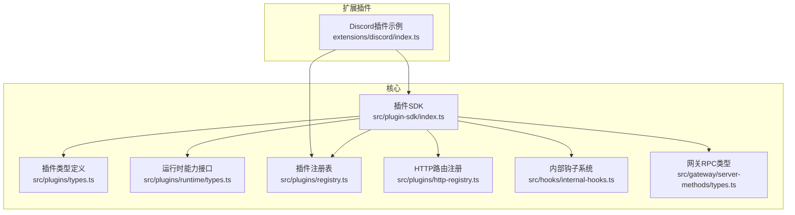

**图表来源**

- [src/plugin-sdk/index.ts](file://src/plugin-sdk/index.ts#L1-L392)
- [src/plugins/types.ts](file://src/plugins/types.ts#L1-L538)
- [src/plugins/runtime/types.ts](file://src/plugins/runtime/types.ts#L1-L363)
- [src/plugins/registry.ts](file://src/plugins/registry.ts#L1-L516)
- [src/plugins/http-registry.ts](file://src/plugins/http-registry.ts#L1-L53)
- [src/hooks/internal-hooks.ts](file://src/hooks/internal-hooks.ts#L1-L182)
- [src/gateway/server-methods/types.ts](file://src/gateway/server-methods/types.ts#L1-L120)
- [extensions/discord/index.ts](file://extensions/discord/index.ts#L1-L18)

**章节来源**

- [src/plugin-sdk/index.ts](file://src/plugin-sdk/index.ts#L1-L392)
- [extensions/discord/index.ts](file://extensions/discord/index.ts#L1-L18)

## 核心组件

- 插件SDK与类型：统一导出插件API、钩子类型、HTTP/网关/CLI/服务注册接口
- 插件注册表：集中管理插件记录、工具、钩子、通道、提供者、HTTP路由、CLI、服务、命令
- 内部钩子系统：事件驱动的内部钩子注册、触发与错误隔离
- 运行时能力：配置读写、媒体处理、TTS、工具工厂、通道适配器、日志与状态路径解析
- 网关RPC类型：定义客户端连接、响应回调、上下文与广播接口

**章节来源**

- [src/plugins/types.ts](file://src/plugins/types.ts#L244-L283)
- [src/plugins/registry.ts](file://src/plugins/registry.ts#L124-L138)
- [src/hooks/internal-hooks.ts](file://src/hooks/internal-hooks.ts#L46-L143)
- [src/plugins/runtime/types.ts](file://src/plugins/runtime/types.ts#L178-L362)
- [src/gateway/server-methods/types.ts](file://src/gateway/server-methods/types.ts#L15-L119)

## 架构总览

OpenClaw插件体系围绕“插件API → 注册表 → 内部钩子/HTTP/网关 → 运行时能力”展开，形成可扩展、可观测、可治理的插件生态。

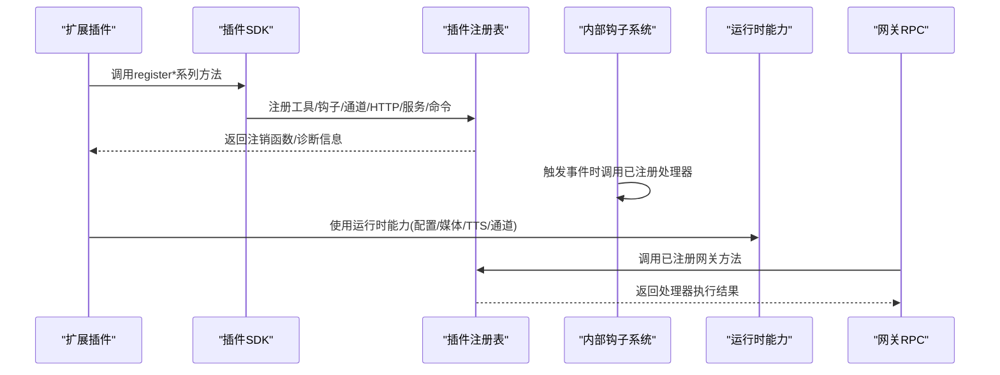

**图表来源**

- [src/plugins/registry.ts](file://src/plugins/registry.ts#L468-L499)
- [src/hooks/internal-hooks.ts](file://src/hooks/internal-hooks.ts#L123-L143)
- [src/plugins/runtime/types.ts](file://src/plugins/runtime/types.ts#L178-L362)
- [src/gateway/server-methods/types.ts](file://src/gateway/server-methods/types.ts#L117-L119)

## 详细组件分析

### 组件A：插件API与注册表

- 插件API提供统一入口，包括注册工具、钩子、HTTP处理器/路由、通道、网关方法、CLI、服务、命令与生命周期钩子
- 注册表负责去重、冲突检测、诊断收集与数据聚合，支持按插件维度统计计数与状态

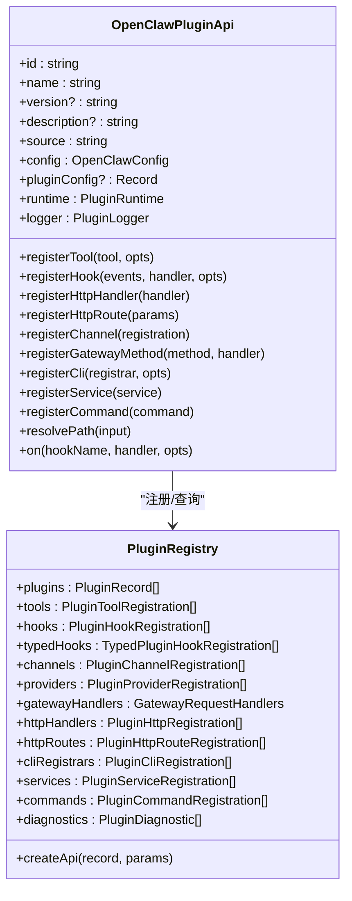

**图表来源**

- [src/plugins/types.ts](file://src/plugins/types.ts#L244-L283)
- [src/plugins/registry.ts](file://src/plugins/registry.ts#L124-L138)
- [src/plugins/registry.ts](file://src/plugins/registry.ts#L468-L499)

**章节来源**

- [src/plugins/types.ts](file://src/plugins/types.ts#L244-L283)
- [src/plugins/registry.ts](file://src/plugins/registry.ts#L146-L515)

### 组件B：HTTP API集成

- 插件可通过registerHttpHandler注册全局HTTP处理器，或通过registerHttpRoute注册路径化路由
- 路由注册包含规范化路径、重复检测与注销回调
- 支持为特定账户实例化路由（如多账号场景）

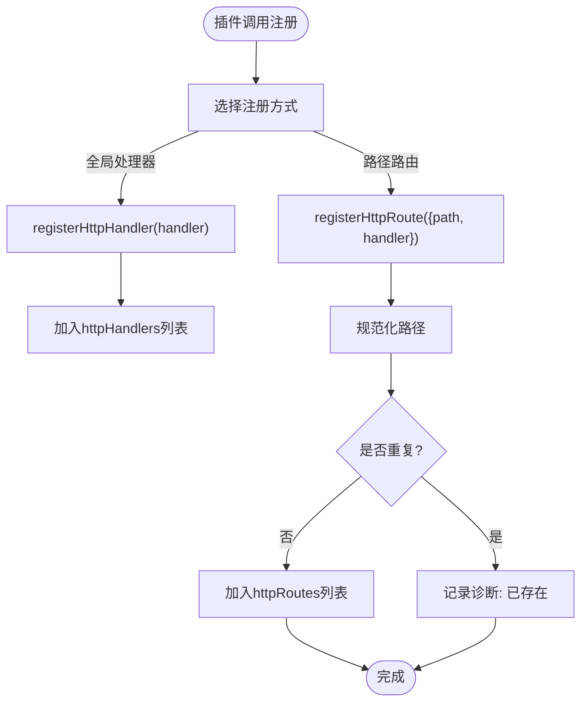

**图表来源**

- [src/plugins/http-registry.ts](file://src/plugins/http-registry.ts#L11-L52)
- [src/plugins/registry.ts](file://src/plugins/registry.ts#L287-L326)

**章节来源**

- [src/plugins/http-registry.ts](file://src/plugins/http-registry.ts#L1-L53)
- [src/plugins/registry.ts](file://src/plugins/registry.ts#L287-L326)

### 组件C：WebSocket通信与RPC调用

- 网关方法通过registerGatewayMethod注册，键名唯一且不可与核心方法冲突
- 请求上下文包含响应回调、节点订阅/广播、健康状态、模型目录等
- 广播支持全量/按连接ID/按订阅会话推送，具备丢弃慢消息保护

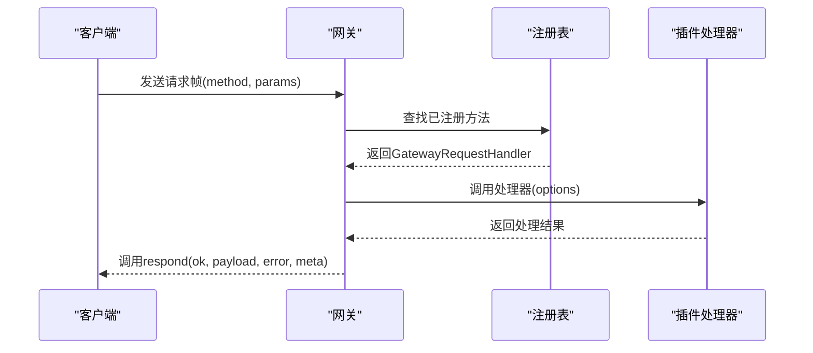

**图表来源**

- [src/plugins/registry.ts](file://src/plugins/registry.ts#L265-L285)
- [src/gateway/server-methods/types.ts](file://src/gateway/server-methods/types.ts#L100-L119)

**章节来源**

- [src/gateway/server-methods/types.ts](file://src/gateway/server-methods/types.ts#L1-L120)
- [src/plugins/registry.ts](file://src/plugins/registry.ts#L265-L285)

### 组件D：插件钩子运行器

- 插件可注册两类钩子：内部钩子（事件驱动）与类型化钩子（强类型）
- 内部钩子支持通用事件类型与具体事件:动作组合，触发时分别调用对应处理器集合
- 类型化钩子在注册表中按优先级存储，便于统一调度

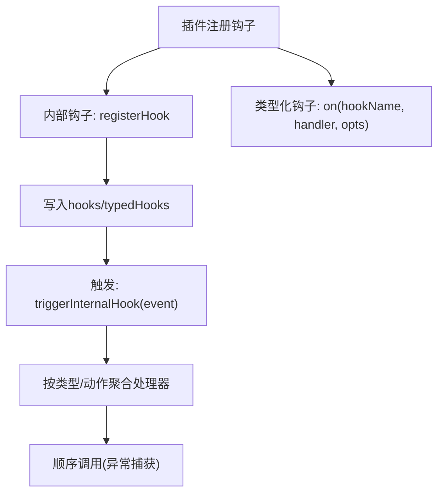

**图表来源**

- [src/plugins/registry.ts](file://src/plugins/registry.ts#L195-L263)
- [src/plugins/registry.ts](file://src/plugins/registry.ts#L445-L459)
- [src/hooks/internal-hooks.ts](file://src/hooks/internal-hooks.ts#L123-L143)

**章节来源**

- [src/plugins/registry.ts](file://src/plugins/registry.ts#L195-L263)
- [src/plugins/registry.ts](file://src/plugins/registry.ts#L445-L459)
- [src/hooks/internal-hooks.ts](file://src/hooks/internal-hooks.ts#L1-L182)

### 组件E：插件服务注册

- 插件可注册生命周期服务（id/start/stop），注册表维护服务清单与诊断
- 服务可用于后台任务、定时任务、通道监控等

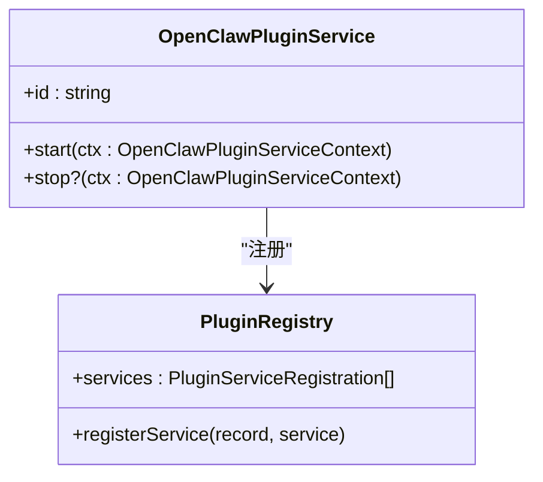

**图表来源**

- [src/plugins/types.ts](file://src/plugins/types.ts#L218-L222)
- [src/plugins/registry.ts](file://src/plugins/registry.ts#L400-L411)

**章节来源**

- [src/plugins/types.ts](file://src/plugins/types.ts#L218-L222)
- [src/plugins/registry.ts](file://src/plugins/registry.ts#L400-L411)

### 组件F：插件间通信机制

- 命令系统：插件可注册自定义命令，先于内置命令与代理调用处理
- 内部钩子：跨插件事件传播，按事件类型与动作组合分发
- 工具与消息流：运行时能力提供工具工厂、回复分发、会话记录、活动记录等

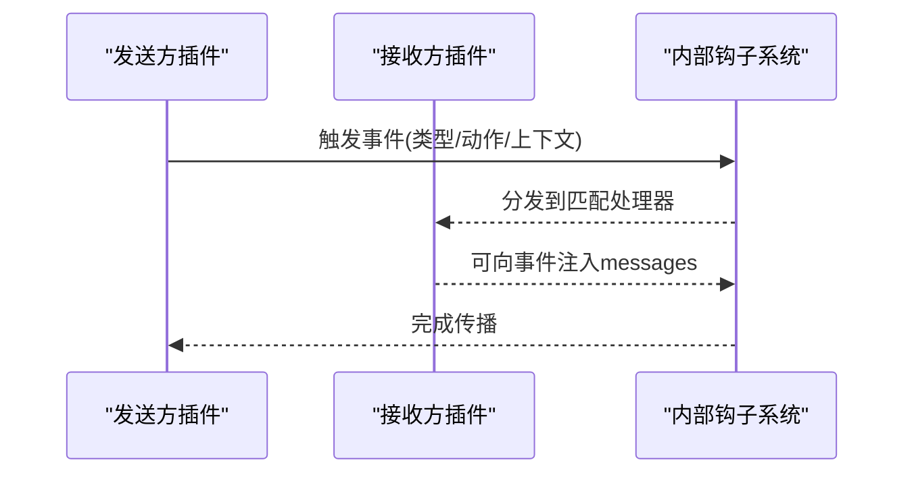

**图表来源**

- [src/hooks/internal-hooks.ts](file://src/hooks/internal-hooks.ts#L123-L143)
- [src/plugins/registry.ts](file://src/plugins/registry.ts#L413-L443)

**章节来源**

- [src/plugins/registry.ts](file://src/plugins/registry.ts#L413-L443)
- [src/hooks/internal-hooks.ts](file://src/hooks/internal-hooks.ts#L1-L182)

### 组件G：插件配置集成

- 配置模式：插件可提供配置Schema（Zod/JSON Schema），用于UI提示与校验
- 校验与热重载：运行时提供配置加载/写入能力；插件可声明schema并在运行时生效
- 回滚机制：建议通过配置文件版本控制与变更审计实现回滚

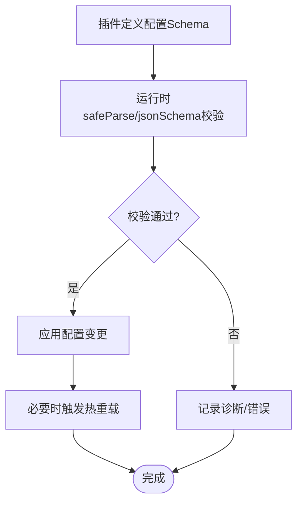

**图表来源**

- [src/plugins/config-schema.ts](file://src/plugins/config-schema.ts#L13-L33)
- [src/plugins/runtime/types.ts](file://src/plugins/runtime/types.ts#L180-L183)

**章节来源**

- [src/plugins/config-schema.ts](file://src/plugins/config-schema.ts#L1-L34)
- [src/plugins/runtime/types.ts](file://src/plugins/runtime/types.ts#L180-L183)

### 组件H：示例：Discord插件集成

- 插件通过SDK设置运行时并注册通道插件
- 使用空配置Schema作为示例，展示最小化插件结构

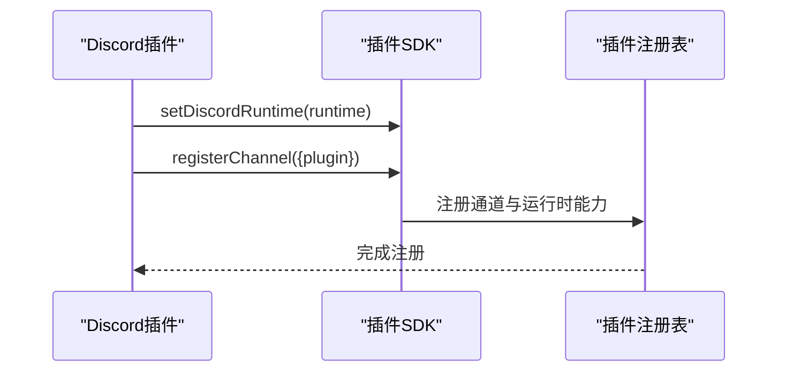

**图表来源**

- [extensions/discord/index.ts](file://extensions/discord/index.ts#L1-L18)
- [src/plugins/registry.ts](file://src/plugins/registry.ts#L328-L354)

**章节来源**

- [extensions/discord/index.ts](file://extensions/discord/index.ts#L1-L18)

## 依赖关系分析

- 插件SDK是扩展插件与核心之间的契约层，统一了注册接口与类型约束
- 注册表承担去重、冲突检测与诊断职责，避免重复注册与命名冲突
- 内部钩子系统提供跨插件事件传播，保证错误隔离与有序执行
- 运行时能力抽象了配置、媒体、TTS、通道适配等横切关注点
- 网关RPC类型定义了客户端、响应与上下文，支撑WebSocket通信与广播

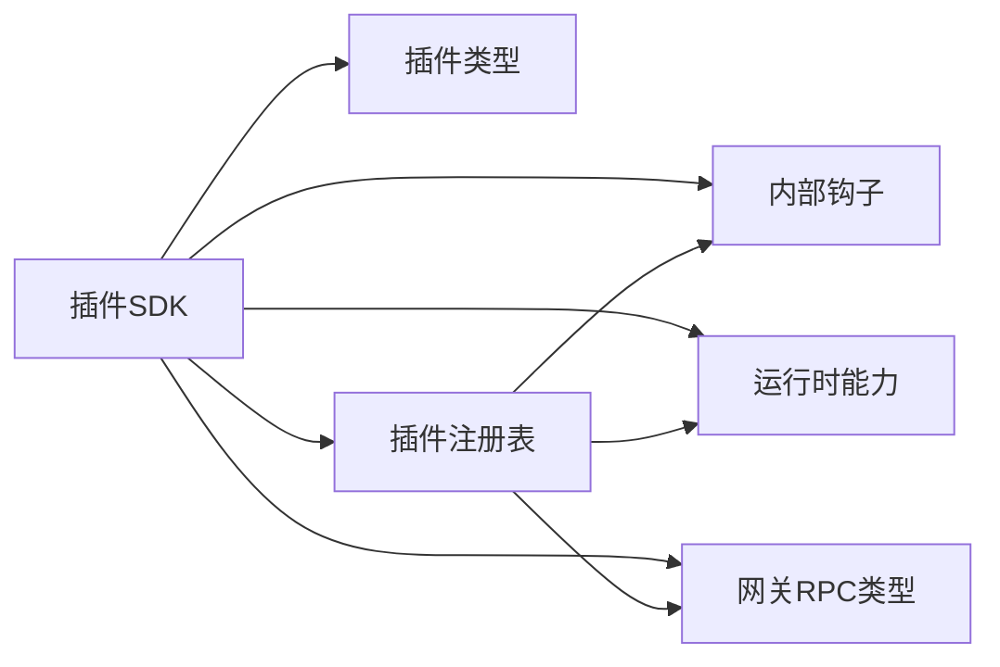

**图表来源**

- [src/plugin-sdk/index.ts](file://src/plugin-sdk/index.ts#L1-L392)
- [src/plugins/types.ts](file://src/plugins/types.ts#L1-L538)
- [src/plugins/registry.ts](file://src/plugins/registry.ts#L1-L516)
- [src/hooks/internal-hooks.ts](file://src/hooks/internal-hooks.ts#L1-L182)
- [src/plugins/runtime/types.ts](file://src/plugins/runtime/types.ts#L1-L363)
- [src/gateway/server-methods/types.ts](file://src/gateway/server-methods/types.ts#L1-L120)

**章节来源**

- [src/plugin-sdk/index.ts](file://src/plugin-sdk/index.ts#L1-L392)
- [src/plugins/registry.ts](file://src/plugins/registry.ts#L1-L516)

## 性能考量

- 异步与并发：内部钩子触发与HTTP路由处理均为异步，需注意处理器内部的I/O与超时控制
- 广播优化：网关广播支持“慢消息丢弃”策略，避免阻塞关键路径
- 资源复用：运行时能力提供媒体缓存、会话路径解析等，减少重复计算
- 诊断与可观测：注册表收集诊断信息，有助于定位热点与瓶颈

[本节为通用指导，无需列出章节来源]

## 故障排查指南

- HTTP路由冲突：当路由路径重复或缺失时，注册表会记录诊断信息，检查路径规范化与重复注册
- 网关方法冲突：方法名重复或与核心方法冲突时，注册表记录错误诊断
- 钩子异常：内部钩子触发时捕获异常并继续执行其他处理器，确保系统稳定性
- 配置校验失败：根据Schema进行校验，失败时记录诊断并阻止应用变更

**章节来源**

- [src/plugins/registry.ts](file://src/plugins/registry.ts#L300-L318)
- [src/plugins/registry.ts](file://src/plugins/registry.ts#L274-L281)
- [src/hooks/internal-hooks.ts](file://src/hooks/internal-hooks.ts#L134-L142)
- [src/plugins/config-schema.ts](file://src/plugins/config-schema.ts#L15-L26)

## 结论

OpenClaw插件集成模式通过统一的SDK、严格的注册表与事件驱动的内部钩子，构建了高内聚、低耦合的插件生态。HTTP与网关RPC为外部集成提供了稳定通道，运行时能力抽象则保障了插件在配置、媒体、通道等领域的可移植性。配合完善的诊断与可观测性，插件系统具备良好的可维护性与扩展性。

[本节为总结，无需列出章节来源]

## 附录

- 插件开发最佳实践
  - 明确配置Schema与UI提示，提升用户体验
  - 在钩子与HTTP处理器中做好错误隔离与超时控制
  - 利用运行时能力进行资源复用与路径解析
  - 通过诊断信息持续优化插件行为

[本节为补充说明，无需列出章节来源]
