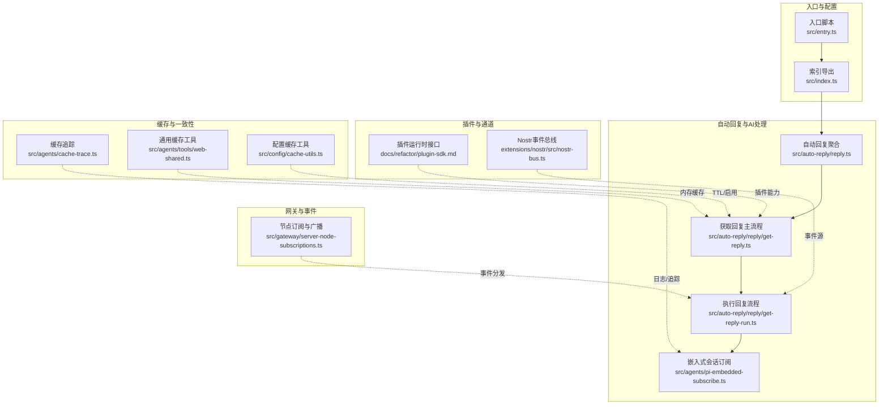
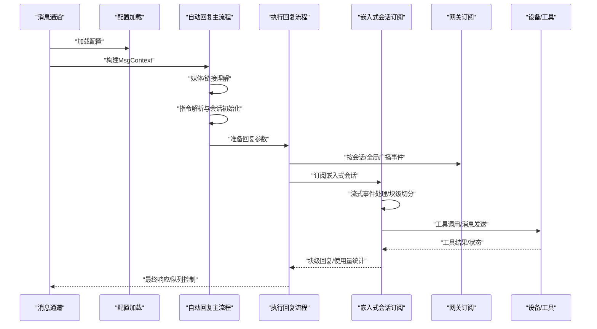
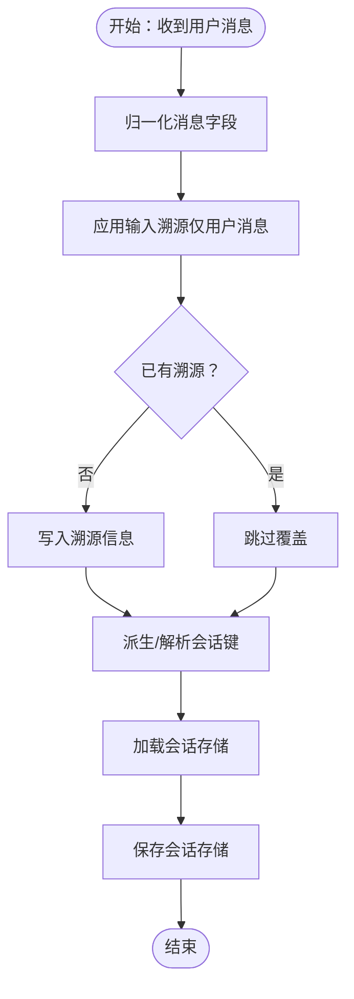
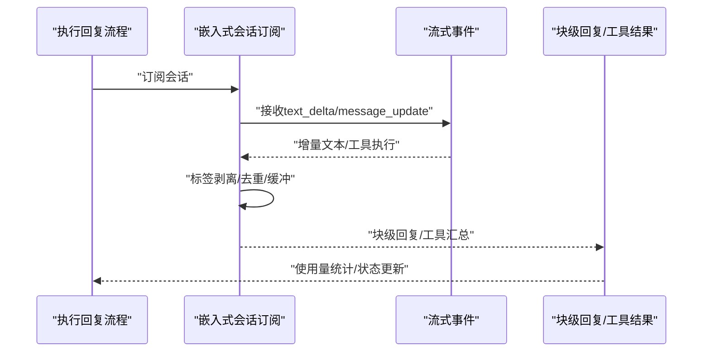
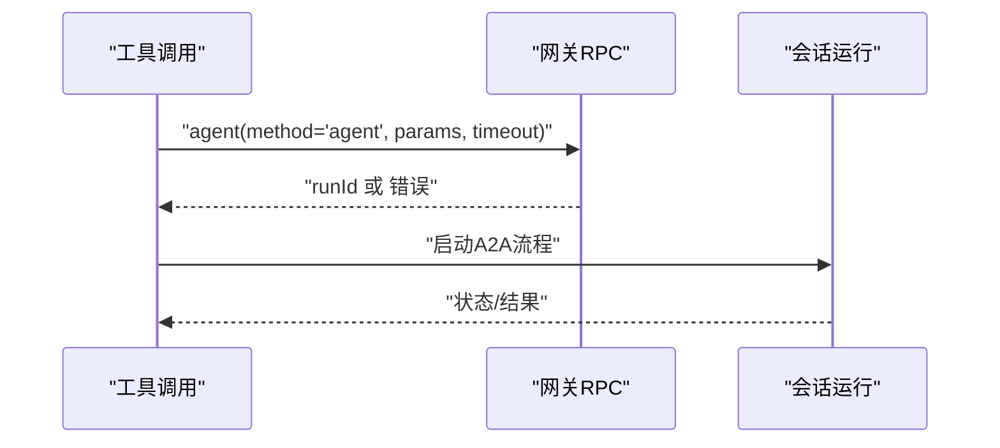
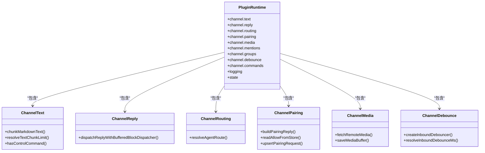
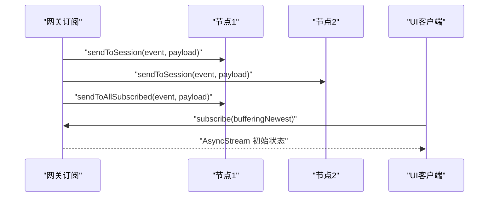
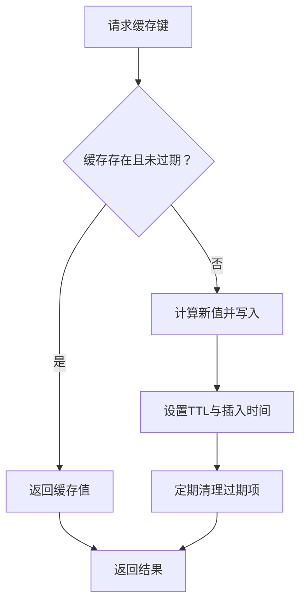
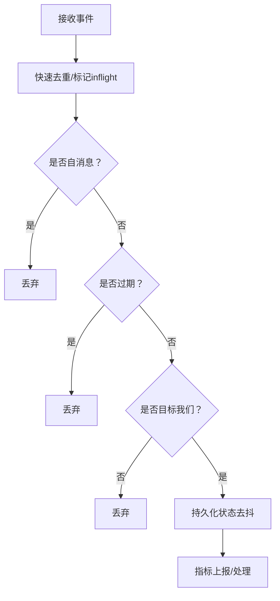
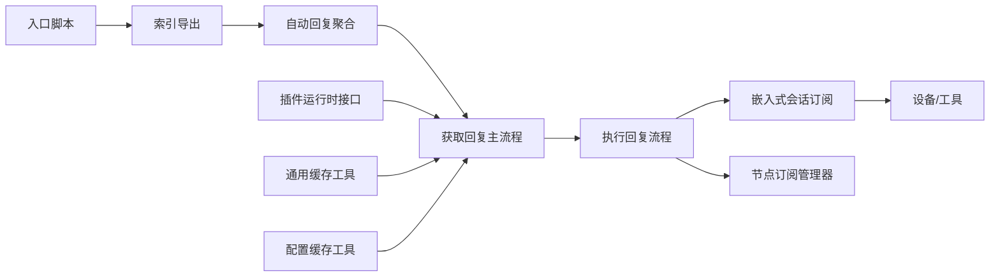

# 数据流架构

<cite>
**本文引用的文件**
- [src/index.ts](file://src/index.ts)
- [src/entry.ts](file://src/entry.ts)
- [src/auto-reply/reply.ts](file://src/auto-reply/reply.ts)
- [src/auto-reply/reply/get-reply.ts](file://src/auto-reply/reply/get-reply.ts)
- [src/auto-reply/reply/get-reply-run.ts](file://src/auto-reply/reply/get-reply-run.ts)
- [src/agents/pi-embedded-subscribe.ts](file://src/agents/pi-embedded-subscribe.ts)
- [src/agents/pi-embedded-subscribe.handlers.ts](file://src/agents/pi-embedded-subscribe.handlers.ts)
- [src/agents/tools/sessions-send-tool.ts](file://src/agents/tools/sessions-send-tool.ts)
- [src/gateway/server-node-subscriptions.ts](file://src/gateway/server-node-subscriptions.ts)
- [src/sessions/input-provenance.ts](file://src/sessions/input-provenance.ts)
- [src/agents/cache-trace.ts](file://src/agents/cache-trace.ts)
- [src/agents/tools/web-shared.ts](file://src/agents/tools/web-shared.ts)
- [src/config/cache-utils.ts](file://src/config/cache-utils.ts)
- [extensions/nostr/src/nostr-bus.ts](file://extensions/nostr/src/nostr-bus.ts)
- [ui/src/ui/app-events.ts](file://ui/src/ui/app-events.ts)
- [apps/macos/Sources/OpenClaw/GatewayEndpointStore.swift](file://apps/macos/Sources/OpenClaw/GatewayEndpointStore.swift)
- [src/tui/tui-formatters.ts](file://src/tui/tui-formatters.ts)
</cite>

## 目录

1. [引言](#引言)
2. [项目结构](#项目结构)
3. [核心组件](#核心组件)
4. [架构总览](#架构总览)
5. [详细组件分析](#详细组件分析)
6. [依赖关系分析](#依赖关系分析)
7. [性能考量](#性能考量)
8. [故障排查指南](#故障排查指南)
9. [结论](#结论)
10. [附录](#附录)

## 引言

本文件面向OpenClaw的数据流架构，系统性梳理从“消息输入”到“AI处理”、“设备控制”、“插件扩展”的完整数据链路与处理流程。重点覆盖：

- 消息输入流：来源渠道、去向路由、会话键生成与持久化
- AI处理流：指令解析、媒体/链接理解、嵌入式会话订阅与块级回复、使用量统计
- 设备控制流：工具调用、消息发送、队列与中断策略
- 插件扩展流：插件运行时接口、文本分块、媒体下载与保存、去抖动
- 缓存策略与一致性：内存缓存、TTL、命中追踪与持久化
- 事件驱动架构：节点订阅、事件广播、状态传播
- 性能监控与优化建议：指标采集、阻塞点定位、并发与批处理

## 项目结构

OpenClaw采用多语言混合与模块化组织方式：核心逻辑以TypeScript实现，部分平台客户端以Swift实现；通过CLI入口统一启动，自动回复与AI处理在独立子模块中完成，网关侧负责节点订阅与事件分发。

**图表来源**

- [src/entry.ts](file://src/entry.ts#L1-L172)
- [src/index.ts](file://src/index.ts#L1-L94)
- [src/auto-reply/reply.ts](file://src/auto-reply/reply.ts#L1-L12)
- [src/auto-reply/reply/get-reply.ts](file://src/auto-reply/reply/get-reply.ts#L1-L342)
- [src/auto-reply/reply/get-reply-run.ts](file://src/auto-reply/reply/get-reply-run.ts#L323-L360)
- [src/agents/pi-embedded-subscribe.ts](file://src/agents/pi-embedded-subscribe.ts#L1-L637)
- [src/gateway/server-node-subscriptions.ts](file://src/gateway/server-node-subscriptions.ts#L84-L133)
- [src/agents/cache-trace.ts](file://src/agents/cache-trace.ts#L167-L211)
- [src/agents/tools/web-shared.ts](file://src/agents/tools/web-shared.ts#L1-L39)
- [src/config/cache-utils.ts](file://src/config/cache-utils.ts#L1-L27)
- [extensions/nostr/src/nostr-bus.ts](file://extensions/nostr/src/nostr-bus.ts#L386-L436)

**章节来源**

- [src/entry.ts](file://src/entry.ts#L1-L172)
- [src/index.ts](file://src/index.ts#L1-L94)
- [src/auto-reply/reply.ts](file://src/auto-reply/reply.ts#L1-L12)
- [src/auto-reply/reply/get-reply.ts](file://src/auto-reply/reply/get-reply.ts#L1-L342)
- [src/auto-reply/reply/get-reply-run.ts](file://src/auto-reply/reply/get-reply-run.ts#L323-L360)
- [src/agents/pi-embedded-subscribe.ts](file://src/agents/pi-embedded-subscribe.ts#L1-L637)
- [src/gateway/server-node-subscriptions.ts](file://src/gateway/server-node-subscriptions.ts#L84-L133)
- [src/agents/cache-trace.ts](file://src/agents/cache-trace.ts#L167-L211)
- [src/agents/tools/web-shared.ts](file://src/agents/tools/web-shared.ts#L1-L39)
- [src/config/cache-utils.ts](file://src/config/cache-utils.ts#L1-L27)
- [extensions/nostr/src/nostr-bus.ts](file://extensions/nostr/src/nostr-bus.ts#L386-L436)

## 核心组件

- 入口与运行时
  - 入口脚本负责环境初始化、警告过滤、进程桥接与CLI解析。
  - 索引导出提供对外API集合，便于上层调用。
- 自动回复与AI处理
  - 自动回复聚合模块导出指令提取、回复生成等能力。
  - 获取回复主流程负责上下文归一化、媒体/链接理解、指令解析、会话状态初始化与执行。
  - 执行回复流程负责队列设置、中断策略、嵌入式会话订阅与块级回复分发。
  - 嵌入式会话订阅负责流式事件处理、块级文本切分、思考/最终标签剥离、工具结果汇总与输出。
- 网关与事件
  - 节点订阅管理器维护节点-会话订阅映射，支持按会话或全局广播事件。
- 插件与通道
  - 插件运行时接口定义了文本分块、媒体下载/保存、去抖动、路由、配对、提及与群组策略等能力。
  - Nostr事件总线演示了事件接收、去重、自消息过滤、过期过滤与持久化。
- 缓存与一致性
  - 缓存追踪用于记录消息指纹与序列化摘要，辅助一致性校验。
  - 通用缓存工具提供内存Map缓存、TTL、键规范化与读取。
  - 配置缓存工具提供TTL解析、启用判断与文件时间戳读取。

**章节来源**

- [src/entry.ts](file://src/entry.ts#L1-L172)
- [src/index.ts](file://src/index.ts#L1-L94)
- [src/auto-reply/reply.ts](file://src/auto-reply/reply.ts#L1-L12)
- [src/auto-reply/reply/get-reply.ts](file://src/auto-reply/reply/get-reply.ts#L1-L342)
- [src/auto-reply/reply/get-reply-run.ts](file://src/auto-reply/reply/get-reply-run.ts#L323-L360)
- [src/agents/pi-embedded-subscribe.ts](file://src/agents/pi-embedded-subscribe.ts#L1-L637)
- [src/gateway/server-node-subscriptions.ts](file://src/gateway/server-node-subscriptions.ts#L84-L133)
- [src/agents/cache-trace.ts](file://src/agents/cache-trace.ts#L167-L211)
- [src/agents/tools/web-shared.ts](file://src/agents/tools/web-shared.ts#L1-L39)
- [src/config/cache-utils.ts](file://src/config/cache-utils.ts#L1-L27)
- [extensions/nostr/src/nostr-bus.ts](file://extensions/nostr/src/nostr-bus.ts#L386-L436)

## 架构总览

下图展示从消息进入、AI推理、工具执行到最终响应的端到端数据流，以及事件驱动的节点订阅与状态传播。

**图表来源**

- [src/auto-reply/reply/get-reply.ts](file://src/auto-reply/reply/get-reply.ts#L53-L342)
- [src/auto-reply/reply/get-reply-run.ts](file://src/auto-reply/reply/get-reply-run.ts#L323-L360)
- [src/agents/pi-embedded-subscribe.ts](file://src/agents/pi-embedded-subscribe.ts#L32-L637)
- [src/gateway/server-node-subscriptions.ts](file://src/gateway/server-node-subscriptions.ts#L84-L133)

## 详细组件分析

### 组件A：消息输入流与会话键管理

- 输入归一化与溯源
  - 对用户消息应用输入溯源，确保跨会话输入可识别与去重。
- 会话键生成与存储
  - 会话键派生与解析，会话存储加载与保存，支持会话状态持久化。
- 事件溯源与一致性
  - 输入溯源字段仅对用户角色生效，避免非用户消息被篡改。

**图表来源**

- [src/sessions/input-provenance.ts](file://src/sessions/input-provenance.ts#L48-L79)

**章节来源**

- [src/sessions/input-provenance.ts](file://src/sessions/input-provenance.ts#L48-L79)

### 组件B：AI处理流与嵌入式会话订阅

- 处理流程
  - 自动回复主流程负责上下文归一化、媒体/链接理解、指令解析、会话状态初始化与执行。
  - 执行回复流程负责队列设置、中断策略、嵌入式会话订阅与块级回复分发。
- 嵌入式会话订阅
  - 流式事件处理、块级文本切分、思考/最终标签剥离、工具结果汇总与输出。
  - 支持推理流式输出、块级回复缓冲与强制冲刷、重复检测与抑制。
- 使用量统计
  - 记录输入/输出/缓存读写/总用量，支持汇总与回传。

**图表来源**

- [src/auto-reply/reply/get-reply-run.ts](file://src/auto-reply/reply/get-reply-run.ts#L323-L360)
- [src/agents/pi-embedded-subscribe.ts](file://src/agents/pi-embedded-subscribe.ts#L32-L637)

**章节来源**

- [src/auto-reply/reply/get-reply-run.ts](file://src/auto-reply/reply/get-reply-run.ts#L323-L360)
- [src/agents/pi-embedded-subscribe.ts](file://src/agents/pi-embedded-subscribe.ts#L1-L637)

### 组件C：设备控制流与工具调用

- 工具调用与消息发送
  - 通过网关RPC发起“agent”方法，传递发送参数，返回runId并启动A2A流程。
  - 支持超时控制与错误返回，确保调用健壮性。
- 队列与中断策略
  - 根据队列模式决定是否中断当前会话、清空命令通道、终止嵌入式运行。

**图表来源**

- [src/agents/tools/sessions-send-tool.ts](file://src/agents/tools/sessions-send-tool.ts#L288-L335)
- [src/auto-reply/reply/get-reply-run.ts](file://src/auto-reply/reply/get-reply-run.ts#L351-L357)

**章节来源**

- [src/agents/tools/sessions-send-tool.ts](file://src/agents/tools/sessions-send-tool.ts#L288-L335)
- [src/auto-reply/reply/get-reply-run.ts](file://src/auto-reply/reply/get-reply-run.ts#L351-L357)

### 组件D：插件扩展流与通道能力

- 插件运行时接口
  - 文本分块、文本长度限制解析、控制命令识别、块级回复分发器、路由解析、配对、媒体下载/保存、提及正则、群组策略、去抖动器、命令授权等。
- 通道适配
  - 不同渠道（如Telegram、Discord等）通过插件运行时抽象统一接入，屏蔽差异。

**图表来源**

- [docs/refactor/plugin-sdk.md](file://docs/refactor/plugin-sdk.md#L45-L145)

**章节来源**

- [docs/refactor/plugin-sdk.md](file://docs/refactor/plugin-sdk.md#L45-L145)

### 组件E：事件驱动架构与状态传播

- 节点订阅与广播
  - 维护节点-会话订阅映射，支持按会话或全局广播事件，JSON序列化负载。
- 客户端订阅
  - macOS端通过异步流订阅网关端点状态，支持缓冲最新事件与生命周期清理。
- UI事件日志
  - UI侧事件日志条目包含时间戳、事件名与可选载荷，便于调试与审计。

**图表来源**

- [src/gateway/server-node-subscriptions.ts](file://src/gateway/server-node-subscriptions.ts#L84-L133)
- [apps/macos/Sources/OpenClaw/GatewayEndpointStore.swift](file://apps/macos/Sources/OpenClaw/GatewayEndpointStore.swift#L279-L295)
- [ui/src/ui/app-events.ts](file://ui/src/ui/app-events.ts#L1-L5)

**章节来源**

- [src/gateway/server-node-subscriptions.ts](file://src/gateway/server-node-subscriptions.ts#L84-L133)
- [apps/macos/Sources/OpenClaw/GatewayEndpointStore.swift](file://apps/macos/Sources/OpenClaw/GatewayEndpointStore.swift#L279-L295)
- [ui/src/ui/app-events.ts](file://ui/src/ui/app-events.ts#L1-L5)

### 组件F：缓存策略与数据一致性

- 内存缓存
  - 通用缓存工具提供Map缓存、TTL、键规范化、过期删除与读取。
- 配置缓存
  - 配置缓存工具解析环境变量TTL、启用开关、文件修改时间戳。
- 缓存追踪
  - 缓存追踪记录消息指纹、摘要与序列化安全字符串，辅助一致性校验与问题定位。

**图表来源**

- [src/agents/tools/web-shared.ts](file://src/agents/tools/web-shared.ts#L26-L39)
- [src/config/cache-utils.ts](file://src/config/cache-utils.ts#L1-L27)
- [src/agents/cache-trace.ts](file://src/agents/cache-trace.ts#L167-L211)

**章节来源**

- [src/agents/tools/web-shared.ts](file://src/agents/tools/web-shared.ts#L1-L39)
- [src/config/cache-utils.ts](file://src/config/cache-utils.ts#L1-L27)
- [src/agents/cache-trace.ts](file://src/agents/cache-trace.ts#L167-L211)

### 组件G：事件总线与去重

- Nostr事件总线
  - 接收事件、快速去重（seen/inflight）、自消息过滤、过期过滤、目标检查、持久化去抖与指标上报。

**图表来源**

- [extensions/nostr/src/nostr-bus.ts](file://extensions/nostr/src/nostr-bus.ts#L386-L436)

**章节来源**

- [extensions/nostr/src/nostr-bus.ts](file://extensions/nostr/src/nostr-bus.ts#L386-L436)

## 依赖关系分析

- 入口与运行时
  - 入口脚本负责环境与进程桥接，索引导出提供API集合。
- 自动回复与AI处理
  - 自动回复聚合模块导出指令提取与回复生成；主流程串联理解、指令解析、会话初始化与执行；执行流程与嵌入式订阅协同。
- 网关与事件
  - 节点订阅管理器提供事件广播能力，支撑跨节点状态传播。
- 插件与通道
  - 插件运行时接口抽象通道能力，不同渠道通过统一接口接入。
- 缓存与一致性
  - 通用缓存工具与配置缓存工具共同保障缓存可用性与一致性。

**图表来源**

- [src/entry.ts](file://src/entry.ts#L1-L172)
- [src/index.ts](file://src/index.ts#L1-L94)
- [src/auto-reply/reply.ts](file://src/auto-reply/reply.ts#L1-L12)
- [src/auto-reply/reply/get-reply.ts](file://src/auto-reply/reply/get-reply.ts#L1-L342)
- [src/auto-reply/reply/get-reply-run.ts](file://src/auto-reply/reply/get-reply-run.ts#L323-L360)
- [src/agents/pi-embedded-subscribe.ts](file://src/agents/pi-embedded-subscribe.ts#L1-L637)
- [src/gateway/server-node-subscriptions.ts](file://src/gateway/server-node-subscriptions.ts#L84-L133)
- [src/agents/tools/web-shared.ts](file://src/agents/tools/web-shared.ts#L1-L39)
- [src/config/cache-utils.ts](file://src/config/cache-utils.ts#L1-L27)

**章节来源**

- 同上

## 性能考量

- 流式处理与块级回复
  - 嵌入式订阅支持块级文本切分与缓冲，减少大文本一次性渲染压力；合理设置块级回复断点与去重策略，避免重复输出。
- 队列与中断
  - 中断模式下清空命令通道与终止运行，降低并发冲突；根据会话车道大小动态调整。
- 缓存策略
  - TTL与最大条目数控制内存占用；键规范化与过期清理提升命中率；结合缓存追踪定位热点与异常。
- 事件广播
  - 按会话广播减少无关节点负担；缓冲最新事件避免历史丢失。
- 指标与可观测性
  - 在Nostr事件总线等关键路径增加指标上报（接收、重复、自消息、过期等），辅助性能分析与告警。

[本节为通用指导，无需列出具体文件来源]

## 故障排查指南

- 嵌入式会话订阅
  - 关注思考/最终标签剥离逻辑与块级回复抑制策略，避免重复输出与泄漏。
  - 使用使用量统计与缓存追踪辅助定位异常。
- 网关订阅
  - 检查订阅映射与广播函数，确认节点ID与会话键标准化。
- 插件运行时
  - 校验文本分块、媒体下载/保存、去抖动参数与回调错误处理。
- 缓存
  - 检查TTL解析、启用开关与文件时间戳读取，确认缓存命中与过期行为符合预期。
- UI与客户端
  - 检查事件日志条目与异步流订阅生命周期，确保状态正确传播。

**章节来源**

- [src/agents/pi-embedded-subscribe.ts](file://src/agents/pi-embedded-subscribe.ts#L32-L637)
- [src/gateway/server-node-subscriptions.ts](file://src/gateway/server-node-subscriptions.ts#L84-L133)
- [docs/refactor/plugin-sdk.md](file://docs/refactor/plugin-sdk.md#L45-L145)
- [src/config/cache-utils.ts](file://src/config/cache-utils.ts#L1-L27)
- [ui/src/ui/app-events.ts](file://ui/src/ui/app-events.ts#L1-L5)

## 结论

OpenClaw的数据流架构以“消息输入—自动回复—AI处理—设备控制—插件扩展—事件驱动—缓存一致”为主线，通过模块化与抽象接口实现跨渠道、跨平台的一致体验。关键优化点在于流式处理、队列中断、缓存策略与事件广播的协同，辅以指标与追踪提升可观测性与稳定性。

[本节为总结，无需列出具体文件来源]

## 附录

- TUI格式化与思考内容组合
  - 提供最终助手文本解析与思考内容拼接工具，便于终端界面展示。

**章节来源**

- [src/tui/tui-formatters.ts](file://src/tui/tui-formatters.ts#L1-L53)
