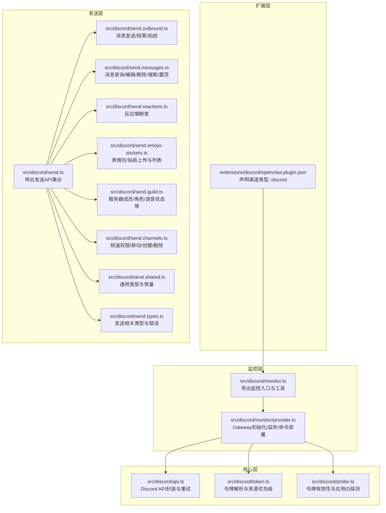
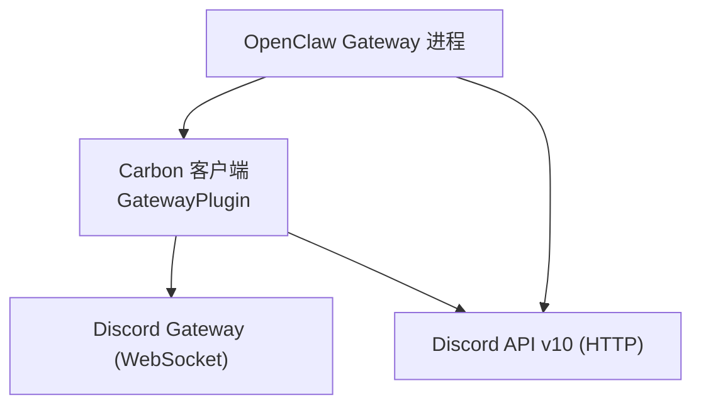
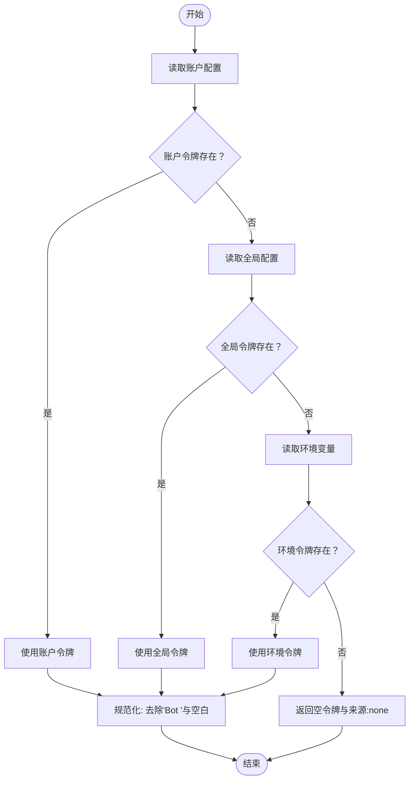
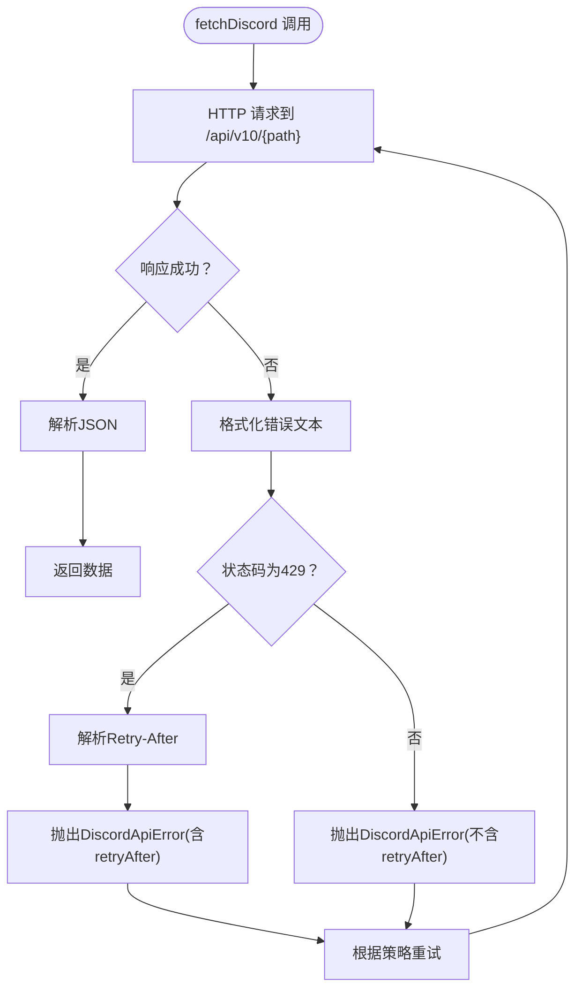
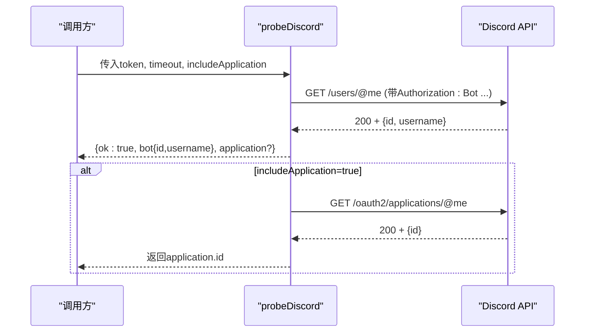
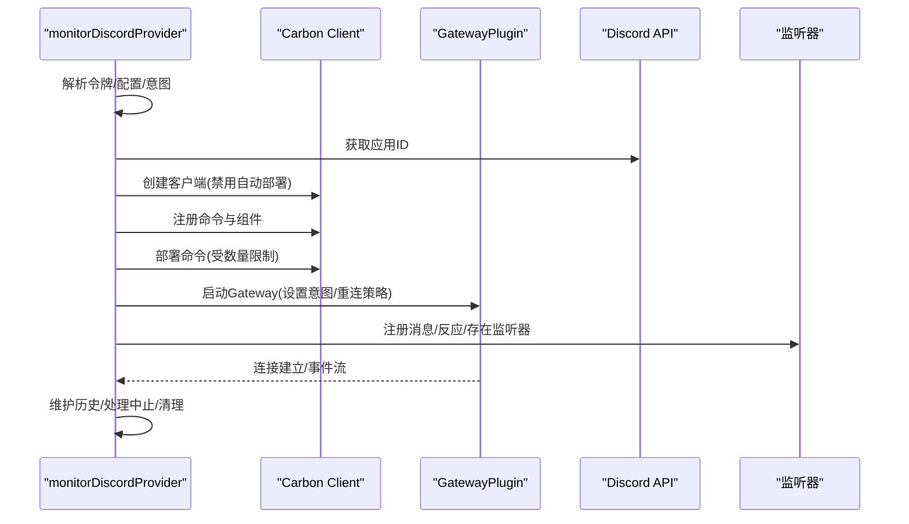
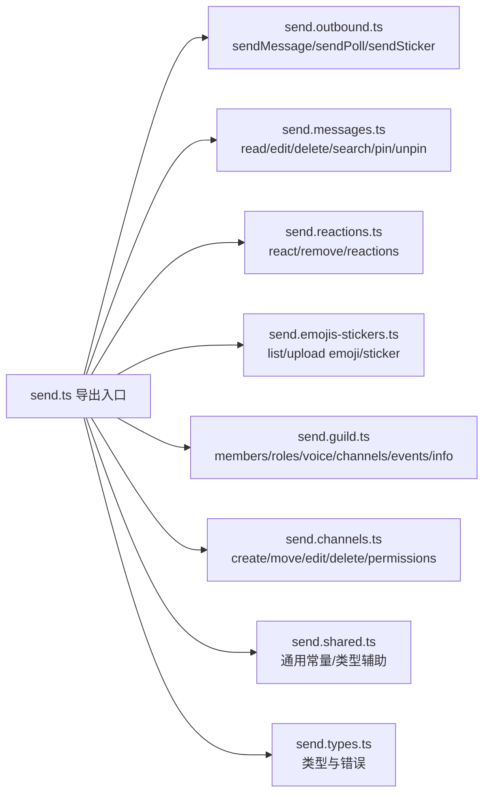
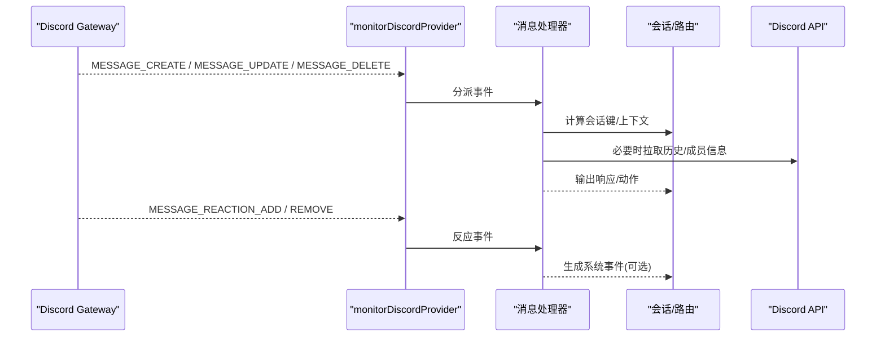
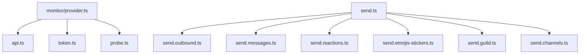

# Discord渠道集成

<cite>
**本文引用的文件**
- [src/discord/index.ts](file://src/discord/index.ts)
- [src/discord/api.ts](file://src/discord/api.ts)
- [src/discord/token.ts](file://src/discord/token.ts)
- [src/discord/monitor.ts](file://src/discord/monitor.ts)
- [src/discord/monitor/provider.ts](file://src/discord/monitor/provider.ts)
- [src/discord/send.ts](file://src/discord/send.ts)
- [src/discord/send.outbound.ts](file://src/discord/send.outbound.ts)
- [src/discord/send.messages.ts](file://src/discord/send.messages.ts)
- [src/discord/send.reactions.ts](file://src/discord/send.reactions.ts)
- [src/discord/send.emojis-stickers.ts](file://src/discord/send.emojis-stickers.ts)
- [src/discord/send.guild.ts](file://src/discord/send.guild.ts)
- [src/discord/send.channels.ts](file://src/discord/send.channels.ts)
- [src/discord/send.shared.ts](file://src/discord/send.shared.ts)
- [src/discord/send.types.ts](file://src/discord/send.types.ts)
- [src/discord/probe.ts](file://src/discord/probe.ts)
- [extensions/discord/openclaw.plugin.json](file://extensions/discord/openclaw.plugin.json)
- [docs/channels/discord.md](file://docs/channels/discord.md)
</cite>

## 目录

1. [简介](#简介)
2. [项目结构](#项目结构)
3. [核心组件](#核心组件)
4. [架构总览](#架构总览)
5. [组件详解](#组件详解)
6. [依赖关系分析](#依赖关系分析)
7. [性能考量](#性能考量)
8. [故障排查指南](#故障排查指南)
9. [结论](#结论)
10. [附录](#附录)

## 简介

本技术文档面向OpenClaw的Discord渠道集成，系统性阐述Bot令牌认证、Discord Gateway WebSocket连接管理、消息收发与编辑删除、反应（Reaction）添加与查询、线程与服务器频道管理、角色权限控制、PluralKit代理解析、原生命令部署与执行、以及与Discord官方API的交互机制。文档同时提供架构图与事件处理流程图，帮助开发者快速理解并安全高效地配置与扩展Discord集成。

## 项目结构

OpenClaw在多个层次提供Discord能力：

- 扩展层：插件声明文件定义渠道类型与配置模式，便于统一注册与发现。
- 核心层：Discord API封装、令牌解析、探针（probe）与意图检查。
- 监控层：基于Carbon Gateway的监听器与消息处理器，负责接入Discord Gateway事件流。
- 发送层：对外部调用的统一出口，覆盖消息、反应、表情包、服务器与频道管理等。

图表来源

- [extensions/discord/openclaw.plugin.json](file://extensions/discord/openclaw.plugin.json#L1-L10)
- [src/discord/monitor.ts](file://src/discord/monitor.ts#L1-L29)
- [src/discord/monitor/provider.ts](file://src/discord/monitor/provider.ts#L1-L716)
- [src/discord/api.ts](file://src/discord/api.ts#L1-L137)
- [src/discord/token.ts](file://src/discord/token.ts#L1-L52)
- [src/discord/probe.ts](file://src/discord/probe.ts#L103-L182)
- [src/discord/send.ts](file://src/discord/send.ts#L1-L70)

章节来源

- [extensions/discord/openclaw.plugin.json](file://extensions/discord/openclaw.plugin.json#L1-L10)
- [src/discord/monitor.ts](file://src/discord/monitor.ts#L1-L29)
- [src/discord/monitor/provider.ts](file://src/discord/monitor/provider.ts#L1-L716)
- [src/discord/api.ts](file://src/discord/api.ts#L1-L137)
- [src/discord/token.ts](file://src/discord/token.ts#L1-L52)
- [src/discord/probe.ts](file://src/discord/probe.ts#L103-L182)
- [src/discord/send.ts](file://src/discord/send.ts#L1-L70)

## 核心组件

- 令牌解析与来源优先级：支持从账户配置、全局配置、环境变量解析Bot令牌，自动去除“Bot ”前缀并规范化。
- Discord API封装：统一的HTTP客户端，内置重试策略、429限流处理、错误格式化与Retry-After解析。
- 探针（probe）：验证令牌有效性、获取机器人身份与可选的应用信息，用于健康检查与诊断。
- 监控提供者（monitorDiscordProvider）：初始化Carbon Gateway，注册监听器（消息、反应、存在），部署原生命令，处理意图与权限，维护历史上下文。
- 发送API集合：按功能域拆分，统一通过send.ts导出，包括消息、反应、表情包/贴纸、服务器与频道管理等。

章节来源

- [src/discord/token.ts](file://src/discord/token.ts#L1-L52)
- [src/discord/api.ts](file://src/discord/api.ts#L1-L137)
- [src/discord/probe.ts](file://src/discord/probe.ts#L103-L182)
- [src/discord/monitor/provider.ts](file://src/discord/monitor/provider.ts#L144-L700)
- [src/discord/send.ts](file://src/discord/send.ts#L1-L70)

## 架构总览

下图展示OpenClaw与Discord Gateway及API的交互路径，以及内部模块职责划分。

图表来源

- [src/discord/monitor/provider.ts](file://src/discord/monitor/provider.ts#L515-L538)
- [src/discord/api.ts](file://src/discord/api.ts#L96-L136)

## 组件详解

### 令牌认证与来源解析

- 来源优先级：账户级配置 > 全局配置 > 环境变量（仅默认账户）。
- 规范化：移除“Bot ”前缀，剔除空白字符。
- 错误处理：缺失令牌时抛出明确错误，提示设置位置。

图表来源

- [src/discord/token.ts](file://src/discord/token.ts#L22-L51)

章节来源

- [src/discord/token.ts](file://src/discord/token.ts#L1-L52)

### Discord API封装与重试策略

- 统一基地址与请求头：Authorization: Bot <token>。
- 错误处理：非2xx响应解析JSON负载，提取message与retry_after；若429则记录retryAfter并触发指数退避重试。
- 重试配置：默认最大尝试次数、最小/最大延迟与抖动参数可被覆盖。

图表来源

- [src/discord/api.ts](file://src/discord/api.ts#L96-L136)

章节来源

- [src/discord/api.ts](file://src/discord/api.ts#L1-L137)

### 探针（probe）与应用ID解析

- 验证令牌：调用/users/@me，成功后记录bot身份。
- 应用ID：可选调用/oauth2/applications/@me以获取应用ID，用于命令部署与鉴权。
- 超时与错误：统一封装异常信息与耗时统计。

图表来源

- [src/discord/probe.ts](file://src/discord/probe.ts#L103-L182)

章节来源

- [src/discord/probe.ts](file://src/discord/probe.ts#L103-L182)

### 监控提供者：Gateway初始化、监听与命令部署

- 意图计算：根据配置启用Guilds、GuildMessages、MessageContent、DirectMessages、GuildMessageReactions、DirectMessageReactions；可选GuildPresences与GuildMembers。
- 原生命令：收集并部署命令清单，限制数量，必要时移除技能命令保留/skill。
- 监听器注册：消息、反应（增加/移除）、可选存在更新。
- 历史上下文：按服务器维护历史条目，受historyLimit控制。
- 连接健壮性：超时检测（HELLO未达强制重连）、断线重连、日志钩子、中止信号处理。

图表来源

- [src/discord/monitor/provider.ts](file://src/discord/monitor/provider.ts#L125-L142)
- [src/discord/monitor/provider.ts](file://src/discord/monitor/provider.ts#L432-L454)
- [src/discord/monitor/provider.ts](file://src/discord/monitor/provider.ts#L515-L538)
- [src/discord/monitor/provider.ts](file://src/discord/monitor/provider.ts#L580-L610)
- [src/discord/monitor/provider.ts](file://src/discord/monitor/provider.ts#L644-L667)

章节来源

- [src/discord/monitor/provider.ts](file://src/discord/monitor/provider.ts#L1-L716)

### 发送API：消息、反应、表情包/贴纸、服务器与频道管理

- 消息：发送、查询、编辑、删除、搜索、列出/取消置顶、线程回复。
- 反应：添加、移除、查询、清空自身反应。
- 媒体：表情包上传、贴纸上传、表情列表。
- 服务器：成员信息、角色信息、语音状态、频道列表、计划事件、频道信息。
- 频道：创建、移动、编辑、删除、权限设置与查询、删除权限。

图表来源

- [src/discord/send.ts](file://src/discord/send.ts#L1-L70)

章节来源

- [src/discord/send.ts](file://src/discord/send.ts#L1-L70)
- [src/discord/send.outbound.ts](file://src/discord/send.outbound.ts)
- [src/discord/send.messages.ts](file://src/discord/send.messages.ts)
- [src/discord/send.reactions.ts](file://src/discord/send.reactions.ts)
- [src/discord/send.emojis-stickers.ts](file://src/discord/send.emojis-stickers.ts)
- [src/discord/send.guild.ts](file://src/discord/send.guild.ts)
- [src/discord/send.channels.ts](file://src/discord/send.channels.ts)
- [src/discord/send.shared.ts](file://src/discord/send.shared.ts)
- [src/discord/send.types.ts](file://src/discord/send.types.ts)

### 事件处理流程：消息与反应

- 消息事件：由消息处理器解析内容、上下文、提及与线程元数据，决定会话键与路由。
- 反应事件：根据配置决定是否上报为系统事件并附加到目标会话。

图表来源

- [src/discord/monitor/provider.ts](file://src/discord/monitor/provider.ts#L580-L610)

章节来源

- [src/discord/monitor/provider.ts](file://src/discord/monitor/provider.ts#L561-L610)

### 服务器与频道管理、角色权限控制

- 服务器策略：开放/白名单/禁用；白名单下可限定用户与角色，通道可单独允许。
- 频道权限：支持查询与设置频道级权限，配合服务器角色进行细粒度控制。
- 线程处理：线程作为独立会话，继承或覆盖父级配置。

章节来源

- [docs/channels/discord.md](file://docs/channels/discord.md#L112-L172)
- [src/discord/send.guild.ts](file://src/discord/send.guild.ts)
- [src/discord/send.channels.ts](file://src/discord/send.channels.ts)

### Discord特有能力

- 嵌入消息：通过发送API支持Embed字段（详见发送类型定义）。
- 附件上传：媒体大小限制由配置与运行时共同决定，超过阈值将被拒绝或分片处理。
- 表情包系统：支持上传与列出服务器表情包，贴纸上传与列表。
- 原生命令：自动部署/清理，支持访问组与技能命令组合，受数量上限约束。

章节来源

- [src/discord/send.outbound.ts](file://src/discord/send.outbound.ts)
- [src/discord/send.emojis-stickers.ts](file://src/discord/send.emojis-stickers.ts)
- [src/discord/monitor/provider.ts](file://src/discord/monitor/provider.ts#L432-L454)

## 依赖关系分析

- 外部依赖：Carbon客户端与Gateway插件负责WebSocket事件接入；discord-api-types提供路由常量。
- 内部耦合：监控提供者依赖API封装、令牌解析与探针；发送模块通过send.ts聚合导出，内部再按功能域拆分。
- 循环依赖：当前设计采用单向导出与职责分离，未见循环依赖迹象。

图表来源

- [src/discord/monitor/provider.ts](file://src/discord/monitor/provider.ts#L1-L716)
- [src/discord/api.ts](file://src/discord/api.ts#L1-L137)
- [src/discord/token.ts](file://src/discord/token.ts#L1-L52)
- [src/discord/probe.ts](file://src/discord/probe.ts#L103-L182)
- [src/discord/send.ts](file://src/discord/send.ts#L1-L70)

章节来源

- [src/discord/monitor/provider.ts](file://src/discord/monitor/provider.ts#L1-L716)
- [src/discord/send.ts](file://src/discord/send.ts#L1-L70)

## 性能考量

- 重试与退避：API层内置指数退避与抖动，避免雪崩效应；429场景自动等待Retry-After。
- 历史窗口：historyLimit控制上下文长度，合理设置以平衡性能与语义质量。
- 文本分片：textChunkLimit与多行限制确保单次发送合规，避免超长消息。
- 媒体大小：mediaMaxMb限制上传体积，超限直接拒绝，减少网络与存储压力。
- 命令数量：原生命令部署受上限约束，必要时精简技能命令以满足部署要求。

章节来源

- [src/discord/api.ts](file://src/discord/api.ts#L5-L10)
- [src/discord/api.ts](file://src/discord/api.ts#L108-L136)
- [src/discord/monitor/provider.ts](file://src/discord/monitor/provider.ts#L184-L191)
- [src/discord/monitor/provider.ts](file://src/discord/monitor/provider.ts#L432-L454)

## 故障排查指南

- 令牌问题：确认令牌来源优先级与规范化；使用探针验证令牌有效性与应用ID。
- 意图缺失：未启用Message Content与Server Members意图会导致消息/成员解析失败。
- 白名单阻断：核对groupPolicy、guild允许列表、通道允许列表与requireMention配置。
- 循环回路：默认忽略机器人消息；启用allowBots需严格配置提及与白名单。
- 命令部署：命令数量超限可能导致部分命令未部署；必要时清理或合并命令。

章节来源

- [src/discord/probe.ts](file://src/discord/probe.ts#L103-L182)
- [docs/channels/discord.md](file://docs/channels/discord.md#L396-L454)

## 结论

OpenClaw的Discord集成通过清晰的模块划分与稳健的错误处理，实现了从令牌认证、Gateway连接、事件监听到消息与媒体操作的全链路能力。依托统一的API封装与严格的配置校验，开发者可在保证安全性的前提下，灵活扩展服务器管理、角色权限与原生命令等功能。

## 附录

- 渠道配置要点：启用令牌、配置意图、设置白名单与历史窗口、开启原生命令与媒体限制。
- 最小权限原则：授予View Channels、Send Messages、Read Message History、Embed Links、Attach Files等必要权限。
- 环境变量：默认账户可通过环境变量注入DISCORD_BOT_TOKEN。

章节来源

- [docs/channels/discord.md](file://docs/channels/discord.md#L200-L249)
- [src/discord/token.ts](file://src/discord/token.ts#L43-L48)
