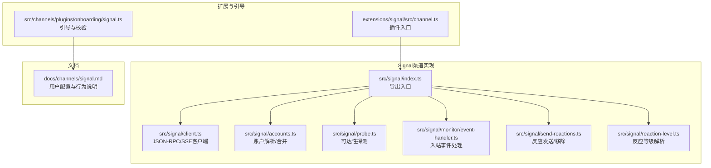
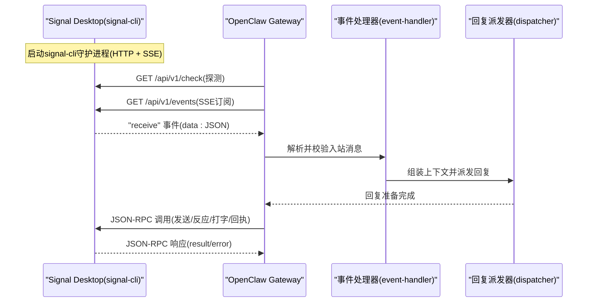
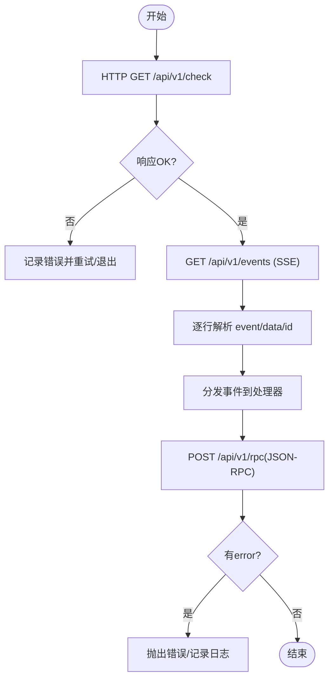
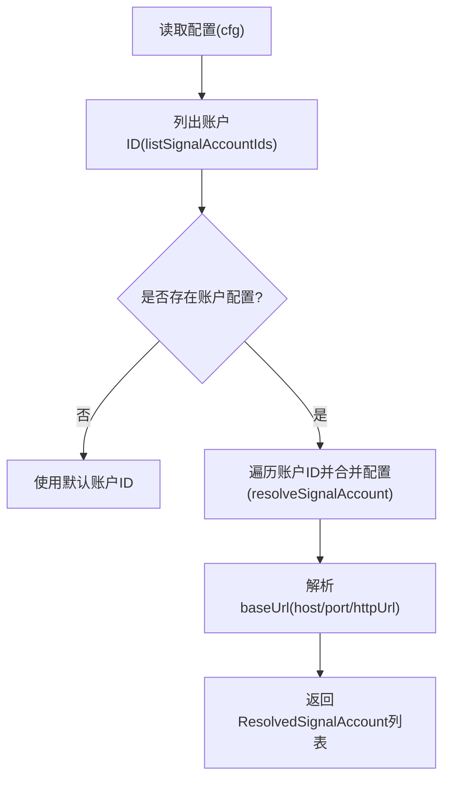
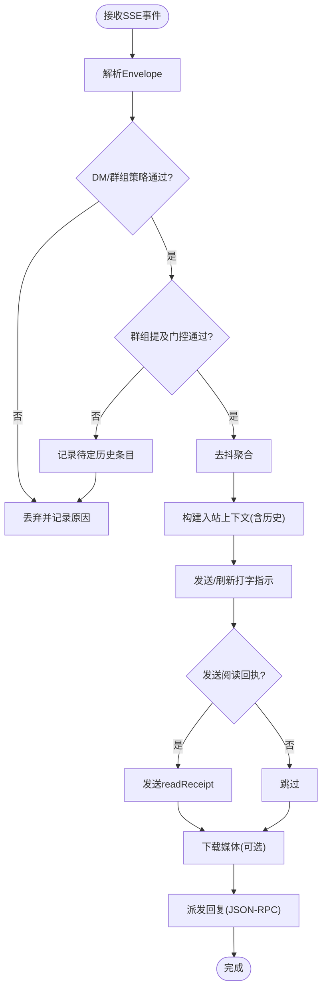
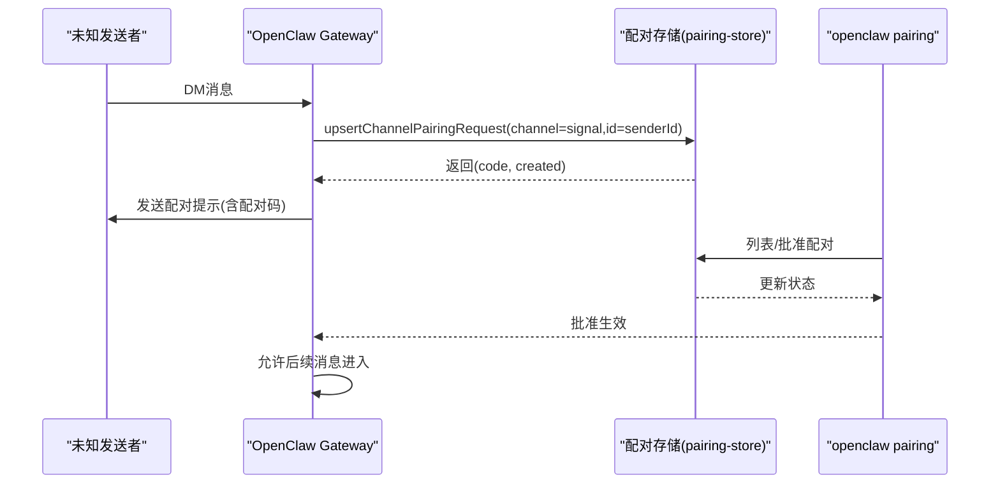
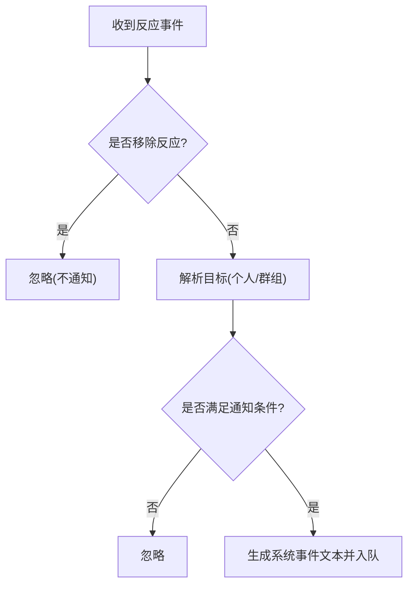
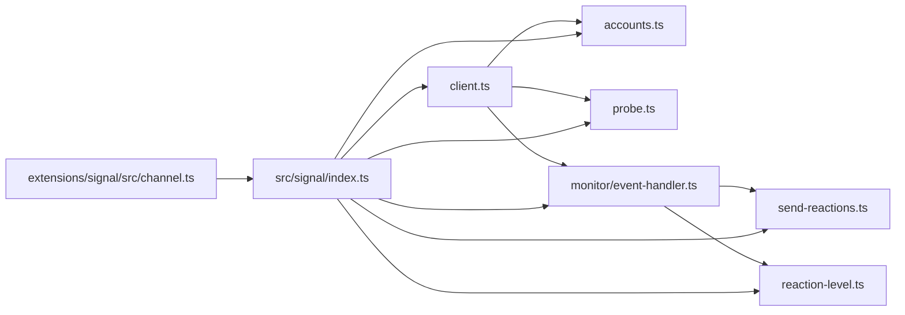

# Signal渠道集成

<cite>
**本文引用的文件**
- [docs/channels/signal.md](file://docs/channels/signal.md)
- [src/signal/index.ts](file://src/signal/index.ts)
- [src/signal/client.ts](file://src/signal/client.ts)
- [src/signal/accounts.ts](file://src/signal/accounts.ts)
- [src/signal/probe.ts](file://src/signal/probe.ts)
- [src/signal/monitor/event-handler.ts](file://src/signal/monitor/event-handler.ts)
- [src/signal/send-reactions.ts](file://src/signal/send-reactions.ts)
- [src/signal/reaction-level.ts](file://src/signal/reaction-level.ts)
- [extensions/signal/src/channel.ts](file://extensions/signal/src/channel.ts)
- [src/channels/plugins/onboarding/signal.ts](file://src/channels/plugins/onboarding/signal.ts)
</cite>

## 目录

1. [简介](#简介)
2. [项目结构](#项目结构)
3. [核心组件](#核心组件)
4. [架构总览](#架构总览)
5. [组件详解](#组件详解)
6. [依赖关系分析](#依赖关系分析)
7. [性能与可靠性](#性能与可靠性)
8. [故障排查指南](#故障排查指南)
9. [结论](#结论)
10. [附录](#附录)

## 简介

本文件面向OpenClaw的Signal渠道集成，聚焦于通过signal-cli提供的HTTP JSON-RPC与Server-Sent Events（SSE）实现的Signal Desktop桥接方案。文档系统性阐述WebSocket与SSE通信、消息同步与路由、消息发送/接收/阅读回执/已读标记、群组消息与联系人管理、设备配对流程，以及Signal特有的端到端加密与匿名性保护策略。同时给出集成架构图、通信协议说明、配置与安全隐私建议。

## 项目结构

Signal渠道相关代码主要分布在如下位置：

- 文档层：docs/channels/signal.md 提供用户级配置与行为说明
- 核心实现层：src/signal 下的客户端封装、账户解析、探测、事件处理、反应（表情）与反应等级解析
- 扩展层：extensions/signal/src/channel.ts 提供插件入口
- 引导与配置：src/channels/plugins/onboarding/signal.ts 提供引导式配置与校验

**图表来源**

- [src/signal/index.ts](file://src/signal/index.ts#L1-L6)
- [src/signal/client.ts](file://src/signal/client.ts#L1-L196)
- [src/signal/accounts.ts](file://src/signal/accounts.ts#L1-L92)
- [src/signal/probe.ts](file://src/signal/probe.ts#L1-L58)
- [src/signal/monitor/event-handler.ts](file://src/signal/monitor/event-handler.ts#L1-L675)
- [src/signal/send-reactions.ts](file://src/signal/send-reactions.ts#L1-L216)
- [src/signal/reaction-level.ts](file://src/signal/reaction-level.ts#L1-L72)
- [extensions/signal/src/channel.ts](file://extensions/signal/src/channel.ts)
- [src/channels/plugins/onboarding/signal.ts](file://src/channels/plugins/onboarding/signal.ts#L137-L182)

**章节来源**

- [docs/channels/signal.md](file://docs/channels/signal.md#L1-L229)
- [src/signal/index.ts](file://src/signal/index.ts#L1-L6)

## 核心组件

- JSON-RPC客户端与SSE事件流：封装signal-cli的HTTP接口调用与SSE事件订阅，负责心跳检查、方法调用与事件解析。
- 账户解析与合并：支持单账户与多账户配置，解析基础URL、端口、是否启用等。
- 入站事件处理器：统一解析Signal入站消息，执行访问控制（DM/群组）、提及门控、去抖、历史上下文拼接、会话记录、打字指示、阅读回执、媒体下载与占位符生成、回复派发。
- 反应与反应等级：支持发送/移除反应，按配置解析反应等级（关闭/仅ACK/最小/广泛）。
- 插件入口与引导：扩展层提供Signal插件入口，引导层提供配置项校验与规范化。

**章节来源**

- [src/signal/client.ts](file://src/signal/client.ts#L50-L196)
- [src/signal/accounts.ts](file://src/signal/accounts.ts#L57-L92)
- [src/signal/monitor/event-handler.ts](file://src/signal/monitor/event-handler.ts#L51-L675)
- [src/signal/send-reactions.ts](file://src/signal/send-reactions.ts#L91-L216)
- [src/signal/reaction-level.ts](file://src/signal/reaction-level.ts#L25-L72)
- [extensions/signal/src/channel.ts](file://extensions/signal/src/channel.ts)
- [src/channels/plugins/onboarding/signal.ts](file://src/channels/plugins/onboarding/signal.ts#L137-L182)

## 架构总览

OpenClaw通过signal-cli的HTTP JSON-RPC与SSE实现与Signal Desktop的桥接。Gateway作为客户端连接signal-cli，SSE用于接收入站事件，JSON-RPC用于发送消息、反应、打字指示、阅读回执等。

**图表来源**

- [src/signal/client.ts](file://src/signal/client.ts#L89-L196)
- [src/signal/monitor/event-handler.ts](file://src/signal/monitor/event-handler.ts#L316-L675)

## 组件详解

### 通信协议与桥接方式

- 探测与心跳
  - 使用HTTP GET /api/v1/check进行可达性探测，返回状态码与错误信息。
- 事件流
  - 使用SSE订阅 /api/v1/events，按行解析event/data/id字段，过滤注释行与空行，回调上层事件处理器。
- JSON-RPC
  - POST /api/v1/rpc，携带jsonrpc 2.0格式的请求，支持超时控制；成功返回result或抛出带code/message的错误对象。

**图表来源**

- [src/signal/client.ts](file://src/signal/client.ts#L89-L196)

**章节来源**

- [src/signal/client.ts](file://src/signal/client.ts#L89-L196)

### 账户解析与多账户支持

- 支持channels.signal.accounts多账户配置，按accountId合并基线配置与账户级配置。
- 自动推导默认账户ID，若未显式配置则使用默认ID。
- 解析httpUrl/httpHost/httpPort/cliPath等，形成统一的baseUrl。

**图表来源**

- [src/signal/accounts.ts](file://src/signal/accounts.ts#L22-L92)

**章节来源**

- [src/signal/accounts.ts](file://src/signal/accounts.ts#L57-L92)

### 入站消息处理与路由

- 解析入站Envelope，区分DM与群组，执行以下流程：
  - 访问控制：DM策略（禁用/开放/白名单/配对），群组策略（禁用/开放/白名单）
  - 提及门控：在群组场景下，基于mentionPatterns与requireMention判定是否需要@提及
  - 去抖：对非控制命令文本消息进行去抖聚合，减少重复派发
  - 历史上下文：群组消息拼接最近N条上下文，支持占位符
  - 会话记录：更新会话元数据，记录上次路由
  - 打字指示：触发typing信号并在回复过程中刷新
  - 阅读回执：在DM且未由daemon转发时，按时间戳发送readReceipt
  - 媒体处理：按配置下载附件并生成占位符
  - 回复派发：交由回复派发器，最终通过JSON-RPC发送

**图表来源**

- [src/signal/monitor/event-handler.ts](file://src/signal/monitor/event-handler.ts#L446-L675)

**章节来源**

- [src/signal/monitor/event-handler.ts](file://src/signal/monitor/event-handler.ts#L51-L675)

### 消息发送、接收、阅读回执与已读标记

- 发送：通过JSON-RPC调用signal-cli发送消息，支持文本分片、媒体大小限制、占位符提示。
- 接收：SSE事件流持续推送receive事件，事件解析后进入入站处理链路。
- 阅读回执：在DM场景下，若未由daemon转发，按消息时间戳发送readReceipt。
- 已读标记：Signal Desktop侧通常由客户端维护；OpenClaw不直接模拟客户端标记，但可转发readReceipt以提升一致性。

**章节来源**

- [src/signal/client.ts](file://src/signal/client.ts#L50-L112)
- [src/signal/monitor/event-handler.ts](file://src/signal/monitor/event-handler.ts#L629-L652)

### 群组消息处理与联系人管理

- 群组策略：disabled/open/allowlist；allowlist需配置groupAllowFrom。
- 提及门控：当requireMention开启且存在mentionPattern时，未@提及的消息会被跳过并记录待定历史。
- 联系人管理：通过allowFrom与groupAllowFrom控制来源；UUID与E.164均可表示联系人；支持从sourceUuid写入uuid:<id>。
- 设备配对：DM策略为pairing时，未知发送者会收到一次性配对码，批准后方可通信。

**章节来源**

- [src/signal/monitor/event-handler.ts](file://src/signal/monitor/event-handler.ts#L446-L498)
- [src/channels/plugins/onboarding/signal.ts](file://src/channels/plugins/onboarding/signal.ts#L137-L182)
- [docs/channels/signal.md](file://docs/channels/signal.md#L103-L120)

### 设备配对流程

- 未知发送者首次DM时，系统生成配对请求与一次性配对码，自动发送配对提示消息。
- 用户可通过CLI查询与批准配对请求，批准后允许后续消息进入。
- 配对码具备TTL与过期策略，避免长期挂起。

**图表来源**

- [src/signal/monitor/event-handler.ts](file://src/signal/monitor/event-handler.ts#L451-L478)

**章节来源**

- [src/signal/monitor/event-handler.ts](file://src/signal/monitor/event-handler.ts#L446-L484)
- [docs/channels/signal.md](file://docs/channels/signal.md#L103-L113)

### 反应（表情）与反应等级

- 发送/移除反应：支持针对个人或群组消息，要求targetAuthor或groupId，emoji必填。
- 反应等级：off/ack/minimal/extensive，决定是否允许智能体自动反应与反应密度。
- 通知：当满足条件时，系统事件会记录反应添加动作，便于审计与可视化。

**图表来源**

- [src/signal/monitor/event-handler.ts](file://src/signal/monitor/event-handler.ts#L366-L424)
- [src/signal/send-reactions.ts](file://src/signal/send-reactions.ts#L91-L148)
- [src/signal/reaction-level.ts](file://src/signal/reaction-level.ts#L25-L72)

**章节来源**

- [src/signal/send-reactions.ts](file://src/signal/send-reactions.ts#L91-L216)
- [src/signal/reaction-level.ts](file://src/signal/reaction-level.ts#L25-L72)

### 与Signal Desktop的交互方式

- OpenClaw不直接嵌入libsignal，而是通过signal-cli的HTTP服务进行桥接。
- 通过SSE接收入站事件，通过JSON-RPC发送出站消息与控制指令（如发送反应、打字、回执）。
- 支持外部守护进程模式，通过httpUrl指向独立运行的signal-cli实例，便于容器化与资源隔离。

**章节来源**

- [docs/channels/signal.md](file://docs/channels/signal.md#L11-L12)
- [src/signal/client.ts](file://src/signal/client.ts#L114-L196)

## 依赖关系分析

- 模块内聚与耦合
  - client.ts提供通用HTTP与SSE封装，被accounts.ts、probe.ts、monitor/event-handler.ts复用。
  - monitor/event-handler.ts是核心编排模块，依赖accounts、client、send等子功能。
  - send-reactions与reaction-level相互协作，前者负责调用，后者负责策略解析。
- 外部依赖
  - signal-cli HTTP API（/api/v1/check、/api/v1/events、/api/v1/rpc）
  - 浏览器/Node环境下的fetch实现（通过通用fetch封装）

**图表来源**

- [src/signal/client.ts](file://src/signal/client.ts#L1-L196)
- [src/signal/accounts.ts](file://src/signal/accounts.ts#L1-L92)
- [src/signal/probe.ts](file://src/signal/probe.ts#L1-L58)
- [src/signal/monitor/event-handler.ts](file://src/signal/monitor/event-handler.ts#L1-L675)
- [src/signal/send-reactions.ts](file://src/signal/send-reactions.ts#L1-L216)
- [src/signal/reaction-level.ts](file://src/signal/reaction-level.ts#L1-L72)
- [src/signal/index.ts](file://src/signal/index.ts#L1-L6)
- [extensions/signal/src/channel.ts](file://extensions/signal/src/channel.ts)

**章节来源**

- [src/signal/index.ts](file://src/signal/index.ts#L1-L6)

## 性能与可靠性

- 启动与超时
  - 支持自定义startupTimeoutMs，避免长时间阻塞启动过程。
  - 外部守护进程模式可规避JVM冷启动开销。
- 去抖与批处理
  - 对非控制命令文本消息进行去抖聚合，降低重复派发与回复成本。
- 媒体与限流
  - 文本分片与换行优先策略，媒体大小限制与可选忽略，避免过大负载。
- 可靠性
  - SSE事件解析严格过滤注释与空行，异常事件记录日志并继续消费。
  - JSON-RPC调用带超时与错误包装，便于上层捕获与重试。

**章节来源**

- [docs/channels/signal.md](file://docs/channels/signal.md#L101-L134)
- [src/signal/monitor/event-handler.ts](file://src/signal/monitor/event-handler.ts#L270-L314)
- [src/signal/client.ts](file://src/signal/client.ts#L29-L87)

## 故障排查指南

- 基础排查步骤
  - 使用status、gateway status、logs --follow、doctor、channels status --probe进行端到端诊断。
  - 检查配对状态：openclaw pairing list signal，确认配对码是否过期或被拒绝。
- 常见问题定位
  - 守护进程可达但无回复：核对account、httpUrl、receiveMode与daemon状态。
  - DM被忽略：检查dmPolicy与allowFrom，确认是否需要配对批准。
  - 群组消息被忽略：检查groupPolicy与groupAllowFrom，确认是否满足提及门控。

**章节来源**

- [docs/channels/signal.md](file://docs/channels/signal.md#L171-L196)

## 结论

OpenClaw通过signal-cli的HTTP JSON-RPC与SSE实现了稳定可靠的Signal Desktop桥接。其设计强调：

- 明确的访问控制与配对机制，保障DM安全；
- 群组场景下的提及门控与历史上下文，提升对话质量；
- 反应等级与通知策略，平衡自动化与用户体验；
- 多账户与外部守护进程支持，满足生产部署需求。

## 附录

### Signal渠道配置要点

- 必填项：account（机器人号码）、cliPath或httpUrl
- DM策略：pairing（默认）、allowlist、open、disabled
- 群组策略：open、allowlist、disabled
- 媒体与分片：textChunkLimit、chunkMode、mediaMaxMb、ignoreAttachments
- 行为开关：sendReadReceipts、ignoreStories、receiveMode、startupTimeoutMs

**章节来源**

- [docs/channels/signal.md](file://docs/channels/signal.md#L197-L229)

### 安全与隐私建议

- 使用独立的机器人号码，避免与个人号混用导致回环与误判。
- 采用配对策略管理未知发送者，定期清理过期配对请求。
- 合理设置群组提及门控，避免无关消息干扰。
- 限制媒体下载与大小，降低资源占用与泄露风险。
- 外部守护进程模式下，确保网络访问控制与TLS传输（如需）。

**章节来源**

- [docs/channels/signal.md](file://docs/channels/signal.md#L55-L60)
- [docs/channels/signal.md](file://docs/channels/signal.md#L103-L120)
