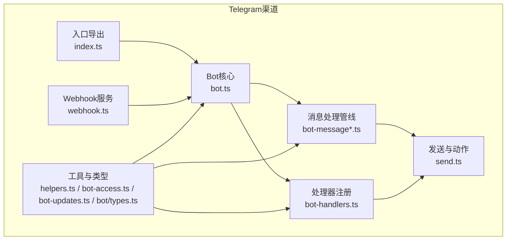
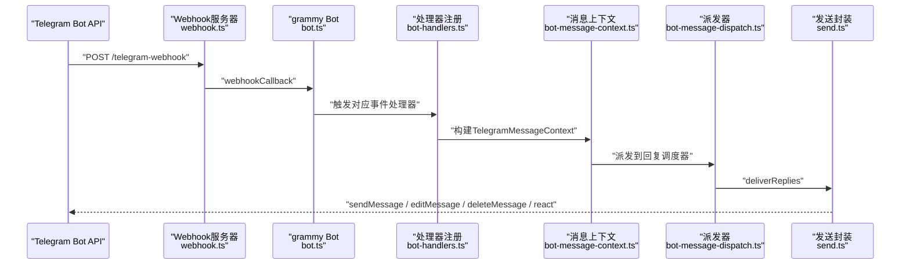
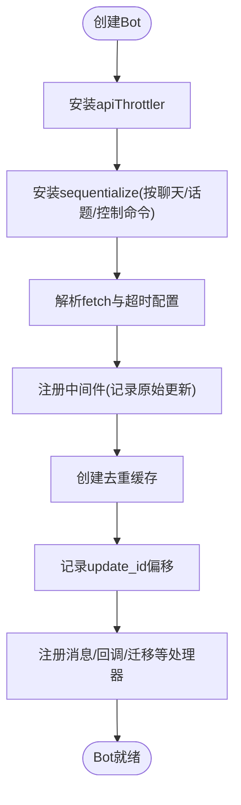
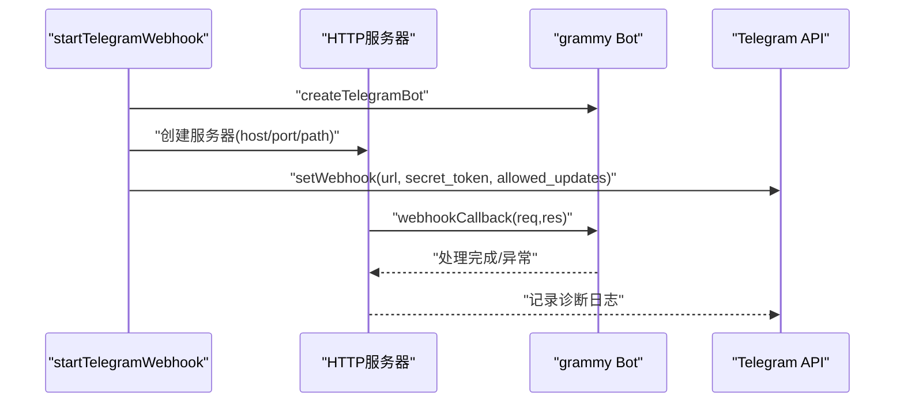
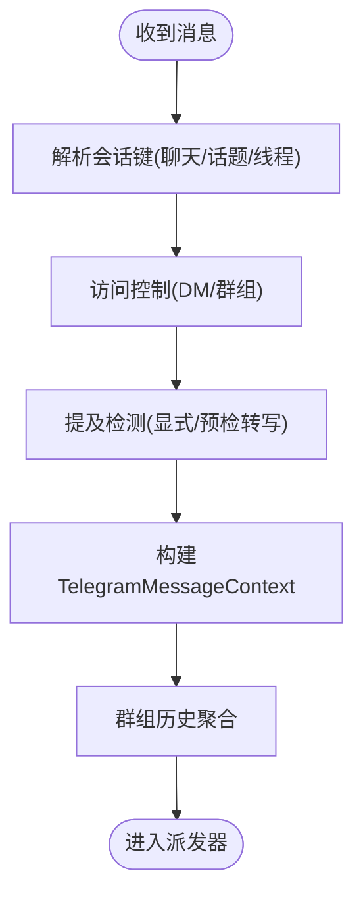
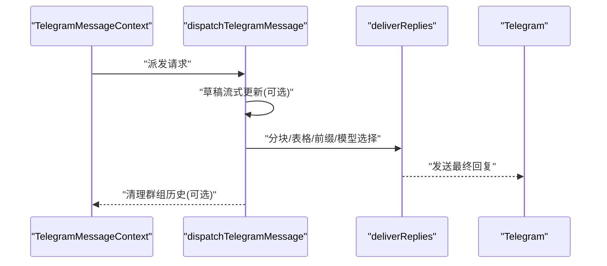
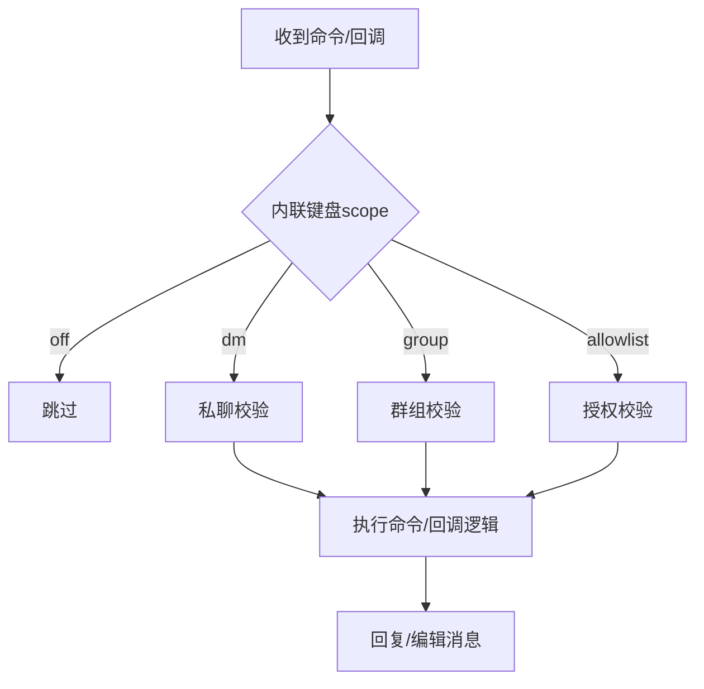
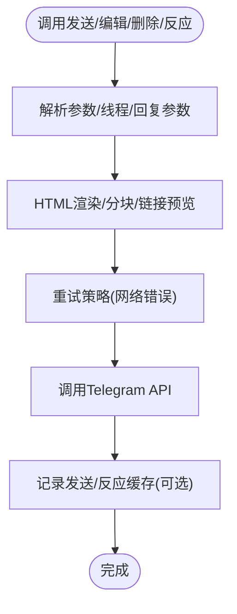
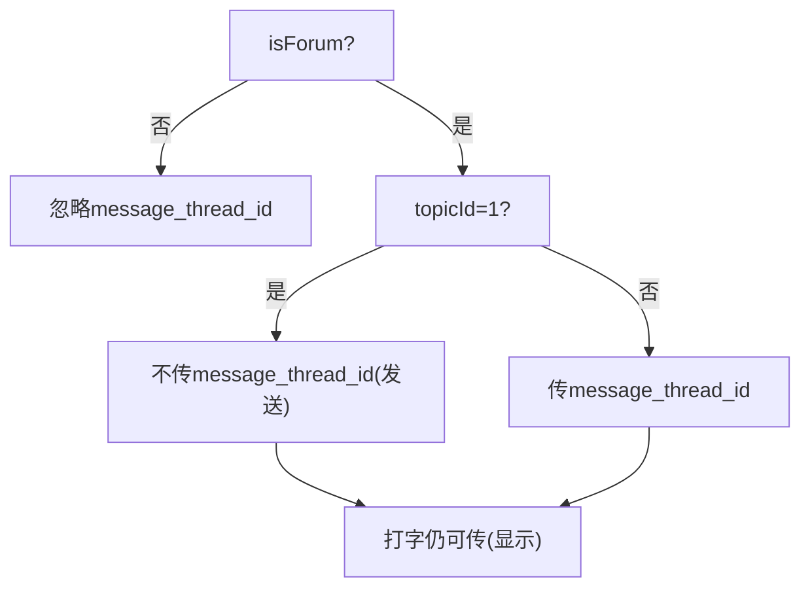
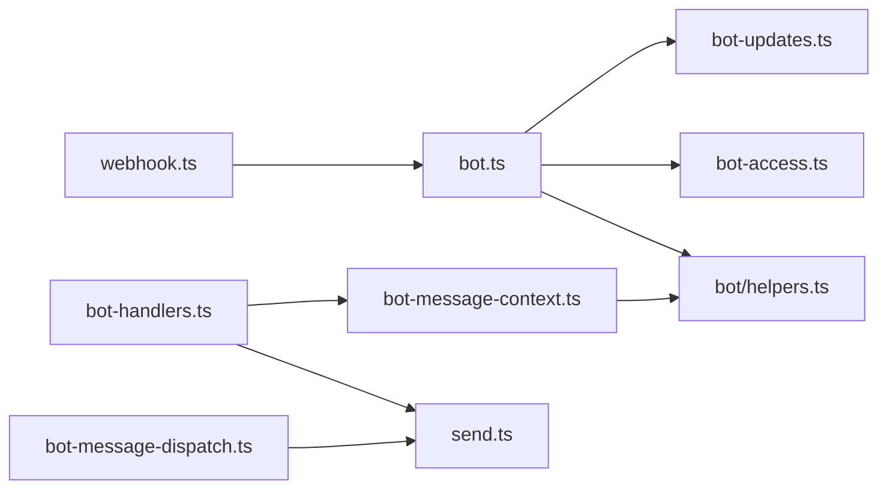

# Telegram渠道集成

<cite>
**本文档引用的文件**
- [src/telegram/index.ts](file://src/telegram/index.ts)
- [src/telegram/bot.ts](file://src/telegram/bot.ts)
- [src/telegram/webhook.ts](file://src/telegram/webhook.ts)
- [src/telegram/send.ts](file://src/telegram/send.ts)
- [src/telegram/bot-message.ts](file://src/telegram/bot-message.ts)
- [src/telegram/bot-message-context.ts](file://src/telegram/bot-message-context.ts)
- [src/telegram/bot-message-dispatch.ts](file://src/telegram/bot-message-dispatch.ts)
- [src/telegram/bot-handlers.ts](file://src/telegram/bot-handlers.ts)
- [src/telegram/bot-updates.ts](file://src/telegram/bot-updates.ts)
- [src/telegram/bot-access.ts](file://src/telegram/bot-access.ts)
- [src/telegram/bot/helpers.ts](file://src/telegram/bot/helpers.ts)
- [src/telegram/bot/types.ts](file://src/telegram/bot/types.ts)
- [src/telegram/bot-native-commands.ts](file://src/telegram/bot-native-commands.ts)
- [docs/channels/telegram.md](file://docs/channels/telegram.md)
- [src/telegram/probe.test.ts](file://src/telegram/probe.test.ts)
- [src/telegram/webhook.test.ts](file://src/telegram/webhook.test.ts)
</cite>

## 目录

1. [简介](#简介)
2. [项目结构](#项目结构)
3. [核心组件](#核心组件)
4. [架构总览](#架构总览)
5. [详细组件分析](#详细组件分析)
6. [依赖关系分析](#依赖关系分析)
7. [性能考虑](#性能考虑)
8. [故障排除指南](#故障排除指南)
9. [结论](#结论)
10. [附录](#附录)

## 简介

本文件面向OpenClaw的Telegram渠道集成，系统性阐述基于grammy框架的Bot API集成、Webhook配置、消息监听机制，以及消息发送、接收、编辑、删除等操作实现。文档覆盖群组消息与私聊消息处理、媒体文件处理、Inline键盘交互、Telegram特有能力（话题系统、线程管理、文件大小限制）等，并提供架构图、API调用示例路径与与核心系统的数据交换格式说明，最后给出配置指南与故障排除方法。

## 项目结构

OpenClaw的Telegram集成位于src/telegram目录，采用按职责分层的模块化设计：

- 入口与导出：index.ts统一导出对外接口（创建Bot、Webhook回调、监控、发送与反应）
- Bot核心：bot.ts负责创建grammy Bot实例、注册中间件、去重、更新偏移记录、序列化执行、命令与事件处理注册
- Webhook：webhook.ts提供本地HTTP服务器与grammy webhook回调封装，自动设置Webhook并记录诊断日志
- 消息处理：bot-message.ts、bot-message-context.ts、bot-message-dispatch.ts构成消息上下文构建、路由与派发管线
- 处理器：bot-handlers.ts注册各类grammy事件处理器（消息、回调查询、迁移、文本片段合并、媒体组等）
- 工具与类型：helpers.ts、bot-access.ts、bot-updates.ts、bot/types.ts提供线程/话题解析、访问控制、去重缓存、上下文类型定义
- 发送与动作：send.ts提供sendMessage、react、editMessage、deleteMessage等动作封装，含HTML渲染、分块、重试、线程参数处理
- 文档参考：docs/channels/telegram.md提供配置项、行为、限制与故障排除的权威说明

图表来源

- [src/telegram/index.ts](file://src/telegram/index.ts#L1-L4)
- [src/telegram/bot.ts](file://src/telegram/bot.ts#L112-L494)
- [src/telegram/webhook.ts](file://src/telegram/webhook.ts#L19-L127)
- [src/telegram/bot-message.ts](file://src/telegram/bot-message.ts#L27-L92)
- [src/telegram/bot-message-context.ts](file://src/telegram/bot-message-context.ts#L129-L740)
- [src/telegram/bot-message-dispatch.ts](file://src/telegram/bot-message-dispatch.ts#L60-L357)
- [src/telegram/bot-handlers.ts](file://src/telegram/bot-handlers.ts#L45-L938)
- [src/telegram/send.ts](file://src/telegram/send.ts#L232-L800)
- [src/telegram/bot/helpers.ts](file://src/telegram/bot/helpers.ts#L18-L118)
- [src/telegram/bot-access.ts](file://src/telegram/bot-access.ts#L12-L95)
- [src/telegram/bot-updates.ts](file://src/telegram/bot-updates.ts#L31-L57)
- [src/telegram/bot/types.ts](file://src/telegram/bot/types.ts#L3-L30)

章节来源

- [src/telegram/index.ts](file://src/telegram/index.ts#L1-L4)
- [src/telegram/bot.ts](file://src/telegram/bot.ts#L112-L494)
- [src/telegram/webhook.ts](file://src/telegram/webhook.ts#L19-L127)
- [src/telegram/bot-message.ts](file://src/telegram/bot-message.ts#L27-L92)
- [src/telegram/bot-message-context.ts](file://src/telegram/bot-message-context.ts#L129-L740)
- [src/telegram/bot-message-dispatch.ts](file://src/telegram/bot-message-dispatch.ts#L60-L357)
- [src/telegram/bot-handlers.ts](file://src/telegram/bot-handlers.ts#L45-L938)
- [src/telegram/send.ts](file://src/telegram/send.ts#L232-L800)
- [src/telegram/bot/helpers.ts](file://src/telegram/bot/helpers.ts#L18-L118)
- [src/telegram/bot-access.ts](file://src/telegram/bot-access.ts#L12-L95)
- [src/telegram/bot-updates.ts](file://src/telegram/bot-updates.ts#L31-L57)
- [src/telegram/bot/types.ts](file://src/telegram/bot/types.ts#L3-L30)

## 核心组件

- Bot创建与初始化：创建grammy Bot实例，启用apiThrottler与sequentialize，注入fetch与超时配置，注册中间件与错误捕获，建立去重与更新偏移记录
- Webhook服务：启动本地HTTP服务器，注册grammy webhook回调，自动调用setWebhook并配置secret_token与allowed_updates
- 消息处理管线：构建TelegramMessageContext，解析会话键、话题/线程、回复目标、转发/引用上下文，进行访问控制与提及检测，派发到回复调度器
- 命令与插件：注册原生命令菜单与处理器，支持插件命令与自定义命令；处理模型选择、分页、内联键盘回调
- 发送与动作：封装sendMessage、react、editMessage、deleteMessage，处理HTML渲染、分块、链接预览、线程参数、重试策略与网络错误恢复
- 工具与类型：提供线程/话题解析、访问控制、去重缓存、上下文类型定义与辅助函数

章节来源

- [src/telegram/bot.ts](file://src/telegram/bot.ts#L112-L494)
- [src/telegram/webhook.ts](file://src/telegram/webhook.ts#L19-L127)
- [src/telegram/bot-message.ts](file://src/telegram/bot-message.ts#L27-L92)
- [src/telegram/bot-message-context.ts](file://src/telegram/bot-message-context.ts#L129-L740)
- [src/telegram/bot-message-dispatch.ts](file://src/telegram/bot-message-dispatch.ts#L60-L357)
- [src/telegram/bot-handlers.ts](file://src/telegram/bot-handlers.ts#L279-L623)
- [src/telegram/send.ts](file://src/telegram/send.ts#L232-L800)
- [src/telegram/bot/helpers.ts](file://src/telegram/bot/helpers.ts#L18-L118)
- [src/telegram/bot-access.ts](file://src/telegram/bot-access.ts#L12-L95)
- [src/telegram/bot-updates.ts](file://src/telegram/bot-updates.ts#L31-L57)
- [src/telegram/bot/types.ts](file://src/telegram/bot/types.ts#L3-L30)

## 架构总览

下图展示从Telegram Bot API到OpenClaw内部处理再到外部回复的整体流程，包括长轮询与Webhook两种模式：

图表来源

- [src/telegram/webhook.ts](file://src/telegram/webhook.ts#L46-L110)
- [src/telegram/bot.ts](file://src/telegram/bot.ts#L146-L153)
- [src/telegram/bot-handlers.ts](file://src/telegram/bot-handlers.ts#L677-L783)
- [src/telegram/bot-message-context.ts](file://src/telegram/bot-message-context.ts#L129-L740)
- [src/telegram/bot-message-dispatch.ts](file://src/telegram/bot-message-dispatch.ts#L60-L357)
- [src/telegram/send.ts](file://src/telegram/send.ts#L232-L592)

## 详细组件分析

### Bot创建与初始化

- 创建grammy Bot实例，注入apiThrottler与sequentialize以保障并发与顺序一致性
- 支持通过fetch与timeoutSeconds配置客户端，兼容Node 22+ undici
- 注册中间件记录原始更新，使用去重缓存避免重复处理
- 记录update_id偏移，确保重启后不重复消费历史更新
- 注册消息反应处理器，按配置生成系统事件

图表来源

- [src/telegram/bot.ts](file://src/telegram/bot.ts#L146-L183)
- [src/telegram/bot-updates.ts](file://src/telegram/bot-updates.ts#L50-L57)

章节来源

- [src/telegram/bot.ts](file://src/telegram/bot.ts#L112-L183)
- [src/telegram/bot-updates.ts](file://src/telegram/bot-updates.ts#L31-L57)

### Webhook配置与监听

- 启动本地HTTP服务器，仅接受指定路径与POST请求
- 自动调用setWebhook，配置secret_token与allowed_updates
- 记录诊断心跳与处理耗时，异常时返回500并记录错误
- 提供健康检查端点与可选publicUrl

图表来源

- [src/telegram/webhook.ts](file://src/telegram/webhook.ts#L19-L127)

章节来源

- [src/telegram/webhook.ts](file://src/telegram/webhook.ts#L19-L127)

### 消息接收与上下文构建

- 解析会话键：按聊天ID与话题ID组合，私聊保留message_thread_id用于线程会话
- 访问控制：DM策略（pairing/allowlist/open/disabled），群组允许列表与覆盖
- 提及检测：支持显式@bot用户名与正则匹配，支持音频预检转写
- 上下文丰富：转发来源、回复引用、位置信息、贴纸缓存描述
- 历史聚合：群组消息历史拼接，支持历史清理

图表来源

- [src/telegram/bot-message-context.ts](file://src/telegram/bot-message-context.ts#L129-L740)
- [src/telegram/bot/helpers.ts](file://src/telegram/bot/helpers.ts#L18-L118)

章节来源

- [src/telegram/bot-message-context.ts](file://src/telegram/bot-message-context.ts#L129-L740)
- [src/telegram/bot/helpers.ts](file://src/telegram/bot/helpers.ts#L18-L118)

### 派发与回复

- 草稿流式回复：私聊+话题+启用草稿流时，按partial/block模式增量更新草稿
- 分块与表格：根据配置解析Markdown表格模式与分块模式
- 回复前缀与模型选择：支持回复前缀选项与模型选择回调
- 最终回复：若跳过非静默回复，发送空响应兜底

图表来源

- [src/telegram/bot-message-dispatch.ts](file://src/telegram/bot-message-dispatch.ts#L60-L357)
- [src/telegram/send.ts](file://src/telegram/send.ts#L232-L592)

章节来源

- [src/telegram/bot-message-dispatch.ts](file://src/telegram/bot-message-dispatch.ts#L60-L357)
- [src/telegram/send.ts](file://src/telegram/send.ts#L232-L592)

### 命令与内联键盘

- 原生命令：注册setMyCommands，支持插件命令与自定义命令，冲突检测与截断
- 内联键盘：支持scope控制（off/dm/group/all/allowlist），处理分页与模型选择回调
- 回调处理：解析callback_data为合成消息，注入forceWasMentioned与messageIdOverride

图表来源

- [src/telegram/bot-native-commands.ts](file://src/telegram/bot-native-commands.ts#L274-L737)
- [src/telegram/bot-handlers.ts](file://src/telegram/bot-handlers.ts#L279-L623)

章节来源

- [src/telegram/bot-native-commands.ts](file://src/telegram/bot-native-commands.ts#L274-L737)
- [src/telegram/bot-handlers.ts](file://src/telegram/bot-handlers.ts#L279-L623)

### 发送、编辑、删除与反应

- sendMessage：支持HTML渲染、链接预览、回复参数、线程参数、媒体发送（图片/视频/音频/GIF/文档）、视频/语音笔记
- editMessage：支持HTML回退、内联键盘更新
- deleteMessage：删除指定消息
- react：设置或移除消息反应，带错误处理

图表来源

- [src/telegram/send.ts](file://src/telegram/send.ts#L232-L800)

章节来源

- [src/telegram/send.ts](file://src/telegram/send.ts#L232-L800)

### 话题系统与线程管理

- 话题解析：论坛群组默认通用话题ID=1，发送时需特殊处理（id=1时不传message_thread_id）
- 线程参数：构建发送与打字指示的线程参数，通用话题需要message_thread_id才显示打字
- 私聊线程：保留message_thread_id作为会话键的一部分

图表来源

- [src/telegram/bot/helpers.ts](file://src/telegram/bot/helpers.ts#L18-L82)

章节来源

- [src/telegram/bot/helpers.ts](file://src/telegram/bot/helpers.ts#L18-L82)

### 文件大小限制与媒体处理

- 下载限制：通过mediaMaxBytes限制下载/处理大小
- 媒体类型：图片、视频、音频、GIF、文档；视频/语音笔记特殊处理
- 贴纸缓存：对未缓存贴纸进行视觉描述并缓存，后续命中直接替换正文

章节来源

- [src/telegram/bot.ts](file://src/telegram/bot.ts#L260-L261)
- [src/telegram/send.ts](file://src/telegram/send.ts#L385-L570)
- [src/telegram/bot-message-context.ts](file://src/telegram/bot-message-context.ts#L194-L243)

## 依赖关系分析

- 组件耦合：bot.ts为核心，依赖helpers.ts、bot-access.ts、bot-updates.ts；handlers依赖bot-message-context与send；dispatch依赖deliverReplies
- 外部依赖：grammy、@grammyjs/runner、@grammyjs/transformer-throttler、@grammyjs/types
- 配置依赖：OpenClaw配置系统、会话存储、通道活动记录、诊断开关

图表来源

- [src/telegram/bot.ts](file://src/telegram/bot.ts#L1-L50)
- [src/telegram/bot-handlers.ts](file://src/telegram/bot-handlers.ts#L1-L50)
- [src/telegram/bot-message-context.ts](file://src/telegram/bot-message-context.ts#L1-L50)
- [src/telegram/bot-message-dispatch.ts](file://src/telegram/bot-message-dispatch.ts#L1-L30)
- [src/telegram/webhook.ts](file://src/telegram/webhook.ts#L1-L20)
- [src/telegram/bot/helpers.ts](file://src/telegram/bot/helpers.ts#L1-L10)
- [src/telegram/bot-access.ts](file://src/telegram/bot-access.ts#L1-L10)
- [src/telegram/bot-updates.ts](file://src/telegram/bot-updates.ts#L1-L10)
- [src/telegram/send.ts](file://src/telegram/send.ts#L1-L35)

章节来源

- [src/telegram/bot.ts](file://src/telegram/bot.ts#L1-L50)
- [src/telegram/bot-handlers.ts](file://src/telegram/bot-handlers.ts#L1-L50)
- [src/telegram/bot-message-context.ts](file://src/telegram/bot-message-context.ts#L1-L50)
- [src/telegram/bot-message-dispatch.ts](file://src/telegram/bot-message-dispatch.ts#L1-L30)
- [src/telegram/webhook.ts](file://src/telegram/webhook.ts#L1-L20)
- [src/telegram/bot/helpers.ts](file://src/telegram/bot/helpers.ts#L1-L10)
- [src/telegram/bot-access.ts](file://src/telegram/bot-access.ts#L1-L10)
- [src/telegram/bot-updates.ts](file://src/telegram/bot-updates.ts#L1-L10)
- [src/telegram/send.ts](file://src/telegram/send.ts#L1-L35)

## 性能考虑

- 并发与顺序：sequentialize按聊天/话题/控制命令串行，避免竞态；runner sink并发由agents.defaults.maxConcurrent控制
- 去重与偏移：去重缓存与update_id偏移减少重复处理与重启抖动
- 草稿流式：私聊草稿流式更新降低等待时间，block模式按块分片提升稳定性
- 重试策略：网络错误自动重试，HTML解析失败自动降级为纯文本
- 诊断与日志：诊断心跳与错误日志便于定位性能瓶颈

## 故障排除指南

- Bot无响应/隐私模式：在BotFather中关闭隐私模式或设为管理员；重新加入群组使变更生效
- 命令不可用：检查DNS/HTTPS可达性；setMyCommands失败通常为网络问题
- Polling不稳定：Node 22+与AbortSignal类型不匹配可能导致立即中止；IPv6解析失败导致间歇性API失败
- Webhook配置：确认webhookUrl、webhookSecret与webhookPath；反向代理需正确转发请求
- 重试与探测：使用probeTelegram进行连通性测试，验证getMe与getWebhookInfo

章节来源

- [docs/channels/telegram.md](file://docs/channels/telegram.md#L626-L670)
- [src/telegram/probe.test.ts](file://src/telegram/probe.test.ts#L1-L95)
- [src/telegram/webhook.test.ts](file://src/telegram/webhook.test.ts#L58-L84)

## 结论

OpenClaw的Telegram集成以grammy为核心，结合严格的访问控制、话题/线程管理、内联键盘与命令系统、完善的发送/编辑/删除/反应能力，以及Webhook与长轮询双模式支持，实现了生产级别的消息处理与交互体验。通过模块化设计与清晰的依赖关系，系统具备良好的可维护性与扩展性。

## 附录

### 配置参考与示例路径

- 基础配置与快速设置：参见文档中的“Quick setup”与“Telegram侧设置”
- 访问控制与激活：dmPolicy、allowFrom、groupPolicy、groupAllowFrom、groups、topics
- 流式与草稿：streamMode、draftChunk、blockStreaming、textChunkLimit、chunkMode
- 媒体与网络：mediaMaxMb、timeoutSeconds、retry、network.autoSelectFamily、proxy
- Webhook：webhookUrl、webhookSecret、webhookPath
- 动作与能力：capabilities.inlineButtons、actions.\*、reactionNotifications、reactionLevel
- 历史与写入：configWrites、historyLimit、dmHistoryLimit、dms.\*.historyLimit

章节来源

- [docs/channels/telegram.md](file://docs/channels/telegram.md#L24-L697)

### API调用示例路径

- 创建Webhook回调：[createTelegramWebhookCallback](file://src/telegram/bot.ts#L496-L498)
- 启动Webhook服务：[startTelegramWebhook](file://src/telegram/webhook.ts#L19-L127)
- 发送消息：[sendMessageTelegram](file://src/telegram/send.ts#L232-L592)
- 编辑消息：[editMessageTelegram](file://src/telegram/send.ts#L704-L785)
- 删除消息：[deleteMessageTelegram](file://src/telegram/send.ts#L656-L689)
- 设置反应：[reactMessageTelegram](file://src/telegram/send.ts#L594-L646)
