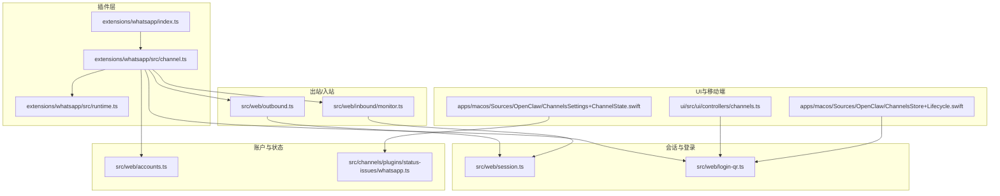
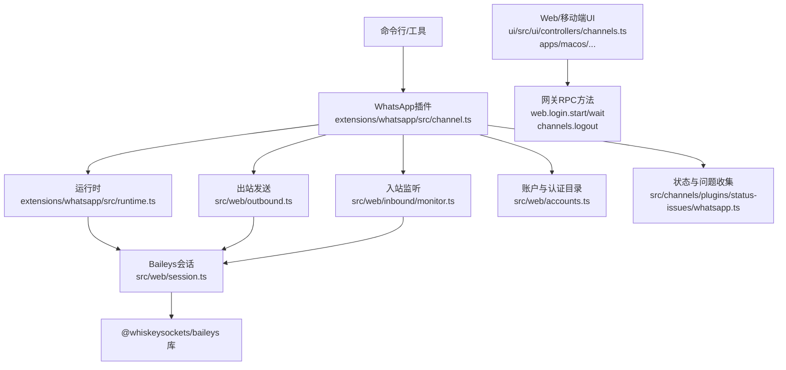
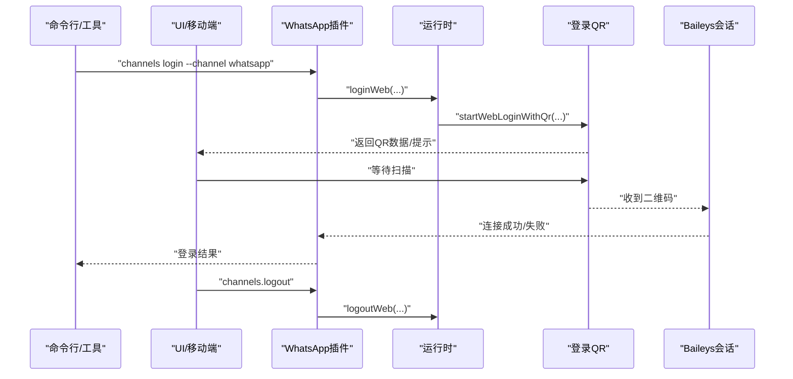
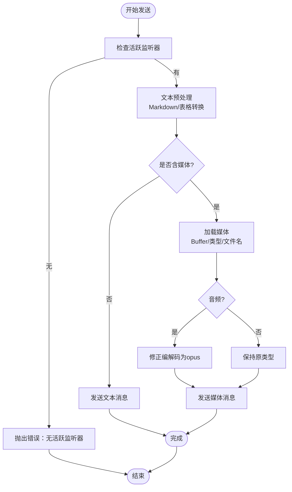
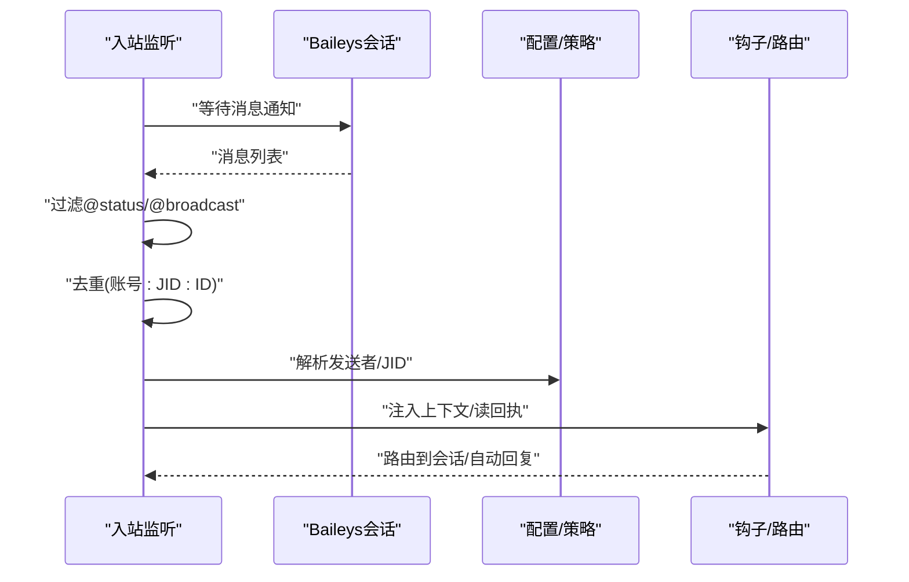
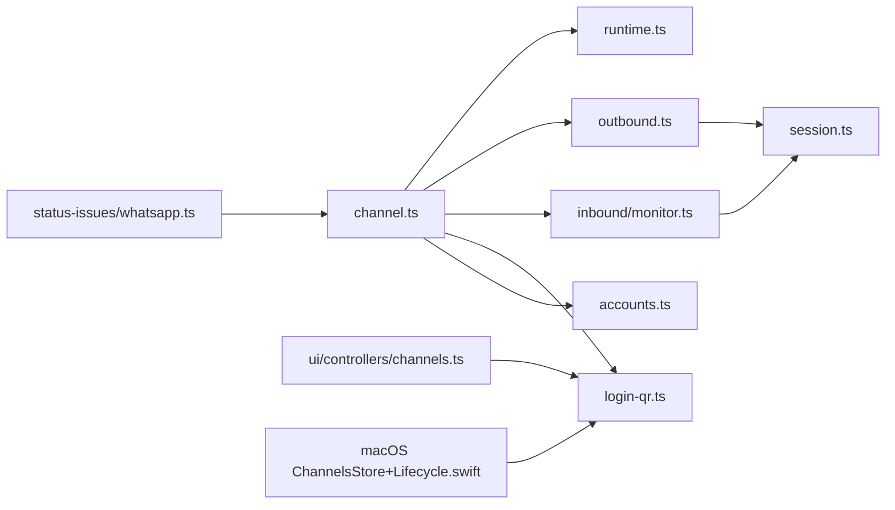

# WhatsApp渠道集成

<cite>
**本文引用的文件**
- [docs/channels/whatsapp.md](file://docs/channels/whatsapp.md)
- [extensions/whatsapp/index.ts](file://extensions/whatsapp/index.ts)
- [extensions/whatsapp/src/channel.ts](file://extensions/whatsapp/src/channel.ts)
- [extensions/whatsapp/src/runtime.ts](file://extensions/whatsapp/src/runtime.ts)
- [src/web/session.ts](file://src/web/session.ts)
- [src/web/login-qr.ts](file://src/web/login-qr.ts)
- [src/web/outbound.ts](file://src/web/outbound.ts)
- [src/web/inbound/monitor.ts](file://src/web/inbound/monitor.ts)
- [src/channels/plugins/agent-tools/whatsapp-login.ts](file://src/channels/plugins/agent-tools/whatsapp-login.ts)
- [ui/src/ui/controllers/channels.ts](file://ui/src/ui/controllers/channels.ts)
- [apps/macos/Sources/OpenClaw/ChannelsStore+Lifecycle.swift](file://apps/macos/Sources/OpenClaw/ChannelsStore+Lifecycle.swift)
- [apps/macos/Sources/OpenClaw/ChannelsSettings+ChannelState.swift](file://apps/macos/Sources/OpenClaw/ChannelsSettings+ChannelState.swift)
- [src/web/accounts.ts](file://src/web/accounts.ts)
- [src/web/accounts.whatsapp-auth.test.ts](file://src/web/accounts.whatsapp-auth.test.ts)
- [src/web/auto-reply/heartbeat-runner.ts](file://src/web/auto-reply/heartbeat-runner.ts)
- [src/infra/outbound/deliver.ts](file://src/infra/outbound/deliver.ts)
- [src/channels/plugins/status-issues/whatsapp.ts](file://src/channels/plugins/status-issues/whatsapp.ts)
</cite>

## 目录

1. [简介](#简介)
2. [项目结构](#项目结构)
3. [核心组件](#核心组件)
4. [架构总览](#架构总览)
5. [详细组件分析](#详细组件分析)
6. [依赖关系分析](#依赖关系分析)
7. [性能考量](#性能考量)
8. [故障排查指南](#故障排查指南)
9. [结论](#结论)
10. [附录](#附录)

## 简介

本技术文档面向OpenClaw的WhatsApp渠道集成，围绕WhatsApp Business API（通过Web通道实现，基于Baileys库）进行系统化说明。内容涵盖设备认证与登录流程、消息收发与状态回调、媒体文件处理、群组消息管理、联系人目录与自聊保护、在线状态与心跳机制、以及与Baileys库的集成方式。同时提供架构图与认证流程图，帮助开发者快速理解并部署WhatsApp渠道。

## 项目结构

WhatsApp渠道由“插件层 + 运行时 + 会话与登录 + 出站/入站处理 + UI控制”构成，核心文件分布如下：

- 插件注册与渠道定义：extensions/whatsapp
- Baileys会话与连接：src/web/session.ts
- 登录与二维码：src/web/login-qr.ts
- 出站消息与媒体：src/web/outbound.ts
- 入站监听与去重：src/web/inbound/monitor.ts
- UI与移动端控制：ui/ 与 apps/macos/
- 账户与认证目录：src/web/accounts.ts
- 心跳与自动回复：src/web/auto-reply/heartbeat-runner.ts
- 发送管线与钩子：src/infra/outbound/deliver.ts
- 状态与问题收集：src/channels/plugins/status-issues/whatsapp.ts

**图表来源**

- [extensions/whatsapp/index.ts](file://extensions/whatsapp/index.ts#L1-L18)
- [extensions/whatsapp/src/channel.ts](file://extensions/whatsapp/src/channel.ts#L1-L498)
- [extensions/whatsapp/src/runtime.ts](file://extensions/whatsapp/src/runtime.ts#L1-L15)
- [src/web/session.ts](file://src/web/session.ts#L1-L317)
- [src/web/login-qr.ts](file://src/web/login-qr.ts#L108-L259)
- [src/web/outbound.ts](file://src/web/outbound.ts#L1-L179)
- [src/web/inbound/monitor.ts](file://src/web/inbound/monitor.ts#L25-L189)
- [ui/src/ui/controllers/channels.ts](file://ui/src/ui/controllers/channels.ts#L54-L94)
- [apps/macos/Sources/OpenClaw/ChannelsStore+Lifecycle.swift](file://apps/macos/Sources/OpenClaw/ChannelsStore+Lifecycle.swift#L47-L119)
- [apps/macos/Sources/OpenClaw/ChannelsSettings+ChannelState.swift](file://apps/macos/Sources/OpenClaw/ChannelsSettings+ChannelState.swift#L122-L151)
- [src/web/accounts.ts](file://src/web/accounts.ts#L40-L83)
- [src/channels/plugins/status-issues/whatsapp.ts](file://src/channels/plugins/status-issues/whatsapp.ts#L1-L28)

**章节来源**

- [extensions/whatsapp/index.ts](file://extensions/whatsapp/index.ts#L1-L18)
- [extensions/whatsapp/src/channel.ts](file://extensions/whatsapp/src/channel.ts#L1-L498)
- [src/web/session.ts](file://src/web/session.ts#L1-L317)
- [src/web/login-qr.ts](file://src/web/login-qr.ts#L108-L259)
- [src/web/outbound.ts](file://src/web/outbound.ts#L1-L179)
- [src/web/inbound/monitor.ts](file://src/web/inbound/monitor.ts#L25-L189)
- [ui/src/ui/controllers/channels.ts](file://ui/src/ui/controllers/channels.ts#L54-L94)
- [apps/macos/Sources/OpenClaw/ChannelsStore+Lifecycle.swift](file://apps/macos/Sources/OpenClaw/ChannelsStore+Lifecycle.swift#L47-L119)
- [apps/macos/Sources/OpenClaw/ChannelsSettings+ChannelState.swift](file://apps/macos/Sources/OpenClaw/ChannelsSettings+ChannelState.swift#L122-L151)
- [src/web/accounts.ts](file://src/web/accounts.ts#L40-L83)
- [src/channels/plugins/status-issues/whatsapp.ts](file://src/channels/plugins/status-issues/whatsapp.ts#L1-L28)

## 核心组件

- 插件注册与渠道能力
  - 插件入口负责注册WhatsApp渠道与运行时，暴露登录工具与配置模式。
  - 渠道能力包括直聊/群聊、媒体、投票、反应等。
- Baileys会话与认证
  - 创建多文件认证状态的socket，处理连接事件、保存凭据、打印二维码。
- 登录与二维码
  - 启动登录流程生成QR，等待扫描完成，支持强制刷新与超时控制。
- 出站消息与媒体
  - 文本预处理、Markdown转换、媒体加载与类型映射、PTT语音编码、GIF播放标记。
- 入站监听与上下文
  - 建立监听socket，过滤@status/@broadcast，去重、解析JID、读回执开关。
- UI与移动端控制
  - 提供“开始登录/等待登录/登出”接口，移动端Swift侧调用网关方法。
- 账户与认证目录
  - 解析账户ID、认证目录、默认账户选择、安全路径处理。
- 心跳与自动回复
  - 基于配置的可见性策略与一次性心跳发送。
- 发送管线与钩子
  - 规范化出站载荷、触发message_sent钩子。
- 状态与问题收集
  - 收集渠道状态快照、错误与断连原因。

**章节来源**

- [extensions/whatsapp/src/channel.ts](file://extensions/whatsapp/src/channel.ts#L37-L122)
- [src/web/session.ts](file://src/web/session.ts#L94-L165)
- [src/web/login-qr.ts](file://src/web/login-qr.ts#L108-L214)
- [src/web/outbound.ts](file://src/web/outbound.ts#L15-L96)
- [src/web/inbound/monitor.ts](file://src/web/inbound/monitor.ts#L154-L189)
- [ui/src/ui/controllers/channels.ts](file://ui/src/ui/controllers/channels.ts#L54-L94)
- [apps/macos/Sources/OpenClaw/ChannelsStore+Lifecycle.swift](file://apps/macos/Sources/OpenClaw/ChannelsStore+Lifecycle.swift#L47-L119)
- [src/web/accounts.ts](file://src/web/accounts.ts#L40-L83)
- [src/web/auto-reply/heartbeat-runner.ts](file://src/web/auto-reply/heartbeat-runner.ts#L50-L74)
- [src/infra/outbound/deliver.ts](file://src/infra/outbound/deliver.ts#L336-L368)
- [src/channels/plugins/status-issues/whatsapp.ts](file://src/channels/plugins/status-issues/whatsapp.ts#L1-L28)

## 架构总览

下图展示OpenClaw与WhatsApp（Web通道）的整体交互：插件层封装渠道能力，运行时持有会话与监听器，登录流程通过二维码建立信任链，消息在出站/入站模块中流转，UI与移动端通过网关方法进行控制。

**图表来源**

- [extensions/whatsapp/src/channel.ts](file://extensions/whatsapp/src/channel.ts#L37-L122)
- [extensions/whatsapp/src/runtime.ts](file://extensions/whatsapp/src/runtime.ts#L1-L15)
- [src/web/session.ts](file://src/web/session.ts#L94-L165)
- [src/web/outbound.ts](file://src/web/outbound.ts#L15-L96)
- [src/web/inbound/monitor.ts](file://src/web/inbound/monitor.ts#L25-L66)
- [src/web/accounts.ts](file://src/web/accounts.ts#L40-L83)
- [src/channels/plugins/status-issues/whatsapp.ts](file://src/channels/plugins/status-issues/whatsapp.ts#L1-L28)
- [ui/src/ui/controllers/channels.ts](file://ui/src/ui/controllers/channels.ts#L54-L94)
- [apps/macos/Sources/OpenClaw/ChannelsStore+Lifecycle.swift](file://apps/macos/Sources/OpenClaw/ChannelsStore+Lifecycle.swift#L47-L119)

## 详细组件分析

### 组件A：设备认证与登录流程

- 登录启动
  - 生成登录任务，若已有有效会话且未强制刷新则复用。
  - 记录活动登录，设置超时计时器，等待二维码回调。
- 扫描与等待
  - 将二维码渲染为data URL返回给UI；等待用户在WhatsApp Linked Devices中扫码。
  - 超时或过期时清理活动登录状态。
- 连接建立
  - 监听连接事件，保存凭据，处理特定错误码（如配对重启）。
- 登出
  - 清理认证状态，移动端与UI可触发登出操作。

**图表来源**

- [src/web/login-qr.ts](file://src/web/login-qr.ts#L108-L214)
- [src/web/session.ts](file://src/web/session.ts#L125-L165)
- [extensions/whatsapp/src/channel.ts](file://extensions/whatsapp/src/channel.ts#L356-L366)
- [ui/src/ui/controllers/channels.ts](file://ui/src/ui/controllers/channels.ts#L54-L94)
- [apps/macos/Sources/OpenClaw/ChannelsStore+Lifecycle.swift](file://apps/macos/Sources/OpenClaw/ChannelsStore+Lifecycle.swift#L47-L119)

**章节来源**

- [src/web/login-qr.ts](file://src/web/login-qr.ts#L108-L259)
- [src/web/session.ts](file://src/web/session.ts#L94-L165)
- [extensions/whatsapp/src/channel.ts](file://extensions/whatsapp/src/channel.ts#L356-L366)
- [ui/src/ui/controllers/channels.ts](file://ui/src/ui/controllers/channels.ts#L54-L94)
- [apps/macos/Sources/OpenClaw/ChannelsStore+Lifecycle.swift](file://apps/macos/Sources/OpenClaw/ChannelsStore+Lifecycle.swift#L47-L119)

### 组件B：消息发送与媒体处理

- 文本处理
  - Markdown表格转换、文本转WhatsApp格式、分片限制（默认4000字符）。
- 媒体处理
  - 支持图片/视频/音频/文档；PTT语音需显式opus编解码；GIF播放通过选项开启；首项媒体应用标题。
- 发送执行
  - 校验活跃监听器；发送“正在输入”占位；调用会话发送；记录耗时与结果。
- 投票与反应
  - 投票参数标准化（最多12选项）；反应支持指定参与者与移除。

**图表来源**

- [src/web/outbound.ts](file://src/web/outbound.ts#L15-L96)
- [src/web/outbound.ts](file://src/web/outbound.ts#L139-L179)

**章节来源**

- [src/web/outbound.ts](file://src/web/outbound.ts#L15-L179)

### 组件C：消息接收、去重与上下文

- 监听建立
  - 创建socket并等待连接；发送“在线”状态；记录关闭事件。
- 消息入栈
  - 过滤@status/@broadcast；按账号+JID+消息ID去重；解析群组/个人消息；提取发送者E164。
- 上下文注入
  - 引用回复上下文、媒体占位符、位置/联系人文本化。

**图表来源**

- [src/web/inbound/monitor.ts](file://src/web/inbound/monitor.ts#L154-L189)
- [src/web/inbound/monitor.ts](file://src/web/inbound/monitor.ts#L25-L66)

**章节来源**

- [src/web/inbound/monitor.ts](file://src/web/inbound/monitor.ts#L25-L189)

### 组件D：群组消息管理与自聊保护

- 群组策略
  - 分层访问控制：群成员白名单 + 发送者策略（开放/允许/禁用）。
  - 提醒模式：默认需要被提及才触发回复；支持会话级激活命令。
- 自聊保护
  - 当自聊号码在允许列表中时，跳过自聊已读回执、避免自我提醒。
- 历史上下文
  - 群组未处理消息缓冲与注入，支持历史数量限制与注入标记。

**章节来源**

- [docs/channels/whatsapp.md](file://docs/channels/whatsapp.md#L134-L247)

### 组件E：联系人同步与在线状态监控

- 联系人目录
  - 自身身份读取（E164/JID）、允许列表与群组目录从配置解析。
- 在线状态
  - 连接后发送“在线”状态；心跳可见性策略控制对外可见性。

**章节来源**

- [extensions/whatsapp/src/channel.ts](file://extensions/whatsapp/src/channel.ts#L227-L244)
- [src/web/inbound/monitor.ts](file://src/web/inbound/monitor.ts#L60-L66)
- [src/web/auto-reply/heartbeat-runner.ts](file://src/web/auto-reply/heartbeat-runner.ts#L72-L74)

### 组件F：与Baileys库的集成方式

- 版本与缓存
  - 动态获取最新版本；密钥存储使用可缓存信号密钥存储。
- 认证与备份
  - 多文件认证状态；凭据保存队列与备份恢复。
- 错误格式化
  - 统一提取状态码/错误信息，便于日志与诊断。

**章节来源**

- [src/web/session.ts](file://src/web/session.ts#L94-L165)
- [src/web/session.ts](file://src/web/session.ts#L61-L88)
- [src/web/session.ts](file://src/web/session.ts#L262-L312)

## 依赖关系分析

- 插件与运行时
  - 插件通过运行时访问会话、发送、监听等能力，形成松耦合。
- 渠道与UI
  - UI通过网关RPC方法触发登录/等待/登出；移动端Swift侧同样调用网关方法。
- 出站/入站与会话
  - 出站/入站均依赖活跃监听器与Baileys会话；会话负责连接与事件处理。
- 账户与状态
  - 账户解析与认证目录影响登录与状态快照；状态问题收集用于诊断。

**图表来源**

- [extensions/whatsapp/src/channel.ts](file://extensions/whatsapp/src/channel.ts#L1-L498)
- [extensions/whatsapp/src/runtime.ts](file://extensions/whatsapp/src/runtime.ts#L1-L15)
- [src/web/outbound.ts](file://src/web/outbound.ts#L1-L179)
- [src/web/inbound/monitor.ts](file://src/web/inbound/monitor.ts#L25-L189)
- [src/web/login-qr.ts](file://src/web/login-qr.ts#L108-L259)
- [src/web/accounts.ts](file://src/web/accounts.ts#L40-L83)
- [src/web/session.ts](file://src/web/session.ts#L94-L165)
- [ui/src/ui/controllers/channels.ts](file://ui/src/ui/controllers/channels.ts#L54-L94)
- [apps/macos/Sources/OpenClaw/ChannelsStore+Lifecycle.swift](file://apps/macos/Sources/OpenClaw/ChannelsStore+Lifecycle.swift#L47-L119)
- [src/channels/plugins/status-issues/whatsapp.ts](file://src/channels/plugins/status-issues/whatsapp.ts#L1-L28)

**章节来源**

- [extensions/whatsapp/src/channel.ts](file://extensions/whatsapp/src/channel.ts#L1-L498)
- [src/web/outbound.ts](file://src/web/outbound.ts#L1-L179)
- [src/web/inbound/monitor.ts](file://src/web/inbound/monitor.ts#L25-L189)
- [src/web/login-qr.ts](file://src/web/login-qr.ts#L108-L259)
- [src/web/accounts.ts](file://src/web/accounts.ts#L40-L83)
- [src/web/session.ts](file://src/web/session.ts#L94-L165)
- [ui/src/ui/controllers/channels.ts](file://ui/src/ui/controllers/channels.ts#L54-L94)
- [apps/macos/Sources/OpenClaw/ChannelsStore+Lifecycle.swift](file://apps/macos/Sources/OpenClaw/ChannelsStore+Lifecycle.swift#L47-L119)
- [src/channels/plugins/status-issues/whatsapp.ts](file://src/channels/plugins/status-issues/whatsapp.ts#L1-L28)

## 性能考量

- 连接与重连
  - 使用事件驱动的连接更新与WebSocket错误处理，降低异常崩溃风险。
- 媒体优化
  - 图像自动优化（尺寸/质量），PTT音频显式编解码，避免兼容性问题。
- 去重与批处理
  - 入站消息按账号+JID+ID去重，减少重复处理；可选去抖窗口降低风暴。
- 并发与队列
  - 凭据保存采用串行队列，避免竞态；发送前先发“正在输入”。

[本节为通用指导，无需具体文件分析]

## 故障排查指南

- 未链接（需要QR）
  - 使用登录命令启动，确认UI/移动端显示QR并完成扫描。
- 已链接但断开/重连循环
  - 查看doctor与日志；必要时重新登录。
- 发送失败（无活跃监听器）
  - 确保网关运行且对应账户已登录。
- 群组消息被忽略
  - 检查群策略、允许列表、提及要求与会话激活状态。
- Bun运行时警告
  - WhatsApp网关应使用Node，Bun不兼容。

**章节来源**

- [docs/channels/whatsapp.md](file://docs/channels/whatsapp.md#L365-L414)

## 结论

OpenClaw通过插件化设计与Baileys Web通道实现了稳定可靠的WhatsApp集成：认证流程清晰、消息收发与媒体处理完善、群组与自聊策略灵活、状态与问题收集全面。结合UI与移动端控制，可满足生产环境下的消息自动化与运维需求。

[本节为总结，无需具体文件分析]

## 附录

### 配置参考要点

- 访问控制：dmPolicy、allowFrom、groupPolicy、groupAllowFrom、groups
- 交付行为：textChunkLimit、chunkMode、mediaMaxMb、sendReadReceipts、ackReaction
- 多账户：accounts.<id>.enabled、accounts.<id>.authDir、账户级覆盖
- 运维：configWrites、debounceMs、web.enabled、web.heartbeatSeconds、web.reconnect.\*

**章节来源**

- [docs/channels/whatsapp.md](file://docs/channels/whatsapp.md#L416-L435)

### 常见问题速查

- 如何重新链接？
  - 使用登录命令并扫描QR；必要时强制刷新。
- 如何登出？
  - 通过UI/移动端或命令触发登出，清理认证状态。
- 如何查看状态？
  - 通过状态快照与问题收集，关注连接、断连次数、最后错误等字段。

**章节来源**

- [src/channels/plugins/status-issues/whatsapp.ts](file://src/channels/plugins/status-issues/whatsapp.ts#L1-L28)
- [apps/macos/Sources/OpenClaw/ChannelsSettings+ChannelState.swift](file://apps/macos/Sources/OpenClaw/ChannelsSettings+ChannelState.swift#L122-L151)
