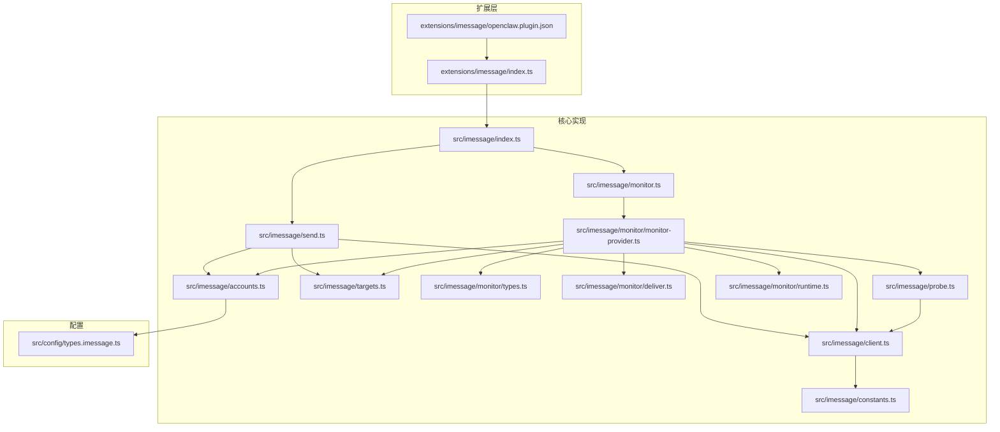
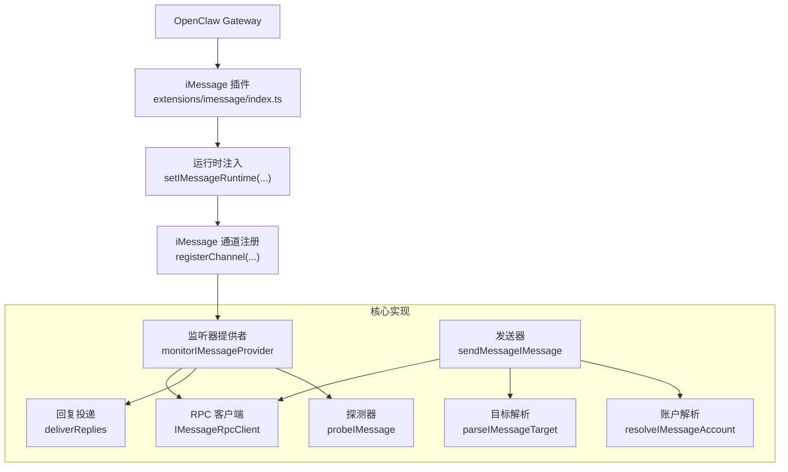
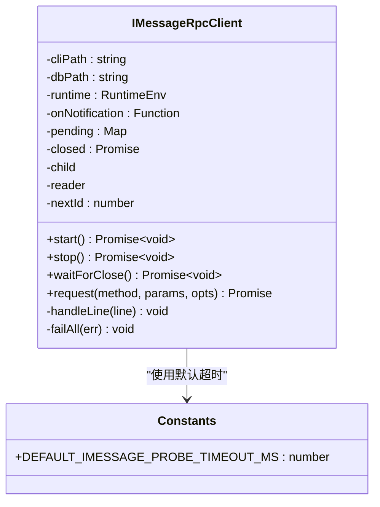
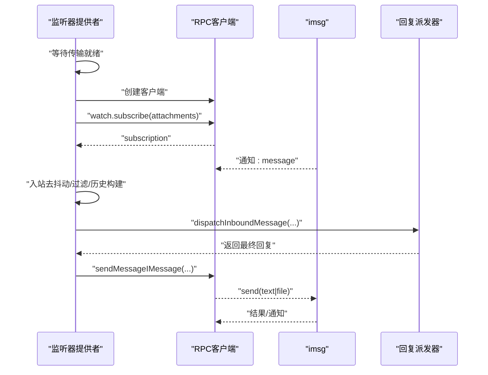
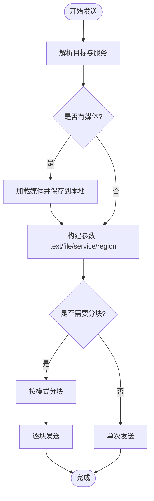
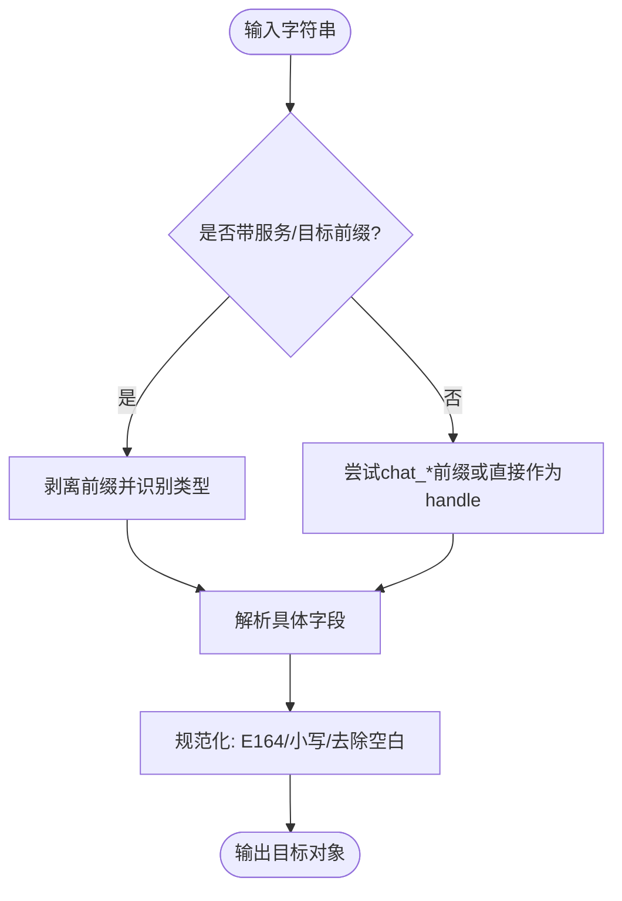
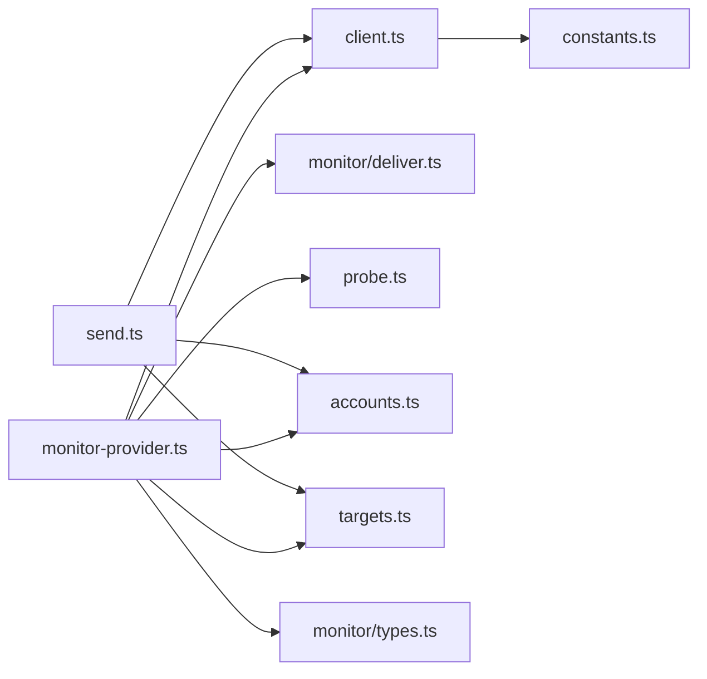
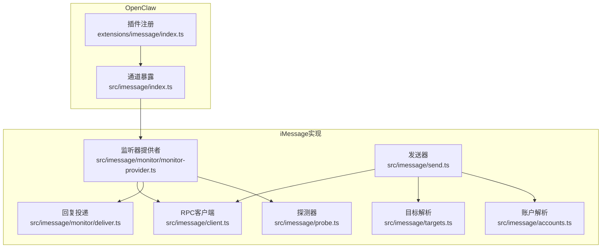

# iMessage渠道集成

<cite>
**本文引用的文件**
- [extensions/imessage/index.ts](file://extensions/imessage/index.ts)
- [extensions/imessage/openclaw.plugin.json](file://extensions/imessage/openclaw.plugin.json)
- [src/imessage/index.ts](file://src/imessage/index.ts)
- [src/imessage/monitor.ts](file://src/imessage/monitor.ts)
- [src/imessage/send.ts](file://src/imessage/send.ts)
- [src/imessage/client.ts](file://src/imessage/client.ts)
- [src/imessage/accounts.ts](file://src/imessage/accounts.ts)
- [src/imessage/targets.ts](file://src/imessage/targets.ts)
- [src/imessage/monitor/monitor-provider.ts](file://src/imessage/monitor/monitor-provider.ts)
- [src/imessage/monitor/deliver.ts](file://src/imessage/monitor/deliver.ts)
- [src/imessage/monitor/runtime.ts](file://src/imessage/monitor/runtime.ts)
- [src/imessage/constants.ts](file://src/imessage/constants.ts)
- [src/imessage/probe.ts](file://src/imessage/probe.ts)
- [src/imessage/monitor/types.ts](file://src/imessage/monitor/types.ts)
- [src/config/types.imessage.ts](file://src/config/types.imessage.ts)
- [docs/channels/imessage.md](file://docs/channels/imessage.md)
- [docs/zh-CN/channels/imessage.md](file://docs/zh-CN/channels/imessage.md)
</cite>

## 目录

1. [简介](#简介)
2. [项目结构](#项目结构)
3. [核心组件](#核心组件)
4. [架构总览](#架构总览)
5. [详细组件分析](#详细组件分析)
6. [依赖关系分析](#依赖关系分析)
7. [性能考量](#性能考量)
8. [故障排查指南](#故障排查指南)
9. [结论](#结论)
10. [附录](#附录)

## 简介

本技术文档面向OpenClaw的iMessage渠道集成，聚焦于基于外部CLI工具“imsg”的macOS Messages框架集成方案。文档覆盖消息监听机制、发送流程、附件处理、联系人与聊天列表管理、消息历史查询、多账户配置、系统权限与部署模式等主题。由于当前实现采用“imsg”作为RPC代理，因此不涉及AppleScript自动化或macOS原生AppleScript接口；系统权限要求主要围绕Messages数据库访问与自动化授权。

## 项目结构

iMessage渠道由两部分组成：

- 扩展层（Extension Layer）：插件注册与运行时注入，负责将iMessage通道接入OpenClaw运行时。
- 核心实现（Core Implementation）：消息监听、发送、目标解析、附件处理、探测与连接管理等逻辑。

**图表来源**

- [extensions/imessage/index.ts](file://extensions/imessage/index.ts#L1-L17)
- [extensions/imessage/openclaw.plugin.json](file://extensions/imessage/openclaw.plugin.json#L1-L9)
- [src/imessage/index.ts](file://src/imessage/index.ts#L1-L4)
- [src/imessage/monitor.ts](file://src/imessage/monitor.ts#L1-L3)
- [src/imessage/send.ts](file://src/imessage/send.ts#L1-L141)
- [src/imessage/client.ts](file://src/imessage/client.ts#L1-L245)
- [src/imessage/accounts.ts](file://src/imessage/accounts.ts#L1-L91)
- [src/imessage/targets.ts](file://src/imessage/targets.ts#L1-L235)
- [src/imessage/monitor/types.ts](file://src/imessage/monitor/types.ts#L1-L41)
- [src/imessage/monitor/monitor-provider.ts](file://src/imessage/monitor/monitor-provider.ts#L1-L760)
- [src/imessage/monitor/deliver.ts](file://src/imessage/monitor/deliver.ts#L1-L70)
- [src/imessage/probe.ts](file://src/imessage/probe.ts#L1-L107)
- [src/imessage/constants.ts](file://src/imessage/constants.ts#L1-L3)
- [src/imessage/monitor/runtime.ts](file://src/imessage/monitor/runtime.ts#L1-L19)
- [src/config/types.imessage.ts](file://src/config/types.imessage.ts#L1-L82)

**章节来源**

- [extensions/imessage/index.ts](file://extensions/imessage/index.ts#L1-L17)
- [extensions/imessage/openclaw.plugin.json](file://extensions/imessage/openclaw.plugin.json#L1-L9)
- [src/imessage/index.ts](file://src/imessage/index.ts#L1-L4)
- [src/imessage/monitor.ts](file://src/imessage/monitor.ts#L1-L3)
- [src/imessage/send.ts](file://src/imessage/send.ts#L1-L141)
- [src/imessage/client.ts](file://src/imessage/client.ts#L1-L245)
- [src/imessage/accounts.ts](file://src/imessage/accounts.ts#L1-L91)
- [src/imessage/targets.ts](file://src/imessage/targets.ts#L1-L235)
- [src/imessage/monitor/types.ts](file://src/imessage/monitor/types.ts#L1-L41)
- [src/imessage/monitor/monitor-provider.ts](file://src/imessage/monitor/monitor-provider.ts#L1-L760)
- [src/imessage/monitor/deliver.ts](file://src/imessage/monitor/deliver.ts#L1-L70)
- [src/imessage/probe.ts](file://src/imessage/probe.ts#L1-L107)
- [src/imessage/constants.ts](file://src/imessage/constants.ts#L1-L3)
- [src/imessage/monitor/runtime.ts](file://src/imessage/monitor/runtime.ts#L1-L19)
- [src/config/types.imessage.ts](file://src/config/types.imessage.ts#L1-L82)

## 核心组件

- 插件入口与注册
  - 扩展插件通过注册函数注入运行时并注册iMessage通道。
- RPC客户端
  - 基于子进程与stdio的JSON-RPC客户端，负责与“imsg”交互。
- 监听器提供者
  - 负责探测、建立订阅、解析入站消息、路由与派发回复。
- 发送器
  - 解析目标、处理媒体、分块文本、调用RPC发送。
- 目标解析与账户管理
  - 支持多种目标格式（handle、chat_id、chat_guid、chat_identifier），并支持多账户合并配置。
- 探测与运行时
  - 提供二进制探测、RPC可用性检测、默认运行时适配。

**章节来源**

- [extensions/imessage/index.ts](file://extensions/imessage/index.ts#L1-L17)
- [src/imessage/client.ts](file://src/imessage/client.ts#L1-L245)
- [src/imessage/monitor/monitor-provider.ts](file://src/imessage/monitor/monitor-provider.ts#L1-L760)
- [src/imessage/send.ts](file://src/imessage/send.ts#L1-L141)
- [src/imessage/targets.ts](file://src/imessage/targets.ts#L1-L235)
- [src/imessage/accounts.ts](file://src/imessage/accounts.ts#L1-L91)
- [src/imessage/probe.ts](file://src/imessage/probe.ts#L1-L107)
- [src/imessage/monitor/runtime.ts](file://src/imessage/monitor/runtime.ts#L1-L19)

## 架构总览

下图展示iMessage渠道的整体架构：OpenClaw通过扩展层注册iMessage通道，核心实现通过RPC客户端与“imsg”通信，监听器提供者负责消息的接收、过滤、会话与路由，发送器负责将回复分块或带媒体地发送回iMessage。

**图表来源**

- [extensions/imessage/index.ts](file://extensions/imessage/index.ts#L1-L17)
- [src/imessage/monitor/monitor-provider.ts](file://src/imessage/monitor/monitor-provider.ts#L1-L760)
- [src/imessage/client.ts](file://src/imessage/client.ts#L1-L245)
- [src/imessage/send.ts](file://src/imessage/send.ts#L1-L141)
- [src/imessage/targets.ts](file://src/imessage/targets.ts#L1-L235)
- [src/imessage/accounts.ts](file://src/imessage/accounts.ts#L1-L91)
- [src/imessage/monitor/deliver.ts](file://src/imessage/monitor/deliver.ts#L1-L70)
- [src/imessage/probe.ts](file://src/imessage/probe.ts#L1-L107)

## 详细组件分析

### 组件A：RPC客户端与JSON-RPC通信

- 功能要点
  - 子进程启动“imsg rpc”，通过stdin发送请求，stdout逐行接收响应。
  - 维护请求ID映射与超时控制，支持通知事件（如“message”）。
  - 错误处理与优雅关闭，支持SIGTERM兜底。
- 关键数据结构
  - 请求/响应/通知类型定义，错误对象结构。
- 性能与可靠性
  - 默认超时常量可被配置覆盖；失败时清理挂起请求，避免内存泄漏。

**图表来源**

- [src/imessage/client.ts](file://src/imessage/client.ts#L1-L245)
- [src/imessage/constants.ts](file://src/imessage/constants.ts#L1-L3)

**章节来源**

- [src/imessage/client.ts](file://src/imessage/client.ts#L1-L245)
- [src/imessage/constants.ts](file://src/imessage/constants.ts#L1-L3)

### 组件B：消息监听与入站处理流程

- 功能要点
  - 探测“imsg”可用性与RPC能力，等待传输就绪后订阅“message”通知。
  - 入站消息按会话与组策略过滤，支持配对模式、白名单、提及检测。
  - 处理历史上下文、去重（echo）、分组会话隔离、回复前缀与人类延迟。
  - 通过回复派发器将最终回复投递到“imsg”。
- 关键算法
  - 入站去抖动：同一会话内连续消息合并，非文本或含附件时不合并。
  - 提及检测：基于正则表达式，支持命令绕过提及限制。
  - Echo检测：基于最近发送缓存（5秒窗口）过滤重复。

**图表来源**

- [src/imessage/monitor/monitor-provider.ts](file://src/imessage/monitor/monitor-provider.ts#L1-L760)
- [src/imessage/client.ts](file://src/imessage/client.ts#L1-L245)
- [src/imessage/monitor/deliver.ts](file://src/imessage/monitor/deliver.ts#L1-L70)

**章节来源**

- [src/imessage/monitor/monitor-provider.ts](file://src/imessage/monitor/monitor-provider.ts#L1-L760)
- [src/imessage/monitor/deliver.ts](file://src/imessage/monitor/deliver.ts#L1-L70)

### 组件C：发送流程与附件处理

- 功能要点
  - 解析目标（handle、chat_id、chat_guid、chat_identifier），自动推断服务与区域。
  - 文本表格转换、媒体URL下载与本地保存、按最大字节限制裁剪。
  - 分块发送文本，媒体逐张发送并附带标题。
- 附件处理
  - 支持多附件顺序发送；若无文本且有媒体，自动生成占位符。

**图表来源**

- [src/imessage/send.ts](file://src/imessage/send.ts#L1-L141)
- [src/imessage/targets.ts](file://src/imessage/targets.ts#L1-L235)
- [src/imessage/accounts.ts](file://src/imessage/accounts.ts#L1-L91)

**章节来源**

- [src/imessage/send.ts](file://src/imessage/send.ts#L1-L141)
- [src/imessage/targets.ts](file://src/imessage/targets.ts#L1-L235)
- [src/imessage/accounts.ts](file://src/imessage/accounts.ts#L1-L91)

### 组件D：目标解析与路由

- 功能要点
  - 支持多种前缀格式（imessage:/sms:/auto:、chat_id:/chat_guid:/chat_identifier:）。
  - 规范化手机号码、邮箱地址与聊天标识，便于白名单匹配与路由。
- 路由规则
  - DM使用直连路由，群组使用隔离会话键；默认主会话作用域可配置。

**图表来源**

- [src/imessage/targets.ts](file://src/imessage/targets.ts#L1-L235)

**章节来源**

- [src/imessage/targets.ts](file://src/imessage/targets.ts#L1-L235)

### 组件E：账户与多账户配置

- 功能要点
  - 支持默认账户与多账户配置，账户级配置与全局配置合并。
  - 列举启用的账户、解析默认账户ID、判断是否已配置。
- 配置项
  - cliPath/dbPath/remoteHost/service/region/dmPolicy/groupPolicy/allowFrom/groupAllowFrom/includeAttachments/mediaMaxMb/textChunkLimit/chunkMode等。

**章节来源**

- [src/imessage/accounts.ts](file://src/imessage/accounts.ts#L1-L91)
- [src/config/types.imessage.ts](file://src/config/types.imessage.ts#L1-L82)

### 组件F：探测与健康检查

- 功能要点
  - 探测二进制是否存在、RPC子命令支持情况、RPC连通性（chats.list）。
  - 支持超时配置与缓存RPC支持探测结果。
- 使用场景
  - 监听器启动前的前置检查，确保“imsg”可用。

**章节来源**

- [src/imessage/probe.ts](file://src/imessage/probe.ts#L1-L107)
- [src/imessage/constants.ts](file://src/imessage/constants.ts#L1-L3)

## 依赖关系分析

- 组件耦合
  - 监听器提供者依赖RPC客户端、账户解析、目标解析、探测器、运行时与回复投递器。
  - 发送器依赖RPC客户端、账户解析、目标解析、媒体处理与分块逻辑。
- 外部依赖
  - “imsg”二进制及其RPC能力；macOS Messages数据库路径；系统自动化权限。
- 循环依赖
  - 未发现循环导入；模块职责清晰，接口边界明确。

**图表来源**

- [src/imessage/monitor/monitor-provider.ts](file://src/imessage/monitor/monitor-provider.ts#L1-L760)
- [src/imessage/client.ts](file://src/imessage/client.ts#L1-L245)
- [src/imessage/monitor/deliver.ts](file://src/imessage/monitor/deliver.ts#L1-L70)
- [src/imessage/probe.ts](file://src/imessage/probe.ts#L1-L107)
- [src/imessage/accounts.ts](file://src/imessage/accounts.ts#L1-L91)
- [src/imessage/targets.ts](file://src/imessage/targets.ts#L1-L235)
- [src/imessage/monitor/types.ts](file://src/imessage/monitor/types.ts#L1-L41)
- [src/imessage/send.ts](file://src/imessage/send.ts#L1-L141)
- [src/imessage/constants.ts](file://src/imessage/constants.ts#L1-L3)

**章节来源**

- [src/imessage/monitor/monitor-provider.ts](file://src/imessage/monitor/monitor-provider.ts#L1-L760)
- [src/imessage/client.ts](file://src/imessage/client.ts#L1-L245)
- [src/imessage/monitor/deliver.ts](file://src/imessage/monitor/deliver.ts#L1-L70)
- [src/imessage/probe.ts](file://src/imessage/probe.ts#L1-L107)
- [src/imessage/accounts.ts](file://src/imessage/accounts.ts#L1-L91)
- [src/imessage/targets.ts](file://src/imessage/targets.ts#L1-L235)
- [src/imessage/monitor/types.ts](file://src/imessage/monitor/types.ts#L1-L41)
- [src/imessage/send.ts](file://src/imessage/send.ts#L1-L141)
- [src/imessage/constants.ts](file://src/imessage/constants.ts#L1-L3)

## 性能考量

- 入站去抖动
  - 对连续文本消息进行合并，减少模型触发与网络开销。
- 分块发送
  - 文本按长度或换行分块，媒体逐张发送，避免单次超长消息失败。
- Echo过滤
  - 5秒窗口内过滤重复消息，避免重复处理与回复。
- 超时与重试
  - RPC请求与探测均支持超时控制，失败时清理挂起请求，避免资源泄露。
- 附件处理
  - 远程主机SCP获取需密钥认证，建议使用无交互SSH/SCP；本地媒体大小限制可配置。

[本节为通用指导，无需特定文件引用]

## 故障排查指南

- imsg不可用或RPC不受支持
  - 使用探测器确认二进制存在与RPC能力；更新“imsg”版本。
- DM被忽略
  - 检查dmPolicy与allowFrom；必要时进行配对审批。
- 群组消息被忽略
  - 检查groupPolicy、groupAllowFrom、groups显式配置与提及模式。
- 远程附件失败
  - 检查remoteHost、SSH/SCP密钥、远端路径可读性。
- macOS权限提示遗漏
  - 在相同用户/会话上下文中运行一次交互命令以触发权限弹窗。

**章节来源**

- [src/imessage/probe.ts](file://src/imessage/probe.ts#L1-L107)
- [docs/channels/imessage.md](file://docs/channels/imessage.md#L290-L344)
- [docs/zh-CN/channels/imessage.md](file://docs/zh-CN/channels/imessage.md#L61-L87)

## 结论

OpenClaw的iMessage渠道通过“imsg”与macOS Messages深度集成，采用JSON-RPC over stdio的轻量方案，具备完善的入站过滤、会话隔离、历史上下文与回复投递能力。尽管不直接使用AppleScript，但通过“imsg”实现了消息监听、发送与附件处理的核心需求。建议在生产环境采用专用机器人用户与SSH隧道模式，确保权限与安全隔离。

[本节为总结，无需特定文件引用]

## 附录

### iMessage集成架构图（代码级映射）

**图表来源**

- [extensions/imessage/index.ts](file://extensions/imessage/index.ts#L1-L17)
- [src/imessage/index.ts](file://src/imessage/index.ts#L1-L4)
- [src/imessage/monitor/monitor-provider.ts](file://src/imessage/monitor/monitor-provider.ts#L1-L760)
- [src/imessage/send.ts](file://src/imessage/send.ts#L1-L141)
- [src/imessage/client.ts](file://src/imessage/client.ts#L1-L245)
- [src/imessage/targets.ts](file://src/imessage/targets.ts#L1-L235)
- [src/imessage/accounts.ts](file://src/imessage/accounts.ts#L1-L91)
- [src/imessage/probe.ts](file://src/imessage/probe.ts#L1-L107)
- [src/imessage/monitor/deliver.ts](file://src/imessage/monitor/deliver.ts#L1-L70)

### 系统权限与兼容性

- 权限要求
  - Messages必须登录；需要完全磁盘访问权限以访问Messages数据库；发送时需要自动化权限。
- 兼容性与部署
  - imsg CLI必须支持“rpc”子命令；可通过SSH连接到远程Mac执行“imsg”；建议使用专用机器人用户隔离身份。
- 配置参考
  - 支持多账户、白名单、群组策略、历史限制、文本分块与媒体大小限制等。

**章节来源**

- [docs/channels/imessage.md](file://docs/channels/imessage.md#L110-L126)
- [docs/zh-CN/channels/imessage.md](file://docs/zh-CN/channels/imessage.md#L61-L87)
- [src/config/types.imessage.ts](file://src/config/types.imessage.ts#L1-L82)
