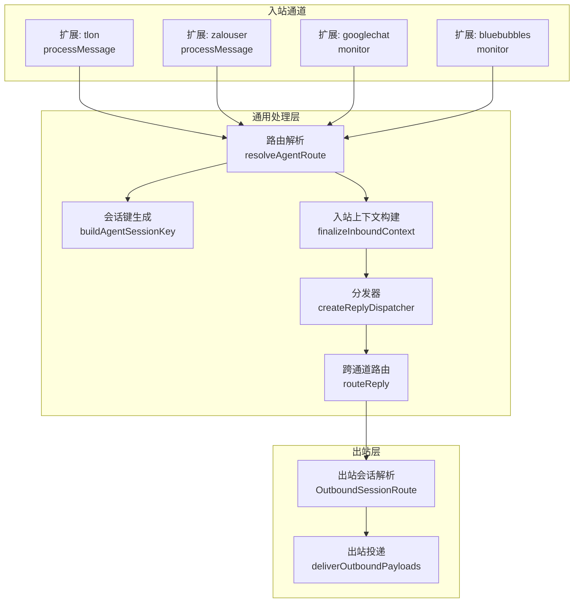
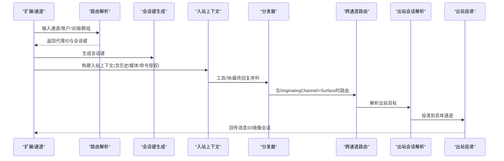
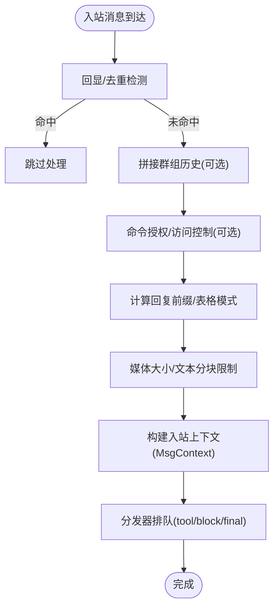
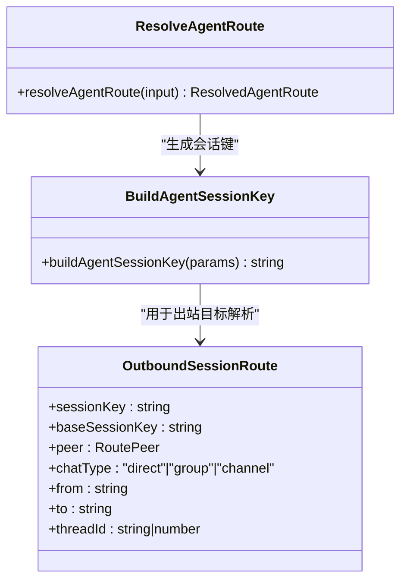
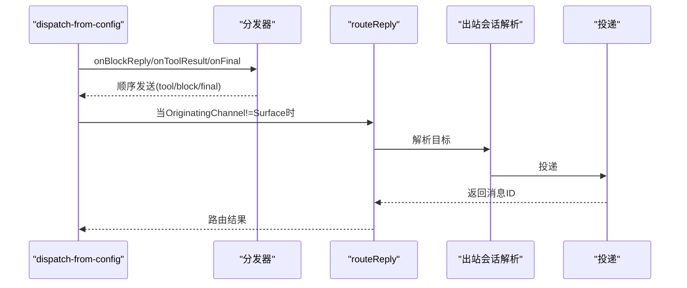
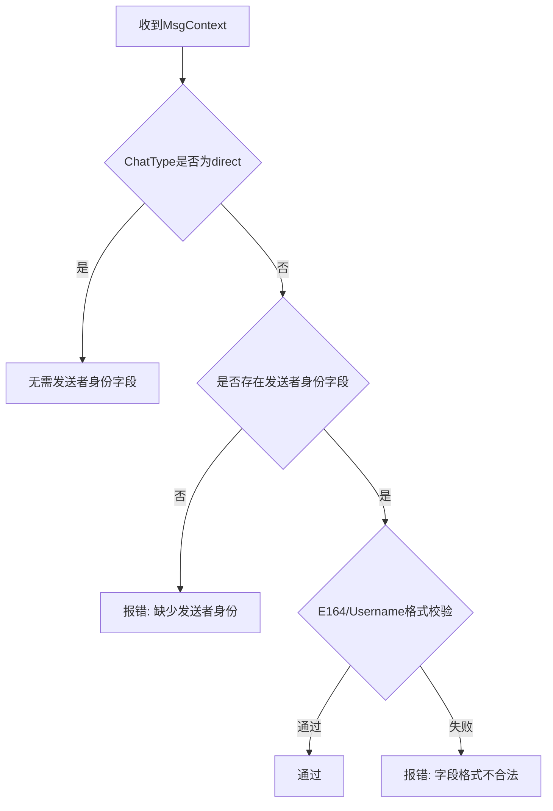
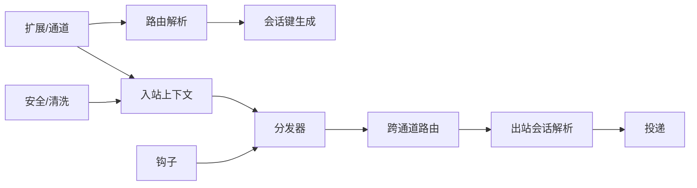

# 消息处理流水线

<cite>
**本文引用的文件**
- [src/auto-reply/templating.ts](file://src/auto-reply/templating.ts)
- [src/routing/resolve-route.ts](file://src/routing/resolve-route.ts)
- [src/routing/session-key.ts](file://src/routing/session-key.ts)
- [src/infra/outbound/outbound-session.ts](file://src/infra/outbound/outbound-session.ts)
- [src/auto-reply/reply/dispatch-from-config.ts](file://src/auto-reply/reply/dispatch-from-config.ts)
- [src/auto-reply/reply/reply-dispatcher.ts](file://src/auto-reply/reply/reply-dispatcher.ts)
- [src/auto-reply/reply/route-reply.ts](file://src/auto-reply/reply/route-reply.ts)
- [src/web/auto-reply/monitor/process-message.ts](file://src/web/auto-reply/monitor/process-message.ts)
- [src/web/auto-reply/monitor/on-message.ts](file://src/web/auto-reply/monitor/on-message.ts)
- [src/web/auto-reply/monitor/message-line.ts](file://src/web/auto-reply/monitor/message-line.ts)
- [src/channels/sender-identity.ts](file://src/channels/sender-identity.ts)
- [src/gateway/chat-sanitize.ts](file://src/gateway/chat-sanitize.ts)
- [src/infra/outbound/deliver.js](file://src/infra/outbound/deliver.js)
- [src/plugins/hooks.ts](file://src/plugins/hooks.ts)
- [src/infra/unhandled-rejections.ts](file://src/infra/unhandled-rejections.ts)
- [src/agents/failover-error.ts](file://src/agents/failover-error.ts)
- [src/telegram/network-errors.ts](file://src/telegram/network-errors.ts)
- [extensions/tlon/src/monitor/index.ts](file://extensions/tlon/src/monitor/index.ts)
- [extensions/zalouser/src/monitor.ts](file://extensions/zalouser/src/monitor.ts)
- [extensions/googlechat/src/monitor.ts](file://extensions/googlechat/src/monitor.ts)
- [extensions/bluebubbles/src/monitor.ts](file://extensions/bluebubbles/src/monitor.ts)
</cite>

## 目录

1. [简介](#简介)
2. [项目结构](#项目结构)
3. [核心组件](#核心组件)
4. [架构总览](#架构总览)
5. [详细组件分析](#详细组件分析)
6. [依赖关系分析](#依赖关系分析)
7. [性能考量](#性能考量)
8. [故障排查指南](#故障排查指南)
9. [结论](#结论)

## 简介

本技术文档系统化梳理 OpenClaw 的消息处理流水线，覆盖从“消息接收、解析、路由、转发”的完整链路，以及会话管理、目标解析、发送者身份识别、聊天类型判断、预处理、格式转换、内容过滤与安全检查、路由算法与优先级、并发控制等关键环节。文档提供流程图与状态转换图，帮助读者快速理解并定位问题，同时给出性能优化建议与错误处理策略。

## 项目结构

OpenClaw 的消息处理以“自动回复与分发”为核心，围绕以下模块组织：

- 自动回复上下文与模板：定义统一的 MsgContext 结构，承载消息体、历史、元数据、命令授权等。
- 路由与会话：根据通道、账户、对端、群组等维度解析代理路由与会话键，支持多账号、多代理、多会话合并策略。
- 出站会话与目标解析：将“目标标识符”标准化为统一的 OutboundSessionRoute，确保跨通道一致性。
- 分发器与路由：按工具结果、块流式回复、最终回复的顺序串行分发，支持人类节奏延迟、回显去重、心跳剥离等。
- 入站监控与处理：各通道扩展（如 Tlon、Zalo Personal、Google Chat、BlueBubbles）实现各自的入站处理、访问控制、提及/命令门禁、会话记录与回复分发。
- 安全与清理：内容清洗、边界标记保护、外部内容包装、未处理异常与网络错误分类。

图表来源

- [extensions/tlon/src/monitor/index.ts](file://extensions/tlon/src/monitor/index.ts#L279-L457)
- [extensions/zalouser/src/monitor.ts](file://extensions/zalouser/src/monitor.ts#L155-L375)
- [extensions/googlechat/src/monitor.ts](file://extensions/googlechat/src/monitor.ts#L475-L512)
- [extensions/bluebubbles/src/monitor.ts](file://extensions/bluebubbles/src/monitor.ts#L1589-L2365)
- [src/routing/resolve-route.ts](file://src/routing/resolve-route.ts#L185-L291)
- [src/routing/session-key.ts](file://src/routing/session-key.ts#L130-L186)
- [src/auto-reply/reply/dispatch-from-config.ts](file://src/auto-reply/reply/dispatch-from-config.ts#L82-L459)
- [src/auto-reply/reply/route-reply.ts](file://src/auto-reply/reply/route-reply.ts#L57-L147)
- [src/infra/outbound/outbound-session.ts](file://src/infra/outbound/outbound-session.ts#L26-L800)
- [src/infra/outbound/deliver.js](file://src/infra/outbound/deliver.js)

章节来源

- [src/auto-reply/templating.ts](file://src/auto-reply/templating.ts#L13-L144)
- [src/routing/resolve-route.ts](file://src/routing/resolve-route.ts#L185-L291)
- [src/routing/session-key.ts](file://src/routing/session-key.ts#L130-L186)
- [src/infra/outbound/outbound-session.ts](file://src/infra/outbound/outbound-session.ts#L26-L800)
- [src/auto-reply/reply/dispatch-from-config.ts](file://src/auto-reply/reply/dispatch-from-config.ts#L82-L459)
- [src/auto-reply/reply/reply-dispatcher.ts](file://src/auto-reply/reply/reply-dispatcher.ts#L101-L194)
- [src/auto-reply/reply/route-reply.ts](file://src/auto-reply/reply/route-reply.ts#L57-L147)
- [src/web/auto-reply/monitor/process-message.ts](file://src/web/auto-reply/monitor/process-message.ts#L106-L432)
- [src/web/auto-reply/monitor/on-message.ts](file://src/web/auto-reply/monitor/on-message.ts#L18-L61)
- [src/web/auto-reply/monitor/message-line.ts](file://src/web/auto-reply/monitor/message-line.ts#L14-L46)
- [src/channels/sender-identity.ts](file://src/channels/sender-identity.ts#L1-L41)
- [src/gateway/chat-sanitize.ts](file://src/gateway/chat-sanitize.ts#L84-L123)
- [src/plugins/hooks.ts](file://src/plugins/hooks.ts#L241-L266)
- [src/infra/unhandled-rejections.ts](file://src/infra/unhandled-rejections.ts#L1-L95)
- [src/agents/failover-error.ts](file://src/agents/failover-error.ts#L167-L234)
- [src/telegram/network-errors.ts](file://src/telegram/network-errors.ts#L118-L150)

## 核心组件

- 消息上下文与模板
  - 统一的 MsgContext 描述入站消息的所有字段，包括 Body、RawBody、CommandBody、历史、媒体、线程、来源通道、会话键、命令授权、提及标记等，便于下游模板渲染与安全检查。
- 路由与会话
  - resolveAgentRoute：基于通道、账户、对端、群组、公会/团队角色等匹配绑定，选择代理与会话键；支持父线程继承、默认代理回退。
  - buildAgentSessionKey/buildAgentPeerSessionKey：根据代理、通道、账户、对端类型与身份映射，生成稳定的会话键，支持 per-peer/per-channel-per-account 等多粒度合并策略。
- 出站会话与目标解析
  - OutboundSessionRoute：统一表示出站会话的目标（from/to）、聊天类型（direct/group/channel）、线程标识等；各通道解析器（Slack、Telegram、WhatsApp、Signal、iMessage、Matrix、MSTeams、Mattermost、BlueBubbles、Nextcloud Talk、Zalo、Zalo Personal、Nostr、Tlon）将目标字符串标准化为统一结构。
- 分发器与路由
  - createReplyDispatcher：串行化工具结果、块流式回复、最终回复，支持人类节奏延迟、心跳剥离、静默跳过、错误回调与空闲信号。
  - routeReply：当 OriginatingChannel 与当前 Surface 不一致时，将回复路由回原始通道，保证跨通道共享会话的一致性。
- 入站监控与处理
  - 各通道 monitor/processMessage 实现：访问控制（DM/群组策略、允许列表）、命令授权、提及门禁、会话元数据记录、回复前缀、块流式/最终回复分发、去重与回显检测、日志与统计。
- 安全与清理
  - sender-identity：校验 SenderId/Name/Username/E164 等字段，确保群组场景具备可辨识的发送者身份。
  - chat-sanitize：剥离消息中的内部提示与信封，避免泄露或混淆。
  - 外部内容包装与边界标记清理：防止边界标记被注入或误用。

章节来源

- [src/auto-reply/templating.ts](file://src/auto-reply/templating.ts#L13-L144)
- [src/routing/resolve-route.ts](file://src/routing/resolve-route.ts#L185-L291)
- [src/routing/session-key.ts](file://src/routing/session-key.ts#L130-L186)
- [src/infra/outbound/outbound-session.ts](file://src/infra/outbound/outbound-session.ts#L26-L800)
- [src/auto-reply/reply/reply-dispatcher.ts](file://src/auto-reply/reply/reply-dispatcher.ts#L101-L194)
- [src/auto-reply/reply/route-reply.ts](file://src/auto-reply/reply/route-reply.ts#L57-L147)
- [src/channels/sender-identity.ts](file://src/channels/sender-identity.ts#L1-L41)
- [src/gateway/chat-sanitize.ts](file://src/gateway/chat-sanitize.ts#L84-L123)

## 架构总览

消息处理流水线分为“入站—路由—会话—分发—出站—投递”六大阶段，贯穿多通道、多账户、多代理与多会话合并策略。

图表来源

- [extensions/tlon/src/monitor/index.ts](file://extensions/tlon/src/monitor/index.ts#L279-L457)
- [src/routing/resolve-route.ts](file://src/routing/resolve-route.ts#L185-L291)
- [src/routing/session-key.ts](file://src/routing/session-key.ts#L130-L186)
- [src/auto-reply/reply/dispatch-from-config.ts](file://src/auto-reply/reply/dispatch-from-config.ts#L82-L459)
- [src/auto-reply/reply/route-reply.ts](file://src/auto-reply/reply/route-reply.ts#L57-L147)
- [src/infra/outbound/outbound-session.ts](file://src/infra/outbound/outbound-session.ts#L26-L800)
- [src/infra/outbound/deliver.js](file://src/infra/outbound/deliver.js)

## 详细组件分析

### 组件A：消息接收与预处理（Web/通道扩展）

- 入站入口
  - Web 入站处理器：on-message 创建消息处理闭包，调用 processMessage 完成预处理与分发。
  - 通道扩展：各扩展 monitor/processMessage 实现各自接入（如 Tlon、Zalo Personal、Google Chat、BlueBubbles），完成访问控制、命令授权、提及门禁、会话记录与回复分发。
- 预处理要点
  - 去重与回显：通过组合体（combinedBody）与回显跟踪器避免重复响应。
  - 历史拼接：群组消息拼接最近历史，增强上下文。
  - 前缀与表格模式：根据通道与账户配置决定回复前缀与表格渲染模式。
  - 媒体限制与分块：根据通道配置限制媒体大小与文本分块长度，保障传输稳定性。
  - 日志与心跳剥离：记录入站/出站摘要，必要时剥离心跳占位符。
- 数据结构
  - WebInboundMsg/WebInboundCtx、GroupHistoryEntry、MsgContext（Body/History/Media/Command/授权/提及/线程等）。

图表来源

- [src/web/auto-reply/monitor/process-message.ts](file://src/web/auto-reply/monitor/process-message.ts#L106-L432)
- [src/web/auto-reply/monitor/on-message.ts](file://src/web/auto-reply/monitor/on-message.ts#L18-L61)
- [src/web/auto-reply/monitor/message-line.ts](file://src/web/auto-reply/monitor/message-line.ts#L14-L46)
- [src/auto-reply/templating.ts](file://src/auto-reply/templating.ts#L13-L144)

章节来源

- [src/web/auto-reply/monitor/process-message.ts](file://src/web/auto-reply/monitor/process-message.ts#L106-L432)
- [src/web/auto-reply/monitor/on-message.ts](file://src/web/auto-reply/monitor/on-message.ts#L18-L61)
- [src/web/auto-reply/monitor/message-line.ts](file://src/web/auto-reply/monitor/message-line.ts#L14-L46)
- [src/auto-reply/templating.ts](file://src/auto-reply/templating.ts#L13-L144)

### 组件B：路由与会话管理

- 路由算法
  - 匹配顺序：对端精确匹配 → 父线程对端继承 → 公会+角色 → 公会 → 团队 → 账户 → 任意账户 → 默认代理。
  - 会话键规则：支持 per-peer/per-channel-peer/per-account-channel-peer/main 合并策略，群组与频道独立隔离，直聊可折叠至主会话键。
- 目标解析
  - 各通道解析器将“用户输入的目标字符串”标准化为 OutboundSessionRoute，统一 from/to、chatType、threadId 等字段，确保跨通道一致性。
- 会话元数据
  - 记录入站会话元数据（时间戳、最后通道、线程等），用于后续路由与回溯。

图表来源

- [src/routing/resolve-route.ts](file://src/routing/resolve-route.ts#L185-L291)
- [src/routing/session-key.ts](file://src/routing/session-key.ts#L130-L186)
- [src/infra/outbound/outbound-session.ts](file://src/infra/outbound/outbound-session.ts#L26-L800)

章节来源

- [src/routing/resolve-route.ts](file://src/routing/resolve-route.ts#L185-L291)
- [src/routing/session-key.ts](file://src/routing/session-key.ts#L130-L186)
- [src/infra/outbound/outbound-session.ts](file://src/infra/outbound/outbound-session.ts#L26-L800)

### 组件C：分发器与跨通道路由

- 分发器
  - 串行化发送：工具结果、块流式回复、最终回复严格顺序；支持人类节奏延迟（仅块间延迟）。
  - 正规化：统一处理回复前缀、心跳剥离、静默跳过、空载跳过。
  - 错误处理：捕获并回调 onError，等待空闲后触发 onIdle。
- 跨通道路由
  - 当 OriginatingChannel 与当前 Surface 不一致时，使用 routeReply 将回复路由回原始通道，确保跨通道共享会话的一致性。
  - 支持镜像会话（可选），将发送内容同步到会话转录。

图表来源

- [src/auto-reply/reply/dispatch-from-config.ts](file://src/auto-reply/reply/dispatch-from-config.ts#L82-L459)
- [src/auto-reply/reply/reply-dispatcher.ts](file://src/auto-reply/reply/reply-dispatcher.ts#L101-L194)
- [src/auto-reply/reply/route-reply.ts](file://src/auto-reply/reply/route-reply.ts#L57-L147)
- [src/infra/outbound/outbound-session.ts](file://src/infra/outbound/outbound-session.ts#L26-L800)
- [src/infra/outbound/deliver.js](file://src/infra/outbound/deliver.js)

章节来源

- [src/auto-reply/reply/dispatch-from-config.ts](file://src/auto-reply/reply/dispatch-from-config.ts#L82-L459)
- [src/auto-reply/reply/reply-dispatcher.ts](file://src/auto-reply/reply/reply-dispatcher.ts#L101-L194)
- [src/auto-reply/reply/route-reply.ts](file://src/auto-reply/reply/route-reply.ts#L57-L147)

### 组件D：发送者身份识别与聊天类型判断

- 发送者身份
  - validateSenderIdentity：在非直聊场景要求具备 SenderId/SenderName/SenderUsername/SenderE164 中至少一项，且 E164 格式与 Username 规范符合要求。
- 聊天类型
  - normalizeChatType：统一直聊/群组/频道等类型，配合路由与会话键生成策略。

图表来源

- [src/channels/sender-identity.ts](file://src/channels/sender-identity.ts#L1-L41)

章节来源

- [src/channels/sender-identity.ts](file://src/channels/sender-identity.ts#L1-L41)

### 组件E：内容过滤与安全检查

- 内容清洗
  - stripEnvelopeFromMessage/stripEnvelopeFromMessages：剥离内部信封与消息提示，避免泄露或混淆。
- 外部内容包装
  - wrapExternalContent：对外部来源内容进行边界标记包装与安全提示，防止边界标记被注入或误用。
- 边界标记清理
  - 对大小写不敏感地清理边界标记，确保输出安全。

章节来源

- [src/gateway/chat-sanitize.ts](file://src/gateway/chat-sanitize.ts#L84-L123)
- [src/security/external-content.test.ts](file://src/security/external-content.test.ts#L79-L109)

### 组件F：通道特定处理（示例：Tlon、Zalo Personal、Google Chat、BlueBubbles）

- Tlon
  - 支持群组摘要请求（summarization），拉取最近历史并构造摘要提示；根据是否为群组/个人消息选择发送路径；可附加模型签名。
- Zalo Personal
  - 群组策略与允许列表、DM 授权（open/pairing/disabled）、控制命令门禁；会话元数据记录与回复分发。
- Google Chat
  - 群组策略（disabled/allowlist）、允许列表、用户白名单、发送者权限校验；针对群组/个人消息分别处理。
- BlueBubbles
  - Tapback 文本解析、允许列表/群组允许列表、提及门禁、控制命令门禁、附件下载与缓存、会话元数据记录与回复分发。

章节来源

- [extensions/tlon/src/monitor/index.ts](file://extensions/tlon/src/monitor/index.ts#L279-L457)
- [extensions/zalouser/src/monitor.ts](file://extensions/zalouser/src/monitor.ts#L155-L375)
- [extensions/googlechat/src/monitor.ts](file://extensions/googlechat/src/monitor.ts#L475-L512)
- [extensions/bluebubbles/src/monitor.ts](file://extensions/bluebubbles/src/monitor.ts#L1589-L2365)

## 依赖关系分析

- 组件耦合
  - 入站扩展依赖路由与会话键生成；路由依赖配置绑定与默认代理解析。
  - 分发器依赖回复正规化与跨通道路由；跨通道路由依赖出站会话解析与投递模块。
  - 安全模块（清洗/包装）与钩子（message_received/message_sending）贯穿处理链。
- 外部依赖
  - 各通道插件与客户端库（如 Telegram SDK、Slack WebClient）在投递阶段动态加载，降低启动成本。
- 循环依赖
  - 通过模块懒加载与接口抽象避免循环导入。

图表来源

- [src/routing/resolve-route.ts](file://src/routing/resolve-route.ts#L185-L291)
- [src/routing/session-key.ts](file://src/routing/session-key.ts#L130-L186)
- [src/auto-reply/reply/dispatch-from-config.ts](file://src/auto-reply/reply/dispatch-from-config.ts#L82-L459)
- [src/auto-reply/reply/route-reply.ts](file://src/auto-reply/reply/route-reply.ts#L57-L147)
- [src/infra/outbound/outbound-session.ts](file://src/infra/outbound/outbound-session.ts#L26-L800)
- [src/infra/outbound/deliver.js](file://src/infra/outbound/deliver.js)
- [src/gateway/chat-sanitize.ts](file://src/gateway/chat-sanitize.ts#L84-L123)
- [src/plugins/hooks.ts](file://src/plugins/hooks.ts#L241-L266)

章节来源

- [src/routing/resolve-route.ts](file://src/routing/resolve-route.ts#L185-L291)
- [src/routing/session-key.ts](file://src/routing/session-key.ts#L130-L186)
- [src/auto-reply/reply/dispatch-from-config.ts](file://src/auto-reply/reply/dispatch-from-config.ts#L82-L459)
- [src/auto-reply/reply/route-reply.ts](file://src/auto-reply/reply/route-reply.ts#L57-L147)
- [src/infra/outbound/outbound-session.ts](file://src/infra/outbound/outbound-session.ts#L26-L800)
- [src/infra/outbound/deliver.js](file://src/infra/outbound/deliver.js)
- [src/gateway/chat-sanitize.ts](file://src/gateway/chat-sanitize.ts#L84-L123)
- [src/plugins/hooks.ts](file://src/plugins/hooks.ts#L241-L266)

## 性能考量

- 并发与串行化
  - 分发器采用串行链路，确保工具/块/最终回复顺序一致；块间延迟模拟人类节奏，避免过于频繁的发送。
- 懒加载与模块边界
  - 跨通道路由与投递在执行边界动态加载，减少启动时的模块依赖与内存占用。
- 去重与回显
  - 通过组合体与回显跟踪器避免重复响应，降低无效负载。
- 媒体与文本限制
  - 各通道配置媒体大小与文本分块，避免超大消息导致传输失败或超时。
- 诊断与可观测性
  - 会话状态变更、消息入队/完成、耗时统计，便于定位瓶颈与异常。

[本节为通用指导，无需列出章节来源]

## 故障排查指南

- 未处理拒绝与网络错误分类
  - unhandled-rejections：区分致命错误、配置错误与瞬时网络错误，避免因瞬时网络错误导致进程崩溃。
- Telegram 网络错误恢复
  - isRecoverableTelegramNetworkError：根据错误码/名称/消息片段判断是否可恢复，支持轮询/发送/Webhook 等上下文。
- 失败回退与错误分类
  - agents/failover-error：从 HTTP 状态、错误码、消息内容推断失败原因（超时/鉴权/配额/格式等），便于降级与重试。
- 钩子与安全
  - message_received/message_sending 钩子：前者并行触发，后者串行修改/取消，注意避免阻塞与副作用。
- 常见问题定位
  - 无回复：检查是否被静默跳过（空文本/媒体）、是否被跨通道路由失败、是否被去重/回显拦截。
  - 跨通道回复错误：确认 OriginatingChannel/OriginatingTo 是否设置正确，routeReply 返回的错误信息。
  - 会话键冲突：检查 dmScope/identityLinks/群组标识是否导致会话键合并或隔离不当。

章节来源

- [src/infra/unhandled-rejections.ts](file://src/infra/unhandled-rejections.ts#L1-L95)
- [src/telegram/network-errors.ts](file://src/telegram/network-errors.ts#L118-L150)
- [src/agents/failover-error.ts](file://src/agents/failover-error.ts#L167-L234)
- [src/plugins/hooks.ts](file://src/plugins/hooks.ts#L241-L266)

## 结论

OpenClaw 的消息处理流水线以“统一上下文、可扩展路由、严格分发、跨通道路由、安全清洗”为核心设计，既满足多通道、多账户、多代理的复杂场景，又通过并发控制与性能优化保障稳定与高效。结合本文提供的流程图、状态图与排障建议，可快速定位问题并持续优化消息处理链路。
