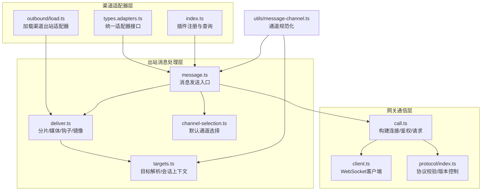
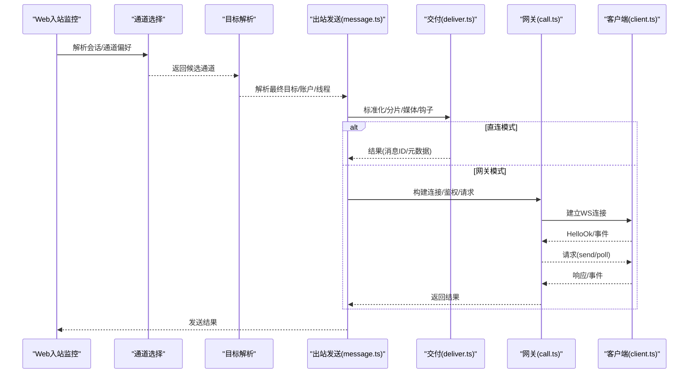
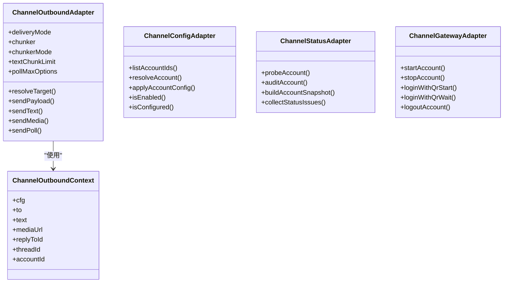
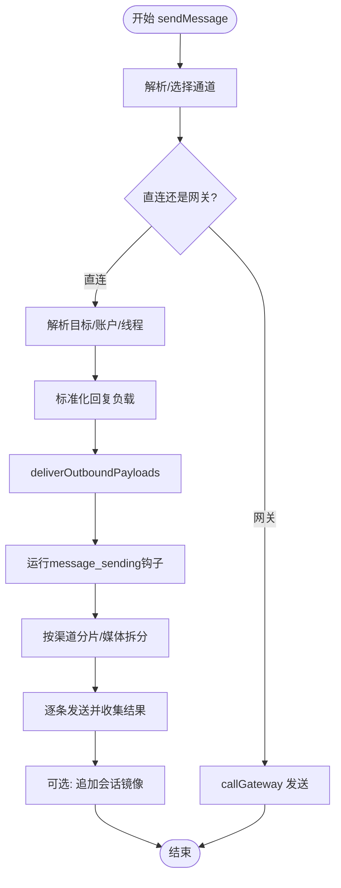
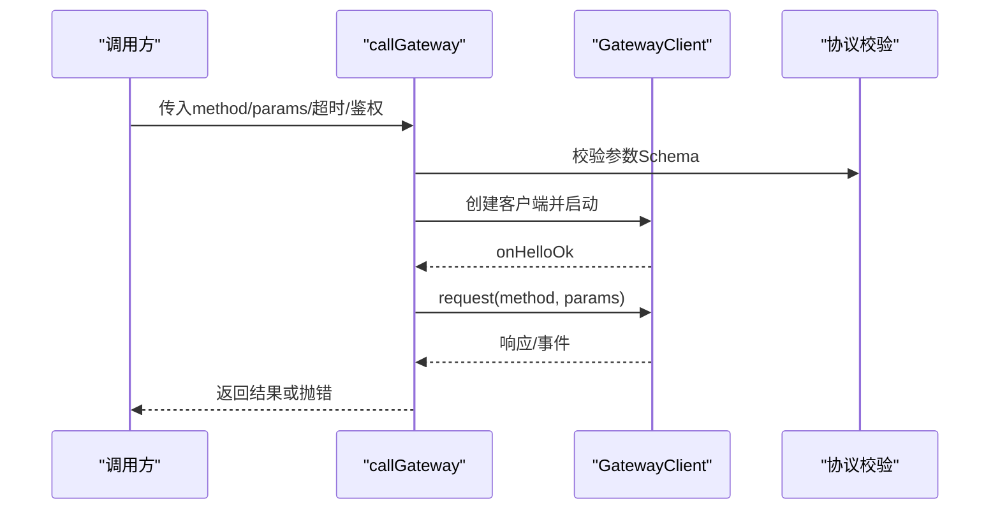
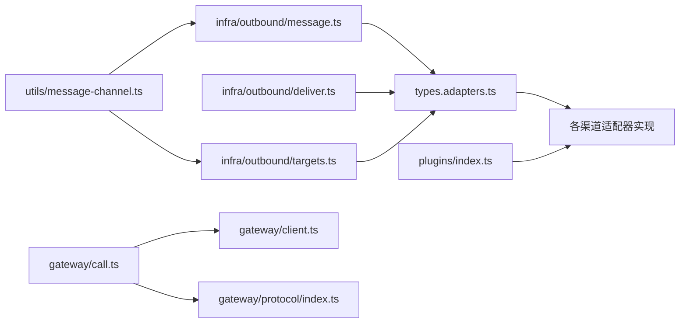

# 消息路由架构

<cite>
**本文引用的文件**
- [src/channels/plugins/types.ts](file://src/channels/plugins/types.ts)
- [src/channels/plugins/types.adapters.ts](file://src/channels/plugins/types.adapters.ts)
- [src/channels/plugins/types.core.ts](file://src/channels/plugins/types.core.ts)
- [src/channels/plugins/index.ts](file://src/channels/plugins/index.ts)
- [src/infra/outbound/message.ts](file://src/infra/outbound/message.ts)
- [src/infra/outbound/deliver.ts](file://src/infra/outbound/deliver.ts)
- [src/infra/outbound/targets.ts](file://src/infra/outbound/targets.ts)
- [src/infra/outbound/channel-selection.ts](file://src/infra/outbound/channel-selection.ts)
- [src/gateway/call.ts](file://src/gateway/call.ts)
- [src/gateway/client.ts](file://src/gateway/client.ts)
- [src/gateway/protocol/index.ts](file://src/gateway/protocol/index.ts)
- [src/utils/message-channel.ts](file://src/utils/message-channel.ts)
- [src/web/auto-reply/monitor/process-message.ts](file://src/web/auto-reply/monitor/process-message.ts)
- [src/web/auto-reply/monitor/on-message.ts](file://src/web/auto-reply/monitor/on-message.ts)
- [src/channels/plugins/group-mentions.ts](file://src/channels/plugins/group-mentions.ts)
- [src/channels/plugins/media-limits.ts](file://src/channels/plugins/media-limits.ts)
- [src/channels/plugins/normalize/imessage.ts](file://src/channels/plugins/normalize/imessage.ts)
- [src/channels/plugins/normalize/telegram.ts](file://src/channels/plugins/normalize/telegram.ts)
- [src/channels/plugins/normalize/signal.ts](file://src/channels/plugins/normalize/signal.ts)
- [src/channels/plugins/normalize/discord.ts](file://src/channels/plugins/normalize/discord.ts)
- [src/channels/plugins/normalize/slack.ts](file://src/channels/plugins/normalize/slack.ts)
- [src/channels/plugins/normalize/whatsapp.ts](file://src/channels/plugins/normalize/whatsapp.ts)
- [src/channels/plugins/actions/discord.ts](file://src/channels/plugins/actions/discord.ts)
- [src/channels/plugins/actions/telegram.ts](file://src/channels/plugins/actions/telegram.ts)
- [src/channels/plugins/actions/signal.ts](file://src/channels/plugins/actions/signal.ts)
- [src/channels/plugins/status-issues/discord.ts](file://src/channels/plugins/status-issues/discord.ts)
- [src/channels/plugins/status-issues/telegram.ts](file://src/channels/plugins/status-issues/telegram.ts)
- [src/channels/plugins/status-issues/whatsapp.ts](file://src/channels/plugins/status-issues/whatsapp.ts)
- [src/channels/plugins/status-issues/shared.ts](file://src/channels/plugins/status-issues/shared.ts)
- [src/channels/plugins/outbound/load.ts](file://src/channels/plugins/outbound/load.ts)
- [src/channels/plugins/onboarding/discord.ts](file://src/channels/plugins/onboarding/discord.ts)
- [src/channels/plugins/onboarding/telegram.ts](file://src/channels/plugins/onboarding/telegram.ts)
- [src/channels/plugins/onboarding/signal.ts](file://src/channels/plugins/onboarding/signal.ts)
- [src/channels/plugins/onboarding/whatsapp.ts](file://src/channels/plugins/onboarding/whatsapp.ts)
- [src/channels/plugins/onboarding/imessage.ts](file://src/channels/plugins/onboarding/imessage.ts)
- [src/channels/plugins/onboarding/slack.ts](file://src/channels/plugins/onboarding/slack.ts)
- [src/channels/plugins/pairing.ts](file://src/channels/plugins/pairing.ts)
- [src/channels/plugins/pairing-message.ts](file://src/channels/plugins/pairing-message.ts)
- [src/channels/plugins/agent-tools/whatsapp-login.ts](file://src/channels/plugins/agent-tools/whatsapp-login.ts)
- [src/channels/plugins/whatsapp-heartbeat.ts](file://src/channels/plugins/whatsapp-heartbeat.ts)
- [src/channels/plugins/allowlist-match.ts](file://src/channels/plugins/allowlist-match.ts)
- [src/channels/plugins/config-helpers.ts](file://src/channels/plugins/config-helpers.ts)
- [src/channels/plugins/config-schema.ts](file://src/channels/plugins/config-schema.ts)
- [src/channels/plugins/config-writes.ts](file://src/channels/plugins/config-writes.ts)
- [src/channels/plugins/directory-config.ts](file://src/channels/plugins/directory-config.ts)
- [src/channels/plugins/message-action-names.ts](file://src/channels/plugins/message-action-names.ts)
- [src/channels/plugins/message-actions.ts](file://src/channels/plugins/message-actions.ts)
- [src/channels/plugins/setup-helpers.ts](file://src/channels/plugins/setup-helpers.ts)
- [src/channels/plugins/status.ts](file://src/channels/plugins/status.ts)
- [src/channels/plugins/heartbeats.ts](file://src/channels/plugins/heartbeats.ts)
- [src/channels/plugins/mention-gating.ts](file://src/channels/plugins/mention-gating.ts)
- [src/channels/plugins/command-gating.ts](file://src/channels/plugins/command-gating.ts)
- [src/channels/plugins/sender-identity.ts](file://src/channels/plugins/sender-identity.ts)
- [src/channels/plugins/sender-label.ts](file://src/channels/plugins/sender-label.ts)
- [src/channels/plugins/session.ts](file://src/channels/plugins/session.ts)
- [src/channels/plugins/targets.ts](file://src/channels/plugins/targets.ts)
- [src/channels/plugins/typing.ts](file://src/channels/plugins/typing.ts)
- [src/channels/plugins/ack-reactions.ts](file://src/channels/plugins/ack-reactions.ts)
- [src/channels/plugins/location.ts](file://src/channels/plugins/location.ts)
- [src/channels/plugins/conversation-label.ts](file://src/channels/plugins/conversation-label.ts)
- [src/channels/plugins/chat-type.ts](file://src/channels/plugins/chat-type.ts)
- [src/channels/plugins/registry.ts](file://src/channels/plugins/registry.ts)
- [src/channels/plugins/allowlists/resolve-utils.ts](file://src/channels/plugins/allowlists/resolve-utils.ts)
- [src/channels/plugins/allowlists/resolve-utils.test.ts](file://src/channels/plugins/allowlists/resolve-utils.test.ts)
- [src/channels/plugins/allowlists/resolve-utils.ts](file://src/channels/plugins/allowlists/resolve-utils.ts)
- [src/channels/plugins/allowlists/resolve-utils.test.ts](file://src/channels/plugins/allowlists/resolve-utils.test.ts)
- [src/channels/plugins/allowlists/resolve-utils.ts](file://src/channels/plugins/allowlists/resolve-utils.ts)
- [src/channels/plugins/allowlists/resolve-utils.test.ts](file://src/channels/plugins/allowlists/resolve-utils.test.ts)
- [src/channels/plugins/allowlists/resolve-utils.ts](file://src/channels/plugins/allowlists/resolve-utils.ts)
- [src/channels/plugins/allowlists/resolve-utils.test.ts](file://src/channels/plugins/allowlists/resolve-utils.test.ts)
- [src/channels/plugins/allowlists/resolve-utils.ts](file://src/channels/plugins/allowlists/resolve-utils.ts)
- [src/channels/plugins/allowlists/resolve-utils.test.ts](file://src/channels/plugins/allowlists/resolve-utils.test.ts)
- [src/channels/plugins/allowlists/resolve-utils.ts](file://src/channels/plugins/allowlists/resolve-utils.ts)
- [src/channels/plugins/allowlists/resolve-utils.test.ts](file://src/channels/plugins/allowlists/resolve-utils.test.ts)
- [src/channels/plugins/allowlists/resolve-utils.ts](file://src/channels/plugins/allowlists/resolve-utils.ts)
- [src/channels/plugins/allowlists/resolve-utils.test.ts](file://src/channels/plugins/allowlists/resolve-utils.test.ts)
- [src/channels/plugins/allowlists/resolve-utils.ts](file://src/channels/plugins/allowlists/resolve-utils.ts)
- [src/channels/plugins/allowlists/resolve-utils.test.ts](file://src/channels/plugins/allowlists/resolve-utils.test.ts)
- [src/channels/plugins/allowlists/resolve-utils.ts](file://src/channels/plugins/allowlists/resolve-utils.ts)
- [src/channels/plugins/allowlists/resolve-utils.test.ts](file://src/channels/plugins/allowlists/resolve-utils.test.ts)
- [src/channels/plugins/allowlists/resolve-utils.ts](file://src/channels/plugins/allowlists/resolve-utils.ts)
- [src/channels/plugins/allowlists/resolve-utils.test.ts](file://src/channels/plugins/allowlists/......)
</cite>

## 目录

1. [引言](#引言)
2. [项目结构](#项目结构)
3. [核心组件](#核心组件)
4. [架构总览](#架构总览)
5. [详细组件分析](#详细组件分析)
6. [依赖关系分析](#依赖关系分析)
7. [性能考虑](#性能考虑)
8. [故障排查指南](#故障排查指南)
9. [结论](#结论)
10. [附录](#附录)

## 引言

本技术文档面向OpenClaw的消息路由架构，系统性阐述消息渠道适配器的设计与实现，覆盖统一接口抽象、渠道特定实现、消息路由规则、处理流程（接收-解析-路由-发送）、认证与连接管理、错误处理策略、群组消息与媒体内容处理、提及检测等能力，并给出消息流转图与适配器架构图，说明与网关协议的集成方式，最后提供新渠道集成指南与性能优化建议。

## 项目结构

OpenClaw采用“插件化渠道适配器 + 网关协议”的分层架构：

- 渠道适配器层：通过统一的适配器接口抽象不同渠道的配置、认证、消息收发、目录、状态、心跳等能力，具体实现位于src/channels/plugins/各子模块。
- 出站消息处理层：负责消息标准化、分片、媒体处理、目标解析、直连或经网关发送，位于src/infra/outbound/。
- 网关通信层：封装WebSocket客户端、协议校验、方法调用、超时与关闭码处理，位于src/gateway/。
- 工具与通用类型：消息通道规范化、客户端信息、协议模式等，位于src/utils/与src/gateway/protocol/。

图表来源

- [src/channels/plugins/types.adapters.ts](file://src/channels/plugins/types.adapters.ts#L1-L313)
- [src/channels/plugins/index.ts](file://src/channels/plugins/index.ts#L1-L85)
- [src/channels/plugins/outbound/load.ts](file://src/channels/plugins/outbound/load.ts#L1-L200)
- [src/infra/outbound/message.ts](file://src/infra/outbound/message.ts#L1-L301)
- [src/infra/outbound/deliver.ts](file://src/infra/outbound/deliver.ts#L1-L448)
- [src/infra/outbound/targets.ts](file://src/infra/outbound/targets.ts#L1-L350)
- [src/infra/outbound/channel-selection.ts](file://src/infra/outbound/channel-selection.ts#L1-L93)
- [src/gateway/call.ts](file://src/gateway/call.ts#L1-L313)
- [src/gateway/client.ts](file://src/gateway/client.ts#L35-L77)
- [src/gateway/protocol/index.ts](file://src/gateway/protocol/index.ts#L1-L603)
- [src/utils/message-channel.ts](file://src/utils/message-channel.ts#L1-L149)

章节来源

- [src/channels/plugins/types.adapters.ts](file://src/channels/plugins/types.adapters.ts#L1-L313)
- [src/infra/outbound/message.ts](file://src/infra/outbound/message.ts#L1-L301)
- [src/gateway/call.ts](file://src/gateway/call.ts#L1-L313)
- [src/utils/message-channel.ts](file://src/utils/message-channel.ts#L1-L149)

## 核心组件

- 统一适配器接口：定义了配置、认证、消息发送、目录、状态、心跳、网关交互、命令与安全等适配器契约，确保不同渠道以一致方式接入。
- 出站消息处理：负责将多段回复内容标准化、按渠道限制分片、处理媒体、执行插件钩子、镜像会话记录，并支持直连或经网关发送。
- 网关协议与客户端：提供协议版本协商、参数校验、WebSocket连接、鉴权、超时与异常处理，以及方法调用封装。
- 通道规范化与选择：统一识别内置与插件渠道，解析“last”等特殊通道值，支持多账户与会话上下文的目标解析。

章节来源

- [src/channels/plugins/types.adapters.ts](file://src/channels/plugins/types.adapters.ts#L73-L106)
- [src/infra/outbound/deliver.ts](file://src/infra/outbound/deliver.ts#L175-L447)
- [src/gateway/call.ts](file://src/gateway/call.ts#L156-L308)
- [src/utils/message-channel.ts](file://src/utils/message-channel.ts#L55-L149)

## 架构总览

消息从入站到出站的端到端路径如下：

- 入站：Web自动回复监控处理入站消息，构建会话上下文与提及/历史等信息。
- 解析：通道规范化、目标解析、会话上下文提取。
- 路由：根据配置与会话决定通道、目标、线程与账户。
- 发送：直连渠道或经网关发送；直连时进行分片、媒体处理与钩子；网关时通过协议方法调用。
- 错误：统一超时、关闭码提示、best-effort与onError回调。

图表来源

- [src/web/auto-reply/monitor/on-message.ts](file://src/web/auto-reply/monitor/on-message.ts#L18-L61)
- [src/web/auto-reply/monitor/process-message.ts](file://src/web/auto-reply/monitor/process-message.ts#L106-L150)
- [src/infra/outbound/channel-selection.ts](file://src/infra/outbound/channel-selection.ts#L67-L92)
- [src/infra/outbound/targets.ts](file://src/infra/outbound/targets.ts#L119-L173)
- [src/infra/outbound/message.ts](file://src/infra/outbound/message.ts#L111-L225)
- [src/infra/outbound/deliver.ts](file://src/infra/outbound/deliver.ts#L175-L447)
- [src/gateway/call.ts](file://src/gateway/call.ts#L156-L308)
- [src/gateway/client.ts](file://src/gateway/client.ts#L35-L77)

## 详细组件分析

### 渠道适配器架构与统一接口

- 适配器类型：配置适配器、认证适配器、消息发送适配器、目录适配器、状态适配器、网关适配器、心跳适配器、命令适配器、安全适配器、消息动作适配器等。
- 出站适配器核心职责：定义deliveryMode（direct/gateway/hybrid）、文本分片器、目标解析、文本/媒体/投票发送等。
- 插件注册与查询：通过插件注册表集中管理渠道插件，支持去重与排序，提供normalizeChannelId等工具函数。

图表来源

- [src/channels/plugins/types.adapters.ts](file://src/channels/plugins/types.adapters.ts#L89-L106)
- [src/channels/plugins/types.adapters.ts](file://src/channels/plugins/types.adapters.ts#L41-L65)
- [src/channels/plugins/types.adapters.ts](file://src/channels/plugins/types.adapters.ts#L108-L147)
- [src/channels/plugins/types.adapters.ts](file://src/channels/plugins/types.adapters.ts#L194-L208)
- [src/channels/plugins/types.adapters.ts](file://src/channels/plugins/types.adapters.ts#L73-L83)

章节来源

- [src/channels/plugins/types.adapters.ts](file://src/channels/plugins/types.adapters.ts#L1-L313)
- [src/channels/plugins/index.ts](file://src/channels/plugins/index.ts#L11-L51)

### 出站消息处理流程

- 消息发送入口：sendMessage负责通道选择、插件加载、直连/网关模式判定、镜像与多媒体处理。
- 交付流程：deliverOutboundPayloads对多段回复进行标准化、分片、媒体拆分、Signal样式处理、插件钩子、best-effort与错误回调、会话镜像。
- 目标解析：resolveOutboundTarget优先使用插件outbound.resolveTarget，否则回退到允许列表与通道特性。

图表来源

- [src/infra/outbound/message.ts](file://src/infra/outbound/message.ts#L111-L225)
- [src/infra/outbound/deliver.ts](file://src/infra/outbound/deliver.ts#L175-L447)
- [src/infra/outbound/targets.ts](file://src/infra/outbound/targets.ts#L119-L173)
- [src/gateway/call.ts](file://src/gateway/call.ts#L156-L308)

章节来源

- [src/infra/outbound/message.ts](file://src/infra/outbound/message.ts#L111-L225)
- [src/infra/outbound/deliver.ts](file://src/infra/outbound/deliver.ts#L175-L447)
- [src/infra/outbound/targets.ts](file://src/infra/outbound/targets.ts#L119-L173)

### 网关协议与客户端集成

- 协议校验：AJV编译各类Schema，提供validateXxxParams与格式化错误输出。
- 客户端选项：支持URL、令牌、密码、实例ID、客户端名称/显示名/版本、平台、模式、角色、权限、TLS指纹、事件回调等。
- 方法调用：callGateway封装连接建立、鉴权、超时、关闭码提示、请求/响应往返。

图表来源

- [src/gateway/call.ts](file://src/gateway/call.ts#L156-L308)
- [src/gateway/client.ts](file://src/gateway/client.ts#L41-L66)
- [src/gateway/protocol/index.ts](file://src/gateway/protocol/index.ts#L227-L408)

章节来源

- [src/gateway/call.ts](file://src/gateway/call.ts#L1-L313)
- [src/gateway/client.ts](file://src/gateway/client.ts#L35-L77)
- [src/gateway/protocol/index.ts](file://src/gateway/protocol/index.ts#L1-L603)

### 认证机制与连接管理

- 鉴权来源：显式token/password、环境变量、配置文件、远程模式下的远端凭据、本地TLS指纹。
- 连接细节：自动选择本地回环/LAN/Tailnet地址，支持远程模式与绑定模式，提供连接详情与错误提示。
- 关闭码提示：预定义常见关闭码含义，便于诊断。

章节来源

- [src/gateway/call.ts](file://src/gateway/call.ts#L92-L154)
- [src/gateway/call.ts](file://src/gateway/call.ts#L235-L243)
- [src/gateway/client.ts](file://src/gateway/client.ts#L68-L77)

### 错误处理策略

- 超时与关闭：统一超时计时器与关闭码错误格式化。
- best-effort：在批量媒体/分片场景下可选择best-effort，逐条错误回调但不中断整体流程。
- 插件钩子：message_sending钩子可取消或修改内容，失败不影响发送主流程。

章节来源

- [src/gateway/call.ts](file://src/gateway/call.ts#L300-L307)
- [src/infra/outbound/deliver.ts](file://src/infra/outbound/deliver.ts#L425-L431)
- [src/infra/outbound/deliver.ts](file://src/infra/outbound/deliver.ts#L370-L395)

### 群组消息处理与提及检测

- 群组提及：通过group-mentions与mention-gating实现提及模式与过滤逻辑。
- 群组策略：group adapter可解析是否需要@提及、群组介绍提示、工具策略等。
- 提及清理：部分渠道提供stripMentions/stripPatterns，用于在回复中去除提及标记。

章节来源

- [src/channels/plugins/group-mentions.ts](file://src/channels/plugins/group-mentions.ts#L1-L200)
- [src/channels/plugins/mention-gating.ts](file://src/channels/plugins/mention-gating.ts#L1-L200)
- [src/channels/plugins/types.core.ts](file://src/channels/plugins/types.core.ts#L199-L211)

### 媒体内容处理

- 媒体限制：按渠道与账户维度解析媒体大小限制。
- 分片与样式：Signal通道使用markdownToSignalTextChunks进行样式拆分；其他渠道按分片器与块模式处理。
- 多媒体发送：逐个媒体发送，首条带文本正文，后续仅媒体。

章节来源

- [src/channels/plugins/media-limits.ts](file://src/channels/plugins/media-limits.ts#L1-L200)
- [src/infra/outbound/deliver.ts](file://src/infra/outbound/deliver.ts#L218-L315)
- [src/infra/outbound/deliver.ts](file://src/infra/outbound/deliver.ts#L413-L423)

### 规范化与目标解析

- 通道规范化：支持内置渠道与插件别名，统一大小写与空格处理。
- 目标解析：优先插件outbound.resolveTarget，其次通道特性与allowFrom白名单，最后回退到简单trim。
- 会话上下文：resolveSessionDeliveryTarget结合lastChannel/lastTo/lastAccountId推断目标。

章节来源

- [src/utils/message-channel.ts](file://src/utils/message-channel.ts#L55-L77)
- [src/utils/message-channel.ts](file://src/utils/message-channel.ts#L117-L133)
- [src/infra/outbound/targets.ts](file://src/infra/outbound/targets.ts#L53-L116)
- [src/infra/outbound/targets.ts](file://src/infra/outbound/targets.ts#L119-L173)

### Web自动回复监控（入站）

- 入站处理：on-message创建处理器，process-message构建会话上下文、组合历史、提及与媒体限制。
- 组合回显键：构建组合回显键，避免重复发送；支持最大媒体字节限制与文本块限制。

章节来源

- [src/web/auto-reply/monitor/on-message.ts](file://src/web/auto-reply/monitor/on-message.ts#L18-L61)
- [src/web/auto-reply/monitor/process-message.ts](file://src/web/auto-reply/monitor/process-message.ts#L106-L150)

## 依赖关系分析

- 低耦合高内聚：适配器接口隔离渠道差异，出站层只依赖适配器契约，不直接耦合具体渠道实现。
- 插件注册：通过插件注册表集中管理渠道插件，支持去重与排序，避免全局散落的渠道发现逻辑。
- 协议与客户端：协议校验与客户端独立于渠道，通过callGateway统一封装。

图表来源

- [src/channels/plugins/types.adapters.ts](file://src/channels/plugins/types.adapters.ts#L1-L313)
- [src/channels/plugins/index.ts](file://src/channels/plugins/index.ts#L1-L85)
- [src/infra/outbound/message.ts](file://src/infra/outbound/message.ts#L1-L301)
- [src/infra/outbound/deliver.ts](file://src/infra/outbound/deliver.ts#L1-L448)
- [src/infra/outbound/targets.ts](file://src/infra/outbound/targets.ts#L1-L350)
- [src/gateway/call.ts](file://src/gateway/call.ts#L1-L313)
- [src/gateway/client.ts](file://src/gateway/client.ts#L35-L77)
- [src/gateway/protocol/index.ts](file://src/gateway/protocol/index.ts#L1-L603)
- [src/utils/message-channel.ts](file://src/utils/message-channel.ts#L1-L149)

章节来源

- [src/channels/plugins/index.ts](file://src/channels/plugins/index.ts#L11-L51)
- [src/infra/outbound/message.ts](file://src/infra/outbound/message.ts#L1-L301)
- [src/gateway/call.ts](file://src/gateway/call.ts#L1-L313)

## 性能考虑

- 分片策略：根据渠道与配置选择分片模式（长度/段落/换行），减少单次发送失败影响范围。
- 媒体处理：Signal通道使用样式拆分，其他渠道按分片器处理；合理设置媒体上限，避免超限。
- 并发与中断：AbortSignal支持主动中断；best-effort模式在批量发送时降低整体阻塞风险。
- 插件钩子：message_sending可能修改内容或取消，建议在钩子中尽量轻量处理，避免阻塞主流程。
- 网关调用：合理设置超时与重试策略，避免长时间占用连接资源。

## 故障排查指南

- 网关连接问题：检查连接详情（URL来源、绑定模式、配置路径）与关闭码提示；确认鉴权参数与远程模式配置。
- 通道不可用：确认通道已配置且启用，检查插件是否正确注册；使用通道选择辅助函数验证通道规范化。
- 目标解析失败：查看resolveOutboundTarget返回的错误原因，核对allowFrom白名单与通道特性。
- 媒体发送失败：检查媒体大小限制与网络可达性；在best-effort模式下关注onError回调。
- 插件钩子异常：钩子失败不应阻断发送，但需关注日志定位问题。

章节来源

- [src/gateway/call.ts](file://src/gateway/call.ts#L92-L154)
- [src/gateway/call.ts](file://src/gateway/call.ts#L235-L243)
- [src/infra/outbound/targets.ts](file://src/infra/outbound/targets.ts#L126-L173)
- [src/infra/outbound/deliver.ts](file://src/infra/outbound/deliver.ts#L425-L431)

## 结论

OpenClaw的消息路由架构通过统一的适配器接口与插件化设计，实现了跨渠道的一致性与扩展性；出站层提供完善的分片、媒体、钩子与镜像能力；网关层提供协议校验与稳健的连接管理。该架构既满足当前主流渠道的接入需求，也为新渠道集成提供了清晰的边界与扩展点。

## 附录

### 新渠道集成指南

- 定义适配器：至少实现ChannelConfigAdapter、ChannelOutboundAdapter、ChannelStatusAdapter等核心适配器。
- 注册插件：在插件注册表中声明渠道ID、别名、元数据与适配器实现。
- 目标解析：实现outbound.resolveTarget或依赖通道特性与allowFrom白名单。
- 媒体与分片：根据渠道能力设置分片器、文本限制与媒体上限。
- 网关对接：如需网关模式，确保协议方法可用并正确处理参数校验。
- 测试与诊断：提供状态探测、审计与问题收集方法，完善status-issues与onboarding流程。

章节来源

- [src/channels/plugins/types.adapters.ts](file://src/channels/plugins/types.adapters.ts#L41-L147)
- [src/channels/plugins/index.ts](file://src/channels/plugins/index.ts#L45-L51)
- [src/channels/plugins/status-issues/shared.ts](file://src/channels/plugins/status-issues/shared.ts#L1-L200)
- [src/channels/plugins/onboarding/discord.ts](file://src/channels/plugins/onboarding/discord.ts#L1-L200)
