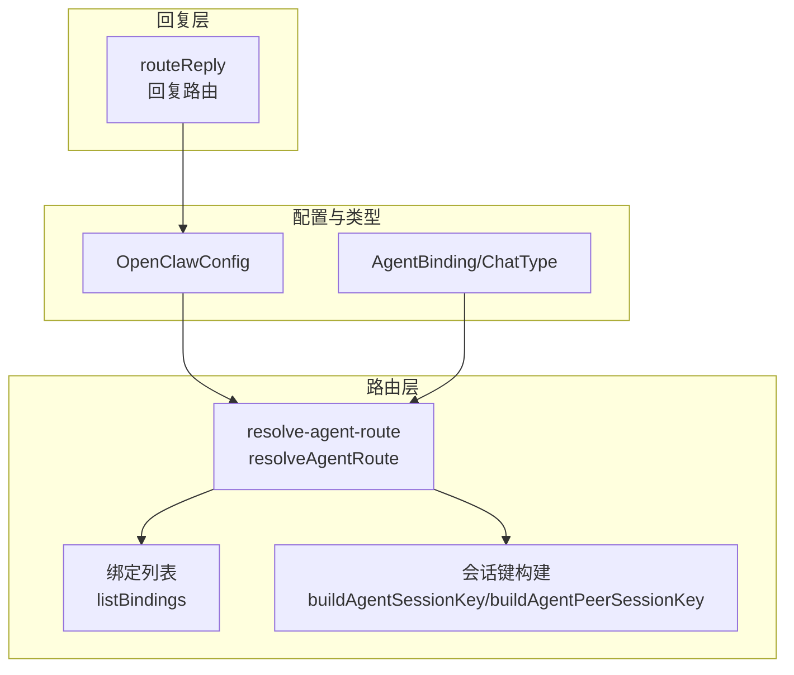
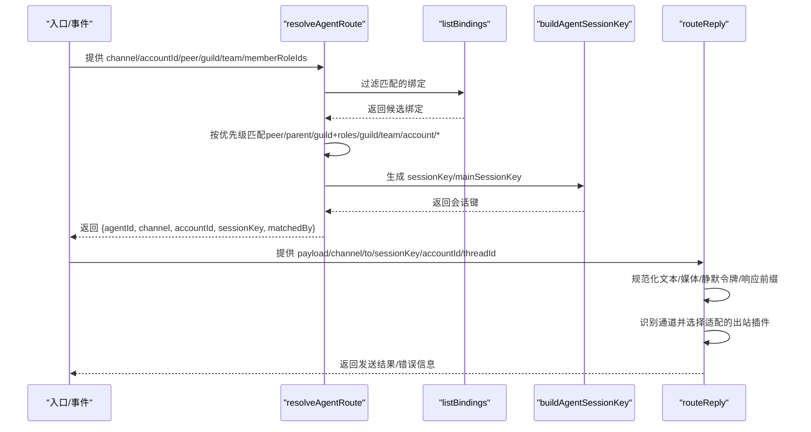
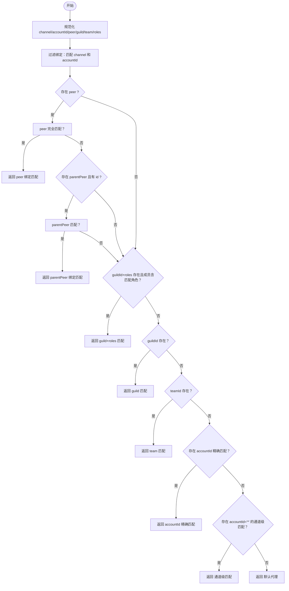
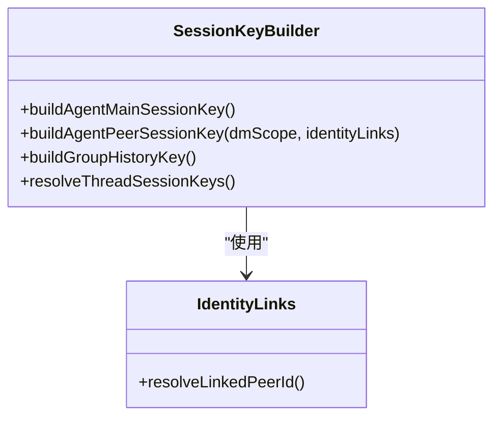
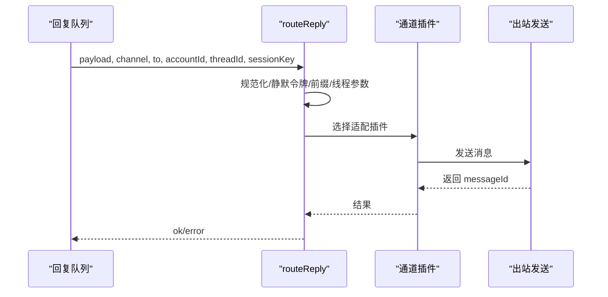
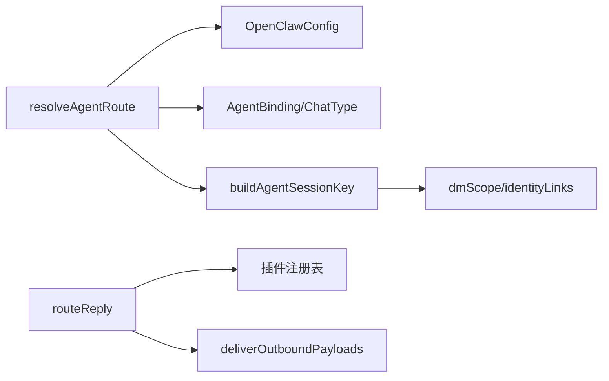

# 消息路由规则

<cite>
**本文引用的文件**
- [src/routing/resolve-route.ts](file://src/routing/resolve-route.ts)
- [src/routing/bindings.ts](file://src/routing/bindings.ts)
- [src/routing/session-key.ts](file://src/routing/session-key.ts)
- [src/auto-reply/reply/route-reply.ts](file://src/auto-reply/reply/route-reply.ts)
- [src/config/types.agents.ts](file://src/config/types.agents.ts)
- [src/channels/chat-type.ts](file://src/channels/chat-type.ts)
- [src/routing/resolve-route.test.ts](file://src/routing/resolve-route.test.ts)
- [src/routing/session-key.test.ts](file://src/routing/session-key.test.ts)
- [src/auto-reply/reply/route-reply.test.ts](file://src/auto-reply/reply/route-reply.test.ts)
- [src/auto-reply/reply/reply-routing.test.ts](file://src/auto-reply/reply/reply-routing.test.ts)
- [docs/concepts/multi-agent.md](file://docs/concepts/multi-agent.md)
- [docs/concepts/session.md](file://docs/concepts/session.md)
- [docs/gateway/security/index.md](file://docs/gateway/security/index.md)
</cite>

## 目录

1. [简介](#简介)
2. [项目结构](#项目结构)
3. [核心组件](#核心组件)
4. [架构总览](#架构总览)
5. [详细组件分析](#详细组件分析)
6. [依赖关系分析](#依赖关系分析)
7. [性能考量](#性能考量)
8. [故障排查指南](#故障排查指南)
9. [结论](#结论)
10. [附录](#附录)

## 简介

本文件面向OpenClaw的消息路由规则，系统性阐述消息到代理（Agent）的选择与会话键生成机制，覆盖目标解析、路由优先级、负载均衡策略、提及检测、命令门控、群组激活、会话标签管理、路由缓存与动态调整、以及广播/私聊/群组等特殊场景的处理逻辑。同时提供配置示例、决策流程图与自定义路由规则开发指南，并给出性能优化建议。

## 项目结构

OpenClaw将“路由”能力拆分为三层：

- 路由决策：根据通道、账号、目标（DM/群组/频道）、服务器/团队、成员角色等匹配绑定，选择代理并生成会话键。
- 会话键管理：规范化的agent会话键格式，支持主会话、按用户/渠道/账号隔离、线程/话题隔离、身份映射合并等。
- 回复路由：将回复消息定向回原始来源通道，确保跨通道共享会话时仍回到消息来源提供方。

图表来源

- [src/routing/resolve-route.ts](file://src/routing/resolve-route.ts#L185-L292)
- [src/routing/bindings.ts](file://src/routing/bindings.ts#L16-L18)
- [src/routing/session-key.ts](file://src/routing/session-key.ts#L82-L186)
- [src/auto-reply/reply/route-reply.ts](file://src/auto-reply/reply/route-reply.ts#L57-L147)
- [src/config/types.agents.ts](file://src/config/types.agents.ts#L73-L84)
- [src/channels/chat-type.ts](file://src/channels/chat-type.ts#L1-L19)

章节来源

- [src/routing/resolve-route.ts](file://src/routing/resolve-route.ts#L1-L293)
- [src/routing/bindings.ts](file://src/routing/bindings.ts#L1-L121)
- [src/routing/session-key.ts](file://src/routing/session-key.ts#L1-L263)
- [src/auto-reply/reply/route-reply.ts](file://src/auto-reply/reply/route-reply.ts#L1-L163)
- [src/config/types.agents.ts](file://src/config/types.agents.ts#L1-L85)
- [src/channels/chat-type.ts](file://src/channels/chat-type.ts#L1-L19)

## 核心组件

- 路由决策器：resolveAgentRoute，负责在多条绑定中按“最具体优先”原则匹配，生成代理ID、通道、账号、会话键与主会话键，并标注匹配来源。
- 绑定管理器：listBindings/listBoundAccountIds/resolveDefaultAgentBoundAccountId/buildChannelAccountBindings，用于枚举与查询绑定、默认账号、通道-代理-账号映射。
- 会话键生成器：buildAgentSessionKey/buildAgentPeerSessionKey，依据dmScope、identityLinks、线程/话题等生成标准化agent会话键；提供历史键与线程键工具函数。
- 回复路由器：routeReply，将回复消息发送至原始来源通道，处理空载、静默令牌、响应前缀、线程/话题参数、镜像写入等。

章节来源

- [src/routing/resolve-route.ts](file://src/routing/resolve-route.ts#L185-L292)
- [src/routing/bindings.ts](file://src/routing/bindings.ts#L16-L121)
- [src/routing/session-key.ts](file://src/routing/session-key.ts#L82-L263)
- [src/auto-reply/reply/route-reply.ts](file://src/auto-reply/reply/route-reply.ts#L57-L147)

## 架构总览

下图展示从输入到输出的关键调用链路与数据流：

图表来源

- [src/routing/resolve-route.ts](file://src/routing/resolve-route.ts#L185-L292)
- [src/routing/session-key.ts](file://src/routing/session-key.ts#L82-L186)
- [src/auto-reply/reply/route-reply.ts](file://src/auto-reply/reply/route-reply.ts#L57-L147)

## 详细组件分析

### 路由决策算法与优先级

- 匹配维度
  - 通道与账号：channel、accountId（支持“\*”匹配任意账号）
  - 目标：peer（kind/id），支持线程父peer继承
  - 社区/团队：guildId（Discord）、teamId（Slack）
  - 成员角色：memberRoleIds（Discord）
- 匹配顺序（最具体优先）
  1. peer完全匹配
  2. 线程父peer继承匹配
  3. guild+roles匹配（成员具备任一匹配角色）
  4. guild匹配
  5. team匹配
  6. accountId精确匹配（非“\*”）
  7. accountId=“\*”（任意账号）通道级匹配
  8. 默认代理
- 结果包含
  - agentId、channel、accountId
  - sessionKey（基于buildAgentSessionKey）
  - mainSessionKey（主会话键）
  - matchedBy（匹配来源，便于日志/调试）

图表来源

- [src/routing/resolve-route.ts](file://src/routing/resolve-route.ts#L185-L292)

章节来源

- [src/routing/resolve-route.ts](file://src/routing/resolve-route.ts#L185-L292)
- [src/routing/resolve-route.test.ts](file://src/routing/resolve-route.test.ts#L83-L229)
- [src/routing/resolve-route.test.ts](file://src/routing/resolve-route.test.ts#L257-L412)
- [src/routing/resolve-route.test.ts](file://src/routing/resolve-route.test.ts#L440-L595)
- [docs/concepts/multi-agent.md](file://docs/concepts/multi-agent.md#L123-L132)

### 会话键管理与标签

- 会话键格式
  - 主会话：agent:<agentId>:<mainKey>
  - 直接消息（DM）：
    - main：agent:<agentId>:<mainKey>
    - per-peer：agent:<agentId>:direct:<peerId>
    - per-channel-peer：agent:<agentId>:<channel>:direct:<peerId>
    - per-account-channel-peer：agent:<agentId>:<channel>:<accountId>:direct:<peerId>
  - 群组/频道：agent:<agentId>:<channel>:(group|channel):<id>
  - 线程/话题：在基础键后追加 :thread:<threadId>
- 身份链接（identityLinks）
  - 将不同通道的同一用户ID映射到一个规范ID，实现跨通道DM会话合并
- 历史键与线程键
  - buildGroupHistoryKey：群组/频道历史键
  - resolveThreadSessionKeys：线程/话题会话键派生

图表来源

- [src/routing/session-key.ts](file://src/routing/session-key.ts#L130-L263)

章节来源

- [src/routing/session-key.ts](file://src/routing/session-key.ts#L130-L263)
- [src/routing/session-key.test.ts](file://src/routing/session-key.test.ts#L1-L42)
- [docs/concepts/session.md](file://docs/concepts/session.md#L10-L101)
- [docs/gateway/security/index.md](file://docs/gateway/security/index.md#L198-L217)

### 回复路由与特殊场景

- 回复路由（routeReply）
  - 基于OriginatingChannel/OriginatingTo回源通道发送，避免因共享会话导致的通道错配
  - 处理空载、静默令牌、响应前缀、线程/话题参数（Slack/Telegram等）
  - 支持镜像写入会话转录（可选）
- 特殊场景
  - 广播消息：通过accountId=“\*”的通道级绑定实现
  - 私聊消息：peer绑定或按dmScope隔离
  - 群组消息：guildId/teamId绑定或群组/频道键隔离
  - 提及检测与命令门控：结合各通道插件的解析与过滤（不在本模块内实现，但路由结果影响后续处理）
  - 群组激活：通过群组/频道键隔离状态，避免跨群干扰

图表来源

- [src/auto-reply/reply/route-reply.ts](file://src/auto-reply/reply/route-reply.ts#L57-L147)

章节来源

- [src/auto-reply/reply/route-reply.ts](file://src/auto-reply/reply/route-reply.ts#L1-L163)
- [src/auto-reply/reply/route-reply.test.ts](file://src/auto-reply/reply/route-reply.test.ts#L119-L399)
- [src/auto-reply/reply/reply-routing.test.ts](file://src/auto-reply/reply/reply-routing.test.ts#L158-L247)

### 绑定与配置要点

- AgentBinding结构
  - agentId、match：channel、accountId、peer(kind/id)、guildId、teamId、roles
- 绑定枚举与查询
  - listBindings：获取所有绑定
  - listBoundAccountIds：列出通道上已绑定的账号集合
  - resolveDefaultAgentBoundAccountId：解析默认代理在某通道上的绑定账号
  - buildChannelAccountBindings：构建通道-代理-账号映射
- 配置示例与最佳实践
  - 多账号/多号码：通过accountId区分不同登录账号，分别路由到不同代理
  - 多用户DM隔离：dmScope设置为per-channel-peer或更高隔离级别
  - 跨通道合并：identityLinks将不同通道的同一用户映射到统一ID
  - 广播/允许列表：accountId=“\*”或通道级allowFrom控制来源

章节来源

- [src/config/types.agents.ts](file://src/config/types.agents.ts#L73-L84)
- [src/routing/bindings.ts](file://src/routing/bindings.ts#L16-L121)
- [docs/concepts/multi-agent.md](file://docs/concepts/multi-agent.md#L89-L138)
- [docs/concepts/session.md](file://docs/concepts/session.md#L10-L101)
- [docs/gateway/security/index.md](file://docs/gateway/security/index.md#L198-L217)

## 依赖关系分析

- resolveAgentRoute依赖
  - 配置：OpenClawConfig
  - 类型：AgentBinding、ChatType
  - 工具：会话键构建、默认代理解析、通道/账号/代理ID归一化
- 会话键生成依赖
  - dmScope、identityLinks、peerKind、peerId、channel、accountId
- 回复路由依赖
  - 插件注册表、通道插件、出站发送器、镜像写入

图表来源

- [src/routing/resolve-route.ts](file://src/routing/resolve-route.ts#L1-L13)
- [src/routing/session-key.ts](file://src/routing/session-key.ts#L1-L9)
- [src/auto-reply/reply/route-reply.ts](file://src/auto-reply/reply/route-reply.ts#L10-L17)

章节来源

- [src/routing/resolve-route.ts](file://src/routing/resolve-route.ts#L1-L13)
- [src/routing/session-key.ts](file://src/routing/session-key.ts#L1-L9)
- [src/auto-reply/reply/route-reply.ts](file://src/auto-reply/reply/route-reply.ts#L10-L17)

## 性能考量

- 匹配复杂度
  - 绑定过滤与线性扫描：O(B)，B为绑定数量。可通过预构建索引（通道-账号-目标）降低查找成本。
- 会话键生成
  - 字符串拼接与正则校验开销低，主要瓶颈在identityLinks映射查找，建议缓存映射表。
- 回复路由
  - 出站发送为IO密集，建议批量/并发控制与背压策略；对Slack/Telegram等通道的线程参数处理需避免重复请求。
- 缓存与预计算
  - 绑定匹配结果、通道-代理-账号映射、identityLinks映射可缓存，减少重复计算。
- 负载均衡
  - 当前实现按绑定顺序取首个匹配，未内置代理池轮询；可通过外部调度器或多实例部署实现均衡。

[本节为通用指导，不直接分析具体文件]

## 故障排查指南

- 常见问题
  - 未命中任何绑定：检查accountId是否为“\*”，或是否存在更具体的peer/guild绑定
  - 线程继承未生效：确认parentPeer是否传入且id非空
  - 角色路由不生效：确认memberRoleIds是否传入，roles数组是否为空（空数组视为无限制）
  - DM未隔离：检查dmScope设置与identityLinks配置
  - 回复未回源：确认channel与to是否正确，routeReply是否被调用
- 排查步骤
  - 启用详细日志，观察matchedBy字段
  - 使用测试用例对照期望行为（参考测试文件）
  - 校验配置文件中的bindings与session项
- 相关测试参考
  - 路由优先级与继承：resolve-route.test.ts
  - 会话键分类与兼容性：session-key.test.ts
  - 回复路由与通道适配：route-reply.test.ts、reply-routing.test.ts

章节来源

- [src/routing/resolve-route.test.ts](file://src/routing/resolve-route.test.ts#L1-L596)
- [src/routing/session-key.test.ts](file://src/routing/session-key.test.ts#L1-L42)
- [src/auto-reply/reply/route-reply.test.ts](file://src/auto-reply/reply/route-reply.test.ts#L1-L453)
- [src/auto-reply/reply/reply-routing.test.ts](file://src/auto-reply/reply/reply-routing.test.ts#L1-L248)

## 结论

OpenClaw的消息路由规则以“最具体优先”的绑定匹配为核心，结合会话键的灵活构造与回复路由的回源机制，实现了跨通道、多账号、多用户场景下的稳定与可控。通过dmScope、identityLinks、通道级绑定与角色路由，系统在安全与可用之间提供了可调的平衡点。建议在生产环境配合缓存与预计算提升性能，并通过测试用例持续验证路由行为。

[本节为总结，不直接分析具体文件]

## 附录

### 路由规则优先级与冲突解决

- 优先级（从高到低）
  1. peer完全匹配
  2. 线程父peer继承匹配
  3. guild+roles匹配
  4. guild匹配
  5. team匹配
  6. accountId精确匹配
  7. accountId=“\*”通道级匹配
  8. 默认代理
- 冲突解决
  - 绑定键冲突：同match键仅保留一条；重复添加跳过，不同代理冲突记录
  - 多角色匹配：取第一个匹配的绑定

章节来源

- [src/routing/resolve-route.ts](file://src/routing/resolve-route.ts#L185-L292)
- [src/commands/agents.bindings.ts](file://src/commands/agents.bindings.ts#L39-L90)

### 特殊路由场景处理

- 广播消息：accountId=“\*”的通道级绑定
- 私聊消息：peer绑定或按dmScope隔离
- 群组消息：guildId/teamId绑定或群组/频道键隔离
- 线程/话题：resolveThreadSessionKeys派生子会话键
- 身份合并：identityLinks将多通道同一用户映射为统一ID

章节来源

- [src/routing/resolve-route.ts](file://src/routing/resolve-route.ts#L230-L292)
- [src/routing/session-key.ts](file://src/routing/session-key.ts#L246-L263)
- [docs/concepts/session.md](file://docs/concepts/session.md#L10-L101)

### 自定义路由规则开发指南

- 新增匹配条件
  - 在AgentBinding中扩展match字段（如新增teamId、roles等）
  - 在resolveAgentRoute中增加匹配分支与优先级判断
- 会话键扩展
  - 在buildAgentPeerSessionKey中增加新的dmScope或键片段
  - 更新resolveThreadSessionKeys以支持新场景
- 测试与验证
  - 参考resolve-route.test.ts与session-key.test.ts编写用例
  - 使用route-reply.test.ts验证回复路由行为

章节来源

- [src/config/types.agents.ts](file://src/config/types.agents.ts#L73-L84)
- [src/routing/resolve-route.ts](file://src/routing/resolve-route.ts#L185-L292)
- [src/routing/session-key.ts](file://src/routing/session-key.ts#L130-L263)
- [src/routing/resolve-route.test.ts](file://src/routing/resolve-route.test.ts#L1-L596)
- [src/routing/session-key.test.ts](file://src/routing/session-key.test.ts#L1-L42)
- [src/auto-reply/reply/route-reply.test.ts](file://src/auto-reply/reply/route-reply.test.ts#L1-L453)
