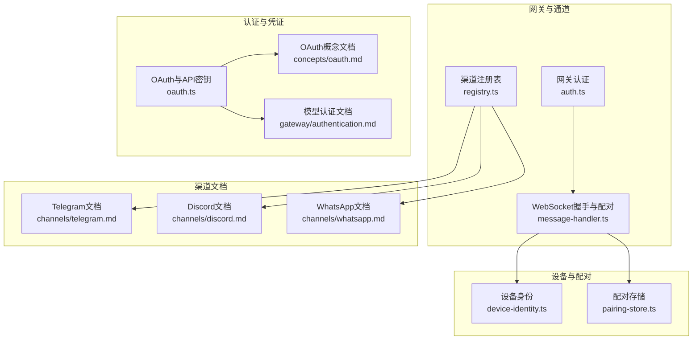
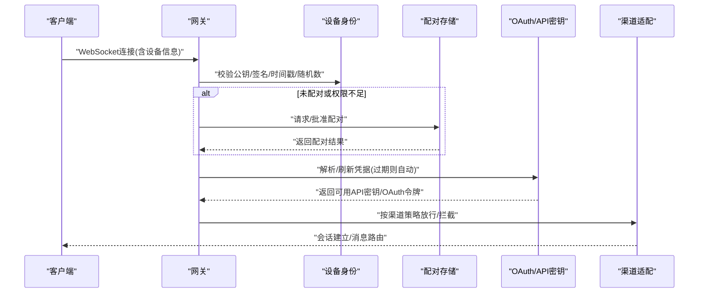
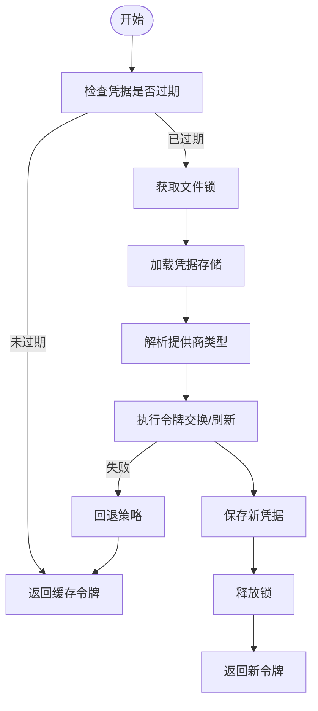
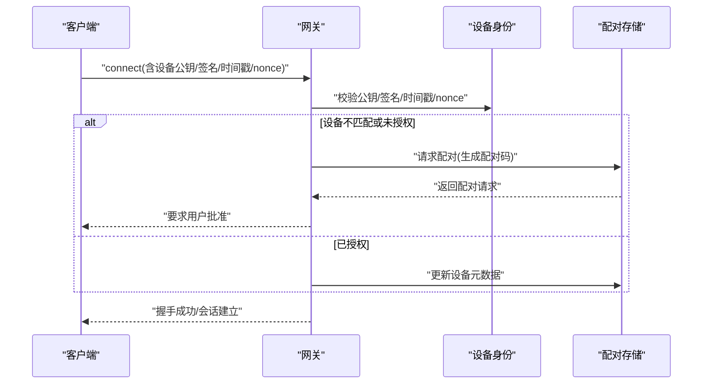
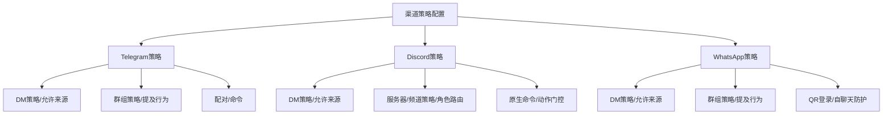
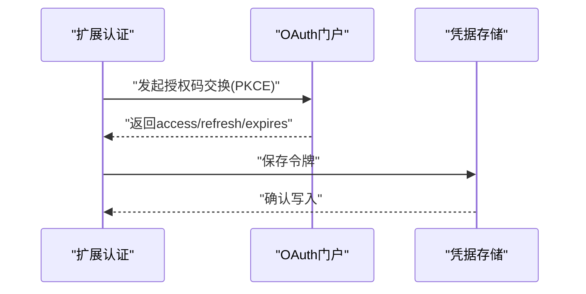
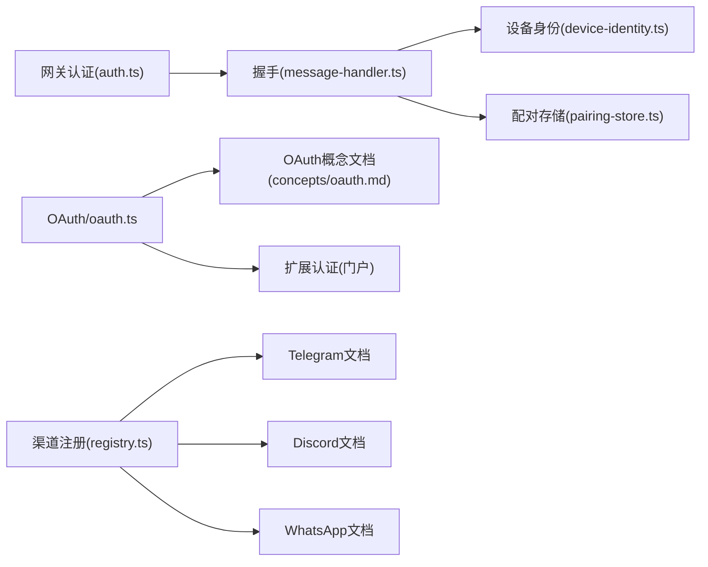

# 渠道认证系统

<cite>
**本文档引用的文件**
- [src/agents/auth-profiles/oauth.ts](file://src/agents/auth-profiles/oauth.ts)
- [src/gateway/server/ws-connection/message-handler.ts](file://src/gateway/server/ws-connection/message-handler.ts)
- [src/pairing/pairing-store.ts](file://src/pairing/pairing-store.ts)
- [src/infra/device-identity.ts](file://src/infra/device-identity.ts)
- [src/gateway/auth.ts](file://src/gateway/auth.ts)
- [docs/concepts/oauth.md](file://docs/concepts/oauth.md)
- [docs/channels/telegram.md](file://docs/channels/telegram.md)
- [docs/channels/discord.md](file://docs/channels/discord.md)
- [docs/channels/whatsapp.md](file://docs/channels/whatsapp.md)
- [docs/gateway/authentication.md](file://docs/gateway/authentication.md)
- [apps/macos/Sources/OpenClaw/ChannelsStore+Lifecycle.swift](file://apps/macos/Sources/OpenClaw/ChannelsStore+Lifecycle.swift)
- [extensions/google-antigravity-auth/index.ts](file://extensions/google-antigravity-auth/index.ts)
- [extensions/minimax-portal-auth/oauth.ts](file://extensions/minimax-portal-auth/oauth.ts)
- [extensions/twitch/src/twitch-client.ts](file://extensions/twitch/src/twitch-client.ts)
- [src/channels/registry.ts](file://src/channels/registry.ts)
- [ui/src/ui/views/channels.whatsapp.ts](file://ui/src/ui/views/channels.whatsapp.ts)
</cite>

## 目录

1. [简介](#简介)
2. [项目结构](#项目结构)
3. [核心组件](#核心组件)
4. [架构总览](#架构总览)
5. [详细组件分析](#详细组件分析)
6. [依赖关系分析](#依赖关系分析)
7. [性能考虑](#性能考虑)
8. [故障排查指南](#故障排查指南)
9. [结论](#结论)
10. [附录：新渠道认证集成指南与安全最佳实践](#附录新渠道认证集成指南与安全最佳实践)

## 简介

本文件面向OpenClaw渠道认证系统，系统性阐述多渠道认证机制设计，覆盖API密钥管理、OAuth流程、设备配对协议；详解认证状态管理、令牌刷新与会话保持；解析Telegram Bot Token、Discord Bot Token、WhatsApp设备认证等渠道特定认证方式；并给出安全策略、密钥存储与访问控制机制、认证流程图与安全架构图、加密存储与传输说明、新渠道集成指南与安全最佳实践。

## 项目结构

OpenClaw采用分层与模块化组织，认证相关能力主要分布在以下区域：

- 认证配置与策略：网关认证（token/password）、Tailscale身份、本地直连判定
- 设备身份与配对：设备公私钥生成、签名验证、配对请求与授权
- OAuth与API密钥：统一凭据存储与刷新、多账户/多提供商支持
- 渠道适配：Telegram/Discord/WhatsApp等渠道的接入与访问控制
- 扩展插件：第三方OAuth门户与平台认证扩展

**图表来源**

- [src/gateway/auth.ts](file://src/gateway/auth.ts#L1-L271)
- [src/gateway/server/ws-connection/message-handler.ts](file://src/gateway/server/ws-connection/message-handler.ts#L1-L800)
- [src/infra/device-identity.ts](file://src/infra/device-identity.ts#L1-L180)
- [src/pairing/pairing-store.ts](file://src/pairing/pairing-store.ts#L1-L491)
- [src/agents/auth-profiles/oauth.ts](file://src/agents/auth-profiles/oauth.ts#L1-L286)
- [src/channels/registry.ts](file://src/channels/registry.ts#L28-L73)
- [docs/concepts/oauth.md](file://docs/concepts/oauth.md#L1-L146)
- [docs/gateway/authentication.md](file://docs/gateway/authentication.md#L1-L146)
- [docs/channels/telegram.md](file://docs/channels/telegram.md#L1-L697)
- [docs/channels/discord.md](file://docs/channels/discord.md#L1-L485)
- [docs/channels/whatsapp.md](file://docs/channels/whatsapp.md#L1-L435)

**章节来源**

- [src/gateway/auth.ts](file://src/gateway/auth.ts#L1-L271)
- [src/gateway/server/ws-connection/message-handler.ts](file://src/gateway/server/ws-connection/message-handler.ts#L1-L800)
- [src/infra/device-identity.ts](file://src/infra/device-identity.ts#L1-L180)
- [src/pairing/pairing-store.ts](file://src/pairing/pairing-store.ts#L1-L491)
- [src/agents/auth-profiles/oauth.ts](file://src/agents/auth-profiles/oauth.ts#L1-L286)
- [src/channels/registry.ts](file://src/channels/registry.ts#L28-L73)
- [docs/concepts/oauth.md](file://docs/concepts/oauth.md#L1-L146)
- [docs/gateway/authentication.md](file://docs/gateway/authentication.md#L1-L146)
- [docs/channels/telegram.md](file://docs/channels/telegram.md#L1-L697)
- [docs/channels/discord.md](file://docs/channels/discord.md#L1-L485)
- [docs/channels/whatsapp.md](file://docs/channels/whatsapp.md#L1-L435)

## 核心组件

- 网关认证与授权：支持token/password模式，可选Tailscale身份透传，本地直连检测与代理信任处理。
- 设备身份与配对：基于Ed25519的设备公私钥、设备指纹、签名与校验、配对请求与授权、允许来源白名单。
- OAuth与API密钥：统一凭据存储与刷新，支持多提供商与多账户，过期自动刷新与降级回退。
- 渠道接入与访问控制：Telegram/Discord/WhatsApp等渠道的令牌与策略配置、消息路由与会话隔离。
- 扩展认证：Google Antigravity、MiniMax门户、Twitch等第三方OAuth门户的令牌交换与刷新。

**章节来源**

- [src/gateway/auth.ts](file://src/gateway/auth.ts#L178-L271)
- [src/infra/device-identity.ts](file://src/infra/device-identity.ts#L56-L120)
- [src/pairing/pairing-store.ts](file://src/pairing/pairing-store.ts#L147-L198)
- [src/agents/auth-profiles/oauth.ts](file://src/agents/auth-profiles/oauth.ts#L36-L106)
- [docs/channels/telegram.md](file://docs/channels/telegram.md#L24-L75)
- [docs/channels/discord.md](file://docs/channels/discord.md#L24-L80)
- [docs/channels/whatsapp.md](file://docs/channels/whatsapp.md#L24-L81)
- [extensions/google-antigravity-auth/index.ts](file://extensions/google-antigravity-auth/index.ts#L169-L210)
- [extensions/minimax-portal-auth/oauth.ts](file://extensions/minimax-portal-auth/oauth.ts#L141-L185)
- [extensions/twitch/src/twitch-client.ts](file://extensions/twitch/src/twitch-client.ts#L34-L72)

## 架构总览

下图展示OpenClaw认证系统的端到端交互：客户端通过WebSocket连接网关，进行设备身份校验与配对；网关根据配置决定是否需要共享密钥或设备令牌；随后进入渠道接入阶段，依据渠道策略与允许来源进行访问控制；同时，OAuth/API密钥在运行时按需刷新并注入到请求中。

**图表来源**

- [src/gateway/server/ws-connection/message-handler.ts](file://src/gateway/server/ws-connection/message-handler.ts#L484-L728)
- [src/infra/device-identity.ts](file://src/infra/device-identity.ts#L122-L179)
- [src/pairing/pairing-store.ts](file://src/pairing/pairing-store.ts#L440-L491)
- [src/agents/auth-profiles/oauth.ts](file://src/agents/auth-profiles/oauth.ts#L149-L286)
- [docs/channels/telegram.md](file://docs/channels/telegram.md#L104-L206)
- [docs/channels/discord.md](file://docs/channels/discord.md#L90-L172)
- [docs/channels/whatsapp.md](file://docs/channels/whatsapp.md#L134-L192)

## 详细组件分析

### 组件A：OAuth与API密钥管理

- 统一存储：每个Agent独立的凭据存储，避免跨应用令牌冲突。
- 刷新策略：到期检查与文件锁保护下的并发刷新，失败时回退至备用配置或主Agent凭据。
- 多提供商：内置OAuth提供商解析与扩展提供商（如Qwen门户、Chutes）。
- 令牌构建：针对不同提供商（如Google Gemini CLI）构造带projectId的API Key。

**图表来源**

- [src/agents/auth-profiles/oauth.ts](file://src/agents/auth-profiles/oauth.ts#L36-L106)
- [src/agents/auth-profiles/oauth.ts](file://src/agents/auth-profiles/oauth.ts#L149-L286)
- [docs/concepts/oauth.md](file://docs/concepts/oauth.md#L26-L108)

**章节来源**

- [src/agents/auth-profiles/oauth.ts](file://src/agents/auth-profiles/oauth.ts#L1-L286)
- [docs/concepts/oauth.md](file://docs/concepts/oauth.md#L1-L146)
- [docs/gateway/authentication.md](file://docs/gateway/authentication.md#L1-L146)

### 组件B：设备身份与配对协议

- 设备身份：Ed25519密钥对生成与持久化，设备ID由公钥哈希派生。
- 握手校验：公钥格式归一、签名验证、时间戳偏差容忍、随机数nonce校验。
- 配对流程：生成唯一配对码、限制过期与上限、允许来源白名单合并与去重。
- 权限升级：角色与作用域变更触发重新配对请求。

**图表来源**

- [src/gateway/server/ws-connection/message-handler.ts](file://src/gateway/server/ws-connection/message-handler.ts#L484-L728)
- [src/infra/device-identity.ts](file://src/infra/device-identity.ts#L122-L179)
- [src/pairing/pairing-store.ts](file://src/pairing/pairing-store.ts#L343-L438)

**章节来源**

- [src/infra/device-identity.ts](file://src/infra/device-identity.ts#L1-L180)
- [src/pairing/pairing-store.ts](file://src/pairing/pairing-store.ts#L1-L491)
- [src/gateway/server/ws-connection/message-handler.ts](file://src/gateway/server/ws-connection/message-handler.ts#L484-L728)

### 组件C：渠道特定认证与访问控制

- Telegram Bot API：Bot Token配置与环境变量回退、DM/群组策略、配对模式、命令菜单与动作门控。
- Discord Bot API：Bot Token配置、意图启用、DM/服务器/频道策略、提及与角色路由、PluralKit支持。
- WhatsApp Web：QR登录、自聊天防护、DM/群组策略、提及与激活命令、媒体与读回执。

**图表来源**

- [docs/channels/telegram.md](file://docs/channels/telegram.md#L104-L206)
- [docs/channels/discord.md](file://docs/channels/discord.md#L90-L172)
- [docs/channels/whatsapp.md](file://docs/channels/whatsapp.md#L134-L192)

**章节来源**

- [docs/channels/telegram.md](file://docs/channels/telegram.md#L1-L697)
- [docs/channels/discord.md](file://docs/channels/discord.md#L1-L485)
- [docs/channels/whatsapp.md](file://docs/channels/whatsapp.md#L1-L435)

### 组件D：扩展认证（OAuth门户与平台）

- Google Antigravity：PKCE授权码交换，生成access/refresh/expires，错误处理与超时容错。
- MiniMax门户：轮询授权状态，校验响应结构，返回完整令牌集。
- Twitch：使用RefreshingAuthProvider自动刷新，记录刷新事件与失败日志。

**图表来源**

- [extensions/google-antigravity-auth/index.ts](file://extensions/google-antigravity-auth/index.ts#L169-L210)
- [extensions/minimax-portal-auth/oauth.ts](file://extensions/minimax-portal-auth/oauth.ts#L141-L185)
- [extensions/twitch/src/twitch-client.ts](file://extensions/twitch/src/twitch-client.ts#L34-L72)

**章节来源**

- [extensions/google-antigravity-auth/index.ts](file://extensions/google-antigravity-auth/index.ts#L169-L210)
- [extensions/minimax-portal-auth/oauth.ts](file://extensions/minimax-portal-auth/oauth.ts#L141-L185)
- [extensions/twitch/src/twitch-client.ts](file://extensions/twitch/src/twitch-client.ts#L34-L72)

## 依赖关系分析

- 组件耦合与内聚：设备身份与配对紧密耦合于握手流程；OAuth与API密钥作为“凭据源”被各渠道复用；渠道策略与允许来源白名单相互影响。
- 外部依赖：第三方OAuth门户（Google Antigravity、MiniMax、Twitch）、Telegram/Discord/WhatsApp API。
- 可能的循环依赖：无直接循环，但渠道策略可能间接影响配对与授权路径。

**图表来源**

- [src/gateway/auth.ts](file://src/gateway/auth.ts#L1-L271)
- [src/gateway/server/ws-connection/message-handler.ts](file://src/gateway/server/ws-connection/message-handler.ts#L1-L800)
- [src/infra/device-identity.ts](file://src/infra/device-identity.ts#L1-L180)
- [src/pairing/pairing-store.ts](file://src/pairing/pairing-store.ts#L1-L491)
- [src/agents/auth-profiles/oauth.ts](file://src/agents/auth-profiles/oauth.ts#L1-L286)
- [src/channels/registry.ts](file://src/channels/registry.ts#L28-L73)
- [docs/concepts/oauth.md](file://docs/concepts/oauth.md#L1-L146)
- [docs/channels/telegram.md](file://docs/channels/telegram.md#L1-L697)
- [docs/channels/discord.md](file://docs/channels/discord.md#L1-L485)
- [docs/channels/whatsapp.md](file://docs/channels/whatsapp.md#L1-L435)

**章节来源**

- [src/gateway/auth.ts](file://src/gateway/auth.ts#L1-L271)
- [src/gateway/server/ws-connection/message-handler.ts](file://src/gateway/server/ws-connection/message-handler.ts#L1-L800)
- [src/infra/device-identity.ts](file://src/infra/device-identity.ts#L1-L180)
- [src/pairing/pairing-store.ts](file://src/pairing/pairing-store.ts#L1-L491)
- [src/agents/auth-profiles/oauth.ts](file://src/agents/auth-profiles/oauth.ts#L1-L286)
- [src/channels/registry.ts](file://src/channels/registry.ts#L28-L73)
- [docs/concepts/oauth.md](file://docs/concepts/oauth.md#L1-L146)
- [docs/channels/telegram.md](file://docs/channels/telegram.md#L1-L697)
- [docs/channels/discord.md](file://docs/channels/discord.md#L1-L485)
- [docs/channels/whatsapp.md](file://docs/channels/whatsapp.md#L1-L435)

## 性能考虑

- 文件锁与并发：OAuth刷新与配对存储均使用文件锁，避免竞态；建议合理设置锁重试参数与过期时间。
- 过期与缓存：凭据过期前使用缓存令牌，减少频繁刷新；配对请求按时间窗口裁剪，限制上限。
- 网络与API：渠道侧调用外部API（Telegram/Discord/WhatsApp）时，注意超时与重试策略，避免阻塞握手。
- 资源清理：配对请求过期自动清理，避免磁盘膨胀；设备身份文件权限严格（0600）。

[本节为通用指导，无需列出具体文件来源]

## 故障排查指南

- OAuth刷新失败：检查提供商返回结构、网络可达性与回调端口；查看回退逻辑与提示信息。
- 设备配对失败：核对公钥/签名、时间戳偏差、nonce一致性；确认配对码是否过期或被批准。
- 渠道策略问题：核对允许来源白名单、提及规则与群组配置；使用诊断命令与日志定位。
- 环境变量与令牌：确保环境变量正确回退到默认账户；避免跨应用令牌冲突。

**章节来源**

- [src/agents/auth-profiles/oauth.ts](file://src/agents/auth-profiles/oauth.ts#L271-L286)
- [src/gateway/server/ws-connection/message-handler.ts](file://src/gateway/server/ws-connection/message-handler.ts#L484-L728)
- [docs/channels/telegram.md](file://docs/channels/telegram.md#L626-L670)
- [docs/channels/discord.md](file://docs/channels/discord.md#L396-L454)
- [docs/channels/whatsapp.md](file://docs/channels/whatsapp.md#L365-L414)

## 结论

OpenClaw通过“统一凭据存储+自动刷新”、“设备身份+配对授权”、“渠道策略+允许来源白名单”的组合，实现了多渠道、多提供商的认证体系。其设计强调安全性（密钥存储权限、签名验证、Tailscale身份透传）、可观测性（日志与诊断）、可维护性（配置驱动与回退策略）。对于新增渠道，遵循本文档的集成与安全最佳实践，可快速、安全地完成认证能力接入。

[本节为总结性内容，无需列出具体文件来源]

## 附录：新渠道认证集成指南与安全最佳实践

### 新渠道认证集成步骤

- 定义渠道元数据与文档路径，参考渠道注册表与文档模板。
- 实现渠道令牌解析与环境变量回退，确保默认账户与多账户支持。
- 集成配对流程：生成配对码、限制过期与上限、允许来源白名单合并。
- 实现访问控制：DM/群组策略、提及规则、命令菜单与动作门控。
- 集成OAuth（如适用）：PKCE交换、令牌刷新、错误处理与回退策略。
- 测试与诊断：使用诊断命令、日志与故障排查文档进行验证。

**章节来源**

- [src/channels/registry.ts](file://src/channels/registry.ts#L28-L73)
- [docs/channels/telegram.md](file://docs/channels/telegram.md#L1-L697)
- [docs/channels/discord.md](file://docs/channels/discord.md#L1-L485)
- [docs/channels/whatsapp.md](file://docs/channels/whatsapp.md#L1-L435)
- [src/pairing/pairing-store.ts](file://src/pairing/pairing-store.ts#L147-L198)
- [src/agents/auth-profiles/oauth.ts](file://src/agents/auth-profiles/oauth.ts#L36-L106)

### 安全最佳实践

- 密钥存储：凭据文件权限严格（0600），避免明文存储；优先使用Agent隔离存储。
- 传输安全：所有对外API调用使用HTTPS；WebSocket连接建议TLS。
- 授权最小化：仅授予渠道所需权限；使用角色与作用域升级触发重新配对。
- 审计与监控：启用日志与诊断命令；定期检查令牌状态与配对请求。
- 回退与容错：实现多级回退（备用配置、主Agent凭据、提示信息）；对第三方OAuth门户增加错误处理与重试。

**章节来源**

- [src/infra/device-identity.ts](file://src/infra/device-identity.ts#L104-L120)
- [src/gateway/auth.ts](file://src/gateway/auth.ts#L178-L271)
- [src/agents/auth-profiles/oauth.ts](file://src/agents/auth-profiles/oauth.ts#L271-L286)
- [docs/gateway/authentication.md](file://docs/gateway/authentication.md#L1-L146)
