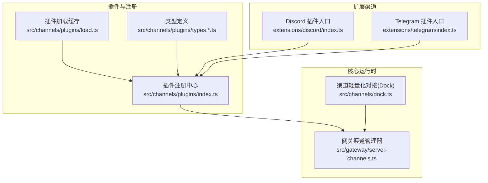
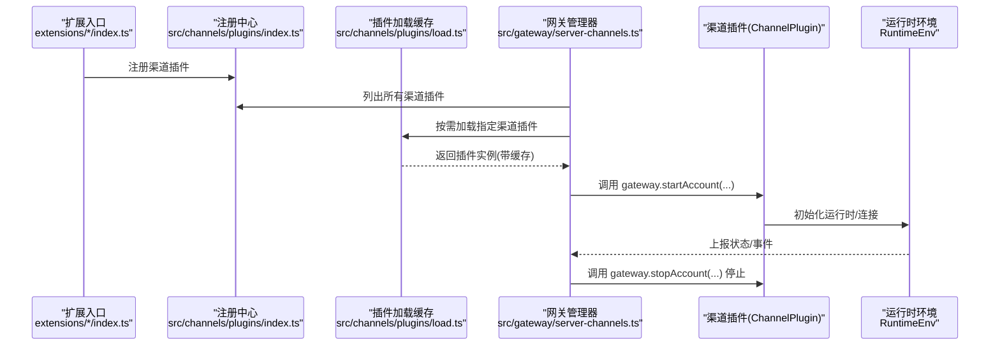
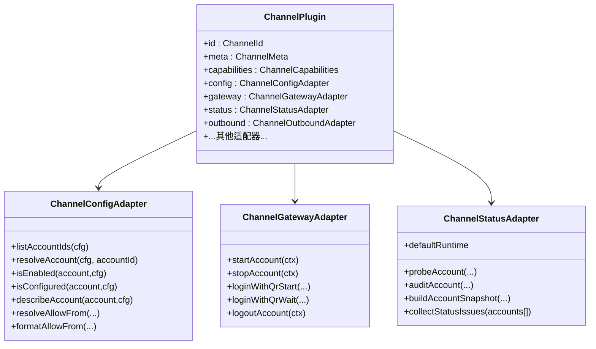
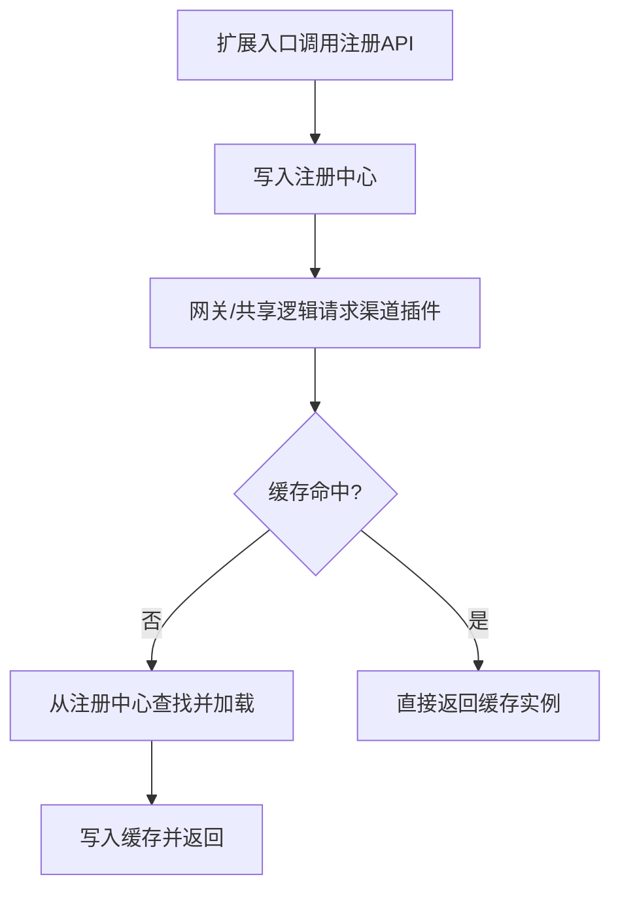
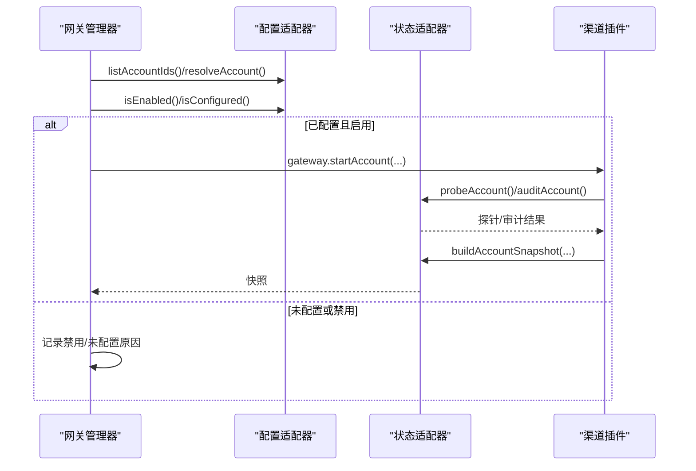
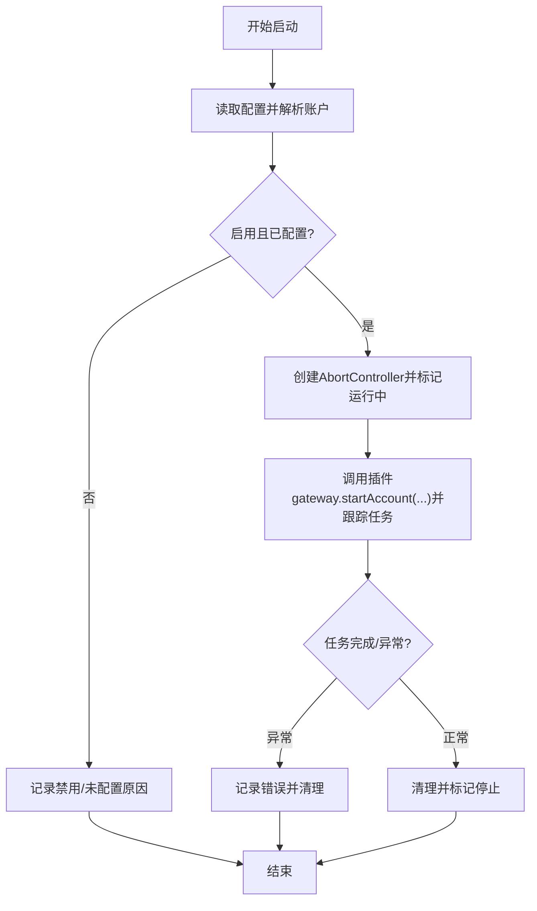
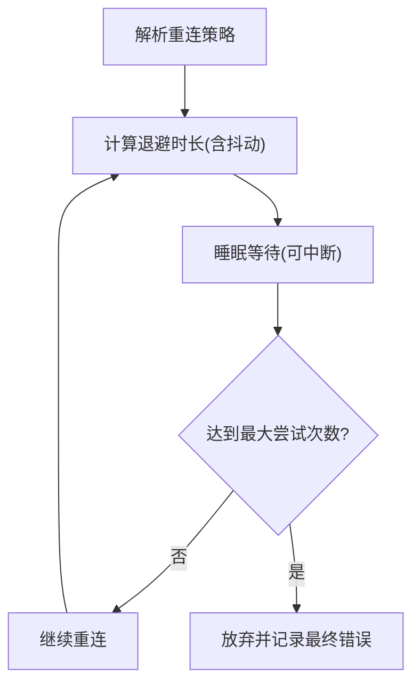
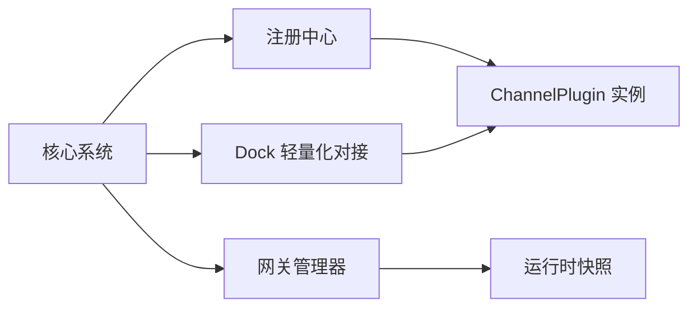

# 渠道适配器架构

<cite>
**本文引用的文件**
- [src/channels/plugins/types.ts](file://src/channels/plugins/types.ts)
- [src/channels/plugins/types.adapters.ts](file://src/channels/plugins/types.adapters.ts)
- [src/channels/plugins/types.core.ts](file://src/channels/plugins/types.core.ts)
- [src/channels/plugins/types.plugin.ts](file://src/channels/plugins/types.plugin.ts)
- [src/channels/plugins/index.ts](file://src/channels/plugins/index.ts)
- [src/channels/plugins/load.ts](file://src/channels/plugins/load.ts)
- [src/channels/plugins/status.ts](file://src/channels/plugins/status.ts)
- [src/channels/dock.ts](file://src/channels/dock.ts)
- [src/gateway/server-channels.ts](file://src/gateway/server-channels.ts)
- [src/web/reconnect.ts](file://src/web/reconnect.ts)
- [src/channels/plugins/pairing.ts](file://src/channels/plugins/pairing.ts)
- [extensions/discord/index.ts](file://extensions/discord/index.ts)
- [extensions/telegram/index.ts](file://extensions/telegram/index.ts)
</cite>

## 目录

1. [引言](#引言)
2. [项目结构](#项目结构)
3. [核心组件](#核心组件)
4. [架构总览](#架构总览)
5. [关键组件详解](#关键组件详解)
6. [依赖关系分析](#依赖关系分析)
7. [性能考量](#性能考量)
8. [故障排查指南](#故障排查指南)
9. [结论](#结论)
10. [附录：新渠道适配器开发指南与最佳实践](#附录新渠道适配器开发指南与最佳实践)

## 引言

本文件系统化阐述 OpenClaw 的“渠道适配器”架构，围绕统一渠道接口抽象、适配器注册机制、配置与生命周期管理、状态与连接池、错误与重试策略等维度展开，并给出架构图与注册流程图，帮助开发者快速理解并扩展新的渠道适配器。

## 项目结构

OpenClaw 将“渠道”抽象为可插拔的插件，通过插件注册中心集中管理；核心运行时在网关侧对各渠道进行生命周期管理；共享能力（如 Dock）提供轻量化的跨渠道行为与配置支持；部分渠道以扩展形式存在，按需加载。

图表来源

- [src/channels/plugins/index.ts](file://src/channels/plugins/index.ts#L1-L85)
- [src/channels/plugins/load.ts](file://src/channels/plugins/load.ts#L1-L29)
- [src/channels/plugins/types.ts](file://src/channels/plugins/types.ts#L1-L64)
- [src/gateway/server-channels.ts](file://src/gateway/server-channels.ts#L64-L308)
- [src/channels/dock.ts](file://src/channels/dock.ts#L44-L525)
- [extensions/discord/index.ts](file://extensions/discord/index.ts#L1-L18)
- [extensions/telegram/index.ts](file://extensions/telegram/index.ts#L1-L18)

章节来源

- [src/channels/plugins/index.ts](file://src/channels/plugins/index.ts#L1-L85)
- [src/channels/plugins/load.ts](file://src/channels/plugins/load.ts#L1-L29)
- [src/channels/plugins/types.ts](file://src/channels/plugins/types.ts#L1-L64)
- [src/gateway/server-channels.ts](file://src/gateway/server-channels.ts#L64-L308)
- [src/channels/dock.ts](file://src/channels/dock.ts#L44-L525)
- [extensions/discord/index.ts](file://extensions/discord/index.ts#L1-L18)
- [extensions/telegram/index.ts](file://extensions/telegram/index.ts#L1-L18)

## 核心组件

- 统一渠道接口抽象
  - 适配器接口族：认证、配置、目录、解析、安全、命令、心跳、群组、消息、网关、出站、状态、流式、线程、动作、代理工具等。
  - 核心数据模型：渠道 ID、账户快照、能力集、消息动作名、线程上下文、目录条目等。
  - 插件契约：ChannelPlugin，声明渠道元信息、能力、适配器集合、默认值、重载策略等。
- 注册与发现
  - 运行时注册中心：集中列出与去重渠道插件，提供标准化的渠道 ID 规范化与排序。
  - 插件加载缓存：基于当前活跃注册表的插件实例缓存，避免重复导入。
- 生命周期与运行时
  - 网关渠道管理器：负责启动/停止单个或全部渠道账号，维护运行时快照、中止信号、任务跟踪与最终态落盘。
  - 轻量化对接 Dock：为共享路径提供低成本的渠道行为与配置支持（如允许列表格式化、提及清理、线程上下文构建等）。
- 配置与状态
  - 配置适配器：账户枚举、解析、启用/禁用、删除、是否已配置、描述账户快照、允许来源解析与格式化等。
  - 状态适配器：探针、审计、构建账户快照、默认运行时、日志自标识、状态推断、问题收集等。
- 错误与重试
  - 重连策略：指数退避、抖动、最大尝试次数、心跳周期等可配置。
  - 失败归因：根据状态码、错误码、超时提示等推断失败原因，用于分流处理与降级。

章节来源

- [src/channels/plugins/types.adapters.ts](file://src/channels/plugins/types.adapters.ts#L22-L313)
- [src/channels/plugins/types.core.ts](file://src/channels/plugins/types.core.ts#L11-L338)
- [src/channels/plugins/types.plugin.ts](file://src/channels/plugins/types.plugin.ts#L48-L85)
- [src/channels/plugins/index.ts](file://src/channels/plugins/index.ts#L31-L57)
- [src/channels/plugins/load.ts](file://src/channels/plugins/load.ts#L16-L29)
- [src/gateway/server-channels.ts](file://src/gateway/server-channels.ts#L64-L308)
- [src/channels/dock.ts](file://src/channels/dock.ts#L44-L525)
- [src/channels/plugins/status.ts](file://src/channels/plugins/status.ts#L5-L37)
- [src/web/reconnect.ts](file://src/web/reconnect.ts#L7-L52)

## 架构总览

下图展示从“插件注册”到“网关生命周期管理”的主干流程，以及与“Dock 轻量化对接”的协作关系。

图表来源

- [extensions/discord/index.ts](file://extensions/discord/index.ts#L11-L14)
- [extensions/telegram/index.ts](file://extensions/telegram/index.ts#L11-L14)
- [src/channels/plugins/index.ts](file://src/channels/plugins/index.ts#L31-L57)
- [src/channels/plugins/load.ts](file://src/channels/plugins/load.ts#L16-L29)
- [src/gateway/server-channels.ts](file://src/gateway/server-channels.ts#L96-L179)

## 关键组件详解

### 统一渠道接口抽象与插件契约

- 适配器接口族覆盖认证、配置、目录、解析、安全、命令、心跳、群组、消息、网关、出站、状态、流式、线程、动作、代理工具等职责边界，便于按需实现。
- ChannelPlugin 作为契约载体，声明渠道元信息、能力、默认参数、重载策略、适配器集合等，确保核心系统与渠道实现解耦。
- 类型导出集中在 types.ts 中，形成清晰的对外 API 表面。

图表来源

- [src/channels/plugins/types.plugin.ts](file://src/channels/plugins/types.plugin.ts#L48-L85)
- [src/channels/plugins/types.adapters.ts](file://src/channels/plugins/types.adapters.ts#L41-L147)
- [src/channels/plugins/types.adapters.ts](file://src/channels/plugins/types.adapters.ts#L194-L208)
- [src/channels/plugins/types.adapters.ts](file://src/channels/plugins/types.adapters.ts#L108-L147)

章节来源

- [src/channels/plugins/types.ts](file://src/channels/plugins/types.ts#L7-L64)
- [src/channels/plugins/types.adapters.ts](file://src/channels/plugins/types.adapters.ts#L22-L313)
- [src/channels/plugins/types.core.ts](file://src/channels/plugins/types.core.ts#L11-L338)
- [src/channels/plugins/types.plugin.ts](file://src/channels/plugins/types.plugin.ts#L48-L85)

### 适配器注册机制与动态加载

- 注册中心负责去重与排序，提供标准化的渠道 ID 规范化与匹配。
- 插件加载缓存基于当前活跃注册表，命中后直接返回插件实例，避免重复导入带来的开销。
- 扩展入口通过调用注册 API 完成插件注册，随后由核心系统按需加载。

图表来源

- [extensions/discord/index.ts](file://extensions/discord/index.ts#L11-L14)
- [extensions/telegram/index.ts](file://extensions/telegram/index.ts#L11-L14)
- [src/channels/plugins/index.ts](file://src/channels/plugins/index.ts#L31-L57)
- [src/channels/plugins/load.ts](file://src/channels/plugins/load.ts#L16-L29)

章节来源

- [src/channels/plugins/index.ts](file://src/channels/plugins/index.ts#L11-L57)
- [src/channels/plugins/load.ts](file://src/channels/plugins/load.ts#L8-L29)
- [extensions/discord/index.ts](file://extensions/discord/index.ts#L11-L14)
- [extensions/telegram/index.ts](file://extensions/telegram/index.ts#L11-L14)

### 渠道配置管理与状态快照

- 配置适配器负责账户生命周期管理（枚举、解析、启用/禁用、删除）、配置校验与描述、允许来源解析与格式化等。
- 状态适配器负责探针/审计、构建账户快照、默认运行时、日志自标识、状态推断、问题收集等。
- 网关管理器在启动/停止时读取配置并驱动插件状态更新，最终落盘到运行时快照。

图表来源

- [src/gateway/server-channels.ts](file://src/gateway/server-channels.ts#L96-L179)
- [src/channels/plugins/status.ts](file://src/channels/plugins/status.ts#L5-L37)
- [src/channels/plugins/types.adapters.ts](file://src/channels/plugins/types.adapters.ts#L41-L65)
- [src/channels/plugins/types.adapters.ts](file://src/channels/plugins/types.adapters.ts#L108-L147)

章节来源

- [src/channels/plugins/status.ts](file://src/channels/plugins/status.ts#L5-L37)
- [src/channels/plugins/types.adapters.ts](file://src/channels/plugins/types.adapters.ts#L41-L147)
- [src/gateway/server-channels.ts](file://src/gateway/server-channels.ts#L96-L179)

### 生命周期管理与运行时快照

- 网关管理器为每个渠道维护独立的运行时存储（中止控制器、任务、运行时快照），支持按账号粒度启动/停止。
- 启动时会重置目录缓存、设置运行中状态、捕获异常并记录最后错误，最终落盘停止时间。
- 支持标记渠道登出状态，联动更新连接态与错误信息。

图表来源

- [src/gateway/server-channels.ts](file://src/gateway/server-channels.ts#L96-L179)
- [src/gateway/server-channels.ts](file://src/gateway/server-channels.ts#L232-L236)
- [src/gateway/server-channels.ts](file://src/gateway/server-channels.ts#L238-L260)

章节来源

- [src/gateway/server-channels.ts](file://src/gateway/server-channels.ts#L64-L308)

### 渠道状态管理、连接池与错误重试

- 连接池与任务管理：每个账号一个 AbortController 与任务 Promise，避免重复启动；停止时统一中止并等待任务完成。
- 状态字段：包含启用/配置/连接/重连尝试次数、最近事件时间戳、错误信息、模式/策略来源等，便于诊断与可视化。
- 重试策略：心跳周期、初始/最大退避、退避因子、抖动、最大尝试次数均可配置；提供心跳与重连策略解析函数。

图表来源

- [src/web/reconnect.ts](file://src/web/reconnect.ts#L28-L48)

章节来源

- [src/gateway/server-channels.ts](file://src/gateway/server-channels.ts#L18-L30)
- [src/web/reconnect.ts](file://src/web/reconnect.ts#L7-L52)

### 渠道特定实现的通用模式与差异化处理

- 通用模式
  - 通过 ChannelPlugin 契约声明能力与适配器集合，按需实现配置/状态/网关等适配器。
  - 使用 Dock 提供轻量行为（允许来源格式化、提及清理、线程上下文构建等），减少重复实现。
- 差异化处理
  - 不同渠道在能力集、文本分片限制、提及正则、线程模式等方面存在差异，通过 Dock 或插件适配器分别处理。
  - 示例：Telegram/WhatsApp/Discord/IRC/GoogleChat/Slack/Signal/iMessage 在 Dock 中均有专属配置与行为。

章节来源

- [src/channels/dock.ts](file://src/channels/dock.ts#L92-L445)

### 配对与批准通知

- 配对通道可通过 PairingAdapter 提供“批准通知”能力，扩展可直接传入适配器以绕过模块隔离。
- 输入规范化与可用性检查确保仅接受已声明支持配对的渠道。

章节来源

- [src/channels/plugins/pairing.ts](file://src/channels/plugins/pairing.ts#L11-L69)

## 依赖关系分析

- 松耦合
  - 核心系统仅依赖 ChannelPlugin 契约与注册中心，不直接依赖具体渠道实现。
  - 插件加载缓存降低模块导入成本，避免重复初始化。
- 可观测性
  - 运行时快照聚合各渠道与账号状态，便于诊断与仪表盘展示。
- 可扩展性
  - 扩展入口只需注册插件即可接入，无需修改核心代码。

图表来源

- [src/channels/plugins/index.ts](file://src/channels/plugins/index.ts#L31-L57)
- [src/gateway/server-channels.ts](file://src/gateway/server-channels.ts#L262-L299)
- [src/channels/dock.ts](file://src/channels/dock.ts#L44-L68)

章节来源

- [src/channels/plugins/index.ts](file://src/channels/plugins/index.ts#L11-L57)
- [src/gateway/server-channels.ts](file://src/gateway/server-channels.ts#L262-L299)
- [src/channels/dock.ts](file://src/channels/dock.ts#L44-L68)

## 性能考量

- 插件加载缓存：避免重复导入，显著降低冷启动开销。
- 并发启动：批量启动多个账号时使用并发控制，结合任务跟踪与异常隔离。
- 文本分片与流式合并：不同渠道的文本分片限制与流式合并策略差异较大，应按渠道配置优化吞吐。
- 目录缓存：启动/停止时重置目录缓存，避免陈旧目标解析导致的额外网络请求。

章节来源

- [src/channels/plugins/load.ts](file://src/channels/plugins/load.ts#L8-L29)
- [src/gateway/server-channels.ts](file://src/gateway/server-channels.ts#L104-L108)
- [src/channels/dock.ts](file://src/channels/dock.ts#L117-L127)

## 故障排查指南

- 常见问题定位
  - 禁用/未配置：检查配置适配器的 isEnabled/isConfigured 与描述信息。
  - 登录/鉴权失败：查看状态适配器的探针/审计输出与错误日志。
  - 连接不稳定：检查重连策略与心跳周期配置，观察重连尝试次数与错误信息。
- 日志与快照
  - 使用运行时快照中的 lastError、lastEventAt、lastInboundAt/OutboundAt 等字段辅助定位。
  - 通过网关管理器的日志回调输出渠道事件与异常信息。
- 重试与降级
  - 对于超时/限流/鉴权失败等场景，结合失败归因与重试策略进行降级处理。

章节来源

- [src/gateway/server-channels.ts](file://src/gateway/server-channels.ts#L162-L175)
- [src/web/reconnect.ts](file://src/web/reconnect.ts#L28-L48)

## 结论

OpenClaw 的渠道适配器架构以“统一契约 + 插件注册 + 轻量化对接 + 网关管理”为核心，既保证了渠道实现的灵活性与可扩展性，又为共享路径提供了稳定的抽象与一致的行为体验。通过配置与状态适配器、运行时快照与重连策略，系统在复杂网络环境下具备良好的可观测性与韧性。

## 附录：新渠道适配器开发指南与最佳实践

- 开发步骤
  - 设计 ChannelPlugin：明确渠道 ID、元信息、能力集、默认参数与重载策略。
  - 实现适配器族：至少实现 config、gateway、status 适配器；按需实现 out/inbound、directory、resolver、security、streaming、threading、actions 等。
  - 编写配置 Schema：提供 UI 提示与敏感字段标注，确保配置易用与安全。
  - 扩展入口注册：在扩展入口中注册插件并设置运行时。
  - Dock 行为：如需共享路径行为，可在 Dock 中补充允许来源格式化、提及清理、线程上下文等。
- 最佳实践
  - 明确失败归因：在状态适配器中提供探针/审计能力，便于自动诊断。
  - 合理分片与流式：根据渠道限制设置文本分片与流式合并策略。
  - 并发与中止：为每个账号维护独立的 AbortController，避免竞态。
  - 可观测性：在关键路径输出日志，完善运行时快照字段。
  - 安全与权限：通过安全适配器与允许来源策略控制 DM 与群组访问。

章节来源

- [src/channels/plugins/types.plugin.ts](file://src/channels/plugins/types.plugin.ts#L48-L85)
- [src/channels/plugins/types.adapters.ts](file://src/channels/plugins/types.adapters.ts#L41-L313)
- [src/channels/dock.ts](file://src/channels/dock.ts#L92-L445)
- [extensions/discord/index.ts](file://extensions/discord/index.ts#L11-L14)
- [extensions/telegram/index.ts](file://extensions/telegram/index.ts#L11-L14)
