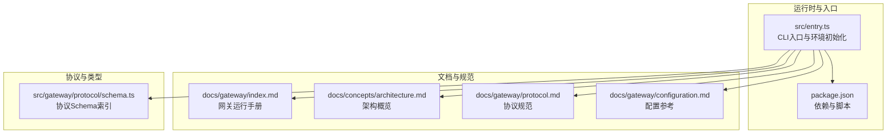
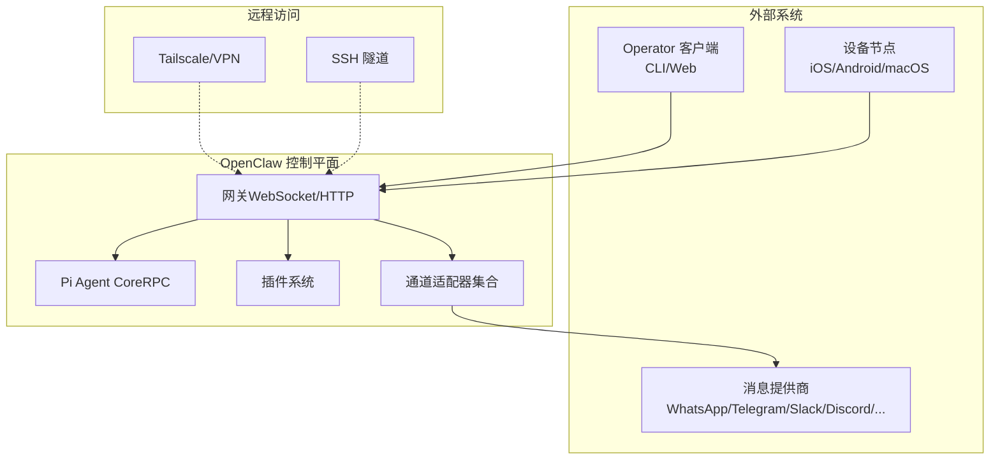
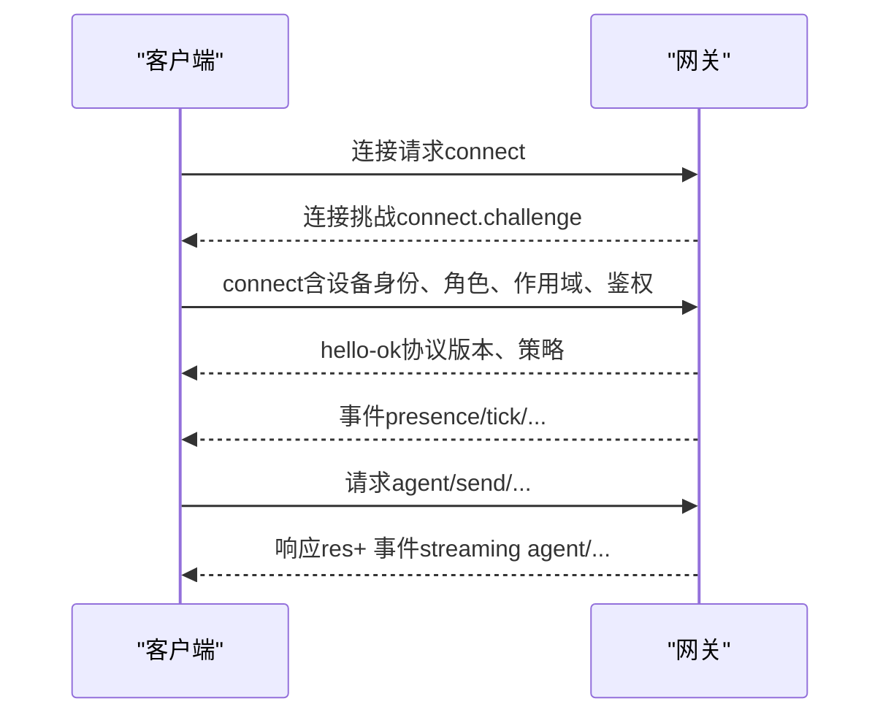
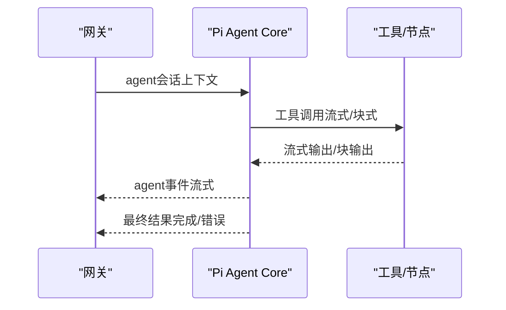
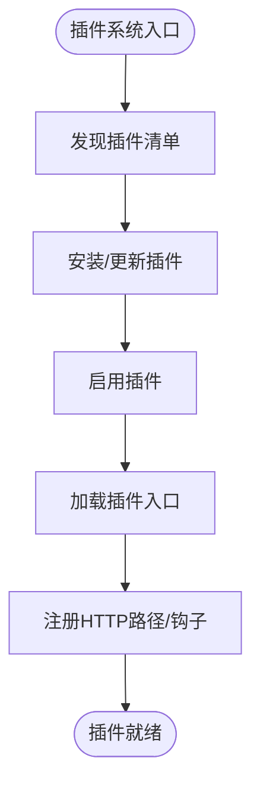
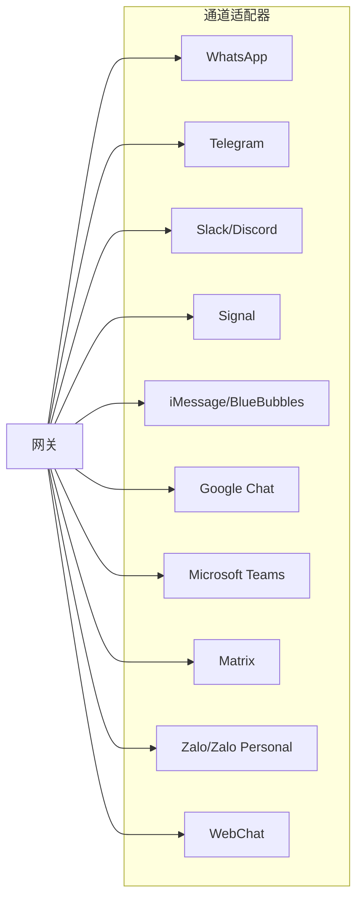
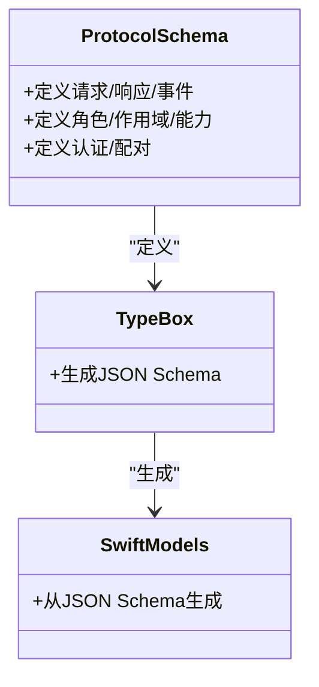
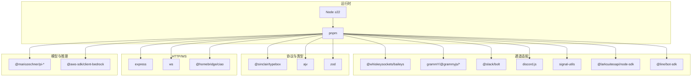

# 系统架构

<cite>
**本文引用的文件**
- [README.md](file://README.md)
- [docs/gateway/index.md](file://docs/gateway/index.md)
- [docs/concepts/architecture.md](file://docs/concepts/architecture.md)
- [docs/gateway/protocol.md](file://docs/gateway/protocol.md)
- [docs/gateway/configuration.md](file://docs/gateway/configuration.md)
- [package.json](file://package.json)
- [src/entry.ts](file://src/entry.ts)
- [src/gateway/protocol/schema.ts](file://src/gateway/protocol/schema.ts)
</cite>

## 目录

1. [引言](#引言)
2. [项目结构](#项目结构)
3. [核心组件](#核心组件)
4. [架构总览](#架构总览)
5. [详细组件分析](#详细组件分析)
6. [依赖分析](#依赖分析)
7. [性能考量](#性能考量)
8. [故障排查指南](#故障排查指南)
9. [结论](#结论)
10. [附录](#附录)

## 引言

本文件面向OpenClaw系统，聚焦于“基于WebSocket的网关控制平面架构”，系统化阐述组件交互、数据流与职责边界，并对Pi Agent Core集成、插件系统设计、消息渠道适配器架构等核心设计模式进行深入解析。同时覆盖系统边界、技术决策与权衡、基础设施需求、可扩展性与部署拓扑、以及安全、监控与灾难恢复等横切关注点；最后给出技术栈、第三方依赖与版本兼容性说明。

## 项目结构

OpenClaw采用多模块、多语言混合的工程组织方式：核心以TypeScript实现，通过包管理器统一构建与分发；Swift用于部分平台客户端与协议模型生成；Node生态提供运行时与工具链；大量扩展（extensions）与技能（skills）作为插件化能力注入。

- 核心入口与运行时
  - CLI入口脚本负责环境标准化、实验性警告抑制与子进程桥接，随后交由CLI主流程执行。
  - 包配置定义了Node运行时要求、依赖版本、脚本任务与导出接口。
- 文档与规范
  - 网关运行手册、架构概览、协议规范与配置参考构成系统设计与运维的权威依据。
- 协议与类型
  - 协议Schema由TypeBox定义并通过代码生成工具链生成JSON Schema与Swift模型，确保跨语言一致性。

图表来源

- [src/entry.ts](file://src/entry.ts#L1-L172)
- [package.json](file://package.json#L1-L219)
- [docs/gateway/index.md](file://docs/gateway/index.md#L1-L255)
- [docs/concepts/architecture.md](file://docs/concepts/architecture.md#L1-L134)
- [docs/gateway/protocol.md](file://docs/gateway/protocol.md#L1-L222)
- [docs/gateway/configuration.md](file://docs/gateway/configuration.md#L1-L483)
- [src/gateway/protocol/schema.ts](file://src/gateway/protocol/schema.ts#L1-L17)

章节来源

- [README.md](file://README.md#L1-L550)
- [package.json](file://package.json#L1-L219)
- [src/entry.ts](file://src/entry.ts#L1-L172)
- [docs/gateway/index.md](file://docs/gateway/index.md#L1-L255)
- [docs/concepts/architecture.md](file://docs/concepts/architecture.md#L1-L134)
- [docs/gateway/protocol.md](file://docs/gateway/protocol.md#L1-L222)
- [docs/gateway/configuration.md](file://docs/gateway/configuration.md#L1-L483)
- [src/gateway/protocol/schema.ts](file://src/gateway/protocol/schema.ts#L1-L17)

## 核心组件

- 网关（Gateway）
  - 单一长连接控制平面，承载会话、通道、工具与事件的统一调度；提供WebSocket控制/RPC、HTTP API（OpenAI兼容、Responses、工具调用）、控制UI与钩子。
  - 默认绑定回环地址，需认证访问；支持热重载与多实例隔离。
- 客户端（Operator/CLI/Web）
  - 通过WebSocket连接，发送请求并订阅事件；具备身份与权限声明。
- 节点（Node）
  - 设备能力宿主，声明能力集与命令白名单，执行本地动作（相机、屏幕、画布、系统命令等）。
- Pi Agent Core（RPC模式）
  - 以RPC模式运行的智能体内核，支持工具流式与块流式输出，与网关通过协议交互。
- 插件系统
  - 扩展能力通过插件清单、发现、安装与加载机制实现；支持HTTP路径注册与全局钩子运行。
- 消息渠道适配器
  - 基于各平台SDK或官方库的适配层，统一抽象为通道（channels），在网关中集中编排与路由。

章节来源

- [docs/concepts/architecture.md](file://docs/concepts/architecture.md#L12-L134)
- [docs/gateway/protocol.md](file://docs/gateway/protocol.md#L10-L222)
- [docs/gateway/index.md](file://docs/gateway/index.md#L62-L255)
- [docs/gateway/configuration.md](file://docs/gateway/configuration.md#L1-L483)

## 架构总览

下图展示OpenClaw的系统边界、组件与数据流。网关作为控制平面，统一接入Operator客户端（CLI/Web）、节点设备与Pi Agent Core；通道适配器负责与外部IM服务通信；插件系统提供扩展能力；远程访问通过Tailscale/SSH隧道实现。

图表来源

- [docs/concepts/architecture.md](file://docs/concepts/architecture.md#L12-L134)
- [docs/gateway/index.md](file://docs/gateway/index.md#L101-L117)
- [docs/gateway/protocol.md](file://docs/gateway/protocol.md#L10-L222)

## 详细组件分析

### 组件A：网关控制平面（WebSocket + HTTP）

- 角色与职责
  - 维护通道连接与状态，暴露Typed WS API（请求/响应/事件推送），校验帧合法性。
  - 提供健康检查、心跳、存在性、会话、工具调用、节点管理、审批与钩子等完整控制面能力。
- 运行与生命周期
  - 默认绑定回环，需认证；支持launchd/systemd守护；提供健康检查与诊断命令。
  - 支持热重载策略（hybrid/hot/restart/off），区分可热应用与需重启的变更。
- 远程访问
  - 推荐Tailscale/VPN，或SSH隧道；同一套握手与鉴权适用于隧道后端。

图表来源

- [docs/concepts/architecture.md](file://docs/concepts/architecture.md#L56-L76)
- [docs/gateway/protocol.md](file://docs/gateway/protocol.md#L22-L91)

章节来源

- [docs/gateway/index.md](file://docs/gateway/index.md#L62-L255)
- [docs/concepts/architecture.md](file://docs/concepts/architecture.md#L12-L134)
- [docs/gateway/protocol.md](file://docs/gateway/protocol.md#L10-L222)

### 组件B：Pi Agent Core集成（RPC模式）

- 设计要点
  - 以RPC模式运行，支持工具流式与块流式输出，与网关通过协议方法交互。
  - 通过会话与工作区隔离，结合沙箱策略保障安全。
- 数据流
  - 网关发起agent调用，Pi Agent Core执行并返回事件流，最终汇总完成状态。

图表来源

- [docs/concepts/architecture.md](file://docs/concepts/architecture.md#L14-L22)
- [docs/gateway/protocol.md](file://docs/gateway/protocol.md#L195-L222)

章节来源

- [docs/concepts/architecture.md](file://docs/concepts/architecture.md#L12-L134)
- [docs/gateway/protocol.md](file://docs/gateway/protocol.md#L178-L222)

### 组件C：插件系统设计

- 清单与发现
  - 插件清单定义元数据、入口与能力；通过发现机制注册到系统。
- 安装与加载
  - 支持安装、启用与禁用；加载器按约定解析入口并注入运行时。
- HTTP路径与钩子
  - 插件可注册HTTP路径，作为网关的扩展API；支持全局钩子运行。
- 配置与状态
  - 插件配置与状态独立管理，支持版本同步与一致性校验。

图表来源

- [docs/gateway/configuration.md](file://docs/gateway/configuration.md#L306-L328)

章节来源

- [docs/gateway/configuration.md](file://docs/gateway/configuration.md#L306-L328)

### 组件D：消息渠道适配器架构

- 适配器模式
  - 各IM平台通过适配器封装差异，统一对外接口；网关集中编排路由与策略。
- 典型通道
  - WhatsApp（Baileys）、Telegram（grammY）、Slack（Bolt）、Discord（discord.js）、Signal（signal-cli）、iMessage（BlueBubbles/legacy）、Google Chat、Microsoft Teams、Matrix、Zalo/Zalo Personal、WebChat等。
- 路由与规则
  - 支持按通道/账号/群组路由至不同代理（agents），并可设置提及门控、回复标签、分片与路由规则。

图表来源

- [docs/concepts/architecture.md](file://docs/concepts/architecture.md#L14-L22)
- [README.md](file://README.md#L146-L149)

章节来源

- [docs/concepts/architecture.md](file://docs/concepts/architecture.md#L12-L134)
- [README.md](file://README.md#L146-L149)

### 组件E：协议与类型系统

- 类型定义
  - 使用TypeBox定义协议Schema，生成JSON Schema与Swift模型，确保跨语言一致性与强约束。
- 版本与演进
  - 协议版本在Schema中集中管理，客户端声明最小/最大版本，服务端拒绝不匹配。
- 认证与配对
  - 连接阶段进行挑战/签名验证，颁发设备令牌；支持TLS与证书指纹固定。

图表来源

- [src/gateway/protocol/schema.ts](file://src/gateway/protocol/schema.ts#L1-L17)
- [docs/gateway/protocol.md](file://docs/gateway/protocol.md#L178-L216)

章节来源

- [src/gateway/protocol/schema.ts](file://src/gateway/protocol/schema.ts#L1-L17)
- [docs/gateway/protocol.md](file://docs/gateway/protocol.md#L10-L222)

## 依赖分析

- 运行时与工具链
  - Node ≥22；包管理器为pnpm；脚本任务覆盖构建、测试、协议生成与UI打包。
- 第三方依赖
  - 通道适配：Baileys（WhatsApp）、grammY（Telegram）、Bolt（Slack）、discord.js（Discord）、signal-cli（Signal）、@larksuiteoapi（飞书）、@line/bot-sdk（Line）、@xterm/headless（终端）、@whiskeysockets/baileys（WhatsApp）等。
  - 协议与类型：@sinclair/typebox、ajv、zod；JSON Schema生成与Swift模型生成。
  - HTTP与WebSocket：express、ws；网络发现：@homebridge/ciao。
  - 模型与推理：Pi Agent Core系列（@mariozechner/pi-\*）、AWS Bedrock SDK等。
  - UI与工具：@lit、chalk、commander、croner、pdfjs-dist、playwright-core、sharp、sqlite-vec等。

图表来源

- [package.json](file://package.json#L111-L164)
- [package.json](file://package.json#L165-L187)

章节来源

- [package.json](file://package.json#L1-L219)

## 性能考量

- 单一网关控制平面
  - 将所有通道与工具收敛于单一进程，降低跨进程通信开销，提升事件一致性与低延迟交互体验。
- 多路复用端口
  - WebSocket控制/RPC、HTTP API与控制UI共用端口，减少网络连接数与资源占用。
- 热重载与渐进式变更
  - hybrid模式优先热应用安全变更，自动重启关键变更，降低维护窗口。
- 并发与批处理
  - 通道适配器与工具调用支持并发与批处理，结合限流与节流策略平衡吞吐与稳定性。
- 存储与缓存
  - SQLite向量（sqlite-vec）与内存缓存用于检索加速；媒体管线限制尺寸与生命周期，避免磁盘膨胀。

## 故障排查指南

- 连接与认证
  - 非回环绑定且未配置认证会被拒绝；端口冲突（EADDRINUSE）需释放端口；连接阶段鉴权不匹配将被关闭。
- 状态与健康
  - 使用`gateway status`、`health`与`logs --follow`进行健康检查与日志追踪；通道就绪可通过`channels status --probe`验证。
- 配置问题
  - 严格校验导致启动失败时，使用`doctor`定位具体字段与修复建议；必要时使用`doctor --fix`自动修复。
- 事件与重连
  - 事件不重放，断线后需刷新健康与系统存在性快照再继续。

章节来源

- [docs/gateway/index.md](file://docs/gateway/index.md#L228-L238)
- [docs/gateway/index.md](file://docs/gateway/index.md#L209-L227)

## 结论

OpenClaw以“单一网关控制平面 + 多客户端/节点 + 插件化扩展”的架构实现了跨渠道、跨平台的个人AI助手。通过严格的协议与类型系统、完善的认证与配对机制、以及可热重载的配置体系，系统在易用性、安全性与可运维性之间取得良好平衡。Pi Agent Core与通道适配器的解耦设计，使系统具备强大的扩展性与跨平台能力；结合Tailscale/SSH的远程访问方案，满足远程部署与多场景使用需求。

## 附录

### 系统边界与职责划分

- 边界
  - 网关：控制平面与事件中枢；通道适配器：外部IM接入；插件系统：能力扩展；Pi Agent Core：智能体执行；节点：设备能力宿主。
- 职责
  - 网关：统一鉴权、路由、会话与事件；通道：消息收发与状态；插件：API与钩子扩展；Pi Agent Core：推理与工具调用；节点：本地能力与权限管理。

章节来源

- [docs/concepts/architecture.md](file://docs/concepts/architecture.md#L12-L134)

### 技术决策与权衡

- 选择WebSocket作为统一传输
  - 优势：低延迟、事件流式推送、跨语言模型生成；权衡：需要严格的握手与鉴权策略。
- 单一网关
  - 优势：简化运维、统一会话与路由；权衡：单点压力与可用性要求更高。
- 插件化与适配器
  - 优势：快速扩展新渠道与能力；权衡：类型一致性与安全管控。
- Pi Agent Core RPC
  - 优势：推理与工具解耦、便于测试与替换；权衡：跨进程通信与一致性成本。

章节来源

- [docs/gateway/protocol.md](file://docs/gateway/protocol.md#L10-L222)
- [docs/concepts/architecture.md](file://docs/concepts/architecture.md#L12-L134)

### 基础设施需求与部署拓扑

- 基础设施
  - Node ≥22；Docker（可选，用于沙箱）；Tailscale/VPN或SSH隧道；反向代理与证书（可选）。
- 部署拓扑
  - 网关单实例或多实例（隔离/冗余）；通道连接与工具执行在网关主机；节点设备通过WebSocket或隧道连接；远程访问通过Tailscale/SSH。

章节来源

- [docs/gateway/index.md](file://docs/gateway/index.md#L101-L184)
- [docs/gateway/configuration.md](file://docs/gateway/configuration.md#L330-L369)

### 安全、监控与灾难恢复

- 安全
  - 回环绑定默认开启认证；设备配对与挑战签名；TLS与证书指纹固定；沙箱与权限控制。
- 监控
  - 健康检查、日志追踪、事件快照与诊断命令；通道状态探测。
- 灾难恢复
  - 多实例与配置热重载；备份与恢复配置；服务守护与自动重启。

章节来源

- [docs/gateway/protocol.md](file://docs/gateway/protocol.md#L187-L216)
- [docs/gateway/index.md](file://docs/gateway/index.md#L118-L163)

### 技术栈、第三方依赖与版本兼容性

- 运行时：Node ≥22；包管理：pnpm；脚本：Vitest、Rolldown、tsdown。
- 通道适配：Baileys、grammY、Bolt、discord.js、signal-utils、@larksuiteoapi、@line/bot-sdk等。
- 协议与类型：TypeBox、AJV、Zod；JSON Schema与Swift模型生成。
- HTTP/WS：Express、ws；网络发现：@homebridge/ciao。
- 模型与推理：Pi Agent Core系列、AWS Bedrock SDK。
- UI与工具：@lit、chalk、commander、croner、pdfjs-dist、playwright-core、sharp、sqlite-vec。

章节来源

- [package.json](file://package.json#L111-L164)
- [package.json](file://package.json#L165-L187)
